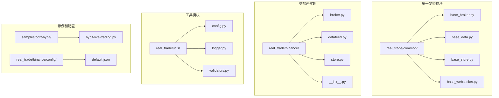
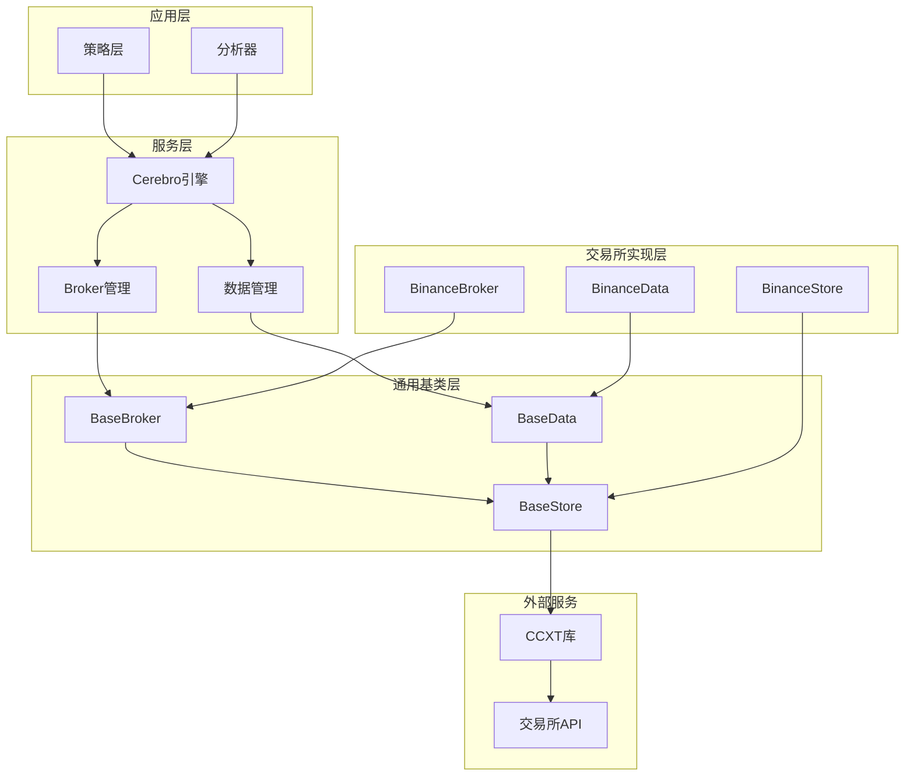
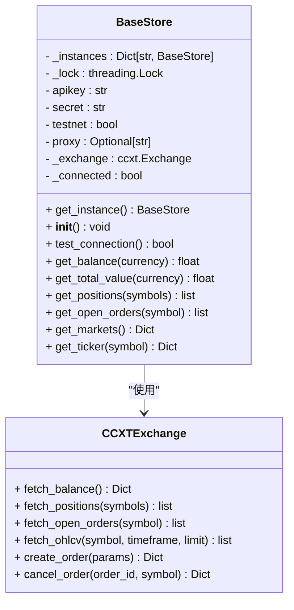
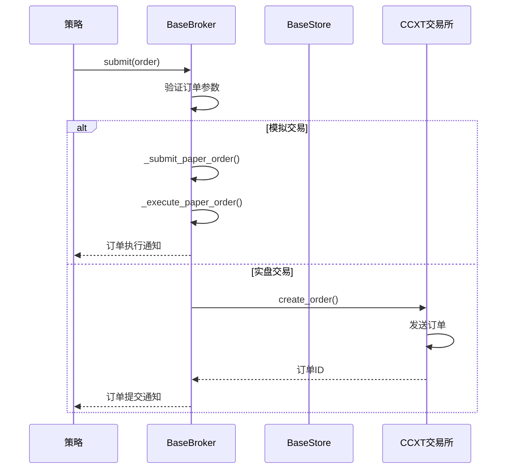
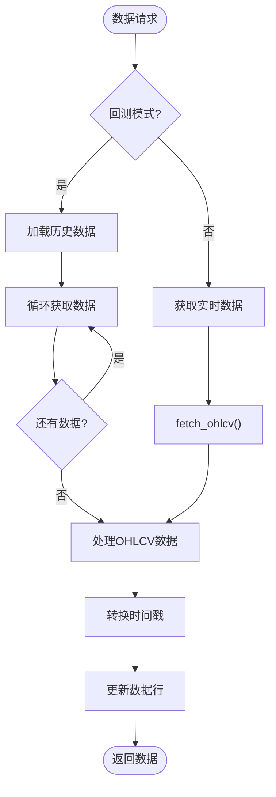
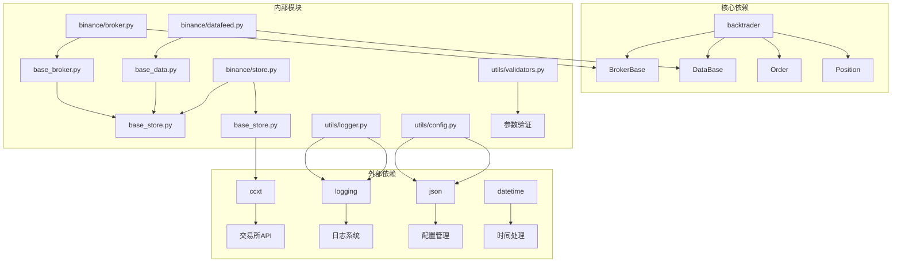

# Bybit交易所集成

<cite>
**本文档引用的文件**
- [real_trade/common/base_broker.py](file://real_trade/common/base_broker.py)
- [real_trade/common/base_data.py](file://real_trade/common/base_data.py)
- [real_trade/common/base_store.py](file://real_trade/common/base_store.py)
- [real_trade/binance/broker.py](file://real_trade/binance/broker.py)
- [real_trade/binance/datafeed.py](file://real_trade/binance/datafeed.py)
- [real_trade/binance/store.py](file://real_trade/binance/store.py)
- [real_trade/binance/__init__.py](file://real_trade/binance/__init__.py)
- [real_trade/binance/config/default.json](file://real_trade/binance/config/default.json)
- [real_trade/utils/config.py](file://real_trade/utils/config.py)
- [real_trade/utils/logger.py](file://real_trade/utils/logger.py)
- [samples/ccxt-bybit/bybit-live-trading.py](file://samples/ccxt-bybit/bybit-live-trading.py)
</cite>

## 更新摘要
**变更内容**
- 更新架构概述以反映新的统一架构设计
- 移除Bybit特定实现的描述，转而介绍通用基类架构
- 添加Binance作为主要示例交易所的说明
- 更新组件关系图以展示新的继承结构
- 修订配置管理和工具模块的使用方法
- 保持策略示例的实用性但调整实现细节

## 目录
1. [简介](#简介)
2. [项目结构](#项目结构)
3. [核心组件](#核心组件)
4. [架构概览](#架构概览)
5. [详细组件分析](#详细组件分析)
6. [依赖关系分析](#依赖关系分析)
7. [性能考虑](#性能考虑)
8. [故障排除指南](#故障排除指南)
9. [结论](#结论)
10. [附录](#附录)

## 简介

Bybit交易所集成功能现已整合到Backtrader的统一架构中，通过通用基类实现跨交易所的一致性。该系统采用全新的分层架构设计，提供了标准化的交易所连接、交易执行和数据获取能力。

**重要变更**：原有的独立Bybit集成模块已被重构并整合到新的统一架构中，通过common/base_broker.py、common/base_data.py、common/base_store.py等通用基类实现，不再单独维护Bybit特定实现。

该系统的主要特点包括：
- 基于通用基类的标准化交易所接口
- 支持测试网和主网切换
- 多种订单类型支持（市价、限价、止损）
- 实时数据流和历史数据加载
- 完整的配置管理系统
- 专业级日志记录功能

## 项目结构

新的统一架构采用清晰的分层设计，每个组件都有明确的职责分工：



**图表来源**
- [real_trade/common/base_broker.py](file://real_trade/common/base_broker.py#L1-L445)
- [real_trade/common/base_data.py](file://real_trade/common/base_data.py#L1-L211)
- [real_trade/common/base_store.py](file://real_trade/common/base_store.py#L1-L194)
- [real_trade/binance/broker.py](file://real_trade/binance/broker.py#L1-L18)
- [real_trade/binance/datafeed.py](file://real_trade/binance/datafeed.py#L1-L18)
- [real_trade/binance/store.py](file://real_trade/binance/store.py#L1-L96)

**章节来源**
- [real_trade/common/base_broker.py](file://real_trade/common/base_broker.py#L1-L445)
- [real_trade/common/base_data.py](file://real_trade/common/base_data.py#L1-L211)
- [real_trade/common/base_store.py](file://real_trade/common/base_store.py#L1-L194)
- [real_trade/binance/broker.py](file://real_trade/binance/broker.py#L1-L18)
- [real_trade/binance/datafeed.py](file://real_trade/binance/datafeed.py#L1-L18)
- [real_trade/binance/store.py](file://real_trade/binance/store.py#L1-L96)

## 核心组件

### 通用基类架构

新的统一架构通过三个核心基类提供标准化功能：

#### BaseStore - 交易所连接管理基类

BaseStore是所有交易所连接的抽象基类，实现了线程安全的单例模式和统一的连接管理接口。

**核心功能：**
- 单例模式连接管理
- 测试网和主网支持
- 连接池管理
- 线程安全保障
- 市场数据获取

**关键特性：**
- 使用`_instances`字典缓存不同配置的连接实例
- 支持代理服务器配置
- 提供余额查询、持仓管理、订单查询等功能
- 自动处理测试网URL重定向

#### BaseData - 数据源基类

BaseData提供统一的数据获取接口，支持实时数据流和历史数据加载。

**核心功能：**
- 实时OHLCV数据流
- 历史数据批量加载
- 多时间周期支持
- 自动时间戳转换
- 回测模式兼容

**时间周期支持：**
- 分钟级：1m, 3m, 5m, 15m, 30m
- 小时级：1h, 2h, 4h, 6h, 12h
- 日级：1d
- 周级：1w
- 月级：1M

#### BaseBroker - 交易经纪商基类

BaseBroker实现了完整的订单生命周期管理，支持模拟和实盘两种交易模式。

**核心功能：**
- 模拟交易模式（Paper Trading）
- 实盘交易模式（Live Trading）
- 多种订单类型支持
- 持仓管理
- 资金管理
- 订单跟踪和状态查询

**交易流程：**
1. 订单提交验证
2. 模拟或实盘执行
3. 状态更新通知
4. 持仓和资金调整

## 架构概览

新的统一架构采用了更加清晰的分层设计，确保各组件之间的松耦合和高内聚：



**图表来源**
- [real_trade/common/base_store.py](file://real_trade/common/base_store.py#L17-L101)
- [real_trade/common/base_data.py](file://real_trade/common/base_data.py#L17-L68)
- [real_trade/common/base_broker.py](file://real_trade/common/base_broker.py#L17-L60)
- [real_trade/binance/store.py](file://real_trade/binance/store.py#L17-L63)

## 详细组件分析

### BaseStore组件深度分析

BaseStore实现了线程安全的单例模式，通过`get_instance`方法确保相同配置的连接共享同一个实例。



**图表来源**
- [real_trade/common/base_store.py](file://real_trade/common/base_store.py#L17-L194)

**核心实现要点：**
- 使用双重检查锁定模式确保线程安全
- 支持测试网和主网URL配置
- 提供完整的交易所API封装
- 自动处理连接状态管理

**章节来源**
- [real_trade/common/base_store.py](file://real_trade/common/base_store.py#L17-L194)

### BaseBroker组件深度分析

BaseBroker实现了完整的订单生命周期管理，支持模拟和实盘两种交易模式。



**图表来源**
- [real_trade/common/base_broker.py](file://real_trade/common/base_broker.py#L188-L262)

**交易流程特性：**
- 支持市价单、限价单、止损单
- 实时订单状态跟踪
- 模拟交易的精确资金计算
- 实盘交易的错误处理和重试机制

**章节来源**
- [real_trade/common/base_broker.py](file://real_trade/common/base_broker.py#L188-L445)

### BaseData组件深度分析

BaseData提供了灵活的数据获取机制，支持实时流和历史回测两种模式。



**图表来源**
- [real_trade/common/base_data.py](file://real_trade/common/base_data.py#L146-L203)

**数据处理特性：**
- 自动时间戳转换和格式化
- 支持自定义历史数据范围
- 实时数据的增量更新
- 错误处理和数据完整性检查

**章节来源**
- [real_trade/common/base_data.py](file://real_trade/common/base_data.py#L146-L211)

## 依赖关系分析

新的统一架构依赖关系更加清晰，遵循单一职责原则：



**图表来源**
- [real_trade/common/base_broker.py](file://real_trade/common/base_broker.py#L14-L17)
- [real_trade/common/base_data.py](file://real_trade/common/base_data.py#L14-L17)
- [real_trade/common/base_store.py](file://real_trade/common/base_store.py#L11-L14)

**依赖管理策略：**
- 明确的模块边界和接口定义
- 最小化外部依赖
- 内部工具模块的独立性
- 配置和验证逻辑的可重用性

**章节来源**
- [real_trade/binance/broker.py](file://real_trade/binance/broker.py#L11-L11)
- [real_trade/binance/datafeed.py](file://real_trade/binance/datafeed.py#L11-L11)
- [real_trade/binance/store.py](file://real_trade/binance/store.py#L14-L14)

## 性能考虑

### 连接优化

BaseStore通过单例模式避免重复连接，减少网络开销：
- 连接实例缓存机制
- 线程安全的并发访问
- 智能的连接状态检测

### 数据处理优化

BaseData采用高效的数据获取策略：
- 分批历史数据加载
- 实时数据的增量更新
- 内存友好的数据结构

### 交易执行优化

BaseBroker优化了订单执行流程：
- 模拟交易的本地计算
- 实盘交易的异步处理
- 批量订单管理

## 故障排除指南

### 常见问题及解决方案

**连接问题：**
- 检查API密钥和密钥的有效性
- 验证网络连接和代理设置
- 确认测试网和主网配置正确

**数据获取问题：**
- 验证交易对格式（BASE/QUOTE）
- 检查时间周期的有效性
- 确认交易所市场数据可用性

**订单执行问题：**
- 检查账户资金充足性
- 验证订单参数的合法性
- 确认交易所订单簿状态

### 调试工具

系统提供了完善的日志记录功能：
- 详细的交易执行日志
- 错误和异常处理
- 性能监控指标

**章节来源**
- [real_trade/utils/logger.py](file://real_trade/utils/logger.py#L18-L62)
- [real_trade/utils/config.py](file://real_trade/utils/config.py#L68-L95)

## 结论

Bybit交易所集成功能现已整合到Backtrader的统一架构中，提供了更加标准化和可扩展的算法交易解决方案。该系统的设计充分考虑了生产环境的需求，具有以下优势：

1. **模块化设计**：清晰的组件分离和职责划分
2. **统一接口**：通过基类提供一致的API
3. **双模式支持**：模拟交易和实盘交易的无缝切换
4. **配置灵活**：丰富的配置选项和环境变量支持
5. **工具完善**：完整的验证、日志和配置管理工具
6. **易于扩展**：良好的接口设计便于功能扩展

该集成适合构建从简单策略到复杂算法交易系统的各种应用场景，为量化交易提供了坚实的技术基础。

## 附录

### 配置参数说明

| 参数 | 类型 | 默认值 | 描述 |
|------|------|--------|------|
| exchange | str | "binance" | 交易所名称 |
| apikey | str | "" | 交易所API密钥 |
| secret | str | "" | 交易所API密钥 |
| testnet | bool | True | 是否使用测试网 |
| symbol | str | "BTC/USDT" | 交易对符号 |
| timeframe | str | "1h" | 时间周期 |
| paper_trading | bool | True | 是否启用模拟交易 |
| initial_cash | float | 10000.0 | 初始资金 |
| commission | float | 0.001 | 佣金比例 |

### API密钥配置

建议使用环境变量管理API密钥：
- RT_EXCHANGE：交易所名称
- RT_APIKEY：API密钥
- RT_SECRET：API密钥
- RT_TESTNET：测试网开关
- RT_PROXY：代理服务器地址

### 时间框架映射

支持的时间框架包括：
- 分钟级：1m, 3m, 5m, 15m, 30m
- 小时级：1h, 2h, 4h, 6h, 12h
- 日级：1d
- 周级：1w
- 月级：1M

### 交易对格式

交易对必须采用BASE/QUOTE格式，例如：
- BTC/USDT：比特币/泰达币
- ETH/USDT：以太坊/泰达币
- LTC/USDT：莱特币/泰达币

### 快速开始示例

```python
from real_trade.binance import create_binance_engine
import backtrader as bt

# 创建Binance交易引擎
store, broker, data = create_binance_engine(
    symbol='BTC/USDT', 
    timeframe='1h',
    testnet=True, 
    paper_trading=True, 
    backtest=True,
)

cerebro = bt.Cerebro()
cerebro.setbroker(broker)
cerebro.adddata(data)
cerebro.addstrategy(MyStrategy)
cerebro.run()
```