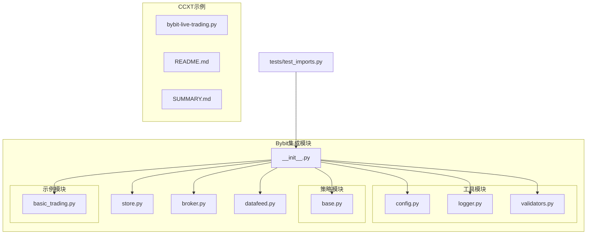
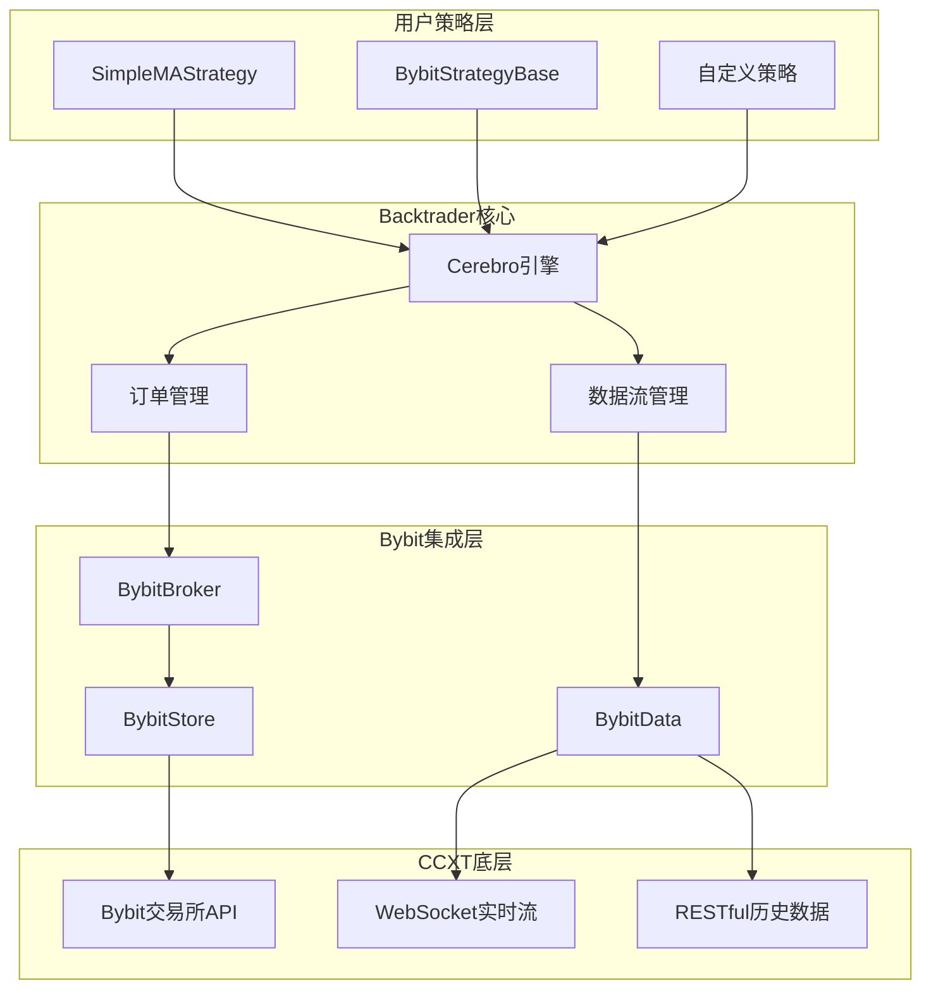
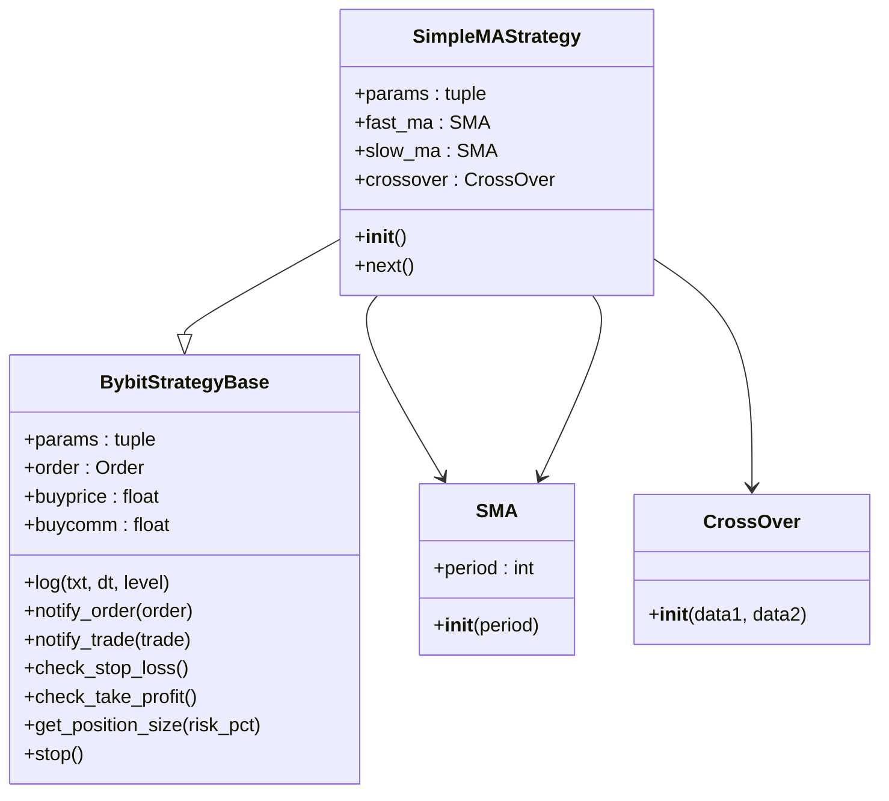
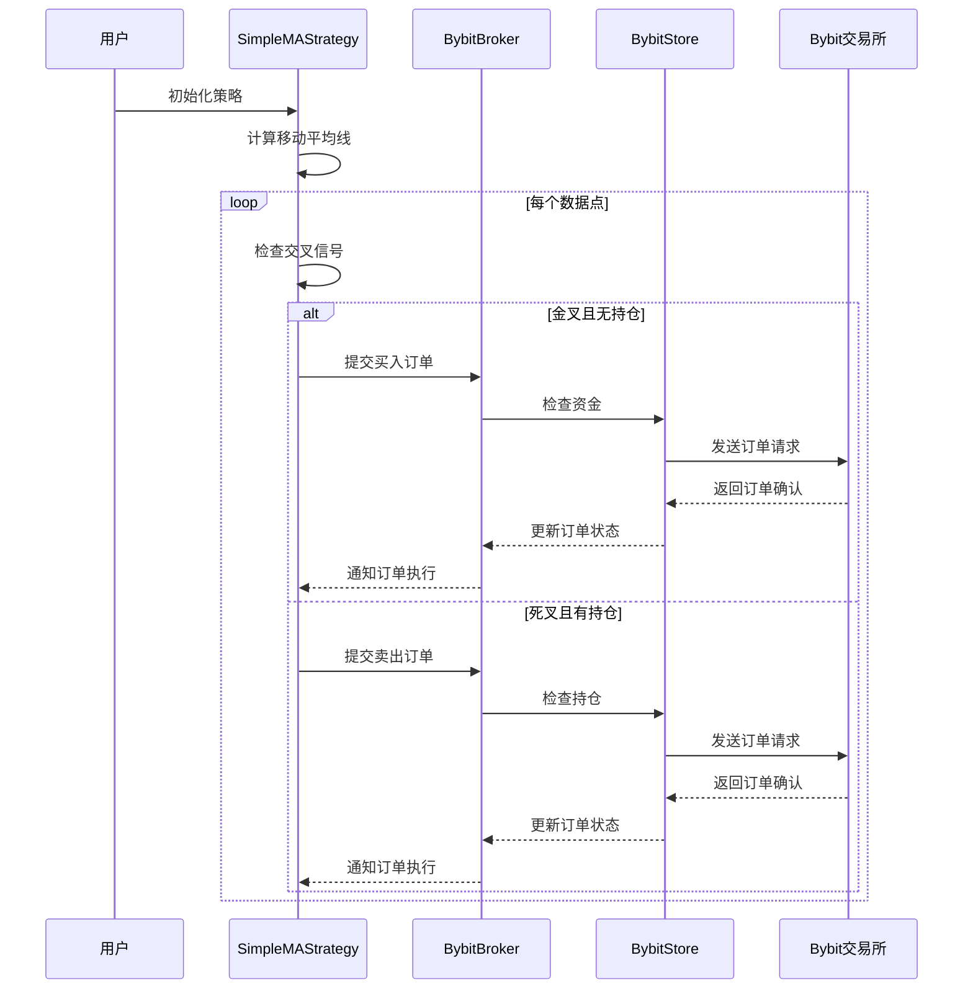
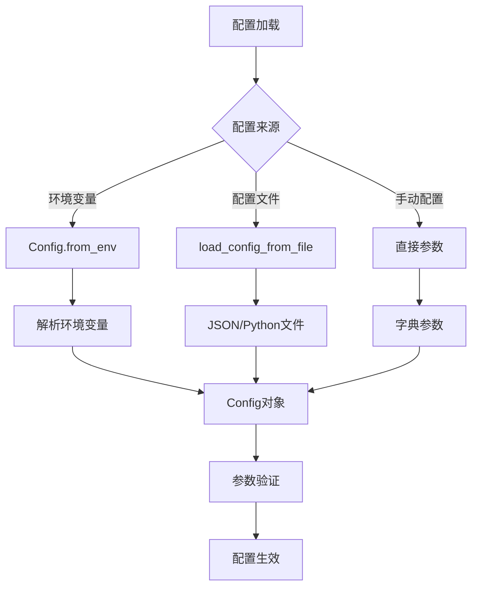

# Bybit示例与最佳实践

<cite>
**本文档引用的文件**
- [basic_trading.py](file://real_trade/bybit/examples/basic_trading.py)
- [broker.py](file://real_trade/bybit/broker.py)
- [store.py](file://real_trade/bybit/store.py)
- [datafeed.py](file://real_trade/bybit/datafeed.py)
- [config.py](file://real_trade/bybit/utils/config.py)
- [logger.py](file://real_trade/bybit/utils/logger.py)
- [validators.py](file://real_trade/bybit/utils/validators.py)
- [base.py](file://real_trade/bybit/strategies/base.py)
- [__init__.py](file://real_trade/bybit/__init__.py)
- [test_imports.py](file://real_trade/bybit/tests/test_imports.py)
- [bybit-live-trading.py](file://samples/ccxt-bybit/bybit-live-trading.py)
- [README.md](file://samples/ccxt-bybit/README.md)
- [SUMMARY.md](file://samples/ccxt-bybit/SUMMARY.md)
</cite>

## 目录
1. [简介](#简介)
2. [项目结构](#项目结构)
3. [核心组件](#核心组件)
4. [架构概览](#架构概览)
5. [详细组件分析](#详细组件分析)
6. [策略实现示例](#策略实现示例)
7. [最佳实践指南](#最佳实践指南)
8. [性能优化建议](#性能优化建议)
9. [故障排除指南](#故障排除指南)
10. [安全配置指南](#安全配置指南)
11. [结论](#结论)

## 简介

Bybit示例与最佳实践文档提供了完整的Backtrader与Bybit交易所集成的使用指南。该文档涵盖了从基础配置到复杂策略实现的全过程，包括环境准备、配置设置、策略编写、实盘运行等各个环节。

本文档重点介绍了两个核心实现方案：
- **官方Bybit模块**：基于real_trade/bybit模块的专业实现
- **CCXT示例**：基于CCXT库的Bybit交易示例

两个方案都提供了完整的模拟交易和实盘交易支持，以及丰富的风险管理功能。

## 项目结构

Bybit集成模块采用清晰的分层架构设计，主要包含以下核心组件：

**图表来源**
- [__init__.py](file://real_trade/bybit/__init__.py#L1-L215)
- [store.py](file://real_trade/bybit/store.py#L1-L262)
- [broker.py](file://real_trade/bybit/broker.py#L1-L381)
- [datafeed.py](file://real_trade/bybit/datafeed.py#L1-L235)

**章节来源**
- [__init__.py](file://real_trade/bybit/__init__.py#L1-L215)
- [test_imports.py](file://real_trade/bybit/tests/test_imports.py#L1-L139)

## 核心组件

### BybitStore - 交易所连接管理器

BybitStore是整个系统的基础设施组件，负责管理CCXT交易所连接和提供统一的API接口。

**核心功能**：
- 单例模式管理连接，避免重复初始化
- 支持测试网和主网切换
- 提供余额查询、持仓管理、订单查询等功能
- 线程安全的连接池管理

**关键特性**：
- 支持多种市场类型（现货、线性永续、反向合约）
- 可配置代理支持
- 自动连接测试和状态管理

### BybitBroker - 交易经纪商

BybitBroker实现了完整的订单生命周期管理，支持模拟交易和实盘交易两种模式。

**核心功能**：
- 模拟交易模式（Paper Trading）：完全在本地模拟订单执行
- 实盘交易模式（Live Trading）：直接与Bybit交易所交互
- 支持多种订单类型（市价、限价、止损）
- 完整的持仓和资金管理

**模拟交易优势**：
- 使用实时市场数据但不产生真实交易
- 可以测试策略在真实市场中的表现
- 适合策略开发和优化阶段

### BybitData - 数据源

BybitData提供了灵活的数据获取能力，支持历史数据回测和实时数据流。

**核心功能**：
- 历史数据批量下载和缓存
- 实时数据流推送
- 多时间周期支持
- 自动时间戳转换

**数据获取优化**：
- 分批获取历史数据，避免超时
- 实时数据按需获取
- 内存友好的数据管理

**章节来源**
- [store.py](file://real_trade/bybit/store.py#L16-L262)
- [broker.py](file://real_trade/bybit/broker.py#L18-L381)
- [datafeed.py](file://real_trade/bybit/datafeed.py#L19-L235)

## 架构概览

**图表来源**
- [basic_trading.py](file://real_trade/bybit/examples/basic_trading.py#L19-L39)
- [broker.py](file://real_trade/bybit/broker.py#L18-L59)
- [datafeed.py](file://real_trade/bybit/datafeed.py#L19-L88)

## 详细组件分析

### 基础交易示例分析

#### SimpleMAStrategy策略实现

SimpleMAStrategy是一个经典的移动平均线交叉策略，展示了如何在Bybit环境中实现基本的交易逻辑。

**图表来源**
- [basic_trading.py](file://real_trade/bybit/examples/basic_trading.py#L19-L39)
- [base.py](file://real_trade/bybit/strategies/base.py#L11-L191)

**策略执行流程**：

**图表来源**
- [basic_trading.py](file://real_trade/bybit/examples/basic_trading.py#L32-L38)
- [broker.py](file://real_trade/bybit/broker.py#L133-L157)

**章节来源**
- [basic_trading.py](file://real_trade/bybit/examples/basic_trading.py#L19-L119)

### 配置管理系统

配置管理系统提供了灵活的配置加载和管理能力，支持多种配置来源。

**图表来源**
- [config.py](file://real_trade/bybit/utils/config.py#L67-L81)
- [config.py](file://real_trade/bybit/utils/config.py#L96-L133)

**章节来源**
- [config.py](file://real_trade/bybit/utils/config.py#L17-L145)

### 验证器系统

验证器系统确保所有输入参数的有效性和安全性。

**核心验证功能**：
- 交易对格式验证（BASE/QUOTE格式检查）
- 时间周期有效性检查
- API密钥长度和格式验证
- 订单大小和价格范围验证

**章节来源**
- [validators.py](file://real_trade/bybit/utils/validators.py#L33-L183)

## 策略实现示例

### 趋势跟踪策略

基于移动平均线交叉的趋势跟踪策略是最经典的量化交易策略之一。

**策略要点**：
- 使用短期和长期移动平均线的交叉信号
- 金叉买入，死叉卖出
- 可结合止损止盈机制
- 支持动态仓位管理

### 均值回归策略

均值回归策略适用于震荡市场环境。

**策略原理**：
- 当价格偏离均值过多时进行反向交易
- 使用布林带或标准差作为判断标准
- 在支撑阻力位附近进行高抛低吸

### 套利交易策略

套利策略通过利用不同市场或时间点的价格差异获利。

**实施方式**：
- 跨市场套利（不同交易所间价差）
- 期现套利（期货与现货价差）
- 时间套利（不同到期日合约价差）

**章节来源**
- [base.py](file://real_trade/bybit/strategies/base.py#L151-L191)

## 最佳实践指南

### 环境准备最佳实践

1. **API密钥管理**
   - 使用环境变量存储敏感信息
   - 严格控制API密钥权限
   - 定期轮换API密钥

2. **网络配置**
   - 配置稳定的网络连接
   - 设置适当的超时参数
   - 考虑使用代理服务器

3. **数据准备**
   - 充分的历史数据回测
   - 实时数据流监控
   - 数据质量验证

### 风险管理最佳实践

1. **资金管理**
   - 设定每日最大亏损限额
   - 分散投资组合风险
   - 动态调整仓位规模

2. **订单管理**
   - 设置止损和止盈点
   - 监控订单执行状态
   - 处理部分成交情况

3. **系统监控**
   - 实时监控账户状态
   - 设置异常告警机制
   - 定期备份交易记录

### 实盘运行最佳实践

1. **逐步推进**
   - 先进行回测验证
   - 再进行模拟交易
   - 最后小额实盘验证

2. **策略优化**
   - 参数敏感性分析
   - 最优参数搜索
   - 风险调整收益评估

3. **持续改进**
   - 定期策略评估
   - 市场适应性调整
   - 技术指标优化

## 性能优化建议

### 数据获取优化

1. **批量数据处理**
   - 合理设置历史数据获取批次
   - 缓存常用数据减少重复请求
   - 异步数据获取提高效率

2. **内存管理**
   - 及时清理不再使用的数据
   - 使用生成器处理大数据集
   - 监控内存使用情况

### 订单执行优化

1. **订单类型选择**
   - 市价单适合流动性充足的市场
   - 限价单适合精确价格控制
   - 止损单自动风险管理

2. **执行策略**
   - 分批执行大额订单
   - 监控市场深度变化
   - 避免在关键时刻下单

### 系统性能优化

1. **并发处理**
   - 多线程处理独立任务
   - 异步I/O操作
   - 连接池复用

2. **资源管理**
   - 合理设置超时时间
   - 监控系统资源使用
   - 定期清理临时文件

## 故障排除指南

### 常见问题及解决方案

**API连接问题**：
- 检查网络连接稳定性
- 验证API密钥有效性
- 确认IP白名单设置
- 检查代理配置

**数据同步问题**：
- 检查时间同步设置
- 验证数据完整性
- 监控数据延迟情况
- 处理数据缺失情况

**订单执行问题**：
- 检查账户余额充足性
- 验证订单参数正确性
- 监控市场流动性状况
- 处理订单超时情况

### 调试技巧

1. **日志记录**
   - 启用详细日志输出
   - 记录关键事件和错误
   - 分析日志模式识别问题

2. **监控指标**
   - 监控API调用频率
   - 跟踪系统资源使用
   - 观察市场数据变化

3. **测试策略**
   - 单元测试验证核心功能
   - 集成测试验证完整流程
   - 回放测试验证历史表现

**章节来源**
- [README.md](file://samples/ccxt-bybit/README.md#L345-L382)

## 安全配置指南

### API密钥保护

1. **存储安全**
   - 使用环境变量存储API密钥
   - 避免硬编码在源代码中
   - 使用加密存储敏感信息

2. **权限控制**
   - 限制API密钥功能权限
   - 设置IP白名单访问
   - 定期轮换API密钥

3. **传输安全**
   - 使用HTTPS协议通信
   - 避免在日志中输出密钥
   - 定期检查密钥泄露风险

### 访问控制

1. **系统访问**
   - 限制系统管理员权限
   - 使用SSH密钥认证
   - 配置防火墙规则

2. **应用访问**
   - 实施用户身份验证
   - 设置会话超时机制
   - 监控异常登录行为

### 审计日志

1. **操作日志**
   - 记录所有重要操作
   - 包含操作时间和用户信息
   - 保留足够的历史记录

2. **安全日志**
   - 监控异常访问行为
   - 记录API调用统计
   - 跟踪系统错误和异常

### 网络安全

1. **连接安全**
   - 使用TLS加密通信
   - 配置SSL证书验证
   - 监控网络流量异常

2. **防火墙配置**
   - 限制外部访问端口
   - 配置入侵检测系统
   - 定期更新安全策略

## 结论

Bybit示例与最佳实践文档提供了完整的量化交易解决方案。通过官方Bybit模块和CCXT示例，用户可以快速搭建专业级的算法交易系统。

**关键优势**：
- 完整的模拟和实盘交易支持
- 灵活的配置管理系统
- 丰富的风险管理功能
- 专业的性能优化建议
- 全面的安全配置指导

**实施建议**：
1. 从基础示例开始，逐步深入理解系统架构
2. 充分进行回测和模拟交易验证
3. 建立完善的风险管理体系
4. 制定严格的合规和安全制度
5. 持续监控和优化交易系统

通过遵循本文档的最佳实践，用户可以构建稳定、高效、安全的Bybit交易系统，在竞争激烈的量化交易市场中获得持续的收益。