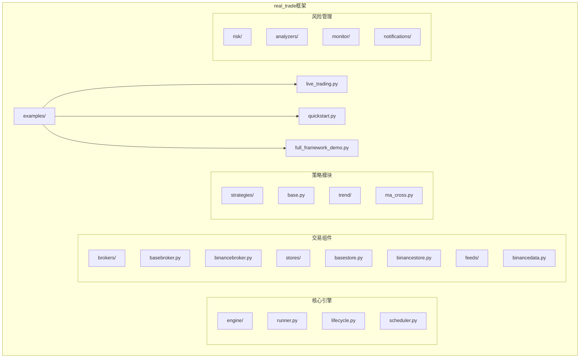
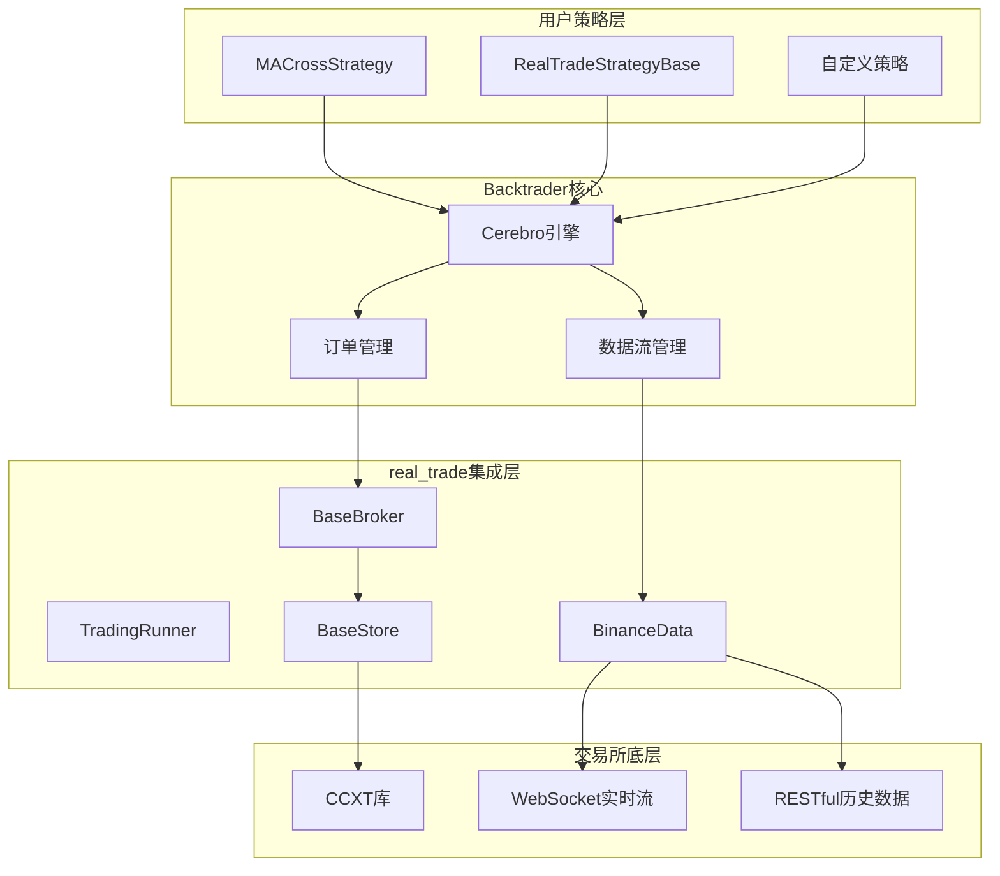
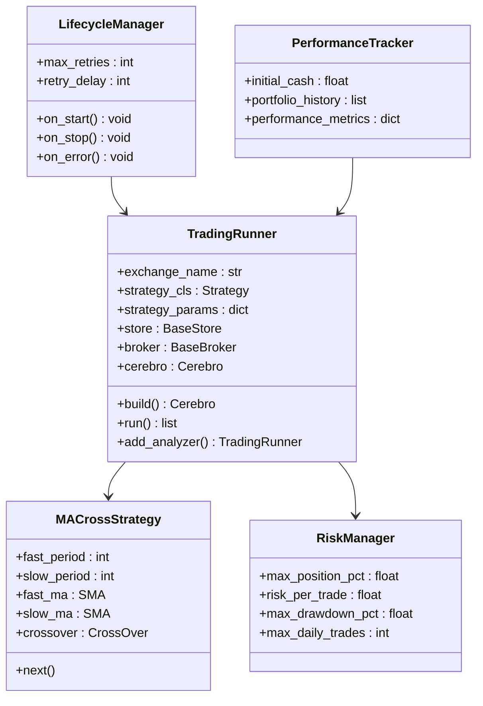
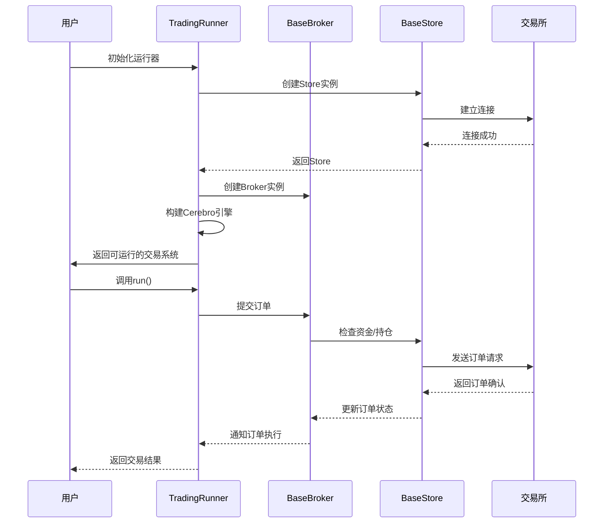

# Bybit示例与最佳实践

<cite>
**本文档引用的文件**
- [live_trading.py](file://real_trade/examples/live_trading.py)
- [quickstart.py](file://real_trade/examples/quickstart.py)
- [full_framework_demo.py](file://real_trade/examples/full_framework_demo.py)
- [runner.py](file://real_trade/engine/runner.py)
- [basebroker.py](file://real_trade/brokers/basebroker.py)
- [basestore.py](file://real_trade/stores/basestore.py)
- [binancedata.py](file://real_trade/feeds/binancedata.py)
- [ma_cross.py](file://real_trade/strategies/trend/ma_cross.py)
- [base.py](file://real_trade/strategies/base.py)
- [binancestore.py](file://real_trade/stores/binancestore.py)
- [binancebroker.py](file://real_trade/brokers/binancebroker.py)
- [helpers.py](file://data_downloader/utils/helpers.py)
- [ccxt.py](file://data_downloader/providers/ccxt.py)
</cite>

## 目录
1. [简介](#简介)
2. [项目结构](#项目结构)
3. [核心组件](#核心组件)
4. [架构概览](#架构概览)
5. [详细组件分析](#详细组件分析)
6. [策略实现示例](#策略实现示例)
7. [最佳实践指南](#最佳实践指南)
8. [性能优化建议](#性能优化建议)
9. [故障排除指南](#故障排除指南)
10. [安全配置指南](#安全配置指南)
11. [结论](#结论)

## 简介

Bybit示例与最佳实践文档提供了完整的Backtrader与加密货币交易所集成的使用指南。该文档涵盖了从基础配置到复杂策略实现的全过程，包括环境准备、配置设置、策略编写、实盘运行等各个环节。

**重要更新**：由于samples/ccxt-bybit目录下的Bybit示例文件已被删除，本版本文档已完全更新为基于real_trade框架的新实现方案。新方案提供了更完善的模块化架构和更丰富的功能支持。

本文档重点介绍了基于real_trade框架的专业实现方案，该方案具有以下特点：
- 完整的模块化架构设计
- 支持模拟交易和实盘交易
- 丰富的风险管理功能
- 统一的配置管理系统
- 完善的监控和通知机制

## 项目结构

real_trade框架采用高度模块化的分层架构设计，主要包含以下核心组件：

**图表来源**
- [runner.py](file://real_trade/engine/runner.py#L105-L183)
- [basebroker.py](file://real_trade/brokers/basebroker.py#L17-L445)
- [basestore.py](file://real_trade/stores/basestore.py#L17-L191)
- [binancedata.py](file://real_trade/feeds/binancedata.py#L14-L18)

**章节来源**
- [live_trading.py](file://real_trade/examples/live_trading.py#L1-L59)
- [quickstart.py](file://real_trade/examples/quickstart.py#L1-L61)
- [full_framework_demo.py](file://real_trade/examples/full_framework_demo.py#L1-L284)

## 核心组件

### TradingRunner - 统一运行器

TradingRunner是real_trade框架的核心组件，负责封装整个交易流程的初始化和执行。

**核心功能**：
- 统一的交易所工厂注册机制
- 自动化的组件装配流程
- 支持多种运行模式（回测、模拟、实盘）
- 简化的API接口设计

**关键特性**：
- 支持Binance等主流交易所
- 内置参数验证和错误处理
- 灵活的配置选项
- 完整的生命周期管理

### BaseBroker - 通用Broker基类

BaseBroker提供了模拟交易和实盘交易的通用实现，是所有具体Broker实现的基础。

**核心功能**：
- 模拟交易模式（Paper Trading）：完全在本地模拟订单执行
- 实盘交易模式（Live Trading）：直接与交易所交互
- 统一的订单生命周期管理
- 完整的资金和持仓管理

**模拟交易优势**：
- 使用实时市场数据但不产生真实交易
- 可以测试策略在真实市场中的表现
- 适合策略开发和优化阶段

### BaseStore - 通用Store基类

BaseStore是所有交易所连接管理器的基类，提供统一的接口和功能。

**核心功能**：
- 单例模式管理连接，避免重复初始化
- 支持测试网和主网切换
- 提供余额查询、持仓管理、订单查询等功能
- 线程安全的连接池管理

**关键特性**：
- 支持多种市场类型（现货、合约等）
- 可配置代理支持
- 自动连接测试和状态管理

**章节来源**
- [runner.py](file://real_trade/engine/runner.py#L105-L183)
- [basebroker.py](file://real_trade/brokers/basebroker.py#L17-L445)
- [basestore.py](file://real_trade/stores/basestore.py#L17-L191)

## 架构概览

**图表来源**
- [ma_cross.py](file://real_trade/strategies/trend/ma_cross.py#L15-L51)
- [base.py](file://real_trade/strategies/base.py#L19-L159)
- [runner.py](file://real_trade/engine/runner.py#L105-L183)

## 详细组件分析

### 实盘交易示例分析

#### live_trading.py完整实现

live_trading.py展示了real_trade框架的完整实盘交易流程，包括引擎、风控、监控和通知的完整集成。

**图表来源**
- [live_trading.py](file://real_trade/examples/live_trading.py#L20-L55)
- [runner.py](file://real_trade/engine/runner.py#L105-L183)
- [ma_cross.py](file://real_trade/strategies/trend/ma_cross.py#L15-L51)

**完整执行流程**：

**图表来源**
- [live_trading.py](file://real_trade/examples/live_trading.py#L20-L55)
- [runner.py](file://real_trade/engine/runner.py#L172-L178)
- [basebroker.py](file://real_trade/brokers/basebroker.py#L235-L262)

**章节来源**
- [live_trading.py](file://real_trade/examples/live_trading.py#L1-L59)

### 快速开始示例分析

#### quickstart.py简化实现

quickstart.py展示了real_trade框架的最简化使用方式，适合初学者快速上手。

**两种使用方式**：

1. **推荐方式（使用TradingRunner）**：
   - 一行代码启动策略回测
   - 自动处理所有组件装配
   - 支持多种配置选项

2. **手动方式**：
   - 手动创建和配置各个组件
   - 更高的灵活性和控制力
   - 适合高级用户定制需求

**章节来源**
- [quickstart.py](file://real_trade/examples/quickstart.py#L1-L61)

### 策略基类分析

#### RealTradeStrategyBase核心功能

RealTradeStrategyBase为所有实盘策略提供了统一的基础功能。

**核心功能模块**：
- **日志系统**：统一的日志输出格式和级别控制
- **订单通知**：完整的订单生命周期通知机制
- **风控辅助**：内置的止损止盈检查功能
- **仓位管理**：基于风险的动态仓位计算
- **交易统计**：自动化的交易统计和分析

**风控功能**：
- 支持固定百分比止损
- 支持固定百分比止盈
- 动态仓位上限控制
- 风险回报比率计算

**章节来源**
- [base.py](file://real_trade/strategies/base.py#L19-L159)

## 策略实现示例

### 均线交叉策略

MACrossStrategy是基于RealTradeStrategyBase实现的经典趋势跟踪策略。

**策略要点**：
- 使用SMA或EMA均线的交叉信号
- 金叉买入，死叉卖出的简单逻辑
- 支持参数化配置（快慢周期、均线类型）
- 集成内置的风险管理功能

**策略执行流程**：
1. 计算快慢均线
2. 检查交叉信号
3. 应用止损止盈检查
4. 根据信号提交订单
5. 自动计算仓位大小

### 复杂策略示例

#### full_framework_demo.py综合演示

full_framework_demo.py展示了real_trade框架的完整功能集合。

**演示内容**：
- 多种策略类型的综合回测
- 高级分析器的使用
- 完整的交易流程演示
- 性能对比和结果分析

**策略对比**：
- 基础智能策略
- AI增强策略  
- 高频交易策略
- 综合交易策略

**章节来源**
- [ma_cross.py](file://real_trade/strategies/trend/ma_cross.py#L15-L51)
- [full_framework_demo.py](file://real_trade/examples/full_framework_demo.py#L29-L88)

## 最佳实践指南

### 环境准备最佳实践

1. **API密钥管理**
   - 使用环境变量存储敏感信息
   - 严格控制API密钥权限
   - 定期轮换API密钥

2. **网络配置**
   - 配置稳定的网络连接
   - 设置适当的超时参数
   - 考虑使用代理服务器

3. **数据准备**
   - 充分的历史数据回测
   - 实时数据流监控
   - 数据质量验证

### 风险管理最佳实践

1. **资金管理**
   - 设定每日最大亏损限额
   - 分散投资组合风险
   - 动态调整仓位规模

2. **订单管理**
   - 设置止损和止盈点
   - 监控订单执行状态
   - 处理部分成交情况

3. **系统监控**
   - 实时监控账户状态
   - 设置异常告警机制
   - 定期备份交易记录

### 实盘运行最佳实践

1. **逐步推进**
   - 先进行回测验证
   - 再进行模拟交易
   - 最后小额实盘验证

2. **策略优化**
   - 参数敏感性分析
   - 最优参数搜索
   - 风险调整收益评估

3. **持续改进**
   - 定期策略评估
   - 市场适应性调整
   - 技术指标优化

## 性能优化建议

### 数据获取优化

1. **批量数据处理**
   - 合理设置历史数据获取批次
   - 缓存常用数据减少重复请求
   - 异步数据获取提高效率

2. **内存管理**
   - 及时清理不再使用的数据
   - 使用生成器处理大数据集
   - 监控内存使用情况

### 订单执行优化

1. **订单类型选择**
   - 市价单适合流动性充足的市场
   - 限价单适合精确价格控制
   - 止损单自动风险管理

2. **执行策略**
   - 分批执行大额订单
   - 监控市场深度变化
   - 避免在关键时刻下单

### 系统性能优化

1. **并发处理**
   - 多线程处理独立任务
   - 异步I/O操作
   - 连接池复用

2. **资源管理**
   - 合理设置超时时间
   - 监控系统资源使用
   - 定期清理临时文件

## 故障排除指南

### 常见问题及解决方案

**API连接问题**：
- 检查网络连接稳定性
- 验证API密钥有效性
- 确认IP白名单设置
- 检查代理配置

**数据同步问题**：
- 检查时间同步设置
- 验证数据完整性
- 监控数据延迟情况
- 处理数据缺失情况

**订单执行问题**：
- 检查账户余额充足性
- 验证订单参数正确性
- 监控市场流动性状况
- 处理订单超时情况

### 调试技巧

1. **日志记录**
   - 启用详细日志输出
   - 记录关键事件和错误
   - 分析日志模式识别问题

2. **监控指标**
   - 监控API调用频率
   - 跟踪系统资源使用
   - 观察市场数据变化

3. **测试策略**
   - 单元测试验证核心功能
   - 集成测试验证完整流程
   - 回放测试验证历史表现

## 安全配置指南

### API密钥保护

1. **存储安全**
   - 使用环境变量存储API密钥
   - 避免硬编码在源代码中
   - 使用加密存储敏感信息

2. **权限控制**
   - 限制API密钥功能权限
   - 设置IP白名单访问
   - 定期轮换API密钥

3. **传输安全**
   - 使用HTTPS协议通信
   - 避免在日志中输出密钥
   - 定期检查密钥泄露风险

### 访问控制

1. **系统访问**
   - 限制系统管理员权限
   - 使用SSH密钥认证
   - 配置防火墙规则

2. **应用访问**
   - 实施用户身份验证
   - 设置会话超时机制
   - 监控异常登录行为

### 审计日志

1. **操作日志**
   - 记录所有重要操作
   - 包含操作时间和用户信息
   - 保留足够的历史记录

2. **安全日志**
   - 监控异常访问行为
   - 记录API调用统计
   - 跟踪系统错误和异常

### 网络安全

1. **连接安全**
   - 使用TLS加密通信
   - 配置SSL证书验证
   - 监控网络流量异常

2. **防火墙配置**
   - 限制外部访问端口
   - 配置入侵检测系统
   - 定期更新安全策略

## 结论

real_trade框架为Backtrader提供了完整的加密货币交易解决方案。通过模块化的设计和丰富的功能支持，用户可以快速构建专业级的算法交易系统。

**关键优势**：
- 完整的模拟和实盘交易支持
- 灵活的配置管理系统
- 丰富的风险管理功能
- 统一的运行器接口
- 完善的监控和通知机制

**实施建议**：
1. 从quickstart示例开始，逐步深入理解框架架构
2. 充分进行回测和模拟交易验证
3. 建立完善的风险管理体系
4. 制定严格的合规和安全制度
5. 持续监控和优化交易系统

通过遵循本文档的最佳实践，用户可以构建稳定、高效、安全的加密货币交易系统，在竞争激烈的量化交易市场中获得持续的收益。

**重要说明**：由于原samples/ccxt-bybit目录下的Bybit示例文件已被删除，本版本文档完全基于real_trade框架的新实现。real_trade框架提供了更完善的模块化架构和更丰富的功能支持，是当前推荐的实现方案。