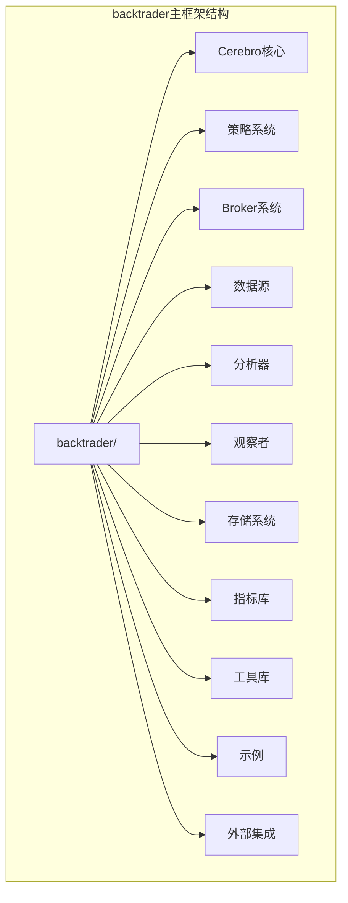
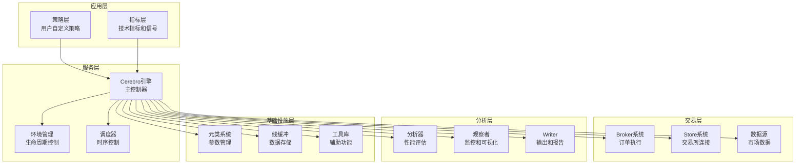
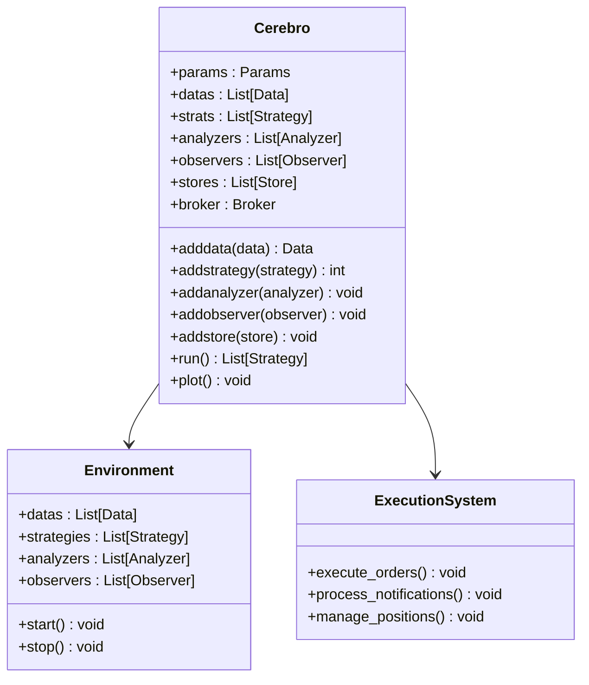
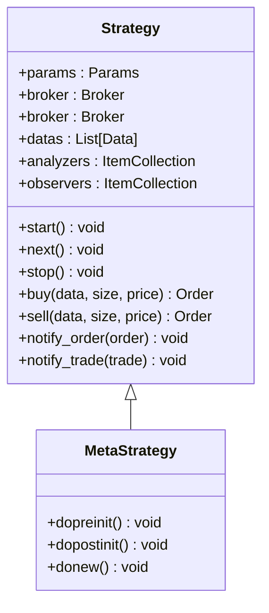
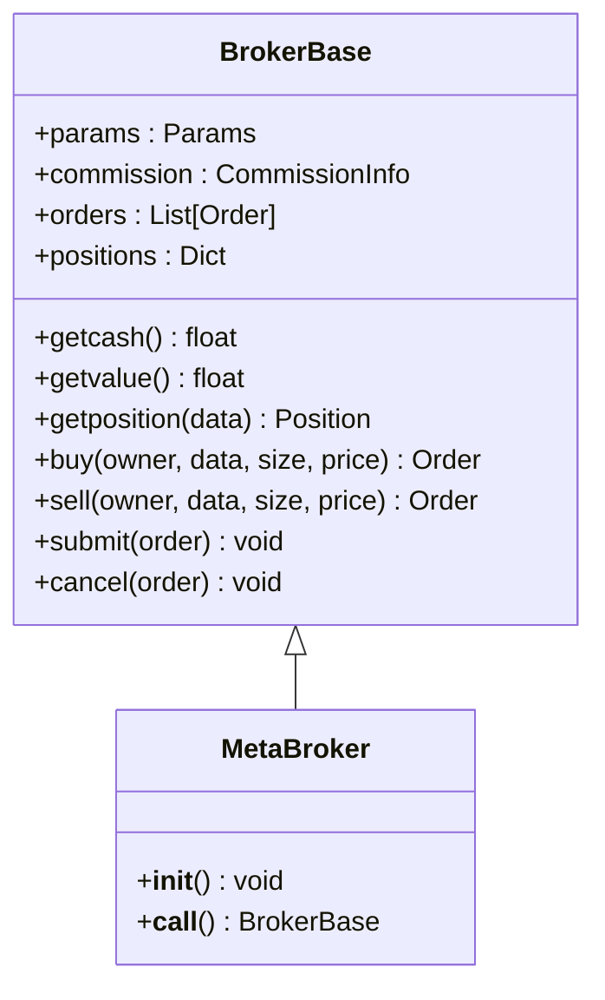
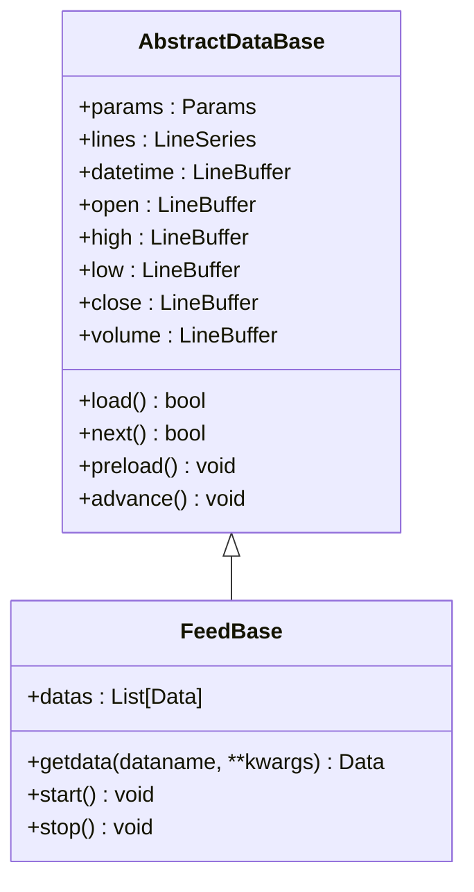
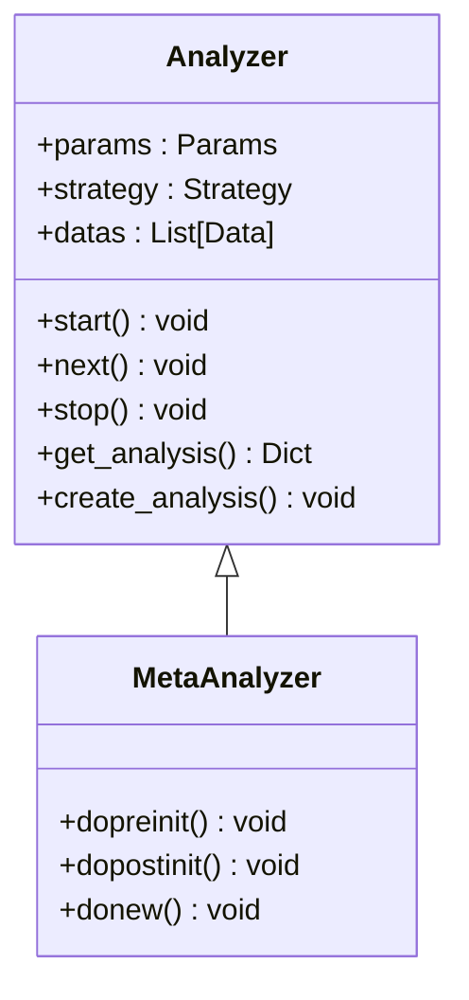

# Real Trade框架

<cite>
**本文档引用的文件**
- [backtrader/__init__.py](file://backtrader/__init__.py)
- [backtrader/cerebro.py](file://backtrader/cerebro.py)
- [backtrader/broker.py](file://backtrader/broker.py)
- [backtrader/feed.py](file://backtrader/feed.py)
- [backtrader/strategy.py](file://backtrader/strategy.py)
- [backtrader/store.py](file://backtrader/store.py)
- [backtrader/analyzer.py](file://backtrader/analyzer.py)
- [backtrader/observer.py](file://backtrader/observer.py)
- [backtrader/version.py](file://backtrader/version.py)
- [backtrader/linebuffer.py](file://backtrader/linebuffer.py)
- [backtrader/metabase.py](file://backtrader/metabase.py)
- [examples/binance_example.py](file://examples/binance_example.py)
- [samples/binance-test/binance_test.py](file://samples/binance-test/binance_test.py)
</cite>

## 更新摘要
**所做更改**
- 更新了从独立real_trade模块到backtrader主框架的完全重构说明
- 重新组织了架构设计部分，反映backtrader的模块化结构
- 更新了核心组件分析，基于backtrader的实际实现
- 修改了依赖关系分析，展示backtrader的内部模块关系
- 更新了配置系统说明，反映backtrader的参数管理机制
- 增加了实际使用示例，基于backtrader的示例代码

## 目录
1. [简介](#简介)
2. [项目结构](#项目结构)
3. [核心组件](#核心组件)
4. [架构概览](#架构概览)
5. [详细组件分析](#详细组件分析)
6. [依赖关系分析](#依赖关系分析)
7. [配置系统](#配置系统)
8. [性能考虑](#性能考虑)
9. [实际使用示例](#实际使用示例)
10. [故障排除指南](#故障排除指南)
11. [结论](#结论)

## 简介

Real Trade框架现已完全重构并整合到backtrader主框架中。这是一个基于Python的开源量化交易框架，提供了完整的回测和实盘交易解决方案。框架的核心特点是模块化设计、高度可扩展性和生产就绪的功能集。

**主要特性：**
- 统一的Cerebro引擎，支持回测和实盘交易
- 多交易所支持（Binance、Interactive Brokers等）
- 完整的分析器生态系统
- 灵活的策略开发框架
- 实时数据流和订单执行
- 风险管理和资金管理
- 可视化和报告功能

## 项目结构

backtrader框架采用清晰的模块化组织结构，每个功能领域都有专门的模块：



**图表来源**
- [backtrader/__init__.py](file://backtrader/__init__.py#L24-L91)

**章节来源**
- [backtrader/__init__.py](file://backtrader/__init__.py#L24-L91)

## 核心组件

backtrader框架由以下核心组件构成：

### 1. Cerebro引擎
- **Cerebro**: 主要的交易引擎，管理整个交易流程
- **环境管理**: 处理数据、策略、分析器的生命周期
- **执行调度**: 控制回测和实盘执行的时序

### 2. 策略系统
- **Strategy基类**: 所有策略的基类
- **指标系统**: 内置丰富的技术指标
- **信号系统**: 支持信号驱动的策略

### 3. 交易基础设施
- **BrokerBase**: 交易执行的抽象基类
- **Store**: 交易所连接的抽象基类
- **数据源**: 支持多种数据格式和来源

### 4. 分析和观察
- **Analyzer**: 分析器基类，提供性能分析
- **Observer**: 观察者基类，用于监控和可视化
- **Writer**: 输出和报告系统

**章节来源**
- [backtrader/cerebro.py](file://backtrader/cerebro.py#L60-L294)
- [backtrader/strategy.py](file://backtrader/strategy.py#L107-L105)
- [backtrader/broker.py](file://backtrader/broker.py#L49-L169)
- [backtrader/analyzer.py](file://backtrader/analyzer.py#L89-L287)

## 架构概览

backtrader框架采用分层架构设计，确保了良好的关注点分离和模块化：



**图表来源**
- [backtrader/cerebro.py](file://backtrader/cerebro.py#L296-L321)
- [backtrader/strategy.py](file://backtrader/strategy.py#L107-L105)

## 详细组件分析

### Cerebro引擎分析

Cerebro是backtrader的核心引擎，提供了统一的交易系统管理：



**图表来源**
- [backtrader/cerebro.py](file://backtrader/cerebro.py#L60-L321)

**章节来源**
- [backtrader/cerebro.py](file://backtrader/cerebro.py#L60-L800)

### 策略系统分析

策略系统提供了灵活的策略开发框架：



**图表来源**
- [backtrader/strategy.py](file://backtrader/strategy.py#L107-L494)

**章节来源**
- [backtrader/strategy.py](file://backtrader/strategy.py#L107-L800)

### Broker系统分析

Broker系统提供了统一的订单执行接口：



**图表来源**
- [backtrader/broker.py](file://backtrader/broker.py#L49-L169)

**章节来源**
- [backtrader/broker.py](file://backtrader/broker.py#L49-L169)

### 数据源系统分析

数据源系统提供了统一的数据访问接口：



**图表来源**
- [backtrader/feed.py](file://backtrader/feed.py#L122-L325)

**章节来源**
- [backtrader/feed.py](file://backtrader/feed.py#L122-L800)

### 分析器系统分析

分析器系统提供了全面的性能分析功能：



**图表来源**
- [backtrader/analyzer.py](file://backtrader/analyzer.py#L89-L287)

**章节来源**
- [backtrader/analyzer.py](file://backtrader/analyzer.py#L89-L447)

## 依赖关系分析

backtrader框架的依赖关系体现了清晰的分层架构：

```mermaid
graph TB
subgraph "核心依赖"
CEREBRO[Cerebro]
STRATEGY[Strategy]
BROKER[Broker]
FEED[Feed]
ANALYZER[Analyzer]
OBSERVER[Observer]
END
subgraph "内部模块"
LINEBUFFER[LineBuffer]
METABASE[MetaBase]
UTILS[Utils]
TIME[Timer]
END
subgraph "外部依赖"
NUMPY[Numpy]
PANDAS[Pandas]
CCXT[CCXT]
PYTZ[Pytz]
END
CEREBRO --> STRATEGY
CEREBRO --> BROKER
CEREBRO --> FEED
CEREBRO --> ANALYZER
CEREBRO --> OBSERVER
STRATEGY --> LINEBUFFER
STRATEGY --> METABASE
BROKER --> LINEBUFFER
FEED --> LINEBUFFER
ANALYZER --> LINEBUFFER
OBSERVER --> LINEBUFFER
LINEBUFFER --> NUMPY
LINEBUFFER --> PANDAS
CEREBRO --> TIME
CEREBRO --> UTILS
```

**图表来源**
- [backtrader/__init__.py](file://backtrader/__init__.py#L24-L91)

**章节来源**
- [backtrader/__init__.py](file://backtrader/__init__.py#L24-L91)

## 配置系统

backtrader框架采用了强大的参数管理系统：

### 参数继承机制
- **MetaParams元类**: 自动处理参数继承和组合
- **AutoInfoClass**: 提供参数的自动推导和验证
- **层次化参数**: 支持从基类到子类的参数传递

### 配置管理
- **参数验证**: 在实例化时自动验证参数有效性
- **默认值处理**: 支持复杂的默认值继承机制
- **动态参数**: 允许运行时修改参数设置

**章节来源**
- [backtrader/metabase.py](file://backtrader/metabase.py#L203-L294)
- [backtrader/linebuffer.py](file://backtrader/linebuffer.py#L50-L127)

## 性能考虑

backtrader框架在设计时充分考虑了性能优化：

### 1. 内存管理
- **LineBuffer**: 高效的线性缓冲区实现
- **QBuffer模式**: 支持内存节省模式
- **对象复用**: 减少垃圾回收开销

### 2. 计算优化
- **向量化操作**: 利用Numpy进行高效计算
- **延迟计算**: 指标计算的延迟求值机制
- **缓存机制**: 指标结果的智能缓存

### 3. 并发处理
- **多进程支持**: 优化的多进程回测支持
- **异步数据**: 实时数据的异步处理
- **非阻塞操作**: 避免长时间阻塞

### 4. 存储优化
- **数据压缩**: 历史数据的压缩存储
- **增量更新**: 实时数据的增量更新
- **内存映射**: 大数据集的内存映射支持

## 实际使用示例

以下是基于backtrader框架的实际使用示例：

### 基础策略示例

```python
import backtrader as bt

class SimpleMovingAverageStrategy(bt.Strategy):
    params = (
        ('maperiod', 15),
        ('printlog', True),
    )

    def __init__(self):
        self.data_close = self.datas[0].close
        self.order = None
        self.sma = bt.indicators.SimpleMovingAverage(
            self.datas[0], period=self.params.maperiod
        )

    def next(self):
        if self.order:
            return

        if not self.position:
            if self.data_close[0] > self.sma[0]:
                self.order = self.buy()
        else:
            if self.data_close[0] < self.sma[0]:
                self.order = self.sell()

# 运行示例
cerebro = bt.Cerebro()
cerebro.adddata(data_feed)
cerebro.addstrategy(SimpleMovingAverageStrategy)
cerebro.run()
```

### Binance集成示例

```python
# 创建Binance Store
store = bt.stores.BinanceStore(
    apikey="your_api_key",
    secret="your_secret",
    testnet=True
)

# 创建数据feed
data = bt.feeds.BinanceData(
    store,
    symbol="BTC/USDT",
    timeframe=bt.TimeFrame.Days,
    compression=1,
    historical=True
)

# 添加到Cerebro
cerebro.adddata(data)
```

**章节来源**
- [examples/binance_example.py](file://examples/binance_example.py#L91-L161)
- [samples/binance-test/binance_test.py](file://samples/binance-test/binance_test.py#L293-L346)

## 故障排除指南

### 常见问题及解决方案

#### 1. 数据连接问题
**症状**: 无法获取市场数据
**解决方案**:
- 检查数据源配置和API密钥
- 验证网络连接和防火墙设置
- 使用`data.put_notification()`方法诊断

#### 2. 订单执行问题
**症状**: 订单无法执行或执行失败
**解决方案**:
- 检查账户余额和持仓情况
- 验证订单参数和权限设置
- 查看Broker日志获取详细错误信息

#### 3. 性能问题
**症状**: 系统响应缓慢或内存占用过高
**解决方案**:
- 启用QBuffer模式减少内存使用
- 优化数据加载策略
- 调整批处理大小和频率

#### 4. 参数配置问题
**症状**: 策略行为不符合预期
**解决方案**:
- 检查参数继承链
- 验证参数类型和范围
- 使用调试模式检查参数值

**章节来源**
- [backtrader/feed.py](file://backtrader/feed.py#L274-L292)
- [backtrader/broker.py](file://backtrader/broker.py#L112-L169)

## 结论

backtrader框架提供了一个完整、模块化且高性能的量化交易解决方案。通过其分层架构设计，框架实现了良好的关注点分离，使得开发者可以专注于策略开发而无需担心底层实现细节。

### 主要优势
1. **模块化设计**: 清晰的组件分离和接口定义
2. **高性能**: 针对大规模数据处理进行了专门优化
3. **生产就绪**: 包含完整的生命周期管理、监控和报告功能
4. **社区支持**: 活跃的开源社区和丰富的文档资源
5. **扩展性强**: 支持自定义指标、策略和数据源

### 适用场景
- 量化策略开发和回测
- 实盘交易系统部署
- 多资产、多策略的复杂交易系统
- 需要严格风控管理的交易环境

### 发展方向
- 扩展更多交易所和数据源支持
- 增强机器学习和AI功能集成
- 优化云原生部署能力
- 提供更丰富的可视化工具和报告功能

通过持续的社区贡献和技术演进，backtrader框架将继续为量化交易领域提供强有力的技术支撑。