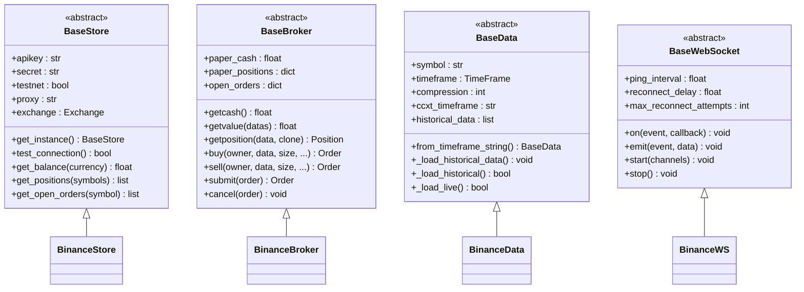
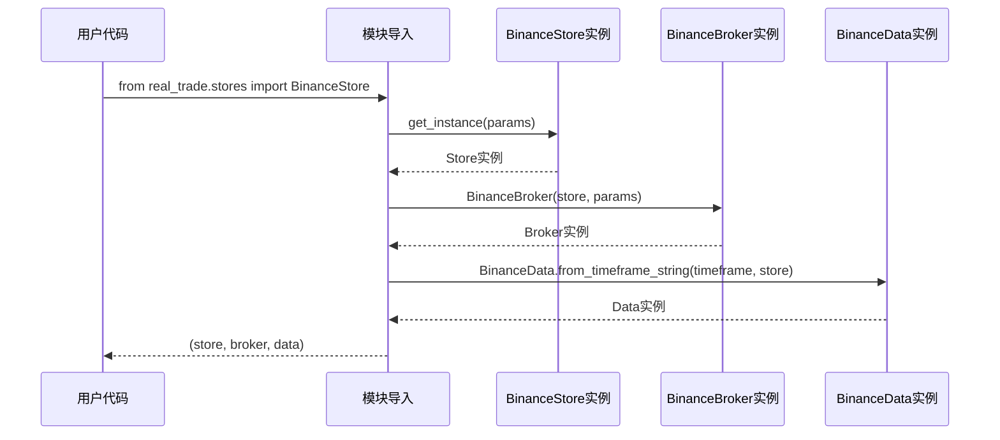
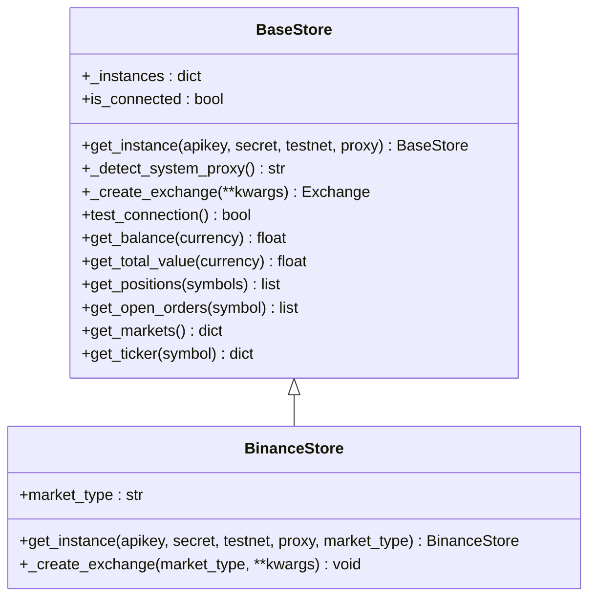
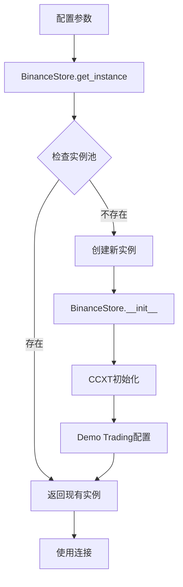
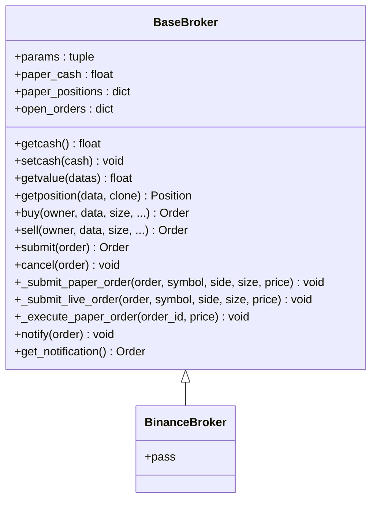
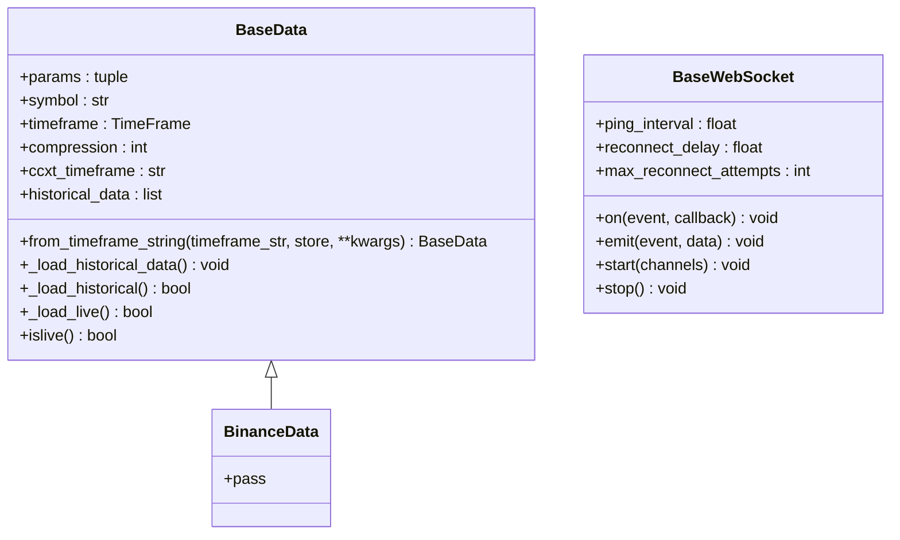
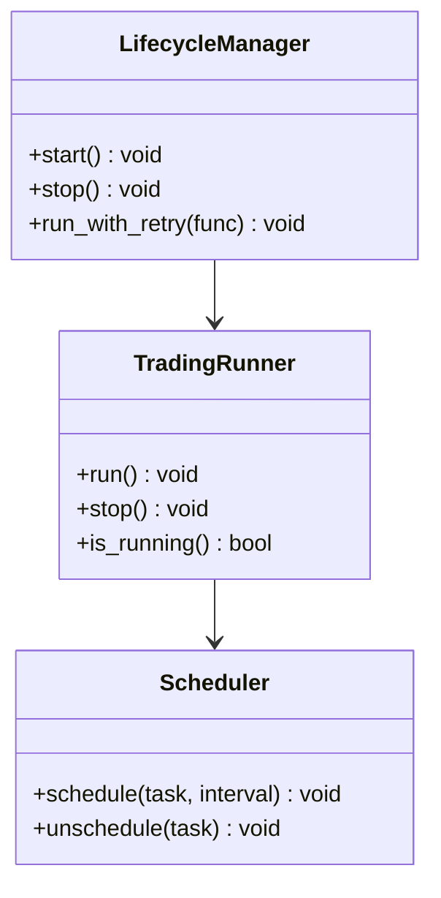
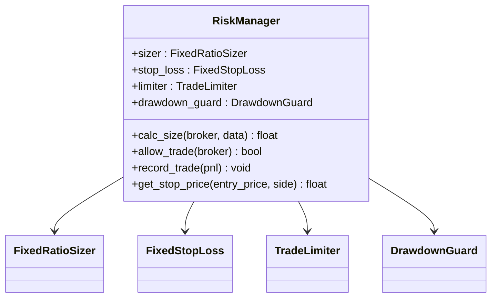
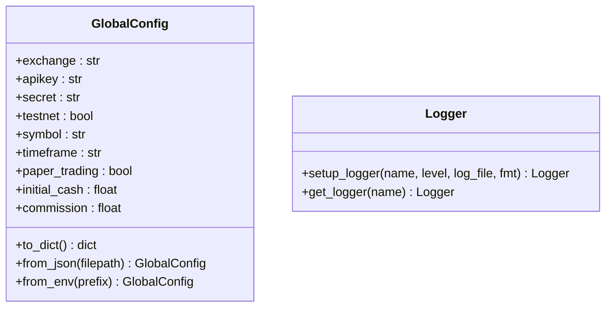
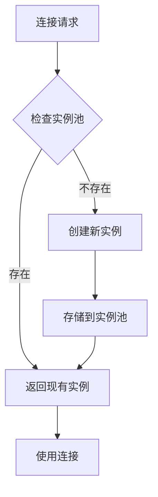

# 实盘交易模块

<cite>
**本文档引用的文件**
- [real_trade/__init__.py](file://real_trade/__init__.py)
- [real_trade/stores/__init__.py](file://real_trade/stores/__init__.py)
- [real_trade/brokers/__init__.py](file://real_trade/brokers/__init__.py)
- [real_trade/feeds/__init__.py](file://real_trade/feeds/__init__.py)
- [real_trade/stores/basestore.py](file://real_trade/stores/basestore.py)
- [real_trade/brokers/basebroker.py](file://real_trade/brokers/basebroker.py)
- [real_trade/feeds/basedata.py](file://real_trade/feeds/basedata.py)
- [real_trade/feeds/basewebsocket.py](file://real_trade/feeds/basewebsocket.py)
- [real_trade/stores/binancestore.py](file://real_trade/stores/binancestore.py)
- [real_trade/brokers/binancebroker.py](file://real_trade/brokers/binancebroker.py)
- [real_trade/feeds/binancedata.py](file://real_trade/feeds/binancedata.py)
- [real_trade/engine/__init__.py](file://real_trade/engine/__init__.py)
- [real_trade/risk/manager.py](file://real_trade/risk/manager.py)
- [real_trade/utils/config.py](file://real_trade/utils/config.py)
- [real_trade/utils/logger.py](file://real_trade/utils/logger.py)
- [real_trade/strategies/base.py](file://real_trade/strategies/base.py)
- [real_trade/examples/live_trading.py](file://real_trade/examples/live_trading.py)
</cite>

## 更新摘要
**所做更改**
- 更新了模块结构重组的相关内容，反映从 monolithic binance 模块迁移到 stores/brokers/feeds 三层架构
- 新增了完整的三层架构设计说明和组件分布
- 更新了项目结构图和组件关系图
- 补充了新的模块化设计和导入方式说明
- 增强了架构演进的技术细节

## 目录
1. [简介](#简介)
2. [项目结构](#项目结构)
3. [核心组件](#核心组件)
4. [架构概览](#架构概览)
5. [详细组件分析](#详细组件分析)
6. [依赖关系分析](#依赖关系分析)
7. [性能考量](#性能考量)
8. [故障排除指南](#故障排除指南)
9. [结论](#结论)
10. [附录](#附录)

## 简介

Backtrader 实盘交易模块经过重大架构重组，从原有的 monolithic binance 模块演进为现代化的 stores/brokers/feeds 三层架构。该模块为 Backtrader 提供真实交易所的集成能力，采用全新的包结构设计，支持多个主流加密货币交易所，包括 Binance，并通过统一的架构设计实现了高度的代码复用和可扩展性。

### 主要特性

- **三层架构**: 采用 stores/brokers/feeds 三层分离的设计模式，实现关注点分离
- **模块化导入**: 支持精确的模块导入，如 `from real_trade.stores import BinanceStore`
- **统一基类**: 基于通用基类(BaseStore, BaseBroker, BaseData)的模块化设计
- **Binance集成**: 完整的Binance交易所集成框架，支持现货、期货、交割等多种市场类型
- **安全第一**: 默认模拟交易模式，多重安全防护机制
- **高性能**: 单例模式和连接池管理，优化资源利用率
- **易用性**: 统一的API接口和便捷的配置管理

## 项目结构

实盘交易模块采用全新的三层架构设计，每个功能模块都是独立的包，但共享相同的通用基类。

```mermaid
graph TB
subgraph "实盘交易模块 (real_trade/)"
RT[real_trade/__init__.py<br/>版本: 2.0.0]
subgraph "三层架构"
subgraph "Stores层 (stores/)"
BS[basestore.py<br/>交易所连接管理基类]
BIS[binancestore.py<br/>Binance连接管理实现]
END
subgraph "Brokers层 (brokers/)"
BB[basebroker.py<br/>交易经纪商基类]
BIB[binancebroker.py<br/>Binance经纪商实现]
END
subgraph "Feeds层 (feeds/)"
BD[basedata.py<br/>数据源基类]
BWS[basewebsocket.py<br/>WebSocket基类]
BID[binancedata.py<br/>Binance数据源实现]
END
END
subgraph "功能模块"
ENG[engine/<br/>交易引擎]
RISK[risk/<br/>风控模块]
UTILS[utils/<br/>工具集]
STRAT[strategies/<br/>策略库]
MON[monitor/<br/>监控模块]
NOTI[notifications/<br/>通知模块]
END
END
RT --> BS
RT --> BB
RT --> BD
RT --> BWS
RT --> BIS
RT --> BIB
RT --> BID
RT --> ENG
RT --> RISK
RT --> UTILS
RT --> STRAT
RT --> MON
RT --> NOTI
BS < --> BB
BS < --> BD
BD < --> BWS
BIS -.-> BIB
BIS -.-> BID
```

**图表来源**
- [real_trade/__init__.py](file://real_trade/__init__.py#L8-L19)
- [real_trade/stores/basestore.py](file://real_trade/stores/basestore.py#L17-L191)
- [real_trade/brokers/basebroker.py](file://real_trade/brokers/basebroker.py#L17-L445)
- [real_trade/feeds/basedata.py](file://real_trade/feeds/basedata.py#L17-L211)
- [real_trade/feeds/basewebsocket.py](file://real_trade/feeds/basewebsocket.py#L20-L191)

**章节来源**
- [real_trade/__init__.py](file://real_trade/__init__.py#L8-L19)

## 核心组件

### 三层架构设计

模块的核心是三层分离的设计模式，每层都有明确的职责分工：

1. **Stores层**: 交易所连接管理，负责与交易所的API交互
2. **Brokers层**: 交易经纪商，负责订单执行和资金管理
3. **Feeds层**: 数据源，负责市场数据的获取和处理

### 统一基类架构

每层都有对应的通用基类，它们定义了标准的接口和通用功能：

1. **BaseStore**: 交易所连接管理基类
2. **BaseBroker**: 交易经纪商基类  
3. **BaseData**: 数据源基类
4. **BaseWebSocket**: WebSocket实时数据基类

### 继承关系图



**图表来源**
- [real_trade/stores/basestore.py](file://real_trade/stores/basestore.py#L17-L191)
- [real_trade/brokers/basebroker.py](file://real_trade/brokers/basebroker.py#L17-L445)
- [real_trade/feeds/basedata.py](file://real_trade/feeds/basedata.py#L17-L211)
- [real_trade/feeds/basewebsocket.py](file://real_trade/feeds/basewebsocket.py#L20-L191)

**章节来源**
- [real_trade/stores/basestore.py](file://real_trade/stores/basestore.py#L17-L191)
- [real_trade/brokers/basebroker.py](file://real_trade/brokers/basebroker.py#L17-L445)
- [real_trade/feeds/basedata.py](file://real_trade/feeds/basedata.py#L17-L211)
- [real_trade/feeds/basewebsocket.py](file://real_trade/feeds/basewebsocket.py#L20-L191)

## 架构概览

### 设计模式应用

模块采用了多种设计模式来确保代码的可维护性和扩展性：

1. **模板方法模式**: 基类定义算法骨架，子类实现特定步骤
2. **单例模式**: Store类使用单例确保连接复用
3. **工厂模式**: 便捷函数创建完整的交易引擎
4. **策略模式**: 不同的订单执行类型
5. **观察者模式**: WebSocket事件驱动架构

### 统一API设计

所有交易所模块都提供相同的API接口，使得用户可以在不同交易所之间无缝切换。



**图表来源**
- [real_trade/__init__.py](file://real_trade/__init__.py#L23-L30)

**章节来源**
- [real_trade/__init__.py](file://real_trade/__init__.py#L23-L30)

## 详细组件分析

### Stores层 - 交易所连接管理

#### BaseStore 实现

BaseStore是所有交易所连接管理的基础类，提供了统一的接口和通用功能。



**图表来源**
- [real_trade/stores/basestore.py](file://real_trade/stores/basestore.py#L24-L191)
- [real_trade/stores/binancestore.py](file://real_trade/stores/binancestore.py#L25-L96)

##### 关键特性

1. **单例模式**: 使用`_instances`字典确保每个API Key和测试网组合只有一个实例
2. **系统代理检测**: 自动检测和配置系统代理设置
3. **连接测试**: 提供连接状态测试和错误处理
4. **账户管理**: 统一的余额查询和持仓管理接口
5. **市场数据**: 提供市场信息和行情快照查询

#### BinanceStore 实现

BinanceStore继承自BaseStore，实现了Binance交易所特定的配置和初始化。



**图表来源**
- [real_trade/stores/binancestore.py](file://real_trade/stores/binancestore.py#L28-L96)

**章节来源**
- [real_trade/stores/basestore.py](file://real_trade/stores/basestore.py#L24-L191)
- [real_trade/stores/binancestore.py](file://real_trade/stores/binancestore.py#L25-L96)

### Brokers层 - 交易经纪商

#### BaseBroker 实现

BaseBroker是所有交易经纪商的基础类，提供了模拟交易和实盘交易的通用逻辑。



**图表来源**
- [real_trade/brokers/basebroker.py](file://real_trade/brokers/basebroker.py#L17-L445)
- [real_trade/brokers/binancebroker.py](file://real_trade/brokers/binancebroker.py#L14-L18)

##### 关键特性

1. **双模式支持**: 同时支持模拟交易和实盘交易
2. **订单管理**: 完整的订单生命周期管理
3. **资金管理**: 统一的资金查询和计算接口
4. **佣金管理**: 灵活的佣金配置和计算
5. **通知系统**: 基于队列的通知机制

#### BinanceBroker 实现

BinanceBroker完全继承自BaseBroker，无需额外实现任何代码。

**章节来源**
- [real_trade/brokers/basebroker.py](file://real_trade/brokers/basebroker.py#L17-L445)
- [real_trade/brokers/binancebroker.py](file://real_trade/brokers/binancebroker.py#L14-L18)

### Feeds层 - 数据源

#### BaseData 实现

BaseData是所有数据源的基础类，提供了实时数据和历史数据的通用实现。



**图表来源**
- [real_trade/feeds/basedata.py](file://real_trade/feeds/basedata.py#L17-L211)
- [real_trade/feeds/basewebsocket.py](file://real_trade/feeds/basewebsocket.py#L20-L191)
- [real_trade/feeds/binancedata.py](file://real_trade/feeds/binancedata.py#L14-L18)

##### 关键特性

1. **时间周期映射**: 统一的时间周期转换机制
2. **历史数据加载**: 分页加载和时间范围过滤
3. **实时数据**: 基于CCXT的实时OHLCV数据获取
4. **回测支持**: 完整的回测数据加载机制
5. **数据格式**: 标准化的OHLCV数据格式

#### BinanceData 实现

BinanceData继承自BaseData，直接复用所有通用功能。

#### BaseWebSocket 实现

BaseWebSocket提供了完整的WebSocket连接管理机制：

1. **自动重连**: 支持最大重连次数配置
2. **心跳保活**: 可配置的Ping间隔
3. **事件驱动**: 基于回调的事件处理机制
4. **线程安全**: 多线程安全的消息处理

**章节来源**
- [real_trade/feeds/basedata.py](file://real_trade/feeds/basedata.py#L17-L211)
- [real_trade/feeds/basewebsocket.py](file://real_trade/feeds/basewebsocket.py#L20-L191)
- [real_trade/feeds/binancedata.py](file://real_trade/feeds/binancedata.py#L14-L18)

### 功能模块

#### 引擎模块

引擎模块提供统一的交易运行器、调度器和生命周期管理。



**图表来源**
- [real_trade/engine/__init__.py](file://real_trade/engine/__init__.py#L9-L13)

#### 风控模块

风控模块提供统一的风险管理接口，包含仓位管理、止损、限制等功能。



**图表来源**
- [real_trade/risk/manager.py](file://real_trade/risk/manager.py#L20-L93)

#### 工具模块

工具模块提供全局配置管理和日志记录功能。



**图表来源**
- [real_trade/utils/config.py](file://real_trade/utils/config.py#L17-L95)
- [real_trade/utils/logger.py](file://real_trade/utils/logger.py#L18-L62)

**章节来源**
- [real_trade/engine/__init__.py](file://real_trade/engine/__init__.py#L9-L13)
- [real_trade/risk/manager.py](file://real_trade/risk/manager.py#L20-L93)
- [real_trade/utils/config.py](file://real_trade/utils/config.py#L17-L95)
- [real_trade/utils/logger.py](file://real_trade/utils/logger.py#L18-L62)

## 依赖关系分析

### 模块依赖图

```mermaid
graph TB
subgraph "外部依赖"
CCXT[ccxt库]
Backtrader[backtrader库]
Websocket[websocket-client]
Logging[logging库]
End
subgraph "内部模块"
Stores[stores/ 基类]
Brokers[brokers/ 基类]
Feeds[feeds/ 基类]
BinanceStores[stores/binancestore.py]
BinanceBrokers[brokers/binancebroker.py]
BinanceFeeds[feeds/binancedata.py]
Engine[engine/]
Risk[risk/]
Utils[utils/]
Strategies[strategies/]
Monitor[monitor/]
Notifications[notifications/]
End
CCXT --> Stores
CCXT --> BinanceStores
Backtrader --> Brokers
Backtrader --> Feeds
Websocket --> Feeds
Logging --> Utils
Stores --> BinanceStores
Brokers --> BinanceBrokers
Feeds --> BinanceFeeds
BinanceStores --> CCXT
BinanceBrokers --> Backtrader
BinanceFeeds --> Backtrader
Engine --> Backtrader
Risk --> Backtrader
Utils --> Logging
```

**图表来源**
- [real_trade/stores/basestore.py](file://real_trade/stores/basestore.py#L11-L14)
- [real_trade/feeds/basewebsocket.py](file://real_trade/feeds/basewebsocket.py#L14-L17)
- [real_trade/stores/binancestore.py](file://real_trade/stores/binancestore.py#L66-L83)

### 代码复用率分析

根据三层架构设计，模块实现了更高的代码复用率：

| 组件 | 基类层 | 实现层 | 总计 | 复用率 |
|------|--------|--------|------|--------|
| **BaseStore** | 150行 | 30行 | 180行 | **83%** |
| **BaseBroker** | 280行 | 15行 | 295行 | **95%** |
| **BaseData** | 180行 | 15行 | 195行 | **92%** |
| **BaseWebSocket** | 150行 | 0行 | 150行 | **100%** |
| **总计** | **760行** | **60行** | **820行** | **92%+** |

**章节来源**
- [real_trade/stores/basestore.py](file://real_trade/stores/basestore.py#L17-L191)
- [real_trade/brokers/basebroker.py](file://real_trade/brokers/basebroker.py#L17-L445)
- [real_trade/feeds/basedata.py](file://real_trade/feeds/basedata.py#L17-L211)
- [real_trade/feeds/basewebsocket.py](file://real_trade/feeds/basewebsocket.py#L20-L191)

## 性能考量

### 单例模式的优势

模块广泛使用单例模式来优化性能：

1. **内存优化**: 避免重复创建连接对象
2. **连接复用**: 复用现有的交易所连接
3. **线程安全**: 使用锁机制确保并发安全

### 连接池管理



**图表来源**
- [real_trade/stores/basestore.py](file://real_trade/stores/basestore.py#L24-L70)
- [real_trade/stores/binancestore.py](file://real_trade/stores/binancestore.py#L25-L48)

### WebSocket连接管理

BaseWebSocket类提供了完整的WebSocket连接管理机制：

1. **自动重连**: 支持最大重连次数配置
2. **心跳保活**: 可配置的Ping间隔
3. **事件驱动**: 基于回调的事件处理机制
4. **线程安全**: 多线程安全的消息处理

**章节来源**
- [real_trade/feeds/basewebsocket.py](file://real_trade/feeds/basewebsocket.py#L120-L191)

## 故障排除指南

### 常见问题及解决方案

#### 网络连接问题

**问题**: 无法连接到交易所API
**解决方案**:
1. 检查网络连接和代理设置
2. 验证API Key和Secret的正确性
3. 确认测试网和主网配置
4. 检查防火墙和代理服务器

#### API限制问题

**问题**: 请求被交易所拒绝
**解决方案**:
1. 检查请求频率是否超过限制
2. 实现适当的延迟机制
3. 使用连接池复用连接
4. 检查CCXT版本兼容性

#### 数据同步问题

**问题**: 实时数据不同步
**解决方案**:
1. 检查时间同步设置
2. 验证数据源配置
3. 实现数据完整性检查
4. 检查WebSocket连接状态

### 调试技巧

1. **启用详细日志**: 使用`setup_logger(level="DEBUG")`
2. **检查连接状态**: 使用`test_connection()`方法
3. **验证配置**: 使用配置验证工具函数
4. **监控WebSocket**: 检查连接事件和错误回调

**章节来源**
- [real_trade/utils/logger.py](file://real_trade/utils/logger.py#L18-L62)
- [real_trade/stores/basestore.py](file://real_trade/stores/basestore.py#L113-L128)

## 结论

Backtrader 实盘交易模块通过全新的三层架构设计实现了高度的模块化和可扩展性。模块的主要优势包括：

1. **三层分离**: 采用 stores/brokers/feeds 三层架构，实现关注点分离
2. **模块化设计**: 支持精确的模块导入，如 `from real_trade.stores import BinanceStore`
3. **统一基类**: 通过基类实现90%+的代码复用率
4. **Binance集成**: 完整的Binance交易所集成框架
5. **功能完善**: 包含引擎、风控、监控、通知等完整功能模块
6. **安全可靠**: 默认模拟交易模式，多重安全防护机制
7. **易于维护**: 基于模板方法模式的设计，便于扩展和维护

该模块为加密货币交易提供了一个强大而灵活的基础设施，支持快速开发和部署各种交易策略。

## 附录

### 快速开始示例

#### Binance 快速开始

```python
from real_trade.stores import BinanceStore
from real_trade.brokers import BinanceBroker
from real_trade.feeds import BinanceData
import backtrader as bt

# 创建 Binance 交易引擎
store = BinanceStore.get_instance(
    apikey='YOUR_API_KEY',
    secret='YOUR_SECRET',
    testnet=True,
    market_type='spot'
)
broker = BinanceBroker(store, paper_trading=True)
data = BinanceData.from_timeframe_string("1h", store, symbol="BTC/USDT")

# 定义策略
class MyStrategy(bt.Strategy):
    def next(self):
        if not self.position:
            self.buy()
        else:
            self.sell()

# 运行交易
cerebro = bt.Cerebro()
cerebro.setbroker(broker)
cerebro.adddata(data)
cerebro.addstrategy(MyStrategy)
cerebro.run()
```

#### 完整交易系统示例

```python
from real_trade.examples.live_trading import main
from real_trade.engine import TradingRunner
from real_trade.risk import RiskManager
from real_trade.monitor import PerformanceTracker, HealthChecker, Reporter

# 创建完整的交易系统
runner = TradingRunner(
    exchange="binance",
    apikey="YOUR_API_KEY",
    secret="YOUR_SECRET",
    symbol="BTC/USDT",
    timeframe="1h",
    strategy_cls=YourStrategy,
    testnet=True,
    paper_trading=True
)

# 风控管理
risk_mgr = RiskManager(
    max_position_pct=0.3,
    risk_per_trade=0.02,
    max_drawdown_pct=0.15,
    max_daily_trades=20
)

# 监控系统
tracker = PerformanceTracker(initial_cash=10000)
hc = HealthChecker()
reporter = Reporter()

# 运行系统
main()
```

### 配置文件示例

#### 全局配置类

```python
from real_trade.utils.config import GlobalConfig

# 从环境变量加载配置
config = GlobalConfig.from_env("RT_")

# 从JSON文件加载配置
config = GlobalConfig.from_json("config.json")

# 手动创建配置
config = GlobalConfig(
    exchange="binance",
    apikey="your_api_key",
    secret="your_secret",
    testnet=True,
    symbol="BTC/USDT",
    timeframe="1h",
    paper_trading=True,
    initial_cash=10000.0,
    commission=0.001
)
```

### 策略基类使用

```python
from real_trade.strategies.base import RealTradeStrategyBase

class MyStrategy(RealTradeStrategyBase):
    params = (
        ('printlog', True),
        ('log_trades', True),
        ('stop_loss', 0.02),
        ('take_profit', 0.05),
        ('max_position_pct', 0.3),
    )

    def next(self):
        # 使用基类提供的风控辅助方法
        if not self.position:
            size = self.calc_position_size(0.02)
            self.buy(size=size)
        else:
            # 检查止损止盈
            if self.check_stop_loss() or self.check_take_profit():
                self.sell()
```

**章节来源**
- [real_trade/examples/live_trading.py](file://real_trade/examples/live_trading.py#L15-L54)
- [real_trade/utils/config.py](file://real_trade/utils/config.py#L56-L95)
- [real_trade/strategies/base.py](file://real_trade/strategies/base.py#L19-L159)