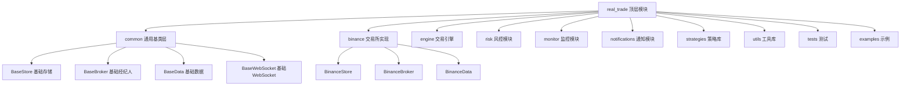
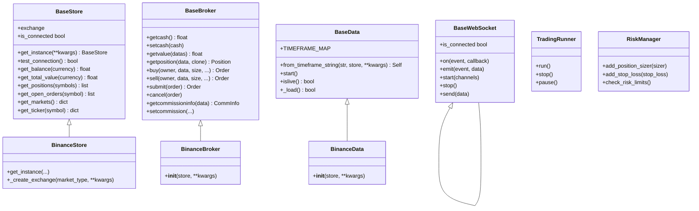
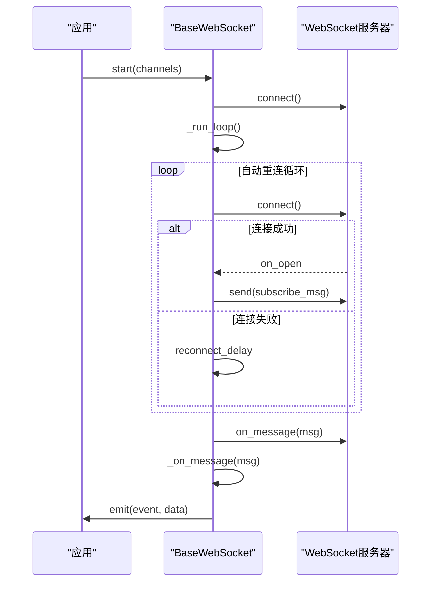
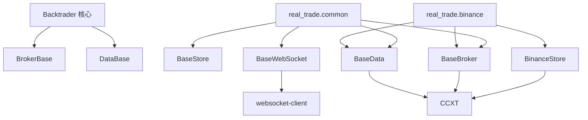

# 架构设计概览

<cite>
**本文档引用的文件**
- [__init__.py](file://real_trade/__init__.py)
- [__init__.py](file://real_trade/common/__init__.py)
- [base_store.py](file://real_trade/common/base_store.py)
- [base_broker.py](file://real_trade/common/base_broker.py)
- [base_data.py](file://real_trade/common/base_data.py)
- [base_websocket.py](file://real_trade/common/base_websocket.py)
- [store.py](file://real_trade/binance/store.py)
- [broker.py](file://real_trade/binance/broker.py)
- [datafeed.py](file://real_trade/binance/datafeed.py)
- [__init__.py](file://real_trade/binance/__init__.py)
- [__init__.py](file://real_trade/engine/__init__.py)
- [__init__.py](file://real_trade/risk/__init__.py)
</cite>

## 更新摘要
**所做更改**
- 更新了统一基类架构的核心设计理念，强调代码复用和可扩展性
- 新增了WebSocket基类的架构说明
- 完善了交易引擎和风控模块的架构描述
- 强化了从分散模块向统一基类转变的技术优势分析

## 目录
1. [简介](#简介)
2. [项目结构](#项目结构)
3. [核心组件](#核心组件)
4. [架构总览](#架构总览)
5. [详细组件分析](#详细组件分析)
6. [依赖关系分析](#依赖关系分析)
7. [性能考量](#性能考量)
8. [故障排除指南](#故障排除指南)
9. [结论](#结论)
10. [附录](#附录)

## 简介
本文件面向Backtrader实盘交易模块的架构设计，系统阐述模块化、统一API、多交易所支持、安全设计与演进规划。该模块通过"通用基类 + 交易所特化"的方式，实现高复用、低耦合、易扩展的实盘交易架构，支持Binance等主流加密货币交易所，并预留扩展空间。

**更新** 重点反映了从分散的交易所模块向统一基类架构的转变，这一设计提升了代码复用率和系统的可维护性。

## 项目结构
实盘交易模块采用按功能域划分的层次化组织：
- real_trade：顶层模块，导出各功能子模块
- real_trade.common：通用基类层（BaseStore, BaseBroker, BaseData, BaseWebSocket），提供统一接口与通用逻辑
- real_trade.binance：交易所特化实现，继承通用基类
- real_trade.engine：交易引擎（统一运行器/调度/生命周期）
- real_trade.risk：风控模块（仓位管理/止损/限制/回撤控制）
- real_trade.monitor：监控模块（绩效追踪/健康检查/报告）
- real_trade.notifications：通知模块（Telegram/钉钉/Webhook/邮件）
- real_trade.strategies：共享策略库（趋势/均值回归/动量/网格/复合）
- real_trade.utils：公共工具（日志/配置/校验/重试/时间）
- real_trade.tests：统一测试
- real_trade.examples：使用示例

**图表来源**
- [__init__.py](file://real_trade/__init__.py#L1-L34)
- [__init__.py](file://real_trade/common/__init__.py#L1-L15)
- [base_store.py](file://real_trade/common/base_store.py#L17-L194)
- [base_broker.py](file://real_trade/common/base_broker.py#L17-L445)
- [base_data.py](file://real_trade/common/base_data.py#L17-L211)
- [base_websocket.py](file://real_trade/common/base_websocket.py#L20-L191)

**章节来源**
- [__init__.py](file://real_trade/__init__.py#L1-L34)
- [__init__.py](file://real_trade/common/__init__.py#L1-L15)

## 核心组件
- 通用基类（common）：提供统一的Store、Broker、Data、WebSocket抽象，屏蔽交易所差异
- 交易所特化（binance）：继承通用基类，仅实现差异化配置与最小化扩展
- 交易引擎（engine）：提供统一运行器、定时调度和生命周期管理
- 风控模块（risk）：提供仓位管理、止损策略、交易限制、回撤控制等风控能力
- 监控模块（monitor）：提供绩效追踪、健康检查、报告生成功能
- 通知模块（notifications）：支持多种通知渠道（Telegram/钉钉/Webhook/邮件）
- 策略库（strategies）：包含多种预构建策略（趋势/均值回归/动量/网格/复合）
- 工具库（utils）：提供日志、配置、校验、重试、时间等通用工具

**更新** 强调了统一基类架构带来的代码复用优势，Binance模块几乎零重写地复用了所有通用逻辑。

关键特性
- 统一API：通过便捷函数与工厂函数，实现"改一个导入，其余代码一致"
- 单例Store：避免重复连接，提升性能与稳定性
- 模板方法：基类定义算法骨架，子类仅实现必要步骤
- 参数标准化：统一参数命名与默认值，便于跨交易所迁移
- 可扩展性：新交易所只需继承通用基类即可快速接入

**章节来源**
- [base_store.py](file://real_trade/common/base_store.py#L17-L194)
- [base_broker.py](file://real_trade/common/base_broker.py#L17-L445)
- [base_data.py](file://real_trade/common/base_data.py#L17-L211)
- [base_websocket.py](file://real_trade/common/base_websocket.py#L20-L191)
- [store.py](file://real_trade/binance/store.py#L17-L96)
- [broker.py](file://real_trade/binance/broker.py#L14-L18)
- [datafeed.py](file://real_trade/binance/datafeed.py#L14-L18)

## 架构总览
模块遵循"通用基类 + 交易所特化 + 功能模块"的分层架构，通过继承与组合实现高内聚、低耦合。统一的Store负责连接管理与通用操作；Broker负责订单与资金管理；Data负责OHLCV数据的加载与推送；WebSocket提供实时数据通道。

**更新** 新增了WebSocket基类的统一架构设计，支持自动重连、心跳保活、消息分发等通用功能。

**图表来源**
- [base_store.py](file://real_trade/common/base_store.py#L17-L194)
- [base_broker.py](file://real_trade/common/base_broker.py#L17-L445)
- [base_data.py](file://real_trade/common/base_data.py#L17-L211)
- [base_websocket.py](file://real_trade/common/base_websocket.py#L20-L191)
- [store.py](file://real_trade/binance/store.py#L17-L96)
- [broker.py](file://real_trade/binance/broker.py#L14-L18)
- [datafeed.py](file://real_trade/binance/datafeed.py#L14-L18)

## 详细组件分析

### 通用Store基类（BaseStore）
- 职责：统一连接管理、通用查询接口（余额、持仓、订单、市场、行情）、单例模式
- 关键点：模板方法_create_exchange由子类实现；单例通过类变量与锁保证线程安全；自动代理检测
- 安全：连接测试与异常捕获；默认空代理自动检测系统代理

**更新** 强调了BaseStore作为统一连接管理基类的重要作用，为所有交易所提供一致的连接接口。

**图表来源**
- [base_store.py](file://real_trade/common/base_store.py#L63-L110)

**章节来源**
- [base_store.py](file://real_trade/common/base_store.py#L17-L194)

### 通用Broker基类（BaseBroker）
- 职责：统一订单生命周期管理（提交、执行、取消）、模拟/实盘切换、佣金管理
- 关键点：模拟交易与实盘交易共用一套接口；通过CCXT统一下单与撤单；订单通知队列
- 安全：资金不足拒绝执行；错误捕获并拒绝订单；默认佣金配置

**更新** 展示了BinanceBroker如何零重写地复用BaseBroker的所有功能，体现了统一基类架构的代码复用优势。

**图表来源**
- [base_broker.py](file://real_trade/common/base_broker.py#L188-L262)

**章节来源**
- [base_broker.py](file://real_trade/common/base_broker.py#L17-L445)

### 通用Data基类（BaseData）
- 职责：统一OHLCV数据加载（历史/实时）、时间周期映射、Backtrader数据接口适配
- 关键点：from_timeframe_string统一入口；历史数据分页拉取；实时数据增量推送
- 兼容性：强制islive返回True，确保Backtrader使用next模式

**更新** 强调了BaseData的标准化设计，为所有交易所提供一致的数据接口。

**图表来源**
- [base_data.py](file://real_trade/common/base_data.py#L89-L145)

**章节来源**
- [base_data.py](file://real_trade/common/base_data.py#L17-L211)

### 通用WebSocket基类（BaseWebSocket）
- 职责：为交易所WebSocket连接提供统一接口，包括自动重连、心跳保活、消息分发
- 关键点：子类只需实现_get_ws_url()、_build_subscribe_msg()、_on_message()三个方法
- 安全：最大重连次数控制；异常回调处理；线程安全的消息分发

**新增** WebSocket基类作为统一架构的重要组成部分，提供了标准化的实时数据通道。

**图表来源**
- [base_websocket.py](file://real_trade/common/base_websocket.py#L120-L191)

**章节来源**
- [base_websocket.py](file://real_trade/common/base_websocket.py#L20-L191)

### Binance模块
- Store：继承BaseStore，实现_get_create_exchange，支持Demo Trading与代理配置
- Broker：继承BaseBroker，零重写，直接复用通用逻辑
- Data：继承BaseData，零重写，直接复用通用逻辑
- 便捷函数：create_binance_engine提供统一的创建接口

**更新** Binance模块完美体现了统一基类架构的优势——几乎零重写的实现，充分证明了设计的有效性。

**图表来源**
- [__init__.py](file://real_trade/binance/__init__.py#L37-L97)
- [store.py](file://real_trade/binance/store.py#L28-L48)
- [broker.py](file://real_trade/binance/broker.py#L14-L18)
- [datafeed.py](file://real_trade/binance/datafeed.py#L14-L18)

**章节来源**
- [store.py](file://real_trade/binance/store.py#L17-L96)
- [broker.py](file://real_trade/binance/broker.py#L14-L18)
- [datafeed.py](file://real_trade/binance/datafeed.py#L14-L18)
- [__init__.py](file://real_trade/binance/__init__.py#L1-L97)

### 交易引擎模块（Engine）
- 职责：提供统一运行器、定时调度和生命周期管理
- 组件：TradingRunner（统一运行器）、Scheduler（定时调度）、LifecycleManager（生命周期管理）
- 关键点：与Backtrader核心框架深度集成，支持策略生命周期管理

**新增** 交易引擎作为独立的功能模块，提供了统一的交易执行环境。

**章节来源**
- [__init__.py](file://real_trade/engine/__init__.py#L1-L14)

### 风控模块（Risk）
- 职责：提供仓位管理、止损策略、交易限制、回撤控制等风控能力
- 组件：RiskManager（风控管理器）、PositionSizer（仓位管理器）、StopLoss（止损策略）
- 关键点：可插拔的风控策略；统一的风险控制接口

**新增** 风控模块提供了完整的风险管理解决方案。

**章节来源**
- [__init__.py](file://real_trade/risk/__init__.py#L1-L34)

## 依赖关系分析
- 模块间依赖：real_trade.common为所有交易所实现提供基础；各交易所模块仅依赖common或Backtrader核心
- 与Backtrader集成：Broker/Data分别继承Backtrader的BrokerBase/DataBase，确保框架兼容性
- 与CCXT集成：Store通过CCXT创建交易所实例，统一调用fetch_*与create_order/cancel_order等接口
- 与WebSocket集成：BaseWebSocket提供统一的实时数据通道接口

**更新** 新增了WebSocket基类的依赖关系，体现了统一架构的完整性。

**图表来源**
- [base_store.py](file://real_trade/common/base_store.py#L17-L194)
- [base_broker.py](file://real_trade/common/base_broker.py#L17-L445)
- [base_data.py](file://real_trade/common/base_data.py#L17-L211)
- [base_websocket.py](file://real_trade/common/base_websocket.py#L144-L151)
- [store.py](file://real_trade/binance/store.py#L65-L96)

**章节来源**
- [base_store.py](file://real_trade/common/base_store.py#L17-L194)
- [base_broker.py](file://real_trade/common/base_broker.py#L17-L445)
- [base_data.py](file://real_trade/common/base_data.py#L17-L211)
- [base_websocket.py](file://real_trade/common/base_websocket.py#L144-L151)
- [store.py](file://real_trade/binance/store.py#L17-L96)

## 性能考量
- 单例Store：避免重复创建连接，减少网络开销与连接数上限问题
- 继承开销：Python方法解析快速，继承带来的性能损耗可忽略
- 历史数据分页：BaseData按limit循环拉取，避免一次性请求过大导致超时
- 代理与系统检测：BaseStore自动检测系统代理，减少手动配置成本
- WebSocket自动重连：智能重连机制，提高实时数据连接稳定性

**更新** 新增了WebSocket自动重连机制的性能考量。

**章节来源**
- [base_store.py](file://real_trade/common/base_store.py#L24-L110)
- [base_data.py](file://real_trade/common/base_data.py#L99-L145)
- [base_websocket.py](file://real_trade/common/base_websocket.py#L120-L140)

## 故障排除指南
- 连接失败：检查API密钥、测试网/主网开关、代理设置；使用Store.test_connection进行诊断
- 订单被拒：确认资金充足（模拟交易）或账户余额（实盘）；检查订单类型与价格
- 历史数据为空：检查symbol、timeframe、fromdate/todate边界；确认交易所支持对应时间粒度
- WebSocket连接异常：检查网络连接、重连参数配置；查看自动重连日志
- 性能问题：检查单例模式是否正确使用；优化数据加载参数

**更新** 新增了WebSocket相关的故障排除指导。

**章节来源**
- [base_store.py](file://real_trade/common/base_store.py#L116-L132)
- [base_broker.py](file://real_trade/common/base_broker.py#L235-L262)
- [base_websocket.py](file://real_trade/common/base_websocket.py#L120-L140)

## 结论
该实盘交易模块通过"通用基类 + 交易所特化 + 功能模块"的统一架构，实现了高复用、强兼容与易扩展的设计目标。Binance模块几乎零重写的实现完美证明了统一基类架构的有效性，显著降低了接入成本与维护复杂度。WebSocket基类的加入进一步完善了实时数据处理能力。未来可继续扩展更多交易所与高级功能，同时持续优化性能与监控能力。

**更新** 强调了统一基类架构在代码复用和可扩展性方面的显著优势，为后续扩展奠定了坚实基础。

## 附录

### 统一API设计要点
- 便捷函数：create_binance_engine统一创建流程，隐藏内部细节
- 参数标准化：统一参数命名（apikey、secret、testnet、paper_trading、cash、proxy、backtest等）
- 接口一致性：所有交易所提供相同的API接口，便于策略移植

**更新** 强调了统一API设计在跨交易所迁移中的重要作用。

**章节来源**
- [__init__.py](file://real_trade/binance/__init__.py#L37-L97)

### 多交易所支持模式
- 继承体系：Binance完全复用通用基类，体现统一架构优势
- 工厂模式：get_instance统一实例化入口；from_timeframe_string统一数据源创建
- 配置管理：通过便捷函数参数，支持从配置文件或直接传参两种方式

**更新** 通过Binance的零重写实现，直观展示了统一基类架构的扩展性。

**章节来源**
- [store.py](file://real_trade/binance/store.py#L28-L48)
- [datafeed.py](file://real_trade/binance/datafeed.py#L70-L86)

### 安全设计原则
- 默认模拟交易：paper_trading默认开启，降低实盘风险
- 测试网优先：testnet默认开启，建议先在测试网验证策略
- 参数验证：通过统一的参数校验机制，确保输入数据的正确性
- 错误处理：统一异常捕获与拒绝流程，避免脏数据进入策略

**更新** 强调了统一基类在参数验证和错误处理方面的标准化优势。

**章节来源**
- [base_broker.py](file://real_trade/common/base_broker.py#L24-L28)
- [base_store.py](file://real_trade/common/base_store.py#L72-L99)

### 架构演进与未来规划
- 短期：扩展更多交易所，复用现有基类架构
- 中期：增强WebSocket功能，支持更多实时数据源
- 长期：集成机器学习风控模型，提供智能化交易决策支持

**更新** 新增了基于统一基类架构的未来发展规划，突出了扩展性和智能化方向。

**章节来源**
- [__init__.py](file://real_trade/__init__.py#L1-L34)
- [base_websocket.py](file://real_trade/common/base_websocket.py#L20-L41)