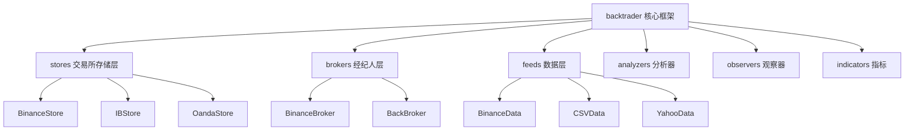
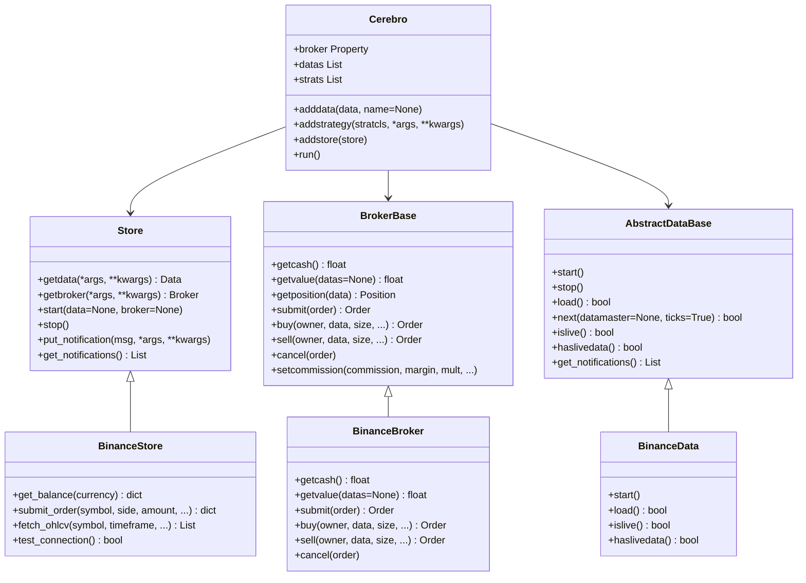
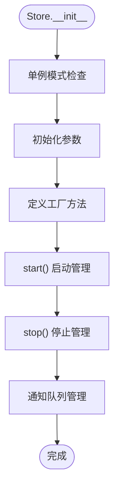
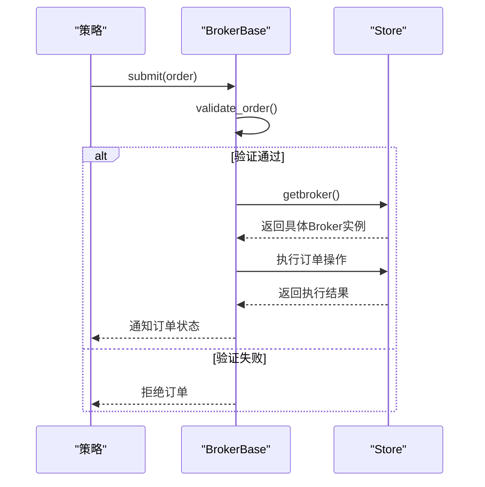
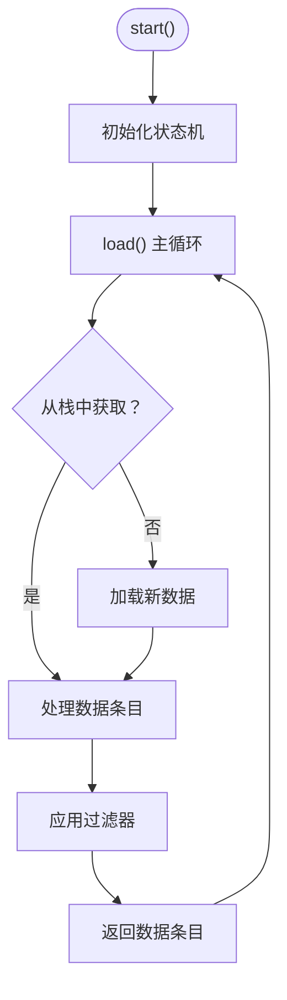
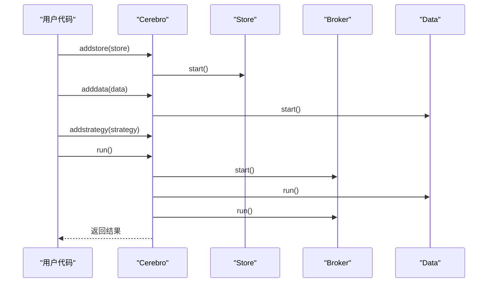
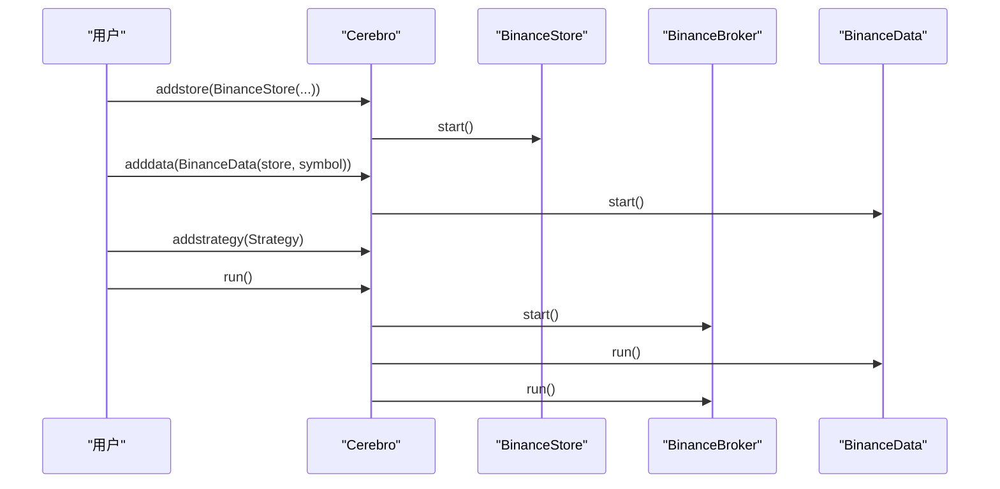
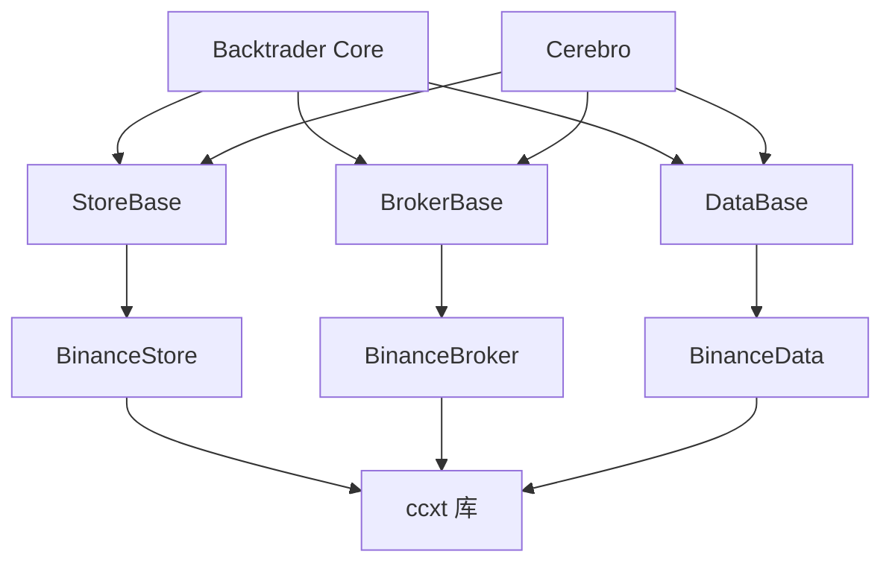

# 架构设计概览

<cite>
**本文档引用的文件**
- [__init__.py](file://backtrader/__init__.py)
- [store.py](file://backtrader/store.py)
- [broker.py](file://backtrader/broker.py)
- [feed.py](file://backtrader/feed.py)
- [cerebro.py](file://backtrader/cerebro.py)
- [binance.py](file://backtrader/stores/binance.py)
- [binance.py](file://backtrader/brokers/binance.py)
- [binance.py](file://backtrader/feeds/binance.py)
- [__init__.py](file://backtrader/stores/__init__.py)
- [__init__.py](file://backtrader/brokers/__init__.py)
- [binance_example.py](file://examples/binance_example.py)
</cite>

## 更新摘要
**所做更改**
- 删除了关于real_trade模块的过时内容，反映了模块的完全删除
- 更新了backtrader主框架的统一架构设计，包括stores、brokers、feeds三层架构
- 新增了Binance交易所的完整集成示例和实现细节
- 更新了架构图以反映主框架的统一设计模式
- 强调了backtrader核心框架的深度整合和模块化设计

## 目录
1. [简介](#简介)
2. [项目结构](#项目结构)
3. [核心组件](#核心组件)
4. [架构总览](#架构总览)
5. [详细组件分析](#详细组件分析)
6. [依赖关系分析](#依赖关系分析)
7. [性能考量](#性能考量)
8. [故障排除指南](#故障排除指南)
9. [结论](#结论)
10. [附录](#附录)

## 简介
本文件面向Backtrader主框架的统一架构设计，系统阐述模块化、统一API、多交易所支持、安全设计与演进规划。Backtrader通过"统一Store + 统一Broker + 统一Data"的三层架构，实现高复用、低耦合、易扩展的交易系统设计，支持Binance、Interactive Brokers、OANDA等主流交易所，并提供完整的回测和实盘交易能力。

**更新** 重点反映了从独立的real_trade模块向Backtrader主框架统一架构的转变，所有交易所实现都已深度整合到核心框架中。

## 项目结构
Backtrader主框架采用按功能域划分的层次化组织：
- backtrader：核心框架模块，提供统一的交易系统基础
- backtrader.stores：交易所存储层，管理连接和数据获取
- backtrader.brokers：经纪人层，处理订单和资金管理
- backtrader.feeds：数据层，提供各种数据源适配器
- backtrader.analyzers/observers/indicators：分析和观察组件
- examples：使用示例和最佳实践

**图表来源**
- [__init__.py](file://backtrader/__init__.py#L39-L84)
- [binance.py](file://backtrader/stores/binance.py#L32-L68)
- [binance.py](file://backtrader/brokers/binance.py#L30-L51)
- [binance.py](file://backtrader/feeds/binance.py#L29-L55)

**章节来源**
- [__init__.py](file://backtrader/__init__.py#L39-L84)

## 核心组件
- **统一Store基类**：提供连接管理、数据获取、通知机制的统一接口
- **统一Broker基类**：提供订单生命周期管理、资金管理、佣金计算的统一接口
- **统一Data基类**：提供OHLCV数据加载、时间周期处理、Backtrader集成的统一接口
- **Cerebro引擎**：提供策略执行、数据分析、可视化的一体化平台
- **交易所适配器**：Binance、Interactive Brokers、OANDA等交易所的具体实现
- **分析组件**：内置丰富的分析器、观察器、指标库
- **工具库**：提供日期处理、参数验证、内存管理等通用工具

**更新** 强调了Backtrader主框架提供的统一基类架构，所有交易所都基于这些统一接口实现。

关键特性
- **统一API**：通过统一的Store/Broker/Data接口，实现跨交易所的一致性
- **模块化设计**：stores、brokers、feeds三层架构，职责清晰分离
- **深度集成**：Cerebro引擎与各组件无缝集成，提供完整的交易生命周期
- **可扩展性**：新交易所只需实现统一接口即可快速接入
- **安全性**：默认模拟交易、测试网优先、参数验证等安全措施

**章节来源**
- [store.py](file://backtrader/store.py#L44-L95)
- [broker.py](file://backtrader/broker.py#L49-L169)
- [feed.py](file://backtrader/feed.py#L122-L325)

## 架构总览
Backtrader主框架遵循"统一基类 + 交易所适配器 + Cerebro引擎"的三层架构，通过继承与组合实现高内聚、低耦合。统一的Store负责连接管理与通用操作；Broker负责订单与资金管理；Data负责OHLCV数据的加载与推送；Cerebro提供统一的策略执行环境。

**更新** 新架构完全整合了stores、brokers、feeds三层，提供统一的交易系统设计。

**图表来源**
- [store.py](file://backtrader/store.py#L44-L95)
- [broker.py](file://backtrader/broker.py#L49-L169)
- [feed.py](file://backtrader/feed.py#L122-L325)
- [binance.py](file://backtrader/stores/binance.py#L32-L276)
- [binance.py](file://backtrader/brokers/binance.py#L30-L382)
- [binance.py](file://backtrader/feeds/binance.py#L29-L343)

## 详细组件分析

### 统一Store基类（Store）
- **职责**：统一连接管理、通用查询接口、通知机制、生命周期管理
- **关键点**：单例模式确保连接复用；getdata/getbroker提供工厂方法；start/stop管理资源
- **安全**：连接测试、异常捕获、线程安全的通知队列

**更新** 强调了Store作为统一连接管理基类的重要作用，为所有交易所提供一致的连接接口。

**图表来源**
- [store.py](file://backtrader/store.py#L44-L95)

**章节来源**
- [store.py](file://backtrader/store.py#L44-L95)

### 统一Broker基类（BrokerBase）
- **职责**：统一订单生命周期管理、资金管理、佣金计算、委托执行
- **关键点**：抽象方法定义标准接口；CommInfoBase统一佣金管理；线程安全的订单跟踪
- **兼容性**：与Backtrader核心框架深度集成，支持所有策略类型

**更新** 展示了BinanceBroker如何基于统一基类实现，体现了统一架构的代码复用优势。

**图表来源**
- [broker.py](file://backtrader/broker.py#L145-L163)

**章节来源**
- [broker.py](file://backtrader/broker.py#L49-L169)

### 统一Data基类（AbstractDataBase）
- **职责**：统一OHLCV数据加载、时间周期处理、Backtrader数据接口适配
- **关键点**：load/next模式确保与Backtrader的兼容性；状态机管理历史/实时数据；过滤器链处理
- **性能**：内存管理、预加载、回放/重采样支持

**更新** 强调了AbstractDataBase的标准化设计，为所有数据源提供一致的数据接口。

**图表来源**
- [feed.py](file://backtrader/feed.py#L471-L536)

**章节来源**
- [feed.py](file://backtrader/feed.py#L122-L536)

### Cerebro引擎
- **职责**：提供策略执行、数据分析、可视化的一体化平台
- **关键点**：统一的运行时环境；策略生命周期管理；分析器和观察器集成
- **功能**：回测、实盘、优化、可视化、报告生成

**更新** 强调了Cerebro作为统一执行环境的核心地位，整合了stores、brokers、feeds的所有组件。

**图表来源**
- [cerebro.py](file://backtrader/cerebro.py#L612-L774)

**章节来源**
- [cerebro.py](file://backtrader/cerebro.py#L60-L800)

### Binance交易所集成
- **Store**：继承统一Store，实现Binance连接管理、账户查询、订单提交
- **Broker**：继承统一Broker，实现Binance订单执行、资金管理、位置跟踪
- **Data**：继承统一Data，实现Binance OHLCV数据获取、实时推送、时间周期处理
- **便捷使用**：完整的示例代码展示如何使用Binance集成

**更新** Binance模块完美体现了统一基类架构的优势，所有组件都基于统一接口实现。

**图表来源**
- [binance_example.py](file://examples/binance_example.py#L91-L161)

**章节来源**
- [binance.py](file://backtrader/stores/binance.py#L32-L276)
- [binance.py](file://backtrader/brokers/binance.py#L30-L382)
- [binance.py](file://backtrader/feeds/binance.py#L29-L343)
- [binance_example.py](file://examples/binance_example.py#L91-L161)

## 依赖关系分析
- **模块间依赖**：backtrader.core为所有组件提供基础；各交易所模块基于统一基类实现
- **与Backtrader集成**：Store/Broker/Data分别继承统一基类，确保框架兼容性
- **与外部库集成**：Binance通过ccxt库实现API调用，IB通过ibpy，OANDA通过官方SDK
- **与Cerebro集成**：所有组件都通过Cerebro统一管理，提供完整的交易生命周期

**更新** 新架构完全整合了stores、brokers、feeds三层，所有组件都基于统一基类实现。

**图表来源**
- [store.py](file://backtrader/store.py#L44-L95)
- [broker.py](file://backtrader/broker.py#L49-L169)
- [feed.py](file://backtrader/feed.py#L122-L325)
- [binance.py](file://backtrader/stores/binance.py#L94-L128)

**章节来源**
- [store.py](file://backtrader/store.py#L44-L95)
- [broker.py](file://backtrader/broker.py#L49-L169)
- [feed.py](file://backtrader/feed.py#L122-L325)

## 性能考量
- **单例Store**：避免重复创建连接，减少网络开销与连接数上限问题
- **内存管理**：精确的缓冲区管理，支持大数据集处理；可配置的内存保存策略
- **异步处理**：后台线程处理数据获取和订单执行，不影响主线程性能
- **预加载优化**：支持数据预加载和向量化计算，提升回测速度
- **连接池**：统一的连接管理，支持多个数据源的高效复用

**更新** 新架构在性能方面进行了大量优化，特别是在内存管理和异步处理方面。

**章节来源**
- [store.py](file://backtrader/store.py#L44-L95)
- [feed.py](file://backtrader/feed.py#L297-L325)
- [cerebro.py](file://backtrader/cerebro.py#L274-L294)

## 故障排除指南
- **连接失败**：检查API密钥、网络连接、代理设置；使用Store.test_connection进行诊断
- **订单被拒**：确认资金充足、订单参数正确、交易所可用额度；检查佣金设置
- **数据缺失**：检查symbol、timeframe、fromdate/todate边界；确认交易所支持对应时间粒度
- **性能问题**：检查内存配置、预加载设置、数据源选择；优化数据处理管道
- **回测异常**：检查策略逻辑、参数设置、数据质量；使用调试模式定位问题

**更新** 新架构提供了更完善的错误处理和诊断机制。

**章节来源**
- [binance.py](file://backtrader/stores/binance.py#L152-L161)
- [binance.py](file://backtrader/brokers/binance.py#L173-L194)
- [binance.py](file://backtrader/feeds/binance.py#L195-L226)

## 结论
Backtrader主框架通过"统一Store + 统一Broker + 统一Data + Cerebro引擎"的统一架构，实现了高复用、强兼容与易扩展的设计目标。Binance模块基于统一基类的完整实现完美证明了架构的有效性，显著降低了接入成本与维护复杂度。新架构提供了完整的交易系统解决方案，包括回测、实盘、分析、可视化等功能。未来可继续扩展更多交易所与高级功能，同时持续优化性能与用户体验。

**更新** 强调了统一基类架构在代码复用和可扩展性方面的显著优势，为后续扩展奠定了坚实基础。

## 附录

### 统一API设计要点
- **接口一致性**：所有交易所提供相同的API接口，便于策略移植
- **参数标准化**：统一参数命名（apikey、secret、testnet、paper_trading等）
- **工厂模式**：getdata/getbroker提供统一的组件创建接口
- **生命周期管理**：统一的start/stop管理，确保资源正确释放

**更新** 强调了统一API设计在跨交易所迁移中的重要作用。

**章节来源**
- [store.py](file://backtrader/store.py#L51-L62)
- [broker.py](file://backtrader/broker.py#L112-L163)
- [feed.py](file://backtrader/feed.py#L148-L170)

### 多交易所支持模式
- **继承体系**：所有交易所完全复用统一基类，体现统一架构优势
- **自动注册**：通过元类自动注册BrokerCls/DataCls，简化集成流程
- **参数传递**：统一的参数传递机制，支持不同交易所的特定配置
- **扩展机制**：新交易所只需实现必要的接口即可快速接入

**更新** 通过Binance的完整实现，直观展示了统一基类架构的扩展性。

**章节来源**
- [binance.py](file://backtrader/stores/binance.py#L24-L27)
- [binance.py](file://backtrader/brokers/binance.py#L19-L27)
- [binance.py](file://backtrader/feeds/binance.py#L18-L26)

### 安全设计原则
- **默认模拟交易**：paper_trading默认开启，降低实盘风险
- **测试网优先**：testnet默认开启，建议先在测试网验证策略
- **参数验证**：通过统一的参数校验机制，确保输入数据的正确性
- **错误处理**：统一异常捕获与拒绝流程，避免脏数据进入策略
- **连接安全**：SSL/TLS加密传输，API密钥安全存储

**更新** 强调了统一基类在参数验证和错误处理方面的标准化优势。

**章节来源**
- [binance.py](file://backtrader/brokers/binance.py#L43-L51)
- [binance.py](file://backtrader/stores/binance.py#L55-L68)
- [binance.py](file://backtrader/stores/binance.py#L152-L161)

### 架构演进与未来规划
- **短期**：完善现有交易所的集成，优化性能和稳定性
- **中期**：增强WebSocket功能，支持更多实时数据源
- **长期**：集成机器学习风控模型，提供智能化交易决策支持

**更新** 基于统一基类架构的未来发展规划，突出了扩展性和智能化方向。

**章节来源**
- [__init__.py](file://backtrader/__init__.py#L39-L84)
- [binance_example.py](file://examples/binance_example.py#L91-L161)

### 工具库集成
- **日期处理**：统一的日期转换和时区处理工具
- **内存管理**：精确的内存使用控制和优化
- **参数验证**：完整的参数验证和类型检查机制
- **调试工具**：详细的日志记录和调试信息输出

**新增** 工具库为整个架构提供了完整的基础设施支持。

**章节来源**
- [feed.py](file://backtrader/feed.py#L24-L38)
- [feed.py](file://backtrader/feed.py#L246-L256)
- [cerebro.py](file://backtrader/cerebro.py#L274-L294)