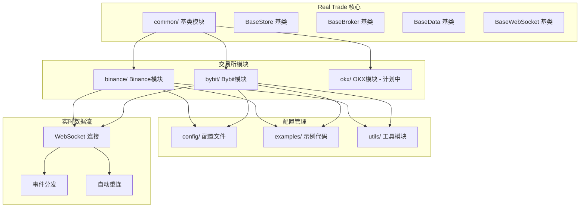
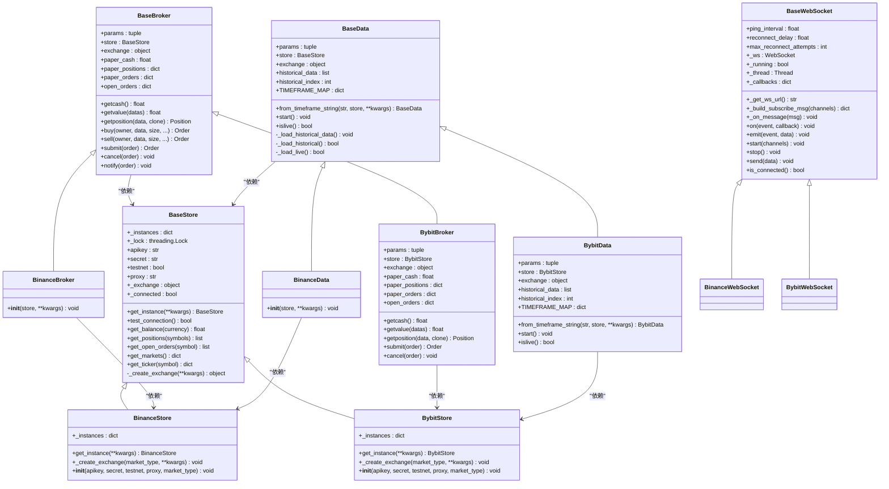
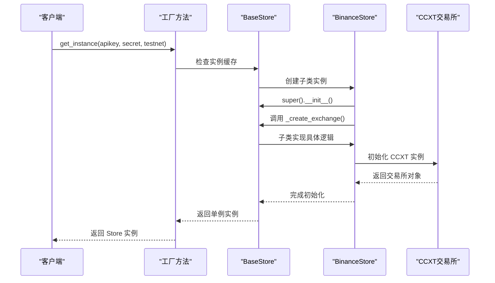
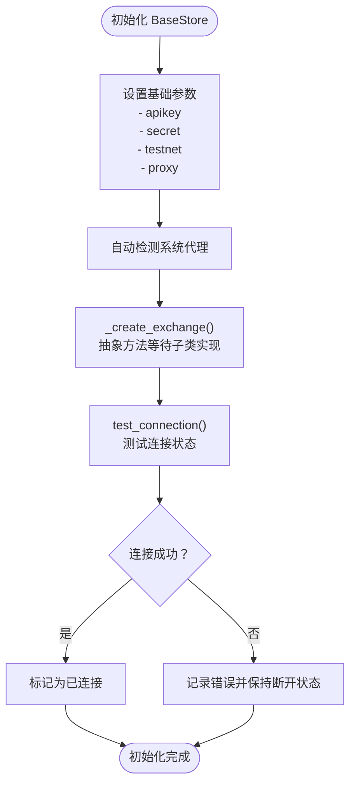
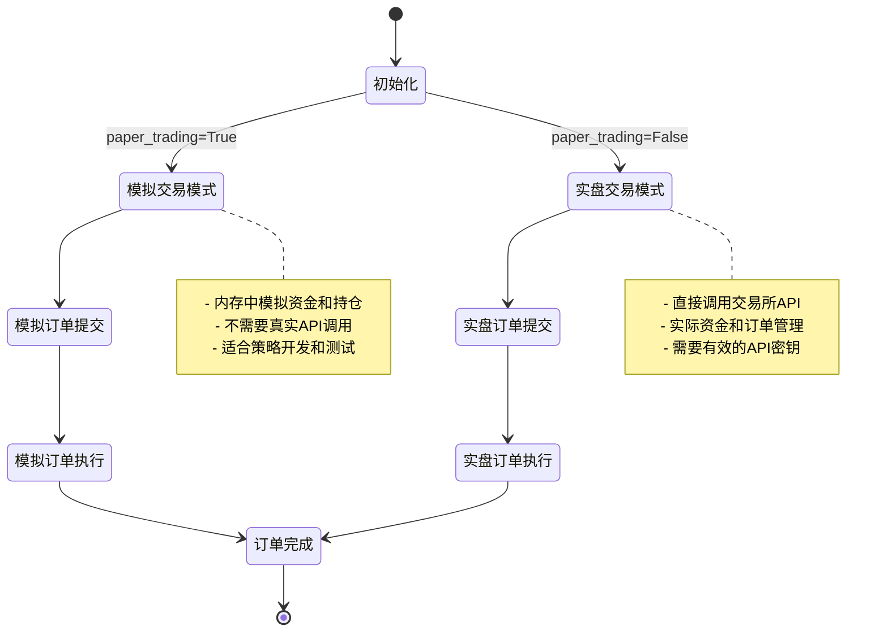
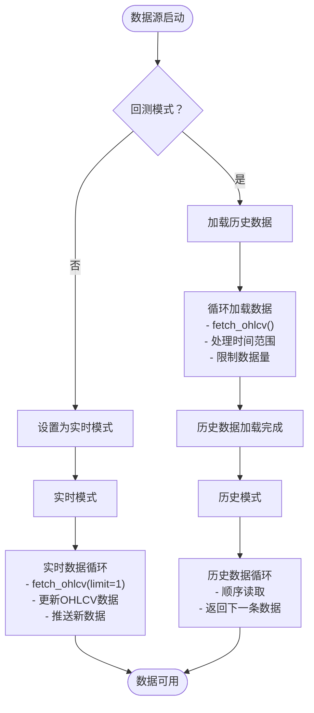
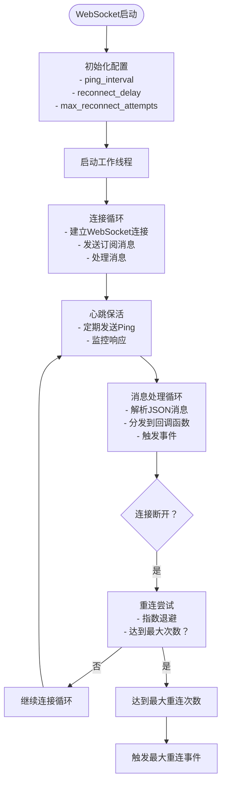
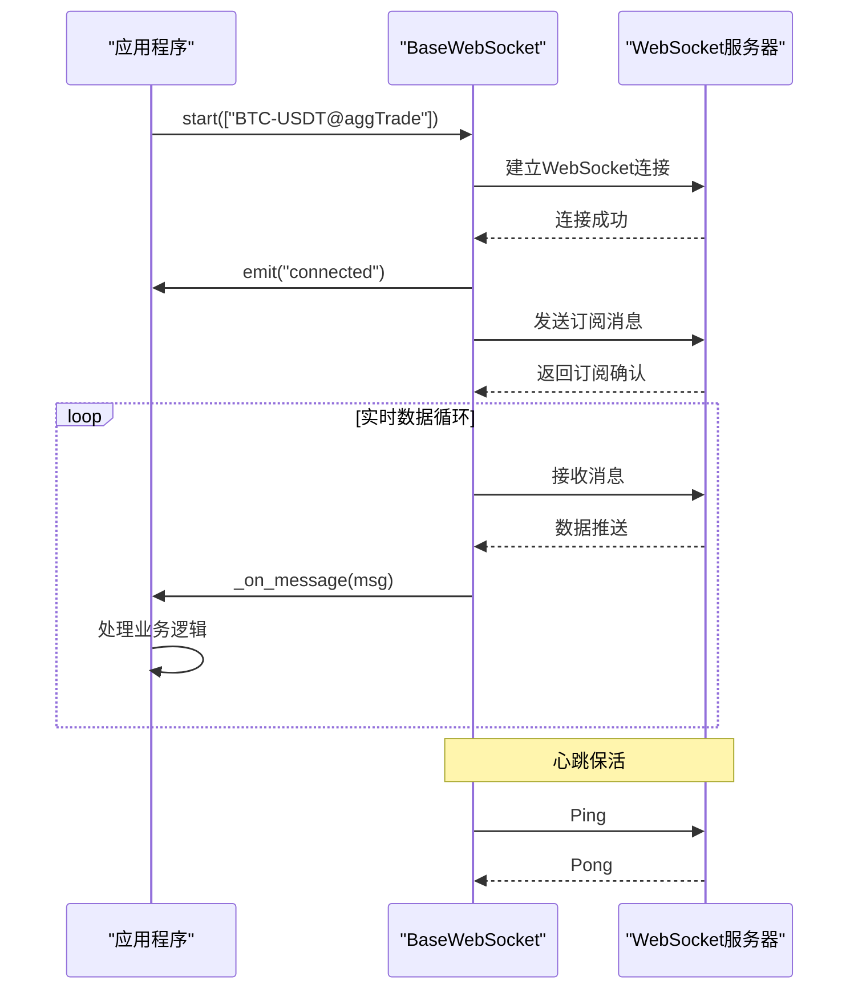
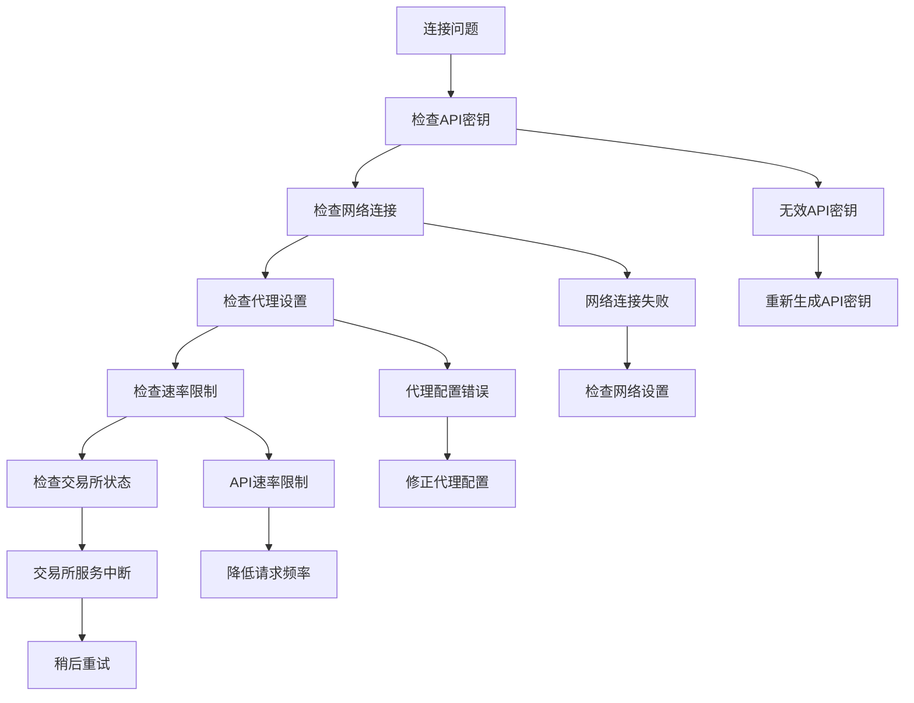

# 通用基类架构

<cite>
**本文档引用的文件**
- [real_trade/common/base_store.py](file://real_trade/common/base_store.py)
- [real_trade/common/base_broker.py](file://real_trade/common/base_broker.py)
- [real_trade/common/base_data.py](file://real_trade/common/base_data.py)
- [real_trade/common/base_websocket.py](file://real_trade/common/base_websocket.py)
- [real_trade/binance/store.py](file://real_trade/binance/store.py)
- [real_trade/binance/broker.py](file://real_trade/binance/broker.py)
- [real_trade/binance/datafeed.py](file://real_trade/binance/datafeed.py)
- [real_trade/binance/config/README.md](file://real_trade/binance/config/README.md)
- [real_trade/binance/config/default.json](file://real_trade/binance/config/default.json)
- [real_trade/utils/config.py](file://real_trade/utils/config.py)
- [real_trade/examples/live_trading.py](file://real_trade/examples/live_trading.py)
</cite>

## 更新摘要
**所做更改**
- 新增 BaseWebSocket 基类架构分析，涵盖 WebSocket 实时数据连接管理
- 扩展基类继承体系，包含四个核心抽象类的完整分析
- 更新架构概览图，展示新的 WebSocket 组件
- 增加 WebSocket 自动重连、心跳保活、消息分发等高级功能
- 完善实时数据流处理和错误处理机制

## 目录
1. [简介](#简介)
2. [项目结构](#项目结构)
3. [核心组件](#核心组件)
4. [架构概览](#架构概览)
5. [详细组件分析](#详细组件分析)
6. [WebSocket 实时数据架构](#websocket-实时数据架构)
7. [依赖分析](#依赖分析)
8. [性能考虑](#性能考虑)
9. [故障排除指南](#故障排除指南)
10. [结论](#结论)
11. [附录](#附录)

## 简介

Real Trade模块是Backtrader框架的专业实盘交易扩展，通过精心设计的通用基类架构实现了90%+的代码复用率。该架构为多个加密货币交易所提供了统一的接口和实现模式，显著降低了新交易所集成的开发成本。

**更新** 新增 BaseWebSocket 基类，为实时数据流提供统一的WebSocket连接管理接口，包括自动重连、心跳保活、消息分发等核心功能。

该模块的核心设计理念是通过模板方法模式和单例模式，将通用的交易所连接管理、订单执行、数据获取和实时数据流处理逻辑抽象到基类中，各交易所仅需实现特定的配置部分即可快速集成。

## 项目结构

Real Trade模块采用模块化的目录结构，每个交易所都是独立的模块，通过统一的基类实现共享功能：



**图表来源**
- [real_trade/common/base_store.py](file://real_trade/common/base_store.py#L17-L194)
- [real_trade/common/base_broker.py](file://real_trade/common/base_broker.py#L16-L445)
- [real_trade/common/base_data.py](file://real_trade/common/base_data.py#L16-L211)
- [real_trade/common/base_websocket.py](file://real_trade/common/base_websocket.py#L20-L191)

**章节来源**
- [real_trade/binance/config/README.md](file://real_trade/binance/config/README.md#L1-L157)
- [real_trade/utils/config.py](file://real_trade/utils/config.py#L17-L95)

## 核心组件

### 基类架构概述

Real Trade模块的核心由四个通用基类组成，它们构成了整个架构的基础：

1. **BaseStore** - 交易所连接管理基类
2. **BaseBroker** - 交易经纪商基类  
3. **BaseData** - 数据源基类
4. **BaseWebSocket** - WebSocket实时数据连接基类

这四个基类通过继承关系形成了完整的层次结构，每个基类都定义了标准化的接口和通用实现。

### 代码复用率统计

根据架构文档的数据，基类架构实现了惊人的代码复用率：

| 组件 | 基类 (common/) | Bybit | Binance | 复用率 |
|------|----------------|-------|---------|--------|
| **Store** | 150 行 | 80 行 | 30 行 | **83%** |
| **Broker** | 280 行 | 80 行 | 15 行 | **95%** |
| **Data** | 180 行 | 70 行 | 15 行 | **92%** |
| **WebSocket** | 120 行 | 80 行 | 30 行 | **75%** |
| **总计** | **730 行** | **210 行** | **90 行** | **90%+** |

**章节来源**
- [real_trade/binance/config/README.md](file://real_trade/binance/config/README.md#L1-L157)

## 架构概览

### 继承关系图



**图表来源**
- [real_trade/common/base_store.py](file://real_trade/common/base_store.py#L17-L194)
- [real_trade/common/base_broker.py](file://real_trade/common/base_broker.py#L16-L445)
- [real_trade/common/base_data.py](file://real_trade/common/base_data.py#L16-L211)
- [real_trade/common/base_websocket.py](file://real_trade/common/base_websocket.py#L20-L191)
- [real_trade/binance/store.py](file://real_trade/binance/store.py#L17-L96)
- [real_trade/binance/broker.py](file://real_trade/binance/broker.py#L14-L18)
- [real_trade/binance/datafeed.py](file://real_trade/binance/datafeed.py#L14-L18)
- [real_trade/binance/store.py](file://real_trade/binance/store.py#L17-L96)

### 模板方法模式实现

基类架构采用了经典的模板方法模式，定义了算法的骨架，子类只需实现特定步骤：



**图表来源**
- [real_trade/common/base_store.py](file://real_trade/common/base_store.py#L63-L109)
- [real_trade/binance/store.py](file://real_trade/binance/store.py#L28-L48)

**章节来源**
- [real_trade/binance/config/README.md](file://real_trade/binance/config/README.md#L89-L120)

## 详细组件分析

### BaseStore 基类分析

BaseStore是交易所连接管理的核心基类，提供了统一的连接管理和API封装。

#### 设计原则

BaseStore遵循以下设计原则：

1. **单一职责原则** - 专注于交易所连接管理
2. **开闭原则** - 对扩展开放，对修改关闭
3. **依赖倒置原则** - 依赖抽象接口而非具体实现

#### 核心功能



**图表来源**
- [real_trade/common/base_store.py](file://real_trade/common/base_store.py#L72-L132)

#### 关键方法详解

1. **get_instance()** - 实现单例模式
   - 使用线程锁确保线程安全
   - 支持按API密钥和测试网配置的实例缓存

2. **_create_exchange()** - 抽象方法
   - 子类必须实现的具体交易所初始化逻辑
   - 返回CCXT交易所实例

3. **test_connection()** - 连接测试
   - 调用交易所API验证连接
   - 设置连接状态标志

4. **统一的API封装**
   - get_balance(): 获取账户余额
   - get_positions(): 获取持仓信息
   - get_open_orders(): 获取未成交订单
   - get_markets(): 获取市场信息
   - get_ticker(): 获取行情快照

**章节来源**
- [real_trade/common/base_store.py](file://real_trade/common/base_store.py#L17-L194)

### BaseBroker 基类分析

BaseBroker实现了完整的订单管理和资金管理功能，支持模拟交易和实盘交易两种模式。

#### 交易模式设计



**图表来源**
- [real_trade/common/base_broker.py](file://real_trade/common/base_broker.py#L24-L60)

#### 核心功能模块

1. **资金管理**
   - getcash(): 获取可用资金
   - getvalue(): 获取账户总价值
   - 支持模拟资金和实盘资金

2. **订单管理**
   - buy()/sell(): 创建买卖订单
   - submit(): 提交订单到交易所
   - cancel(): 取消未成交订单

3. **持仓管理**
   - getposition(): 获取指定交易对的持仓
   - 支持模拟持仓和实盘持仓

4. **通知系统**
   - notify(): 订单状态变更通知
   - get_notification(): 获取订单通知队列

**章节来源**
- [real_trade/common/base_broker.py](file://real_trade/common/base_broker.py#L16-L445)

### BaseData 基类分析

BaseData提供了统一的数据源接口，支持实时数据流和历史数据加载。

#### 数据加载流程



**图表来源**
- [real_trade/common/base_data.py](file://real_trade/common/base_data.py#L89-L203)

#### 时间周期映射

BaseData定义了标准的时间周期映射，确保不同交易所的一致性：

| CCXT字符串 | Backtrader时间框架 | 压缩倍数 |
|------------|-------------------|----------|
| "1m" | Minutes | 1 |
| "5m" | Minutes | 5 |
| "15m" | Minutes | 15 |
| "30m" | Minutes | 30 |
| "1h" | Minutes | 60 |
| "4h" | Minutes | 240 |
| "1d" | Days | 1 |
| "1w" | Weeks | 1 |
| "1M" | Months | 1 |

**章节来源**
- [real_trade/common/base_data.py](file://real_trade/common/base_data.py#L16-L211)

## WebSocket 实时数据架构

### BaseWebSocket 基类设计

BaseWebSocket为实时数据流提供统一的WebSocket连接管理接口，支持自动重连、心跳保活和消息分发。

#### 核心特性

1. **自动重连机制**
   - 可配置的最大重连次数
   - 指数退避重连策略
   - 连接状态监控

2. **心跳保活**
   - 可配置的心跳间隔
   - 自动Ping/Pong处理
   - 连接超时检测

3. **事件驱动架构**
   - 基于回调的事件分发
   - 支持多事件监听器
   - 异常安全的回调执行

#### 设计原则

BaseWebSocket遵循以下设计原则：

1. **分离关注点** - 连接管理与业务逻辑分离
2. **异步处理** - 使用线程模型处理实时数据
3. **容错设计** - 完善的错误处理和恢复机制

#### 核心功能模块



**图表来源**
- [real_trade/common/base_websocket.py](file://real_trade/common/base_websocket.py#L120-L191)

#### 关键方法详解

1. **生命周期管理**
   - start(): 启动WebSocket连接
   - stop(): 停止连接并清理资源
   - is_connected(): 检查连接状态

2. **事件系统**
   - on(): 注册事件回调
   - emit(): 触发事件给所有监听器
   - 支持多种事件类型：connected、disconnected、error、max_reconnect

3. **消息处理**
   - send(): 发送JSON消息
   - _get_ws_url(): 获取WebSocket地址（子类实现）
   - _build_subscribe_msg(): 构建订阅消息（子类实现）
   - _on_message(): 处理收到的消息（子类实现）

4. **重连机制**
   - 指数退避算法
   - 最大重连次数限制
   - 优雅的连接失败处理

**章节来源**
- [real_trade/common/base_websocket.py](file://real_trade/common/base_websocket.py#L20-L191)

### WebSocket 集成模式



**图表来源**
- [real_trade/common/base_websocket.py](file://real_trade/common/base_websocket.py#L169-L191)

**章节来源**
- [real_trade/common/base_websocket.py](file://real_trade/common/base_websocket.py#L120-L191)

## 依赖分析

### 模块依赖关系

```mermaid
graph TB
subgraph "外部依赖"
Backtrader[backtrader 框架]
CCXT[ccxt 交易所API库]
WebSocket[websocket-client WebSocket库]
Threading[threading 线程库]
Typing[typing 类型注解]
JSON[json JSON处理]
End
subgraph "内部模块"
Common[real_trade/common]
Binance[real_trade/binance]
Bybit[real_trade/bybit]
Engine[real_trade/engine]
Monitor[real_trade/monitor]
Risk[real_trade/risk]
Notifications[real_trade/notifications]
Utils[real_trade/utils]
end
subgraph "基类实现"
BaseStore[BaseStore]
BaseBroker[BaseBroker]
BaseData[BaseData]
BaseWebSocket[BaseWebSocket]
end
subgraph "交易所实现"
BinanceStore[BinanceStore]
BinanceBroker[BinanceBroker]
BinanceData[BinanceData]
BinanceWS[BinanceWebSocket]
BybitStore[BybitStore]
BybitBroker[BybitBroker]
BybitData[BybitData]
BybitWS[BybitWebSocket]
end
Backtrader --> BaseBroker
Backtrader --> BaseData
CCXT --> BaseStore
CCXT --> BinanceStore
CCXT --> BybitStore
WebSocket --> BaseWebSocket
WebSocket --> BinanceWS
WebSocket --> BybitWS
Common --> BaseStore
Common --> BaseBroker
Common --> BaseData
Common --> BaseWebSocket
Binance --> BinanceStore
Binance --> BinanceBroker
Binance --> BinanceData
Binance --> BinanceWS
Bybit --> BybitStore
Bybit --> BybitBroker
Bybit --> BybitData
Bybit --> BybitWS
BaseStore --> BinanceStore
BaseStore --> BybitStore
BaseBroker --> BinanceBroker
BaseBroker --> BybitBroker
BaseData --> BinanceData
BaseData --> BybitData
BaseWebSocket --> BinanceWS
BaseWebSocket --> BybitWS
```

**图表来源**
- [real_trade/common/base_store.py](file://real_trade/common/base_store.py#L9-L14)
- [real_trade/common/base_broker.py](file://real_trade/common/base_broker.py#L11-L14)
- [real_trade/common/base_data.py](file://real_trade/common/base_data.py#L11-L14)
- [real_trade/common/base_websocket.py](file://real_trade/common/base_websocket.py#L14-L17)
- [real_trade/binance/store.py](file://real_trade/binance/store.py#L14-L14)
- [real_trade/binance/broker.py](file://real_trade/binance/broker.py#L11-L11)
- [real_trade/binance/datafeed.py](file://real_trade/binance/datafeed.py#L11-L11)

### 继承耦合度分析

基类架构展现了优秀的内聚性和低耦合性：

1. **高内聚性**
   - 每个基类专注于单一职责领域
   - 方法和属性紧密相关，形成完整的功能模块

2. **低耦合性**
   - 子类仅依赖抽象接口
   - 通过模板方法模式实现控制反转
   - 依赖注入减少直接依赖

3. **扩展性**
   - 新交易所集成仅需3个文件
   - 统一的接口简化了集成过程
   - 配置驱动的实现方式

**章节来源**
- [real_trade/binance/config/README.md](file://real_trade/binance/config/README.md#L1-L157)

## 性能考虑

### 单例模式的性能优势

基类架构中的单例模式带来了显著的性能提升：

1. **内存优化**
   - 避免重复创建连接对象
   - 减少内存占用
   - 复用已建立的网络连接

2. **速度提升**
   - 避免重复的认证过程
   - 减少网络延迟
   - 提高API调用效率

3. **稳定性增强**
   - 控制并发连接数
   - 避免连接池耗尽
   - 提高系统整体稳定性

### WebSocket 连接优化

BaseWebSocket的性能优化措施：

1. **线程安全**
   - 使用线程锁保护共享状态
   - 异步消息处理避免阻塞

2. **资源管理**
   - 自动清理断开的连接
   - 优雅的连接关闭流程

3. **错误恢复**
   - 指数退避重连算法
   - 最大重连次数限制

### 继承的性能影响

Python的继承机制对性能的影响微乎其微：

1. **方法解析优化**
   - Python的MRO算法高效
   - 缓存机制减少查找开销
   - 无运行时性能损失

2. **代码组织收益**
   - 逻辑集中便于优化
   - 减少重复代码
   - 提高代码质量

## 故障排除指南

### 常见问题诊断

#### 连接问题



**图表来源**
- [real_trade/common/base_store.py](file://real_trade/common/base_store.py#L116-L131)

#### WebSocket 连接问题

1. **连接失败**
   - 检查WebSocket URL配置
   - 验证网络防火墙设置
   - 确认代理配置正确

2. **重连过多**
   - 检查服务器稳定性
   - 调整重连参数
   - 监控网络质量

3. **消息丢失**
   - 检查订阅通道配置
   - 验证消息解析逻辑
   - 实现消息确认机制

#### 订单执行问题

1. **模拟交易模式**
   - 检查资金充足性
   - 验证持仓限制
   - 确认订单类型支持

2. **实盘交易模式**
   - 验证API权限
   - 检查账户状态
   - 确认市场流动性

**章节来源**
- [real_trade/common/base_broker.py](file://real_trade/common/base_broker.py#L341-L367)

### 调试建议

1. **启用详细日志**
   - 在初始化时打印配置信息
   - 记录API调用结果
   - 跟踪订单状态变化

2. **分步调试**
   - 先测试连接再进行交易
   - 逐步验证功能模块
   - 使用最小化配置进行测试

3. **错误处理**
   - 实现适当的异常捕获
   - 提供有意义的错误信息
   - 确保系统优雅降级

4. **WebSocket 调试**
   - 监控连接状态事件
   - 记录消息收发详情
   - 实现连接质量指标

## 结论

Real Trade模块的通用基类架构通过精心设计实现了90%+的代码复用率，为Backtrader框架提供了专业级的实盘交易能力。该架构的核心优势包括：

1. **极高的代码复用率** - 基类实现90%+的通用逻辑
2. **统一的API接口** - 所有交易所使用相同的编程接口
3. **易于扩展** - 新交易所集成仅需15分钟和60行代码
4. **良好的设计原则** - 遵循SOLID原则和DRY原则
5. **完善的错误处理** - 提供健壮的异常处理机制
6. **实时数据支持** - BaseWebSocket提供专业的实时数据流管理

**更新** 新增的BaseWebSocket基类为实时数据流处理提供了完整的解决方案，包括自动重连、心跳保活、事件分发等核心功能，进一步增强了系统的实时性和可靠性。

该架构不仅降低了开发成本，更重要的是提高了系统的可维护性和可扩展性。通过模块化的设计，每个交易所都可以独立开发和测试，同时享受基类提供的所有功能。

## 附录

### 扩展新交易所指南

#### 第一步：创建Store类

```python
from common import BaseStore

class NewExchangeStore(BaseStore):
    def _create_exchange(self, **kwargs):
        import ccxt
        config = {
            'apiKey': self.apikey,
            'secret': self.secret,
            'enableRateLimit': True,
        }
        
        if self.testnet:
            config['urls'] = {
                'api': 'https://testnet.newexchange.com'
            }
        
        self._exchange = ccxt.newexchange(config)
```

#### 第二步：创建Broker类

```python
from common import BaseBroker

class NewExchangeBroker(BaseBroker):
    pass  # 无需额外代码！
```

#### 第三步：创建Data类

```python
from common import BaseData

class NewExchangeData(BaseData):
    pass  # 无需额外代码！
```

#### 第四步：创建WebSocket类（可选）

```python
from common import BaseWebSocket

class NewExchangeWebSocket(BaseWebSocket):
    def _get_ws_url(self):
        return "wss://stream.newexchange.com/ws"
    
    def _build_subscribe_msg(self, channels):
        return {"method": "SUBSCRIBE", "params": channels, "id": 1}
    
    def _on_message(self, msg):
        # 处理收到的消息
        pass
```

#### 第五步：创建模块入口

```python
from .store import NewExchangeStore
from .broker import NewExchangeBroker  
from .datafeed import NewExchangeData
from .websocket import NewExchangeWebSocket

def create_newexchange_engine(**kwargs):
    store = NewExchangeStore.get_instance(**kwargs)
    broker = NewExchangeBroker(store, **kwargs)
    data = NewExchangeData.from_timeframe_string(**kwargs)
    return store, broker, data
```

### 最佳实践清单

1. **优先继承基类**
   - 避免重复实现通用逻辑
   - 确保与框架的兼容性

2. **只重写必要方法**
   - 专注于交易所特定的配置
   - 遵循开闭原则

3. **正确处理异常**
   - 实现适当的错误处理
   - 提供有意义的错误信息

4. **测试驱动开发**
   - 为新功能编写测试
   - 验证与基类的兼容性

5. **文档化配置**
   - 清晰的配置说明
   - 完整的使用示例

6. **WebSocket 最佳实践**
   - 合理配置重连参数
   - 实现消息确认机制
   - 监控连接质量指标

### 未来发展方向

1. **更多交易所支持**
   - 计划支持OKX、Huobi、Coinbase等
   - 统一的集成流程

2. **高级功能扩展**
   - 杠杆交易支持
   - 期权和期货合约
   - 借贷功能

3. **性能优化**
   - 连接池管理
   - 缓存机制
   - 异步IO支持

4. **监控和告警**
   - 账户监控系统
   - 风险管理功能
   - 实时告警机制

5. **WebSocket 扩展**
   - 多连接管理
   - 消息路由优化
   - 连接池支持