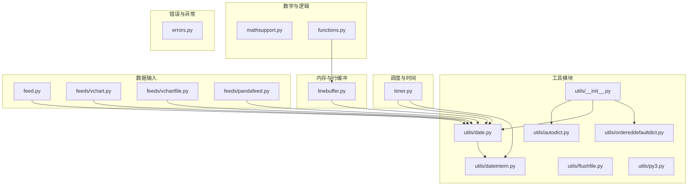
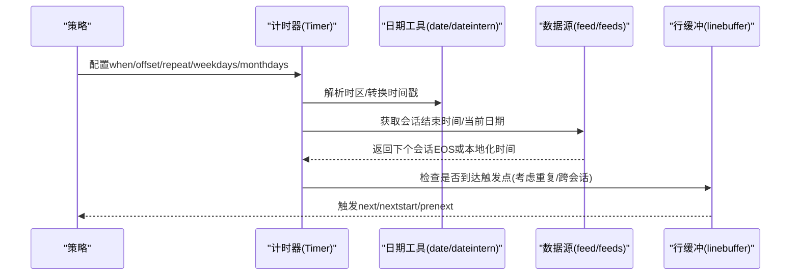
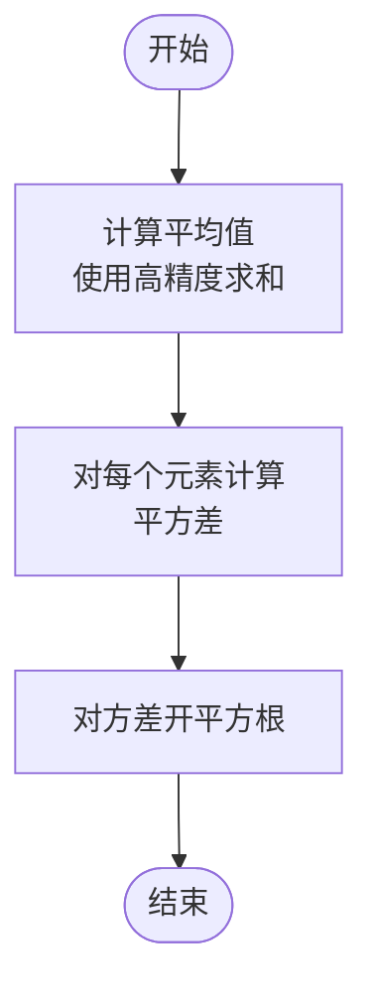
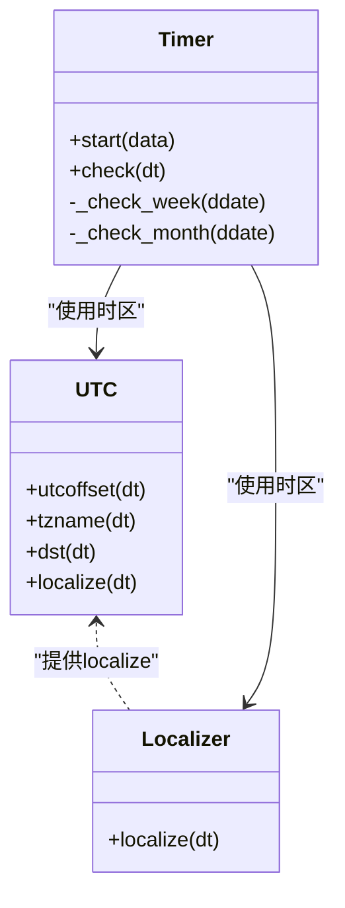
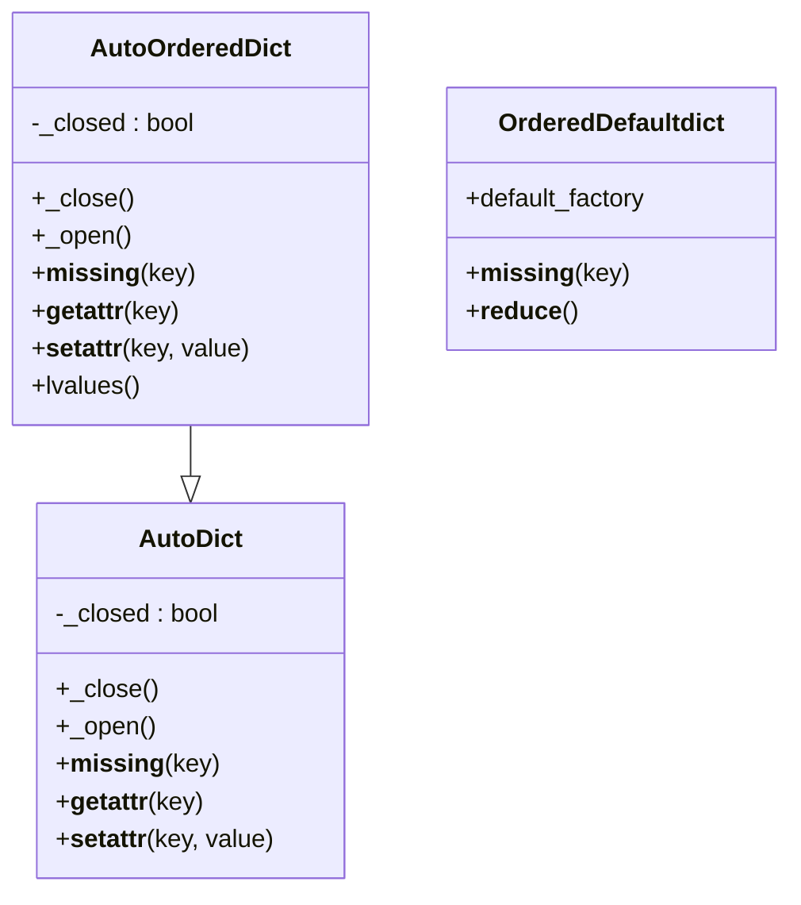
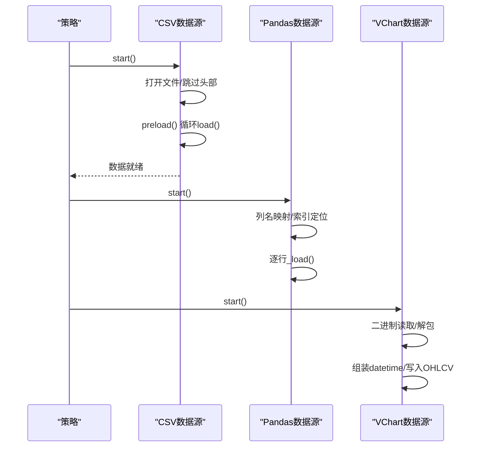
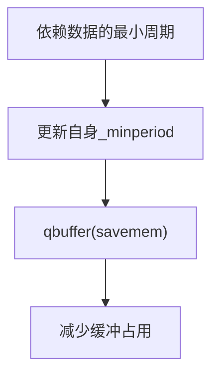
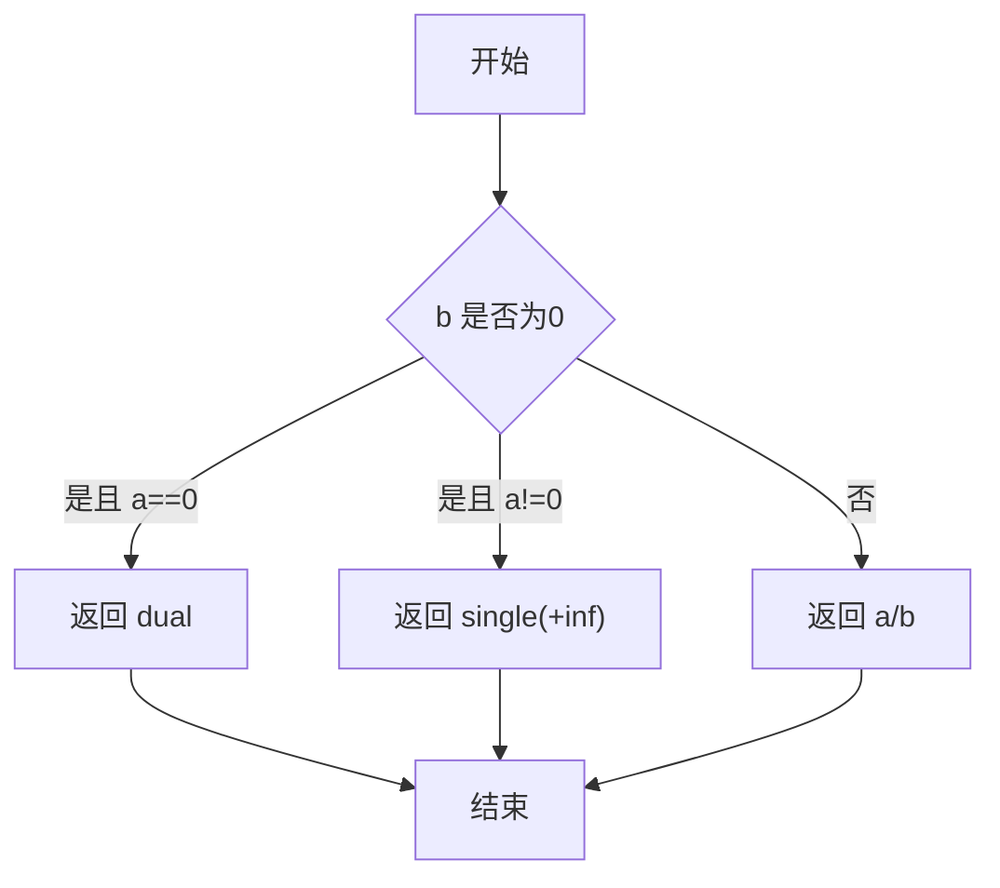
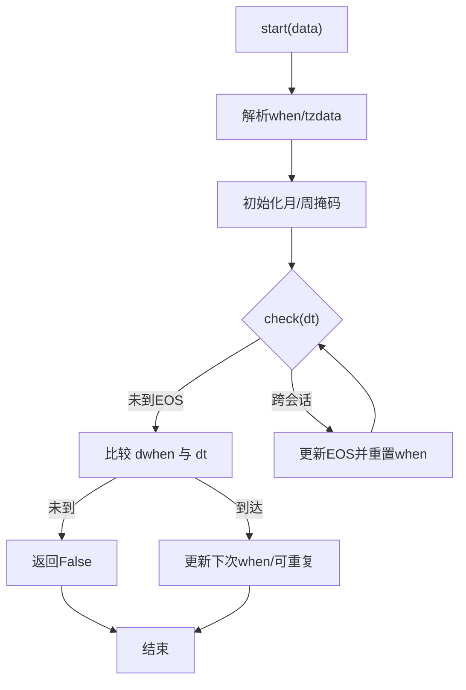
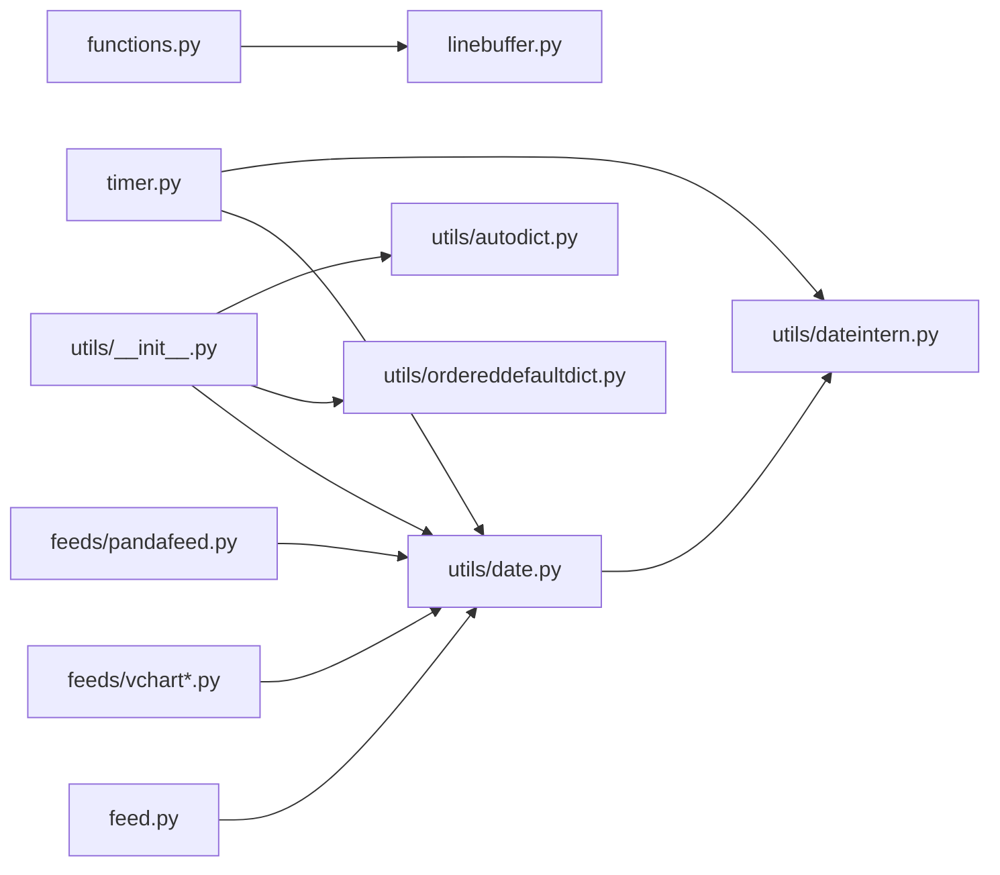

# 工具函数与实用程序

<cite>
**本文引用的文件**
- [backtrader/utils/__init__.py](file://backtrader/utils/__init__.py)
- [backtrader/utils/autodict.py](file://backtrader/utils/autodict.py)
- [backtrader/utils/date.py](file://backtrader/utils/date.py)
- [backtrader/utils/dateintern.py](file://backtrader/utils/dateintern.py)
- [backtrader/utils/ordereddefaultdict.py](file://backtrader/utils/ordereddefaultdict.py)
- [backtrader/utils/flushfile.py](file://backtrader/utils/flushfile.py)
- [backtrader/utils/py3.py](file://backtrader/utils/py3.py)
- [backtrader/functions.py](file://backtrader/functions.py)
- [backtrader/mathsupport.py](file://backtrader/mathsupport.py)
- [backtrader/timer.py](file://backtrader/timer.py)
- [backtrader/errors.py](file://backtrader/errors.py)
- [backtrader/linebuffer.py](file://backtrader/linebuffer.py)
- [backtrader/feed.py](file://backtrader/feed.py)
- [backtrader/feeds/vchart.py](file://backtrader/feeds/vchart.py)
- [backtrader/feeds/vchartfile.py](file://backtrader/feeds/vchartfile.py)
- [backtrader/feeds/pandafeed.py](file://backtrader/feeds/pandafeed.py)
- [samples/memory-savings/memory-savings.py](file://samples/memory-savings/memory-savings.py)
</cite>

## 目录
1. [简介](#简介)
2. [项目结构](#项目结构)
3. [核心组件](#核心组件)
4. [架构总览](#架构总览)
5. [详细组件分析](#详细组件分析)
6. [依赖关系分析](#依赖关系分析)
7. [性能考量](#性能考量)
8. [故障排查指南](#故障排查指南)
9. [结论](#结论)
10. [附录](#附录)

## 简介
本文件系统性梳理 Backtrader 的工具函数与实用程序，覆盖以下方面：
- 数学支持模块：数值计算、统计函数（均值、方差、标准差）
- 日期时间处理：时间戳转换、时区处理、交易日/会话时间计算
- 数据结构工具：自动字典、有序默认字典、缓存机制
- 文件处理与 I/O：CSV/Pandas/VChart 等数据读取流程
- 调试与输出：缓冲刷新、标准输出重定向
- 内存管理与性能优化：行缓冲最小周期、缓存复用、运行参数优化
- 常用算法与数据处理模式：条件逻辑、分母归零保护、比较与分支、聚合与归约
- 常见问题与性能瓶颈：除零、精度误差、时区转换、内存占用
- 扩展与自定义：基于元类的缓存、可插拔的时区解析、可复用的数据加载器

## 项目结构
工具与实用程序主要位于 backtrader/utils 及其子模块，并与核心执行路径（如 linebuffer、timer、feed）紧密协作。

**图表来源**
- [backtrader/utils/__init__.py](file://backtrader/utils/__init__.py#L24-L30)
- [backtrader/utils/date.py](file://backtrader/utils/date.py#L25-L29)
- [backtrader/utils/dateintern.py](file://backtrader/utils/dateintern.py#L48-L84)
- [backtrader/utils/autodict.py](file://backtrader/utils/autodict.py#L29-L146)
- [backtrader/utils/ordereddefaultdict.py](file://backtrader/utils/ordereddefaultdict.py#L31-L51)
- [backtrader/utils/flushfile.py](file://backtrader/utils/flushfile.py#L27-L58)
- [backtrader/utils/py3.py](file://backtrader/utils/py3.py#L27-L134)
- [backtrader/mathsupport.py](file://backtrader/mathsupport.py#L27-L66)
- [backtrader/functions.py](file://backtrader/functions.py#L31-L259)
- [backtrader/timer.py](file://backtrader/timer.py#L42-L226)
- [backtrader/errors.py](file://backtrader/errors.py#L25-L52)
- [backtrader/linebuffer.py](file://backtrader/linebuffer.py#L499-L689)
- [backtrader/feed.py](file://backtrader/feed.py#L649-L697)
- [backtrader/feeds/vchart.py](file://backtrader/feeds/vchart.py#L78-L125)
- [backtrader/feeds/vchartfile.py](file://backtrader/feeds/vchartfile.py#L84-L130)
- [backtrader/feeds/pandafeed.py](file://backtrader/feeds/pandafeed.py#L204-L244)

**章节来源**
- [backtrader/utils/__init__.py](file://backtrader/utils/__init__.py#L24-L30)
- [backtrader/utils/date.py](file://backtrader/utils/date.py#L25-L29)

## 核心组件
- 自动字典与有序默认字典：用于动态嵌套结构构建与保持插入顺序
- 日期时间工具：提供 num2date/date2num/time2num 的双向转换与时区本地化
- 逻辑与数学函数：条件判断、分支、聚合、归约以及除零保护
- 计时器：按周/月/会话时间触发策略事件
- 文件与 I/O：CSV/Pandas/VChart 等数据源的统一加载流程
- 缓冲与输出：行缓冲最小周期控制、标准输出刷新与静默
- 错误体系：基础异常与导入失败异常

**章节来源**
- [backtrader/utils/autodict.py](file://backtrader/utils/autodict.py#L29-L146)
- [backtrader/utils/dateintern.py](file://backtrader/utils/dateintern.py#L149-L241)
- [backtrader/functions.py](file://backtrader/functions.py#L31-L259)
- [backtrader/timer.py](file://backtrader/timer.py#L42-L226)
- [backtrader/feed.py](file://backtrader/feed.py#L649-L697)
- [backtrader/utils/flushfile.py](file://backtrader/utils/flushfile.py#L27-L58)
- [backtrader/errors.py](file://backtrader/errors.py#L25-L52)

## 架构总览
工具层为上层指标、观察者、分析器与策略提供通用能力；与数据流结合通过行缓冲最小周期进行协调；计时器与时间工具贯穿回测/实盘的时间推进。

**图表来源**
- [backtrader/timer.py](file://backtrader/timer.py#L61-L226)
- [backtrader/utils/date.py](file://backtrader/utils/date.py#L25-L29)
- [backtrader/utils/dateintern.py](file://backtrader/utils/dateintern.py#L149-L241)
- [backtrader/linebuffer.py](file://backtrader/linebuffer.py#L612-L634)

## 详细组件分析

### 数学支持模块（数值计算、统计函数）
- 平均值：使用高精度求和以减少舍入误差
- 方差：对每个元素计算与均值的平方差
- 标准差：对方差开平方根，支持贝塞尔校正

**图表来源**
- [backtrader/mathsupport.py](file://backtrader/mathsupport.py#L27-L66)

**章节来源**
- [backtrader/mathsupport.py](file://backtrader/mathsupport.py#L27-L66)

### 日期时间处理工具（时间戳转换、时区处理、交易日计算）
- 时间戳转换：num2date/date2num/time2num 提供浮点天数与 datetime 的互转
- 时区处理：UTC 本地时区类、本地化器、tzparse 支持字符串时区解析
- 交易日与时钟：配合计时器在会话开始/结束/指定时刻触发

**图表来源**
- [backtrader/utils/dateintern.py](file://backtrader/utils/dateintern.py#L87-L137)
- [backtrader/timer.py](file://backtrader/timer.py#L61-L226)

**章节来源**
- [backtrader/utils/dateintern.py](file://backtrader/utils/dateintern.py#L48-L241)
- [backtrader/utils/date.py](file://backtrader/utils/date.py#L25-L29)
- [backtrader/timer.py](file://backtrader/timer.py#L61-L226)

### 数据结构工具（自动字典、有序默认字典、缓存机制）
- 自动字典：AutoDict/AutoOrderedDict 动态嵌套、关闭/开启状态、属性访问
- 自动列表字典：AutoDictList 缺省返回空列表
- 有序默认字典：OrderedDefaultdict 保持插入顺序并可配置缺省工厂
- 行动作缓存：MetaLineActions 使用缓存避免重复实例化

**图表来源**
- [backtrader/utils/autodict.py](file://backtrader/utils/autodict.py#L47-L146)
- [backtrader/utils/ordereddefaultdict.py](file://backtrader/utils/ordereddefaultdict.py#L31-L51)

**章节来源**
- [backtrader/utils/autodict.py](file://backtrader/utils/autodict.py#L29-L146)
- [backtrader/utils/ordereddefaultdict.py](file://backtrader/utils/ordereddefaultdict.py#L31-L51)
- [backtrader/linebuffer.py](file://backtrader/linebuffer.py#L499-L535)

### 文件处理与 I/O 工具
- CSV 数据：统一打开、跳过表头、预加载、关闭句柄
- Pandas 数据：列名映射、大小写不敏感匹配、逐行加载
- VChart 数据：二进制格式解析、年/月/日与分钟时间解码、时间戳写入

**图表来源**
- [backtrader/feed.py](file://backtrader/feed.py#L667-L697)
- [backtrader/feeds/pandafeed.py](file://backtrader/feeds/pandafeed.py#L204-L244)
- [backtrader/feeds/vchart.py](file://backtrader/feeds/vchart.py#L78-L125)
- [backtrader/feeds/vchartfile.py](file://backtrader/feeds/vchartfile.py#L84-L130)

**章节来源**
- [backtrader/feed.py](file://backtrader/feed.py#L649-L697)
- [backtrader/feeds/pandafeed.py](file://backtrader/feeds/pandafeed.py#L204-L244)
- [backtrader/feeds/vchart.py](file://backtrader/feeds/vchart.py#L78-L125)
- [backtrader/feeds/vchartfile.py](file://backtrader/feeds/vchartfile.py#L84-L130)

### 调试与输出工具
- 输出刷新：flushfile 在 Windows 上强制 stdout/stderr 刷新
- 标准输出静默：StdOutDevNull 将输出丢弃，便于抑制噪声

**章节来源**
- [backtrader/utils/flushfile.py](file://backtrader/utils/flushfile.py#L27-L58)

### 内存管理与性能优化
- 行缓冲最小周期：LineActions 根据依赖数据的最小周期调整自身生命周期
- 元类缓存：MetaLineActions 缓存实例，避免重复构造
- 运行参数优化：Cerebro 的 optdatas/optreturn 等参数显著提升优化速度
- 内存节省示例：样例脚本展示不同保存级别下的内存占用对比

**图表来源**
- [backtrader/linebuffer.py](file://backtrader/linebuffer.py#L597-L601)
- [backtrader/linebuffer.py](file://backtrader/linebuffer.py#L509-L535)

**章节来源**
- [backtrader/linebuffer.py](file://backtrader/linebuffer.py#L499-L634)
- [samples/memory-savings/memory-savings.py](file://samples/memory-savings/memory-savings.py#L132-L162)

### 常用算法与数据处理模式
- 条件逻辑：If/Cmp/CmpEx 实现三路比较与条件赋值
- 除零保护：DivByZero/DivZeroByZero 安全除法，避免异常与不确定结果
- 聚合与归约：Max/Min/Sum/Any/All/MultiLogicReduce/Reduce
- 比较与分支：Cmp 使用跨版本兼容的比较函数

**图表来源**
- [backtrader/functions.py](file://backtrader/functions.py#L76-L118)

**章节来源**
- [backtrader/functions.py](file://backtrader/functions.py#L31-L259)

### 计时器与交易日计算
- 会话时间：支持 SESSION_START/SESSION_END 或自定义 when
- 过滤器：weekdays/monthdays 控制周/月触发
- 复杂度：使用二分查找与双端队列维护掩码，高效判断

**图表来源**
- [backtrader/timer.py](file://backtrader/timer.py#L61-L226)

**章节来源**
- [backtrader/timer.py](file://backtrader/timer.py#L42-L226)

## 依赖关系分析
- 工具模块导出：utils/__init__.py 聚合 date/ordereddefaultdict/autodict
- 日期工具：date.py 导出 dateintern 中的核心转换与时区对象
- 行缓冲：functions 与 linebuffer 协作，前者提供逻辑算子，后者提供最小周期与缓存
- 计时器：依赖 date/dateintern 与 feed 的会话信息
- 数据源：feed/feeds.* 统一调用 date2num/num2date 进行时间转换

**图表来源**
- [backtrader/utils/__init__.py](file://backtrader/utils/__init__.py#L24-L30)
- [backtrader/utils/date.py](file://backtrader/utils/date.py#L25-L29)
- [backtrader/utils/dateintern.py](file://backtrader/utils/dateintern.py#L149-L241)
- [backtrader/functions.py](file://backtrader/functions.py#L31-L259)
- [backtrader/linebuffer.py](file://backtrader/linebuffer.py#L583-L634)
- [backtrader/timer.py](file://backtrader/timer.py#L61-L226)
- [backtrader/feed.py](file://backtrader/feed.py#L649-L697)
- [backtrader/feeds/vchart.py](file://backtrader/feeds/vchart.py#L78-L125)
- [backtrader/feeds/vchartfile.py](file://backtrader/feeds/vchartfile.py#L84-L130)
- [backtrader/feeds/pandafeed.py](file://backtrader/feeds/pandafeed.py#L204-L244)

**章节来源**
- [backtrader/utils/__init__.py](file://backtrader/utils/__init__.py#L24-L30)
- [backtrader/utils/date.py](file://backtrader/utils/date.py#L25-L29)

## 性能考量
- 除零保护：使用 DivByZero/DivZeroByZero 避免异常与分支判断开销
- 高精度求和：mathsupport 使用 fsum 减少累积误差
- 行缓冲缓存：MetaLineActions 缓存实例，降低构造成本
- 优化运行参数：启用 optdatas/optreturn 可显著缩短优化时间
- 内存节省：通过 qbuffer 与 savemem 参数减少缓冲占用

**章节来源**
- [backtrader/functions.py](file://backtrader/functions.py#L43-L118)
- [backtrader/mathsupport.py](file://backtrader/mathsupport.py#L27-L66)
- [backtrader/linebuffer.py](file://backtrader/linebuffer.py#L509-L535)
- [backtrader/cerebro.py](file://backtrader/cerebro.py#L184-L215)
- [samples/memory-savings/memory-savings.py](file://samples/memory-savings/memory-savings.py#L132-L162)

## 故障排查指南
- 除零异常：使用 DivByZero/DivZeroByZero 明确返回值，避免崩溃
- 时区错误：优先使用 tzparse 解析字符串时区，降级到本地化器
- 精度误差：时间转换中对微秒边界做补偿，避免跨日误差
- 文件读取：CSV/Pandas/VChart 注意异常传播与句柄关闭
- 异常类型：统一使用 BacktraderError/StrategySkipError/ModuleImportError

**章节来源**
- [backtrader/functions.py](file://backtrader/functions.py#L43-L118)
- [backtrader/utils/dateintern.py](file://backtrader/utils/dateintern.py#L149-L241)
- [backtrader/feed.py](file://backtrader/feed.py#L649-L697)
- [backtrader/feeds/vchart.py](file://backtrader/feeds/vchart.py#L78-L125)
- [backtrader/feeds/vchartfile.py](file://backtrader/feeds/vchartfile.py#L84-L130)
- [backtrader/feeds/pandafeed.py](file://backtrader/feeds/pandafeed.py#L204-L244)
- [backtrader/errors.py](file://backtrader/errors.py#L25-L52)

## 结论
Backtrader 的工具函数与实用程序围绕“时间、数据、计算、缓存”四大主题构建，既保证了数值稳定性与性能，又提供了灵活的扩展点。通过合理使用这些工具，可以快速搭建稳健的量化回测/实盘框架，并在大规模优化场景中获得可观的性能收益。

## 附录
- 扩展建议
  - 自定义数据源：参考 CSV/Pandas/VChart 的 start/_load 模式
  - 自定义计时器：基于 Timer 的过滤器与重复机制扩展
  - 自定义逻辑：在 functions.py 基础上新增 MultiLogic 子类
  - 自定义时区：通过 tzparse 与 Localizer 扩展解析策略