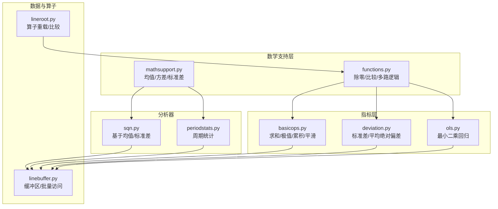
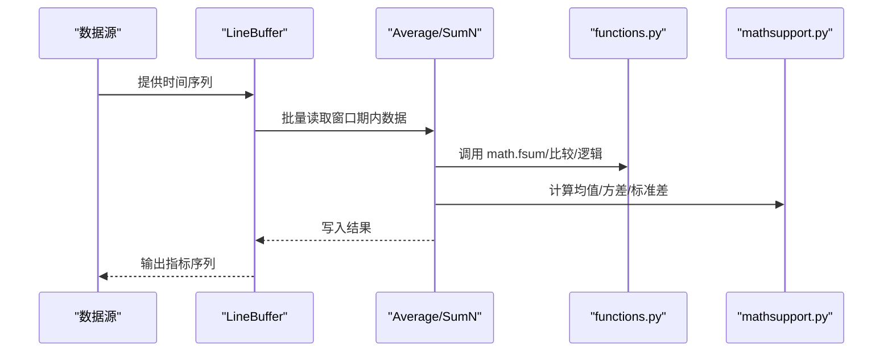
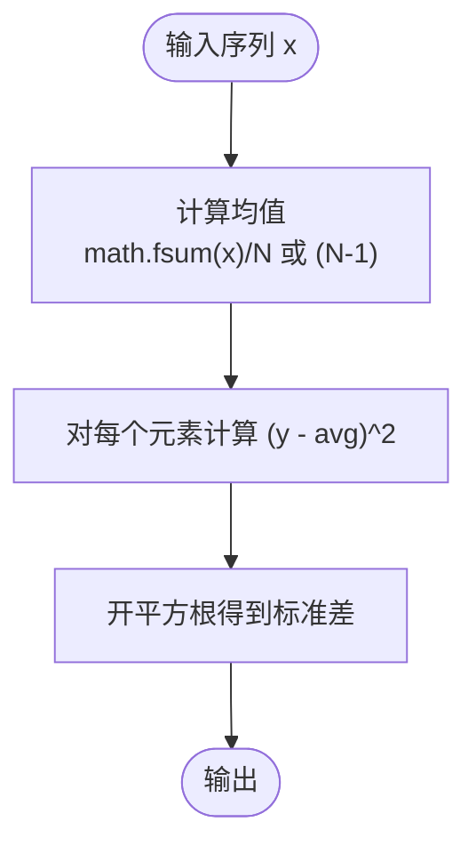
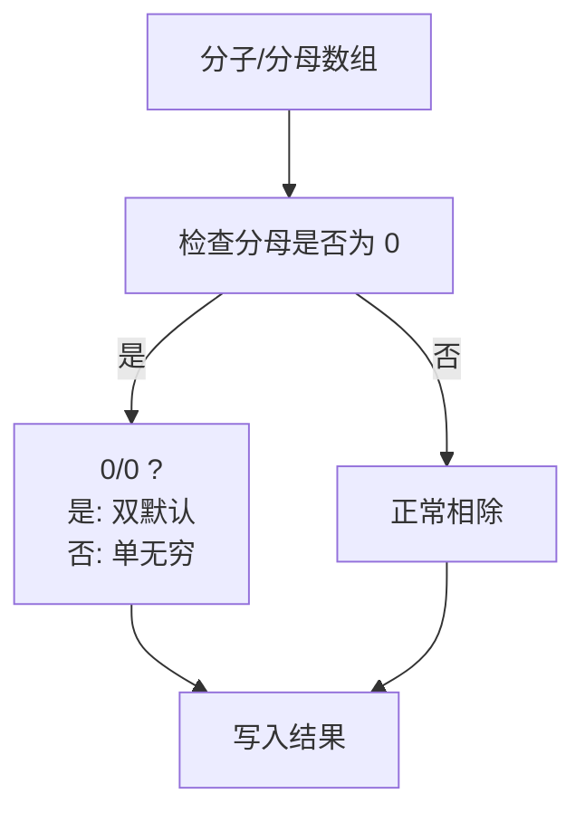
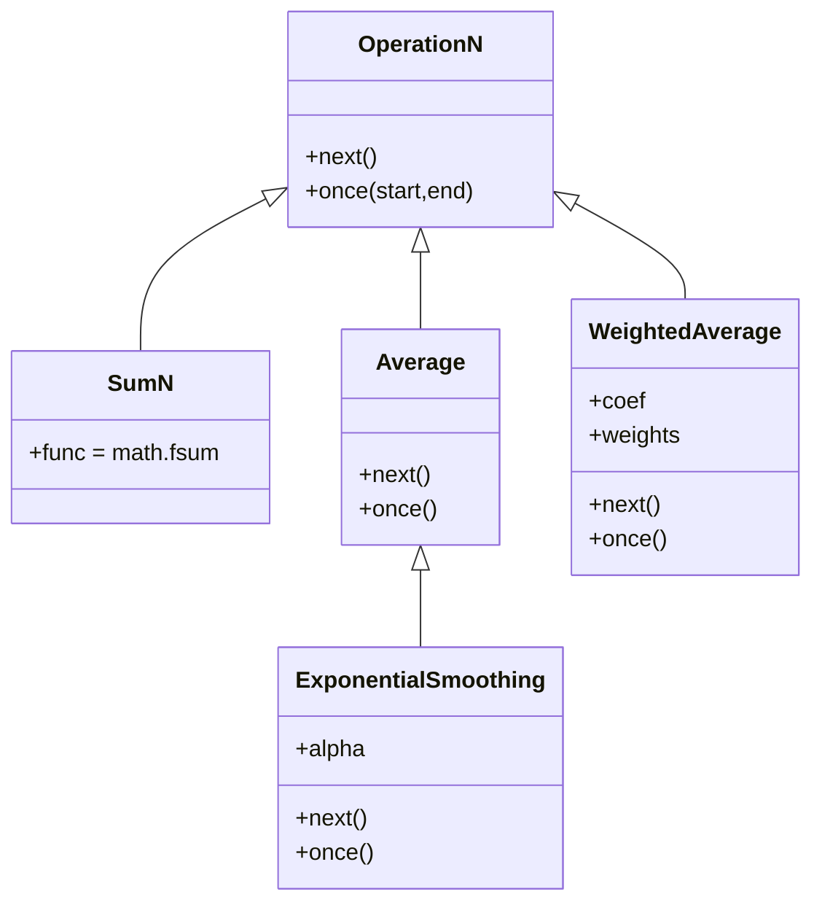
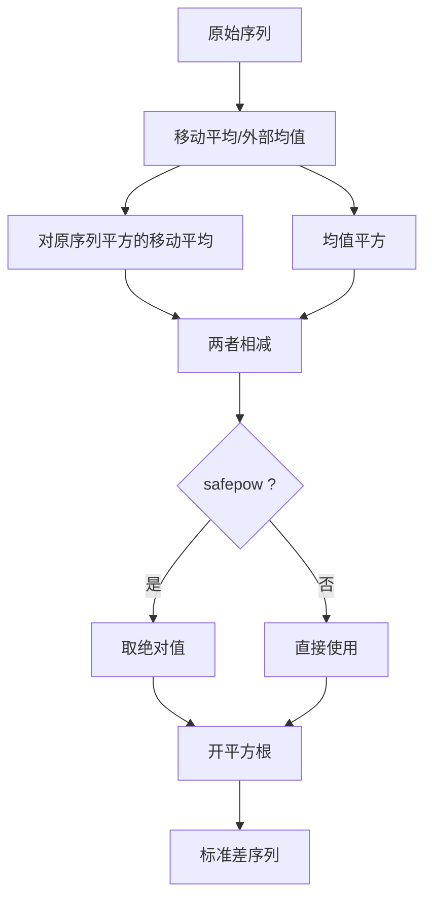
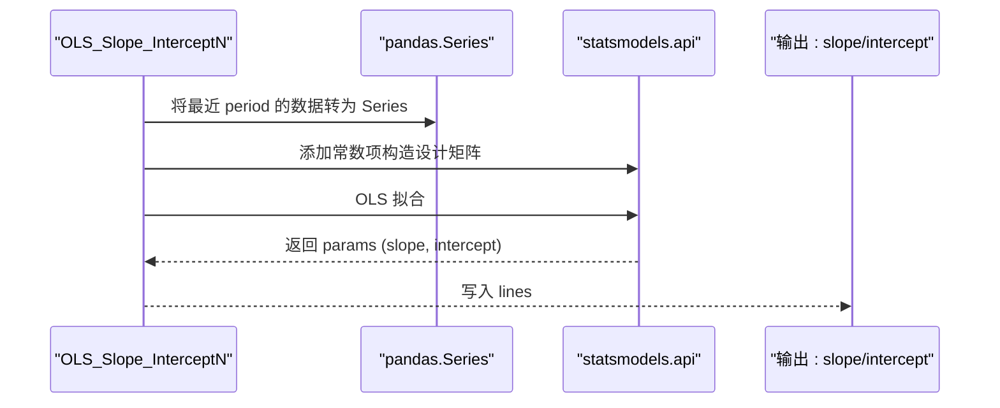
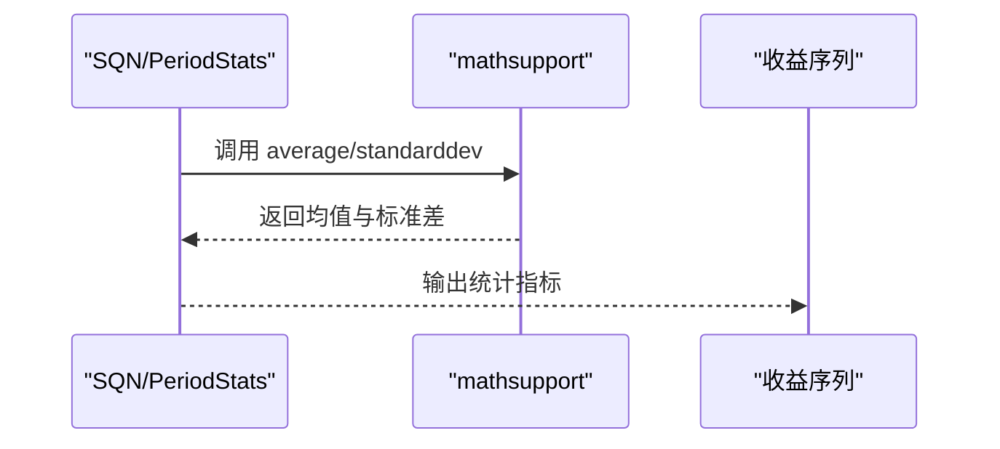
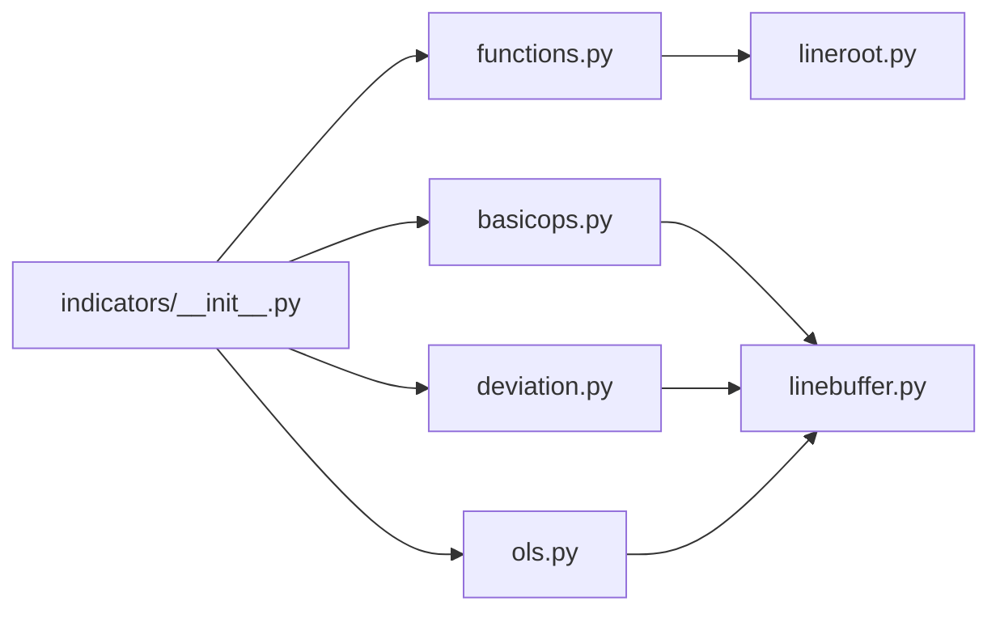

# 数学支持模块

<cite>
**本文引用的文件**
- [backtrader/mathsupport.py](file://backtrader/mathsupport.py)
- [backtrader/functions.py](file://backtrader/functions.py)
- [backtrader/indicators/basicops.py](file://backtrader/indicators/basicops.py)
- [backtrader/indicators/deviation.py](file://backtrader/indicators/deviation.py)
- [backtrader/indicators/ols.py](file://backtrader/indicators/ols.py)
- [backtrader/linebuffer.py](file://backtrader/linebuffer.py)
- [backtrader/lineroot.py](file://backtrader/lineroot.py)
- [backtrader/analyzers/sqn.py](file://backtrader/analyzers/sqn.py)
- [backtrader/analyzers/periodstats.py](file://backtrader/analyzers/periodstats.py)
- [backtrader/indicators/__init__.py](file://backtrader/indicators/__init__.py)
</cite>

## 目录
1. [引言](#引言)
2. [项目结构](#项目结构)
3. [核心组件](#核心组件)
4. [架构总览](#架构总览)
5. [详细组件分析](#详细组件分析)
6. [依赖关系分析](#依赖关系分析)
7. [性能考量与优化](#性能考量与优化)
8. [故障排查指南](#故障排查指南)
9. [结论](#结论)
10. [附录：常用数学常量与转换](#附录常用数学常量与转换)

## 引言
本文件系统化梳理 Backtrader 的数学支持模块，覆盖统计函数、数值运算与逻辑运算、线性代数相关能力（通过指标间接体现）、以及在技术指标与分析器中的应用。重点解释以下方面：
- 统计函数：均值、方差、标准差的实现与优化
- 数值运算：高精度求和、除零保护、比较与条件选择
- 指标中的数学应用：移动平均、标准差、加权平均、指数平滑、OLS 回归
- 性能与内存：缓冲区设计、批量计算、避免中间对象
- 精度与浮点：fsum 使用、安全幂运算、数值稳定性

## 项目结构
数学支持模块主要分布在如下位置：
- 基础统计：backtrader/mathsupport.py
- 通用数值与逻辑运算：backtrader/functions.py
- 指标中的数学实现：backtrader/indicators/basicops.py、deviation.py、ols.py
- 数据缓冲与算子：backtrader/linebuffer.py、lineroot.py
- 分析器中对数学的支持：backtrader/analyzers/sqn.py、periodstats.py
- 指标导出入口：backtrader/indicators/__init__.py

**图表来源**
- [backtrader/mathsupport.py](file://backtrader/mathsupport.py#L27-L65)
- [backtrader/functions.py](file://backtrader/functions.py#L43-L258)
- [backtrader/indicators/basicops.py](file://backtrader/indicators/basicops.py#L161-L495)
- [backtrader/indicators/deviation.py](file://backtrader/indicators/deviation.py#L27-L108)
- [backtrader/indicators/ols.py](file://backtrader/indicators/ols.py#L37-L78)
- [backtrader/linebuffer.py](file://backtrader/linebuffer.py#L50-L300)
- [backtrader/lineroot.py](file://backtrader/lineroot.py#L226-L272)
- [backtrader/analyzers/sqn.py](file://backtrader/analyzers/sqn.py#L31-L42)
- [backtrader/analyzers/periodstats.py](file://backtrader/analyzers/periodstats.py#L34-L41)

**章节来源**
- [backtrader/mathsupport.py](file://backtrader/mathsupport.py#L1-L66)
- [backtrader/functions.py](file://backtrader/functions.py#L1-L259)
- [backtrader/indicators/basicops.py](file://backtrader/indicators/basicops.py#L1-L495)
- [backtrader/indicators/deviation.py](file://backtrader/indicators/deviation.py#L1-L108)
- [backtrader/indicators/ols.py](file://backtrader/indicators/ols.py#L37-L78)
- [backtrader/linebuffer.py](file://backtrader/linebuffer.py#L1-L200)
- [backtrader/lineroot.py](file://backtrader/lineroot.py#L226-L272)
- [backtrader/analyzers/sqn.py](file://backtrader/analyzers/sqn.py#L31-L42)
- [backtrader/analyzers/periodstats.py](file://backtrader/analyzers/periodstats.py#L34-L41)
- [backtrader/indicators/__init__.py](file://backtrader/indicators/__init__.py#L24-L91)

## 核心组件
- 基础统计函数
  - 均值：使用高精度求和，可选贝塞尔修正
  - 方差：按给定均值或自动均值计算离差平方
  - 标准差：方差开根号，内部复用均值与方差
- 通用数值与逻辑运算
  - 除零保护：DivByZero、DivZeroByZero，分别处理 b==0 与 0/0 的情形
  - 比较与条件：Cmp、CmpEx、If，支持批量比较与三路分支
  - 多路逻辑：And、Or、Any、All、Max、Min、Sum（fsum）
  - Reduce：functools.reduce 化身，支持 initializer
- 指标中的数学实现
  - SumN、Highest/Lowest、FindFirstIndex/LastIndex
  - Average、ExponentialSmoothing、WeightedAverage
  - StandardDeviation、MeanDeviation
  - OLS_Slope_InterceptN（借助 pandas/statsmodels 进行 OLS）

**章节来源**
- [backtrader/mathsupport.py](file://backtrader/mathsupport.py#L27-L65)
- [backtrader/functions.py](file://backtrader/functions.py#L43-L258)
- [backtrader/indicators/basicops.py](file://backtrader/indicators/basicops.py#L161-L495)
- [backtrader/indicators/deviation.py](file://backtrader/indicators/deviation.py#L27-L108)
- [backtrader/indicators/ols.py](file://backtrader/indicators/ols.py#L37-L78)

## 架构总览
Backtrader 的数学支持以“模块化函数 + 指标封装 + 缓冲区批量执行”为核心：
- 函数层提供原子数学运算与安全逻辑（functions.py）
- 指标层将函数组合为窗口期计算（basicops.py、deviation.py、ols.py）
- 缓冲区层提供高性能数组访问与批量遍历（linebuffer.py）
- 算子层提供 Python 运算符到指标的映射（lineroot.py）
- 分析器层调用数学函数进行统计评估（analyzers/*.py）

**图表来源**
- [backtrader/linebuffer.py](file://backtrader/linebuffer.py#L165-L184)
- [backtrader/indicators/basicops.py](file://backtrader/indicators/basicops.py#L341-L365)
- [backtrader/functions.py](file://backtrader/functions.py#L249-L258)
- [backtrader/mathsupport.py](file://backtrader/mathsupport.py#L27-L65)

## 详细组件分析

### 统计函数：均值/方差/标准差
- 平均值
  - 使用 math.fsum 避免累积舍入误差
  - 可选贝塞尔修正（分母 N-1）用于样本估计
- 方差
  - 支持传入已知均值或自动计算均值
  - 返回每个元素与均值的离差平方列表
- 标准差
  - 基于平均后的方差开平方根
  - 可传递贝塞尔修正参数

**图表来源**
- [backtrader/mathsupport.py](file://backtrader/mathsupport.py#L27-L65)

**章节来源**
- [backtrader/mathsupport.py](file://backtrader/mathsupport.py#L27-L65)

### 数值运算与逻辑：除零保护与批量比较
- 除零保护
  - DivByZero：当分母为 0 时返回指定默认值
  - DivZeroByZero：区分 0/x 与 0/0，分别返回单无穷大或双默认值
- 比较与条件
  - Cmp/CmpEx：逐元素比较并返回 -1/0/1 或三路分支
  - If：根据条件选择两路输出
- 多路逻辑与聚合
  - And/Or/Any/All/Max/Min/Sum（fsum）/Reduce
  - Reduce 支持 initializer，便于自定义归约

**图表来源**
- [backtrader/functions.py](file://backtrader/functions.py#L43-L118)

**章节来源**
- [backtrader/functions.py](file://backtrader/functions.py#L43-L258)

### 指标中的数学：求和、极值、累积与平滑
- SumN：使用 math.fsum 在窗口期内求和，避免精度损失
- Highest/Lowest：窗口内最大/最小值
- FindFirstIndex/LastIndex：查找满足条件的首/尾索引（向后索引语义）
- Average：窗口内算术平均
- ExponentialSmoothing：指数平滑，使用 Alpha 参数
- WeightedAverage：线性权重（更近期权重更大），可自定义系数

**图表来源**
- [backtrader/indicators/basicops.py](file://backtrader/indicators/basicops.py#L47-L495)

**章节来源**
- [backtrader/indicators/basicops.py](file://backtrader/indicators/basicops.py#L161-L495)

### 标准差与平均绝对偏差
- StandardDeviation
  - 可选移动平均作为均值来源
  - 提供 safepow 选项，使用绝对值避免负差导致的开方错误
- MeanDeviation
  - 先取绝对偏差，再做移动平均

**图表来源**
- [backtrader/indicators/deviation.py](file://backtrader/indicators/deviation.py#L27-L71)

**章节来源**
- [backtrader/indicators/deviation.py](file://backtrader/indicators/deviation.py#L27-L108)

### 线性代数与回归：OLS 回归
- OLS_Slope_InterceptN
  - 使用 pandas Series 与 statsmodels OLS 拟合斜率与截距
  - 可用于配对交易等场景的 z-score 计算

**图表来源**
- [backtrader/indicators/ols.py](file://backtrader/indicators/ols.py#L37-L58)

**章节来源**
- [backtrader/indicators/ols.py](file://backtrader/indicators/ols.py#L37-L78)

### 分析器中的数学应用
- SQN（系统质量指数）
  - 依赖 mathsupport 的 average 与 standarddev
- PeriodStats（周期统计）
  - 同样依赖 average 与 standarddev

**图表来源**
- [backtrader/analyzers/sqn.py](file://backtrader/analyzers/sqn.py#L31-L42)
- [backtrader/analyzers/periodstats.py](file://backtrader/analyzers/periodstats.py#L34-L41)
- [backtrader/mathsupport.py](file://backtrader/mathsupport.py#L27-L65)

**章节来源**
- [backtrader/analyzers/sqn.py](file://backtrader/analyzers/sqn.py#L31-L42)
- [backtrader/analyzers/periodstats.py](file://backtrader/analyzers/periodstats.py#L34-L41)
- [backtrader/mathsupport.py](file://backtrader/mathsupport.py#L27-L65)

## 依赖关系分析
- 指标导出入口统一导入 functions 中的逻辑类，形成“函数层 → 指标层”的清晰边界
- 指标层通过 LineBuffer 的批量访问接口一次性遍历，减少 Python 层循环开销
- 算子重载（如四则运算、比较）由 lineroot 提供，贯穿整个框架

**图表来源**
- [backtrader/indicators/__init__.py](file://backtrader/indicators/__init__.py#L24-L91)
- [backtrader/functions.py](file://backtrader/functions.py#L1-L259)
- [backtrader/indicators/basicops.py](file://backtrader/indicators/basicops.py#L1-L495)
- [backtrader/indicators/deviation.py](file://backtrader/indicators/deviation.py#L1-L108)
- [backtrader/indicators/ols.py](file://backtrader/indicators/ols.py#L37-L78)
- [backtrader/linebuffer.py](file://backtrader/linebuffer.py#L1-L200)
- [backtrader/lineroot.py](file://backtrader/lineroot.py#L226-L272)

**章节来源**
- [backtrader/indicators/__init__.py](file://backtrader/indicators/__init__.py#L24-L91)

## 性能考量与优化
- 高精度求和
  - 使用 math.fsum 替代内置 sum，降低长期累积误差
  - 在 SumN、Average、WeightedAverage 中均有体现
- 批量计算与缓存
  - once(start,end) 循环中缓存数组引用与局部变量，减少字典查找
  - LineBuffer 的 get/islice 与 array 访问减少切片复制
- 除零与数值稳定
  - DivByZero/DivZeroByZero 显式处理异常情况，避免抛错与回退
  - StandardDeviation 的 safepow 选项防止负差导致的 NaN
- 内存与缓冲
  - LineBuffer 支持固定长度队列模式（QBuffer）与扩展模式
  - 通过 minbuffer 与 qbuffer 控制最小缓冲大小，平衡内存与延迟

最佳实践建议
- 优先使用指标层提供的 SumN/Average 等，它们已内置 fsum 与批量遍历
- 对需要自定义归约的场景，使用 Reduce 并提供 initializer
- 在涉及除法的指标中，显式使用 DivByZero/DivZeroByZero
- 对标准差计算，启用 safepow 以提升数值稳定性

**章节来源**
- [backtrader/indicators/basicops.py](file://backtrader/indicators/basicops.py#L161-L365)
- [backtrader/functions.py](file://backtrader/functions.py#L64-L117)
- [backtrader/indicators/deviation.py](file://backtrader/indicators/deviation.py#L67-L70)
- [backtrader/linebuffer.py](file://backtrader/linebuffer.py#L121-L148)

## 故障排查指南
常见问题与解决
- 结果出现 NaN 或 inf
  - 检查是否存在除以 0 的情况，使用 DivByZero/DivZeroByZero 指定默认值
  - 对标准差，确认 safepow 已开启，避免负差
- 累积误差导致的漂移
  - 使用 SumN/Average 等指标，内部已采用 math.fsum
- 性能瓶颈
  - 确认指标使用 once 路径而非逐次 next
  - 合理设置窗口期与缓冲区大小，避免频繁扩容

定位路径
- 除零处理：DivByZero/DivZeroByZero 的 once 实现
- 标准差安全：StandardDeviation 的 safepow 分支
- 批量遍历：OperationN/PeriodN 的 once 实现

**章节来源**
- [backtrader/functions.py](file://backtrader/functions.py#L64-L117)
- [backtrader/indicators/deviation.py](file://backtrader/indicators/deviation.py#L67-L70)
- [backtrader/indicators/basicops.py](file://backtrader/indicators/basicops.py#L63-L71)

## 结论
Backtrader 的数学支持模块通过“函数层 + 指标层 + 缓冲区层”的分层设计，提供了高精度、高性能且稳定的数值计算能力。基础统计函数与通用逻辑运算为上层指标与分析器奠定坚实基础；指标层将这些能力组合为窗口期计算；缓冲区层保证批量访问与内存效率。遵循本文的性能与数值稳定性建议，可在复杂交易策略开发中获得可靠的结果。

## 附录：常用数学常量与转换
- 常用数学函数
  - 高精度求和：math.fsum
  - 开平方：math.sqrt
- 时间与日期转换（与数值计算结合）
  - 日期转数字：date2num（内部使用 math.fsum 累加小时/分钟/秒/微秒部分）
  - 数字转日期：num2date
  - 时间转数字：time2num

使用建议
- 在涉及时间序列的数值计算中，优先使用框架提供的日期/时间转换函数，确保时区与精度一致
- 对于长时间序列的累计求和，优先使用 math.fsum 以减少舍入误差

**章节来源**
- [backtrader/utils/dateintern.py](file://backtrader/utils/dateintern.py#L202-L240)