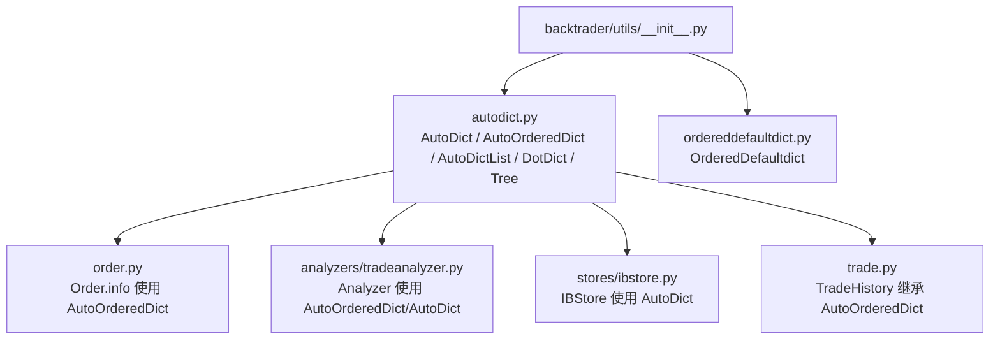
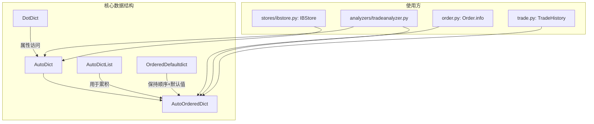
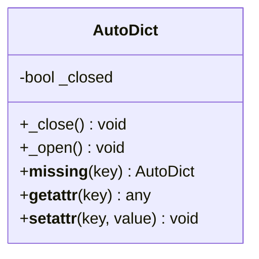
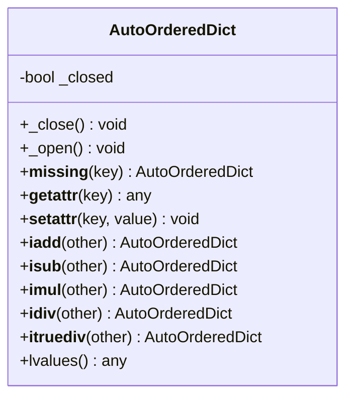
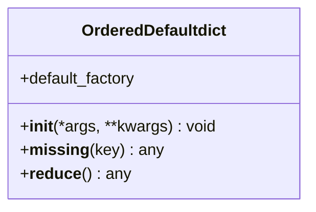
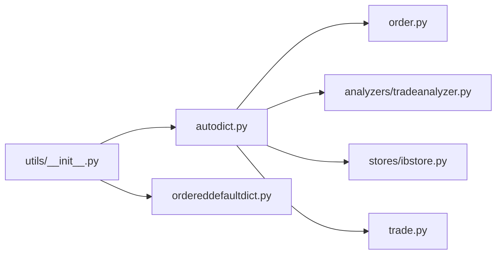

# 数据结构工具

<cite>
**本文引用的文件**
- [backtrader/utils/autodict.py](file://backtrader/utils/autodict.py)
- [backtrader/utils/ordereddefaultdict.py](file://backtrader/utils/ordereddefaultdict.py)
- [backtrader/utils/__init__.py](file://backtrader/utils/__init__.py)
- [backtrader/order.py](file://backtrader/order.py)
- [backtrader/analyzers/tradeanalyzer.py](file://backtrader/analyzers/tradeanalyzer.py)
- [backtrader/stores/ibstore.py](file://backtrader/stores/ibstore.py)
- [backtrader/trade.py](file://backtrader/trade.py)
</cite>

## 目录
1. [引言](#引言)
2. [项目结构](#项目结构)
3. [核心组件](#核心组件)
4. [架构总览](#架构总览)
5. [组件详解](#组件详解)
6. [依赖关系分析](#依赖关系分析)
7. [性能考量](#性能考量)
8. [故障排查指南](#故障排查指南)
9. [结论](#结论)
10. [附录：使用示例与最佳实践](#附录使用示例与最佳实践)

## 引言
本文件系统性梳理 Backtrader 工具模块中的数据结构工具，重点覆盖以下内容：
- 自动字典（autodict）的设计与实现：懒加载、嵌套自动创建、关闭状态控制、点号访问等特性
- 有序默认字典（ordereddefaultdict）的功能：保持插入顺序、默认工厂函数、可序列化支持
- 在 Backtrader 中的应用场景与性能优势
- 使用示例与选择原则、最佳实践
- 内存效率与访问性能优化策略
- 与标准库数据结构的区别与优势

## 项目结构
Backtrader 将数据结构工具集中于 utils 包，并通过统一导出入口对外暴露。autodict 与 ordereddefaultdict 均位于 backtrader/utils 下，供内部各模块按需导入使用。

图表来源
- [backtrader/utils/__init__.py](file://backtrader/utils/__init__.py#L24-L30)
- [backtrader/utils/autodict.py](file://backtrader/utils/autodict.py#L24-L146)
- [backtrader/utils/ordereddefaultdict.py](file://backtrader/utils/ordereddefaultdict.py#L26-L51)
- [backtrader/order.py](file://backtrader/order.py#L300-L310)
- [backtrader/analyzers/tradeanalyzer.py](file://backtrader/analyzers/tradeanalyzer.py#L68-L90)
- [backtrader/stores/ibstore.py](file://backtrader/stores/ibstore.py#L230-L234)
- [backtrader/trade.py](file://backtrader/trade.py#L31-L40)

章节来源
- [backtrader/utils/__init__.py](file://backtrader/utils/__init__.py#L24-L30)

## 核心组件
- AutoDict：基于 dict 的自动嵌套字典，支持懒加载与点号访问；可通过 _close/_open 控制键缺失行为
- AutoOrderedDict：基于 OrderedDict 的自动嵌套字典，保持插入顺序，支持数学运算与 lvalues 访问
- AutoDictList：用于将缺失键映射为列表，便于累积数据
- DotDict：允许通过属性访问方式读取字典键值
- OrderedDefaultdict：保持顺序的默认字典，支持默认工厂函数与可选的 pickle 序列化

章节来源
- [backtrader/utils/autodict.py](file://backtrader/utils/autodict.py#L29-L146)
- [backtrader/utils/ordereddefaultdict.py](file://backtrader/utils/ordereddefaultdict.py#L31-L51)

## 架构总览
Backtrader 在多个关键模块中直接使用 AutoOrderedDict/AutoDict 来组织状态、统计与配置信息，形成“自动嵌套 + 点号访问”的统一数据模型，既提升可读性，又降低初始化样板代码。

图表来源
- [backtrader/utils/autodict.py](file://backtrader/utils/autodict.py#L47-L146)
- [backtrader/utils/ordereddefaultdict.py](file://backtrader/utils/ordereddefaultdict.py#L31-L51)
- [backtrader/order.py](file://backtrader/order.py#L304-L305)
- [backtrader/analyzers/tradeanalyzer.py](file://backtrader/analyzers/tradeanalyzer.py#L68-L90)
- [backtrader/stores/ibstore.py](file://backtrader/stores/ibstore.py#L230-L234)
- [backtrader/trade.py](file://backtrader/trade.py#L31-L40)

## 组件详解

### AutoDict：自动嵌套字典与懒加载
- 设计要点
  - 懒加载：首次访问不存在的键时，自动创建新的 AutoDict 值并返回，无需显式初始化
  - 关闭状态：_close 后再次访问缺失键会抛出异常，避免意外扩展结构
  - 点号访问：支持通过属性名访问键值，提升可读性
- 典型用法
  - 作为多级配置或统计容器，减少初始化样板代码
  - 与 TradeAnalyzer 配合，构建分层统计结构
- 性能与内存
  - 仅在访问时创建子节点，天然节省未使用分支的空间
  - 适合深度嵌套但稀疏的数据结构

图表来源
- [backtrader/utils/autodict.py](file://backtrader/utils/autodict.py#L47-L78)

章节来源
- [backtrader/utils/autodict.py](file://backtrader/utils/autodict.py#L47-L78)
- [backtrader/analyzers/tradeanalyzer.py](file://backtrader/analyzers/tradeanalyzer.py#L84-L85)

### AutoOrderedDict：保持插入顺序的自动嵌套字典
- 设计要点
  - 继承自 OrderedDict，保证遍历顺序与插入顺序一致
  - 支持数学运算重载（+=、-=、*=、/=），便于增量更新
  - 提供 lvalues 方法以兼容 Python3 的 values 视图
  - 与 AutoDict 类似的懒加载与关闭机制
- 典型用法
  - 作为交易统计、回报率等需要稳定遍历顺序的容器
  - TradeHistory 继承该类，确保历史事件的顺序一致性
- 性能与内存
  - 有序性带来额外的维护成本，但对统计聚合与可视化非常友好
  - 与 AutoDict 相比，内存占用略高，但收益显著

图表来源
- [backtrader/utils/autodict.py](file://backtrader/utils/autodict.py#L80-L146)

章节来源
- [backtrader/utils/autodict.py](file://backtrader/utils/autodict.py#L80-L146)
- [backtrader/trade.py](file://backtrader/trade.py#L31-L40)

### AutoDictList 与 DotDict
- AutoDictList：缺失键映射为空列表，适合累积型数据（如日志、事件列表）
- DotDict：允许通过属性访问字典键，提升脚本式编程体验

章节来源
- [backtrader/utils/autodict.py](file://backtrader/utils/autodict.py#L33-L45)

### OrderedDefaultdict：保持顺序的默认字典
- 设计要点
  - 通过 default_factory 参数指定默认构造器，默认 None 表示抛错
  - 支持可选的 pickle 序列化（__reduce__）
- 适用场景
  - 需要默认值且保持插入顺序的场景，例如缓存、计数器等

图表来源
- [backtrader/utils/ordereddefaultdict.py](file://backtrader/utils/ordereddefaultdict.py#L31-L51)

章节来源
- [backtrader/utils/ordereddefaultdict.py](file://backtrader/utils/ordereddefaultdict.py#L31-L51)

### Tree：嵌套默认字典
- 用途：快速构建多层嵌套的 default_factory 结构，常用于树形索引或层级配置
- 注意：与 AutoDict/AutoOrderedDict 不同，Tree 更偏向“无序”层级结构

章节来源
- [backtrader/utils/autodict.py](file://backtrader/utils/autodict.py#L29-L31)

## 依赖关系分析
- 导出入口：utils/__init__.py 将 autodict 与 ordereddefaultdict 统一导出，便于外部模块按需导入
- 内部使用：多个模块直接使用 AutoOrderedDict/AutoDict，形成统一的数据模型
- 耦合度与内聚性
  - 工具模块低耦合，被广泛复用
  - AutoDict/AutoOrderedDict 内聚于懒加载与点号访问能力，职责清晰

图表来源
- [backtrader/utils/__init__.py](file://backtrader/utils/__init__.py#L24-L30)
- [backtrader/order.py](file://backtrader/order.py#L304-L305)
- [backtrader/analyzers/tradeanalyzer.py](file://backtrader/analyzers/tradeanalyzer.py#L68-L90)
- [backtrader/stores/ibstore.py](file://backtrader/stores/ibstore.py#L230-L234)
- [backtrader/trade.py](file://backtrader/trade.py#L31-L40)

章节来源
- [backtrader/utils/__init__.py](file://backtrader/utils/__init__.py#L24-L30)

## 性能考量
- 懒加载优势
  - 仅在访问时创建子节点，避免初始化大量空分支，显著节省内存
- 访问路径
  - 属性访问（.key）与键访问（['key']）在 AutoDict/AutoOrderedDict 中等价，但前者更简洁
- 有序性成本
  - AutoOrderedDict 保持插入顺序，遍历与比较开销略高于普通 dict，但在统计与可视化场景收益更大
- 数学运算
  - AutoOrderedDict 提供增量运算重载，可减少中间变量与临时对象，提升统计更新效率

章节来源
- [backtrader/utils/autodict.py](file://backtrader/utils/autodict.py#L113-L142)

## 故障排查指南
- 访问到已关闭的键
  - 当调用 _close 后再次访问缺失键，会触发 KeyError。请检查是否提前关闭了容器
- 属性访问与私有键冲突
  - AutoDict/AutoOrderedDict 对以“_”开头的键采用特殊处理，避免与内部属性混淆
- 默认字典未设置工厂函数
  - OrderedDefaultdict 若 default_factory 为 None，则缺失键会抛出 KeyError

章节来源
- [backtrader/utils/autodict.py](file://backtrader/utils/autodict.py#L59-L78)
- [backtrader/utils/autodict.py](file://backtrader/utils/autodict.py#L92-L112)
- [backtrader/utils/ordereddefaultdict.py](file://backtrader/utils/ordereddefaultdict.py#L42-L46)

## 结论
Backtrader 的数据结构工具通过“自动嵌套 + 懒加载 + 点号访问”的组合，显著降低了多层配置与统计结构的初始化复杂度，并在性能上兼顾内存占用与访问效率。AutoOrderedDict 在需要顺序稳定的场景（如统计与历史记录）尤为关键；AutoDict 则适用于深度稀疏结构；OrderedDefaultdict 为需要默认值与顺序的场景提供了简洁方案。

## 附录：使用示例与最佳实践

### 使用示例（路径指引）
- 订单信息容器
  - [order.py](file://backtrader/order.py#L304-L305)：Order.info 初始化为 AutoOrderedDict，便于动态挂载自定义字段
- 分析器统计
  - [analyzers/tradeanalyzer.py](file://backtrader/analyzers/tradeanalyzer.py#L68-L90)：使用 AutoOrderedDict 构建分层统计结构，并在结束阶段调用 _close 锁定结构
  - [analyzers/tradeanalyzer.py](file://backtrader/analyzers/tradeanalyzer.py#L84-L85)：局部使用 AutoDict 进行临时统计聚合
- 存储账户数据
  - [stores/ibstore.py](file://backtrader/stores/ibstore.py#L230-L234)：使用 AutoDict 维护账户现金、价值与更新信息的多级结构
- 交易历史
  - [trade.py](file://backtrader/trade.py#L31-L40)：TradeHistory 继承 AutoOrderedDict，确保历史事件顺序一致

### 选择原则与最佳实践
- 优先使用 AutoOrderedDict 的情形
  - 需要稳定的遍历顺序（统计、绘图、序列化输出）
  - 需要数学运算重载进行增量更新
- 优先使用 AutoDict 的情形
  - 深度稀疏结构且不关心顺序
  - 需要与现有 defaultdict 语义保持一致
- 使用 OrderedDefaultdict 的情形
  - 需要默认值且保持插入顺序
  - 需要可序列化的默认字典
- 使用 AutoDictList 的情形
  - 需要将缺失键映射为列表，便于累积数据
- 使用 DotDict 的情形
  - 脚本式编程中希望以属性方式访问字典键

### 性能优化建议
- 在分析器或观察者结束阶段调用 _close，锁定结构，避免后续误操作与内存膨胀
- 对频繁更新的统计字段，优先使用 AutoOrderedDict 的增量运算重载，减少中间对象
- 对超深嵌套但稀疏的数据，优先使用 AutoDict/AutoOrderedDict 的懒加载特性，避免一次性分配大量空节点