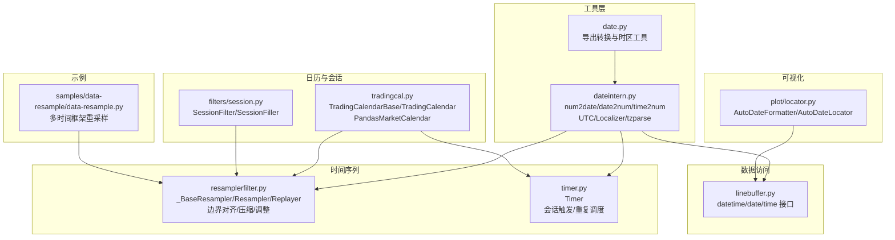
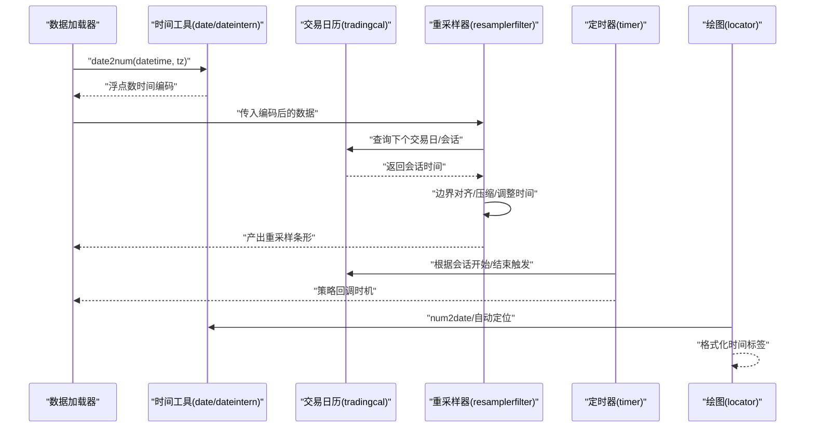
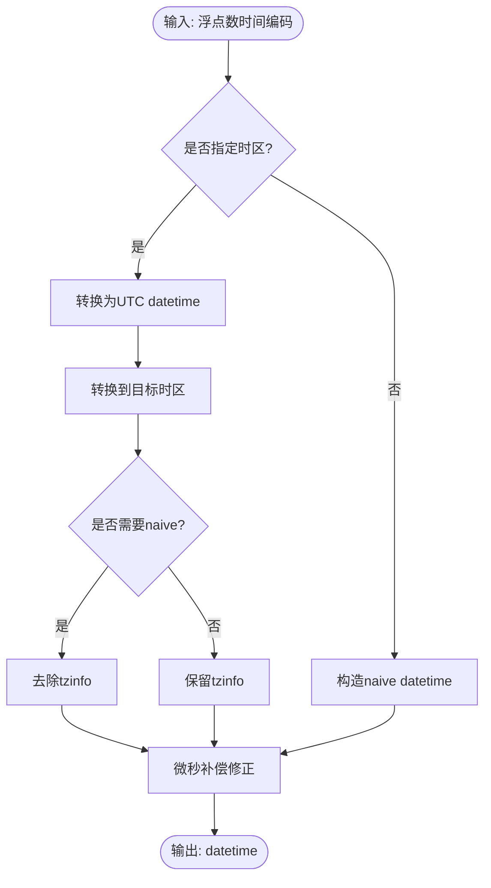
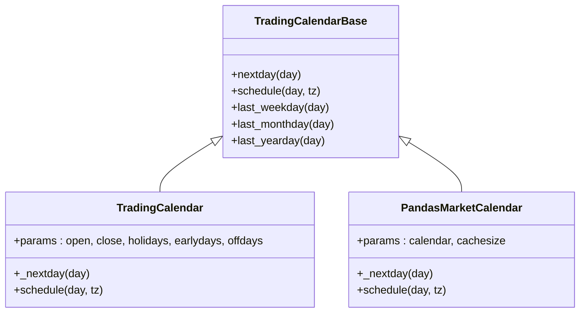
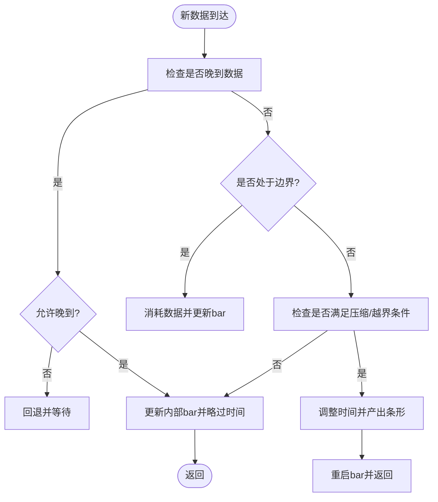
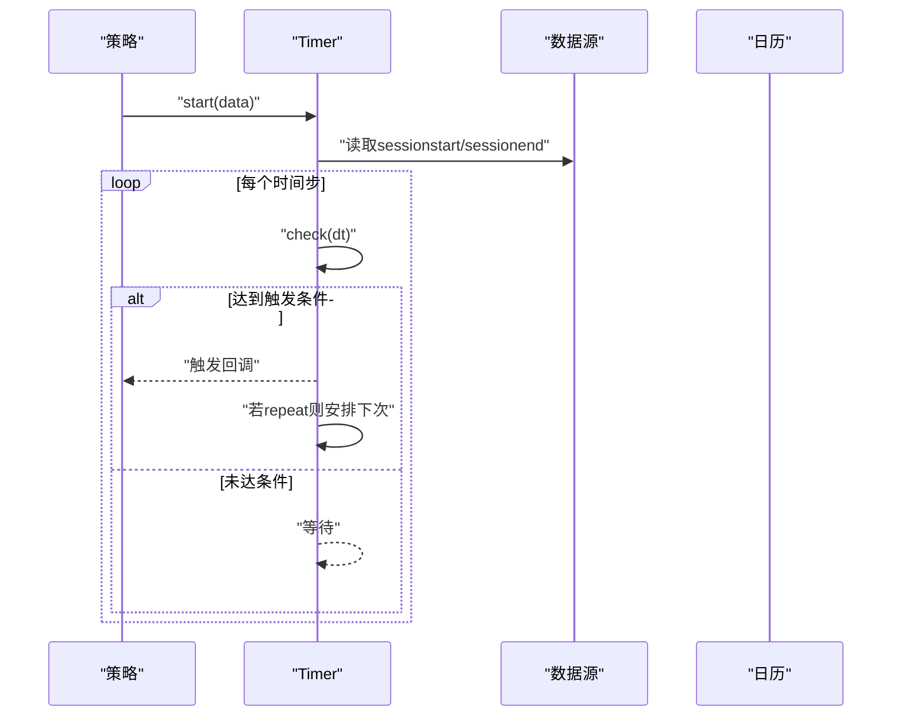
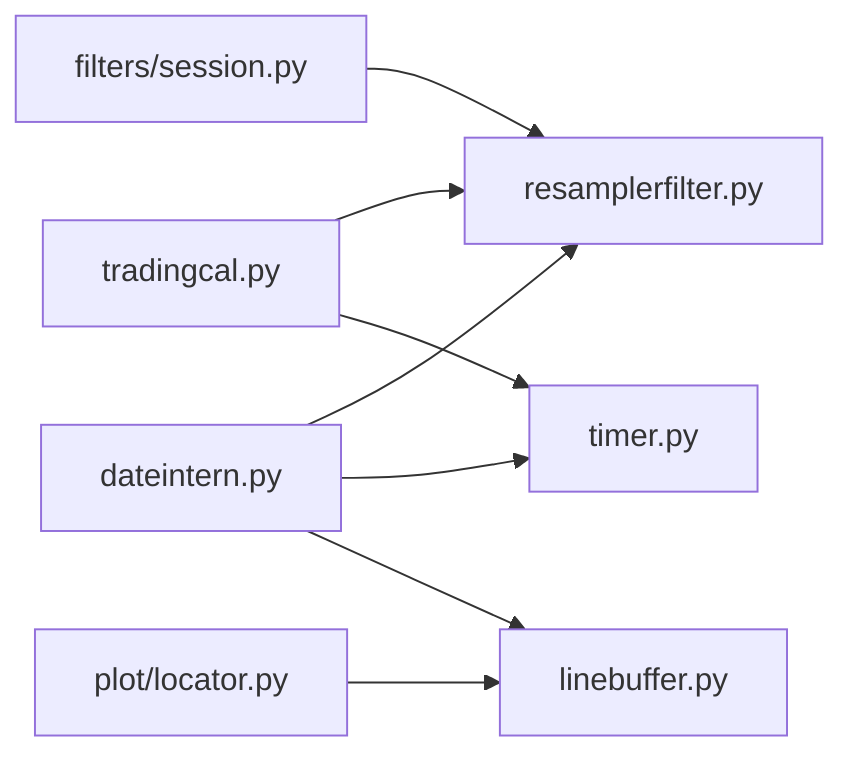

# 日期时间处理

<cite>
**本文档引用的文件**
- [backtrader/utils/date.py](file://backtrader/utils/date.py)
- [backtrader/utils/dateintern.py](file://backtrader/utils/dateintern.py)
- [backtrader/tradingcal.py](file://backtrader/tradingcal.py)
- [backtrader/timer.py](file://backtrader/timer.py)
- [backtrader/resamplerfilter.py](file://backtrader/resamplerfilter.py)
- [backtrader/filters/session.py](file://backtrader/filters/session.py)
- [backtrader/linebuffer.py](file://backtrader/linebuffer.py)
- [backtrader/plot/locator.py](file://backtrader/plot/locator.py)
- [backtrader/feeds/vcdata.py](file://backtrader/feeds/vcdata.py)
- [samples/data-resample/data-resample.py](file://samples/data-resample/data-resample.py)
</cite>

## 目录
1. [简介](#简介)
2. [项目结构](#项目结构)
3. [核心组件](#核心组件)
4. [架构总览](#架构总览)
5. [详细组件分析](#详细组件分析)
6. [依赖关系分析](#依赖关系分析)
7. [性能考虑](#性能考虑)
8. [故障排除指南](#故障排除指南)
9. [结论](#结论)
10. [附录](#附录)

## 简介
本文件系统性梳理 Backtrader 的日期时间处理体系，覆盖以下主题：
- 时间戳与日期格式转换：从浮点数时间编码到 datetime/time 对象的双向转换，以及时间部分的数值化。
- 时区处理：UTC、本地时区、pytz 时区解析与本地化包装。
- 交易日历与节假日：基于规则或外部日历库的交易日推导、会话时间查询。
- 时间序列对齐与重采样：按时间边界对齐、压缩合并、会话填充与过滤。
- 日期解析与格式化：在绘图与数据流中的应用。
- 交易时间窗口与会话管理：会话开始/结束时间控制、跨日边界处理。
- 实际应用场景：多时间框架回测、分钟级到日线级重采样、盘前盘后过滤。
- 常见陷阱与解决方案：舍入误差、夏令时、微秒边界、会话边界。

## 项目结构
围绕日期时间处理的关键模块分布如下：
- 工具层：时间戳与日期转换、时区解析与本地化。
- 日历与会话：交易日历接口与具体实现、会话过滤与填充。
- 时间序列：重采样器与回放器、边界调整与时序对齐。
- 数据访问：行缓冲区暴露时间查询接口。
- 可视化：自动日期定位与格式化。
- 示例：多时间框架重采样用法。

**图表来源**
- [backtrader/utils/date.py](file://backtrader/utils/date.py#L25-L29)
- [backtrader/utils/dateintern.py](file://backtrader/utils/dateintern.py#L149-L240)
- [backtrader/tradingcal.py](file://backtrader/tradingcal.py#L47-L281)
- [backtrader/filters/session.py](file://backtrader/filters/session.py#L31-L245)
- [backtrader/resamplerfilter.py](file://backtrader/resamplerfilter.py#L96-L753)
- [backtrader/timer.py](file://backtrader/timer.py#L42-L226)
- [backtrader/linebuffer.py](file://backtrader/linebuffer.py#L383-L420)
- [backtrader/plot/locator.py](file://backtrader/plot/locator.py#L242-L259)
- [samples/data-resample/data-resample.py](file://samples/data-resample/data-resample.py#L30-L96)

**章节来源**
- [backtrader/utils/date.py](file://backtrader/utils/date.py#L25-L29)
- [backtrader/utils/dateintern.py](file://backtrader/utils/dateintern.py#L149-L240)
- [backtrader/tradingcal.py](file://backtrader/tradingcal.py#L47-L281)
- [backtrader/filters/session.py](file://backtrader/filters/session.py#L31-L245)
- [backtrader/resamplerfilter.py](file://backtrader/resamplerfilter.py#L96-L753)
- [backtrader/timer.py](file://backtrader/timer.py#L42-L226)
- [backtrader/linebuffer.py](file://backtrader/linebuffer.py#L383-L420)
- [backtrader/plot/locator.py](file://backtrader/plot/locator.py#L242-L259)
- [samples/data-resample/data-resample.py](file://samples/data-resample/data-resample.py#L30-L96)

## 核心组件
- 时间戳与日期转换
  - 浮点数时间编码到 datetime/time 的转换，支持时区转换与“naive”输出。
  - 日期到浮点数编码，含 UTC 偏移换算。
  - 时间部分到浮点数编码（0~1）。
- 时区处理
  - UTC 与本地时区类，提供 utcoffset/dst/tzname/localize。
  - 本地化包装器与 pytz 解析器，兼容字符串别名。
- 交易日历与会话
  - 抽象基类定义交易日推进与会话时间查询。
  - 内置规则型日历与外部 pandas-market-calendars 集成。
- 时间序列对齐与重采样
  - 基于时间边界对齐、压缩合并、右边界选择与时间调整。
  - 支持会话填充（缺失时段补棒）与会话过滤（盘前盘后剔除）。
- 交易时间窗口与定时器
  - 会话开始/结束触发、周/月日过滤、偏移与重复调度。
- 数据访问与可视化
  - 行缓冲区提供统一的时间查询接口。
  - 自动日期定位与格式化器用于图表显示。

**章节来源**
- [backtrader/utils/dateintern.py](file://backtrader/utils/dateintern.py#L149-L240)
- [backtrader/utils/date.py](file://backtrader/utils/date.py#L25-L29)
- [backtrader/tradingcal.py](file://backtrader/tradingcal.py#L47-L281)
- [backtrader/resamplerfilter.py](file://backtrader/resamplerfilter.py#L96-L753)
- [backtrader/filters/session.py](file://backtrader/filters/session.py#L31-L245)
- [backtrader/timer.py](file://backtrader/timer.py#L42-L226)
- [backtrader/linebuffer.py](file://backtrader/linebuffer.py#L383-L420)
- [backtrader/plot/locator.py](file://backtrader/plot/locator.py#L242-L259)

## 架构总览
Backtrader 的日期时间处理以“浮点数时间编码”为核心，贯穿数据加载、策略执行、重采样与绘图全流程。工具层负责编码/解码与时区转换；日历与会话层提供交易日与会话时间；时间序列层负责边界对齐与压缩；定时器与数据访问层提供触发与查询能力。

**图表来源**
- [backtrader/utils/dateintern.py](file://backtrader/utils/dateintern.py#L202-L227)
- [backtrader/tradingcal.py](file://backtrader/tradingcal.py#L146-L194)
- [backtrader/resamplerfilter.py](file://backtrader/resamplerfilter.py#L495-L560)
- [backtrader/timer.py](file://backtrader/timer.py#L150-L225)
- [backtrader/plot/locator.py](file://backtrader/plot/locator.py#L242-L259)

## 详细组件分析

### 时间戳与日期转换（date/dateintern）
- 功能要点
  - num2date：将浮点数时间编码转换为带时区或 naive 的 datetime 对象，支持微秒补偿避免舍入误差导致的跨日。
  - date2num：将 datetime 转换为 UTC 浮点数天数编码，考虑 tzinfo 偏移。
  - time2num：将 time 或 datetime.time 的时间部分转换为 0~1 的浮点数。
  - Localizer/tzparse：包装/解析时区对象，兼容 pytz 并处理常用别名。
- 复杂度与性能
  - 编码/解码均为 O(1)，主要成本在 tzinfo 计算与 astimezone 转换。
- 错误处理
  - 微秒阈值补偿避免跨日风险。
  - 未知时区降级为本地化包装器。

**图表来源**
- [backtrader/utils/dateintern.py](file://backtrader/utils/dateintern.py#L149-L191)

**章节来源**
- [backtrader/utils/dateintern.py](file://backtrader/utils/dateintern.py#L149-L240)
- [backtrader/utils/date.py](file://backtrader/utils/date.py#L25-L29)

### 时区处理与本地化（UTC/Localizer/tzparse）
- 功能要点
  - UTC：标准 UTC 类，提供 utcoffset/dst/tzname/localize。
  - _LocalTimezone：基于系统时区信息，自动区分夏令时。
  - Localizer：为任意时区对象注入 localize 方法，保证接口一致性。
  - tzparse：解析字符串时区，优先 pytz，失败则退回本地化包装器。
- 使用建议
  - 在 date2num 中先 localize 再减去偏移，确保统一到 UTC 基准。
  - 在 num2date 中可直接转换到目标时区并按需转为 naive。

**章节来源**
- [backtrader/utils/dateintern.py](file://backtrader/utils/dateintern.py#L86-L137)
- [backtrader/utils/dateintern.py](file://backtrader/utils/dateintern.py#L48-L83)

### 交易日历与节假日（TradingCalendarBase/TradingCalendar/PandasMarketCalendar）
- 功能要点
  - TradingCalendarBase：定义 nextday/schedule 抽象方法。
  - TradingCalendar：基于参数（开市时间、闭市时间、节假日、早收市、周末 offdays）推导下一个交易日与当日会话。
  - PandasMarketCalendar：封装 pandas-market-calendars，带缓存加速查询。
- 会话管理
  - schedule 返回当日开盘与收盘时间，支持时区本地化与转换。
  - 结合 TIME_MAX 阈值避免微秒导致的跨日问题。

**图表来源**
- [backtrader/tradingcal.py](file://backtrader/tradingcal.py#L47-L281)

**章节来源**
- [backtrader/tradingcal.py](file://backtrader/tradingcal.py#L47-L281)

### 时间序列对齐与重采样（Resampler/Replayer/_BaseResampler）
- 功能要点
  - 边界对齐：bar2edge 控制是否按时间边界对齐；rightedge 控制使用起始或结束边界。
  - 压缩合并：compression 控制 N 条合成 1 条。
  - 时间调整：adjbartime 将 bar 时间调整到边界；calcadjtime/adjusttime 实现。
  - 会话边界：_eoscheck 检查是否越过会话结束；_dataonedge 判断是否处于边界。
  - 会话填充与过滤：SessionFiller 补齐缺失时段；SessionFilter/SessionFillerSimple 过滤盘前盘后。
- 关键流程
  - 每次新数据到达时，判断是否越界、是否达到压缩条件、是否处于边界。
  - 若满足条件，按配置调整时间并产出条形。

**图表来源**
- [backtrader/resamplerfilter.py](file://backtrader/resamplerfilter.py#L495-L560)
- [backtrader/resamplerfilter.py](file://backtrader/resamplerfilter.py#L159-L297)
- [backtrader/resamplerfilter.py](file://backtrader/resamplerfilter.py#L362-L432)

**章节来源**
- [backtrader/resamplerfilter.py](file://backtrader/resamplerfilter.py#L96-L753)
- [backtrader/filters/session.py](file://backtrader/filters/session.py#L31-L245)

### 交易时间窗口与会话管理（Timer）
- 功能要点
  - 会话触发：当 when 指定为 SESSION_START/SESSION_END 时，从数据源读取会话时间。
  - 周/月过滤：weekdays/monthdays 支持按周/月日筛选触发时机。
  - 偏移与重复：offset 控制相对会话时间的偏移；repeat 控制重复周期。
  - 与日历联动：结合 _getnexteos 获取会话结束时间，避免跨日错误。
- 典型用法
  - 在策略中设置定时器在每日会话结束时执行结算逻辑。

**图表来源**
- [backtrader/timer.py](file://backtrader/timer.py#L61-L225)

**章节来源**
- [backtrader/timer.py](file://backtrader/timer.py#L42-L226)

### 日期解析与格式化（linebuffer/plot/locator）
- 行缓冲区接口
  - 提供 datetime/date/time 查询，内部调用 num2date/date2num。
- 绘图格式化
  - AutoDateFormatter/AutoDateLocator 基于浮点数时间编码进行自动定位与格式化，支持时区。

**章节来源**
- [backtrader/linebuffer.py](file://backtrader/linebuffer.py#L383-L420)
- [backtrader/plot/locator.py](file://backtrader/plot/locator.py#L242-L259)

### 时区转换与本地化处理示例（vcdata）
- 交易所时区映射：不同市场使用不同的时区字符串，便于统一处理。
- 应用场景：在数据加载阶段将本地时间转换为统一时区基准。

**章节来源**
- [backtrader/feeds/vcdata.py](file://backtrader/feeds/vcdata.py#L120-L141)

### 多时间框架重采样示例（data-resample）
- 示例展示如何将分钟级数据重采样到日线/周线/月线级别，演示了新式 resampledata 的使用方式。

**章节来源**
- [samples/data-resample/data-resample.py](file://samples/data-resample/data-resample.py#L30-L96)

## 依赖关系分析
- 工具层依赖
  - date.py 导出 dateintern 的核心函数，形成对外统一接口。
- 时间序列依赖
  - resamplerfilter 依赖 dateintern 的编码/解码与行缓冲区的 num2date/date2num。
  - timer 依赖 date2num/num2date 与 TIME_MAX。
- 日历依赖
  - tradingcal 依赖 utils.UTC 与 TIME_MAX；可选依赖 pandas-market-calendars。
- 会话过滤
  - session 模块依赖数据源的 sessionstart/sessionend 参数与行缓冲区时间接口。
- 可视化
  - plot/locator 依赖行缓冲区提供的时间数组索引与 num2date。

**图表来源**
- [backtrader/utils/dateintern.py](file://backtrader/utils/dateintern.py#L149-L240)
- [backtrader/resamplerfilter.py](file://backtrader/resamplerfilter.py#L30-L31)
- [backtrader/timer.py](file://backtrader/timer.py#L32-L34)
- [backtrader/linebuffer.py](file://backtrader/linebuffer.py#L383-L420)
- [backtrader/tradingcal.py](file://backtrader/tradingcal.py#L29-L29)
- [backtrader/filters/session.py](file://backtrader/filters/session.py#L26-L28)
- [backtrader/plot/locator.py](file://backtrader/plot/locator.py#L242-L259)

**章节来源**
- [backtrader/utils/dateintern.py](file://backtrader/utils/dateintern.py#L149-L240)
- [backtrader/resamplerfilter.py](file://backtrader/resamplerfilter.py#L30-L31)
- [backtrader/timer.py](file://backtrader/timer.py#L32-L34)
- [backtrader/linebuffer.py](file://backtrader/linebuffer.py#L383-L420)
- [backtrader/tradingcal.py](file://backtrader/tradingcal.py#L29-L29)
- [backtrader/filters/session.py](file://backtrader/filters/session.py#L26-L28)
- [backtrader/plot/locator.py](file://backtrader/plot/locator.py#L242-L259)

## 性能考虑
- 浮点数编码/解码为 O(1)，但涉及 astimezone 与 tzinfo 计算可能成为瓶颈，建议：
  - 批量转换时尽量复用时区对象。
  - 在高频回测中避免频繁切换时区。
- 重采样器的压缩与边界检查为 O(N) 遍历，可通过：
  - 合理设置 compression 与 rightedge，减少边界判定次数。
  - 使用 PandasMarketCalendar 的缓存机制降低日历查询开销。
- 会话填充会产生额外条形，注意内存占用与绘图渲染时间。

## 故障排除指南
- 舍入误差导致跨日
  - 现象：时间接近 23:59:59.999990 时被换算为次日。
  - 解决：使用 TIME_MAX 阈值与微秒补偿逻辑。
  - 参考：[backtrader/utils/dateintern.py](file://backtrader/utils/dateintern.py#L42-L45), [backtrader/utils/dateintern.py](file://backtrader/utils/dateintern.py#L188-L189)
- 夏令时切换异常
  - 现象：DST 切换导致时间跳变或重复。
  - 解决：使用 Localizer 包装时区，确保 localize 正确应用偏移。
  - 参考：[backtrader/utils/dateintern.py](file://backtrader/utils/dateintern.py#L103-L133), [backtrader/utils/dateintern.py](file://backtrader/utils/dateintern.py#L73-L83)
- 未知时区解析失败
  - 现象：字符串时区无法解析。
  - 解决：降级为 Localizer 包装器；确认 pytz 安装。
  - 参考：[backtrader/utils/dateintern.py](file://backtrader/utils/dateintern.py#L56-L70)
- 会话结束判断错误
  - 现象：微秒差异导致“已过会话结束”误判。
  - 解决：使用 TIME_MAX 阈值与 num2date 的 naive 输出比较。
  - 参考：[backtrader/tradingcal.py](file://backtrader/tradingcal.py#L35-L35), [backtrader/timer.py](file://backtrader/timer.py#L160-L161)
- 重采样边界错位
  - 现象：按起始边界对齐导致首根条形时间不正确。
  - 解决：启用 rightedge 或调整 boundoff；确认 compression 设置。
  - 参考：[backtrader/resamplerfilter.py](file://backtrader/resamplerfilter.py#L382-L416)

**章节来源**
- [backtrader/utils/dateintern.py](file://backtrader/utils/dateintern.py#L42-L45)
- [backtrader/utils/dateintern.py](file://backtrader/utils/dateintern.py#L188-L189)
- [backtrader/utils/dateintern.py](file://backtrader/utils/dateintern.py#L103-L133)
- [backtrader/utils/dateintern.py](file://backtrader/utils/dateintern.py#L73-L83)
- [backtrader/utils/dateintern.py](file://backtrader/utils/dateintern.py#L56-L70)
- [backtrader/tradingcal.py](file://backtrader/tradingcal.py#L35-L35)
- [backtrader/timer.py](file://backtrader/timer.py#L160-L161)
- [backtrader/resamplerfilter.py](file://backtrader/resamplerfilter.py#L382-L416)

## 结论
Backtrader 的日期时间处理以“浮点数时间编码”为中心，配合完善的时区处理、交易日历与会话管理、边界对齐与重采样机制，形成了从数据加载到策略执行再到可视化的完整闭环。通过合理配置参数与遵循微秒边界、夏令时等注意事项，可在多时间框架回测与实盘中稳定运行。

## 附录
- 常用参数速查
  - 重采样：bar2edge、adjbartime、rightedge、compression、takelate、sessionend
  - 定时器：when（SESSION_TIME/START/END）、offset、repeat、weekdays、monthdays、allow、tzdata
  - 会话填充：fill_price、fill_vol、fill_oi、skip_first_fill
- 实践建议
  - 明确数据源时区与策略期望时区，统一使用 UTC 基准进行编码。
  - 在高频数据上谨慎使用 adjbartime 与 rightedge，平衡精度与性能。
  - 使用 PandasMarketCalendar 时合理设置 cachesize 以提升日历查询效率。