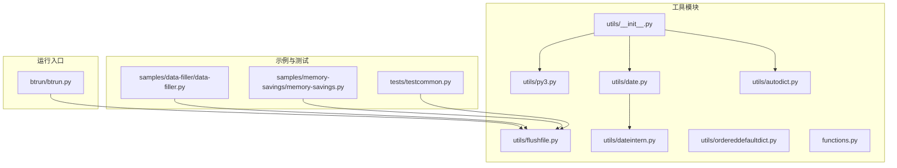
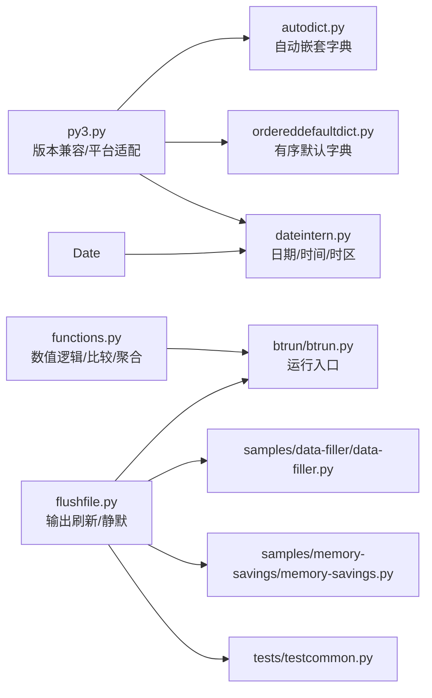
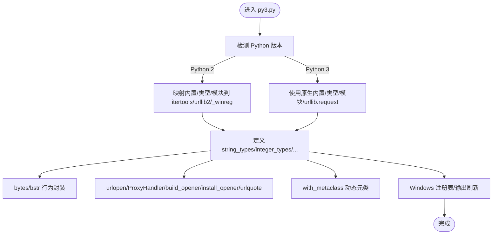
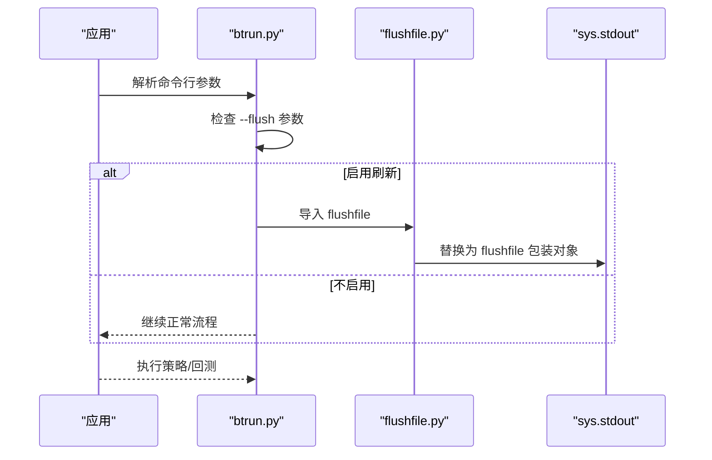
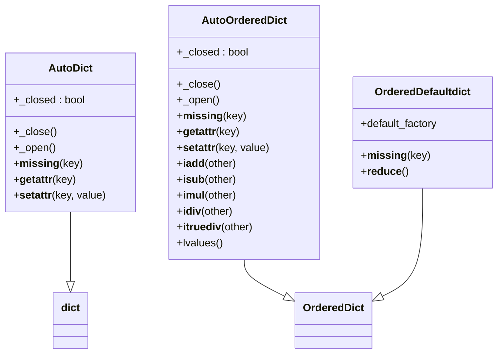
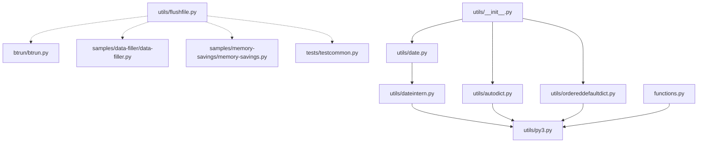

# 通用工具函数

<cite>
**本文引用的文件**
- [backtrader/utils/__init__.py](file://backtrader/utils/__init__.py)
- [backtrader/utils/py3.py](file://backtrader/utils/py3.py)
- [backtrader/utils/flushfile.py](file://backtrader/utils/flushfile.py)
- [backtrader/utils/date.py](file://backtrader/utils/date.py)
- [backtrader/utils/dateintern.py](file://backtrader/utils/dateintern.py)
- [backtrader/utils/autodict.py](file://backtrader/utils/autodict.py)
- [backtrader/utils/ordereddefaultdict.py](file://backtrader/utils/ordereddefaultdict.py)
- [backtrader/functions.py](file://backtrader/functions.py)
- [backtrader/btrun/btrun.py](file://backtrader/btrun/btrun.py)
- [samples/data-filler/data-filler.py](file://samples/data-filler/data-filler.py)
- [samples/memory-savings/memory-savings.py](file://samples/memory-savings/memory-savings.py)
- [tests/testcommon.py](file://tests/testcommon.py)
</cite>

## 目录
1. [简介](#简介)
2. [项目结构](#项目结构)
3. [核心组件](#核心组件)
4. [架构总览](#架构总览)
5. [详细组件分析](#详细组件分析)
6. [依赖关系分析](#依赖关系分析)
7. [性能考虑](#性能考虑)
8. [故障排查指南](#故障排查指南)
9. [结论](#结论)
10. [附录](#附录)

## 简介
本文件系统化梳理 Backtrader 的通用工具函数，覆盖以下主题：
- Python 版本兼容性工具（字符串类型、整数类型、迭代器、URL 编码、元类等）
- 字符串与字节串处理、编码转换
- 文件刷新与输出控制（实时刷新 stdout/stderr、静默输出）
- 调试与日志相关辅助（通过输出控制与运行参数）
- 性能监控与内存管理（数组长度统计、内存单元评估）
- 平台兼容性处理（Windows 平台 stdout/stderr 刷新）
- 工具函数设计原则与使用场景
- 典型用法示例与扩展建议
- 常见问题与最佳实践

## 项目结构
Backtrader 将通用工具集中在 backtrader/utils 子包中，并在 backtrader/__init__.py 中统一导出部分子模块，便于上层模块按需导入。

图表来源
- [backtrader/utils/__init__.py](file://backtrader/utils/__init__.py#L24-L30)
- [backtrader/utils/py3.py](file://backtrader/utils/py3.py#L27-L134)
- [backtrader/utils/flushfile.py](file://backtrader/utils/flushfile.py#L27-L58)
- [backtrader/utils/date.py](file://backtrader/utils/date.py#L25-L30)
- [backtrader/utils/dateintern.py](file://backtrader/utils/dateintern.py#L48-L241)
- [backtrader/utils/autodict.py](file://backtrader/utils/autodict.py#L29-L146)
- [backtrader/utils/ordereddefaultdict.py](file://backtrader/utils/ordereddefaultdict.py#L31-L51)
- [backtrader/functions.py](file://backtrader/functions.py#L31-L259)
- [backtrader/btrun/btrun.py](file://backtrader/btrun/btrun.py#L76-L78)
- [samples/data-filler/data-filler.py](file://samples/data-filler/data-filler.py#L30-L32)
- [samples/memory-savings/memory-savings.py](file://samples/memory-savings/memory-savings.py#L30-L31)
- [tests/testcommon.py](file://tests/testcommon.py#L32-L34)

章节来源
- [backtrader/utils/__init__.py](file://backtrader/utils/__init__.py#L24-L30)

## 核心组件
- 版本兼容与平台适配：提供字符串/整数类型别名、迭代器兼容、URL 编码、元类工具、Windows 平台 stdout/stderr 刷新包装
- 数据时间与时区：日期/时间数字互转、UTC 与时区本地化、时差计算
- 容器与字典：自动嵌套字典、有序默认字典、点访问字典
- 运行期输出控制：实时刷新 stdout/stderr、临时屏蔽标准输出
- 数值逻辑运算：除零保护、比较与条件选择、多输入聚合逻辑
- 内存评估：指标/观察器/数据行数组长度统计

章节来源
- [backtrader/utils/py3.py](file://backtrader/utils/py3.py#L27-L134)
- [backtrader/utils/dateintern.py](file://backtrader/utils/dateintern.py#L48-L241)
- [backtrader/utils/autodict.py](file://backtrader/utils/autodict.py#L29-L146)
- [backtrader/utils/ordereddefaultdict.py](file://backtrader/utils/ordereddefaultdict.py#L31-L51)
- [backtrader/utils/flushfile.py](file://backtrader/utils/flushfile.py#L27-L58)
- [backtrader/functions.py](file://backtrader/functions.py#L31-L259)

## 架构总览
下图展示了工具模块之间的依赖关系与典型调用路径：

图表来源
- [backtrader/utils/py3.py](file://backtrader/utils/py3.py#L27-L134)
- [backtrader/utils/autodict.py](file://backtrader/utils/autodict.py#L26-L27)
- [backtrader/utils/ordereddefaultdict.py](file://backtrader/utils/ordereddefaultdict.py#L28-L29)
- [backtrader/utils/date.py](file://backtrader/utils/date.py#L25-L26)
- [backtrader/utils/dateintern.py](file://backtrader/utils/dateintern.py#L48-L241)
- [backtrader/utils/flushfile.py](file://backtrader/utils/flushfile.py#L27-L58)
- [backtrader/btrun/btrun.py](file://backtrader/btrun/btrun.py#L76-L78)
- [samples/data-filler/data-filler.py](file://samples/data-filler/data-filler.py#L30-L32)
- [samples/memory-savings/memory-savings.py](file://samples/memory-savings/memory-savings.py#L30-L31)
- [tests/testcommon.py](file://tests/testcommon.py#L32-L34)
- [backtrader/functions.py](file://backtrader/functions.py#L28-L29)

## 详细组件分析

### Python 版本兼容与平台适配（py3.py）
- 类型与常量
  - 字符串类型与整数类型别名，确保在 Python 2/3 下行为一致
  - 最大/最小整数与浮点数常量
- 迭代器与内置函数
  - filter/map/range/zip 的兼容映射；Python 2 使用 itertools.*，Python 3 使用原生
  - cmp 函数在 Python 3 中通过 (a>b)-(a<b) 实现
- 字节串与编码
  - bytes/bstr 在不同版本下的行为差异封装
  - URL 编码函数（urllib2 vs urllib.request）与 quote
- 平台与注册表
  - Windows 注册表模块名称差异（_winreg vs winreg）
- 元类工具
  - with_metaclass：在单次继承中动态设置元类，简化跨版本元类写法
- 平台输出
  - Windows 平台下重绑定 sys.stdout/sys.stderr 为 flushfile 包装对象，保证实时输出

图表来源
- [backtrader/utils/py3.py](file://backtrader/utils/py3.py#L27-L134)

章节来源
- [backtrader/utils/py3.py](file://backtrader/utils/py3.py#L27-L134)

### 字符串与字节串处理、编码转换
- 字符串类型判断与统一
  - 使用 string_types 统一 str/unicode（Python 2）或 str（Python 3）
- 字节串与编码
  - bytes(x)：将字符串编码为字节串（Python 3 下为 UTF-8）
  - bstr(x)：将任意对象转换为字节串表示（Python 2 下为 bytes，Python 3 下为 str）
- URL 编码
  - urlquote：统一 urllib.quote 的使用（Python 2/3）

章节来源
- [backtrader/utils/py3.py](file://backtrader/utils/py3.py#L87-L106)

### 文件刷新与输出控制（flushfile.py）
- flushfile 包装类
  - 重写 write/flush 方法，每次写入后立即刷新底层流
  - 在 Windows 平台下，直接替换 sys.stdout/sys.stderr，确保实时输出
- StdOutDevNull 静默输出
  - 替换 sys.stdout 为无输出对象，支持 stop 恢复原始 stdout
- 典型应用场景
  - 长时间运行策略的日志实时打印
  - 测试与示例脚本中屏蔽噪声输出

图表来源
- [backtrader/btrun/btrun.py](file://backtrader/btrun/btrun.py#L76-L78)
- [backtrader/utils/flushfile.py](file://backtrader/utils/flushfile.py#L27-L58)

章节来源
- [backtrader/utils/flushfile.py](file://backtrader/utils/flushfile.py#L27-L58)
- [backtrader/btrun/btrun.py](file://backtrader/btrun/btrun.py#L76-L78)
- [samples/data-filler/data-filler.py](file://samples/data-filler/data-filler.py#L30-L32)
- [samples/memory-savings/memory-savings.py](file://samples/memory-savings/memory-savings.py#L30-L31)
- [tests/testcommon.py](file://tests/testcommon.py#L32-L34)

### 调试与日志辅助
- 输出控制
  - 通过 flushfile 实现实时输出，避免缓冲导致的日志延迟
  - 通过 StdOutDevNull 在测试/批量执行中抑制噪声
- 运行参数
  - btrun 支持 --flush 参数启用实时输出
- 示例与测试
  - 多个示例与测试文件显式导入并使用 flushfile

章节来源
- [backtrader/utils/flushfile.py](file://backtrader/utils/flushfile.py#L27-L58)
- [backtrader/btrun/btrun.py](file://backtrader/btrun/btrun.py#L76-L78)
- [samples/data-filler/data-filler.py](file://samples/data-filler/data-filler.py#L30-L32)
- [samples/memory-savings/memory-savings.py](file://samples/memory-savings/memory-savings.py#L30-L31)
- [tests/testcommon.py](file://tests/testcommon.py#L32-L34)

### 性能监控与内存管理
- 自动嵌套字典与有序默认字典
  - AutoDict/AutoOrderedDict：按需创建子字典，支持关闭/开启模式，避免未使用键的开销
  - OrderedDefaultdict：保持插入顺序的默认工厂字典，支持 pickle 序列化
- 数值逻辑与聚合
  - functions.py 提供除零保护、比较、条件选择、多输入聚合（and/or/max/min/sum/any/all）
  - 使用数学库 fsum 进行高精度求和
- 内存评估示例
  - memory-savings.py 展示如何统计数据、指标、观察器的数组长度，评估内存占用

图表来源
- [backtrader/utils/autodict.py](file://backtrader/utils/autodict.py#L47-L146)
- [backtrader/utils/ordereddefaultdict.py](file://backtrader/utils/ordereddefaultdict.py#L31-L51)

章节来源
- [backtrader/utils/autodict.py](file://backtrader/utils/autodict.py#L29-L146)
- [backtrader/utils/ordereddefaultdict.py](file://backtrader/utils/ordereddefaultdict.py#L31-L51)
- [backtrader/functions.py](file://backtrader/functions.py#L31-L259)
- [samples/memory-savings/memory-savings.py](file://samples/memory-savings/memory-savings.py#L65-L121)

### 平台兼容性处理
- Windows 平台
  - 通过 flushfile 包装 sys.stdout/sys.stderr，确保 print 立即可见
  - winreg 模块名称差异（_winreg vs winreg）由 py3.py 统一封装
- 时间与日期
  - dateintern.py 提供时区解析、UTC 与本地时区转换、时间数字与 datetime 的双向转换

章节来源
- [backtrader/utils/flushfile.py](file://backtrader/utils/flushfile.py#L39-L41)
- [backtrader/utils/py3.py](file://backtrader/utils/py3.py#L30-L39)
- [backtrader/utils/dateintern.py](file://backtrader/utils/dateintern.py#L48-L137)

### 工具函数设计原则与使用场景
- 设计原则
  - 单一职责：每个模块聚焦一类问题（版本兼容、容器、时间、输出、逻辑）
  - 可移植性：通过别名与条件分支屏蔽 Python 2/3 差异
  - 可组合性：容器与逻辑工具可被上层模块自由组合使用
  - 可观测性：输出控制与内存评估工具便于调试与性能分析
- 使用场景
  - 数据读取与网络请求：统一字符串/字节串处理与 URL 编码
  - 回测与策略执行：实时输出、静默输出、内存评估
  - 时间序列处理：日期/时间数字转换与时区本地化

章节来源
- [backtrader/utils/py3.py](file://backtrader/utils/py3.py#L27-L134)
- [backtrader/utils/autodict.py](file://backtrader/utils/autodict.py#L29-L146)
- [backtrader/utils/flushfile.py](file://backtrader/utils/flushfile.py#L27-L58)
- [backtrader/utils/dateintern.py](file://backtrader/utils/dateintern.py#L149-L241)

### 代码示例与实际应用
- 启用输出刷新
  - 在 btrun 中通过参数启用 flushfile，使长运行过程中的输出即时可见
  - 示例脚本中直接导入并使用 flushfile
- 内存评估
  - 通过遍历数据、指标、观察器的数组长度，统计总内存单元数，辅助优化策略与数据规模

章节来源
- [backtrader/btrun/btrun.py](file://backtrader/btrun/btrun.py#L76-L78)
- [samples/data-filler/data-filler.py](file://samples/data-filler/data-filler.py#L30-L32)
- [samples/memory-savings/memory-savings.py](file://samples/memory-savings/memory-savings.py#L65-L121)
- [tests/testcommon.py](file://tests/testcommon.py#L32-L34)

### 扩展与自定义方法
- 新增容器类型
  - 基于 AutoDict/AutoOrderedDict/OrderedDefaultdict 的模式，可扩展新的嵌套容器
- 新增数值逻辑
  - 参考 functions.py 的 MultiLogic/MultiLogicReduce 模式，定义新的多输入逻辑函数
- 新增时间处理
  - 在 dateintern.py 基础上扩展更多时区解析与格式化工具

章节来源
- [backtrader/utils/autodict.py](file://backtrader/utils/autodict.py#L47-L146)
- [backtrader/functions.py](file://backtrader/functions.py#L193-L259)
- [backtrader/utils/dateintern.py](file://backtrader/utils/dateintern.py#L48-L241)

## 依赖关系分析
- 模块耦合
  - utils/__init__.py 将 date、autodict、ordereddefaultdict 等模块统一导出，降低上层导入复杂度
  - py3.py 作为基础兼容层，被多个模块依赖（dateintern、autodict、ordereddefaultdict、functions）
  - flushfile.py 仅在运行入口与示例中被显式导入，不引入循环依赖
- 外部依赖
  - datetime、time、math、collections、io、urllib（Python 2/3 差异封装）
  - 可选 pytz（时区解析）

图表来源
- [backtrader/utils/__init__.py](file://backtrader/utils/__init__.py#L24-L30)
- [backtrader/utils/date.py](file://backtrader/utils/date.py#L25-L30)
- [backtrader/utils/dateintern.py](file://backtrader/utils/dateintern.py#L28-L29)
- [backtrader/utils/autodict.py](file://backtrader/utils/autodict.py#L26-L27)
- [backtrader/utils/ordereddefaultdict.py](file://backtrader/utils/ordereddefaultdict.py#L28-L29)
- [backtrader/utils/py3.py](file://backtrader/utils/py3.py#L27-L134)
- [backtrader/utils/flushfile.py](file://backtrader/utils/flushfile.py#L27-L58)
- [backtrader/btrun/btrun.py](file://backtrader/btrun/btrun.py#L76-L78)
- [samples/data-filler/data-filler.py](file://samples/data-filler/data-filler.py#L30-L32)
- [samples/memory-savings/memory-savings.py](file://samples/memory-savings/memory-savings.py#L30-L31)
- [tests/testcommon.py](file://tests/testcommon.py#L32-L34)

章节来源
- [backtrader/utils/__init__.py](file://backtrader/utils/__init__.py#L24-L30)
- [backtrader/utils/py3.py](file://backtrader/utils/py3.py#L27-L134)

## 性能考虑
- 迭代器与内置函数
  - 使用 Python 3 原生 filter/map/range/zip，减少 itertools 包装层开销
- 数学运算
  - 使用 math.fsum 进行高精度求和，避免累积舍入误差
- 容器选择
  - AutoDict/AutoOrderedDict 在未使用键时不创建子结构，降低内存占用
  - OrderedDefaultdict 保持插入顺序，适合需要稳定遍历的场景
- 输出刷新
  - flushfile 每次写入后刷新，确保可观测性但可能增加 I/O 成本；在生产中谨慎启用

章节来源
- [backtrader/utils/py3.py](file://backtrader/utils/py3.py#L90-L96)
- [backtrader/functions.py](file://backtrader/functions.py#L249-L250)
- [backtrader/utils/autodict.py](file://backtrader/utils/autodict.py#L47-L146)
- [backtrader/utils/ordereddefaultdict.py](file://backtrader/utils/ordereddefaultdict.py#L31-L51)
- [backtrader/utils/flushfile.py](file://backtrader/utils/flushfile.py#L32-L37)

## 故障排查指南
- 输出不实时
  - 确认是否启用了 flush 参数或导入了 flushfile
  - 在 Windows 平台下检查 sys.stdout 是否已被替换为 flushfile 包装对象
- 除零异常
  - 使用 DivByZero/DivZeroByZero 逻辑组件替代直接除法，避免异常并指定默认值
- 字符串/字节串错误
  - 使用 py3.bytes 与 py3.bstr 统一处理编码与类型
- 时区解析失败
  - 若未安装 pytz，将回退到本地化器；必要时手动传入时区对象

章节来源
- [backtrader/utils/flushfile.py](file://backtrader/utils/flushfile.py#L39-L41)
- [backtrader/btrun/btrun.py](file://backtrader/btrun/btrun.py#L76-L78)
- [backtrader/functions.py](file://backtrader/functions.py#L43-L118)
- [backtrader/utils/py3.py](file://backtrader/utils/py3.py#L98-L100)
- [backtrader/utils/dateintern.py](file://backtrader/utils/dateintern.py#L56-L70)

## 结论
Backtrader 的通用工具函数围绕“跨版本兼容、容器抽象、时间处理、输出控制、数值逻辑”五大维度构建，既保证了在 Python 2/3 下的一致行为，又提供了丰富的实用工具用于调试、性能监控与内存管理。通过合理的模块组织与清晰的接口设计，这些工具为上层策略开发与回测执行提供了坚实的基础。

## 附录
- 常用工具速览
  - 版本兼容：string_types、integer_types、range、filter、map、zip、cmp、bytes、bstr、urlquote、with_metaclass
  - 时间与日期：num2date、num2dt、num2time、date2num、time2num、UTC、TZLocal、Localizer、tzparse
  - 容器：Tree、AutoDict、AutoOrderedDict、OrderedDefaultdict、DotDict、AutoDictList
  - 输出：flushfile、StdOutDevNull
  - 数值逻辑：DivByZero、DivZeroByZero、Cmp、CmpEx、If、And、Or、Max、Min、Sum、Any、All