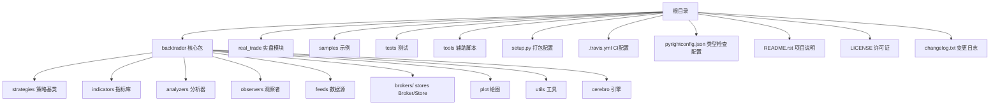
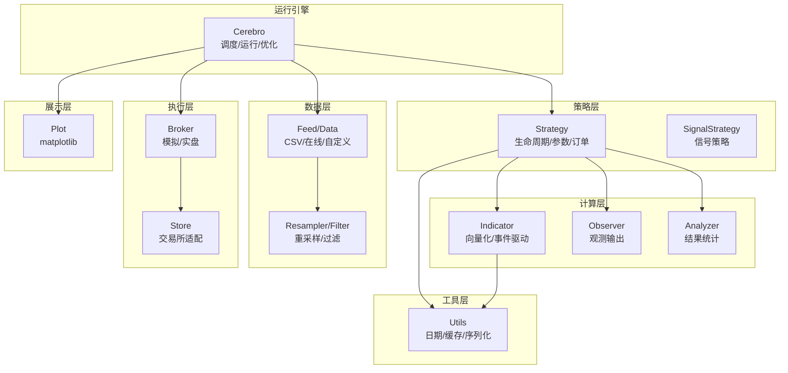
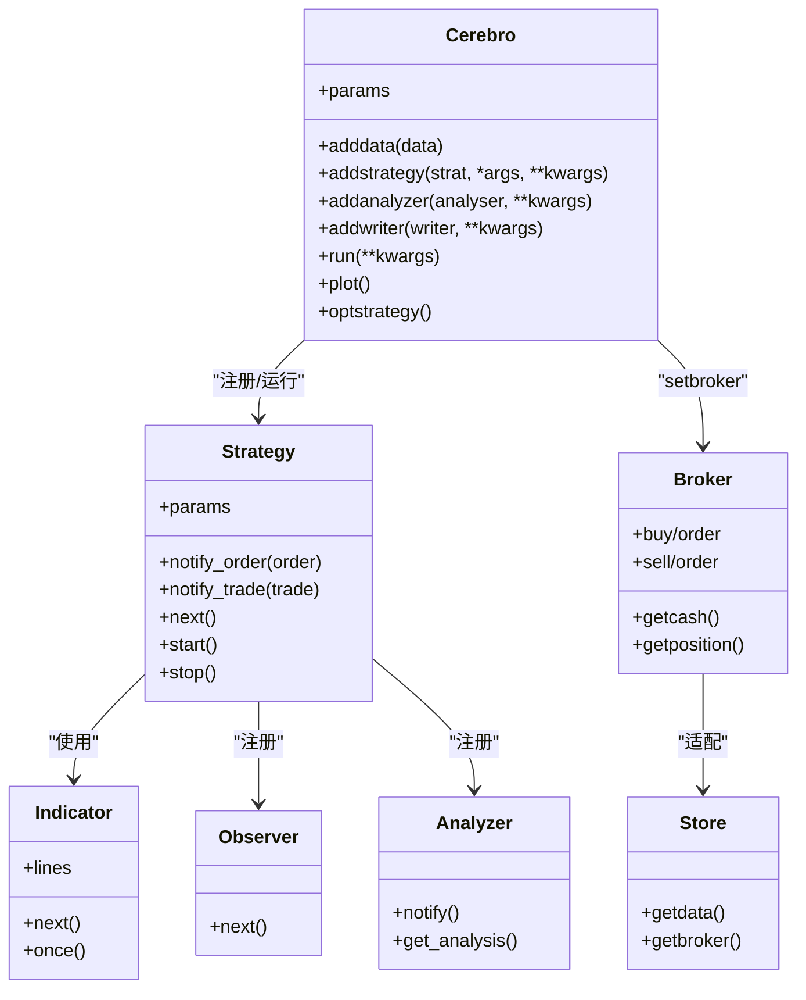
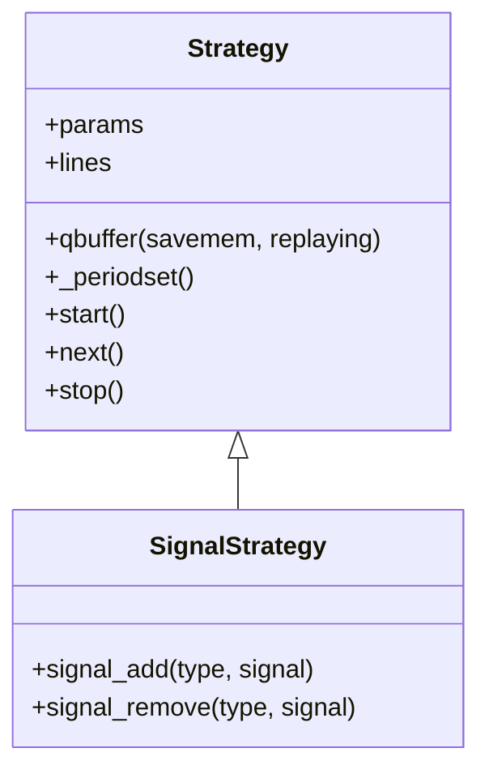
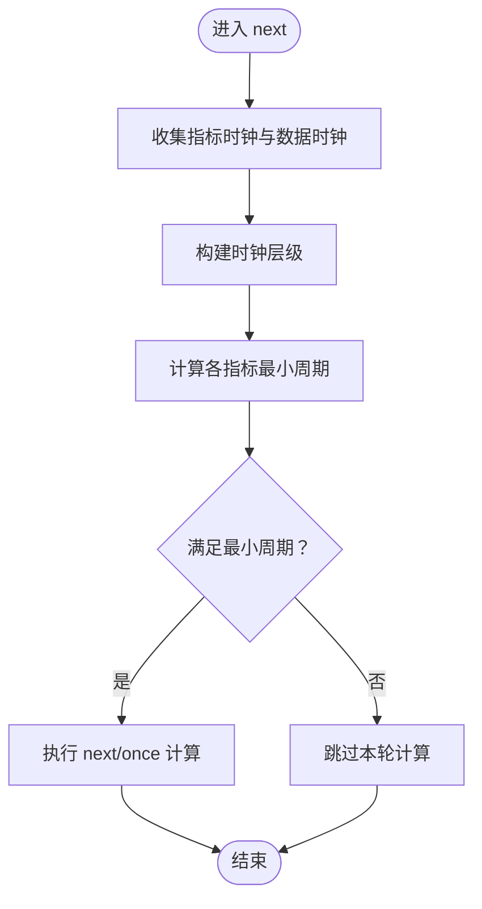
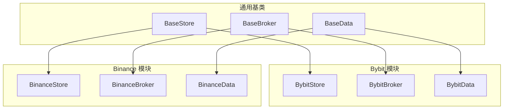
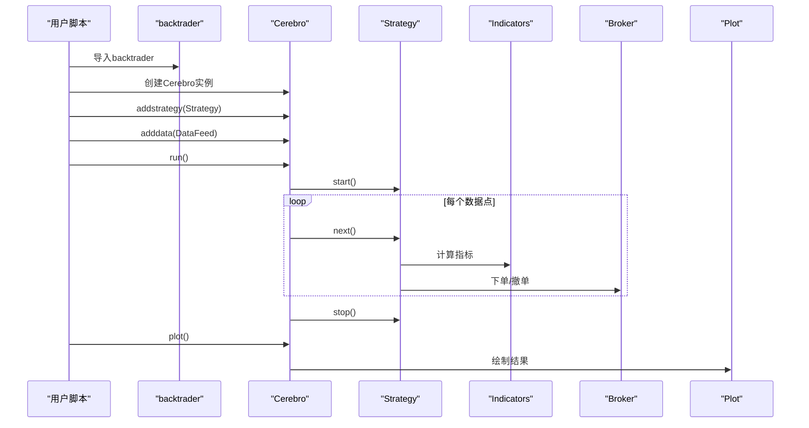
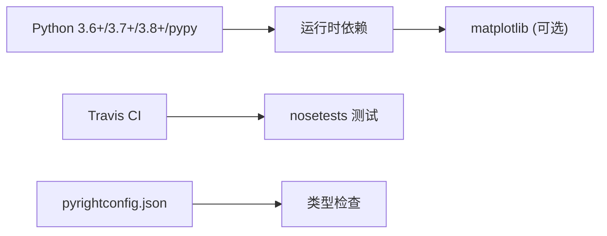

# 开发者指南

<cite>
**本文引用的文件**
- [README.rst](file://README.rst)
- [setup.py](file://setup.py)
- [LICENSE](file://LICENSE)
- [backtrader/__init__.py](file://backtrader/__init__.py)
- [backtrader/version.py](file://backtrader/version.py)
- [.travis.yml](file://.travis.yml)
- [pyrightconfig.json](file://pyrightconfig.json)
- [.env](file://.env)
- [backtrader/cerebro.py](file://backtrader/cerebro.py)
- [backtrader/strategy.py](file://backtrader/strategy.py)
- [tests/testcommon.py](file://tests/testcommon.py)
- [changelog.txt](file://changelog.txt)
- [real_trade/ARCHITECTURE.md](file://real_trade/ARCHITECTURE.md)
- [real_trade/README.md](file://real_trade/README.md)
- [backtrader/strategies/sma_crossover.py](file://backtrader/strategies/sma_crossover.py)
- [tools/bt-run.py](file://tools/bt-run.py)
</cite>

## 目录
1. [简介](#简介)
2. [项目结构](#项目结构)
3. [核心组件](#核心组件)
4. [架构总览](#架构总览)
5. [详细组件分析](#详细组件分析)
6. [依赖分析](#依赖分析)
7. [性能考量](#性能考量)
8. [故障排查指南](#故障排查指南)
9. [结论](#结论)
10. [附录](#附录)

## 简介
本指南面向Backtrader贡献者与扩展开发者，提供从开发环境搭建、代码规范、架构设计、扩展点、贡献流程、发布与版本管理、许可证与法律、社区参与、常见问题与调试技巧，到性能优化与安全考虑的全流程技术指导。Backtrader是一个用Python编写的回测与实盘交易框架，支持多种数据源、指标、分析器、观察者、订单执行与资金管理，并提供统一的策略开发与运行引擎。

## 项目结构
仓库采用按功能域划分的模块化组织方式，核心包位于backtrader目录下，涵盖策略、指标、分析器、观察者、数据流、Broker/Store、绘图、工具等；real_trade为实盘交易模块集合，采用“基类 + 各交易所子模块”的高复用架构；samples与tests提供示例与测试；tools提供辅助脚本；根目录包含打包、CI、许可证与变更日志等。

图表来源
- [backtrader/__init__.py](file://backtrader/__init__.py#L1-L91)
- [real_trade/README.md](file://real_trade/README.md#L1-L37)
- [README.rst](file://README.rst#L1-L171)

章节来源
- [README.rst](file://README.rst#L1-L171)
- [backtrader/__init__.py](file://backtrader/__init__.py#L1-L91)
- [real_trade/README.md](file://real_trade/README.md#L1-L37)

## 核心组件
- 引擎与控制流：Cerebro作为主控引擎，协调数据、策略、观察者、分析器、Broker/Store、绘图与运行参数。
- 策略体系：Strategy基类与MetaStrategy元类，提供参数、生命周期回调、订单/交易管理、内存节省模式等。
- 指标与计算：Indicator基类与Line系列，支持向量化与事件驱动两种运行模式，具备最小周期计算与缓存优化。
- 数据与流：Feed/DataSource、Resampler/Filter、时间轴与日历、时区处理。
- Broker/Store：模拟与实盘Broker、多交易所Store适配。
- 分析器与观察者：内置分析器与观察者，支持自定义扩展。
- 工具与实用：日期时间转换、有序字典、自动字典、flush文件等。

章节来源
- [backtrader/cerebro.py](file://backtrader/cerebro.py#L60-L200)
- [backtrader/strategy.py](file://backtrader/strategy.py#L107-L200)
- [backtrader/__init__.py](file://backtrader/__init__.py#L24-L91)

## 架构总览
Backtrader采用“引擎 + 插件化组件”的架构。Cerebro作为调度中心，策略通过参数与生命周期回调接入；指标/分析器/观察者以LineIterator形式参与；Broker/Store负责外部交互；Plot模块提供可视化；工具模块提供日期、缓存、序列化等支撑。

图表来源
- [backtrader/cerebro.py](file://backtrader/cerebro.py#L60-L200)
- [backtrader/strategy.py](file://backtrader/strategy.py#L107-L200)
- [backtrader/__init__.py](file://backtrader/__init__.py#L24-L91)

## 详细组件分析

### Cerebro 引擎
- 关键职责：注册数据、策略、分析器、观察者、Writer；控制运行模式（预加载、向量化、实时、优化）；多进程优化；内存节省策略；交易历史记录；回调与事件分发。
- 运行参数：preload、runonce、live、maxcpus、stdstats、exactbars、writer、tradehistory、optdatas、optreturn等。
- 优化流程：支持多核并行，数据预加载去重，优化回调。

图表来源
- [backtrader/cerebro.py](file://backtrader/cerebro.py#L60-L200)
- [backtrader/strategy.py](file://backtrader/strategy.py#L107-L200)
- [backtrader/__init__.py](file://backtrader/__init__.py#L24-L91)

章节来源
- [backtrader/cerebro.py](file://backtrader/cerebro.py#L60-L200)

### 策略与信号策略
- Strategy基类提供参数容器、生命周期回调（start/next/stop）、订单/交易队列、观察者/分析器集合、内存节省模式、定时器与日历集成。
- SignalStrategy提供信号式策略简化，便于快速构建买卖信号触发的策略。

图表来源
- [backtrader/strategy.py](file://backtrader/strategy.py#L107-L200)

章节来源
- [backtrader/strategy.py](file://backtrader/strategy.py#L107-L200)

### 指标与最小周期计算
- 指标通过LineIterator参与策略循环，支持runonce向量化与事件驱动next两种模式。
- 最小周期计算会遍历指标链路，基于时钟层级确定各指标所需的最少数据长度，确保计算正确性。

图表来源
- [backtrader/strategy.py](file://backtrader/strategy.py#L155-L200)

章节来源
- [backtrader/strategy.py](file://backtrader/strategy.py#L155-L200)

### 实盘模块架构（real_trade）
- 采用“基类 + 各交易所子模块”模式，实现90%+代码复用，通过单例Store、统一Broker/Data接口，降低接入成本。
- 支持Bybit、Binance等交易所模块，提供便捷创建函数与示例。

图表来源
- [real_trade/ARCHITECTURE.md](file://real_trade/ARCHITECTURE.md#L66-L90)
- [real_trade/README.md](file://real_trade/README.md#L149-L179)

章节来源
- [real_trade/ARCHITECTURE.md](file://real_trade/ARCHITECTURE.md#L1-L295)
- [real_trade/README.md](file://real_trade/README.md#L1-L266)

### 示例与运行流程
- 示例策略SMA_CrossOver展示了策略参数、指标构造与买卖信号逻辑。
- bt-run工具提供命令行入口，便于直接运行策略脚本。

图表来源
- [backtrader/strategies/sma_crossover.py](file://backtrader/strategies/sma_crossover.py#L29-L75)
- [tools/bt-run.py](file://tools/bt-run.py#L24-L29)

章节来源
- [backtrader/strategies/sma_crossover.py](file://backtrader/strategies/sma_crossover.py#L1-L75)
- [tools/bt-run.py](file://tools/bt-run.py#L1-L29)

## 依赖分析
- Python版本：支持Python 3.2+，兼容pypy/pypy3（matplotlib不受支持）。
- 运行时依赖：核心自包含，绘图需matplotlib（可选）。
- CI矩阵：Travis支持Python 3.6/3.7/3.8/nightly与pypy/pypy3，测试使用nosetests。
- 类型检查：pyright配置包含backtrader、tests、samples，虚拟环境路径与版本设定。

图表来源
- [README.rst](file://README.rst#L118-L141)
- [.travis.yml](file://.travis.yml#L1-L23)
- [pyrightconfig.json](file://pyrightconfig.json#L1-L43)

章节来源
- [README.rst](file://README.rst#L118-L141)
- [.travis.yml](file://.travis.yml#L1-L23)
- [pyrightconfig.json](file://pyrightconfig.json#L1-L43)

## 性能考量
- 向量化与事件驱动：runonce参数控制指标是否向量化加速；exactbars影响内存占用与绘图可用性。
- 内存节省：qbuffer与exactbars策略减少存储压力，适合长序列回测。
- 多进程优化：maxcpus并行优化，optdatas合并预加载提升效率。
- 数据预加载：preload减少IO等待，但增加内存占用。
- 绘图限制：exactbars=True时禁用绘图，避免内存与性能问题。

章节来源
- [backtrader/cerebro.py](file://backtrader/cerebro.py#L60-L200)
- [backtrader/strategy.py](file://backtrader/strategy.py#L120-L155)

## 故障排查指南
- 环境变量：确保PYTHONPATH包含项目根目录，便于导入backtrader。
- 测试框架：使用tests/testcommon.py中的runtest与TestStrategy进行一致性验证。
- 版本与变更：参考changelog.txt定位回归与修复，确认当前版本号。
- 许可证合规：遵循GPLv3+条款，注意衍生作品需保留版权与许可证声明。

章节来源
- [.env](file://.env#L1-L2)
- [tests/testcommon.py](file://tests/testcommon.py#L61-L118)
- [changelog.txt](file://changelog.txt#L1-L200)
- [LICENSE](file://LICENSE#L1-L675)

## 结论
Backtrader通过清晰的引擎-组件架构、可扩展的策略与指标体系、统一的Broker/Store接口以及模块化的实盘扩展，为开发者提供了高效、灵活且可维护的量化平台。建议在开发中遵循统一的参数与生命周期约定、充分利用内存节省与并行优化、严格遵守许可证条款，并通过示例与测试验证行为一致性。

## 附录

### 开发环境搭建
- Python环境：使用Python 3.6+，推荐3.8+；可选pypy/pypy3（不含matplotlib）。
- 依赖安装：核心自包含；如需绘图，安装matplotlib；其他功能依赖见文档说明。
- IDE设置：启用pyright类型检查，配置虚拟环境与Python版本；在VSCode中可通过settings.json与pyrightconfig.json协同。
- 环境变量：设置PYTHONPATH指向项目根目录，便于导入backtrader。

章节来源
- [README.rst](file://README.rst#L118-L141)
- [pyrightconfig.json](file://pyrightconfig.json#L1-L43)
- [.env](file://.env#L1-L2)

### 代码规范与风格
- 导入与编码：统一使用绝对导入与UTF-8编码；模块顶部包含GPLv3+许可声明。
- 类与方法：遵循现有类命名与缩进风格；参数与属性使用p前缀；生命周期方法（start/next/stop）保持简洁。
- 注释与文档：模块级与类级文档字符串描述用途与注意事项；复杂逻辑添加行内注释。
- 测试：使用tests/testcommon.py提供的runtest与TestStrategy进行回归测试。

章节来源
- [backtrader/__init__.py](file://backtrader/__init__.py#L1-L91)
- [tests/testcommon.py](file://tests/testcommon.py#L1-L238)

### 架构设计原则与扩展点
- 插件系统：通过Cerebro注册策略、分析器、观察者、Writer；策略通过参数与回调扩展。
- 钩子机制：策略生命周期（start/next/stop）、通知回调（notify_order/notify_trade）、定时器与日历。
- 配置管理：Cerebro参数（preload/runonce/live/maxcpus/stdstats/exactbars等）控制运行行为；策略参数（params）承载配置。
- 扩展点：自定义指标（继承Indicator）、自定义分析器（继承Analyzer）、自定义观察者（继承Observer）、自定义Broker/Store（适配外部系统）。

章节来源
- [backtrader/cerebro.py](file://backtrader/cerebro.py#L60-L200)
- [backtrader/strategy.py](file://backtrader/strategy.py#L107-L200)
- [backtrader/__init__.py](file://backtrader/__init__.py#L24-L91)

### 贡献流程与代码审查
- 分支管理：建议基于主分支创建功能分支，提交前同步上游。
- 提交规范：遵循现有模块结构与命名；在changelog.txt中记录重要变更。
- 测试要求：新增功能需配套测试；使用tests/testcommon.py的测试框架验证。
- 代码审查：关注许可证合规、性能影响、内存与绘图限制、向后兼容性。

章节来源
- [changelog.txt](file://changelog.txt#L1-L200)
- [tests/testcommon.py](file://tests/testcommon.py#L61-L118)

### 发布流程与版本管理
- 版本号：X.Y.Z.I格式，X为主版本，Y为次版本，Z为修订，I为内置指标数量。
- 打包与发布：通过setup.py配置包信息、分类器、可选绘图依赖与入口脚本；使用pypi.sh进行发布（如存在）。
- CI：Travis CI矩阵覆盖多Python版本与pypy；测试脚本使用nosetests。

章节来源
- [README.rst](file://README.rst#L159-L171)
- [setup.py](file://setup.py#L43-L141)
- [.travis.yml](file://.travis.yml#L1-L23)

### 许可证与法律
- 许可证：GNU GPLv3+；衍生作品需保留版权与许可证文本；分发时需附带许可证副本。
- 法律考虑：注意专利与反规避条款；修改版本需标注变更；禁止将程序用于非法用途。

章节来源
- [LICENSE](file://LICENSE#L1-L675)

### 社区参与与沟通
- 社区渠道：通过社区论坛进行反馈与交流；关注官方博客与文档站点。
- 问题与工单：避免滥用工单系统咨询示例问题；优先使用社区渠道。

章节来源
- [README.rst](file://README.rst#L32-L40)

### 常见问题与调试技巧
- 策略未生效：检查参数（params）、最小周期（minperiod）、runonce与exactbars设置。
- 内存不足：启用qbuffer与合适的exactbars策略；减少绘图或关闭runonce。
- 数据缺失：确认数据源路径与时间范围；检查预加载与重采样设置。
- 许可证问题：确保分发版本包含完整GPLv3+文本与版权声明。

章节来源
- [backtrader/strategy.py](file://backtrader/strategy.py#L120-L155)
- [tests/testcommon.py](file://tests/testcommon.py#L61-L118)
- [LICENSE](file://LICENSE#L623-L675)

### 性能优化与安全
- 性能优化：合理设置runonce与exactbars；使用多进程优化（maxcpus）；避免不必要的绘图；利用指标缓存与对象复用。
- 安全考虑：实盘模块默认模拟交易；接入真实资金前充分测试；设置止损与风险控制；妥善保管API密钥与配置文件。

章节来源
- [real_trade/README.md](file://real_trade/README.md#L210-L266)
- [backtrader/cerebro.py](file://backtrader/cerebro.py#L60-L200)