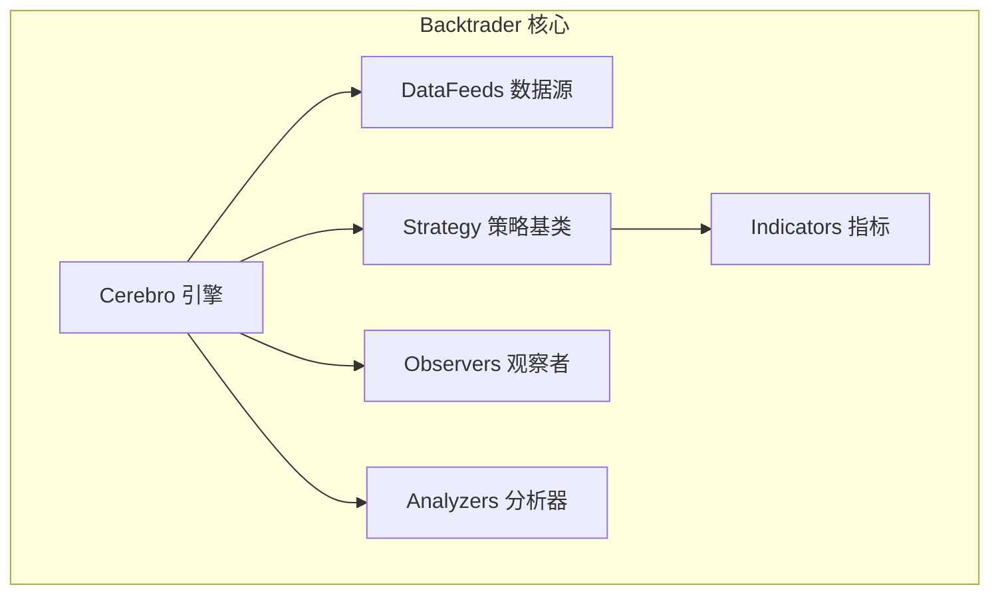
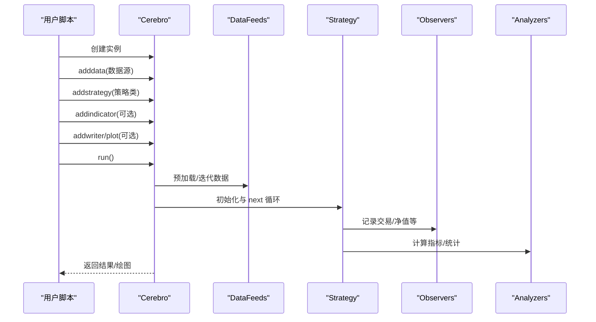
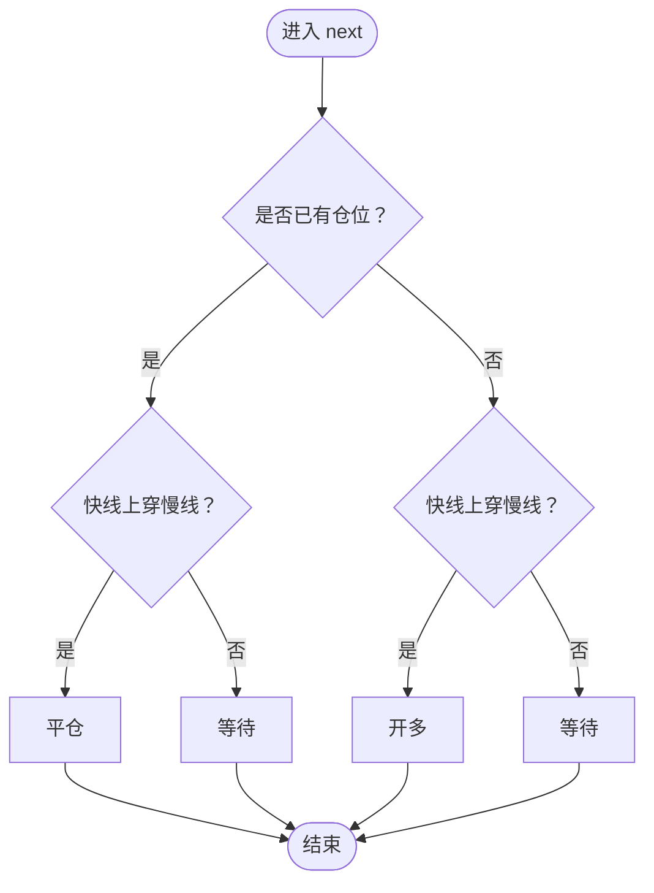
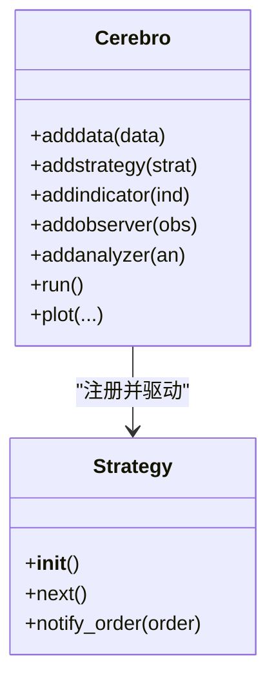
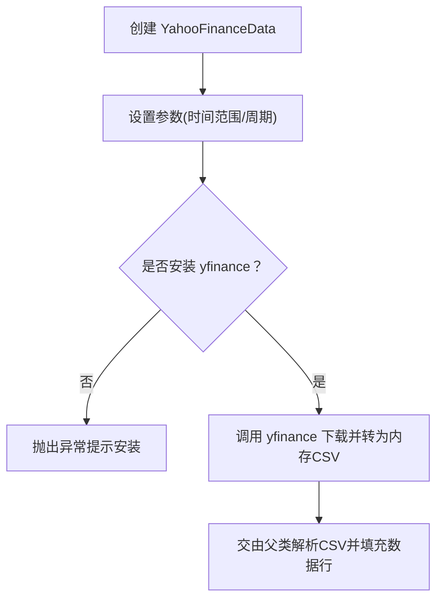
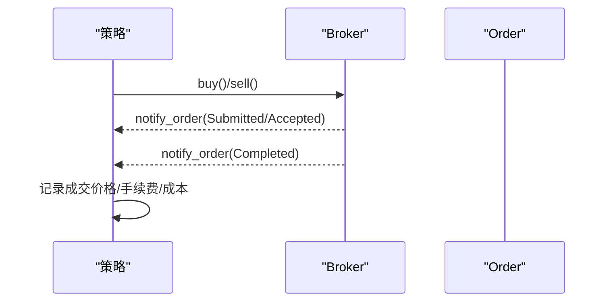
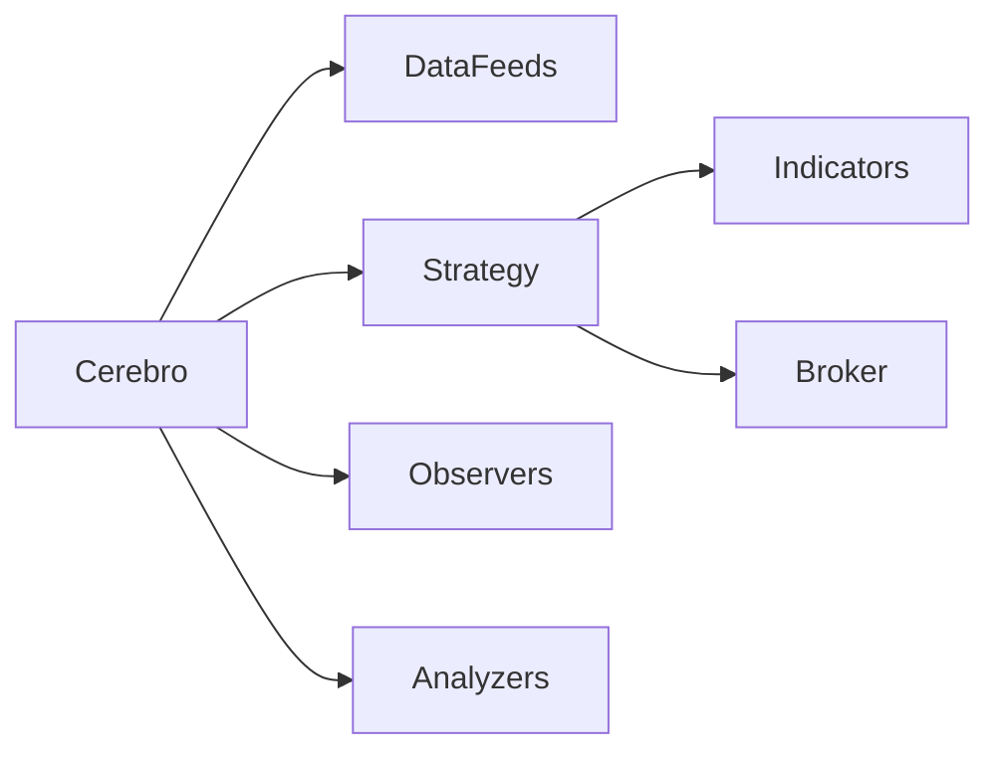

# 快速入门

<cite>
**本文引用的文件**
- [backtrader/__init__.py](file://backtrader/__init__.py)
- [backtrader/cerebro.py](file://backtrader/cerebro.py)
- [backtrader/strategies/sma_crossover.py](file://backtrader/strategies/sma_crossover.py)
- [samples/yahoo-test/yahoo-test.py](file://samples/yahoo-test/yahoo-test.py)
- [backtrader/feeds/yahoo.py](file://backtrader/feeds/yahoo.py)
- [backtrader/feeds/csvgeneric.py](file://backtrader/feeds/csvgeneric.py)
- [samples/data-pandas/data-pandas.py](file://samples/data-pandas/data-pandas.py)
- [samples/order-execution/order-execution.py](file://samples/order-execution/order-execution.py)
- [samples/optimization/optimization.py](file://samples/optimization/optimization.py)
- [backtrader/strategy.py](file://backtrader/strategy.py)
- [backtrader/indicators/sma.py](file://backtrader/indicators/sma.py)
- [README.rst](file://README.rst)
- [setup.py](file://setup.py)
</cite>

## 目录
1. [简介](#简介)
2. [项目结构](#项目结构)
3. [核心组件](#核心组件)
4. [架构总览](#架构总览)
5. [详细组件分析](#详细组件分析)
6. [依赖关系分析](#依赖关系分析)
7. [性能考虑](#性能考虑)
8. [故障排查指南](#故障排查指南)
9. [结论](#结论)
10. [附录：安装与示例路径](#附录安装与示例路径)

## 简介
本指南面向量化交易初学者，帮助你用最短时间上手 Backtrader。内容覆盖：
- 安装（从 PyPI 和从源码）
- 最小策略示例（SMA 交叉）
- Cerebro 引擎基础用法（数据添加、策略配置、回测执行、结果可视化）
- 常用数据源（Yahoo Finance、CSV、Pandas）
- 量化交易基本概念（时间序列、技术指标、订单执行）
- 常见问题与调试技巧

## 项目结构
Backtrader 是一个模块化的回测框架，核心由以下部分组成：
- 引擎与运行时：Cerebro 负责组织数据、策略、观察者、分析器等，并驱动回测循环
- 策略层：Strategy 基类及子类定义交易逻辑
- 指标层：内置大量技术指标，支持自定义扩展
- 数据层：多种数据源适配器（CSV、Yahoo Finance、Pandas 等）
- 可视化与输出：Plot、Writer 等

图表来源
- [backtrader/cerebro.py](file://backtrader/cerebro.py#L60-L320)
- [backtrader/strategy.py](file://backtrader/strategy.py#L107-L200)
- [backtrader/indicators/sma.py](file://backtrader/indicators/sma.py#L27-L46)
- [backtrader/feeds/yahoo.py](file://backtrader/feeds/yahoo.py#L37-L91)

章节来源
- [backtrader/__init__.py](file://backtrader/__init__.py#L24-L91)
- [README.rst](file://README.rst#L126-L154)

## 核心组件
- Cerebro：回测主控，负责数据注册、策略注册、运行、绘图、分析器与观察者管理
- Strategy：策略基类，定义 next、notify_order 等生命周期钩子
- Indicators：技术指标，如 SMA、EMA、MACD、CrossOver 等
- DataFeeds：数据源适配器，支持 CSV、Yahoo Finance、Pandas 等
- Observers/Analyzers：内置观察与分析工具，用于记录交易、统计收益等

章节来源
- [backtrader/cerebro.py](file://backtrader/cerebro.py#L60-L320)
- [backtrader/strategy.py](file://backtrader/strategy.py#L107-L200)
- [backtrader/indicators/sma.py](file://backtrader/indicators/sma.py#L27-L46)
- [backtrader/feeds/yahoo.py](file://backtrader/feeds/yahoo.py#L37-L91)

## 架构总览
下面的时序图展示了从创建 Cerebro 到完成回测并可视化的典型流程。

图表来源
- [backtrader/cerebro.py](file://backtrader/cerebro.py#L752-L775)
- [backtrader/strategy.py](file://backtrader/strategy.py#L107-L200)
- [samples/yahoo-test/yahoo-test.py](file://samples/yahoo-test/yahoo-test.py#L33-L67)

## 详细组件分析

### 组件一：SMA 交叉策略（最小示例）
这是一个经典的多头排列买入、空头排列卖出的策略。要点：
- 参数：快线周期、慢线周期、移动平均类型
- 信号：快线上穿慢线做多；快线下穿慢线平仓
- 执行：市价单，无仓位限制

图表来源
- [backtrader/strategies/sma_crossover.py](file://backtrader/strategies/sma_crossover.py#L62-L75)

章节来源
- [backtrader/strategies/sma_crossover.py](file://backtrader/strategies/sma_crossover.py#L29-L75)
- [backtrader/indicators/sma.py](file://backtrader/indicators/sma.py#L27-L46)

### 组件二：Cerebro 引擎基础用法
- 添加数据：adddata(DataFeed 实例)
- 添加策略：addstrategy(Strategy 子类或实例)
- 添加指标/观察者/分析器：addindicator/addobserver/addanalyzer
- 运行：run() 返回策略运行结果
- 可视化：plot()

图表来源
- [backtrader/cerebro.py](file://backtrader/cerebro.py#L752-L775)
- [backtrader/strategy.py](file://backtrader/strategy.py#L107-L200)

章节来源
- [backtrader/cerebro.py](file://backtrader/cerebro.py#L60-L320)
- [samples/yahoo-test/yahoo-test.py](file://samples/yahoo-test/yahoo-test.py#L33-L67)

### 组件三：数据源使用示例

#### Yahoo Finance 数据
- 在线下载：YahooFinanceData 支持通过 yfinance 下载指定时间段的历史数据
- CSV 文件：YahooFinanceCSVData 解析已下载的 CSV 文件

图表来源
- [backtrader/feeds/yahoo.py](file://backtrader/feeds/yahoo.py#L253-L376)

章节来源
- [backtrader/feeds/yahoo.py](file://backtrader/feeds/yahoo.py#L37-L91)
- [backtrader/feeds/yahoo.py](file://backtrader/feeds/yahoo.py#L196-L251)
- [backtrader/feeds/yahoo.py](file://backtrader/feeds/yahoo.py#L253-L376)

#### CSV 数据
- 使用 GenericCSVData 解析任意列顺序的 CSV
- 支持日期/时间格式、缺失值处理、时区转换等

章节来源
- [backtrader/feeds/csvgeneric.py](file://backtrader/feeds/csvgeneric.py#L32-L86)
- [backtrader/feeds/csvgeneric.py](file://backtrader/feeds/csvgeneric.py#L103-L158)

#### Pandas 数据
- 将 pandas.DataFrame 包装为 PandasData 并加入 Cerebro

章节来源
- [samples/data-pandas/data-pandas.py](file://samples/data-pandas/data-pandas.py#L48-L67)

### 组件四：订单执行与通知
- 策略中通过 buy()/sell() 发出订单
- notify_order(order) 接收订单状态变化（提交、接受、完成、过期等）
- 示例策略演示了多种执行类型（市价、收盘价、限价、止损、止盈止损）

图表来源
- [samples/order-execution/order-execution.py](file://samples/order-execution/order-execution.py#L52-L78)

章节来源
- [samples/order-execution/order-execution.py](file://samples/order-execution/order-execution.py#L36-L163)

### 组件五：优化（参数扫描）
- 使用 optstrategy 对策略参数进行网格搜索
- 可配置 CPU 数量、是否预加载数据、返回对象优化等

章节来源
- [samples/optimization/optimization.py](file://samples/optimization/optimization.py#L51-L102)
- [backtrader/cerebro.py](file://backtrader/cerebro.py#L60-L320)

## 依赖关系分析
Backtrader 的模块间依赖清晰，主要围绕 Cerebro 作为中枢协调各组件。

图表来源
- [backtrader/cerebro.py](file://backtrader/cerebro.py#L60-L320)
- [backtrader/strategy.py](file://backtrader/strategy.py#L107-L200)

章节来源
- [backtrader/__init__.py](file://backtrader/__init__.py#L24-L91)

## 性能考虑
- 预加载与向量化：preload/runonce 可显著提升速度，但会占用更多内存
- 内存节省：exactbars=-1/-2 可减少内存占用，但会禁用绘图或影响某些计算
- 多核优化：optdatas/optreturn 在优化场景下可加速
- 数据源选择：在线下载需网络与第三方库，本地 CSV 更稳定

章节来源
- [backtrader/cerebro.py](file://backtrader/cerebro.py#L60-L320)
- [samples/optimization/optimization.py](file://samples/optimization/optimization.py#L51-L102)

## 故障排查指南
- 安装问题
  - 缺少绘图依赖：安装 matplotlib 或使用 extras_require[plotting]
  - Yahoo 数据源：需要安装 yfinance
- 数据问题
  - CSV 字段顺序不匹配：调整 GenericCSVData 的列索引参数
  - 时间格式错误：dtformat/tmformat 设置正确
- 回测无结果
  - 确认已 adddata 且时间范围正确
  - 确认策略逻辑触发条件合理
- 订单未成交
  - 检查执行类型与价格是否合理
  - 关注 notify_order 中的状态日志

章节来源
- [README.rst](file://README.rst#L126-L154)
- [backtrader/feeds/yahoo.py](file://backtrader/feeds/yahoo.py#L253-L262)
- [samples/order-execution/order-execution.py](file://samples/order-execution/order-execution.py#L52-L78)

## 结论
通过本指南，你已经了解了 Backtrader 的核心结构、最小策略实现、Cerebro 的基本用法以及常用数据源。建议从 SMA 交叉策略开始，逐步引入指标、观察者与分析器，并结合不同数据源进行实盘前验证。

## 附录：安装与示例路径
- 从 PyPI 安装
  - 基础安装：pip install backtrader
  - 启用绘图：pip install backtrader[plotting]
- 从源码安装
  - 将 backtrader 目录放入项目内或安装到系统环境
- 示例脚本位置
  - Yahoo Finance 测试：samples/yahoo-test/yahoo-test.py
  - Pandas 数据测试：samples/data-pandas/data-pandas.py
  - 订单执行示例：samples/order-execution/order-execution.py
  - 优化示例：samples/optimization/optimization.py
  - 最小策略：backtrader/strategies/sma_crossover.py

章节来源
- [README.rst](file://README.rst#L126-L154)
- [setup.py](file://setup.py#L118-L141)
- [samples/yahoo-test/yahoo-test.py](file://samples/yahoo-test/yahoo-test.py#L33-L67)
- [samples/data-pandas/data-pandas.py](file://samples/data-pandas/data-pandas.py#L32-L75)
- [samples/order-execution/order-execution.py](file://samples/order-execution/order-execution.py#L164-L184)
- [samples/optimization/optimization.py](file://samples/optimization/optimization.py#L51-L102)
- [backtrader/strategies/sma_crossover.py](file://backtrader/strategies/sma_crossover.py#L29-L75)