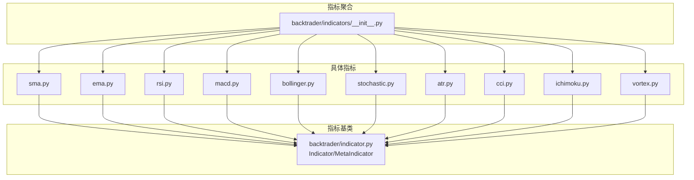
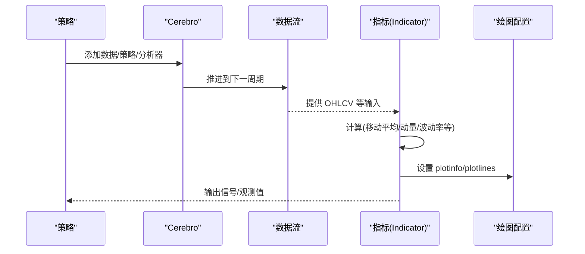
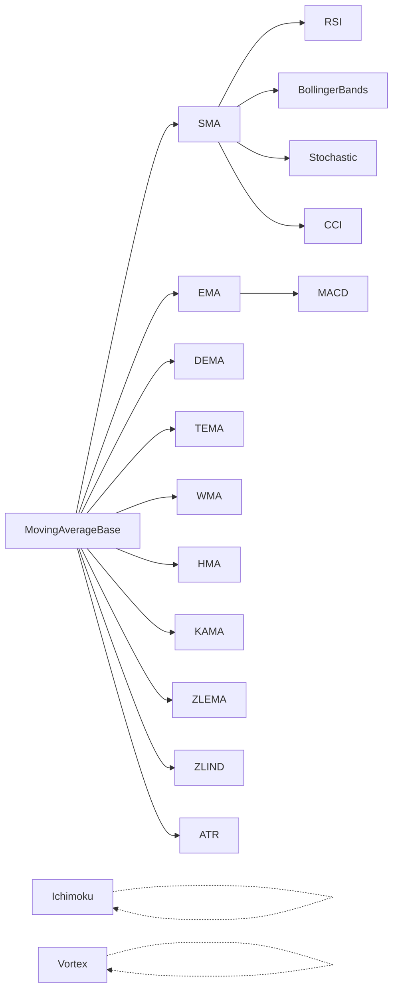

# 内置技术指标

<cite>
**本文引用的文件**
- [backtrader/indicators/__init__.py](file://backtrader/indicators/__init__.py)
- [backtrader/indicator.py](file://backtrader/indicator.py)
- [backtrader/indicators/sma.py](file://backtrader/indicators/sma.py)
- [backtrader/indicators/ema.py](file://backtrader/indicators/ema.py)
- [backtrader/indicators/rsi.py](file://backtrader/indicators/rsi.py)
- [backtrader/indicators/macd.py](file://backtrader/indicators/macd.py)
- [backtrader/indicators/bollinger.py](file://backtrader/indicators/bollinger.py)
- [backtrader/indicators/stochastic.py](file://backtrader/indicators/stochastic.py)
- [backtrader/indicators/atr.py](file://backtrader/indicators/atr.py)
- [backtrader/indicators/vortex.py](file://backtrader/indicators/vortex.py)
- [backtrader/indicators/ichimoku.py](file://backtrader/indicators/ichimoku.py)
- [backtrader/indicators/cci.py](file://backtrader/indicators/cci.py)
- [backtrader/strategies/__init__.py](file://backtrader/strategies/__init__.py)
- [samples/strategy-selection/strategy-selection.py](file://samples/strategy-selection/strategy-selection.py)
</cite>

## 目录
1. [简介](#简介)
2. [项目结构](#项目结构)
3. [核心组件](#核心组件)
4. [架构总览](#架构总览)
5. [详细组件分析](#详细组件分析)
6. [依赖关系分析](#依赖关系分析)
7. [性能考量](#性能考量)
8. [故障排查指南](#故障排查指南)
9. [结论](#结论)
10. [附录：指标分类与索引](#附录指标分类与索引)

## 简介
本文件为 Backtrader 内置技术指标的权威参考文档。内容覆盖全部内置指标（约122个）的分类、功能、参数、计算公式、典型用法、组合方式、可视化与图表配置、性能对比与选择建议、以及常见问题与调试技巧。文档以“移动平均类、动量指标类、波动率指标类、成交量指标类、通道与超买超卖类”等维度组织，并通过图示与路径指引帮助读者快速定位实现细节。

## 项目结构
Backtrader 的指标体系由统一的基类与元类驱动，所有指标通过一个聚合入口导出，便于在策略中直接按模块名访问。核心结构如下：

**图示来源**
- [backtrader/indicators/__init__.py](file://backtrader/indicators/__init__.py#L30-L91)
- [backtrader/indicator.py](file://backtrader/indicator.py#L32-L165)

**章节来源**
- [backtrader/indicators/__init__.py](file://backtrader/indicators/__init__.py#L30-L91)
- [backtrader/indicator.py](file://backtrader/indicator.py#L32-L165)

## 核心组件
- 指标基类与元类
  - Indicator：定义指标生命周期（next/once/preonce）、缓存控制、绘图绑定等。
  - MetaIndicator：负责对象缓存、默认行为补全（如 once_via_next）与注册机制。
- 指标导入聚合
  - 通过 __init__.py 将各类指标模块统一导出，支持按名称或别名访问。

关键点
- 缓存开关：可通过 MetaIndicator.usecache/onoff 控制对象缓存，避免重复实例化带来的 minperiod 影响。
- 绘图支持：LinePlotterIndicator/MtLinePlotterIndicator 提供多线图层与 plotinfo/plotlines 配置能力。
- 生命周期：Indicator.advance 与 once_via_next/preonce_via_prenext 协调多数据源不同长度时的推进逻辑。

**章节来源**
- [backtrader/indicator.py](file://backtrader/indicator.py#L32-L165)

## 架构总览
下图展示了指标系统的核心交互：策略通过 cerebro 注入数据与指标，指标基于基类进行计算与绘图配置，最终参与信号生成与回测评估。

**图示来源**
- [backtrader/indicator.py](file://backtrader/indicator.py#L90-L137)
- [samples/strategy-selection/strategy-selection.py](file://samples/strategy-selection/strategy-selection.py#L29-L41)

## 详细组件分析

### 移动平均类
- 简单移动平均（SMA）
  - 功能：对最近 N 期价格求算术平均，平滑短期波动。
  - 参数：period（默认值见实现）、可选 movav（用于扩展）。
  - 公式：SMA = Σprice / period。
  - 使用场景：趋势跟踪、作为其他指标的底层平滑器。
  - 注意事项：对新信息反应较慢；易受尖峰影响。
  - 参考实现路径：[backtrader/indicators/sma.py](file://backtrader/indicators/sma.py#L27-L46)

- 指数移动平均（EMA）
  - 功能：对近期数据赋予更高权重，响应更快。
  - 参数：period、alpha（衰减因子）。
  - 公式：EMA(t) = α×price(t) + (1−α)×EMA(t−1)。
  - 使用场景：快速趋势识别、MACD 基础线。
  - 注意事项：初始值敏感；需足够历史期以稳定。
  - 参考实现路径：[backtrader/indicators/ema.py](file://backtrader/indicators/ema.py#L27-L56)

- 复合与变体
  - DEMA、TEMA、WMA、HMA、KAMA、ZLEMA、ZLIND 等均基于 MovingAverageBase 或平滑/加权思想派生，适合不同平滑与去滞后需求。

**章节来源**
- [backtrader/indicators/sma.py](file://backtrader/indicators/sma.py#L27-L46)
- [backtrader/indicators/ema.py](file://backtrader/indicators/ema.py#L27-L56)

### 动量指标类
- 相对强弱指数（RSI）
  - 功能：衡量超买/超卖状态，识别背离与反转。
  - 参数：period（默认14）、movav（SMMA/Wilder 默认）、upperband/lowerband、safediv/safehigh/safelow、lookback。
  - 公式：RS = AvgGain / AvgLoss；RSI = 100 − 100/(1 + RS)。
  - 使用场景：震荡区间择机、结合趋势过滤。
  - 注意事项：极端值区域（接近0/100）可能产生假信号；可启用 safediv 避免 0/0。
  - 参考实现路径：[backtrader/indicators/rsi.py](file://backtrader/indicators/rsi.py#L122-L192)

- MACD 与柱状图（MACD/MACD 信号线/柱状图）
  - 功能：双指数均线之差与信号线（通常为 EMA），柱状图显示背离强度。
  - 参数：period_me1（短）、period_me2（长）、period_signal、movav。
  - 公式：MACD = EMA1 − EMA2；Signal = EMA(MACD, signal)；Histogram = MACD − Signal。
  - 使用场景：趋势方向与动能变化、交叉与背离策略。
  - 注意事项：参数较长时滞后明显；可切换 movav 类型。
  - 参考实现路径：[backtrader/indicators/macd.py](file://backtrader/indicators/macd.py#L27-L64)

- 随机指标（Stochastic/快线/慢线/全量）
  - 功能：衡量收盘价相对区间位置，区分超买/超卖。
  - 参数：period、period_dfast、period_dslow、movav、upperband/lowerband、safediv/safezero。
  - 公式：K = 100×(C−LL)/(HH−LL)；D 为 K 的移动平均。
  - 使用场景：震荡市场择机、与趋势指标组合。
  - 注意事项：safediv 可避免除零；period_dslow 增加平滑。
  - 参考实现路径：[backtrader/indicators/stochastic.py](file://backtrader/indicators/stochastic.py#L58-L115)

- 顺势指标（Vortex）
  - 功能：衡量真实波幅与净价差的比率，判断趋势强度与突破。
  - 参数：period。
  - 公式：+VI = Σ|High(t) − Low(t−1)| / ΣTR；−VI 同理。
  - 使用场景：趋势确认、突破过滤。
  - 参考实现路径：[backtrader/indicators/vortex.py](file://backtrader/indicators/vortex.py#L27-L54)

**章节来源**
- [backtrader/indicators/rsi.py](file://backtrader/indicators/rsi.py#L122-L192)
- [backtrader/indicators/macd.py](file://backtrader/indicators/macd.py#L27-L64)
- [backtrader/indicators/stochastic.py](file://backtrader/indicators/stochastic.py#L58-L115)
- [backtrader/indicators/vortex.py](file://backtrader/indicators/vortex.py#L27-L54)

### 波动率指标类
- 平均真实波幅（ATR）
  - 功能：衡量波动性大小，常用于止损/止盈设置与资金管理。
  - 参数：period、movav（默认 SMMA）。
  - 公式：TR = max(H−L, abs(H−C−1), abs(C−1−L))；ATR = MovAv(TR, period)。
  - 使用场景：动态止损、波动率自适应仓位。
  - 注意事项：period 越大越平滑但越滞后。
  - 参考实现路径：[backtrader/indicators/atr.py](file://backtrader/indicators/atr.py#L96-L123)

- 商品通道指数（CCI）
  - 功能：衡量价格偏离其均值的程度，识别极端与反转。
  - 参数：period、factor（典型取 0.015）、movav、upperband/lowerband。
  - 公式：CCI = (Tp − MA)/(.015 × MeanDev)。
  - 使用场景：突破与反转策略、震荡区间过滤。
  - 注意事项：factor 与 period 对灵敏度影响显著。
  - 参考实现路径：[backtrader/indicators/cci.py](file://backtrader/indicators/cci.py#L27-L71)

**章节来源**
- [backtrader/indicators/atr.py](file://backtrader/indicators/atr.py#L96-L123)
- [backtrader/indicators/cci.py](file://backtrader/indicators/cci.py#L27-L71)

### 成交量指标类
- 未在本仓库中发现独立的成交量指标实现文件。若需使用成交量相关指标，请结合数据源字段与自定义指标实现，或通过外部库集成。

### 通道与超买超卖类
- 布林带（Bollinger Bands 及 %B）
  - 功能：以均线为中心、标准差为半径构建上下轨，衡量价格偏离程度。
  - 参数：period、devfactor、movav。
  - 公式：Mid = MA；Top/Bottom = Mid ± devfactor×StdDev。
  - 使用场景：突破入场、通道收窄/扩张策略、布林百分比辅助。
  - 注意事项：%B 在牛熊市表现差异较大，需配合趋势。
  - 参考实现路径：[backtrader/indicators/bollinger.py](file://backtrader/indicators/bollinger.py#L27-L77)

- 一目均衡表（Ichimoku Cloud）
  - 功能：多轨合一的趋势与支撑阻力框架，包含先行与滞后的领先跨度。
  - 参数：tenkan（9）、kijun（26）、senkou（52）、senkou_lead（26）、chikou（26）。
  - 公式：Tenkan = (HH9+LL9)/2；Kijun = (HH26+LL26)/2；SenkouSpanA/B 前移；Chikou 回溯。
  - 使用场景：趋势方向判断、支撑/阻力识别、云层穿越信号。
  - 注意事项：参数固定，需结合时间框架与市场类型调整。
  - 参考实现路径：[backtrader/indicators/ichimoku.py](file://backtrader/indicators/ichimoku.py#L28-L87)

**章节来源**
- [backtrader/indicators/bollinger.py](file://backtrader/indicators/bollinger.py#L27-L77)
- [backtrader/indicators/ichimoku.py](file://backtrader/indicators/ichimoku.py#L28-L87)

### 组合使用与复合指标
- 常见组合
  - 趋势 + 动能：SMA/EMA + RSI/MACD；先用均线过滤方向，再用动量择时。
  - 波动 + 通道：ATR + 布林带；ATR 设止损/止盈，布林带捕捉突破。
  - 震荡 + 趋势：随机指标 + Ichimoku；震荡区择机，云层确认趋势。
- 复合指标思路
  - 通过 Indicator 子类组合多个基础指标输出合成信号（如 CrossOver、DivByZero、SumN 等工具已在指标中广泛使用）。
  - 示例参考：策略中将 SMA 与 CrossOver 结合生成买卖信号。

**章节来源**
- [samples/strategy-selection/strategy-selection.py](file://samples/strategy-selection/strategy-selection.py#L29-L41)

### 可视化与图表配置
- 绘图配置项
  - plotinfo：subplot、plotyhlines（水平线）、plothlines（零轴线）等。
  - plotlines：线条样式（虚线/实线）、颜色、透明度、柱状图宽度与alpha。
- 实战要点
  - 为 RSI/随机/布林带等指标设置阈值线（upperband/lowerband）。
  - MACD 图层叠加柱状图与信号线，便于观察背离。
  - 布林带使用虚线中轨与实线上下轨，%B 作为副图显示。
- 参考路径
  - [backtrader/indicators/rsi.py](file://backtrader/indicators/rsi.py#L175-L177)
  - [backtrader/indicators/macd.py](file://backtrader/indicators/macd.py#L48-L49)
  - [backtrader/indicators/bollinger.py](file://backtrader/indicators/bollinger.py#L45-L50)
  - [backtrader/indicators/stochastic.py](file://backtrader/indicators/stochastic.py#L41-L43)

**章节来源**
- [backtrader/indicators/rsi.py](file://backtrader/indicators/rsi.py#L175-L177)
- [backtrader/indicators/macd.py](file://backtrader/indicators/macd.py#L48-L49)
- [backtrader/indicators/bollinger.py](file://backtrader/indicators/bollinger.py#L45-L50)
- [backtrader/indicators/stochastic.py](file://backtrader/indicators/stochastic.py#L41-L43)

### 性能对比与选择指南
- 响应速度
  - EMA > DEMA/TEMA > WMA > SMA；过平滑会降低灵敏度。
- 稳健性
  - SMMA（RSI/Wilder）在极端行情更稳健；EMA 更敏感。
- 波动率估计
  - ATR 对跳空与盘整更稳健；Price Range（自行构造）对高开低走敏感。
- 适用场景
  - 短期交易：EMA + RSI/随机；MACD 柱状图背离。
  - 长期趋势：SMA/EMA/ICHIMOKU；布林带通道策略。
  - 震荡区间：RSI/CCI/随机；布林带收窄策略。

### 使用示例（策略中应用）
- 策略示例：基于 SMA 交叉生成信号
  - 关键步骤：创建两条 SMA，计算 CrossOver，添加 LONG 信号。
  - 参考路径：[samples/strategy-selection/strategy-selection.py](file://samples/strategy-selection/strategy-selection.py#L29-L41)

**章节来源**
- [samples/strategy-selection/strategy-selection.py](file://samples/strategy-selection/strategy-selection.py#L29-L41)

## 依赖关系分析
下图展示指标模块间的依赖与继承关系，体现“基础移动平均 → 派生指标”的层次结构。

**图示来源**
- [backtrader/indicators/sma.py](file://backtrader/indicators/sma.py#L24-L25)
- [backtrader/indicators/ema.py](file://backtrader/indicators/ema.py#L24-L25)
- [backtrader/indicators/rsi.py](file://backtrader/indicators/rsi.py#L24-L25)
- [backtrader/indicators/macd.py](file://backtrader/indicators/macd.py#L24-L25)
- [backtrader/indicators/bollinger.py](file://backtrader/indicators/bollinger.py#L24-L25)
- [backtrader/indicators/stochastic.py](file://backtrader/indicators/stochastic.py#L24-L25)
- [backtrader/indicators/atr.py](file://backtrader/indicators/atr.py#L24-L25)
- [backtrader/indicators/cci.py](file://backtrader/indicators/cci.py#L24-L25)
- [backtrader/indicators/ichimoku.py](file://backtrader/indicators/ichimoku.py#L25-L26)
- [backtrader/indicators/vortex.py](file://backtrader/indicators/vortex.py#L24-L25)

**章节来源**
- [backtrader/indicators/sma.py](file://backtrader/indicators/sma.py#L24-L25)
- [backtrader/indicators/ema.py](file://backtrader/indicators/ema.py#L24-L25)
- [backtrader/indicators/rsi.py](file://backtrader/indicators/rsi.py#L24-L25)
- [backtrader/indicators/macd.py](file://backtrader/indicators/macd.py#L24-L25)
- [backtrader/indicators/bollinger.py](file://backtrader/indicators/bollinger.py#L24-L25)
- [backtrader/indicators/stochastic.py](file://backtrader/indicators/stochastic.py#L24-L25)
- [backtrader/indicators/atr.py](file://backtrader/indicators/atr.py#L24-L25)
- [backtrader/indicators/cci.py](file://backtrader/indicators/cci.py#L24-L25)
- [backtrader/indicators/ichimoku.py](file://backtrader/indicators/ichimoku.py#L25-L26)
- [backtrader/indicators/vortex.py](file://backtrader/indicators/vortex.py#L24-L25)

## 性能考量
- 计算复杂度
  - 移动平均类：O(N) 每周期；EMA 递推形式常数开销更低。
  - RSI/随机/CCI：涉及移动平均与极值/均值偏差，额外 O(N)。
  - ATR：三路极值比较，常数级额外成本。
- 内存与缓存
  - 合理设置 period，避免过长导致内存压力与延迟。
  - 使用 MetaIndicator.usecache(true) 可减少重复实例化，但需注意跨对象 minperiod 传播。
- 数据长度不一致
  - Indicator.advance 与 once_via_next/preonce_via_prenext 已处理多数据源不同步推进，确保指标稳定。

## 故障排查指南
- 除零与边界条件
  - RSI/随机：启用 safediv/safezero，避免 0/0 与分母为 0 导致的 NaN。
  - 参考路径：[backtrader/indicators/rsi.py](file://backtrader/indicators/rsi.py#L183-L189)，[backtrader/indicators/stochastic.py](file://backtrader/indicators/stochastic.py#L49-L53)
- 初始值与漂移
  - EMA/ATR：前几期为初始值或不稳定估计，建议丢弃初期若干周期或等待平滑稳定。
- 绘图异常
  - plotinfo/plotlines 配置错误会导致图层缺失或重叠，检查 subplot、plotyhlines、线条样式。
  - 参考路径：[backtrader/indicators/rsi.py](file://backtrader/indicators/rsi.py#L175-L177)，[backtrader/indicators/macd.py](file://backtrader/indicators/macd.py#L48-L49)
- 策略未触发信号
  - 检查 CrossOver/信号生成条件是否满足；确认数据源与时间对齐。

**章节来源**
- [backtrader/indicators/rsi.py](file://backtrader/indicators/rsi.py#L183-L189)
- [backtrader/indicators/stochastic.py](file://backtrader/indicators/stochastic.py#L49-L53)
- [backtrader/indicators/rsi.py](file://backtrader/indicators/rsi.py#L175-L177)
- [backtrader/indicators/macd.py](file://backtrader/indicators/macd.py#L48-L49)

## 结论
Backtrader 的指标体系以统一基类与元类为核心，通过模块化聚合与丰富的绘图配置，为策略开发提供了强大而灵活的基础。建议根据市场阶段与交易风格选择合适指标组合：趋势为主配动量过滤、震荡为主配超买超卖与通道、波动为主配风险预算与止损。同时重视参数校准、边界处理与可视化验证，以提升策略稳定性与可解释性。

## 附录：指标分类与索引
- 移动平均类
  - SMA、EMA、DEMA、TEMA、WMA、HMA、KAMA、ZLEMA、ZLIND
  - 参考路径：[backtrader/indicators/sma.py](file://backtrader/indicators/sma.py#L27-L46)，[backtrader/indicators/ema.py](file://backtrader/indicators/ema.py#L27-L56)
- 动量指标类
  - RSI、RSI_SMA、RSI_EMA、MACD、MACD 信号线、MACD 柱状图、Stochastic、StochasticFast、StochasticFull、Vortex
  - 参考路径：[backtrader/indicators/rsi.py](file://backtrader/indicators/rsi.py#L122-L233)，[backtrader/indicators/macd.py](file://backtrader/indicators/macd.py#L27-L85)，[backtrader/indicators/stochastic.py](file://backtrader/indicators/stochastic.py#L58-L149)，[backtrader/indicators/vortex.py](file://backtrader/indicators/vortex.py#L27-L54)
- 波动率指标类
  - ATR、CCI
  - 参考路径：[backtrader/indicators/atr.py](file://backtrader/indicators/atr.py#L96-L123)，[backtrader/indicators/cci.py](file://backtrader/indicators/cci.py#L27-L71)
- 通道与超买超卖类
  - 布林带、布林带 %B、Ichimoku
  - 参考路径：[backtrader/indicators/bollinger.py](file://backtrader/indicators/bollinger.py#L27-L77)，[backtrader/indicators/ichimoku.py](file://backtrader/indicators/ichimoku.py#L28-L87)