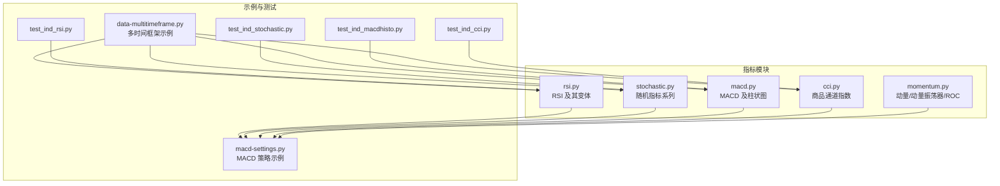
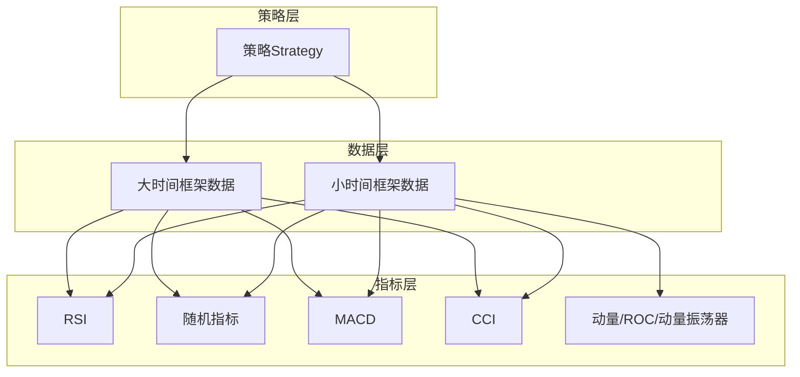
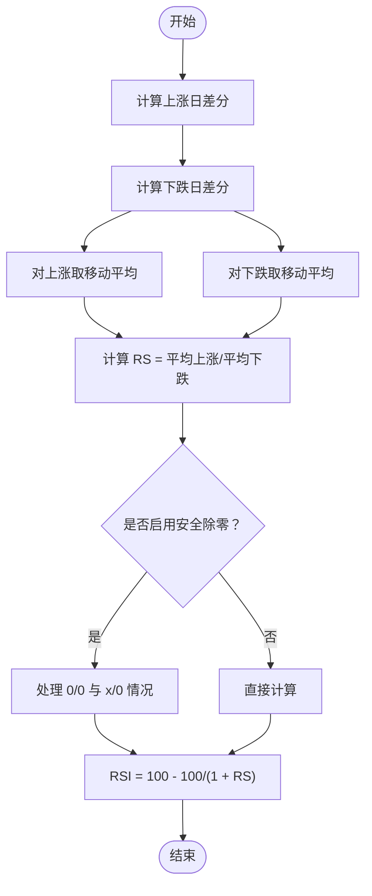
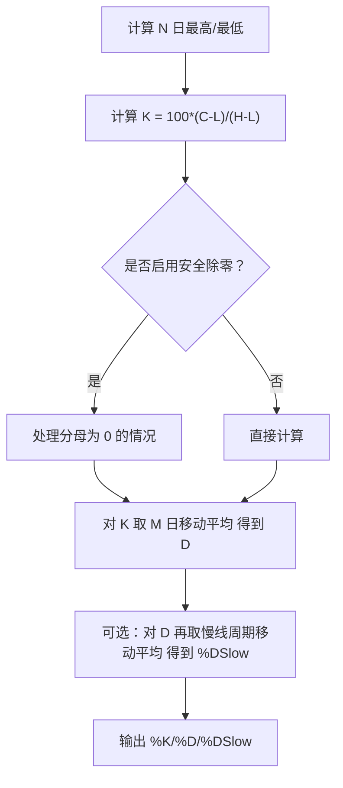
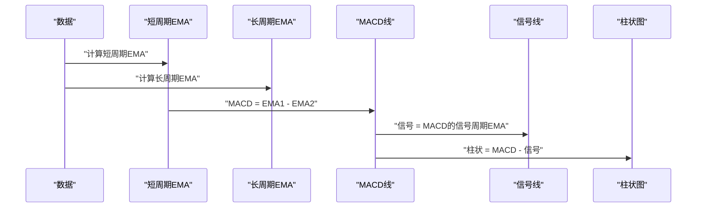
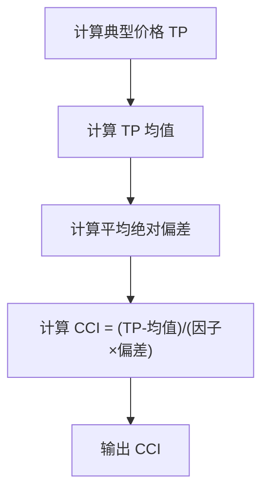
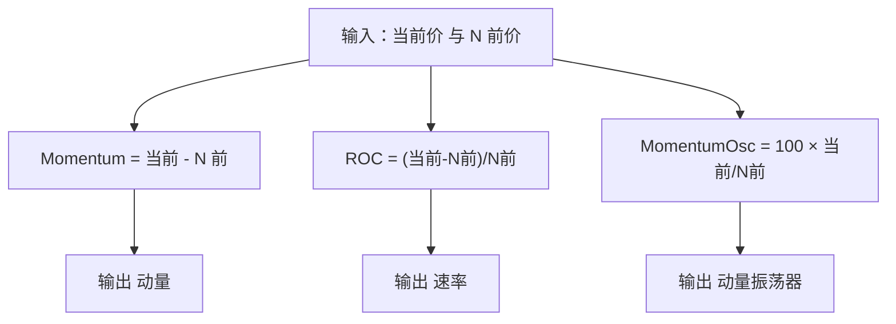
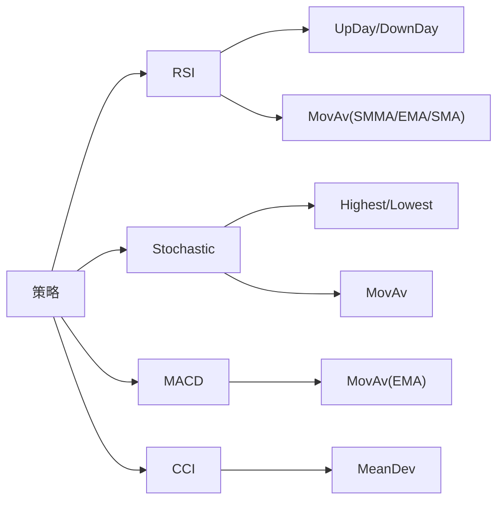

# 动量类指标

<cite>
**本文引用的文件**
- [rsi.py](file://backtrader/indicators/rsi.py)
- [stochastic.py](file://backtrader/indicators/stochastic.py)
- [macd.py](file://backtrader/indicators/macd.py)
- [cci.py](file://backtrader/indicators/cci.py)
- [momentum.py](file://backtrader/indicators/momentum.py)
- [macd-settings.py](file://samples/macd-settings/macd-settings.py)
- [data-multitimeframe.py](file://samples/data-multitimeframe/data-multitimeframe.py)
- [test_ind_rsi.py](file://tests/test_ind_rsi.py)
- [test_ind_stochastic.py](file://tests/test_ind_stochastic.py)
- [test_ind_macdhisto.py](file://tests/test_ind_macdhisto.py)
- [test_ind_cci.py](file://tests/test_ind_cci.py)
</cite>

## 目录
1. [引言](#引言)
2. [项目结构](#项目结构)
3. [核心组件](#核心组件)
4. [架构总览](#架构总览)
5. [详细组件分析](#详细组件分析)
6. [依赖关系分析](#依赖关系分析)
7. [性能考量](#性能考量)
8. [故障排查指南](#故障排查指南)
9. [结论](#结论)
10. [附录](#附录)

## 引言
本文件系统化梳理 Backtrader 中的动量类技术指标，重点覆盖以下内容：
- 相对强弱指数（RSI）、随机指标（Stochastic）、MACD、商品通道指数（CCI）等动量指标的计算方法与实现要点
- 指标信号解读：超买超卖判断、背离现象识别、趋势确认
- 基于指标的交易策略构建：参数优化思路、多时间框架分析
- 不同市场条件下的表现差异与局限性说明

## 项目结构
Backtrader 将指标实现集中在 backtrader/indicators 目录下，每个指标以独立模块存在，并通过统一的 Indicator 基类进行扩展。示例与测试分别位于 samples 与 tests 目录，便于验证与演示。

图表来源
- [rsi.py](file://backtrader/indicators/rsi.py#L1-L233)
- [stochastic.py](file://backtrader/indicators/stochastic.py#L1-L149)
- [macd.py](file://backtrader/indicators/macd.py#L1-L85)
- [cci.py](file://backtrader/indicators/cci.py#L1-L71)
- [momentum.py](file://backtrader/indicators/momentum.py#L1-L127)
- [macd-settings.py](file://samples/macd-settings/macd-settings.py#L1-L290)
- [data-multitimeframe.py](file://samples/data-multitimeframe/data-multitimeframe.py#L1-L226)
- [test_ind_rsi.py](file://tests/test_ind_rsi.py#L1-L51)
- [test_ind_stochastic.py](file://tests/test_ind_stochastic.py#L1-L52)
- [test_ind_macdhisto.py](file://tests/test_ind_macdhisto.py#L1-L53)
- [test_ind_cci.py](file://tests/test_ind_cci.py#L1-L51)

章节来源
- [rsi.py](file://backtrader/indicators/rsi.py#L1-L233)
- [stochastic.py](file://backtrader/indicators/stochastic.py#L1-L149)
- [macd.py](file://backtrader/indicators/macd.py#L1-L85)
- [cci.py](file://backtrader/indicators/cci.py#L1-L71)
- [momentum.py](file://backtrader/indicators/momentum.py#L1-L127)
- [macd-settings.py](file://samples/macd-settings/macd-settings.py#L1-L290)
- [data-multitimeframe.py](file://samples/data-multitimeframe/data-multitimeframe.py#L1-L226)
- [test_ind_rsi.py](file://tests/test_ind_rsi.py#L1-L51)
- [test_ind_stochastic.py](file://tests/test_ind_stochastic.py#L1-L52)
- [test_ind_macdhisto.py](file://tests/test_ind_macdhisto.py#L1-L53)
- [test_ind_cci.py](file://tests/test_ind_cci.py#L1-L51)

## 核心组件
本节概述各动量指标的核心实现与关键参数，帮助快速定位到具体源码位置。

- 相对强弱指数（RSI）
  - 计算步骤：上涨/下跌日差分 → 平滑移动平均（默认 Wilder 平滑）→ RS 与 RSI 归一化
  - 关键参数：周期、平滑方式（SMMA/EMA/SMA）、上下轨、安全除零处理
  - 变体：RSI_Safe（默认安全除零）、RSI_SMA（SMA 平滑）、RSI_EMA（EMA 平滑）
  - 参考路径：[rsi.py](file://backtrader/indicators/rsi.py#L122-L233)

- 随机指标（Stochastic）
  - 计算步骤：最高/最低滚动窗口 → %K（未成熟随机值）→ %D（%K 的移动平均）
  - 关键参数：K 周期、%D 快线周期、%D 慢线周期、移动平均类型、上下轨、安全除零
  - 变体：StochasticFast、Stochastic（常规/慢速）、StochasticFull（显示 %DSlow）
  - 参考路径：[stochastic.py](file://backtrader/indicators/stochastic.py#L27-L149)

- MACD
  - 计算步骤：短/长周期指数移动平均 → 差值（MACD 线）→ 信号线（MACD 的移动平均）
  - 可选：MACD 柱状图（MACD - 信号）
  - 关键参数：短周期、长周期、信号周期、移动平均类型
  - 参考路径：[macd.py](file://backtrader/indicators/macd.py#L27-L85)

- 商品通道指数（CCI）
  - 计算步骤：典型价格（TP）→ TP 均值 → 平均绝对偏差 → CCI 标准化
  - 关键参数：周期、因子（通常约 0.015）、移动平均类型、上下轨
  - 参考路径：[cci.py](file://backtrader/indicators/cci.py#L27-L71)

- 动量相关指标（Momentum/ROC/MomentumOscillator）
  - 动量（Momentum）：当前价与 N 前价格之差
  - 速率（ROC）：（当前价 - N 前价格）/ N 前价格
  - 动量振荡器（MomentumOsc）：100 * 当前价 / N 前价格
  - 参考路径：[momentum.py](file://backtrader/indicators/momentum.py#L27-L127)

章节来源
- [rsi.py](file://backtrader/indicators/rsi.py#L122-L233)
- [stochastic.py](file://backtrader/indicators/stochastic.py#L27-L149)
- [macd.py](file://backtrader/indicators/macd.py#L27-L85)
- [cci.py](file://backtrader/indicators/cci.py#L27-L71)
- [momentum.py](file://backtrader/indicators/momentum.py#L27-L127)

## 架构总览
Backtrader 指标体系基于统一的 Indicator 基类，通过组合子指标（如 Highest/Lowest/MovAv/MeanDev）实现复杂公式。策略层通过 cerebro.run 调用，可同时接入多时间框架数据与多个指标。

图表来源
- [macd-settings.py](file://samples/macd-settings/macd-settings.py#L54-L131)
- [data-multitimeframe.py](file://samples/data-multitimeframe/data-multitimeframe.py#L34-L47)
- [rsi.py](file://backtrader/indicators/rsi.py#L122-L233)
- [stochastic.py](file://backtrader/indicators/stochastic.py#L27-L149)
- [macd.py](file://backtrader/indicators/macd.py#L27-L85)
- [cci.py](file://backtrader/indicators/cci.py#L27-L71)
- [momentum.py](file://backtrader/indicators/momentum.py#L27-L127)

## 详细组件分析

### 相对强弱指数（RSI）
- 计算流程
  - 上涨/下跌日差分：比较今日收盘与昨日收盘，取正值或负值
  - 平滑移动平均：默认使用 Wilder 平滑（SMMA），也可选择 SMA/EMA
  - RS 与 RSI：RS = 平均上涨/平均下跌；RSI = 100 - 100/(1 + RS)
  - 安全除零：当 MADOWN 接近 0 或 UP/DOWN 同时为 0 时，可配置安全值
- 信号与应用
  - 超买/超卖：通常以 70/30 为阈值；在震荡市中更有效
  - 背离：价格创新高而 RSI 不创新高（顶背离），可能预示反转
  - 趋势确认：在上升趋势中，RSI 偏向 50 以上区域运行
- 参数优化建议
  - 周期：短期（如 7-14）适合捕捉短期波动；长期（如 14-21）更稳健
  - 平滑：SMMA 对极端值更稳健；EMA 更敏感；SMA 最简单
  - 上下轨：结合市场波动率调整阈值（如 75/25 或 65/35）
- 代码参考路径
  - [rsi.py](file://backtrader/indicators/rsi.py#L122-L233)

图表来源
- [rsi.py](file://backtrader/indicators/rsi.py#L178-L191)

章节来源
- [rsi.py](file://backtrader/indicators/rsi.py#L122-L233)

### 随机指标（Stochastic）
- 计算流程
  - %K：K 线 = 100 * (收盘 - 最低)/(最高 - 最低)，其中最高/最低为 N 日滚动极值
  - %D：%K 的 M 日移动平均（快线）或进一步移动平均（慢线）
  - 变体：Fast（仅一层）、Slow（常规/慢速）、Full（额外显示 %DSlow）
- 信号与应用
  - 超买/超卖：常用 80/20 阈值；在盘整中较有效
  - 交叉：%K 上穿 %D 可视为看涨信号；下穿为看跌信号
  - 背离：价格与 %K/%D 走向不一致，提示潜在反转
- 参数优化建议
  - K 周期：7-14；%D 快线周期：3；%D 慢线周期：3
  - 移动平均类型：Simple；或根据需要选择 EMA
- 代码参考路径
  - [stochastic.py](file://backtrader/indicators/stochastic.py#L27-L149)

图表来源
- [stochastic.py](file://backtrader/indicators/stochastic.py#L44-L55)

章节来源
- [stochastic.py](file://backtrader/indicators/stochastic.py#L27-L149)

### MACD
- 计算流程
  - MACD 线：短周期 EMA - 长周期 EMA
  - 信号线：MACD 线的信号周期 EMA
  - 柱状图：MACD - 信号
- 信号与应用
  - 金叉/死叉：MACD 线上穿/下穿信号线
  - 零轴穿越：反映趋势方向变化
  - 背离：价格与 MACD 走势相反，提示潜在反转
- 参数优化建议
  - 经典参数：12/26/9；也可尝试 8/21/5 或 21/55/13
  - 结合 ATR 设定止损距离，提高风险控制
- 代码参考路径
  - [macd.py](file://backtrader/indicators/macd.py#L27-L85)

图表来源
- [macd.py](file://backtrader/indicators/macd.py#L57-L64)

章节来源
- [macd.py](file://backtrader/indicators/macd.py#L27-L85)

### 商品通道指数（CCI）
- 计算流程
  - 典型价格 TP = (高 + 低 + 收)/3
  - TP 均值：周期 N 的移动平均
  - 平均绝对偏差：MeanDev(TP, TP均值)
  - CCI = (TP - TP均值)/(因子 × 平均绝对偏差)
- 信号与应用
  - 超买/超卖：常用 ±100 作为阈值
  - 趋势确认：CCI 在零轴上方/下方持续运行
  - 反转信号：CCI 穿越零轴或极端值回撤
- 参数优化建议
  - 周期：10-20；因子：约 0.015（标准化常数）
  - 结合波动率自适应调整阈值
- 代码参考路径
  - [cci.py](file://backtrader/indicators/cci.py#L27-L71)

图表来源
- [cci.py](file://backtrader/indicators/cci.py#L61-L69)

章节来源
- [cci.py](file://backtrader/indicators/cci.py#L27-L71)

### 动量相关指标（Momentum/ROC/MomentumOscillator）
- 动量（Momentum）：当前价 - N 前价，衡量价格变化幅度
- 速率（ROC）：（当前价 - N 前价）/ N 前价，衡量变化比率
- 动量振荡器（MomentumOsc）：100 × 当前价/N 前价，归一化到 100 附近
- 应用场景：趋势跟踪、超买超卖辅助、与价格行为联动分析
- 代码参考路径
  - [momentum.py](file://backtrader/indicators/momentum.py#L27-L127)

图表来源
- [momentum.py](file://backtrader/indicators/momentum.py#L43-L76)

章节来源
- [momentum.py](file://backtrader/indicators/momentum.py#L27-L127)

## 依赖关系分析
- 指标内部依赖
  - RSI 依赖 UpDay/DownDay 与移动平均（默认 SMMA）
  - 随机指标依赖 Highest/Lowest 与移动平均
  - MACD 依赖移动平均（默认 EMA）
  - CCI 依赖 MeanDev（平均绝对偏差）
- 策略与示例
  - MACD 示例策略结合 CrossOver、ATR、SMA 实现趋势过滤与止损管理
  - 多时间框架示例展示小/大时间框架数据并行接入与指标叠加

图表来源
- [rsi.py](file://backtrader/indicators/rsi.py#L178-L183)
- [stochastic.py](file://backtrader/indicators/stochastic.py#L44-L53)
- [macd.py](file://backtrader/indicators/macd.py#L59-L63)
- [cci.py](file://backtrader/indicators/cci.py#L62-L68)
- [macd-settings.py](file://samples/macd-settings/macd-settings.py#L92-L107)

章节来源
- [rsi.py](file://backtrader/indicators/rsi.py#L178-L183)
- [stochastic.py](file://backtrader/indicators/stochastic.py#L44-L53)
- [macd.py](file://backtrader/indicators/macd.py#L59-L63)
- [cci.py](file://backtrader/indicators/cci.py#L62-L68)
- [macd-settings.py](file://samples/macd-settings/macd-settings.py#L92-L107)

## 性能考量
- 计算复杂度
  - RSI/STO/CCI/ROC/MOM：单步滚动窗口与移动平均，时间复杂度 O(N)；窗口越大，内存占用越高
  - MACD：双指数平滑，计算开销略高于 SMA，但通常可接受
- 参数选择对性能的影响
  - 周期过长会放大延迟，过短则噪声增强
  - 移动平均类型影响平滑程度与响应速度
- 多时间框架
  - 数据重采样/回放会增加内存与计算负担，需按需启用
  - 指标在多时间框架上的叠加有助于过滤噪音与确认趋势

## 故障排查指南
- 除零与数值异常
  - RSI：启用 safediv 可避免 0/0 与 x/0；设置 safehigh/safelow 控制异常值
  - 随机指标：启用 safediv 并设定 safezero，避免分母为 0 导致 NaN
  - 参考路径：[rsi.py](file://backtrader/indicators/rsi.py#L183-L189)、[stochastic.py](file://backtrader/indicators/stochastic.py#L49-L52)
- 测试验证
  - 使用测试脚本比对指标输出，确保实现正确性
  - 参考路径：[test_ind_rsi.py](file://tests/test_ind_rsi.py#L30-L36)、[test_ind_stochastic.py](file://tests/test_ind_stochastic.py#L30-L36)、[test_ind_macdhisto.py](file://tests/test_ind_macdhisto.py#L30-L37)、[test_ind_cci.py](file://tests/test_ind_cci.py#L30-L35)

章节来源
- [rsi.py](file://backtrader/indicators/rsi.py#L183-L189)
- [stochastic.py](file://backtrader/indicators/stochastic.py#L49-L52)
- [test_ind_rsi.py](file://tests/test_ind_rsi.py#L30-L36)
- [test_ind_stochastic.py](file://tests/test_ind_stochastic.py#L30-L36)
- [test_ind_macdhisto.py](file://tests/test_ind_macdhisto.py#L30-L37)
- [test_ind_cci.py](file://tests/test_ind_cci.py#L30-L35)

## 结论
- RSI、随机指标、MACD、CCI 均以“动量”为核心思想，从不同维度刻画价格驱动力
- 在震荡市中，超买超卖阈值与背离信号更具有效性；在趋势市中，应结合趋势过滤（如均线方向）与止损管理
- 参数优化与多时间框架分析是提升策略鲁棒性的关键手段
- Backtrader 提供了清晰的指标实现与示例，便于快速搭建与验证策略

## 附录
- 交易策略构建要点
  - RSI：结合趋势（均线）过滤，避免在单边趋势中逆势做空/做多
  - 随机指标：关注 %K/%D 交叉与背离，配合成交量或波动率确认
  - MACD：金叉/死叉结合零轴与柱状图变化，辅以 ATR 止损
  - CCI：在突破零轴后观察持续性，结合支撑阻力位
- 多时间框架实践
  - 小时间框架用于入场，大时间框架用于趋势确认与过滤
  - 示例参考：[data-multitimeframe.py](file://samples/data-multitimeframe/data-multitimeframe.py#L34-L47)
- 示例策略参考
  - MACD 策略（含 CrossOver、ATR、均线方向过滤）：[macd-settings.py](file://samples/macd-settings/macd-settings.py#L54-L131)