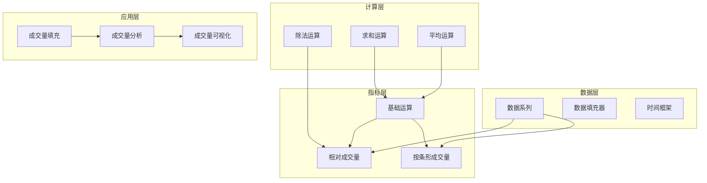
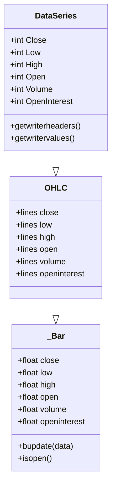
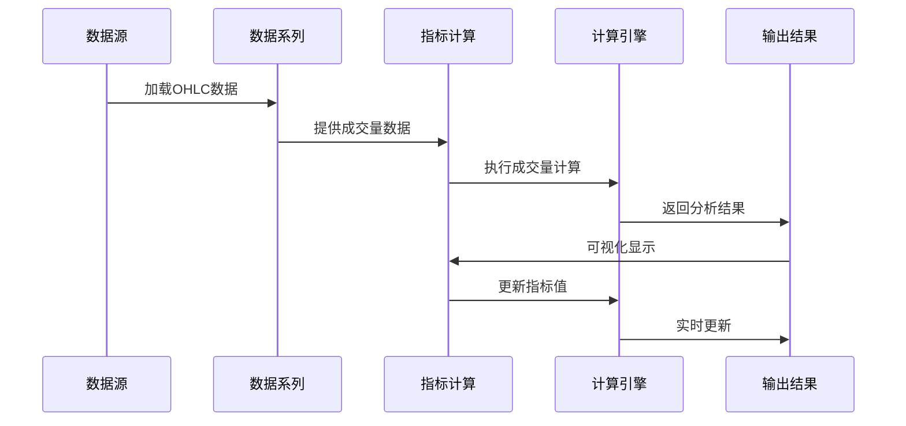
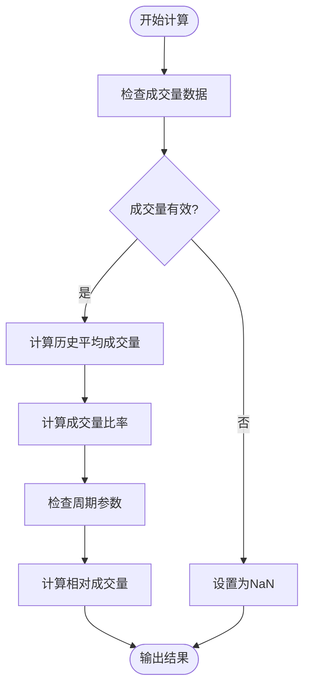
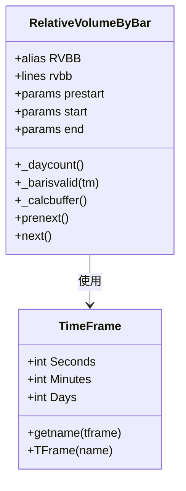
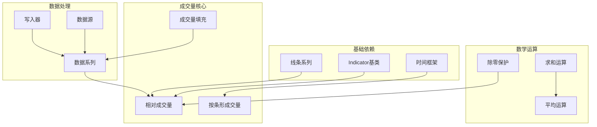

# 成交量类指标

<cite>
**本文档引用的文件**
- [relativevolume.py](file://samples/data-filler/relativevolume.py)
- [relvolbybar.py](file://samples/relative-volume/relvolbybar.py)
- [volumefilling.py](file://samples/volumefilling/volumefilling.py)
- [basicops.py](file://backtrader/indicators/basicops.py)
- [functions.py](file://backtrader/functions.py)
- [indicator.py](file://backtrader/indicator.py)
- [dataseries.py](file://backtrader/dataseries.py)
- [2006-volume-day-001.txt](file://datas/2006-volume-day-001.txt)
- [2006-01-02-volume-min-001.txt](file://datas/2006-01-02-volume-min-001.txt)
</cite>

## 目录
1. [引言](#引言)
2. [项目结构](#项目结构)
3. [核心组件](#核心组件)
4. [架构概览](#架构概览)
5. [详细组件分析](#详细组件分析)
6. [依赖关系分析](#依赖关系分析)
7. [性能考虑](#性能考虑)
8. [故障排除指南](#故障排除指南)
9. [结论](#结论)

## 引言

成交量类技术指标是技术分析中的重要工具，用于衡量市场参与者对特定价格水平的认同程度和交易活跃度。本文档深入探讨成交量指标在确认价格突破和趋势延续中的作用，解释成交量与价格关系的分析方法，包括放量上涨、缩量下跌等典型形态，并提供成交量指标在不同市场阶段的应用策略。

Backtrader框架提供了完整的成交量分析基础设施，包括基础数据结构、指标计算引擎和可视化工具。通过相对成交量指标、成交量填充机制和成交量分布分析，用户可以构建全面的成交量分析系统。

## 项目结构

Backtrader的成交量分析功能分布在多个模块中，形成了完整的分析生态系统：

**图表来源**
- [dataseries.py](file://backtrader/dataseries.py#L60-L110)
- [relativevolume.py](file://samples/data-filler/relativevolume.py#L29-L51)
- [relvolbybar.py](file://samples/relative-volume/relvolbybar.py#L32-L122)

**章节来源**
- [dataseries.py](file://backtrader/dataseries.py#L60-L110)
- [relativevolume.py](file://samples/data-filler/relativevolume.py#L29-L51)
- [relvolbybar.py](file://samples/relative-volume/relvolbybar.py#L32-L122)

## 核心组件

### 数据系列与成交量结构

Backtrader的核心数据结构为OHLC数据系列，其中包含成交量字段。每个数据条目都包含开盘价、最高价、最低价、收盘价和成交量信息。

**图表来源**
- [dataseries.py](file://backtrader/dataseries.py#L60-L110)
- [dataseries.py](file://backtrader/dataseries.py#L107-L176)

### 相对成交量指标

相对成交量指标是成交量分析的核心工具，用于比较当前成交量与历史平均水平的关系。

**章节来源**
- [relativevolume.py](file://samples/data-filler/relativevolume.py#L29-L51)
- [functions.py](file://backtrader/functions.py#L43-L74)

## 架构概览

Backtrader的成交量分析架构采用分层设计，从底层数据结构到上层分析工具形成完整的处理链：

**图表来源**
- [dataseries.py](file://backtrader/dataseries.py#L60-L110)
- [indicator.py](file://backtrader/indicator.py#L90-L165)
- [basicops.py](file://backtrader/indicators/basicops.py#L161-L173)

## 详细组件分析

### 相对成交量指标实现

相对成交量指标通过比较当前成交量与历史成交量平均水平来识别异常交易活动。

**图表来源**
- [relativevolume.py](file://samples/data-filler/relativevolume.py#L38-L50)

相对成交量的计算逻辑体现了Backtrader对异常值处理的严谨性：

1. **空值处理**：当成交量缺失时，使用`volisnan`参数决定是否返回NaN
2. **除零保护**：通过`DivByZero`类确保除法运算的安全性
3. **周期计算**：支持可配置的计算周期，默认20日

**章节来源**
- [relativevolume.py](file://samples/data-filler/relativevolume.py#L29-L51)
- [functions.py](file://backtrader/functions.py#L43-L74)

### 按条形成交量分析

按条形成交量分析提供了更精细的成交量分布视图，特别适用于日内数据分析。

**图表来源**
- [relvolbybar.py](file://samples/relative-volume/relvolbybar.py#L32-L122)

按条形成交量分析的关键特性：

1. **时间窗口过滤**：支持指定交易时间段内的成交量分析
2. **跨日对比**：通过`pvol`和`vcount`字典实现跨交易日的成交量对比
3. **缓冲区管理**：自动计算最小周期需求，确保数据完整性

**章节来源**
- [relvolbybar.py](file://samples/relative-volume/relvolbybar.py#L32-L122)

### 基础成交量运算

Backtrader提供了丰富的基础成交量运算函数，支撑复杂的成交量分析需求。

**章节来源**
- [basicops.py](file://backtrader/indicators/basicops.py#L161-L173)
- [basicops.py](file://backtrader/indicators/basicops.py#L341-L365)

## 依赖关系分析

成交量分析系统的依赖关系展现了清晰的层次结构：

**图表来源**
- [indicator.py](file://backtrader/indicator.py#L90-L165)
- [functions.py](file://backtrader/functions.py#L43-L74)
- [dataseries.py](file://backtrader/dataseries.py#L60-L110)

**章节来源**
- [indicator.py](file://backtrader/indicator.py#L90-L165)
- [functions.py](file://backtrader/functions.py#L43-L74)
- [dataseries.py](file://backtrader/dataseries.py#L60-L110)

## 性能考虑

成交量分析的性能优化主要体现在以下几个方面：

### 内存管理
- **数据缓存**：使用`_icache`机制避免重复创建相同的指标实例
- **批量计算**：通过`once`方法支持批量数据处理，减少循环开销
- **最小周期**：智能计算指标所需的最小数据周期，避免不必要的计算

### 计算效率
- **向量化操作**：利用数学运算库进行高效的批量计算
- **条件优化**：在指标计算前进行数据有效性检查，跳过无效计算
- **增量更新**：支持增量计算模式，只对新数据进行重新计算

## 故障排除指南

### 常见问题及解决方案

**成交量数据缺失**
- 症状：指标返回NaN或错误值
- 解决方案：检查数据源的成交量字段，确认数据完整性

**计算结果异常**
- 症状：相对成交量值异常高或低
- 排查步骤：
  1. 验证计算周期设置是否合理
  2. 检查是否存在极端成交量异常值
  3. 确认数据的时间顺序正确性

**内存使用过高**
- 症状：长时间运行后内存占用持续增长
- 解决方案：定期清理不需要的历史数据，优化指标参数设置

**章节来源**
- [relativevolume.py](file://samples/data-filler/relativevolume.py#L38-L50)
- [functions.py](file://backtrader/functions.py#L43-L74)

## 结论

Backtrader的成交量分析系统提供了完整的技术指标解决方案，涵盖了从基础数据结构到高级分析工具的各个方面。通过相对成交量指标、按条形成交量分析和成交量填充机制，用户可以构建全面的成交量分析系统。

该系统的主要优势包括：
- **模块化设计**：清晰的层次结构便于扩展和维护
- **性能优化**：高效的计算算法和内存管理机制
- **灵活性**：支持自定义指标和参数配置
- **可靠性**：完善的错误处理和数据验证机制

成交量类指标在确认价格突破和趋势延续中发挥着重要作用，通过合理的参数设置和分析方法，可以显著提高交易决策的质量和准确性。