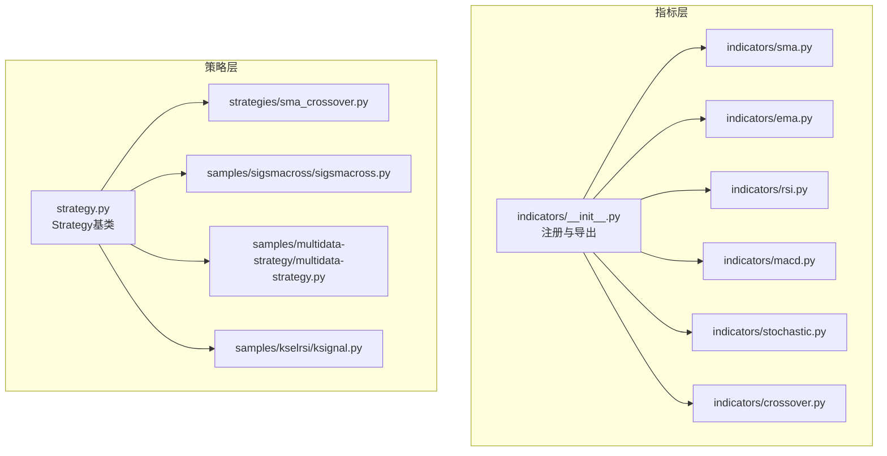
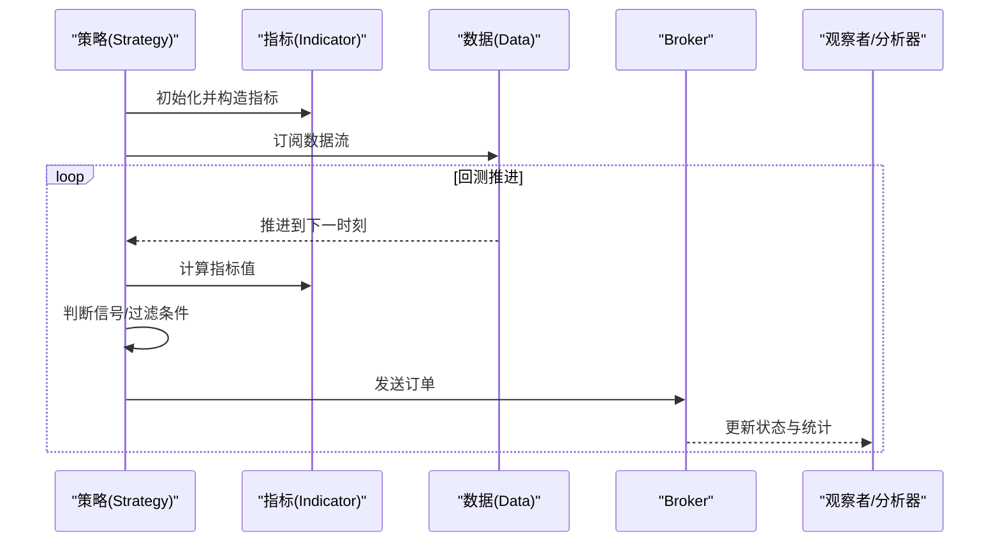
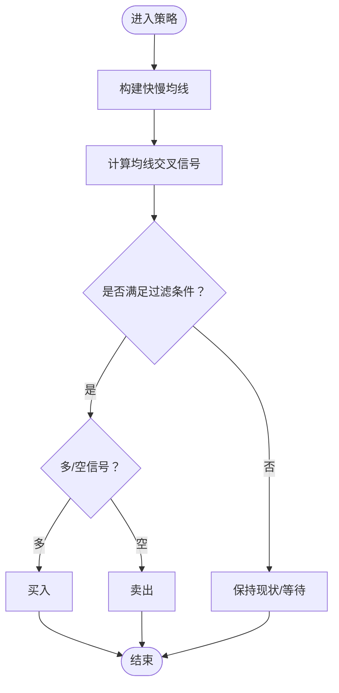
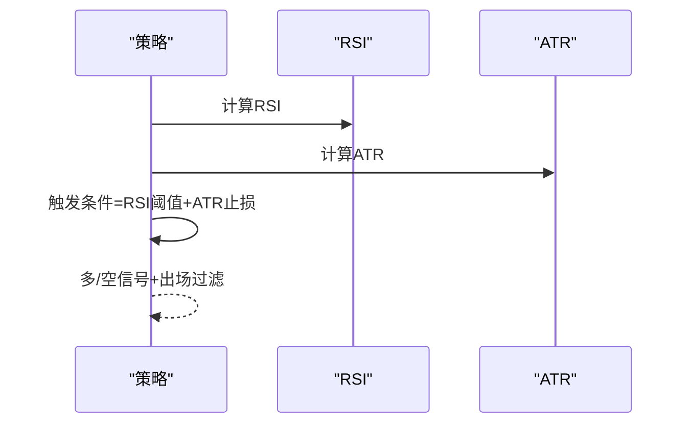
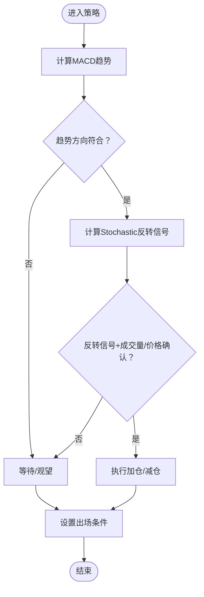
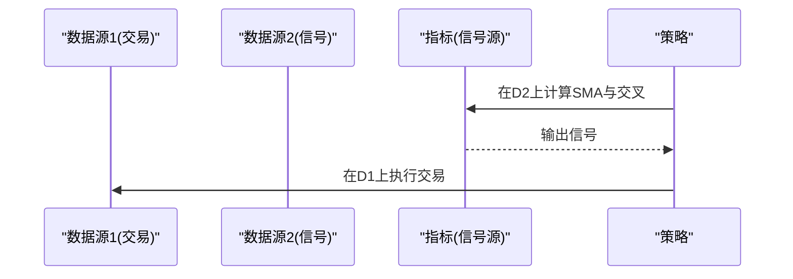
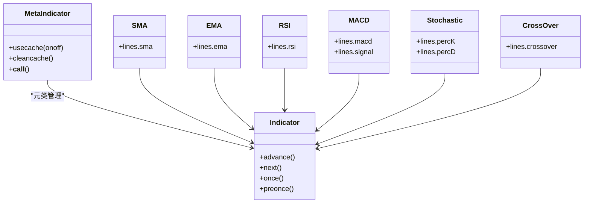

# 指标组合与应用

<cite>
**本文引用的文件**   
- [backtrader/indicator.py](file://backtrader/indicator.py)
- [backtrader/strategy.py](file://backtrader/strategy.py)
- [backtrader/indicators/__init__.py](file://backtrader/indicators/__init__.py)
- [backtrader/indicators/sma.py](file://backtrader/indicators/sma.py)
- [backtrader/indicators/ema.py](file://backtrader/indicators/ema.py)
- [backtrader/indicators/rsi.py](file://backtrader/indicators/rsi.py)
- [backtrader/indicators/macd.py](file://backtrader/indicators/macd.py)
- [backtrader/indicators/stochastic.py](file://backtrader/indicators/stochastic.py)
- [backtrader/indicators/crossover.py](file://backtrader/indicators/crossover.py)
- [backtrader/strategies/sma_crossover.py](file://backtrader/strategies/sma_crossover.py)
- [samples/sigsmacross/sigsmacross.py](file://samples/sigsmacross/sigsmacross.py)
- [samples/multidata-strategy/multidata-strategy.py](file://samples/multidata-strategy/multidata-strategy.py)
- [samples/kselrsi/ksignal.py](file://samples/kselrsi/ksignal.py)
</cite>

## 目录
1. [引言](#引言)
2. [项目结构](#项目结构)
3. [核心组件](#核心组件)
4. [架构总览](#架构总览)
5. [详细组件分析](#详细组件分析)
6. [依赖分析](#依赖分析)
7. [性能考虑](#性能考虑)
8. [故障排查指南](#故障排查指南)
9. [结论](#结论)
10. [附录](#附录)

## 引言
本指南围绕“技术指标组合应用”展开，目标是帮助读者在Backtrader框架中将多个技术指标协同使用，以提升交易信号的准确性与稳健性。文档从指标体系、策略构建、信号过滤与多重确认、参数协调与优化、到自定义复合指标开发与最佳实践进行系统讲解，并辅以仓库中的真实样例路径，便于直接对照学习。

## 项目结构
Backtrader将指标、策略、数据与回测引擎解耦，形成清晰的层次化结构：
- 指标层：位于 backtrader/indicators，提供大量内置指标（均线、动量、振荡器、波动率等），并通过统一的 Indicator 基类实现生命周期管理与缓存控制。
- 策略层：位于 backtrader/strategies 与 samples，展示如何在策略中组合指标、生成信号并执行订单。
- 回测引擎：位于 backtrader 下的 cerebro、broker、observer 等模块，负责数据推进、信号执行与收益统计。

图表来源
- [backtrader/indicators/__init__.py](file://backtrader/indicators/__init__.py#L24-L91)
- [backtrader/strategy.py](file://backtrader/strategy.py#L107-L120)
- [backtrader/indicators/sma.py](file://backtrader/indicators/sma.py#L27-L46)
- [backtrader/indicators/ema.py](file://backtrader/indicators/ema.py#L27-L56)
- [backtrader/indicators/rsi.py](file://backtrader/indicators/rsi.py#L122-L192)
- [backtrader/indicators/macd.py](file://backtrader/indicators/macd.py#L27-L64)
- [backtrader/indicators/stochastic.py](file://backtrader/indicators/stochastic.py#L27-L56)
- [backtrader/indicators/crossover.py](file://backtrader/indicators/crossover.py#L112-L139)
- [backtrader/strategies/sma_crossover.py](file://backtrader/strategies/sma_crossover.py#L29-L75)
- [samples/sigsmacross/sigsmacross.py](file://samples/sigsmacross/sigsmacross.py#L30-L51)
- [samples/multidata-strategy/multidata-strategy.py](file://samples/multidata-strategy/multidata-strategy.py#L33-L114)
- [samples/kselrsi/ksignal.py](file://samples/kselrsi/ksignal.py#L30-L60)

章节来源
- [backtrader/indicators/__init__.py](file://backtrader/indicators/__init__.py#L24-L91)
- [backtrader/strategy.py](file://backtrader/strategy.py#L107-L120)

## 核心组件
- 指标基类与元类
  - 指标通过统一的 Indicator 基类实现生命周期推进（advance、next、once 等），并由 MetaIndicator 提供对象缓存与自动注册能力，避免重复实例化，提升性能。
- 策略基类
  - Strategy 提供信号管理、订单跟踪、内存节省模式、最小周期计算等能力，支持多数据源与多时间框架下的同步推进。
- 内置指标族
  - 均线族：SMA、EMA 等，用于趋势识别与交叉信号。
  - 动量与振荡器：RSI、MACD、Stochastic 等，用于动量强度与超买超卖判断。
  - 组合工具：Crossover/CrossUp/CrossDown，用于多输入指标的信号判定。

章节来源
- [backtrader/indicator.py](file://backtrader/indicator.py#L90-L137)
- [backtrader/strategy.py](file://backtrader/strategy.py#L107-L200)
- [backtrader/indicators/sma.py](file://backtrader/indicators/sma.py#L27-L46)
- [backtrader/indicators/ema.py](file://backtrader/indicators/ema.py#L27-L56)
- [backtrader/indicators/rsi.py](file://backtrader/indicators/rsi.py#L122-L192)
- [backtrader/indicators/macd.py](file://backtrader/indicators/macd.py#L27-L64)
- [backtrader/indicators/stochastic.py](file://backtrader/indicators/stochastic.py#L27-L56)
- [backtrader/indicators/crossover.py](file://backtrader/indicators/crossover.py#L112-L139)

## 架构总览
下图展示了指标与策略在回测引擎中的交互流程：策略在初始化阶段构造指标与信号，回测推进时根据信号触发订单，Broker 执行订单并更新观察者与分析器。

图表来源
- [backtrader/strategy.py](file://backtrader/strategy.py#L107-L120)
- [backtrader/indicator.py](file://backtrader/indicator.py#L90-L137)

## 详细组件分析

### 均线系统与交叉策略
- 组合思路
  - 使用短期与长期均线（如 SMA 或 EMA）计算交叉信号，作为趋势方向的主确认。
  - 可叠加动量或波动率指标进行过滤，降低假突破概率。
- 实战要点
  - 参数选择：短周期与长周期应匹配时间框架；均线类型可按流动性与噪声偏好选择。
  - 过滤方法：加入 RSI 超买超卖阈值、MACD 零轴方向或柱状图形态等。
- 样例参考
  - 简单均值交叉策略与信号策略样例展示了如何用 CrossOver 生成买卖信号并执行下单。

图表来源
- [backtrader/strategies/sma_crossover.py](file://backtrader/strategies/sma_crossover.py#L29-L75)
- [samples/sigsmacross/sigsmacross.py](file://samples/sigsmacross/sigsmacross.py#L30-L51)
- [backtrader/indicators/crossover.py](file://backtrader/indicators/crossover.py#L112-L139)
- [backtrader/indicators/sma.py](file://backtrader/indicators/sma.py#L27-L46)
- [backtrader/indicators/ema.py](file://backtrader/indicators/ema.py#L27-L56)

章节来源
- [backtrader/strategies/sma_crossover.py](file://backtrader/strategies/sma_crossover.py#L29-L75)
- [samples/sigsmacross/sigsmacross.py](file://samples/sigsmacross/sigsmacross.py#L30-L51)
- [backtrader/indicators/crossover.py](file://backtrader/indicators/crossover.py#L112-L139)
- [backtrader/indicators/sma.py](file://backtrader/indicators/sma.py#L27-L46)
- [backtrader/indicators/ema.py](file://backtrader/indicators/ema.py#L27-L56)

### 动量+波动率组合（RSI + 波动率）
- 组合思路
  - RSI 用于识别超买超卖与背离，作为入场时机的辅助信号。
  - 波动率（如 ATR）用于设定止损/止盈幅度与仓位规模，控制风险暴露。
- 实战要点
  - RSI 参数需与市场波动性匹配；在震荡市与趋势市采用不同阈值。
  - 波动率指标可与价格突破结合，避免在窄幅震荡中频繁交易。
- 样例参考
  - k信号样例展示了如何基于 RSI 的上轨/下轨与中轴进行多空信号添加与出场过滤。

图表来源
- [samples/kselrsi/ksignal.py](file://samples/kselrsi/ksignal.py#L30-L60)
- [backtrader/indicators/rsi.py](file://backtrader/indicators/rsi.py#L122-L192)

章节来源
- [samples/kselrsi/ksignal.py](file://samples/kselrsi/ksignal.py#L30-L60)
- [backtrader/indicators/rsi.py](file://backtrader/indicators/rsi.py#L122-L192)

### 趋势+反转指标搭配（MACD + 随机震荡）
- 组合思路
  - MACD 用于趋势方向确认（零轴与柱状图形态）。
  - 随机震荡（Stochastic）用于捕捉短期超买超卖与反转信号，作为加仓/减仓的时机补充。
- 实战要点
  - 趋势优先：仅在 MACD 方向一致时参与反转交易，避免逆势操作。
  - 死/金叉与超买超卖需结合成交量或价格行为确认，减少假信号。
- 样例参考
  - MACD 与 Stochastic 指标文件展示了各自的计算逻辑与绘图配置，可直接用于策略组合。

图表来源
- [backtrader/indicators/macd.py](file://backtrader/indicators/macd.py#L27-L64)
- [backtrader/indicators/stochastic.py](file://backtrader/indicators/stochastic.py#L27-L56)

章节来源
- [backtrader/indicators/macd.py](file://backtrader/indicators/macd.py#L27-L64)
- [backtrader/indicators/stochastic.py](file://backtrader/indicators/stochastic.py#L27-L56)

### 多数据源与多时间框架下的指标组合
- 组合思路
  - 使用一个数据源生成信号，另一个数据源执行交易，适合相关性较强的数据对（如商品与对应ETF）。
  - 多时间框架下，可在更高周期进行趋势过滤，在更低周期寻找入场点。
- 实战要点
  - 对齐与同步：确保不同数据源的时间步进与对齐策略正确。
  - 参数隔离：不同时间框架的指标参数需独立优化。
- 样例参考
  - 多数据策略样例展示了如何在第二个数据源上计算 SMA 并用 CrossOver 生成信号，在第一个数据源上执行交易。

图表来源
- [samples/multidata-strategy/multidata-strategy.py](file://samples/multidata-strategy/multidata-strategy.py#L33-L114)
- [backtrader/indicators/sma.py](file://backtrader/indicators/sma.py#L27-L46)
- [backtrader/indicators/crossover.py](file://backtrader/indicators/crossover.py#L112-L139)

章节来源
- [samples/multidata-strategy/multidata-strategy.py](file://samples/multidata-strategy/multidata-strategy.py#L33-L114)
- [backtrader/indicators/sma.py](file://backtrader/indicators/sma.py#L27-L46)
- [backtrader/indicators/crossover.py](file://backtrader/indicators/crossover.py#L112-L139)

### 指标参数的协调设置与优化
- 协调原则
  - 时间框架一致性：高/低频指标参数需与采样频率匹配。
  - 信号一致性：交叉类指标的快慢周期与过滤指标的周期需相互印证。
  - 市场环境适配：震荡/趋势环境下采用不同参数集与阈值。
- 优化方法
  - 穿透测试：固定参数组合在历史区间内回测，评估胜率与盈亏比。
  - 参数网格搜索：对关键参数（如周期、阈值、移动平均类型）进行组合优化。
  - 风险约束：在优化中加入最大回撤、最大连续亏损等约束。
- 参考样例
  - 均线交叉策略与信号策略样例展示了参数注入与运行方式，可直接用于参数扫描。

章节来源
- [backtrader/strategies/sma_crossover.py](file://backtrader/strategies/sma_crossover.py#L53-L60)
- [samples/sigsmacross/sigsmacross.py](file://samples/sigsmacross/sigsmacross.py#L73-L105)

### 自定义复合指标的开发方法与最佳实践
- 开发步骤
  - 明确输入输出：确定所需数据源与输出线条名称。
  - 组合已有指标：优先复用现有指标（如均线、动量、振荡器）进行组合。
  - 生命周期管理：遵循 Indicator 基类的 next/once/preonce 等推进机制，确保缓存与对齐正确。
  - 绘图与标签：合理设置 plotinfo/plotlines，便于可视化与调试。
- 最佳实践
  - 输入校验：对空数据、除零等情况进行保护。
  - 性能优化：启用对象缓存（MetaIndicator.usecache），避免重复实例化。
  - 文档化：为指标提供 alias 与 plotlabel，提升可读性与可维护性。
- 参考样例
  - 指标基类与元类展示了对象缓存、自动注册与推进流程，可作为自定义指标的模板。

图表来源
- [backtrader/indicator.py](file://backtrader/indicator.py#L32-L88)
- [backtrader/indicators/sma.py](file://backtrader/indicators/sma.py#L27-L46)
- [backtrader/indicators/ema.py](file://backtrader/indicators/ema.py#L27-L56)
- [backtrader/indicators/rsi.py](file://backtrader/indicators/rsi.py#L122-L192)
- [backtrader/indicators/macd.py](file://backtrader/indicators/macd.py#L27-L64)
- [backtrader/indicators/stochastic.py](file://backtrader/indicators/stochastic.py#L27-L56)
- [backtrader/indicators/crossover.py](file://backtrader/indicators/crossover.py#L112-L139)

章节来源
- [backtrader/indicator.py](file://backtrader/indicator.py#L32-L88)
- [backtrader/indicators/sma.py](file://backtrader/indicators/sma.py#L27-L46)
- [backtrader/indicators/ema.py](file://backtrader/indicators/ema.py#L27-L56)
- [backtrader/indicators/rsi.py](file://backtrader/indicators/rsi.py#L122-L192)
- [backtrader/indicators/macd.py](file://backtrader/indicators/macd.py#L27-L64)
- [backtrader/indicators/stochastic.py](file://backtrader/indicators/stochastic.py#L27-L56)
- [backtrader/indicators/crossover.py](file://backtrader/indicators/crossover.py#L112-L139)

## 依赖分析
- 指标注册与导出
  - indicators/__init__.py 将各类指标模块导入并导出，形成统一入口，便于策略侧按需引用。
- 策略与指标的耦合
  - 策略通过 Indicator 基类与推进机制与指标解耦，指标内部通过 MetaIndicator 控制对象缓存，降低重复开销。
- 数据与时间对齐
  - 多数据源与多时间框架场景下，策略基类负责最小周期计算与推进同步，确保各指标在正确时点被调用。

图表来源
- [backtrader/indicators/__init__.py](file://backtrader/indicators/__init__.py#L24-L91)
- [backtrader/strategy.py](file://backtrader/strategy.py#L107-L120)
- [backtrader/indicator.py](file://backtrader/indicator.py#L32-L88)

章节来源
- [backtrader/indicators/__init__.py](file://backtrader/indicators/__init__.py#L24-L91)
- [backtrader/strategy.py](file://backtrader/strategy.py#L107-L120)
- [backtrader/indicator.py](file://backtrader/indicator.py#L32-L88)

## 性能考虑
- 对象缓存
  - 启用指标对象缓存可显著减少重复实例化带来的开销，尤其在参数扫描与多指标组合场景。
- 内存节省
  - 策略提供 qbuffer 接口，支持按需释放中间值，降低大样本回测的内存占用。
- 最小周期计算
  - 策略会根据所有指标的最小周期动态调整推进节奏，避免过早访问未成熟数据。

章节来源
- [backtrader/indicator.py](file://backtrader/indicator.py#L40-L46)
- [backtrader/strategy.py](file://backtrader/strategy.py#L120-L154)

## 故障排查指南
- 信号误判
  - 检查指标参数是否与时间框架匹配；确认过滤条件是否过于严格或宽松。
- 数据不同步
  - 多数据源场景下，确认数据推进与对齐策略；检查 CrossOver 等交叉类指标的输入长度。
- 过拟合风险
  - 在参数扫描中加入最大回撤、最大连续亏损等约束；分段验证不同市场环境下的稳定性。
- 订单执行异常
  - 检查 Broker 设置与佣金模型；核对策略中订单状态通知与出场逻辑。

章节来源
- [samples/multidata-strategy/multidata-strategy.py](file://samples/multidata-strategy/multidata-strategy.py#L56-L74)
- [backtrader/strategy.py](file://backtrader/strategy.py#L107-L120)

## 结论
通过将趋势、动量与反转指标进行系统化组合，并配合严格的信号过滤、多重确认与风险管理，可以在Backtrader中构建稳健且可扩展的交易策略。建议以样例为起点，逐步引入过滤与风控因子，再过渡到多数据源与多时间框架的复杂组合，并以缓存与内存优化保障大规模回测的效率。

## 附录
- 快速定位样例
  - 均线交叉策略：[backtrader/strategies/sma_crossover.py](file://backtrader/strategies/sma_crossover.py#L29-L75)
  - 信号策略样例：[samples/sigsmacross/sigsmacross.py](file://samples/sigsmacross/sigsmacross.py#L30-L51)
  - 多数据策略样例：[samples/multidata-strategy/multidata-strategy.py](file://samples/multidata-strategy/multidata-strategy.py#L33-L114)
  - RSI信号样例：[samples/kselrsi/ksignal.py](file://samples/kselrsi/ksignal.py#L30-L60)
- 指标参考
  - 均线：[backtrader/indicators/sma.py](file://backtrader/indicators/sma.py#L27-L46)、[backtrader/indicators/ema.py](file://backtrader/indicators/ema.py#L27-L56)
  - 动量/振荡器：[backtrader/indicators/rsi.py](file://backtrader/indicators/rsi.py#L122-L192)、[backtrader/indicators/macd.py](file://backtrader/indicators/macd.py#L27-L64)、[backtrader/indicators/stochastic.py](file://backtrader/indicators/stochastic.py#L27-L56)
  - 交叉工具：[backtrader/indicators/crossover.py](file://backtrader/indicators/crossover.py#L112-L139)