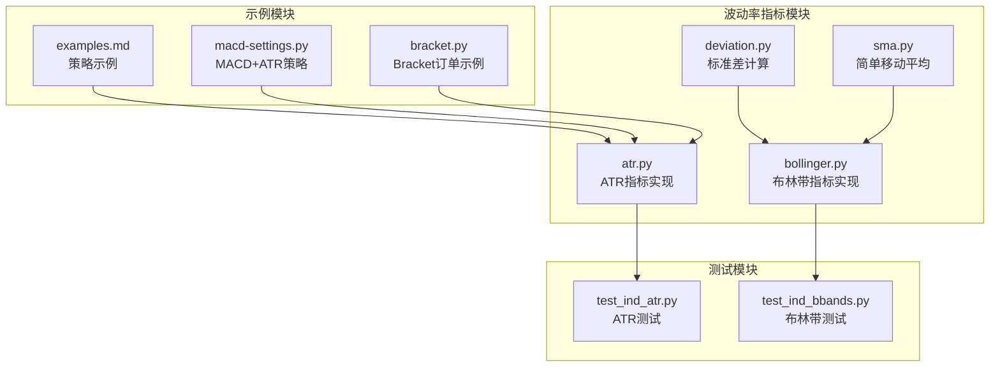
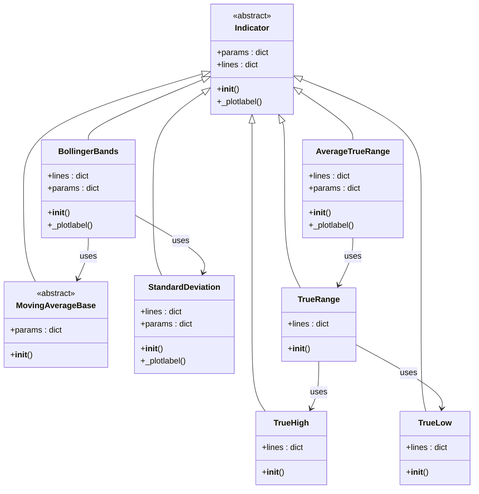
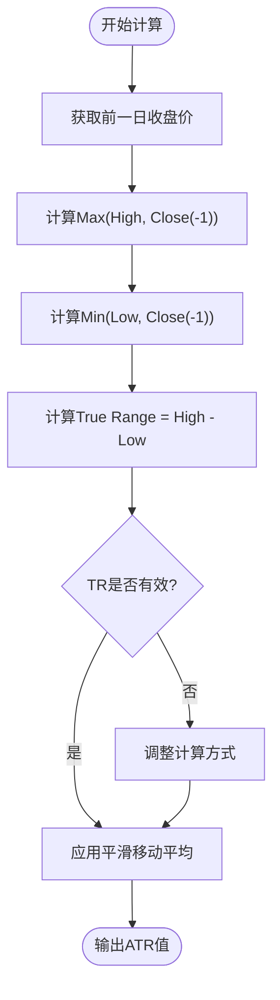
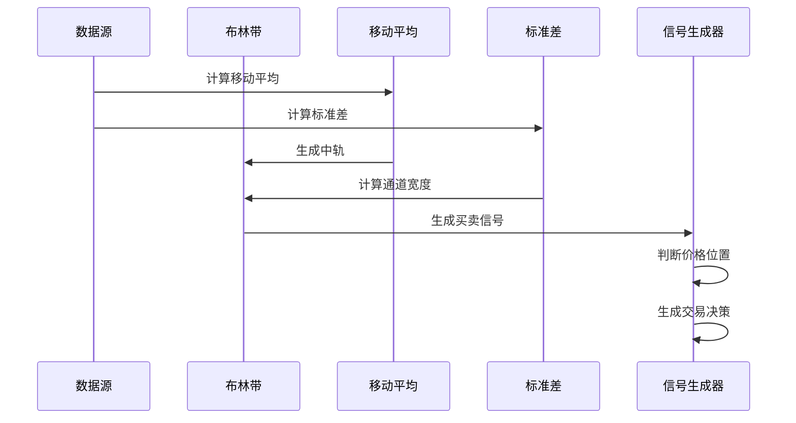
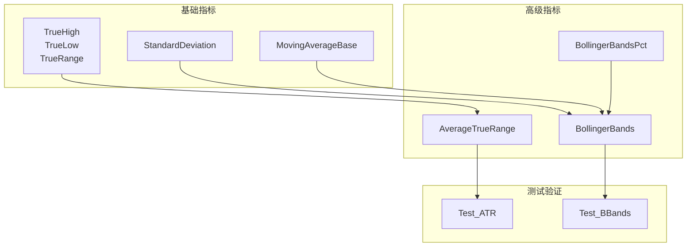

# 波动率类指标

<cite>
**本文档引用的文件**
- [atr.py](file://backtrader/indicators/atr.py)
- [bollinger.py](file://backtrader/indicators/bollinger.py)
- [deviation.py](file://backtrader/indicators/deviation.py)
- [sma.py](file://backtrader/indicators/sma.py)
- [test_ind_atr.py](file://tests/test_ind_atr.py)
- [test_ind_bbands.py](file://tests/test_ind_bbands.py)
- [examples.md](file://.claude/examples.md)
- [macd-settings.py](file://samples/macd-settings/macd-settings.py)
- [bracket.py](file://samples/bracket/bracket.py)
</cite>

## 目录
1. [简介](#简介)
2. [项目结构](#项目结构)
3. [核心组件](#核心组件)
4. [架构概览](#架构概览)
5. [详细组件分析](#详细组件分析)
6. [依赖关系分析](#依赖关系分析)
7. [性能考虑](#性能考虑)
8. [故障排除指南](#故障排除指南)
9. [结论](#结论)
10. [附录](#附录)

## 简介

波动率类技术指标是量化交易中的重要工具，用于衡量资产价格的波动程度和风险水平。本文件深入讲解BackTrader框架中的波动率指标，包括平均真实波幅（ATR）、布林带和价格通道等关键指标的计算原理、实现机制以及在风险管理中的应用。

这些指标在现代交易系统中发挥着至关重要的作用：
- **ATR指标**：衡量市场波动性，用于动态止损设置和仓位管理
- **布林带指标**：通过标准差定义价格通道，识别超买超卖和突破机会
- **价格通道**：基于历史波动率构建支撑阻力通道

## 项目结构

BackTrader的波动率指标主要位于`backtrader/indicators/`目录下，采用模块化设计，每个指标都是独立的Python模块，遵循统一的接口规范。

**图表来源**
- [atr.py](file://backtrader/indicators/atr.py#L1-L123)
- [bollinger.py](file://backtrader/indicators/bollinger.py#L1-L77)
- [deviation.py](file://backtrader/indicators/deviation.py#L1-L108)

**章节来源**
- [atr.py](file://backtrader/indicators/atr.py#L1-L123)
- [bollinger.py](file://backtrader/indicators/bollinger.py#L1-L77)
- [deviation.py](file://backtrader/indicators/deviation.py#L1-L108)

## 核心组件

### 平均真实波幅（ATR）

ATR是衡量市场波动性的核心指标，由J. Welles Wilder开发，用于消除跳空缺口对传统价格范围的影响。

**关键特性：**
- 使用True Range概念，考虑前收盘价的影响
- 采用平滑移动平均计算
- 默认周期为14天
- 支持不同的移动平均类型

**计算流程：**
1. 计算True High（当日最高价与前日收盘价的最大值）
2. 计算True Low（当日最低价与前日收盘价的最小值）
3. 计算True Range = True High - True Low
4. 对True Range进行平滑移动平均处理

**章节来源**
- [atr.py](file://backtrader/indicators/atr.py#L96-L123)

### 布林带（Bollinger Bands）

布林带由John Bollinger在80年代开发，通过标准差定义价格通道。

**核心公式：**
- 中轨（Mid）= 移动平均线
- 上轨（Top）= 中轨 + 标准差 × 倍数因子
- 下轨（Bottom）= 中轨 - 标准差 × 倍数因子

**默认参数：**
- 周期：20天
- 标准差倍数：2.0
- 移动平均类型：简单移动平均

**章节来源**
- [bollinger.py](file://backtrader/indicators/bollinger.py#L27-L65)

### 标准差计算

标准差是衡量数据分散程度的重要统计指标，在波动率计算中起基础作用。

**计算方法：**
- 基于均方差公式：√(E[X²] - (E[X])²)
- 支持安全幂运算防止数值精度问题
- 可选择不同的移动平均类型

**章节来源**
- [deviation.py](file://backtrader/indicators/deviation.py#L27-L71)

## 架构概览

BackTrader的波动率指标采用分层架构设计，确保代码的可扩展性和可维护性。

**图表来源**
- [atr.py](file://backtrader/indicators/atr.py#L27-L123)
- [bollinger.py](file://backtrader/indicators/bollinger.py#L27-L65)
- [deviation.py](file://backtrader/indicators/deviation.py#L27-L108)

## 详细组件分析

### ATR指标深度解析

#### 计算原理

ATR的核心在于True Range的计算，它解决了传统价格范围无法反映跳空缺口的问题。

**图表来源**
- [atr.py](file://backtrader/indicators/atr.py#L69-L94)

#### 参数配置

| 参数名称 | 默认值 | 作用描述 |
|---------|--------|----------|
| period | 14 | ATR计算周期，默认14天 |
| movav | Smoothed | 移动平均类型，使用平滑移动平均 |

#### 实际应用场景

**止损设置：**
- 动态止损距离 = ATR × 倍数因子
- 根据市场波动性调整止损幅度

**仓位管理：**
- 仓位大小 = 资金管理预算 ÷ (ATR × 风险系数)
- 高波动市场降低仓位，低波动市场增加仓位

**章节来源**
- [atr.py](file://backtrader/indicators/atr.py#L96-L123)

### 布林带策略详解

#### 技术原理

布林带通过统计学方法构建价格通道，利用价格偏离通道的程度来判断交易时机。

**图表来源**
- [bollinger.py](file://backtrader/indicators/bollinger.py#L57-L64)

#### 交易策略

**基础布林带策略：**
- 价格跌破下轨：买入信号
- 价格突破上轨：卖出信号

**增强策略（均值回归）：**
- 布林带宽度标准化：(上轨-下轨)/中轨
- 仅在高波动时交易（宽度阈值过滤）
- 相对位置判断：价格接近下轨特定比例时买入

#### 参数优化建议

| 参数类型 | 推荐范围 | 说明 |
|---------|----------|------|
| 周期 | 15-25 | 影响通道敏感度 |
| 标准差倍数 | 1.5-2.5 | 影响通道宽度 |
| 宽度阈值 | 0.03-0.08 | 过滤低波动市场 |

**章节来源**
- [bollinger.py](file://backtrader/indicators/bollinger.py#L27-L77)

### 价格通道与风险管理

#### 通道构建方法

价格通道可以通过多种方式构建：
- 基于ATR的动态通道
- 基于历史高低价的固定通道
- 基于布林带的标准差通道

#### 风险管理应用

**动态止损：**
- 基于ATR的移动止损
- 百分比止损与ATR止损结合

**资金管理：**
- 根据波动率调整仓位大小
- 设置最大回撤限制

**章节来源**
- [examples.md](file://.claude/examples.md#L308-L380)

## 依赖关系分析

波动率指标之间存在复杂的依赖关系，形成完整的指标生态系统。

**图表来源**
- [atr.py](file://backtrader/indicators/atr.py#L27-L123)
- [bollinger.py](file://backtrader/indicators/bollinger.py#L27-L77)
- [deviation.py](file://backtrader/indicators/deviation.py#L27-L108)

### 关键依赖链

1. **TrueRange** → **AverageTrueRange**：ATR的核心计算依赖
2. **StandardDeviation** → **BollingerBands**：布林带的标准差基础
3. **MovingAverageBase** → **BollingerBands**：布林带的中轨计算
4. **测试模块** → **所有指标**：确保指标正确性

**章节来源**
- [atr.py](file://backtrader/indicators/atr.py#L96-L123)
- [bollinger.py](file://backtrader/indicators/bollinger.py#L57-L65)

## 性能考虑

### 计算复杂度

| 指标 | 时间复杂度 | 空间复杂度 | 优化建议 |
|------|------------|------------|----------|
| ATR | O(n) | O(1) | 使用平滑移动平均减少计算量 |
| 布林带 | O(n) | O(1) | 缓存移动平均结果 |
| 标准差 | O(n) | O(1) | 避免重复计算平方和 |

### 内存优化

1. **流式计算**：只保存必要的中间值
2. **缓存机制**：重用已计算的移动平均值
3. **批量处理**：支持大数据集的高效处理

### 实时性能

- **延迟控制**：确保指标更新的实时性
- **并发处理**：支持多数据源同时计算
- **资源监控**：实时监控内存和CPU使用情况

## 故障排除指南

### 常见问题及解决方案

**问题1：ATR值异常大或小**
- 检查数据质量，确认无缺失值
- 验证周期参数设置是否合理
- 确认移动平均类型选择

**问题2：布林带信号频繁但无效**
- 调整周期参数（通常15-25）
- 设置波动率过滤条件
- 结合趋势指标使用

**问题3：计算性能问题**
- 优化数据预处理
- 使用更高效的移动平均算法
- 实施缓存机制

### 调试工具

**单元测试验证：**
- ATR指标测试：验证计算准确性
- 布林带测试：检查边界条件
- 边界值测试：确认极端情况处理

**章节来源**
- [test_ind_atr.py](file://tests/test_ind_atr.py#L30-L46)
- [test_ind_bbands.py](file://tests/test_ind_bbands.py#L30-L37)

## 结论

BackTrader的波动率指标体系提供了完整而强大的技术分析工具集。通过ATR、布林带等核心指标，交易者可以：

1. **准确衡量市场波动性**：ATR提供动态波动性度量
2. **识别交易机会**：布林带通道捕捉价格突破
3. **实施有效风险管理**：基于波动率的动态止损和仓位管理

这些指标的组合使用能够显著提高交易系统的稳定性和盈利能力。建议在实际应用中根据具体市场特点调整参数，并结合其他技术指标形成完整的交易策略。

## 附录

### 参数调优指南

**ATR参数调优：**
- 短期交易：7-10天周期
- 中期交易：14-20天周期  
- 长期交易：25-50天周期

**布林带参数调优：**
- 周期：15-25天（根据市场波动性调整）
- 标准差倍数：1.5-2.5（平衡信号频率和准确性）
- 宽度阈值：0.03-0.08（过滤低波动市场）

### 实战应用案例

**案例1：ATR动态止损**
- 入场：突破关键阻力位
- 止损：买入价 - 2×ATR
- 目标：ATR的2-3倍回撤

**案例2：布林带突破策略**
- 入场：价格突破上轨或下轨
- 止损：突破点反向ATR距离
- 管理：移动止损跟随价格

**章节来源**
- [examples.md](file://.claude/examples.md#L384-L487)
- [macd-settings.py](file://samples/macd-settings/macd-settings.py#L54-L131)