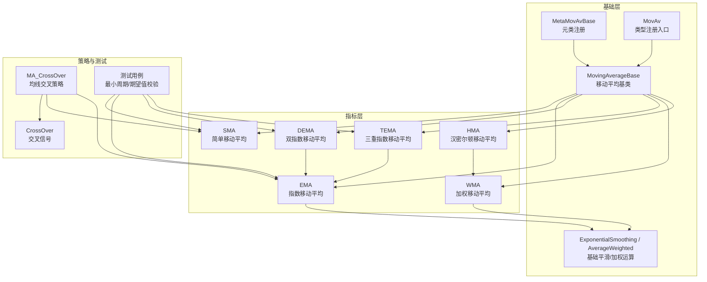
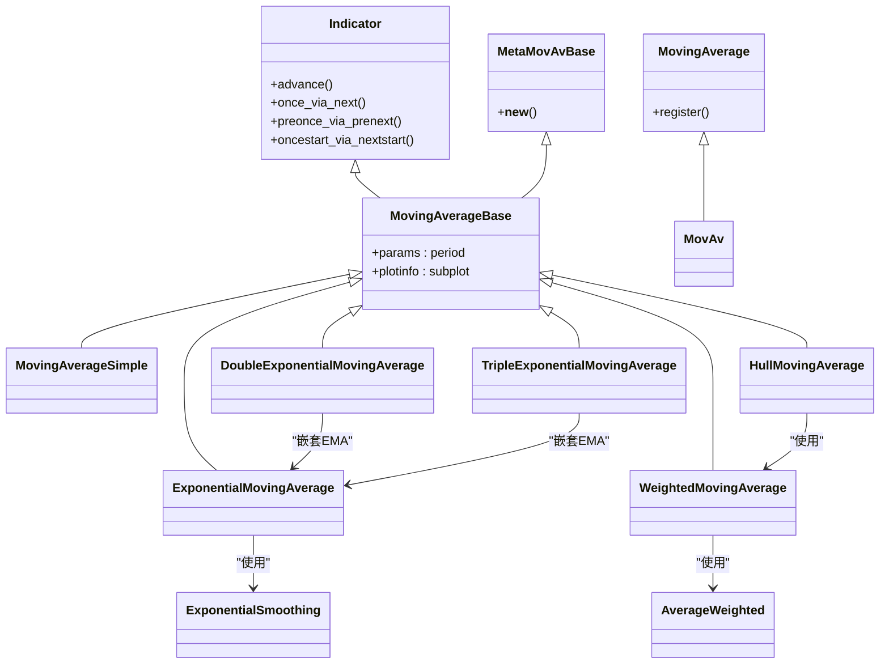
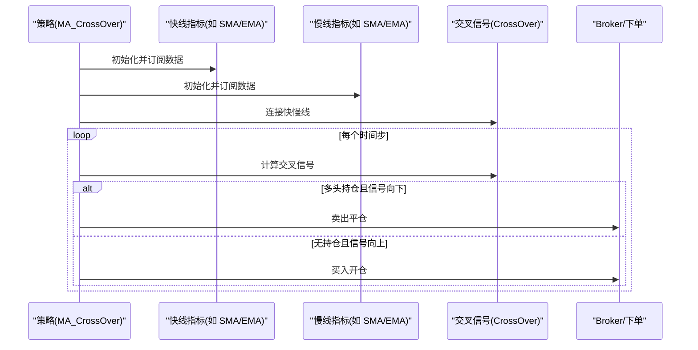
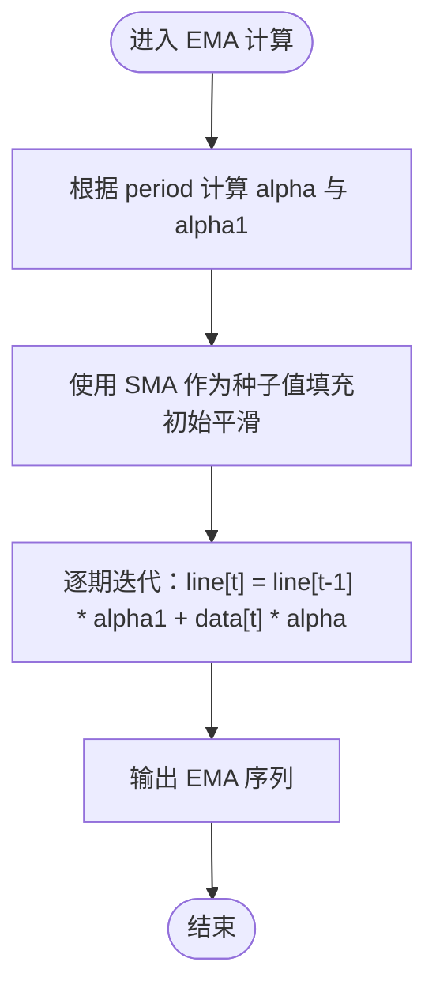
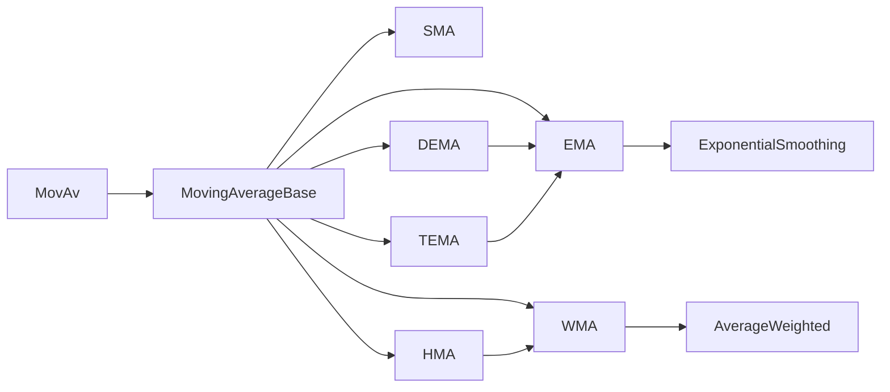

# 移动平均类指标

<cite>
**本文引用的文件**
- [backtrader/indicators/mabase.py](file://backtrader/indicators/mabase.py)
- [backtrader/indicators/sma.py](file://backtrader/indicators/sma.py)
- [backtrader/indicators/ema.py](file://backtrader/indicators/ema.py)
- [backtrader/indicators/dema.py](file://backtrader/indicators/dema.py)
- [backtrader/indicators/wma.py](file://backtrader/indicators/wma.py)
- [backtrader/indicators/hma.py](file://backtrader/indicators/hma.py)
- [backtrader/indicators/basicops.py](file://backtrader/indicators/basicops.py)
- [backtrader/indicators/crossover.py](file://backtrader/indicators/crossover.py)
- [backtrader/strategies/sma_crossover.py](file://backtrader/strategies/sma_crossover.py)
- [backtrader/indicator.py](file://backtrader/indicator.py)
- [tests/test_ind_sma.py](file://tests/test_ind_sma.py)
- [tests/test_ind_ema.py](file://tests/test_ind_ema.py)
- [tests/test_ind_dema.py](file://tests/test_ind_dema.py)
- [tests/test_ind_tema.py](file://tests/test_ind_tema.py)
</cite>

## 目录
1. [简介](#简介)
2. [项目结构](#项目结构)
3. [核心组件](#核心组件)
4. [架构总览](#架构总览)
5. [详细组件分析](#详细组件分析)
6. [依赖关系分析](#依赖关系分析)
7. [性能考量](#性能考量)
8. [故障排查指南](#故障排查指南)
9. [结论](#结论)
10. [附录](#附录)

## 简介
本文件系统性梳理 Backtrader 中的移动平均类技术指标，覆盖简单移动平均（SMA）、指数移动平均（EMA）、双指数移动平均（DEMA）、三重指数移动平均（TEMA）、加权移动平均（WMA）与汉密尔顿移动平均（HMA）。内容包括：
- 各指标的计算原理、参数设置与适用场景
- 指标特点、优缺点与适用市场条件
- 在策略中使用这些指标的实际示例路径（不直接展示代码）
- 移动平均线交叉策略的实现方法与风险管理要点
- 通过源码级图示与流程图帮助理解内部实现与数据流

## 项目结构
移动平均相关代码主要位于 backtrader/indicators 目录下，围绕一个统一的基类体系构建：
- 基础注册与元类：MovAv/MovingAverage/MetaMovAvBase/MovingAverageBase
- 具体指标：SMA、EMA、DEMA/TEMA、WMA、HMA
- 基础运算：ExponentialSmoothing、AverageWeighted 等
- 策略示例：基于 SMA 的交叉策略
- 测试用例：验证最小周期与输出值

图表来源
- [backtrader/indicators/mabase.py](file://backtrader/indicators/mabase.py#L75-L92)
- [backtrader/indicators/sma.py](file://backtrader/indicators/sma.py#L27-L46)
- [backtrader/indicators/ema.py](file://backtrader/indicators/ema.py#L27-L56)
- [backtrader/indicators/dema.py](file://backtrader/indicators/dema.py#L28-L84)
- [backtrader/indicators/wma.py](file://backtrader/indicators/wma.py#L29-L56)
- [backtrader/indicators/hma.py](file://backtrader/indicators/hma.py#L29-L67)
- [backtrader/indicators/basicops.py](file://backtrader/indicators/basicops.py#L367-L456)
- [backtrader/indicators/crossover.py](file://backtrader/indicators/crossover.py)
- [backtrader/strategies/sma_crossover.py](file://backtrader/strategies/sma_crossover.py#L29-L75)

章节来源
- [backtrader/indicators/mabase.py](file://backtrader/indicators/mabase.py#L29-L92)
- [backtrader/indicators/sma.py](file://backtrader/indicators/sma.py#L27-L46)
- [backtrader/indicators/ema.py](file://backtrader/indicators/ema.py#L27-L56)
- [backtrader/indicators/dema.py](file://backtrader/indicators/dema.py#L28-L84)
- [backtrader/indicators/wma.py](file://backtrader/indicators/wma.py#L29-L56)
- [backtrader/indicators/hma.py](file://backtrader/indicators/hma.py#L29-L67)
- [backtrader/indicators/basicops.py](file://backtrader/indicators/basicops.py#L367-L456)
- [backtrader/strategies/sma_crossover.py](file://backtrader/strategies/sma_crossover.py#L29-L75)

## 核心组件
- MovAv/MovingAverage：集中注册所有移动平均类型，提供别名与便捷访问
- MetaMovAvBase：自动注册新移动平均类型，便于扩展与统一管理
- MovingAverageBase：定义默认参数（如 period=30）与绘图信息，作为所有移动平均指标的父类
- Indicator 基类：提供生命周期钩子（next/once/preonce 等），支持缓存与多数据源推进

章节来源
- [backtrader/indicators/mabase.py](file://backtrader/indicators/mabase.py#L29-L92)
- [backtrader/indicator.py](file://backtrader/indicator.py#L90-L137)

## 架构总览
移动平均指标通过继承 MovingAverageBase 并组合基础运算模块（如 ExponentialSmoothing、AverageWeighted）实现。策略通过 MovAv 或具体类名创建指标，并用 CrossOver 生成买卖信号。

图表来源
- [backtrader/indicators/mabase.py](file://backtrader/indicators/mabase.py#L75-L92)
- [backtrader/indicators/sma.py](file://backtrader/indicators/sma.py#L27-L46)
- [backtrader/indicators/ema.py](file://backtrader/indicators/ema.py#L27-L56)
- [backtrader/indicators/wma.py](file://backtrader/indicators/wma.py#L29-L56)
- [backtrader/indicators/hma.py](file://backtrader/indicators/hma.py#L29-L67)
- [backtrader/indicators/dema.py](file://backtrader/indicators/dema.py#L28-L84)
- [backtrader/indicators/basicops.py](file://backtrader/indicators/basicops.py#L367-L456)

## 详细组件分析

### 简单移动平均（SMA）
- 计算原理：对最近 N 期价格取算术平均
- 参数设置：period（默认 30）
- 特点与适用：计算简单、滞后明显；适合趋势确认与长期趋势跟踪
- 优点：稳定、易理解
- 缺点：对最新价格反应慢，震荡市中容易产生假信号
- 适用市场条件：趋势明确且波动较小的行情

章节来源
- [backtrader/indicators/sma.py](file://backtrader/indicators/sma.py#L27-L46)
- [tests/test_ind_sma.py](file://tests/test_ind_sma.py#L29-L36)

### 指数移动平均（EMA）
- 计算原理：对近期价格赋予更高权重，采用指数平滑公式
- 参数设置：period（通过 alpha=2/(1+period) 转换）
- 特点与适用：对最新价格更敏感，滞后较小；适合短期交易与快节奏市场
- 优点：响应快
- 缺点：噪声放大风险较高
- 适用市场条件：震荡偏强趋势或快速变化的市场

章节来源
- [backtrader/indicators/ema.py](file://backtrader/indicators/ema.py#L27-L56)
- [backtrader/indicators/basicops.py](file://backtrader/indicators/basicops.py#L367-L456)
- [tests/test_ind_ema.py](file://tests/test_ind_ema.py#L29-L36)

### 双指数移动平均（DEMA）
- 计算原理：先对数据做一次 EMA，再对第一次 EMA 结果做一次 EMA，最后按线性组合得到 DEMA
- 参数设置：period；内部使用 EMA 作为底层平滑器
- 特点与适用：进一步降低滞后，提高响应速度
- 优点：更快的信号响应
- 缺点：可能放大噪声，过拟合短期波动
- 适用市场条件：需要快速捕捉转折的高频或强趋势市场

章节来源
- [backtrader/indicators/dema.py](file://backtrader/indicators/dema.py#L28-L53)
- [tests/test_ind_dema.py](file://tests/test_ind_dema.py#L29-L36)

### 三重指数移动平均（TEMA）
- 计算原理：对数据做三次 EMA，按线性组合得到 TEMA，进一步减少滞后
- 参数设置：period；内部使用 EMA 作为底层平滑器
- 特点与适用：滞后最小，信号最灵敏
- 优点：极快的信号响应
- 缺点：噪声敏感，回撤与误判概率上升
- 适用市场条件：高波动、强趋势的市场，需严格风控

章节来源
- [backtrader/indicators/dema.py](file://backtrader/indicators/dema.py#L55-L84)
- [tests/test_ind_tema.py](file://tests/test_ind_tema.py#L29-L36)

### 加权移动平均（WMA）
- 计算原理：对最近 N 期价格赋予递增权重（越新权重越大），再做加权平均
- 参数设置：period；权重序列与系数由内部计算给出
- 特点与适用：比 SMA 更重视近期价格，滞后小于 SMA
- 优点：对近期变化更敏感
- 缺点：仍存在滞后，且对异常值敏感
- 适用市场条件：中短期趋势跟踪，需要比 SMA 更灵敏的场景

章节来源
- [backtrader/indicators/wma.py](file://backtrader/indicators/wma.py#L29-L56)
- [backtrader/indicators/basicops.py](file://backtrader/indicators/basicops.py#L458-L494)

### 汉密尔顿移动平均（HMA）
- 计算原理：通过两组 WMA 的线性组合与对周期开方的最终 WMA 实现几乎无滞后的平滑
- 参数设置：period；最终最小周期约为 sqrt(period)，因此最小有效周期会增加
- 特点与适用：显著降低滞后，同时保持一定平滑度
- 优点：滞后极小，曲线平滑
- 缺点：最小周期要求更高，初期输出不稳定
- 适用市场条件：对滞后极其敏感的高频或强趋势市场

章节来源
- [backtrader/indicators/hma.py](file://backtrader/indicators/hma.py#L29-L67)

### 移动平均线交叉策略（SMA_CrossOver）
- 策略思路：当短周期均线上穿长周期均线时做多，下穿时平仓或做空（示例为多头策略）
- 关键实现：使用 CrossOver 连接两条均线，通过 next 中判断信号方向决定下单
- 参数建议：fast（如 10）、slow（如 30），可结合 EMA/WMA/HMA 提升响应
- 风险管理：加入止损止盈、最大仓位、最大回撤限制、过滤噪声（如配合成交量/ATR）

图表来源
- [backtrader/strategies/sma_crossover.py](file://backtrader/strategies/sma_crossover.py#L62-L75)
- [backtrader/indicators/crossover.py](file://backtrader/indicators/crossover.py)

章节来源
- [backtrader/strategies/sma_crossover.py](file://backtrader/strategies/sma_crossover.py#L29-L75)

### 计算流程与数据流（以 EMA 为例）

图表来源
- [backtrader/indicators/ema.py](file://backtrader/indicators/ema.py#L45-L55)
- [backtrader/indicators/basicops.py](file://backtrader/indicators/basicops.py#L392-L398)

## 依赖关系分析
- 继承关系：所有移动平均指标均继承自 MovingAverageBase，后者由 MetaMovAvBase 元类注册到 MovAv
- 组合关系：EMA 使用 ExponentialSmoothing，WMA 使用 AverageWeighted；HMA 基于 WMA 的复合计算；DEMA/TEMA 基于 EMA 的嵌套
- 策略依赖：策略通过 MovAv 或具体类名创建指标，使用 CrossOver 生成买卖信号

图表来源
- [backtrader/indicators/mabase.py](file://backtrader/indicators/mabase.py#L75-L92)
- [backtrader/indicators/ema.py](file://backtrader/indicators/ema.py#L45-L55)
- [backtrader/indicators/wma.py](file://backtrader/indicators/wma.py#L45-L55)
- [backtrader/indicators/hma.py](file://backtrader/indicators/hma.py#L58-L63)
- [backtrader/indicators/dema.py](file://backtrader/indicators/dema.py#L47-L52)

章节来源
- [backtrader/indicators/mabase.py](file://backtrader/indicators/mabase.py#L75-L92)
- [backtrader/indicators/ema.py](file://backtrader/indicators/ema.py#L27-L56)
- [backtrader/indicators/wma.py](file://backtrader/indicators/wma.py#L29-L56)
- [backtrader/indicators/hma.py](file://backtrader/indicators/hma.py#L29-L67)
- [backtrader/indicators/dema.py](file://backtrader/indicators/dema.py#L28-L84)

## 性能考量
- 计算复杂度：SMA/EMA/WMA/DEMA/TEMA 均为 O(N)；HMA 由于二次 WMA 与最终 WMA，整体接近 O(N) 但常数因子更大
- 最小周期：不同指标最小有效周期不同（例如 DEMA/TEMA 的最小周期高于其 period；HMA 的最小周期约为 sqrt(period)）
- 内存与缓存：Indicator 基类支持对象缓存与行推进，有助于减少重复计算与提升运行效率
- 参数选择：period 过小噪声大，过大滞后大；应结合市场波动率与交易频率优化

章节来源
- [backtrader/indicators/basicops.py](file://backtrader/indicators/basicops.py#L367-L456)
- [tests/test_ind_dema.py](file://tests/test_ind_dema.py#L34-L35)
- [tests/test_ind_tema.py](file://tests/test_ind_tema.py#L34-L35)
- [backtrader/indicator.py](file://backtrader/indicator.py#L51-L66)

## 故障排查指南
- 输出 NaN：检查数据长度是否达到最小周期；HMA 对最小周期要求尤为严格
- 信号延迟：尝试使用 EMA/WMA/HMA 替代 SMA；或缩短 period，但注意噪声上升
- 交叉信号过多：引入过滤器（如成交量、ATR、趋势强度）；或提高交叉周期差
- 回测结果不佳：调整参数范围进行网格/贝叶斯优化；加入止损止盈与最大回撤控制

章节来源
- [backtrader/indicators/hma.py](file://backtrader/indicators/hma.py#L45-L51)
- [tests/test_ind_sma.py](file://tests/test_ind_sma.py#L34-L35)
- [tests/test_ind_ema.py](file://tests/test_ind_ema.py#L34-L35)
- [tests/test_ind_dema.py](file://tests/test_ind_dema.py#L34-L35)
- [tests/test_ind_tema.py](file://tests/test_ind_tema.py#L34-L35)

## 结论
- SMA 适合稳健的长期趋势跟踪；EMA/WMA/HMA 适合对响应速度有更高要求的交易
- DEMA/TEMA 在快速趋势中表现优异，但需严格风控以避免噪声误导
- 交叉策略是移动平均应用的经典范式，建议结合过滤与风控模块使用
- 参数优化与最小周期约束是获得稳定收益的关键

## 附录
- 实战示例路径（不直接展示代码）：
  - 策略示例：[backtrader/strategies/sma_crossover.py](file://backtrader/strategies/sma_crossover.py#L29-L75)
  - 测试用例（最小周期/期望值）：
    - [tests/test_ind_sma.py](file://tests/test_ind_sma.py#L38-L46)
    - [tests/test_ind_ema.py](file://tests/test_ind_ema.py#L38-L46)
    - [tests/test_ind_dema.py](file://tests/test_ind_dema.py#L38-L46)
    - [tests/test_ind_tema.py](file://tests/test_ind_tema.py#L38-L46)
- 指标实现参考：
  - [backtrader/indicators/sma.py](file://backtrader/indicators/sma.py#L27-L46)
  - [backtrader/indicators/ema.py](file://backtrader/indicators/ema.py#L27-L56)
  - [backtrader/indicators/dema.py](file://backtrader/indicators/dema.py#L28-L84)
  - [backtrader/indicators/wma.py](file://backtrader/indicators/wma.py#L29-L56)
  - [backtrader/indicators/hma.py](file://backtrader/indicators/hma.py#L29-L67)
  - [backtrader/indicators/basicops.py](file://backtrader/indicators/basicops.py#L367-L456)