# 高级技术指标

<cite>
**本文引用的文件**
- [psar.py](file://backtrader/indicators/psar.py)
- [heikinashi.py（指标）](file://backtrader/indicators/heikinashi.py)
- [heikinashi.py（过滤器）](file://backtrader/filters/heikinashi.py)
- [renko.py（过滤器）](file://backtrader/filters/renko.py)
- [fractal.py](file://backtrader/studies/contrib/fractal.py)
- [crossover.py](file://backtrader/indicators/crossover.py)
- [oscillator.py](file://backtrader/indicators/oscillator.py)
- [directionalmove.py](file://backtrader/indicators/directionalmove.py)
- [atr.py](file://backtrader/indicators/atr.py)
- [bollinger.py](file://backtrader/indicators/bollinger.py)
- [psar.py（示例）](file://samples/psar/psar.py)
- [psar-intraday.py（示例）](file://samples/psar/psar-intraday.py)
- [renko.py（示例）](file://samples/renko/renko.py)
</cite>

## 目录
1. [引言](#引言)
2. [项目结构](#项目结构)
3. [核心组件](#核心组件)
4. [架构总览](#架构总览)
5. [详细组件分析](#详细组件分析)
6. [依赖关系分析](#依赖关系分析)
7. [性能考量](#性能考量)
8. [故障排查指南](#故障排查指南)
9. [结论](#结论)
10. [附录](#附录)

## 引言
本文件面向希望在BackTrader中构建高级技术分析策略的工程师与研究者，系统梳理并深入解析以下复杂指标与工具：抛物线转向（PSAR）、方向性指标体系（+DI/-DI/ADX/ADXR/DMI/DM）、希肯纳阿什蜡烛图（Heikin Ashi）、砖形图（Renko）、斐波那契类结构（Fractal）、交叉系统（CrossUp/CrossDown/CrossOver）、振荡器框架（Oscillator/OscillatorMixIn）以及波动率基准（ATR）与布林带（Bollinger Bands）。我们将从实现原理、数据流、计算步骤、可视化与回测集成等方面进行说明，并给出多指标组合与条件过滤的实战思路及适用性讨论。

## 项目结构
BackTrader将技术指标按功能模块化组织于 backtrader/indicators 与 backtrader/filters，示例位于 samples。与本主题直接相关的关键目录与文件如下：
- 指标模块：indicators/psar.py、indicators/directionalmove.py、indicators/atr.py、indicators/bollinger.py、indicators/oscillator.py、indicators/crossover.py、indicators/heikinashi.py
- 过滤器模块：filters/heikinashi.py、filters/renko.py
- 辅助研究：studies/contrib/fractal.py
- 示例：samples/psar/*、samples/renko/*

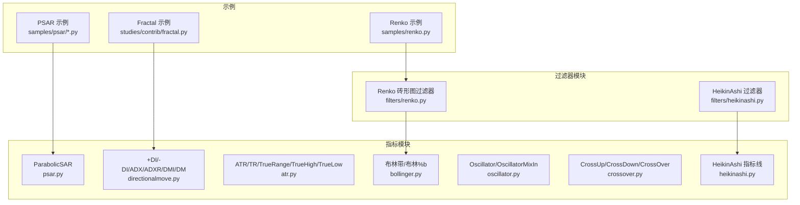

图表来源
- [psar.py](file://backtrader/indicators/psar.py#L45-L173)
- [directionalmove.py](file://backtrader/indicators/directionalmove.py#L69-L384)
- [atr.py](file://backtrader/indicators/atr.py#L69-L123)
- [bollinger.py](file://backtrader/indicators/bollinger.py#L27-L77)
- [oscillator.py](file://backtrader/indicators/oscillator.py#L30-L131)
- [crossover.py](file://backtrader/indicators/crossover.py#L62-L139)
- [heikinashi.py（指标）](file://backtrader/indicators/heikinashi.py#L32-L75)
- [heikinashi.py（过滤器）](file://backtrader/filters/heikinashi.py#L28-L55)
- [renko.py（过滤器）](file://backtrader/filters/renko.py#L31-L140)
- [psar.py（示例）](file://samples/psar/psar.py#L31-L120)
- [psar-intraday.py（示例）](file://samples/psar/psar-intraday.py#L31-L137)
- [renko.py（示例）](file://samples/renko/renko.py#L30-L136)
- [fractal.py](file://backtrader/studies/contrib/fractal.py#L30-L71)

章节来源
- [psar.py](file://backtrader/indicators/psar.py#L45-L173)
- [directionalmove.py](file://backtrader/indicators/directionalmove.py#L69-L384)
- [atr.py](file://backtrader/indicators/atr.py#L69-L123)
- [bollinger.py](file://backtrader/indicators/bollinger.py#L27-L77)
- [oscillator.py](file://backtrader/indicators/oscillator.py#L30-L131)
- [crossover.py](file://backtrader/indicators/crossover.py#L62-L139)
- [heikinashi.py（指标）](file://backtrader/indicators/heikinashi.py#L32-L75)
- [heikinashi.py（过滤器）](file://backtrader/filters/heikinashi.py#L28-L55)
- [renko.py（过滤器）](file://backtrader/filters/renko.py#L31-L140)
- [fractal.py](file://backtrader/studies/contrib/fractal.py#L30-L71)
- [psar.py（示例）](file://samples/psar/psar.py#L31-L120)
- [psar-intraday.py（示例）](file://samples/psar/psar-intraday.py#L31-L137)
- [renko.py（示例）](file://samples/renko/renko.py#L30-L136)

## 核心组件
本节概览关键指标与工具的职责与交互：
- 抛物线转向（PSAR）：用于趋势跟踪与停损反转信号生成，基于价格突破与加速度因子动态调整停损位。
- 方向性指标体系（DI/ADX/ADXR/DMI/DM）：衡量趋势强度与方向，结合+DI与-DI的相对强弱判断动量与趋势持续性。
- 希肯纳阿什（Heikin Ashi）：通过平滑后的开盘/收盘/高低序列消除噪音，突出趋势主方向；既可作为过滤器重映射K线，也可作为指标输出四条线。
- 砖形图（Renko）：以固定或自适应“砖”大小构建柱状序列，剔除时间维度，强调价格突破与反转。
- 斐波那契类结构（Fractal）：识别局部高点/低点的潜在反转结构，辅助支撑/阻力与转折捕捉。
- 交叉系统（CrossUp/CrossDown/CrossOver）：基于非零差分的严格跨线条件，避免“零交叉”带来的虚假信号。
- 振荡器框架（Oscillator/OscillatorMixIn）：将任意均线类指标与其基础数据之差形成振荡值，便于观察偏离程度与超买超卖区域。
- 波动率基准（ATR）与布林带（BB）：ATR提供真实波动范围，BB以均值与标准差刻画上下轨，二者常用于止损/止盈与通道突破策略。

章节来源
- [psar.py](file://backtrader/indicators/psar.py#L45-L173)
- [directionalmove.py](file://backtrader/indicators/directionalmove.py#L69-L384)
- [heikinashi.py（指标）](file://backtrader/indicators/heikinashi.py#L32-L75)
- [heikinashi.py（过滤器）](file://backtrader/filters/heikinashi.py#L28-L55)
- [renko.py（过滤器）](file://backtrader/filters/renko.py#L31-L140)
- [fractal.py](file://backtrader/studies/contrib/fractal.py#L30-L71)
- [crossover.py](file://backtrader/indicators/crossover.py#L62-L139)
- [oscillator.py](file://backtrader/indicators/oscillator.py#L30-L131)
- [atr.py](file://backtrader/indicators/atr.py#L69-L123)
- [bollinger.py](file://backtrader/indicators/bollinger.py#L27-L77)

## 架构总览
下图展示BackTrader中指标与过滤器的典型调用链路与数据流向，帮助理解如何在策略中组合使用这些高级工具。

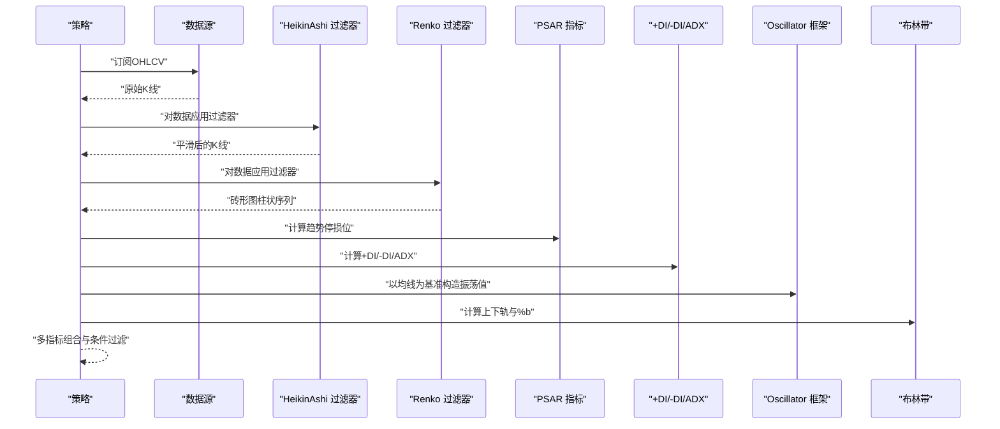

图表来源
- [psar.py（示例）](file://samples/psar/psar.py#L31-L120)
- [psar-intraday.py（示例）](file://samples/psar/psar-intraday.py#L31-L137)
- [renko.py（示例）](file://samples/renko/renko.py#L30-L136)
- [heikinashi.py（过滤器）](file://backtrader/filters/heikinashi.py#L28-L55)
- [renko.py（过滤器）](file://backtrader/filters/renko.py#L31-L140)
- [psar.py](file://backtrader/indicators/psar.py#L45-L173)
- [directionalmove.py](file://backtrader/indicators/directionalmove.py#L69-L384)
- [oscillator.py](file://backtrader/indicators/oscillator.py#L30-L131)
- [bollinger.py](file://backtrader/indicators/bollinger.py#L27-L77)

## 详细组件分析

### 抛物线转向（PSAR）
PSAR由Wilder提出，用于趋势跟踪与反转停损。其核心要点：
- 使用状态机保存前一周期的趋势、极值点（EP）、加速度因子（AF）与当前SAR值。
- 通过价格突破SAR位触发趋势反转；反转后SAR取自前一周期的极值点，并重置AF。
- 在多周期内逐步提升AF至上限，使停损位更贴近价格走势。
- 首期采用启发式初始化，确保首个信号合理。

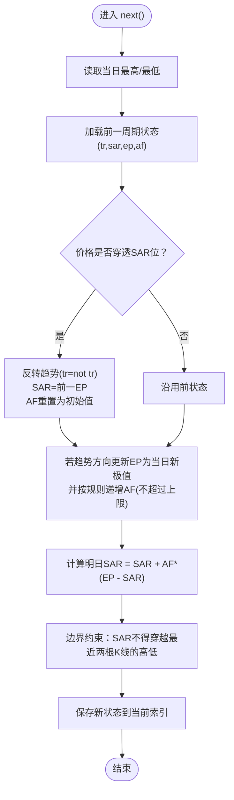

图表来源
- [psar.py](file://backtrader/indicators/psar.py#L119-L173)

章节来源
- [psar.py](file://backtrader/indicators/psar.py#L45-L173)
- [psar.py（示例）](file://samples/psar/psar.py#L31-L120)
- [psar-intraday.py（示例）](file://samples/psar/psar-intraday.py#L31-L137)

### 方向性指标体系（+DI/-DI/ADX/ADXR/DMI/DM）
该体系源于Wilder的DMI，用于衡量趋势强度与方向：
- UpMove/DownMove：计算当日与前一日的高/低变化，作为方向性基础。
- +DM/-DM：仅在相应方向变化更大且为正值时计数，形成累积方向性。
- +DI/-DI：方向性与ATR的比值百分化，反映动量强弱。
- ADX：+DI与-DI差的绝对值与和的比值再经移动平均，衡量趋势强度。
- ADXR：当前ADX与N周期前ADX的均值，用于趋势确认。
- DMI/DM：同时输出ADX、+DI、-DI及其组合，便于综合判断。

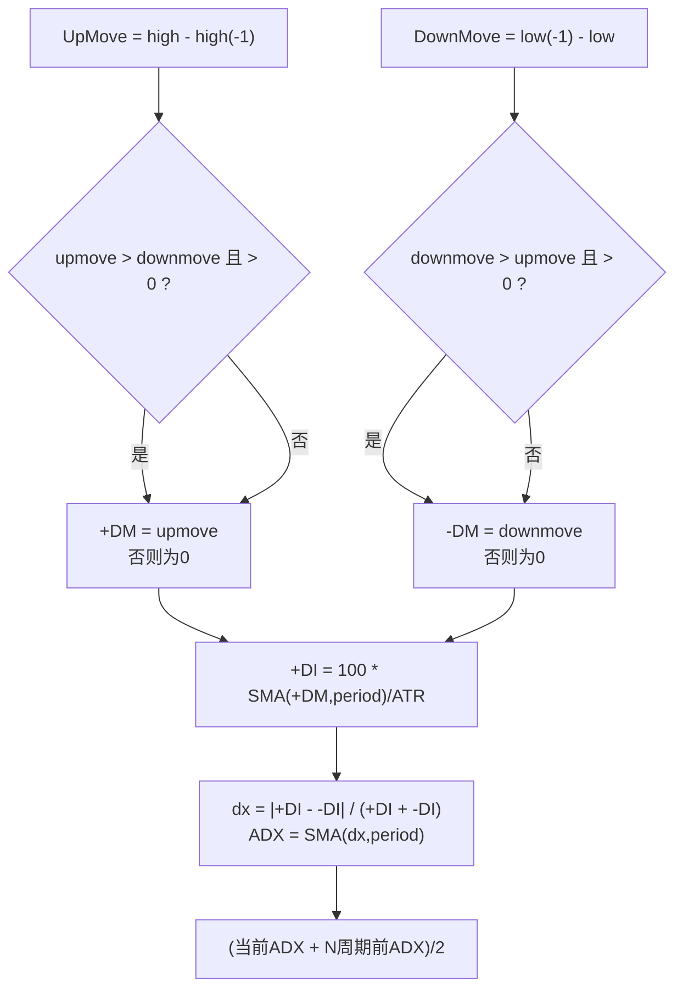

图表来源
- [directionalmove.py](file://backtrader/indicators/directionalmove.py#L69-L384)
- [atr.py](file://backtrader/indicators/atr.py#L69-L123)

章节来源
- [directionalmove.py](file://backtrader/indicators/directionalmove.py#L69-L384)
- [atr.py](file://backtrader/indicators/atr.py#L69-L123)

### 希肯纳阿什（Heikin Ashi）
Heikin Ashi可通过两种方式使用：
- 作为过滤器：在数据流上原地重写OHLC，得到平滑K线，适合趋势识别与减少噪音。
- 作为指标：输出四条线（ha_open/ha_high/ha_low/ha_close），便于与其他指标叠加。

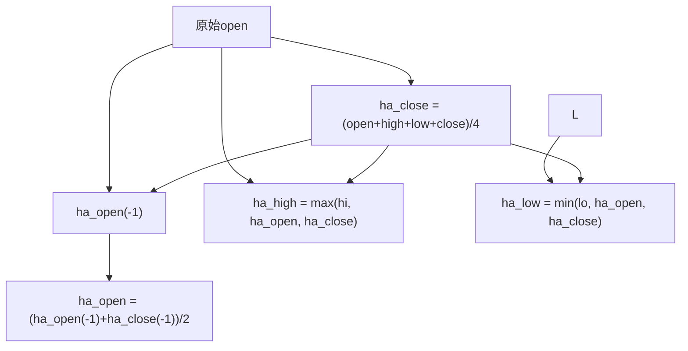

图表来源
- [heikinashi.py（指标）](file://backtrader/indicators/heikinashi.py#L32-L75)
- [heikinashi.py（过滤器）](file://backtrader/filters/heikinashi.py#L28-L55)

章节来源
- [heikinashi.py（指标）](file://backtrader/indicators/heikinashi.py#L32-L75)
- [heikinashi.py（过滤器）](file://backtrader/filters/heikinashi.py#L28-L55)

### 砖形图（Renko）
Renko以固定或自适应“砖”大小构建柱状序列，强调突破而非时间：
- 参数：hilo（是否用高/低决定新砖）、size（砖大小）、autosize（未指定size时的自动计算）、dynamic（动态重算）、align（对齐因子）、roundstart（起始值取整）。
- 计算流程：根据当前close/high或low决定是否产生新砖；若产生则重写OHLCV并返回False（不推进数据长度），否则退回一步等待下一Bar。

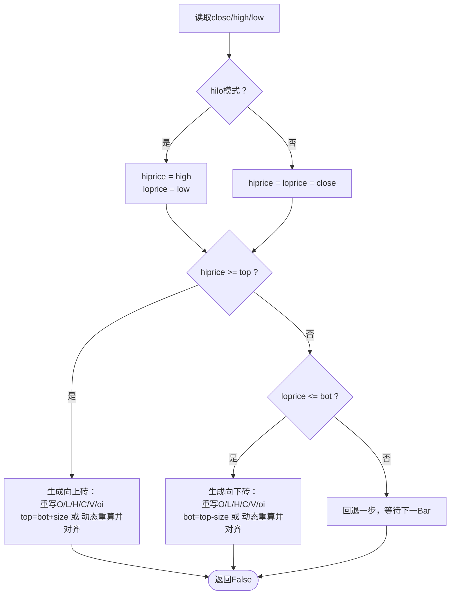

图表来源
- [renko.py（过滤器）](file://backtrader/filters/renko.py#L75-L140)

章节来源
- [renko.py（过滤器）](file://backtrader/filters/renko.py#L31-L140)
- [renko.py（示例）](file://samples/renko/renko.py#L30-L136)

### 斐波那契类结构（Fractal）
Fractal识别局部高/低的潜在反转结构，常用于支撑/阻力与转折捕捉：
- 以5根K线窗口扫描，寻找中间位置的局部高/低；
- 通过参数bardist与shift_to_potential_fractal控制标记位置与幅度偏移；
- 输出两条线：看涨/看跌Fractal标记。

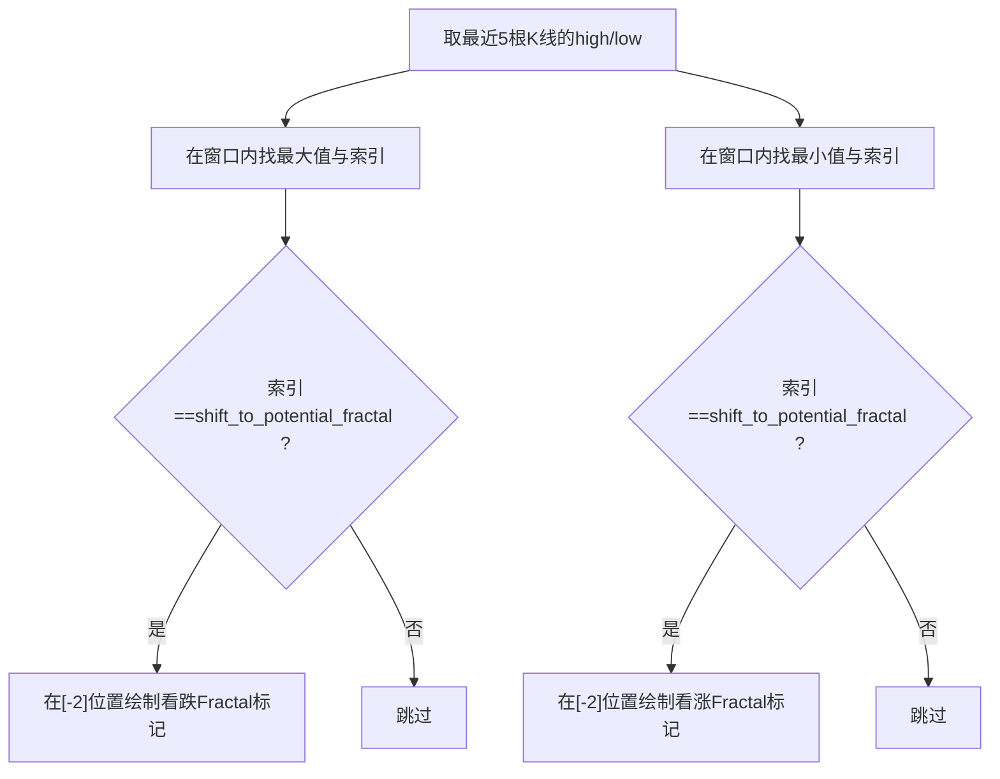

图表来源
- [fractal.py](file://backtrader/studies/contrib/fractal.py#L52-L71)

章节来源
- [fractal.py](file://backtrader/studies/contrib/fractal.py#L30-L71)

### 交叉系统（CrossUp/CrossDown/CrossOver）
交叉系统用于严格判断两条线的跨线信号，避免“零交叉”导致的误判：
- NonZeroDifference：记录最近非零差分，保证跨线判断稳定；
- CrossUp/CrossDown：分别在上升/下降跨线时给出信号；
- CrossOver：整合两者，输出±1信号。

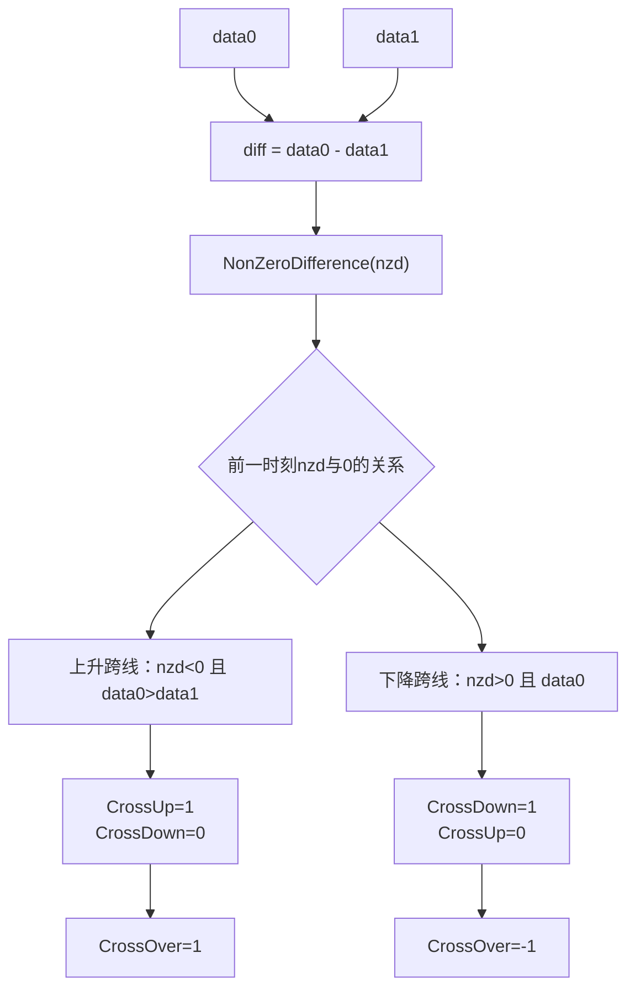

图表来源
- [crossover.py](file://backtrader/indicators/crossover.py#L27-L139)

章节来源
- [crossover.py](file://backtrader/indicators/crossover.py#L62-L139)

### 振荡器框架（Oscillator/OscillatorMixIn）
振荡器框架将任意指标与其基准数据之差形成振荡值，便于观察偏离程度：
- OscillatorMixIn：将自身主线条与另一个指标主线条相减；
- Oscillator：支持1或2个数据源，分别计算围绕基准的振荡值；
- 自动注册：对MovingAverage族自动生成对应振荡类。

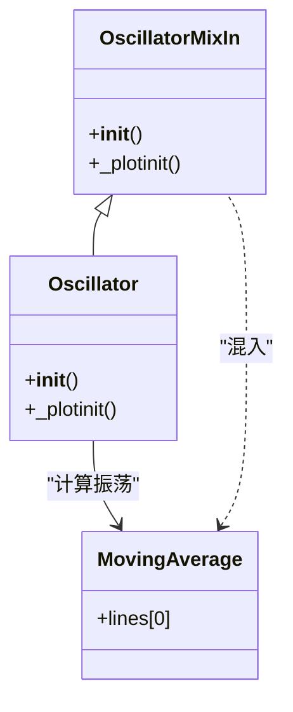

图表来源
- [oscillator.py](file://backtrader/indicators/oscillator.py#L30-L131)

章节来源
- [oscillator.py](file://backtrader/indicators/oscillator.py#L30-L131)

### 波动率基准（ATR）与布林带（BB）
- ATR：通过TrueHigh/TrueLow/TrueRange计算真实波动范围，并以平滑移动平均衡量波动强度；
- 布林带：以中轨（SMA/SMA等）与上下轨（中轨±偏差系数×标准差）刻画区间，%B用于衡量价格相对位置。

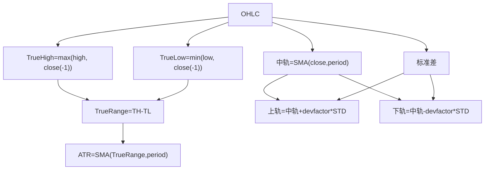

图表来源
- [atr.py](file://backtrader/indicators/atr.py#L69-L123)
- [bollinger.py](file://backtrader/indicators/bollinger.py#L27-L77)

章节来源
- [atr.py](file://backtrader/indicators/atr.py#L69-L123)
- [bollinger.py](file://backtrader/indicators/bollinger.py#L27-L77)

## 依赖关系分析
- PSAR依赖数据的高/低序列与内部状态机，首期通过启发式初始化避免无效信号。
- 方向性指标依赖ATR与移动平均（Smoothed），ADXR在ADX基础上做滞后均值。
- Heikin Ashi过滤器与指标互为镜像：过滤器重写OHLC，指标输出四条线。
- Renko过滤器在满足突破阈值时重写OHLCV并保持数据长度不变，否则回退等待。
- 振荡器框架通过混入机制自动扩展均线族的振荡变体。
- ATR与布林带相互独立但常配合使用：ATR用于动态止损/止盈，BB用于通道突破与均值回归。

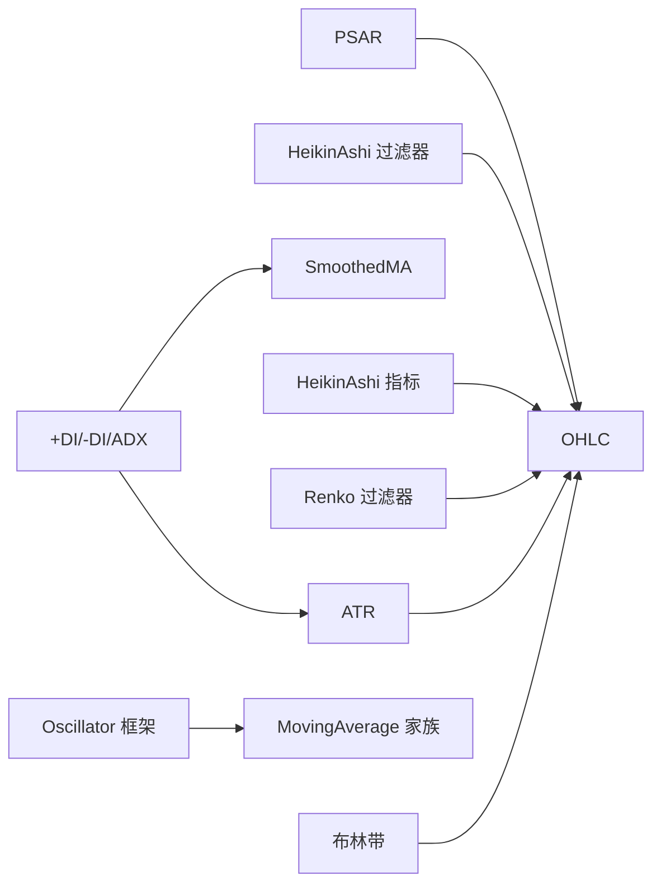

图表来源
- [psar.py](file://backtrader/indicators/psar.py#L45-L173)
- [directionalmove.py](file://backtrader/indicators/directionalmove.py#L69-L384)
- [heikinashi.py（过滤器）](file://backtrader/filters/heikinashi.py#L28-L55)
- [heikinashi.py（指标）](file://backtrader/indicators/heikinashi.py#L32-L75)
- [renko.py（过滤器）](file://backtrader/filters/renko.py#L31-L140)
- [oscillator.py](file://backtrader/indicators/oscillator.py#L30-L131)
- [atr.py](file://backtrader/indicators/atr.py#L69-L123)
- [bollinger.py](file://backtrader/indicators/bollinger.py#L27-L77)

章节来源
- [psar.py](file://backtrader/indicators/psar.py#L45-L173)
- [directionalmove.py](file://backtrader/indicators/directionalmove.py#L69-L384)
- [heikinashi.py（过滤器）](file://backtrader/filters/heikinashi.py#L28-L55)
- [heikinashi.py（指标）](file://backtrader/indicators/heikinashi.py#L32-L75)
- [renko.py（过滤器）](file://backtrader/filters/renko.py#L31-L140)
- [oscillator.py](file://backtrader/indicators/oscillator.py#L30-L131)
- [atr.py](file://backtrader/indicators/atr.py#L69-L123)
- [bollinger.py](file://backtrader/indicators/bollinger.py#L27-L77)

## 性能考量
- 复杂度与内存：多数指标为O(N)线性遍历，少数如DMI依赖ATR与平滑移动平均，整体仍为线性成本。
- 平滑与延迟：平滑移动平均（如Smoothed）会引入滞后，适合趋势跟踪但可能错过短期转折。
- 参数敏感性：PSAR的AF与上限、Renko的brick size/autosize、Fractal的窗口与偏移、ATR的周期与移动平均类型均影响信号质量。
- 数据长度与回测效率：Renko在产生新砖时不推进数据长度，有助于控制回测数据规模；但需注意对齐与动态尺寸带来的额外计算。

## 故障排查指南
- PSAR首期无信号：由于启发式初始化，首期输出为NaN属正常；确认period与数据长度匹配。
- DI/ADX异常值：检查ATR是否为0或极小，必要时调整移动平均类型或周期。
- Heikin Ashi与原K线差异：过滤器会重写OHLC，注意不要在同一数据上重复应用；指标输出四条线，避免混淆。
- Renko未出砖：检查hilo、size/autosize、align与当前价格距离；动态尺寸可能导致对齐偏移。
- 交叉信号不稳定：使用NonZeroDifference确保跨线判断稳健；避免在接近零处频繁切换。
- 振荡器命名与绘图：混入机制自动生成别名，若绘图标签异常，检查_plotinit逻辑与别名映射。

章节来源
- [psar.py](file://backtrader/indicators/psar.py#L75-L86)
- [directionalmove.py](file://backtrader/indicators/directionalmove.py#L69-L109)
- [heikinashi.py（过滤器）](file://backtrader/filters/heikinashi.py#L28-L55)
- [heikinashi.py（指标）](file://backtrader/indicators/heikinashi.py#L32-L75)
- [renko.py（过滤器）](file://backtrader/filters/renko.py#L75-L140)
- [crossover.py](file://backtrader/indicators/crossover.py#L27-L60)
- [oscillator.py](file://backtrader/indicators/oscillator.py#L46-L56)

## 结论
BackTrader为高级技术指标提供了清晰的模块化实现与强大的组合能力。PSAR、DMI系列、Heikin Ashi、Renko、Fractal、交叉系统与振荡器框架共同构成一套覆盖趋势跟踪、动量确认、反转捕捉与通道分析的完整工具集。实践中应结合参数优化、多周期验证与条件过滤，谨慎处理首期信号与平滑滞后问题，以获得稳健的策略表现。

## 附录
- 实战建议
  - 趋势跟踪：PSAR + DI/ADX；在ADX高于阈值时才考虑趋势单。
  - 反转捕捉：Fractal + Heikin Ashi过滤器；在平滑K线下出现局部背离时介入。
  - 通道突破：布林带 + Renko；以Renko确认突破强度，布林带提供入场与出场参考。
  - 多指标组合：使用CrossOver作为主信号，ATR作为动态止损/止盈基准，Oscillator衡量偏离程度。
- 不同市场环境的适应性
  - 趋势市：PSAR、DMI、Renko更有效；震荡市：布林带、Fractal、Oscillator更合适。
  - 高波动：提高ATR周期或采用更平滑的移动平均；低波动：缩短周期并放大阈值。
- 局限性
  - 所有指标均存在滞后与噪声；建议与过滤器（如Heikin Ashi）与条件过滤（如ADX阈值）结合使用。
  - 参数选择高度依赖样本外验证；避免过度拟合。