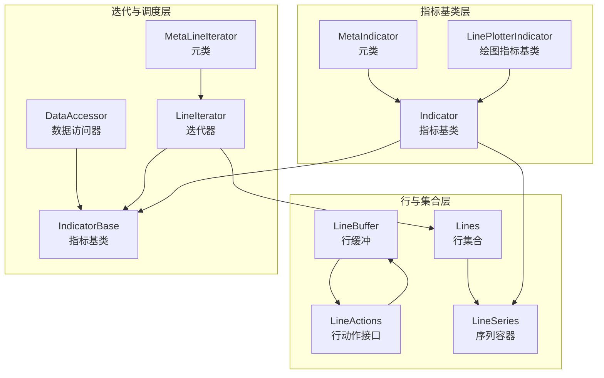
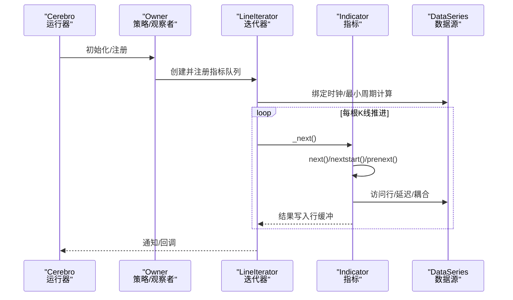
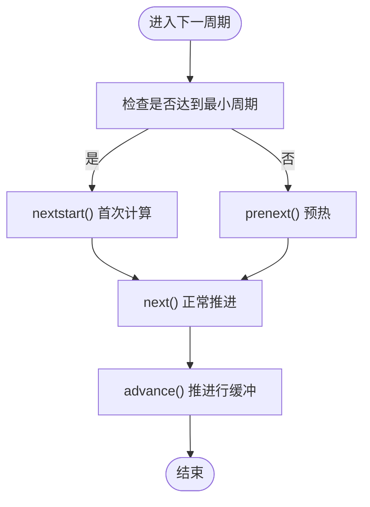
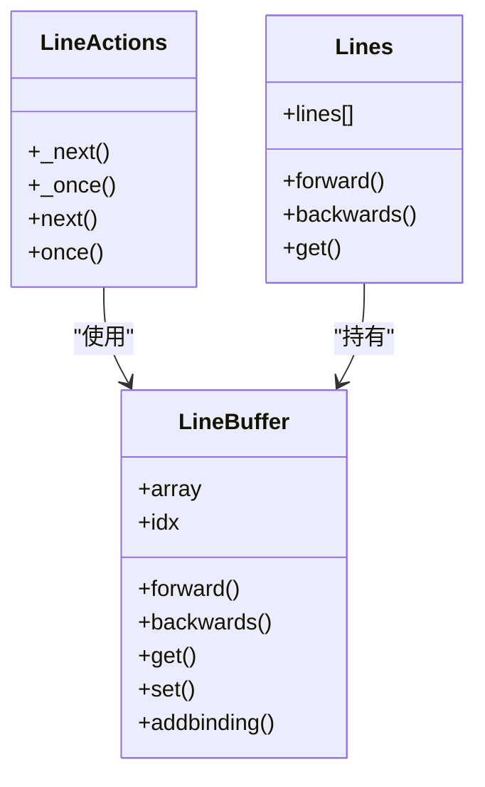
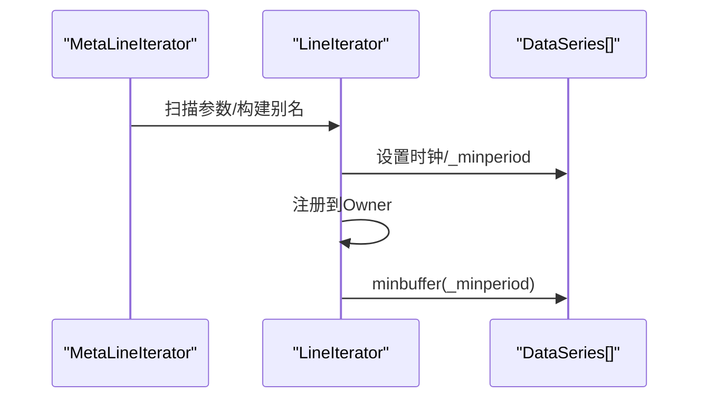
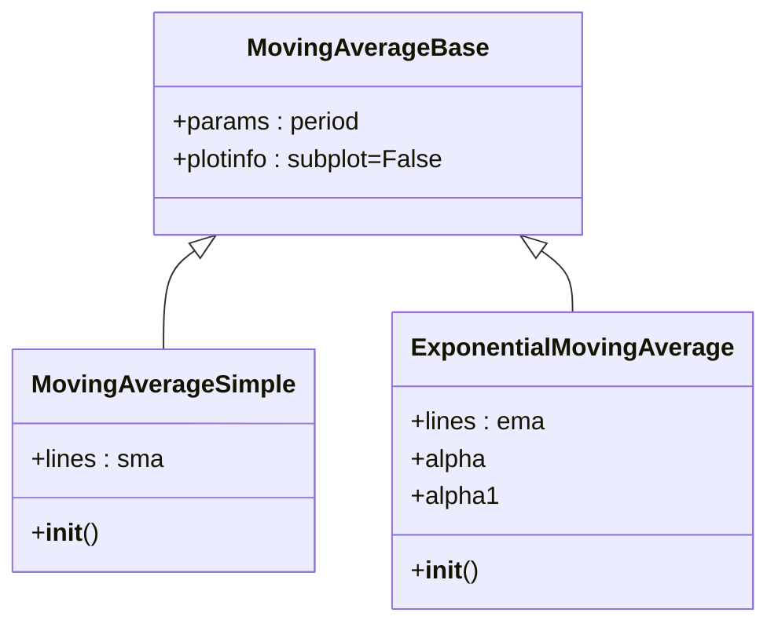
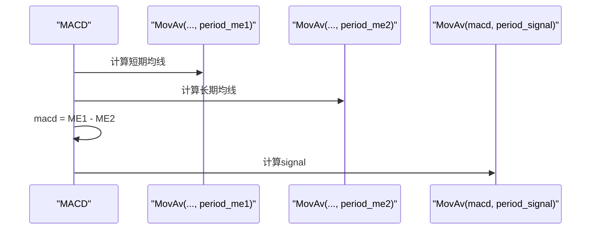
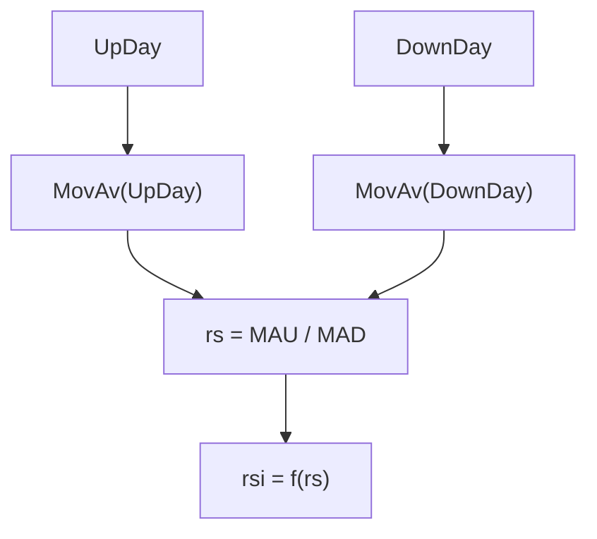
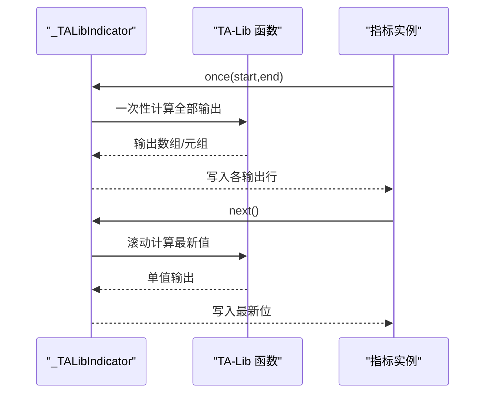
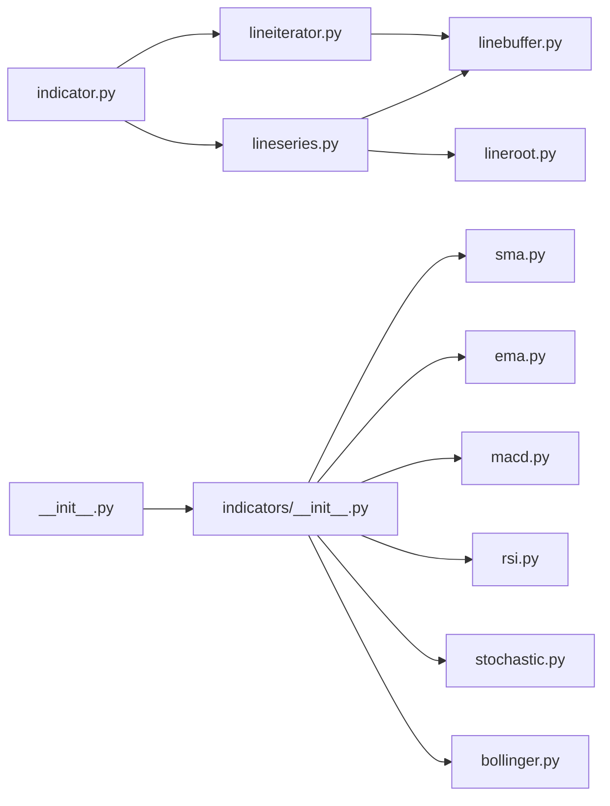

# 技术指标系统

<cite>
**本文引用的文件**
- [backtrader/indicator.py](file://backtrader/indicator.py)
- [backtrader/lineiterator.py](file://backtrader/lineiterator.py)
- [backtrader/lineseries.py](file://backtrader/lineseries.py)
- [backtrader/linebuffer.py](file://backtrader/linebuffer.py)
- [backtrader/indicators/__init__.py](file://backtrader/indicators/__init__.py)
- [backtrader/indicators/mabase.py](file://backtrader/indicators/mabase.py)
- [backtrader/indicators/sma.py](file://backtrader/indicators/sma.py)
- [backtrader/indicators/ema.py](file://backtrader/indicators/ema.py)
- [backtrader/indicators/macd.py](file://backtrader/indicators/macd.py)
- [backtrader/indicators/rsi.py](file://backtrader/indicators/rsi.py)
- [backtrader/indicators/stochastic.py](file://backtrader/indicators/stochastic.py)
- [backtrader/indicators/bollinger.py](file://backtrader/indicators/bollinger.py)
- [backtrader/talib.py](file://backtrader/talib.py)
- [backtrader/__init__.py](file://backtrader/__init__.py)
</cite>

## 目录
1. [简介](#简介)
2. [项目结构](#项目结构)
3. [核心组件](#核心组件)
4. [架构总览](#架构总览)
5. [详细组件分析](#详细组件分析)
6. [依赖关系分析](#依赖关系分析)
7. [性能考量](#性能考量)
8. [故障排查指南](#故障排查指南)
9. [结论](#结论)
10. [附录](#附录)

## 简介
本文件面向Backtrader技术指标系统，系统性梳理指标基类设计、内置指标库、计算机制、缓存策略、向量化处理、TA-Lib集成与自定义开发流程，并提供性能优化建议与常见问题排查方法。Backtrader通过“行缓冲+迭代器+元类”的架构，实现了高内聚、低耦合、可组合的指标体系，支持单/多数据源、多时间框架、批量一次性计算与逐条推进两种执行模式。

## 项目结构
Backtrader指标子系统主要由以下模块构成：
- 指标基类与元类：Indicator、MetaIndicator、LinePlotterIndicator
- 行与行集合：LineBuffer、LineActions、Lines、LineSeries
- 迭代与调度：LineIterator、MetaLineIterator、DataAccessor、IndicatorBase
- 内置指标入口与分类：indicators/__init__.py
- 典型指标样例：移动平均、MACD、RSI、随机指标、布林带等
- 第三方集成：TA-Lib包装器

图表来源
- [backtrader/indicator.py](file://backtrader/indicator.py#L32-L165)
- [backtrader/linebuffer.py](file://backtrader/linebuffer.py#L50-L120)
- [backtrader/lineseries.py](file://backtrader/lineseries.py#L444-L500)
- [backtrader/lineiterator.py](file://backtrader/lineiterator.py#L148-L200)

章节来源
- [backtrader/indicator.py](file://backtrader/indicator.py#L32-L165)
- [backtrader/linebuffer.py](file://backtrader/linebuffer.py#L50-L120)
- [backtrader/lineseries.py](file://backtrader/lineseries.py#L444-L500)
- [backtrader/lineiterator.py](file://backtrader/lineiterator.py#L148-L200)

## 核心组件
- 指标基类与元类
  - MetaIndicator：负责对象缓存、类注册、once/next行为桥接
  - Indicator：继承自IndicatorBase，封装advance、preonce_via_prenext、once_via_next等生命周期
  - LinePlotterIndicator：用于派生支持绘图的指标类
- 行与集合
  - LineBuffer：提供数组式缓冲、索引0对齐、绑定、日期时间解析等能力
  - LineActions：统一next/once接口，驱动LineBuffer前进与计算
  - Lines：动态派生行集合，支持别名、扩展行、批量操作
  - LineSeries：序列容器，提供便捷访问与绘图标签
- 迭代与调度
  - MetaLineIterator：扫描参数中的数据源，构建数据别名、设置时钟、计算最小周期
  - LineIterator：统一的next/once调度，维护指标队列、通知链路、内存节省模式

章节来源
- [backtrader/indicator.py](file://backtrader/indicator.py#L90-L165)
- [backtrader/linebuffer.py](file://backtrader/linebuffer.py#L50-L120)
- [backtrader/lineseries.py](file://backtrader/lineseries.py#L84-L227)
- [backtrader/lineiterator.py](file://backtrader/lineiterator.py#L38-L146)

## 架构总览
Backtrader指标系统采用“元类驱动 + 行缓冲 + 迭代器”的分层架构：
- 元类在类创建/实例化阶段完成参数、行、绘图信息的派生与注入
- 行缓冲提供高性能的数值存储与索引访问
- 迭代器负责在不同数据源长度下进行同步推进与生命周期调度
- 指标通过组合多个行/指标形成复合指标，天然支持多数据输入与跨时间框架

图表来源
- [backtrader/lineiterator.py](file://backtrader/lineiterator.py#L259-L354)
- [backtrader/indicator.py](file://backtrader/indicator.py#L95-L137)

## 详细组件分析

### 指标基类与生命周期
- 类注册与缓存
  - MetaIndicator在类创建时登记子类到全局字典，支持对象级缓存以避免重复实例化
- 生命周期方法
  - once_via_next：在未显式覆盖once时，通过next循环模拟一次性计算
  - preonce_via_prenext：预热阶段推进数据与子指标
  - oncestart_via_nextstart：首次满足最小周期时触发
- advance机制
  - 处理多数据源不同长度/时间框架下的推进，确保行缓冲与时钟同步

图表来源
- [backtrader/indicator.py](file://backtrader/indicator.py#L95-L137)

章节来源
- [backtrader/indicator.py](file://backtrader/indicator.py#L32-L165)

### 行缓冲与向量化处理
- 缓冲模型
  - LineBuffer以索引0作为当前值，支持正向ago取值、负向前瞻、绑定其他行
  - 支持QBuffer模式（固定窗口）与UnBounded模式（动态增长）
- 向量化与批处理
  - LineActions._once通过一次性前推与home重置，配合行缓冲的切片访问，实现高效批量计算
  - LinesOperation提供二元运算的向量化路径，减少条件判断开销

图表来源
- [backtrader/linebuffer.py](file://backtrader/linebuffer.py#L50-L120)
- [backtrader/linebuffer.py](file://backtrader/linebuffer.py#L583-L634)
- [backtrader/lineseries.py](file://backtrader/lineseries.py#L84-L227)

章节来源
- [backtrader/linebuffer.py](file://backtrader/linebuffer.py#L50-L120)
- [backtrader/linebuffer.py](file://backtrader/linebuffer.py#L612-L634)
- [backtrader/lineseries.py](file://backtrader/lineseries.py#L84-L227)

### 迭代器与多数据源
- 数据源扫描与别名
  - MetaLineIterator自动识别LineRoot参数，构建data/data0…dataN与line别名
- 最小周期与同步
  - 基于所有数据源与行的最小周期，统一推进节奏
- 内存优化
  - qbuffer递归调用，强制下游指标启用QBuffer，限制缓冲大小

图表来源
- [backtrader/lineiterator.py](file://backtrader/lineiterator.py#L38-L146)
- [backtrader/lineiterator.py](file://backtrader/lineiterator.py#L365-L377)

章节来源
- [backtrader/lineiterator.py](file://backtrader/lineiterator.py#L38-L146)
- [backtrader/lineiterator.py](file://backtrader/lineiterator.py#L365-L377)

### 内置指标库概览与分类
Backtrader通过indicators/__init__.py集中导出各类指标，按功能分为：
- 移动平均族：SMA、EMA、SMMA、WMA、DEMA、KAMA、ZLEMA、HMA、ZLIND、DMA
- 基于移动平均的扩展：布林带、包络带、动量指标、振荡器等
- 动量与趋势：MACD、RSI、随机指标、ATR、ROC、KST、TSI、TRIX、ICHIMOKU
- 波动率与成交量：ATR、标准差、波动率相关指标
- 趋势过滤与信号：PSAR、Vortex、Acc/Dem、Pretty Good Oscillator等

章节来源
- [backtrader/indicators/__init__.py](file://backtrader/indicators/__init__.py#L30-L91)

### 典型指标实现模式

#### 移动平均基类与简单实现
- 移动平均基类
  - 提供参数period与绘图配置，默认不绘制在子图
- 简单移动平均（SMA）
  - 将self.data按period传给Average，直接产出sma行
- 指数移动平均（EMA）
  - 使用指数平滑，提供alpha与alpha1便于复用

图表来源
- [backtrader/indicators/mabase.py](file://backtrader/indicators/mabase.py#L89-L92)
- [backtrader/indicators/sma.py](file://backtrader/indicators/sma.py#L27-L46)
- [backtrader/indicators/ema.py](file://backtrader/indicators/ema.py#L27-L56)

章节来源
- [backtrader/indicators/mabase.py](file://backtrader/indicators/mabase.py#L29-L92)
- [backtrader/indicators/sma.py](file://backtrader/indicators/sma.py#L27-L46)
- [backtrader/indicators/ema.py](file://backtrader/indicators/ema.py#L27-L56)

#### MACD复合指标
- 结构
  - 两条均线之差产生macd，再对macd做一条均线得到signal
  - 可选直方图（macd - signal）
- 参数与绘图
  - period_me1、period_me2、period_signal、movav；默认零轴水平线

图表来源
- [backtrader/indicators/macd.py](file://backtrader/indicators/macd.py#L27-L64)

章节来源
- [backtrader/indicators/macd.py](file://backtrader/indicators/macd.py#L27-L85)

#### RSI与安全除法
- 组成
  - UpDay/DownDay计算上涨/下跌日贡献
  - 使用MovAv（默认Smoothed）平滑后求RS与RSI
- 安全策略
  - safediv开启时，使用DivZeroByZero处理0/0或x/0情形，返回安全阈值

图表来源
- [backtrader/indicators/rsi.py](file://backtrader/indicators/rsi.py#L178-L191)

章节来源
- [backtrader/indicators/rsi.py](file://backtrader/indicators/rsi.py#L28-L233)

#### 随机指标（Stochastic）
- 快线与慢线
  - Fast：percK = 100*(close - ll)/(hh - ll)，percD = MovAv(percK, period_dfast)
  - Slow：percK = percD，percD = MovAv(percK, period_dslow)
- 安全除法
  - safediv开启时，使用DivByZero避免除零

章节来源
- [backtrader/indicators/stochastic.py](file://backtrader/indicators/stochastic.py#L27-L149)

#### 布林带与百分比线
- 布林带
  - mid = MovAv(close, period)
  - top = mid + devfactor * StdDev
  - bot = mid - devfactor * StdDev
- 布林带百分比线
  - pctb = (close - bot)/(top - bot)

章节来源
- [backtrader/indicators/bollinger.py](file://backtrader/indicators/bollinger.py#L27-L77)

### 自定义指标开发指南
- 继承与参数
  - 继承Indicator或其子类（如MovingAverageBase），在params中声明参数
  - 在lines中声明输出行，使用self.lines[n]或命名别名
- 实现计算逻辑
  - 在__init__中组合行/指标，或直接使用LineOperations
  - 如需一次性计算，重写once(start,end)；否则重写next/nextstart/prenext
- 多数据输入
  - 通过data、data0、data1…访问多数据源；或使用dataN_line别名
  - 利用LineCoupler/LinesCoupler适配不同长度/时间框架
- 绘图与标签
  - plotinfo/plotlines控制绘图样式；可通过_plotlabel定制显示参数
- 性能要点
  - 尽量使用向量化操作（LinesOperation、Avg等）
  - 合理设置_qbuffer，避免无界增长
  - 使用once而非next进行大批量初始化

章节来源
- [backtrader/lineiterator.py](file://backtrader/lineiterator.py#L38-L146)
- [backtrader/lineseries.py](file://backtrader/lineseries.py#L444-L500)
- [backtrader/linebuffer.py](file://backtrader/linebuffer.py#L583-L634)

### 指标组合与复合指标
- 组合方式
  - 将一个指标的输出作为另一个指标的输入（如MACD的signal来自macd的均线）
  - 使用LinesOperation进行二元运算（加减乘除、比较、聚合函数）
- 跨时间框架
  - 使用LineCoupler/LinesCoupler将不同频率的数据对齐到同一时钟
- 绘图绑定
  - 通过bind2lines将指标行绑定到主图或其他指标行，实现联动标注

章节来源
- [backtrader/lineiterator.py](file://backtrader/lineiterator.py#L408-L489)
- [backtrader/linebuffer.py](file://backtrader/linebuffer.py#L705-L800)

### 与TA-Lib集成
- 自动包装
  - _MetaTALibIndicator根据TA-Lib函数生成指标类，自动推断输出行、绘图标志、不稳定因子
- 执行模式
  - once：一次性将整段数据喂入TA-Lib，填充所有行
  - next：按lookback窗口滚动计算最新值
- 不稳定指标处理
  - 对已知不稳定函数（如SAR）或函数标志含UNSTABLE的函数，将lookback设为0，避免回测期修正

图表来源
- [backtrader/talib.py](file://backtrader/talib.py#L92-L239)

章节来源
- [backtrader/talib.py](file://backtrader/talib.py#L65-L239)

## 依赖关系分析
- 模块间依赖
  - indicator.py依赖lineiterator.py、lineseries.py、metabase.py
  - lineiterator.py依赖lineroot.py、linebuffer.py、lineseries.py
  - lineseries.py依赖linebuffer.py、lineroot.py、metabase.py
  - indicators/__init__.py统一导出各指标模块
  - __init__.py集中导入indicators包，加载contrib指标

图表来源
- [backtrader/indicator.py](file://backtrader/indicator.py#L25-L30)
- [backtrader/lineiterator.py](file://backtrader/lineiterator.py#L28-L36)
- [backtrader/lineseries.py](file://backtrader/lineseries.py#L36-L42)
- [backtrader/indicators/__init__.py](file://backtrader/indicators/__init__.py#L24-L91)
- [backtrader/__init__.py](file://backtrader/__init__.py#L69-L91)

章节来源
- [backtrader/indicator.py](file://backtrader/indicator.py#L25-L30)
- [backtrader/lineiterator.py](file://backtrader/lineiterator.py#L28-L36)
- [backtrader/lineseries.py](file://backtrader/lineseries.py#L36-L42)
- [backtrader/indicators/__init__.py](file://backtrader/indicators/__init__.py#L24-L91)
- [backtrader/__init__.py](file://backtrader/__init__.py#L69-L91)

## 性能考量
- 缓冲与内存
  - 启用qbuffer限制窗口大小，避免无限增长；必要时使用QBuffer模式
  - 一次性计算（once）优于逐条推进（next），减少循环开销
- 向量化与批处理
  - 使用LinesOperation进行二元运算，避免Python层循环
  - 在TA-Lib集成中利用numpy数组批处理
- 最小周期与同步
  - 合理设置参数period，避免过长lookback导致大量预热数据
  - 使用LineCoupler/LinesCoupler减少无效推进
- 对象缓存
  - MetaIndicator支持类级对象缓存，避免重复实例化带来的开销

章节来源
- [backtrader/linebuffer.py](file://backtrader/linebuffer.py#L121-L148)
- [backtrader/linebuffer.py](file://backtrader/linebuffer.py#L705-L800)
- [backtrader/talib.py](file://backtrader/talib.py#L187-L232)

## 故障排查指南
- 指标未输出或输出异常
  - 检查_minperiod是否满足；确认prenext/next/nextstart的调用时机
  - 使用bind2lines将输出绑定到主图，验证值是否写入
- 多数据源不同步
  - 使用LineCoupler/LinesCoupler对齐时钟；确认数据源长度与advance推进
- TA-Lib不稳定指标
  - 关注函数标志UNSTABLE；必要时将lookback设为0，避免回测期修正
- 性能瓶颈
  - 检查是否使用了过多一次性计算；尝试将部分逻辑改为next
  - 确认是否启用了qbuffer；避免无界增长

章节来源
- [backtrader/lineiterator.py](file://backtrader/lineiterator.py#L259-L354)
- [backtrader/linebuffer.py](file://backtrader/linebuffer.py#L334-L354)
- [backtrader/talib.py](file://backtrader/talib.py#L71-L91)

## 结论
Backtrader技术指标系统以元类与行缓冲为核心，结合迭代器调度与绘图绑定，形成了高度可组合、可扩展且性能优良的指标生态。通过理解Indicator基类的生命周期、LineBuffer的缓冲模型、LineIterator的推进机制以及TA-Lib的集成策略，开发者可以快速构建高质量的自定义指标，并在多数据源与多时间框架场景中稳定运行。

## 附录
- 快速参考
  - 指标基类：Indicator、MetaIndicator、LinePlotterIndicator
  - 行与集合：LineBuffer、LineActions、Lines、LineSeries
  - 迭代与调度：MetaLineIterator、LineIterator、DataAccessor
  - 内置指标入口：indicators/__init__.py
  - TA-Lib集成：talib.py

章节来源
- [backtrader/indicator.py](file://backtrader/indicator.py#L90-L165)
- [backtrader/linebuffer.py](file://backtrader/linebuffer.py#L50-L120)
- [backtrader/lineseries.py](file://backtrader/lineseries.py#L84-L227)
- [backtrader/lineiterator.py](file://backtrader/lineiterator.py#L148-L200)
- [backtrader/indicators/__init__.py](file://backtrader/indicators/__init__.py#L30-L91)
- [backtrader/talib.py](file://backtrader/talib.py#L65-L239)