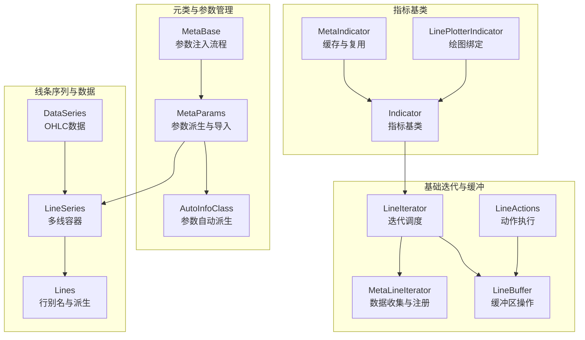
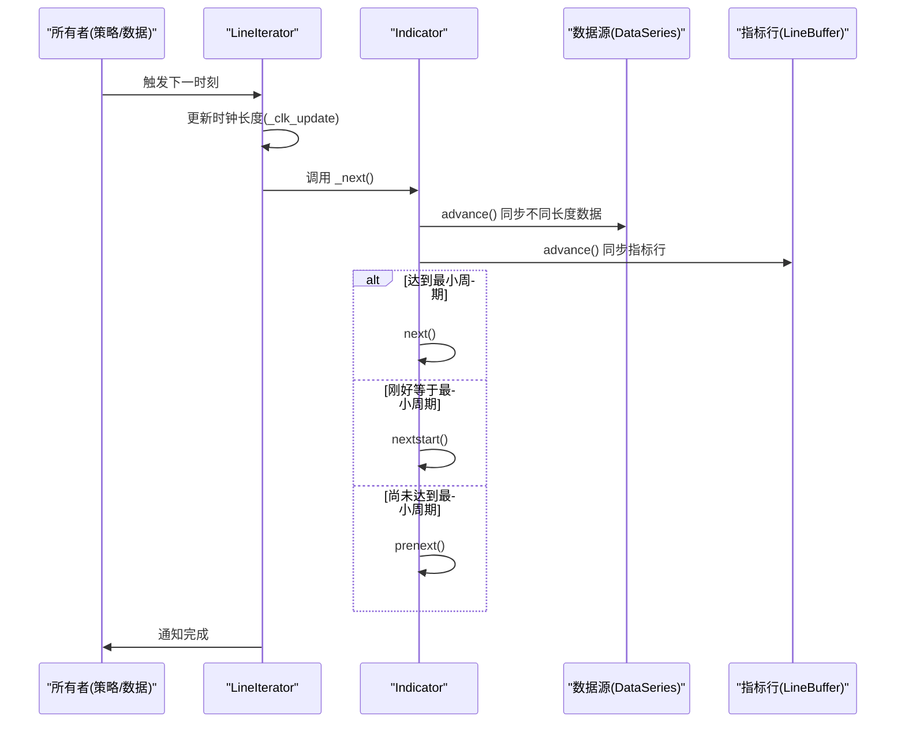
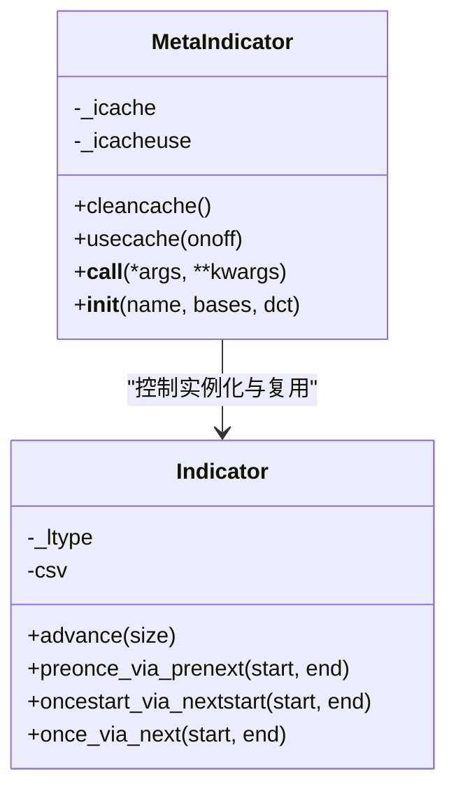
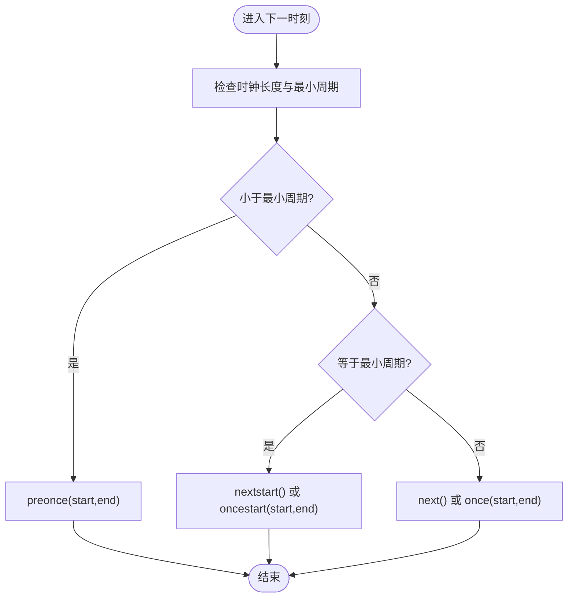
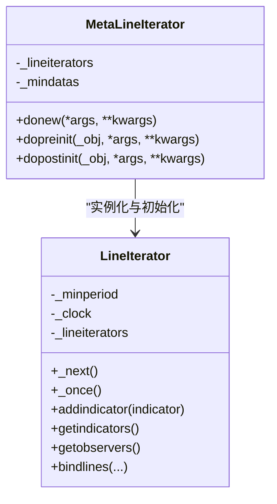
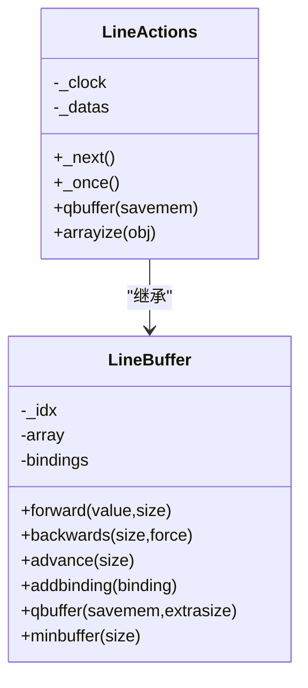
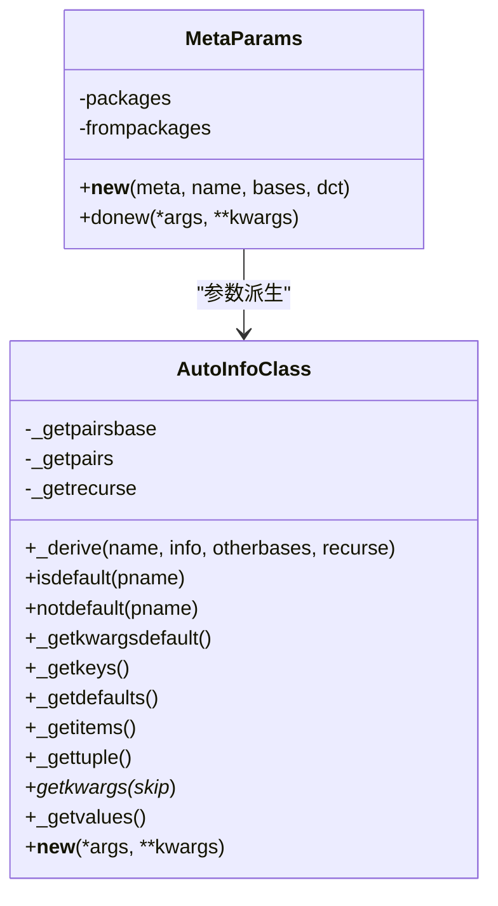
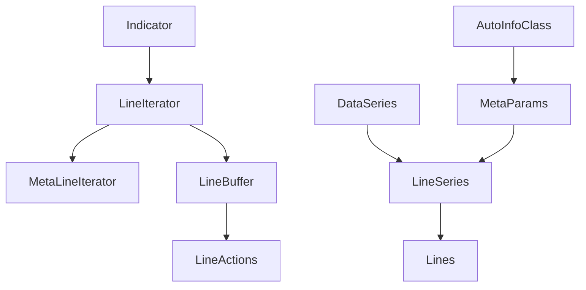

# 指标基类架构

<cite>
**本文档引用的文件**
- [backtrader/indicator.py](file://backtrader/indicator.py)
- [backtrader/metabase.py](file://backtrader/metabase.py)
- [backtrader/lineiterator.py](file://backtrader/lineiterator.py)
- [backtrader/linebuffer.py](file://backtrader/linebuffer.py)
- [backtrader/lineroot.py](file://backtrader/lineroot.py)
- [backtrader/lineseries.py](file://backtrader/lineseries.py)
- [backtrader/dataseries.py](file://backtrader/dataseries.py)
- [backtrader/indicators/sma.py](file://backtrader/indicators/sma.py)
- [backtrader/indicators/macd.py](file://backtrader/indicators/macd.py)
- [backtrader/indicators/mabase.py](file://backtrader/indicators/mabase.py)
</cite>

## 目录
1. [简介](#简介)
2. [项目结构](#项目结构)
3. [核心组件](#核心组件)
4. [架构总览](#架构总览)
5. [详细组件分析](#详细组件分析)
6. [依赖关系分析](#依赖关系分析)
7. [性能考虑](#性能考虑)
8. [故障排除指南](#故障排除指南)
9. [结论](#结论)
10. [附录](#附录)

## 简介
本文件面向Backtrader指标系统的架构设计，重点解析Indicator基类及其元类MetaIndicator的工作机制，涵盖缓存策略、对象复用、生命周期管理（初始化、计算、更新）、与数据流的交互（advance方法、preonce与once计算模式）、线性迭代器系统（LineIterator）以及参数管理系统（AutoInfoClass）。同时提供继承指南、最佳实践与常见问题排查建议，帮助开发者正确扩展和优化自定义指标。

## 项目结构
Backtrader指标系统围绕以下核心模块构建：
- 元类与参数管理：metabase.py（MetaBase、MetaParams、AutoInfoClass）
- 基础迭代与缓冲：lineiterator.py（LineIterator、MetaLineIterator）、linebuffer.py（LineBuffer、LineActions）
- 线条序列与数据：lineseries.py（LineSeries、Lines）、dataseries.py（DataSeries）
- 指标基类与继承：indicator.py（MetaIndicator、Indicator、LinePlotterIndicator）
- 典型指标示例：indicators/sma.py、indicators/macd.py、indicators/mabase.py

图表来源
- [backtrader/metabase.py](file://backtrader/metabase.py#L66-L91)
- [backtrader/lineiterator.py](file://backtrader/lineiterator.py#L38-L146)
- [backtrader/linebuffer.py](file://backtrader/linebuffer.py#L499-L569)
- [backtrader/lineseries.py](file://backtrader/lineseries.py#L305-L442)
- [backtrader/indicator.py](file://backtrader/indicator.py#L32-L91)

章节来源
- [backtrader/indicator.py](file://backtrader/indicator.py#L32-L91)
- [backtrader/metabase.py](file://backtrader/metabase.py#L66-L91)
- [backtrader/lineiterator.py](file://backtrader/lineiterator.py#L38-L146)
- [backtrader/linebuffer.py](file://backtrader/linebuffer.py#L499-L569)
- [backtrader/lineseries.py](file://backtrader/lineseries.py#L305-L442)
- [backtrader/dataseries.py](file://backtrader/dataseries.py#L60-L104)

## 核心组件
- MetaIndicator：控制指标实例的缓存与复用，检测用户是否仅覆盖next或once，并在必要时自动提供对应的preonce/oncestart实现。
- Indicator：指标基类，负责与数据源同步（advance），并提供preonce_via_prenext、once_via_next、oncestart_via_nextstart等通用实现。
- LineIterator：指标/观察者/策略的统一迭代调度器，处理不同长度数据的时间轴对齐、最小周期判断与next/once阶段分发。
- LineBuffer/LineActions：缓冲区与动作执行框架，支持前向推进、回溯、绑定、一次性计算等。
- AutoInfoClass：参数自动派生系统，支持类层次合并、默认值、递归派生与键值访问。
- Lines/DataSeries：多线容器与OHLC数据结构，提供行别名、派生与绘图配置。

章节来源
- [backtrader/indicator.py](file://backtrader/indicator.py#L32-L91)
- [backtrader/lineiterator.py](file://backtrader/lineiterator.py#L148-L354)
- [backtrader/linebuffer.py](file://backtrader/linebuffer.py#L50-L148)
- [backtrader/metabase.py](file://backtrader/metabase.py#L93-L201)
- [backtrader/lineseries.py](file://backtrader/lineseries.py#L84-L304)
- [backtrader/dataseries.py](file://backtrader/dataseries.py#L60-L104)

## 架构总览
指标系统通过“元类-基类-迭代器-缓冲区”的分层设计实现高效的数据驱动计算。元类负责参数注入与类级行为定制；基类负责实例级生命周期与数据同步；迭代器负责按时间步推进与阶段分发；缓冲区负责内存与索引管理。

图表来源
- [backtrader/lineiterator.py](file://backtrader/lineiterator.py#L259-L285)
- [backtrader/indicator.py](file://backtrader/indicator.py#L95-L137)

## 详细组件分析

### MetaIndicator：元类与缓存复用
- 缓存控制：提供cleancache/usecache接口，内部_icache/_icacheuse实现实例级缓存，避免重复创建相同参数的指标实例。
- 复用策略：当对象缓存被禁用时，直接调用父类构造；启用时以(类, 参数元组, 关键字项)为键进行查找/存储。
- 行为增强：在类初始化时检查用户是否仅覆盖next或once，若仅覆盖next，则自动将once/preonce/oncestart绑定到基于next的模拟实现，简化用户实现。

图表来源
- [backtrader/indicator.py](file://backtrader/indicator.py#L32-L91)

章节来源
- [backtrader/indicator.py](file://backtrader/indicator.py#L32-L91)

### Indicator：生命周期与数据同步
- 生命周期阶段：
  - preonce：最小周期内预计算阶段（一次性模式）
  - oncestart：最小周期边界触发一次（一次性模式）
  - once：最小周期后批量计算（一次性模式）
  - nextstart：最小周期边界触发一次（逐次模式）
  - next：最小周期后逐次计算（逐次模式）
- 数据同步：advance方法用于对齐不同长度数据源与指标行，确保在多时间框架场景下正确推进。

图表来源
- [backtrader/lineiterator.py](file://backtrader/lineiterator.py#L267-L285)
- [backtrader/indicator.py](file://backtrader/indicator.py#L95-L137)

章节来源
- [backtrader/lineiterator.py](file://backtrader/lineiterator.py#L259-L354)
- [backtrader/indicator.py](file://backtrader/indicator.py#L95-L137)

### LineIterator：线性迭代器系统
- 数据收集：MetaLineIterator在实例化时扫描参数中的LineRoot对象，建立datas列表与ddatas字典，自动从所有者收集主数据源。
- 最小周期计算：根据所依赖数据与子指标的最小周期，计算自身最小周期，并在postinit阶段重新计算。
- 迭代调度：_next根据时钟长度与最小周期状态分发到next/nextstart/prenext；_once在一次性模式下推进至末尾并执行preonce/oncestart/once。
- 子指标注册：addindicator将子指标加入_lineiterators映射，支持层级传播与运行模式控制。

图表来源
- [backtrader/lineiterator.py](file://backtrader/lineiterator.py#L38-L146)
- [backtrader/lineiterator.py](file://backtrader/lineiterator.py#L148-L354)

章节来源
- [backtrader/lineiterator.py](file://backtrader/lineiterator.py#L38-L146)
- [backtrader/lineiterator.py](file://backtrader/lineiterator.py#L148-L354)

### LineBuffer/LineActions：缓冲与动作执行
- 缓冲区：LineBuffer提供前向推进、回溯、扩展、索引管理与绑定机制，支持QBuffer模式与最小缓冲调整。
- 动作执行：LineActions实现与LineIterator一致的_next/_once接口，自动处理最小周期与阶段分发。
- 时间对齐：LineDelay/LineForward支持延迟与前瞻操作，配合LineCoupler实现多线对齐。

图表来源
- [backtrader/linebuffer.py](file://backtrader/linebuffer.py#L50-L148)
- [backtrader/linebuffer.py](file://backtrader/linebuffer.py#L583-L634)

章节来源
- [backtrader/linebuffer.py](file://backtrader/linebuffer.py#L50-L148)
- [backtrader/linebuffer.py](file://backtrader/linebuffer.py#L583-L634)

### AutoInfoClass：参数管理系统
- 自动派生：_derive根据类层次与传入参数生成新类，合并基类参数、其他基类参数与当前类参数，支持递归派生。
- 默认值与访问：提供_getkwargsdefault/_getkeys/_getdefaults/_getitems/_gettuple等便捷访问方法。
- 实例化：__new__在递归模式下为嵌套AutoInfoClass创建实例，确保层次化参数结构。

图表来源
- [backtrader/metabase.py](file://backtrader/metabase.py#L93-L201)
- [backtrader/metabase.py](file://backtrader/metabase.py#L203-L294)

章节来源
- [backtrader/metabase.py](file://backtrader/metabase.py#L93-L201)
- [backtrader/metabase.py](file://backtrader/metabase.py#L203-L294)

### 继承指南与最佳实践
- 正确覆盖方法：
  - 若仅覆盖next，请确保next中包含必要的advance调用，以保证数据与指标行同步。
  - 若仅覆盖once，请确保once/oncestart/preonce覆盖完整，或让MetaIndicator自动绑定基于next的实现。
- 使用参数系统：
  - 在类中定义params，利用AutoInfoClass的默认值与派生能力，减少样板代码。
  - 使用p.isdefault()/p.notdefault()判断参数是否使用默认值，便于动态调整显示标签等。
- 行别名与绘图：
  - 通过lines与plotlines定义输出行与绘图样式，结合linealias实现灵活的行命名。
- 示例参考：
  - 简单移动平均：在__init__中将self.lines[0]赋值为某个运算结果，确保行已就绪。
  - MACD：在__init__中组合多个移动平均，形成多行输出，并可覆盖_plotlabel以去除默认参数。

章节来源
- [backtrader/indicators/sma.py](file://backtrader/indicators/sma.py#L27-L46)
- [backtrader/indicators/macd.py](file://backtrader/indicators/macd.py#L27-L64)
- [backtrader/indicators/mabase.py](file://backtrader/indicators/mabase.py#L89-L92)

## 依赖关系分析
- 指标基类依赖LineIterator进行迭代调度，依赖LineBuffer进行行操作。
- LineIterator依赖MetaLineIterator进行数据收集与最小周期计算。
- AutoInfoClass与MetaParams共同构成参数系统，贯穿LineSeries/Lines/DataSeries等层次。
- 数据源DataSeries继承LineSeries，提供OHLC等标准行别名。

图表来源
- [backtrader/indicator.py](file://backtrader/indicator.py#L90-L91)
- [backtrader/lineiterator.py](file://backtrader/lineiterator.py#L38-L146)
- [backtrader/linebuffer.py](file://backtrader/linebuffer.py#L499-L569)
- [backtrader/lineseries.py](file://backtrader/lineseries.py#L305-L442)
- [backtrader/metabase.py](file://backtrader/metabase.py#L203-L294)

章节来源
- [backtrader/indicator.py](file://backtrader/indicator.py#L90-L91)
- [backtrader/lineiterator.py](file://backtrader/lineiterator.py#L38-L146)
- [backtrader/linebuffer.py](file://backtrader/linebuffer.py#L499-L569)
- [backtrader/lineseries.py](file://backtrader/lineseries.py#L305-L442)
- [backtrader/metabase.py](file://backtrader/metabase.py#L203-L294)

## 性能考虑
- 缓存策略：MetaIndicator的实例缓存在某些场景可能带来副作用（如minperiod信息传递影响），默认已禁用对象缓存。如需启用，应谨慎评估对多层嵌套指标的影响。
- 内存优化：LineBuffer的QBuffer模式与minbuffer调整可显著降低内存占用，建议在长周期回测中开启。
- 计算模式：runonce=False（逐次模式）更贴近实时数据流，但计算开销更大；runonce=True（一次性模式）适合离线回测，但需要确保数据完整性。
- 绑定与延迟：过多的行绑定会增加写入成本，应尽量减少不必要的绑定链路。

## 故障排除指南
- 指标未输出或输出异常：
  - 检查是否正确覆盖next/once，或是否依赖MetaIndicator提供的once_via_next实现。
  - 确认advance调用是否在next中执行，以保证数据与指标行同步。
- 最小周期导致的空值：
  - 确认数据源与子指标的最小周期设置，避免在未满足最小周期时读取历史值。
- 参数未生效：
  - 检查params定义与AutoInfoClass派生是否正确，确认p.isdefault()/p.notdefault()逻辑。
- 多时间框架对齐问题：
  - 使用Indicator.advance或LineIterator的advance机制，确保不同长度数据源对齐。

章节来源
- [backtrader/indicator.py](file://backtrader/indicator.py#L95-L137)
- [backtrader/lineiterator.py](file://backtrader/lineiterator.py#L259-L354)
- [backtrader/linebuffer.py](file://backtrader/linebuffer.py#L121-L148)
- [backtrader/metabase.py](file://backtrader/metabase.py#L154-L201)

## 结论
Backtrader指标基类通过元类、参数系统、迭代器与缓冲区的协同，实现了高度模块化与可扩展的指标开发框架。MetaIndicator提供了缓存与复用能力，Indicator与LineIterator确保了生命周期与数据流的正确性，AutoInfoClass简化了参数管理，LineBuffer/LineActions保障了高效的内存与计算模型。遵循继承指南与最佳实践，开发者可以快速构建稳定、高性能的自定义指标。

## 附录
- 典型指标示例路径：
  - [简单移动平均](file://backtrader/indicators/sma.py#L27-L46)
  - [MACD指标](file://backtrader/indicators/macd.py#L27-L64)
  - [移动平均基类](file://backtrader/indicators/mabase.py#L89-L92)