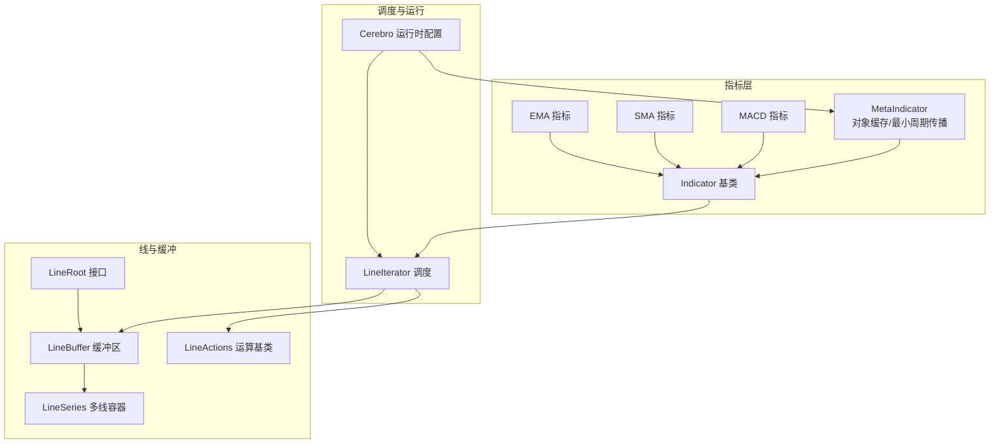
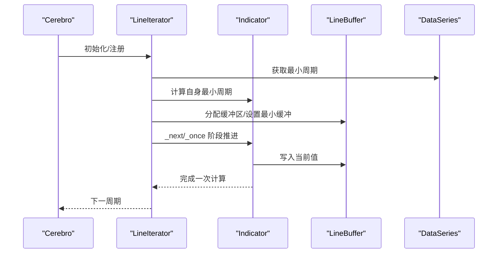
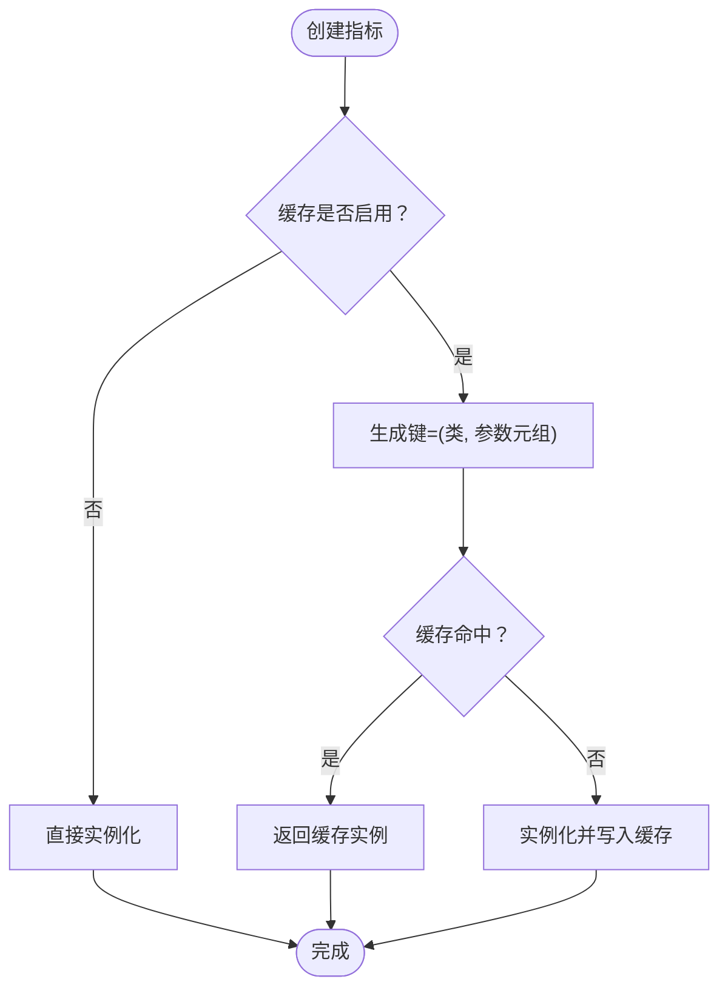
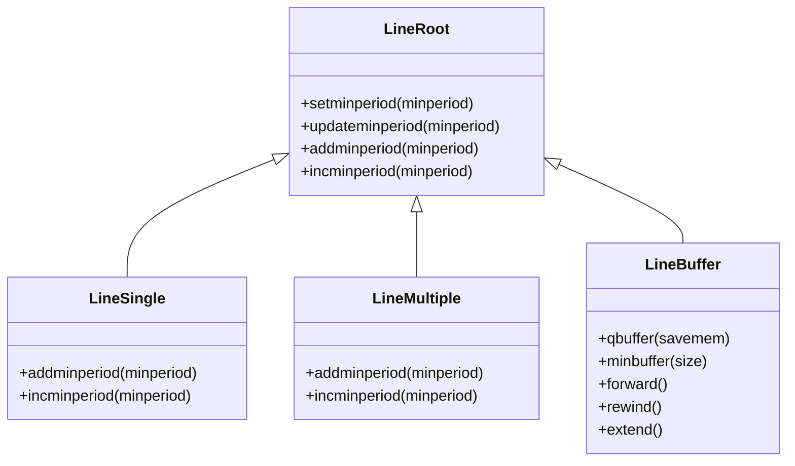
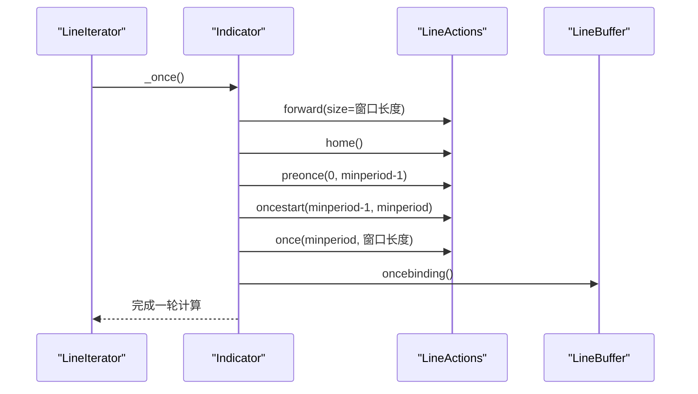
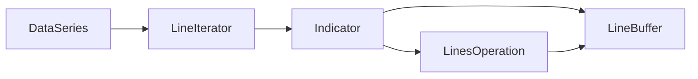

# 指标性能优化

<cite>
**本文档引用的文件**
- [backtrader/indicator.py](file://backtrader/indicator.py)
- [backtrader/metabase.py](file://backtrader/metabase.py)
- [backtrader/linebuffer.py](file://backtrader/linebuffer.py)
- [backtrader/lineiterator.py](file://backtrader/lineiterator.py)
- [backtrader/lineroot.py](file://backtrader/lineroot.py)
- [backtrader/lineseries.py](file://backtrader/lineseries.py)
- [backtrader/cerebro.py](file://backtrader/cerebro.py)
- [backtrader/mathsupport.py](file://backtrader/mathsupport.py)
- [backtrader/indicators/sma.py](file://backtrader/indicators/sma.py)
- [backtrader/indicators/ema.py](file://backtrader/indicators/ema.py)
- [backtrader/indicators/macd.py](file://backtrader/indicators/macd.py)
</cite>

## 目录
1. [简介](#简介)
2. [项目结构](#项目结构)
3. [核心组件](#核心组件)
4. [架构总览](#架构总览)
5. [详细组件分析](#详细组件分析)
6. [依赖关系分析](#依赖关系分析)
7. [性能考量](#性能考量)
8. [故障排查指南](#故障排查指南)
9. [结论](#结论)
10. [附录](#附录)

## 简介
本文件面向Backtrader指标性能优化，系统性梳理框架中的缓存机制、内存管理、向量化执行与并行化潜力，并结合具体指标实现给出可操作的优化建议与最佳实践。重点覆盖：
- 指标对象缓存与清理（MetaIndicator、LineActions缓存）
- 缓冲区与最小周期管理（LineBuffer、LineSeries）
- 向量化计算优势与实现要点（运算链路、批量一次性计算）
- 大数据集处理策略（预加载、精确缓冲、增量推进）
- 并行计算可能性与限制条件
- 性能监控与分析工具使用
- 典型指标类型优化建议与基准测试思路

## 项目结构
Backtrader围绕“线（Line）”与“迭代器（LineIterator）”构建指标与策略的执行框架。核心模块职责如下：
- indicator.py：指标元类与基础类，提供对象缓存与最小周期传播
- linebuffer.py：线缓冲区与运算操作，支持一次性批量计算
- lineiterator.py：指标/观察器的迭代调度，负责next/once阶段与绑定
- lineseries.py：多线容器与别名系统，支撑指标输出与绘图
- lineroot.py：线根接口与最小周期管理
- metabase.py：参数派生与元类基础设施
- cerebro.py：运行时配置（runonce、preload、objcache等），触发缓存开关
- mathsupport.py：数学工具函数（平均、方差、标准差）

**图表来源**
- [backtrader/indicator.py](file://backtrader/indicator.py#L32-L90)
- [backtrader/linebuffer.py](file://backtrader/linebuffer.py#L50-L120)
- [backtrader/lineiterator.py](file://backtrader/lineiterator.py#L148-L200)
- [backtrader/lineseries.py](file://backtrader/lineseries.py#L444-L500)
- [backtrader/lineroot.py](file://backtrader/lineroot.py#L61-L125)
- [backtrader/cerebro.py](file://backtrader/cerebro.py#L60-L120)

**章节来源**
- [backtrader/indicator.py](file://backtrader/indicator.py#L32-L90)
- [backtrader/linebuffer.py](file://backtrader/linebuffer.py#L50-L120)
- [backtrader/lineiterator.py](file://backtrader/lineiterator.py#L148-L200)
- [backtrader/lineseries.py](file://backtrader/lineseries.py#L444-L500)
- [backtrader/lineroot.py](file://backtrader/lineroot.py#L61-L125)
- [backtrader/cerebro.py](file://backtrader/cerebro.py#L60-L120)

## 核心组件
- 指标元类与缓存
  - MetaIndicator提供对象缓存与最小周期传播逻辑，支持cleancache与usecache控制
  - 通过缓存避免重复创建相同参数的指标实例，减少对象开销
- 线缓冲与运算
  - LineBuffer提供定长/环形缓冲、前移/后退、绑定等能力
  - LineActions封装next/once生命周期，支持一次性批量计算
- 调度与最小周期
  - LineIterator统一调度指标/观察器，按最小周期推进
  - 最小周期由数据源与子指标共同决定，确保稳定收敛
- 多线容器
  - LineSeries与Lines提供多线输出与别名访问，便于绘图与观测

**章节来源**
- [backtrader/indicator.py](file://backtrader/indicator.py#L32-L90)
- [backtrader/linebuffer.py](file://backtrader/linebuffer.py#L50-L120)
- [backtrader/lineiterator.py](file://backtrader/lineiterator.py#L148-L200)
- [backtrader/lineseries.py](file://backtrader/lineseries.py#L84-L180)

## 架构总览
Backtrader采用“事件驱动+向量化”的混合模式：
- runonce=True时，指标在once阶段进行批量计算，显著降低循环开销
- runonce=False时，逐条推进，适合实时或需要细粒度控制的场景
- objcache可启用对象缓存，减少重复实例化；但需谨慎使用以避免最小周期错配

**图表来源**
- [backtrader/lineiterator.py](file://backtrader/lineiterator.py#L259-L320)
- [backtrader/linebuffer.py](file://backtrader/linebuffer.py#L612-L635)
- [backtrader/cerebro.py](file://backtrader/cerebro.py#L69-L82)

**章节来源**
- [backtrader/lineiterator.py](file://backtrader/lineiterator.py#L259-L320)
- [backtrader/linebuffer.py](file://backtrader/linebuffer.py#L612-L635)
- [backtrader/cerebro.py](file://backtrader/cerebro.py#L69-L82)

## 详细组件分析

### 指标缓存机制与cleancache应用
- 对象缓存
  - MetaIndicator与LineActions均维护内部缓存字典，键为(类, 参数元组)，命中则复用实例
  - 支持usecache/on开关与cleancache清理，避免状态污染
- 使用建议
  - 在策略/指标参数固定且重复出现时开启缓存
  - 切换策略或重置环境时调用cleancache，防止旧实例影响新计算

**图表来源**
- [backtrader/indicator.py](file://backtrader/indicator.py#L51-L65)
- [backtrader/linebuffer.py](file://backtrader/linebuffer.py#L520-L535)

**章节来源**
- [backtrader/indicator.py](file://backtrader/indicator.py#L39-L65)
- [backtrader/linebuffer.py](file://backtrader/linebuffer.py#L512-L535)
- [backtrader/cerebro.py](file://backtrader/cerebro.py#L1055-L1059)

### 缓冲区与最小周期管理
- LineBuffer
  - 支持定长环形缓冲（QBuffer）与无界缓冲，按最小周期调整容量
  - 提供forward/rewind/extend等操作，保证索引一致性
- 最小周期传播
  - 指标/运算节点根据输入数据与子指标的最小周期取最大值
  - 运行时通过qbuffer/minbuffer确保缓冲满足计算需求

**图表来源**
- [backtrader/lineroot.py](file://backtrader/lineroot.py#L104-L131)
- [backtrader/lineroot.py](file://backtrader/lineroot.py#L345-L360)
- [backtrader/linebuffer.py](file://backtrader/linebuffer.py#L121-L148)

**章节来源**
- [backtrader/lineroot.py](file://backtrader/lineroot.py#L104-L131)
- [backtrader/linebuffer.py](file://backtrader/linebuffer.py#L121-L148)

### 向量化计算与批处理
- 一次性计算（once）
  - 在once阶段对整个可用窗口进行批量计算，避免逐条循环的Python开销
  - LineActions._once会先preonce再oncestart最后once，确保最小周期边界正确
- 运算链路
  - LinesOperation在once阶段使用循环遍历数组，避免频繁条件判断
  - 可结合外部库（如NumPy）进一步优化，但需注意与现有缓冲区接口的适配

**图表来源**
- [backtrader/lineiterator.py](file://backtrader/lineiterator.py#L293-L323)
- [backtrader/linebuffer.py](file://backtrader/linebuffer.py#L625-L635)

**章节来源**
- [backtrader/lineiterator.py](file://backtrader/lineiterator.py#L293-L323)
- [backtrader/linebuffer.py](file://backtrader/linebuffer.py#L705-L795)

### 大数据集处理策略
- 预加载（preload）
  - 将数据完全载入内存，避免IO阻塞，提升指标计算速度
- 精确缓冲（exactbars）
  - 仅保留最小必要缓冲，显著节省内存，但会禁用绘图
- 增量推进（runonce=False）
  - 逐条推进，适合实时流式数据或需要细粒度控制的场景

**章节来源**
- [backtrader/cerebro.py](file://backtrader/cerebro.py#L121-L162)

### 指标类型优化建议
- 移动平均类（SMA/EMA）
  - 优先使用once批量计算路径，避免逐条循环
  - EMA可利用指数平滑递推公式，减少重复计算
- 组合类（MACD）
  - 将底层移动平均作为子指标，利用最小周期传播与共享缓冲
  - 在once阶段一次性计算各子序列，减少多次遍历

**章节来源**
- [backtrader/indicators/sma.py](file://backtrader/indicators/sma.py#L27-L46)
- [backtrader/indicators/ema.py](file://backtrader/indicators/ema.py#L27-L56)
- [backtrader/indicators/macd.py](file://backtrader/indicators/macd.py#L27-L64)

## 依赖关系分析
- 指标到缓冲区
  - Indicator通过LineIterator注册到拥有者，最终落盘到LineBuffer
- 运算链路
  - 指标间运算（如MACD）通过LineActions与LinesOperation形成链式
- 最小周期耦合
  - 数据源、子指标与运算节点共同决定最终最小周期

**图表来源**
- [backtrader/lineiterator.py](file://backtrader/lineiterator.py#L106-L145)
- [backtrader/linebuffer.py](file://backtrader/linebuffer.py#L705-L795)

**章节来源**
- [backtrader/lineiterator.py](file://backtrader/lineiterator.py#L106-L145)
- [backtrader/linebuffer.py](file://backtrader/linebuffer.py#L705-L795)

## 性能考量
- 缓存策略
  - 开启objcache可减少重复实例化，但需配合cleancache避免状态污染
  - 对于参数空间较大的策略，谨慎开启缓存
- 向量化优先
  - 尽可能使用runonce=True，让指标在once阶段完成批量计算
  - 在指标内部避免Python级循环，尽量使用链式运算与一次性遍历
- 内存占用
  - exactbars=1时仅保留最小缓冲，适合超大规模回测
  - 需要绘图时可考虑exactbars=-1/-2的折中方案
- 数学计算
  - 使用高精度求和与统计函数，减少数值误差累积

**章节来源**
- [backtrader/cerebro.py](file://backtrader/cerebro.py#L69-L82)
- [backtrader/cerebro.py](file://backtrader/cerebro.py#L121-L162)
- [backtrader/mathsupport.py](file://backtrader/mathsupport.py#L27-L65)

## 故障排查指南
- 指标未更新或显示NaN
  - 检查最小周期是否满足，确认preonce/oncestart/nextstart流程
  - 确认缓冲区forward/rewind/extend调用顺序正确
- 缓存导致的状态错乱
  - 切换策略或重置环境后调用cleancache
  - 关闭objcache后重试，定位是否由缓存引起
- 内存不足或过慢
  - 启用preload并适当提高exactbars策略
  - 将部分非关键指标降级为once=False或关闭绘图

**章节来源**
- [backtrader/lineiterator.py](file://backtrader/lineiterator.py#L323-L355)
- [backtrader/linebuffer.py](file://backtrader/linebuffer.py#L247-L285)
- [backtrader/indicator.py](file://backtrader/indicator.py#L39-L46)
- [backtrader/cerebro.py](file://backtrader/cerebro.py#L1055-L1059)

## 结论
Backtrader通过“事件驱动+向量化”的组合模式，在灵活性与性能之间取得平衡。优化的关键在于：
- 正确使用缓存与cleancache，避免对象状态污染
- 优先启用runonce与一次性计算路径，减少Python循环开销
- 合理设置缓冲策略与最小周期，兼顾内存与性能
- 针对不同指标类型采用合适的实现方式（递推、链式运算、批处理）

## 附录
- 性能监控与分析
  - 使用Cerebro内置计时与日志功能，对比不同配置下的运行时间
  - 在指标内部插入轻量计时点，定位热点路径
- 基准测试建议
  - 固定数据规模与参数，对比runonce与runonce=False的差异
  - 对比开启/关闭objcache的指标实例化成本与运行时开销
  - 针对不同指标类型（移动平均、组合类、趋势类）分别评估