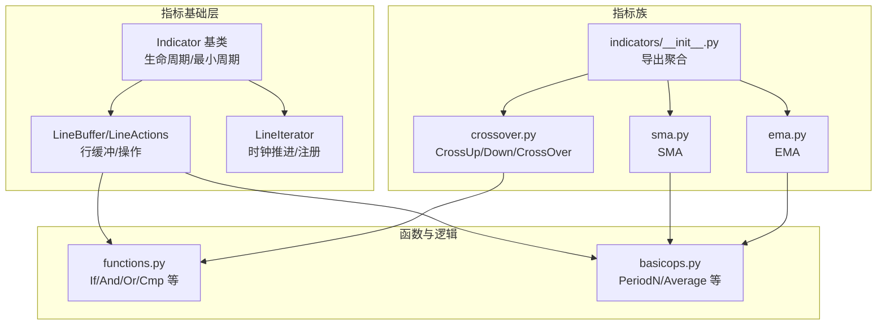
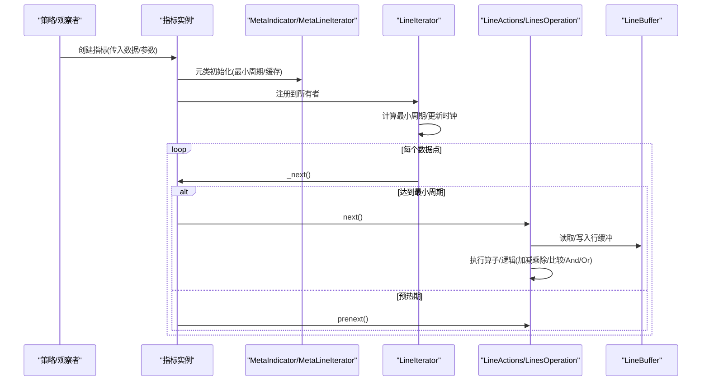
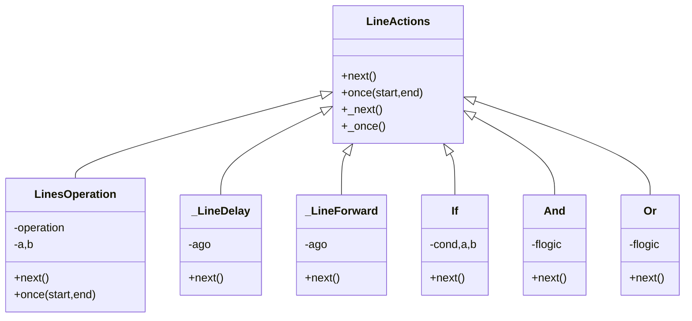
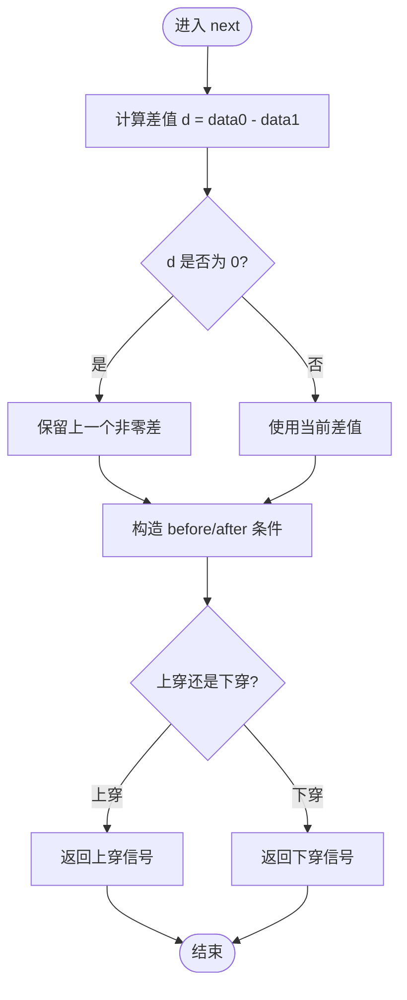
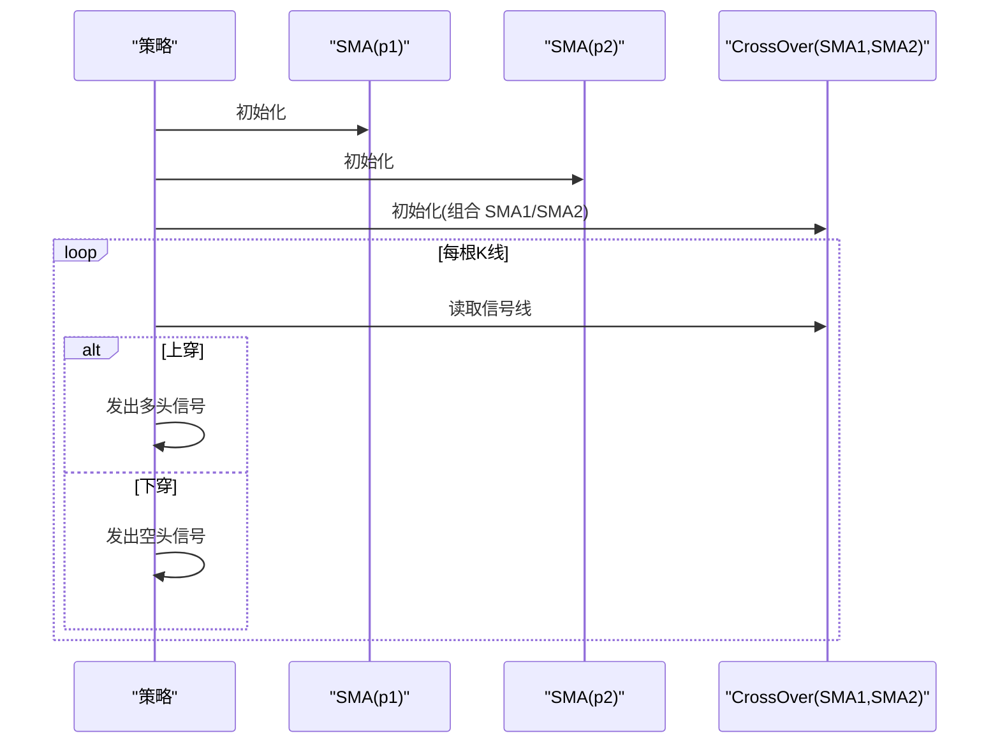
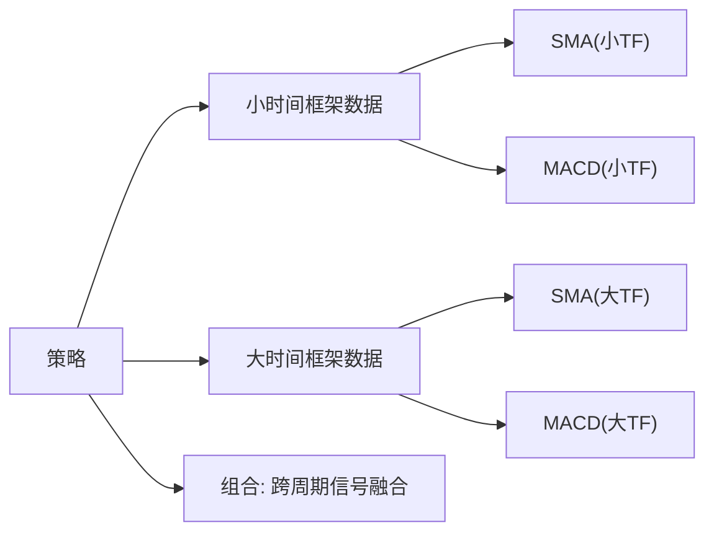
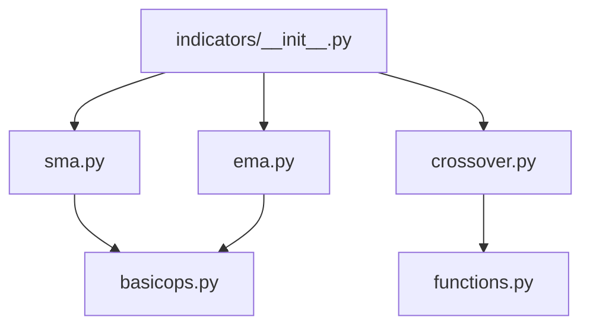

# 指标组合与复合

<cite>
**本文引用的文件**
- [backtrader/indicator.py](file://backtrader/indicator.py)
- [backtrader/linebuffer.py](file://backtrader/linebuffer.py)
- [backtrader/lineiterator.py](file://backtrader/lineiterator.py)
- [backtrader/functions.py](file://backtrader/functions.py)
- [backtrader/indicators/__init__.py](file://backtrader/indicators/__init__.py)
- [backtrader/indicators/crossover.py](file://backtrader/indicators/crossover.py)
- [backtrader/indicators/basicops.py](file://backtrader/indicators/basicops.py)
- [backtrader/indicators/sma.py](file://backtrader/indicators/sma.py)
- [backtrader/indicators/ema.py](file://backtrader/indicators/ema.py)
- [samples/sigsmacross/sigsmacross.py](file://samples/sigsmacross/sigsmacross.py)
- [samples/data-multitimeframe/data-multitimeframe.py](file://samples/data-multitimeframe/data-multitimeframe.py)
</cite>

## 目录
1. [引言](#引言)
2. [项目结构](#项目结构)
3. [核心组件](#核心组件)
4. [架构总览](#架构总览)
5. [详细组件分析](#详细组件分析)
6. [依赖关系分析](#依赖关系分析)
7. [性能考量](#性能考量)
8. [故障排查指南](#故障排查指南)
9. [结论](#结论)
10. [附录](#附录)

## 引言
本文件面向Backtrader中“指标组合与复合”的主题，系统讲解如何将多个简单指标通过数学与逻辑运算组合成复合指标；深入解析交叉指示器（crossover）的原理与用法；介绍振荡器类指标的组合与背离分析、多时间框架分析等高级技术；给出复合指标在技术信号融合、多因子选股等场景中的应用思路；并总结复合指标的性能考虑与优化策略，以及测试与验证方法。

## 项目结构
Backtrader的核心运行时由“指标基类”“行缓冲区”“行迭代器”“函数工具”等模块构成。指标组合的关键在于：
- 指标基类负责生命周期与最小周期管理；
- 行缓冲区提供延迟/前移、绑定、操作等能力；
- 行迭代器负责按数据时钟推进计算；
- 函数工具提供逻辑与比较类复合操作；
- 指标子模块提供具体技术指标与组合器。

**图表来源**
- [backtrader/indicator.py](file://backtrader/indicator.py#L90-L165)
- [backtrader/linebuffer.py](file://backtrader/linebuffer.py#L50-L120)
- [backtrader/lineiterator.py](file://backtrader/lineiterator.py#L148-L200)
- [backtrader/functions.py](file://backtrader/functions.py#L37-L259)
- [backtrader/indicators/basicops.py](file://backtrader/indicators/basicops.py#L33-L115)
- [backtrader/indicators/sma.py](file://backtrader/indicators/sma.py#L27-L46)
- [backtrader/indicators/ema.py](file://backtrader/indicators/ema.py#L27-L56)
- [backtrader/indicators/__init__.py](file://backtrader/indicators/__init__.py#L24-L91)

**章节来源**
- [backtrader/indicators/__init__.py](file://backtrader/indicators/__init__.py#L24-L91)

## 核心组件
- 指标基类与元类：负责缓存、最小周期推导、next/once 生命周期、预热与执行阶段。
- 行缓冲与行动作：支持延迟/前移、绑定、算子操作（加减乘除、比较、逻辑），并自动传播到绑定线。
- 行迭代器：统一推进时钟、注册子指标、最小周期重算。
- 逻辑与比较：提供 If、And、Or、Cmp、DivByZero 等复合逻辑，便于构建条件表达式与分支。
- 组合算子：PeriodN、Average、ExponentialSmoothing 等，用于构造复合指标。

**章节来源**
- [backtrader/indicator.py](file://backtrader/indicator.py#L90-L165)
- [backtrader/linebuffer.py](file://backtrader/linebuffer.py#L50-L120)
- [backtrader/linebuffer.py](file://backtrader/linebuffer.py#L705-L805)
- [backtrader/lineiterator.py](file://backtrader/lineiterator.py#L148-L200)
- [backtrader/functions.py](file://backtrader/functions.py#L37-L259)
- [backtrader/indicators/basicops.py](file://backtrader/indicators/basicops.py#L33-L115)

## 架构总览
复合指标的运行时流程如下：策略或观察者创建指标实例，指标通过元类与行迭代器注册到所有者；行缓冲区在每次推进时根据最小周期决定调用 prenext/nextstart/next；逻辑与算子在 next 中按需组合两个或多个指标线，形成新的输出线。

**图表来源**
- [backtrader/indicator.py](file://backtrader/indicator.py#L90-L165)
- [backtrader/lineiterator.py](file://backtrader/lineiterator.py#L259-L355)
- [backtrader/linebuffer.py](file://backtrader/linebuffer.py#L705-L805)

## 详细组件分析

### 数学与逻辑运算符：构建复合指标
- 算子与延迟/前移：行缓冲区提供延迟/前移对象，可对任意指标线进行 ago/forward 操作，从而对齐不同时间偏移。
- 双操作数算子：LinesOperation 支持二元算子（加减乘除、比较、时间比较等），自动处理行与标量、行与时间的混合运算。
- 一元与周期算子：PeriodN/Average/ExponentialSmoothing 等以周期为单位对数据窗口进行聚合或平滑，作为复合指标的基础单元。
- 逻辑与分支：If/And/Or/Cmp 等逻辑类，允许将多个指标的布尔条件组合为新的信号线。

**图表来源**
- [backtrader/linebuffer.py](file://backtrader/linebuffer.py#L705-L805)
- [backtrader/linebuffer.py](file://backtrader/linebuffer.py#L647-L704)
- [backtrader/functions.py](file://backtrader/functions.py#L172-L259)

**章节来源**
- [backtrader/linebuffer.py](file://backtrader/linebuffer.py#L705-L805)
- [backtrader/functions.py](file://backtrader/functions.py#L37-L259)
- [backtrader/indicators/basicops.py](file://backtrader/indicators/basicops.py#L33-L115)

### 交叉指示器（crossover）：上穿/下穿检测
- NonZeroDifference：跟踪两线差值，若当前差为0则保留上一个非零差，避免“零差”导致的误判。
- _CrossBase：基于 NonZeroDifference 的“最近非零差”与当前/滞后位置的大小关系，构造布尔条件。
- CrossUp/CrossDown：分别检测上穿与下穿。
- CrossOver：将上穿与下穿相减，得到 {-1, 0, 1} 的三态信号。

**图表来源**
- [backtrader/indicators/crossover.py](file://backtrader/indicators/crossover.py#L27-L139)

**章节来源**
- [backtrader/indicators/crossover.py](file://backtrader/indicators/crossover.py#L27-L139)

### 指标组合示例：SMA 交叉策略
- 使用 SMA(period=p1) 与 SMA(period=p2)，再用 CrossOver 将两条均线的交叉信号转为三态信号，作为交易信号源。
- 示例策略直接将 CrossOver 作为信号输入，实现多空入场。

**图表来源**
- [samples/sigsmacross/sigsmacross.py](file://samples/sigsmacross/sigsmacross.py#L46-L51)
- [backtrader/indicators/sma.py](file://backtrader/indicators/sma.py#L27-L46)
- [backtrader/indicators/crossover.py](file://backtrader/indicators/crossover.py#L112-L139)

**章节来源**
- [samples/sigsmacross/sigsmacross.py](file://samples/sigsmacross/sigsmacross.py#L46-L51)

### 多时间框架与复合指标
- 在多时间框架场景中，可在小时间框架与大时间框架分别计算同一指标（如 SMA），然后在策略中组合使用，形成“跨周期确认”。
- 示例展示了在日线与周线分别计算 SMA 并叠加 MACD，用于对比不同周期下的趋势一致性。

**图表来源**
- [samples/data-multitimeframe/data-multitimeframe.py](file://samples/data-multitimeframe/data-multitimeframe.py#L40-L47)

**章节来源**
- [samples/data-multitimeframe/data-multitimeframe.py](file://samples/data-multitimeframe/data-multitimeframe.py#L40-L47)

### 振荡器与背离分析：组合思路
- 振荡器类指标（RSI、Stochastic、MACD 等）常用于超买/超卖判断与动量背离分析。
- 组合思路：
  - 将价格与震荡器指标错位比较，识别价格创新高但震荡器不创新高的顶背离，或价格创新低而震荡器不创新低的底背离。
  - 使用 Delay/Forward 对齐不同时间偏移，结合 If/And/Or 构建背离信号线。
  - 结合趋势指标（如 MA/SMA）过滤方向，仅做单边交易。

说明：上述为概念性流程图，未直接映射到具体源码文件。

## 依赖关系分析
- 指标导出聚合：indicators/__init__.py 将各类指标模块统一导出，便于 bt.ind.* 快速访问。
- 组合依赖链：
  - SMA/EMA 依赖 basicops 的 Average/ExponentialSmoothing；
  - CrossOver 依赖 crossover 模块与 functions 的 And；
  - 行缓冲区与逻辑类共同支撑复合指标的算子与分支。

**图表来源**
- [backtrader/indicators/__init__.py](file://backtrader/indicators/__init__.py#L24-L91)
- [backtrader/indicators/sma.py](file://backtrader/indicators/sma.py#L27-L46)
- [backtrader/indicators/ema.py](file://backtrader/indicators/ema.py#L27-L56)
- [backtrader/indicators/crossover.py](file://backtrader/indicators/crossover.py#L24-L80)
- [backtrader/functions.py](file://backtrader/functions.py#L229-L239)
- [backtrader/indicators/basicops.py](file://backtrader/indicators/basicops.py#L33-L115)

**章节来源**
- [backtrader/indicators/__init__.py](file://backtrader/indicators/__init__.py#L24-L91)

## 性能考量
- 最小周期与预热：指标的最小周期决定了何时开始 nextstart/next，过长的周期会拖慢回测初期的启动速度。可通过合理设置参数与组合策略降低最小周期。
- 缓存与对象复用：MetaIndicator/MetaLineActions 提供对象缓存开关，可减少重复创建带来的开销。
- 行缓冲模式：QBuffer 模式可限制内存占用，适合长时间序列与高频数据。
- 算子与逻辑：优先使用向量化/批处理的 once 流程，避免在 next 中频繁构造复杂条件；尽量将逻辑合并为单一指标线，减少中间变量。
- 多时间框架：跨周期计算会增加数据长度差异与同步成本，应谨慎选择压缩倍数与同步策略。

**章节来源**
- [backtrader/indicator.py](file://backtrader/indicator.py#L32-L66)
- [backtrader/linebuffer.py](file://backtrader/linebuffer.py#L121-L148)
- [backtrader/lineiterator.py](file://backtrader/lineiterator.py#L169-L177)

## 故障排查指南
- 信号“跳变”或“零差”问题：交叉信号可能因差值为0而被忽略。建议使用 NonZeroDifference 或在组合中显式检查前后状态变化。
- 时间偏移不一致：不同时间框架或不同周期的指标对齐不当会导致误判。使用 LineDelay/LineForward 明确 ago/forward 偏移，并确保最小周期正确累加。
- 逻辑分支错误：If/And/Or 的条件顺序与短路行为需明确，必要时拆分为多个中间指标线以便调试。
- 内存与性能：当指标数量较多或时间框架较多时，启用 QBuffer 并关闭不必要的绘图；评估是否需要 runonce=False。

**章节来源**
- [backtrader/indicators/crossover.py](file://backtrader/indicators/crossover.py#L27-L139)
- [backtrader/linebuffer.py](file://backtrader/linebuffer.py#L647-L704)
- [backtrader/functions.py](file://backtrader/functions.py#L172-L259)

## 结论
Backtrader 的指标体系通过“指标基类 + 行缓冲 + 行迭代器 + 逻辑/算子”实现了强大的复合能力。利用数学与逻辑运算符，可以将多个简单指标组合为复杂的信号线；交叉指示器提供了稳健的上穿/下穿检测；多时间框架与振荡器组合则为背离分析与趋势确认提供了灵活手段。在实践中，应重视最小周期、缓存与内存模式的选择，并通过清晰的组合与严格的测试验证来提升稳定性与性能。

## 附录
- 实际应用示例路径
  - SMA 交叉策略：[samples/sigsmacross/sigsmacross.py](file://samples/sigsmacross/sigsmacross.py#L46-L51)
  - 多时间框架示例：[samples/data-multitimeframe/data-multitimeframe.py](file://samples/data-multitimeframe/data-multitimeframe.py#L40-L47)
- 关键实现参考路径
  - 指标基类与元类：[backtrader/indicator.py](file://backtrader/indicator.py#L90-L165)
  - 行缓冲与算子：[backtrader/linebuffer.py](file://backtrader/linebuffer.py#L705-L805)
  - 逻辑与比较：[backtrader/functions.py](file://backtrader/functions.py#L172-L259)
  - SMA/EMA 组合基础：[backtrader/indicators/sma.py](file://backtrader/indicators/sma.py#L27-L46)、[backtrader/indicators/ema.py](file://backtrader/indicators/ema.py#L27-L56)
  - 交叉指标：[backtrader/indicators/crossover.py](file://backtrader/indicators/crossover.py#L27-L139)