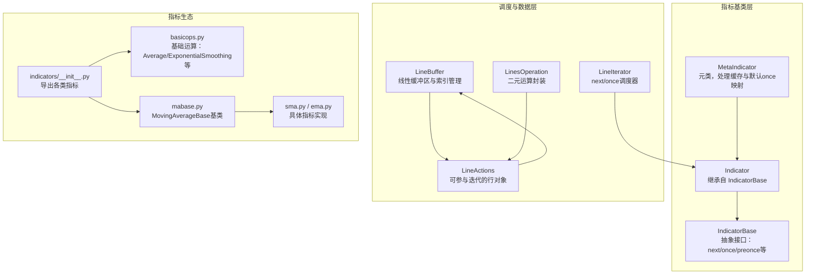
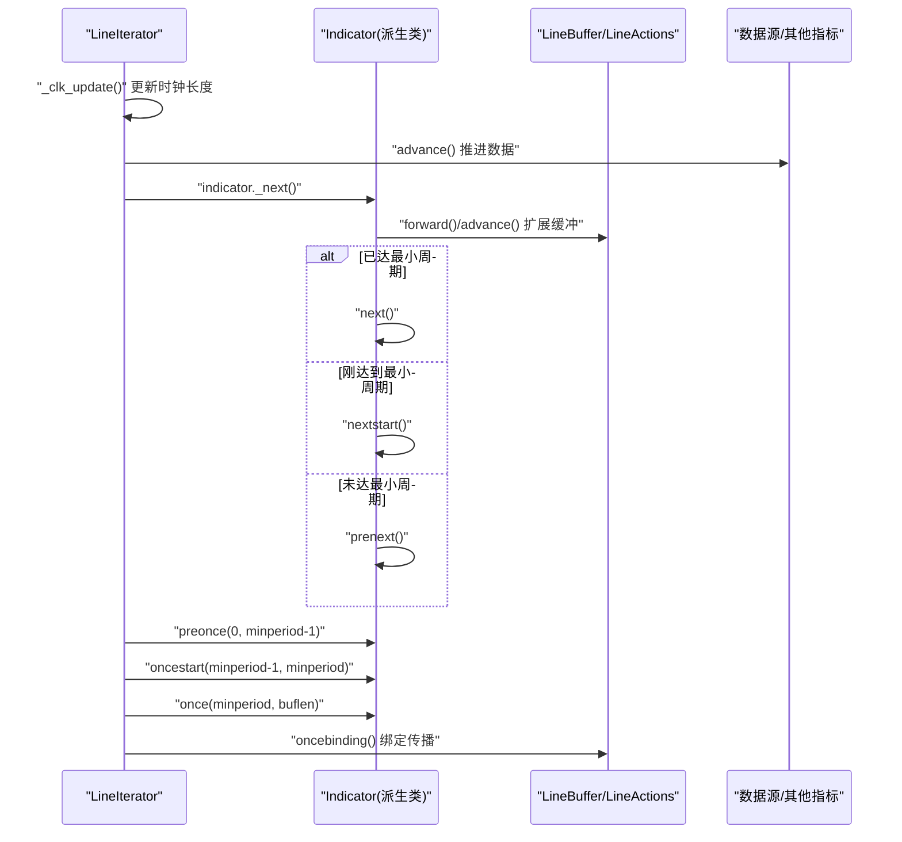
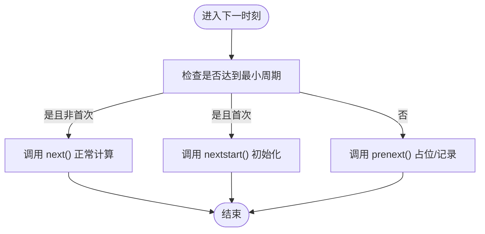
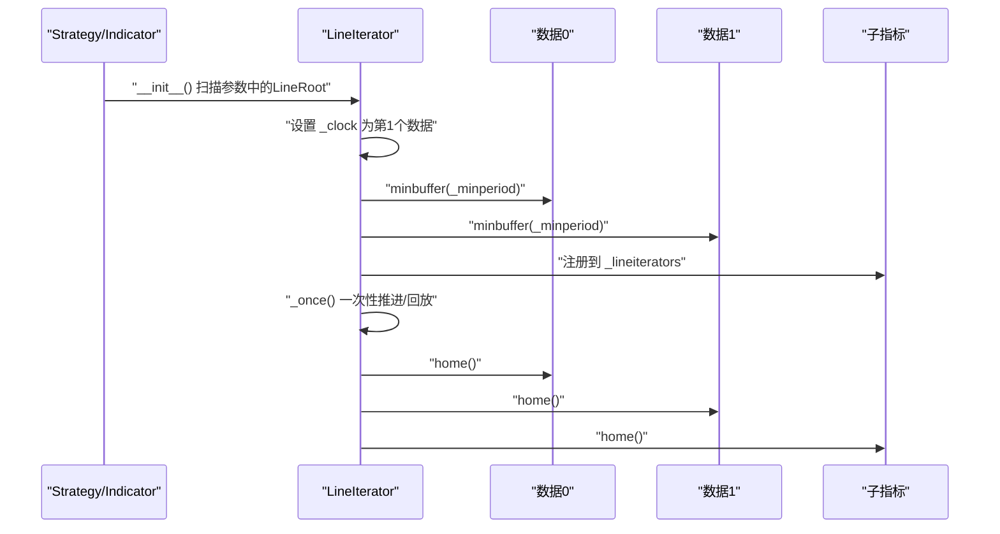
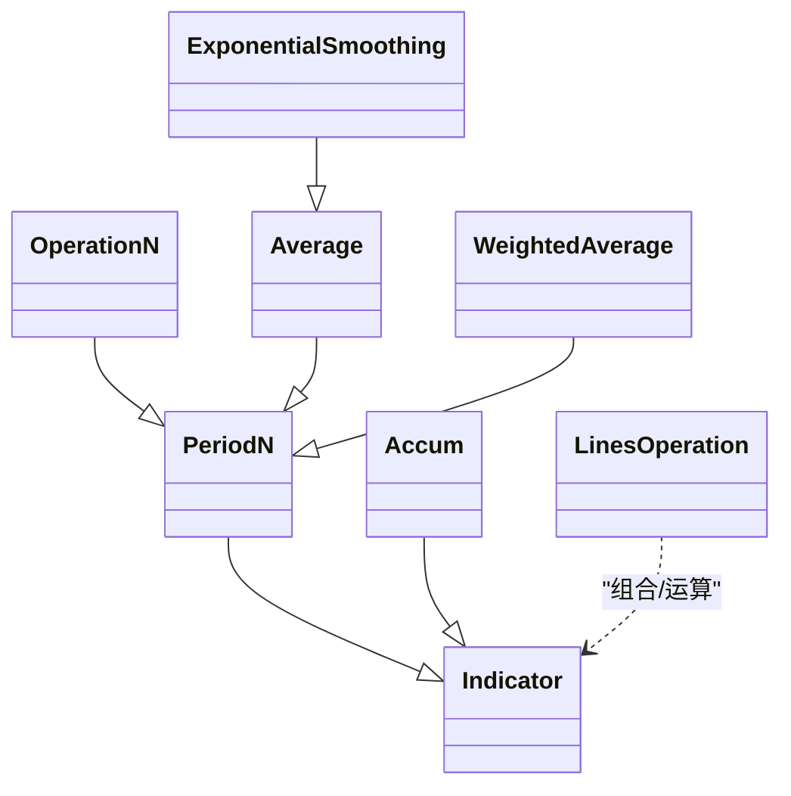
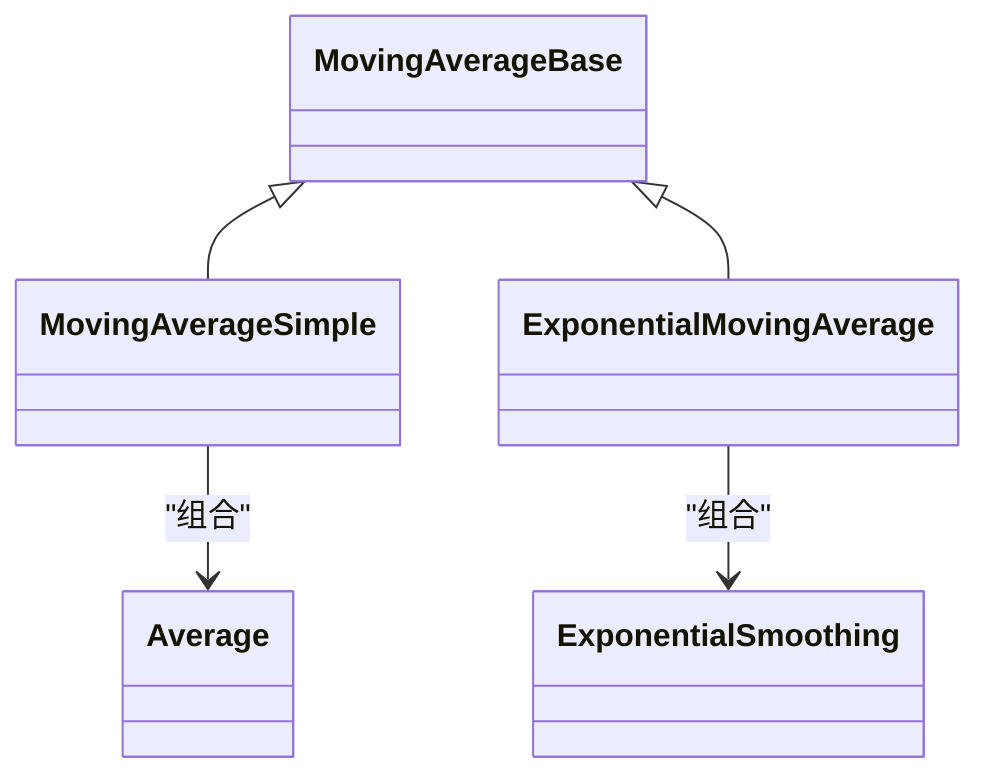
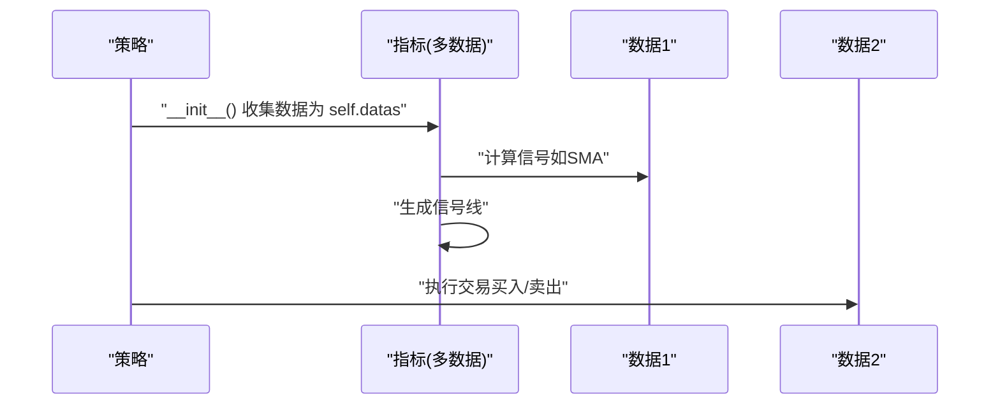
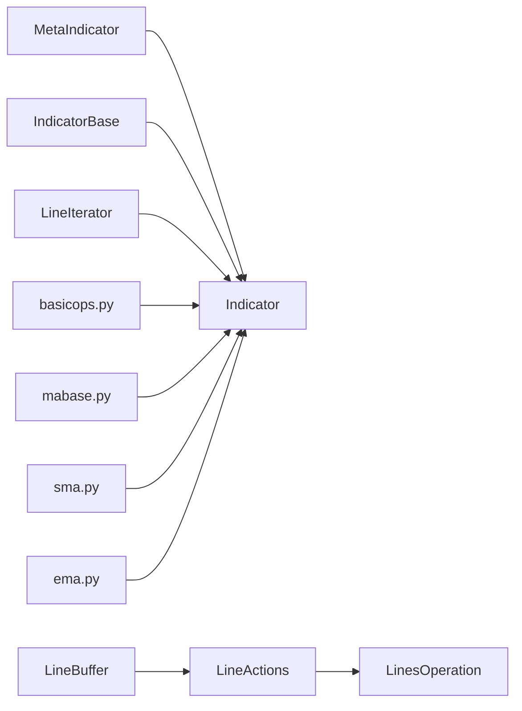

# 自定义指标开发

<cite>
**本文引用的文件**
- [backtrader/indicator.py](file://backtrader/indicator.py)
- [backtrader/lineiterator.py](file://backtrader/lineiterator.py)
- [backtrader/linebuffer.py](file://backtrader/linebuffer.py)
- [backtrader/indicators/basicops.py](file://backtrader/indicators/basicops.py)
- [backtrader/indicators/__init__.py](file://backtrader/indicators/__init__.py)
- [backtrader/indicators/mabase.py](file://backtrader/indicators/mabase.py)
- [backtrader/indicators/sma.py](file://backtrader/indicators/sma.py)
- [backtrader/indicators/ema.py](file://backtrader/indicators/ema.py)
- [samples/multidata-strategy/multidata-strategy.py](file://samples/multidata-strategy/multidata-strategy.py)
- [samples/multidata-strategy/multidata-strategy-unaligned.py](file://samples/multidata-strategy/multidata-strategy-unaligned.py)
- [tests/test_ind_sma.py](file://tests/test_ind_sma.py)
- [tests/test_ind_ema.py](file://tests/test_ind_ema.py)
- [tests/testcommon.py](file://tests/testcommon.py)
</cite>

## 目录
1. [简介](#简介)
2. [项目结构](#项目结构)
3. [核心组件](#核心组件)
4. [架构总览](#架构总览)
5. [详细组件分析](#详细组件分析)
6. [依赖关系分析](#依赖关系分析)
7. [性能考虑](#性能考虑)
8. [故障排查指南](#故障排查指南)
9. [结论](#结论)
10. [附录：开发示例与最佳实践](#附录开发示例与最佳实践)

## 简介
本指南面向希望在Backtrader中开发自定义指标的工程师与研究者，系统讲解如何继承Indicator基类构建指标，涵盖类结构设计、参数定义、计算逻辑实现（next、once、preonce、nextstart等）、多数据输入与时间对齐、数学运算支持（basicops模块）、复合指标组合、测试与调试以及性能优化建议。文档以代码级分析为基础，辅以流程图与时序图，帮助读者快速上手并构建稳定高效的指标。

## 项目结构
Backtrader的核心指标框架由以下模块构成：
- 指标基类与元类：Indicator、MetaIndicator、IndicatorBase
- 计算调度器：LineIterator、DataAccessor、StrategyBase
- 数据缓冲与运算：LineBuffer、LineActions、LinesOperation
- 指标注册与导出：indicators/__init__.py
- 基础运算与常用指标：indicators/basicops.py、mabase.py、sma.py、ema.py
- 示例与测试：samples/multidata-strategy、tests/*、samples/memory-savings

图表来源
- [backtrader/indicator.py](file://backtrader/indicator.py#L90-L165)
- [backtrader/lineiterator.py](file://backtrader/lineiterator.py#L148-L378)
- [backtrader/linebuffer.py](file://backtrader/linebuffer.py#L50-L130)
- [backtrader/indicators/basicops.py](file://backtrader/indicators/basicops.py#L33-L92)
- [backtrader/indicators/__init__.py](file://backtrader/indicators/__init__.py#L24-L91)

章节来源
- [backtrader/indicator.py](file://backtrader/indicator.py#L90-L165)
- [backtrader/lineiterator.py](file://backtrader/lineiterator.py#L148-L378)
- [backtrader/linebuffer.py](file://backtrader/linebuffer.py#L50-L130)
- [backtrader/indicators/__init__.py](file://backtrader/indicators/__init__.py#L24-L91)

## 核心组件
- 指标基类与元类
  - Indicator：继承自IndicatorBase，提供advance、once_via_next、preonce_via_prenext、oncestart_via_nextstart等机制，自动适配不同长度数据的时间推进。
  - MetaIndicator：负责类实例缓存、检测是否同时重写next与once，并在仅重写next时自动补全once/preonce/oncestart的实现。
- 调度器
  - LineIterator：统一调度next/once生命周期，维护_clock（主数据时钟），根据_minperiod决定调用preonce/oncestart/once或next/nextstart/prenext。
- 数据缓冲与运算
  - LineBuffer：提供双向索引、前向/后退、扩展、绑定等能力；支持时间戳访问与比较。
  - LineActions：实现_linebuffer的最小接口，提供_next/_once，自动处理缓冲区前进与最小周期判断。
  - LinesOperation：封装二元运算（加减乘除、比较、时间运算等），在once路径下采用循环而非map以保持清晰性。
- 指标生态
  - indicators/__init__.py：集中导出所有内置指标，便于用户直接引用。
  - basicops.py：提供PeriodN、OperationN、Average、ExponentialSmoothing、Accum、WeightedAverage等基础运算类，是构建复合指标的基石。
  - mabase.py、sma.py、ema.py：MovingAverageBase作为基类，SMA/EMA通过组合basicops实现。

章节来源
- [backtrader/indicator.py](file://backtrader/indicator.py#L90-L165)
- [backtrader/lineiterator.py](file://backtrader/lineiterator.py#L259-L331)
- [backtrader/linebuffer.py](file://backtrader/linebuffer.py#L50-L130)
- [backtrader/indicators/basicops.py](file://backtrader/indicators/basicops.py#L33-L92)
- [backtrader/indicators/mabase.py](file://backtrader/indicators/mabase.py#L89-L92)
- [backtrader/indicators/sma.py](file://backtrader/indicators/sma.py#L27-L46)
- [backtrader/indicators/ema.py](file://backtrader/indicators/ema.py#L27-L56)

## 架构总览
Backtrader指标的执行分为“逐根推进”（next）与“一次性回放”（once）两种模式。调度器根据各数据源与子指标的最小周期，决定何时进入preonce、oncestart、once、next、nextstart、prenext阶段。

图表来源
- [backtrader/lineiterator.py](file://backtrader/lineiterator.py#L259-L331)
- [backtrader/linebuffer.py](file://backtrader/linebuffer.py#L612-L634)
- [backtrader/indicator.py](file://backtrader/indicator.py#L95-L137)

## 详细组件分析

### 指标基类与生命周期方法
- next：在满足最小周期后，对当前时刻进行常规计算。
- nextstart：仅在首次达到最小周期时调用一次，适合初始化种子值或一次性预处理。
- prenext：在未达到最小周期前的“预热期”，用于占位或记录状态。
- once：一次性回放模式下的计算，覆盖从minperiod到buflen的区间。
- oncestart：一次性回放模式下的首段计算。
- preonce：一次性回放模式下的预热段计算。
- 元类自动补全：若仅重写next，MetaIndicator会自动注入once/preonce/oncestart的实现，确保runonce模式也能正确运行。

图表来源
- [backtrader/lineiterator.py](file://backtrader/lineiterator.py#L259-L285)
- [backtrader/indicator.py](file://backtrader/indicator.py#L101-L137)

章节来源
- [backtrader/lineiterator.py](file://backtrader/lineiterator.py#L259-L331)
- [backtrader/indicator.py](file://backtrader/indicator.py#L95-L137)

### 多数据输入与时间同步
- 数据接入：MetaLineIterator在构造时扫描参数中的LineRoot对象，自动设置self.datas与别名（如data/data0/data1…），并将第一个数据作为_clock。
- 时间推进：Indicator.advance会在自身长度小于_clock时推进lines，保证不同时间尺度的数据能正确对齐。
- 同步策略：当runonce=False时，可通过SingleCoupler/MultiCoupler对齐不同长度的LineBuffer；当runonce=True时，LineIterator._once会先forward到最大长度，再home回到起点，确保一次性回放的正确性。

图表来源
- [backtrader/lineiterator.py](file://backtrader/lineiterator.py#L38-L146)
- [backtrader/indicator.py](file://backtrader/indicator.py#L95-L100)

章节来源
- [backtrader/lineiterator.py](file://backtrader/lineiterator.py#L38-L146)
- [backtrader/indicator.py](file://backtrader/indicator.py#L95-L100)

### 数学运算支持（basicops模块）
- 基础类
  - PeriodN：为需要period参数的指标提供最小周期。
  - OperationN：基于函数func对最近period个数据进行聚合计算。
  - Average/ExponentialSmoothing/WeightedAverage/Accum：常见统计与平滑操作。
- 运算封装
  - LinesOperation：封装二元运算（数值、时间、反向运算），在once路径采用显式循环，便于调试与性能控制。
- 使用建议
  - 在指标中优先复用basicops类，减少重复实现，提升一致性与可测试性。
  - 对于动态权重或动态alpha，注意指标的_minperiod叠加与传播。

图表来源
- [backtrader/indicators/basicops.py](file://backtrader/indicators/basicops.py#L33-L92)
- [backtrader/indicators/basicops.py](file://backtrader/indicators/basicops.py#L341-L365)
- [backtrader/indicators/basicops.py](file://backtrader/indicators/basicops.py#L367-L413)
- [backtrader/indicators/basicops.py](file://backtrader/indicators/basicops.py#L458-L495)
- [backtrader/linebuffer.py](file://backtrader/linebuffer.py#L705-L725)

章节来源
- [backtrader/indicators/basicops.py](file://backtrader/indicators/basicops.py#L33-L92)
- [backtrader/linebuffer.py](file://backtrader/linebuffer.py#L705-L725)

### 复合指标开发
- 组合策略
  - 通过将多个简单指标作为子指标组合，形成更复杂的信号或因子。
  - 使用bind2lines将内部线与外部线绑定，实现输出对齐与可视化。
- 示例参考
  - SMA/EMA通过将Average/ExponentialSmoothing作为self.lines[0]实现，体现了“组合优于继承”的思想。
  - MovingAverageBase作为基类，配合basicops类，形成可扩展的移动平均族。

图表来源
- [backtrader/indicators/mabase.py](file://backtrader/indicators/mabase.py#L89-L92)
- [backtrader/indicators/sma.py](file://backtrader/indicators/sma.py#L27-L46)
- [backtrader/indicators/ema.py](file://backtrader/indicators/ema.py#L27-L56)

章节来源
- [backtrader/indicators/mabase.py](file://backtrader/indicators/mabase.py#L89-L92)
- [backtrader/indicators/sma.py](file://backtrader/indicators/sma.py#L27-L46)
- [backtrader/indicators/ema.py](file://backtrader/indicators/ema.py#L27-L56)

### 多数据输入指标开发
- 数据接入与别名
  - 通过MetaLineIterator自动将传入的LineRoot对象收集为self.datas，并生成data/data0/data1等别名，便于在指标内直接引用。
- 时间同步
  - Indicator.advance在不同长度数据间推进，避免越界访问。
  - SingleCoupler/MultiCoupler可在runonce=False时对齐不同长度的LineBuffer。
- 示例
  - 多数据策略样例展示了在data1上计算SMA并生成信号，在data0上执行交易，体现跨数据的信号与执行分离。

图表来源
- [backtrader/lineiterator.py](file://backtrader/lineiterator.py#L38-L104)
- [samples/multidata-strategy/multidata-strategy.py](file://samples/multidata-strategy/multidata-strategy.py#L75-L109)

章节来源
- [backtrader/lineiterator.py](file://backtrader/lineiterator.py#L38-L104)
- [samples/multidata-strategy/multidata-strategy.py](file://samples/multidata-strategy/multidata-strategy.py#L75-L109)
- [samples/multidata-strategy/multidata-strategy-unaligned.py](file://samples/multidata-strategy/multidata-strategy-unaligned.py#L75-L107)

## 依赖关系分析
- 指标基类与调度器
  - Indicator依赖IndicatorBase提供的抽象接口；MetaIndicator在类创建时注入once/preonce/oncestart的默认实现。
  - LineIterator负责统一调度，依据_minperiod与_clock决定调用分支。
- 数据与运算
  - LineBuffer/LineActions提供缓冲与索引管理；LinesOperation封装二元运算。
- 指标生态
  - indicators/__init__.py集中导出，basicops提供通用运算，mabase/具体指标实现遵循组合模式。

图表来源
- [backtrader/indicator.py](file://backtrader/indicator.py#L90-L165)
- [backtrader/lineiterator.py](file://backtrader/lineiterator.py#L148-L378)
- [backtrader/linebuffer.py](file://backtrader/linebuffer.py#L50-L130)
- [backtrader/indicators/basicops.py](file://backtrader/indicators/basicops.py#L33-L92)
- [backtrader/indicators/mabase.py](file://backtrader/indicators/mabase.py#L89-L92)
- [backtrader/indicators/sma.py](file://backtrader/indicators/sma.py#L27-L46)
- [backtrader/indicators/ema.py](file://backtrader/indicators/ema.py#L27-L56)

章节来源
- [backtrader/indicator.py](file://backtrader/indicator.py#L90-L165)
- [backtrader/lineiterator.py](file://backtrader/lineiterator.py#L148-L378)
- [backtrader/linebuffer.py](file://backtrader/linebuffer.py#L50-L130)
- [backtrader/indicators/basicops.py](file://backtrader/indicators/basicops.py#L33-L92)
- [backtrader/indicators/mabase.py](file://backtrader/indicators/mabase.py#L89-L92)
- [backtrader/indicators/sma.py](file://backtrader/indicators/sma.py#L27-L46)
- [backtrader/indicators/ema.py](file://backtrader/indicators/ema.py#L27-L56)

## 性能考虑
- 缓冲与内存
  - qbuffer与minbuffer：在一次性回放时，先forward到buflen，再home，确保一次性计算的正确性；必要时启用qbuffer节省内存。
- 运算优化
  - LinesOperation在once路径采用显式循环，避免map带来的微小性能差异；对于大数组，优先使用math.fsum等高精度低误差的内置函数。
- 调度优化
  - 尽量减少在next中进行昂贵的全局扫描；将一次性计算集中在once路径。
- 测试与验证
  - 使用tests/testcommon.py中的TestStrategy与测试样例，验证最小周期、输出值与调用次数，确保指标行为稳定。

章节来源
- [backtrader/linebuffer.py](file://backtrader/linebuffer.py#L612-L634)
- [backtrader/linebuffer.py](file://backtrader/linebuffer.py#L705-L725)
- [tests/testcommon.py](file://tests/testcommon.py#L142-L187)

## 故障排查指南
- 常见问题
  - 未达到最小周期即调用：确认是否正确设置addminperiod或使用PeriodN基类。
  - 不同数据长度导致越界：使用Indicator.advance或SingleCoupler/MultiCoupler对齐。
  - 一次性回放结果异常：检查preonce/oncestart/once的实现是否覆盖了正确的区间。
- 调试技巧
  - 在next/nextstart/prenext中打印日期与指标值，结合tests/testcommon.py的打印逻辑定位问题。
  - 使用runonce=False与runonce=True对比结果，验证两种模式的一致性。
- 测试样例
  - 参考tests/test_ind_sma.py与tests/test_ind_ema.py，了解如何组织测试数据、最小周期与期望输出。

章节来源
- [tests/test_ind_sma.py](file://tests/test_ind_sma.py#L38-L51)
- [tests/test_ind_ema.py](file://tests/test_ind_ema.py#L38-L51)
- [tests/testcommon.py](file://tests/testcommon.py#L142-L187)

## 结论
Backtrader的指标体系以Indicator/LineIterator为核心，结合LineBuffer/LineActions与basicops模块，提供了灵活、高效且可扩展的指标开发框架。通过合理使用生命周期方法、最小周期管理、数据对齐与运算封装，开发者可以快速构建从简单移动平均到复杂多因子指标的完整指标族，并通过标准化测试与调试流程保障质量与性能。

## 附录：开发示例与最佳实践
- 从零开始开发一个简单指标
  - 设计类结构：继承Indicator，定义params与lines。
  - 设置最小周期：使用addminperiod或PeriodN基类。
  - 实现计算：在next/nextstart/prenext中编写逻辑；如需一次性回放，补充once/oncestart/preonce。
  - 参考：basicops.py中的Average/ExponentialSmoothing实现思路。
- 复合指标示例
  - 通过MovingAverageBase与basicops类组合，实现SMA/EMA等指标。
  - 参考：sma.py、ema.py的实现方式。
- 多数据输入
  - 使用MetaLineIterator自动收集数据并生成别名；通过Indicator.advance或SingleCoupler/MultiCoupler对齐不同长度数据。
  - 参考：multidata-strategy样例。
- 测试与调试
  - 使用tests/testcommon.py与test_ind_*样例组织测试；关注最小周期、输出值与调用次数。
- 性能优化
  - 在一次性回放路径使用显式循环；减少不必要的全局扫描；按需启用qbuffer节省内存。

章节来源
- [backtrader/indicators/basicops.py](file://backtrader/indicators/basicops.py#L341-L365)
- [backtrader/indicators/sma.py](file://backtrader/indicators/sma.py#L27-L46)
- [backtrader/indicators/ema.py](file://backtrader/indicators/ema.py#L27-L56)
- [samples/multidata-strategy/multidata-strategy.py](file://samples/multidata-strategy/multidata-strategy.py#L75-L109)
- [tests/test_ind_sma.py](file://tests/test_ind_sma.py#L38-L51)
- [tests/test_ind_ema.py](file://tests/test_ind_ema.py#L38-L51)
- [tests/testcommon.py](file://tests/testcommon.py#L142-L187)