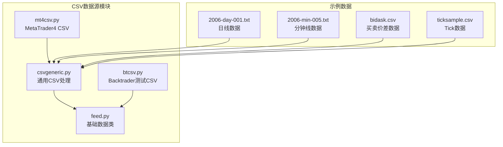
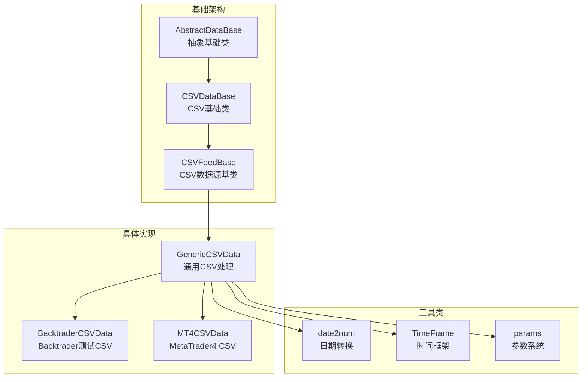
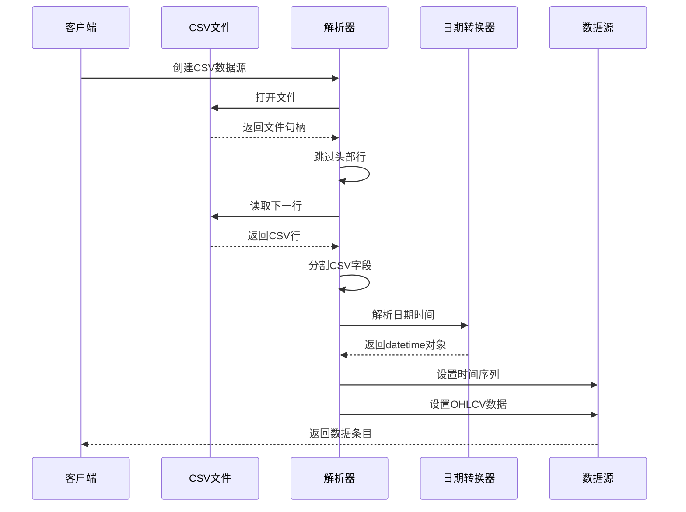
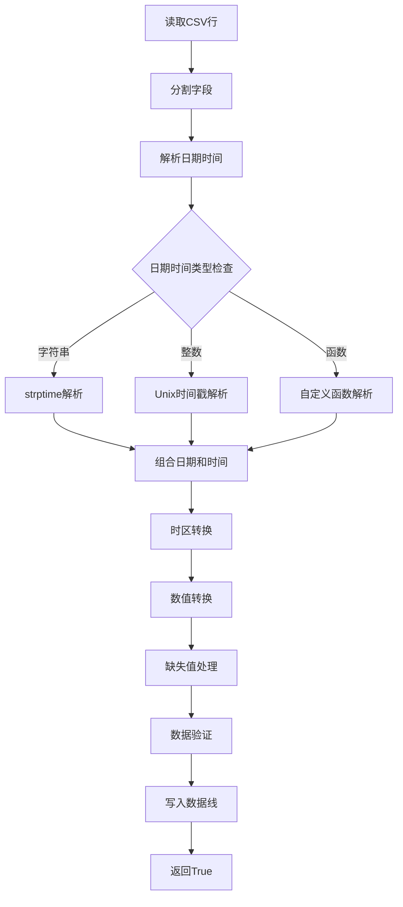
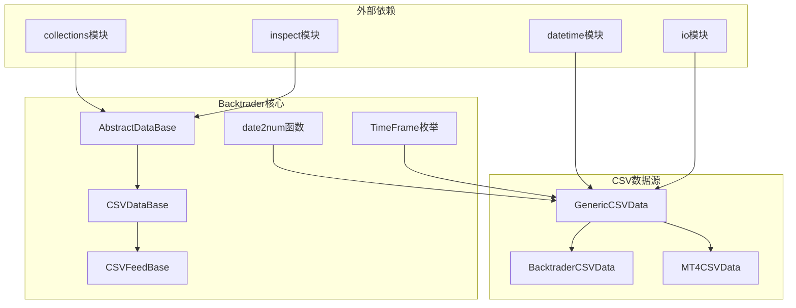

# CSV数据源

<cite>
**本文档引用的文件**
- [csvgeneric.py](file://backtrader/feeds/csvgeneric.py)
- [btcsv.py](file://backtrader/feeds/btcsv.py)
- [mt4csv.py](file://backtrader/feeds/mt4csv.py)
- [feed.py](file://backtrader/feed.py)
- [2006-day-001.txt](file://datas/2006-day-001.txt)
- [2006-min-005.txt](file://datas/2006-min-005.txt)
- [bidask.csv](file://datas/bidask.csv)
- [ticksample.csv](file://datas/ticksample.csv)
</cite>

## 目录
1. [简介](#简介)
2. [项目结构](#项目结构)
3. [核心组件](#核心组件)
4. [架构概览](#架构概览)
5. [详细组件分析](#详细组件分析)
6. [依赖关系分析](#依赖关系分析)
7. [性能考虑](#性能考虑)
8. [故障排除指南](#故障排除指南)
9. [结论](#结论)

## 简介

CSV数据源是Backtrader框架中用于处理CSV格式金融数据的核心组件。本文档深入介绍了CSVGeneric类的通用CSV处理功能，包括自定义列映射、数据格式解析、时间戳处理等。同时涵盖了BTCVS和MT4CSV等特定平台的CSV格式支持，以及CSV数据源的配置参数详解。

Backtrader提供了灵活的CSV数据处理机制，支持多种时间框架（从分钟到日线）和不同的数据格式需求。通过继承机制，用户可以轻松扩展支持新的CSV格式或自定义解析逻辑。

## 项目结构

CSV数据源相关的核心文件位于`backtrader/feeds/`目录下，主要包含以下文件：



**图表来源**
- [csvgeneric.py](file://backtrader/feeds/csvgeneric.py#L31-L162)
- [btcsv.py](file://backtrader/feeds/btcsv.py#L30-L63)
- [mt4csv.py](file://backtrader/feeds/mt4csv.py#L29-L52)

**章节来源**
- [csvgeneric.py](file://backtrader/feeds/csvgeneric.py#L1-L163)
- [feed.py](file://backtrader/feed.py#L649-L726)

## 核心组件

### GenericCSVData类

GenericCSVData是所有CSV数据源的基础实现，提供了完整的CSV解析功能：

**主要特性：**
- 支持自定义列映射（datetime, open, high, low, close, volume, openinterest）
- 灵活的时间格式解析（字符串格式、Unix时间戳、自定义函数）
- 缺失值处理机制
- 多种时间框架支持（分钟到日线）

**关键参数：**
- `nullvalue`: 缺失值的默认值（默认为NaN）
- `dtformat`: 日期时间格式（默认'%Y-%m-%d %H:%M:%S'）
- `tmformat`: 时间格式（默认'%H:%M:%S'）
- `datetime`: 日期列索引（默认0）
- `time`: 时间列索引（默认-1，表示不使用分离的时间列）

**章节来源**
- [csvgeneric.py](file://backtrader/feeds/csvgeneric.py#L32-L85)
- [csvgeneric.py](file://backtrader/feeds/csvgeneric.py#L87-L101)

### BTCVS数据源

BacktraderCSVData专门用于处理Backtrader内部测试使用的CSV格式：

**特点：**
- 固定的YYYY-MM-DD日期格式
- 可选的HH:MM:SS时间格式
- 预定义的列顺序和格式

**章节来源**
- [btcsv.py](file://backtrader/feeds/btcsv.py#L30-L59)

### MT4CSV数据源

MT4CSVData专门处理MetaTrader4历史中心导出的CSV文件：

**特点：**
- 使用'%Y.%m.%d'日期格式
- 使用'%H:%M'时间格式
- 特定的列映射（datetime=0, time=1, open=2, high=3, low=4, close=5, volume=6, openinterest=-1）

**章节来源**
- [mt4csv.py](file://backtrader/feeds/mt4csv.py#L29-L52)

## 架构概览

CSV数据源采用分层架构设计，确保了高度的可扩展性和灵活性：



**图表来源**
- [feed.py](file://backtrader/feed.py#L122-L139)
- [feed.py](file://backtrader/feed.py#L649-L666)
- [csvgeneric.py](file://backtrader/feeds/csvgeneric.py#L32-L35)

**章节来源**
- [feed.py](file://backtrader/feed.py#L637-L666)
- [csvgeneric.py](file://backtrader/feeds/csvgeneric.py#L161-L162)

## 详细组件分析

### 通用CSV处理流程

GenericCSVData的处理流程体现了Backtrader对CSV数据的完整生命周期管理：



**图表来源**
- [feed.py](file://backtrader/feed.py#L699-L711)
- [csvgeneric.py](file://backtrader/feeds/csvgeneric.py#L103-L158)

**章节来源**
- [csvgeneric.py](file://backtrader/feeds/csvgeneric.py#L103-L158)
- [feed.py](file://backtrader/feed.py#L699-L711)

### 时间格式处理机制

CSV数据源支持多种时间格式处理方式：

```mermaid
flowchart TD
A[开始解析] --> B{检查dtformat类型}
B --> |字符串| C[使用strptime解析]
B --> |整数| D{检查数值类型}
D --> |1| E[Unix时间戳(int)解析]
D --> |2| F[Unix时间戳(float)解析]
B --> |可调用| G[使用自定义函数解析]
C --> H[组合日期和时间字段]
E --> I[转换为datetime对象]
F --> I
G --> I
H --> J[应用时区转换]
I --> J
J --> K[转换为数值格式]
K --> L[设置到数据线]
L --> M[返回True]
```

**图表来源**
- [csvgeneric.py](file://backtrader/feeds/csvgeneric.py#L87-L101)
- [csvgeneric.py](file://backtrader/feeds/csvgeneric.py#L106-L116)

**章节来源**
- [csvgeneric.py](file://backtrader/feeds/csvgeneric.py#L87-L101)
- [csvgeneric.py](file://backtrader/feeds/csvgeneric.py#L106-L116)

### 数据格式配置详解

CSV数据源提供了丰富的配置选项来适应不同的数据格式需求：

**核心配置参数：**

| 参数名 | 类型 | 默认值 | 描述 |
|--------|------|--------|------|
| `dataname` | 文件路径/文件对象 | None | CSV文件路径或文件对象 |
| `headers` | 布尔值 | True | 是否跳过表头行 |
| `separator` | 字符串 | ',' | CSV字段分隔符 |
| `nullvalue` | 数值 | float('NaN') | 缺失值的默认值 |
| `dtformat` | 字符串/整数/函数 | '%Y-%m-%d %H:%M:%S' | 日期时间格式 |
| `tmformat` | 字符串 | '%H:%M:%S' | 时间格式 |
| `datetime` | 整数 | 0 | 日期列索引 |
| `time` | 整数 | -1 | 时间列索引 |

**章节来源**
- [csvgeneric.py](file://backtrader/feeds/csvgeneric.py#L72-L85)
- [feed.py](file://backtrader/feed.py#L664-L666)

### 特定平台格式支持

#### 日线数据格式

标准的日线CSV格式通常包含以下列：
- 日期列（默认索引0）
- 开盘价（默认索引1）
- 最高价（默认索引2）
- 最低价（默认索引3）
- 收盘价（默认索引4）
- 成交量（默认索引5）
- 持仓量（默认索引6）

**示例数据结构：**
```
Date,Open,High,Low,Close,Volume,OpenInterest
2006-01-02,3578.73,3605.95,3578.73,3604.33,0,0
2006-01-03,3604.08,3638.42,3601.84,3614.34,0,0
```

**章节来源**
- [2006-day-001.txt](file://datas/2006-day-001.txt#L1-L10)

#### 分钟线数据格式

分钟线数据格式在日线基础上增加了时间列：
- 日期列（默认索引0）
- 时间列（默认索引1）
- 开盘价（默认索引2）
- 最高价（默认索引3）
- 最低价（默认索引4）
- 收盘价（默认索引5）
- 成交量（默认索引6）
- 持仓量（默认索引7）

**示例数据结构：**
```
Date,Time,Open,High,Low,Close,Volume,OpenInterest
2006-01-02,09:05:00,3578.73,3587.88,3578.73,3582.99,0,0
2006-01-02,09:10:00,3583.01,3588.40,3583.01,3588.03,0,0
```

**章节来源**
- [2006-min-005.txt](file://datas/2006-min-005.txt#L1-L10)

#### Tick数据格式

Tick级别的高频数据格式：
- 时间戳（默认索引0）
- 开盘价（默认索引1）
- 最高价（默认索引2）
- 最低价（默认索引3）
- 收盘价（默认索引4）
- 成交量（默认索引5）
- 持仓量（默认索引6）

**示例数据结构：**
```
Datetime,Open,High,Low,Close,Volume,OpenInterest
2015-09-23T20:57:42.146,3067.00,3067.00,3067.00,3067.00,180,0
2015-09-23T20:57:46.151,3066.00,3066.00,3066.00,3066.00,2,0
```

**章节来源**
- [ticksample.csv](file://datas/ticksample.csv#L1-L10)

### 数据转换和验证

CSV数据源在加载过程中会进行数据转换和验证：



**图表来源**
- [csvgeneric.py](file://backtrader/feeds/csvgeneric.py#L103-L158)

**章节来源**
- [csvgeneric.py](file://backtrader/feeds/csvgeneric.py#L103-L158)

## 依赖关系分析

CSV数据源的依赖关系体现了Backtrader的整体架构设计：



**图表来源**
- [feed.py](file://backtrader/feed.py#L24-L38)
- [csvgeneric.py](file://backtrader/feeds/csvgeneric.py#L24-L29)

**章节来源**
- [feed.py](file://backtrader/feed.py#L24-L38)
- [csvgeneric.py](file://backtrader/feeds/csvgeneric.py#L24-L29)

## 性能考虑

### 大数据量处理策略

对于大规模CSV文件，Backtrader提供了多种优化策略：

**内存管理：**
- 使用生成器模式逐行读取数据
- 支持预加载和延迟加载
- 提供内存缓冲区管理

**解析优化：**
- 缓存解析格式信息
- 避免重复的字符串操作
- 使用高效的数值转换

**并发处理：**
- 支持多线程数据加载
- 异步数据处理机制
- 内存映射文件支持

### 性能优化技巧

1. **选择合适的时间框架**
   - 对于大量历史数据，优先使用日线或更高时间框架
   - 减少数据点数量可以显著提升性能

2. **合理配置参数**
   ```python
   # 示例：优化配置
   data = GenericCSVData(
       dataname='large_dataset.csv',
       headers=True,
       separator=',',
       nullvalue=float('NaN'),
       dtformat='%Y-%m-%d %H:%M:%S',
       timeframe=TimeFrame.Days,
       compression=1
   )
   ```

3. **使用适当的过滤器**
   - 应用时间范围过滤减少数据量
   - 使用数据预处理过滤无效数据

## 故障排除指南

### 常见CSV格式问题

**1. 日期格式解析错误**
- **症状**: 抛出ValueError异常
- **原因**: dtformat与实际数据格式不匹配
- **解决方案**: 
  - 检查CSV中的日期格式
  - 更新dtformat参数
  - 使用自定义解析函数

**2. 缺失值处理问题**
- **症状**: 数据中出现NaN值
- **原因**: CSV字段为空或格式不正确
- **解决方案**:
  - 设置合适的nullvalue参数
  - 检查数据质量
  - 实施数据清洗

**3. 列索引错误**
- **症状**: OHLC数据错位
- **原因**: 列映射参数配置错误
- **解决方案**:
  - 验证CSV列顺序
  - 正确设置datetime, open, high, low, close, volume, openinterest参数

### 调试技巧

**启用调试输出：**
```python
# 启用详细日志
import logging
logging.basicConfig(level=logging.DEBUG)
```

**数据验证：**
```python
# 检查数据完整性
def validate_csv_data(data_source):
    # 检查数据长度
    assert len(data_source) > 0, "数据源为空"
    
    # 检查时间序列连续性
    for i in range(len(data_source) - 1):
        current_time = data_source.lines.datetime[i]
        next_time = data_source.lines.datetime[i + 1]
        assert current_time >= next_time, "时间序列不连续"
```

**章节来源**
- [csvgeneric.py](file://backtrader/feeds/csvgeneric.py#L140-L156)
- [feed.py](file://backtrader/feed.py#L471-L536)

## 结论

Backtrader的CSV数据源系统提供了强大而灵活的CSV文件处理能力。通过GenericCSVData类，用户可以轻松处理各种格式的CSV金融数据，包括日线、分钟线、Tick数据等。系统支持多种时间格式解析、自定义列映射、缺失值处理等功能，能够满足大多数金融数据处理需求。

关键优势包括：
- **高度可扩展性**: 通过继承机制支持自定义CSV格式
- **灵活配置**: 丰富的参数选项适应不同数据格式
- **性能优化**: 针对大数据量的优化策略
- **错误处理**: 完善的异常处理和调试支持

对于需要处理特定CSV格式的用户，建议基于GenericCSVData类进行扩展，以充分利用Backtrader的完整数据处理生态系统。