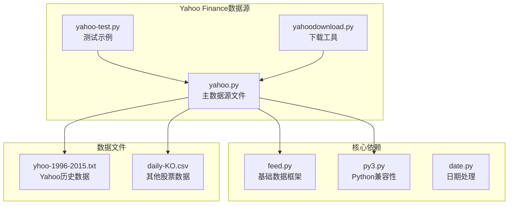
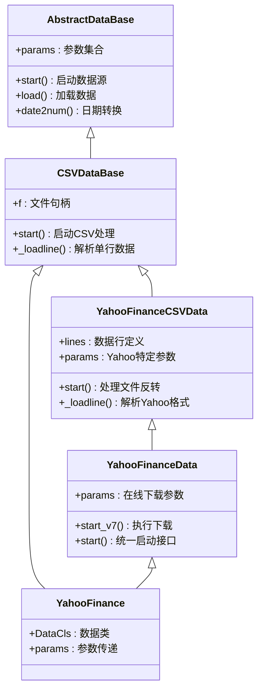
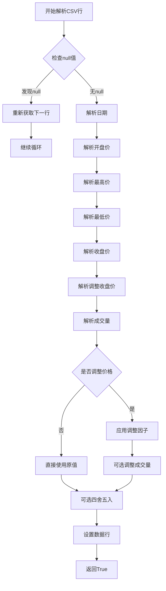
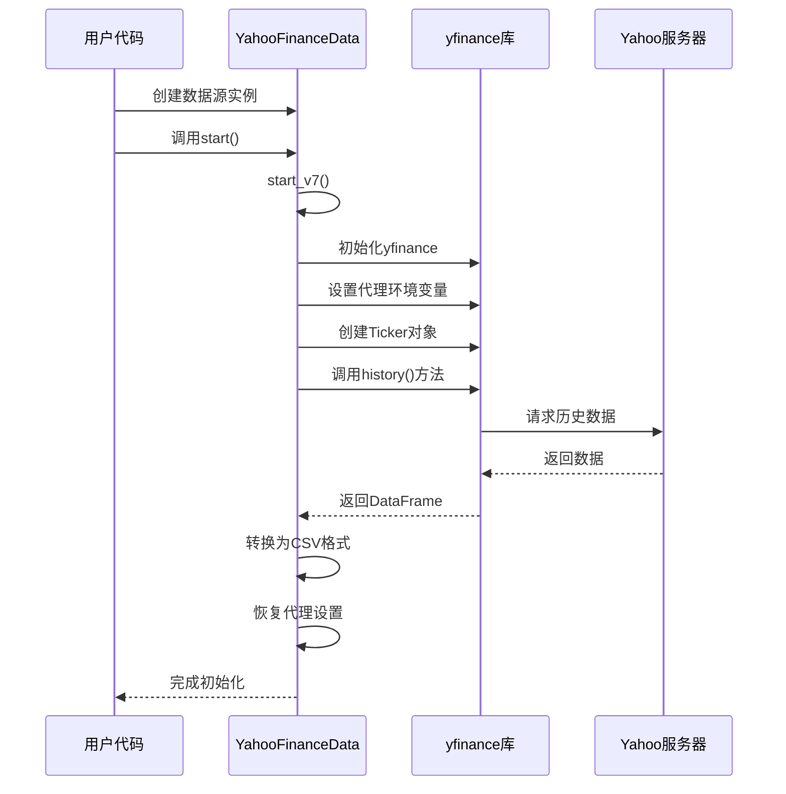
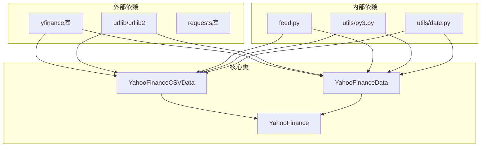

# Yahoo Finance数据源

<cite>
**本文档引用的文件**
- [yahoo.py](file://backtrader/feeds/yahoo.py)
- [yahoo-test.py](file://samples/yahoo-test/yahoo-test.py)
- [yahoodownload.py](file://tools/yahoodownload.py)
- [feed.py](file://backtrader/feed.py)
- [py3.py](file://backtrader/utils/py3.py)
- [yhoo-1996-2015.txt](file://datas/yhoo-1996-2015.txt)
- [daily-KO.csv](file://contrib/datas/daily-KO.csv)
</cite>

## 目录
1. [简介](#简介)
2. [项目结构](#项目结构)
3. [核心组件](#核心组件)
4. [架构概览](#架构概览)
5. [详细组件分析](#详细组件分析)
6. [依赖关系分析](#依赖关系分析)
7. [性能考虑](#性能考虑)
8. [故障排除指南](#故障排除指南)
9. [结论](#结论)

## 简介

Yahoo Finance数据源是Backtrader框架中的一个重要组成部分，提供了两种获取金融数据的方式：CSV文件模式和在线下载模式。该数据源支持历史股票数据的本地文件读取和实时从Yahoo Finance服务器下载数据，为量化交易策略开发提供了灵活的数据获取方案。

Yahoo Finance数据源主要包含以下特性：
- 支持CSV文件格式的历史数据读取
- 提供在线数据下载功能
- 自动处理除权除息调整
- 支持多种时间框架（日线、周线、月线）
- 内置代理设置和错误处理机制

## 项目结构

Yahoo Finance数据源位于Backtrader项目的feeds模块中，主要文件结构如下：



**图表来源**
- [yahoo.py](file://backtrader/feeds/yahoo.py#L1-L382)
- [feed.py](file://backtrader/feed.py#L1-L814)
- [py3.py](file://backtrader/utils/py3.py#L1-L134)

**章节来源**
- [yahoo.py](file://backtrader/feeds/yahoo.py#L1-L382)
- [feed.py](file://backtrader/feed.py#L1-L814)

## 核心组件

Yahoo Finance数据源包含三个主要类：

### YahooFinanceCSVData类
这是CSV文件模式的核心类，负责解析Yahoo Finance格式的历史数据文件。

### YahooFinanceData类  
这是在线下载模式的核心类，负责从Yahoo Finance服务器实时下载数据。

### YahooFinance类
这是一个便捷的包装类，简化了数据源的使用。

**章节来源**
- [yahoo.py](file://backtrader/feeds/yahoo.py#L37-L382)

## 架构概览

Yahoo Finance数据源采用分层架构设计，通过继承机制实现代码复用：



**图表来源**
- [yahoo.py](file://backtrader/feeds/yahoo.py#L37-L382)
- [feed.py](file://backtrader/feed.py#L122-L800)

## 详细组件分析

### YahooFinanceCSVData类详解

YahooFinanceCSVData类是CSV文件模式的核心实现，具有以下特点：

#### 配置参数

| 参数名 | 类型 | 默认值 | 描述 |
|--------|------|--------|------|
| reverse | bool | False | 是否需要反转文件内容 |
| adjclose | bool | True | 是否使用调整收盘价 |
| adjvolume | bool | True | 是否调整成交量 |
| round | bool | True | 是否四舍五入数值 |
| decimals | int | 2 | 四舍五入的小数位数 |
| roundvolume | bool | False | 是否四舍五入成交量 |
| swapcloses | bool | False | 是否交换收盘价 |

#### 数据处理流程



**图表来源**
- [yahoo.py](file://backtrader/feeds/yahoo.py#L110-L178)

#### 调整机制

Yahoo Finance数据包含调整后的收盘价信息，系统会自动进行价格调整：

1. **计算调整因子**：`adjfactor = c / adjustedclose`
2. **反向调整价格**：`price /= adjfactor`
3. **调整成交量**：`volume *= adjfactor`

**章节来源**
- [yahoo.py](file://backtrader/feeds/yahoo.py#L110-L178)

### YahooFinanceData类详解

YahooFinanceData类实现了在线数据下载功能，支持实时获取Yahoo Finance数据。

#### 在线下载参数

| 参数名 | 类型 | 默认值 | 描述 |
|--------|------|--------|------|
| proxies | dict | {} | 代理服务器配置 |
| period | str | 'd' | 时间框架（'d'/'w'/'m'） |
| reverse | bool | False | 是否反转数据顺序 |
| urlhist | str | 历史URL | 历史数据页面URL |
| urldown | str | 下载URL | 实际下载服务器URL |
| retries | int | 3 | 重试次数 |

#### 下载流程



**图表来源**
- [yahoo.py](file://backtrader/feeds/yahoo.py#L253-L375)

#### 错误处理机制

系统实现了多层错误处理：

1. **导入检查**：确保yfinance库已安装
2. **网络异常处理**：捕获下载过程中的异常
3. **重试机制**：指数退避重试策略
4. **代理恢复**：确保代理设置正确恢复

**章节来源**
- [yahoo.py](file://backtrader/feeds/yahoo.py#L253-L375)

### 数据格式要求

Yahoo Finance数据源支持两种标准格式：

#### CSV文件格式

标准Yahoo Finance CSV文件包含以下列：
- Date: 日期（YYYY-MM-DD）
- Open: 开盘价
- High: 最高价
- Low: 最低价
- Close: 收盘价
- Adj Close: 调整收盘价
- Volume: 成交量

#### 示例数据


**图表来源**
- [yhoo-1996-2015.txt](file://datas/yhoo-1996-2015.txt#L1-L50)

**章节来源**
- [yhoo-1996-2015.txt](file://datas/yhoo-1996-2015.txt#L1-L50)
- [daily-KO.csv](file://contrib/datas/daily-KO.csv#L1-L50)

## 依赖关系分析

Yahoo Finance数据源的依赖关系如下：



**图表来源**
- [yahoo.py](file://backtrader/feeds/yahoo.py#L29-L34)
- [py3.py](file://backtrader/utils/py3.py#L58-L106)

**章节来源**
- [yahoo.py](file://backtrader/feeds/yahoo.py#L29-L34)
- [py3.py](file://backtrader/utils/py3.py#L58-L106)

## 性能考虑

### 数据预处理优化

1. **内存管理**：在线下载时使用StringIO避免磁盘I/O
2. **批量处理**：使用deque进行文件反转操作
3. **缓存机制**：DataFrame到CSV的转换结果可重复使用

### 网络请求优化

1. **指数退避重试**：避免频繁请求导致的服务器拒绝
2. **代理支持**：支持HTTP/HTTPS代理提高访问稳定性
3. **超时控制**：合理的网络超时设置

### 数据处理优化

1. **批量解析**：CSV解析采用迭代器模式减少内存占用
2. **条件过滤**：支持按日期范围过滤数据
3. **精度控制**：可配置的数值精度设置

## 故障排除指南

### 常见问题及解决方案

#### 1. yfinance库缺失

**问题症状**：导入时抛出ImportError异常

**解决方案**：
```bash
pip install yfinance
```

#### 2. 网络连接失败

**问题症状**：下载过程中出现网络超时或连接错误

**解决方案**：
- 检查网络连接状态
- 配置代理服务器
- 增加重试次数
- 使用离线数据文件

#### 3. 数据格式不匹配

**问题症状**：解析CSV文件时出现格式错误

**解决方案**：
- 确认CSV文件格式符合标准
- 检查文件编码格式
- 验证日期格式一致性

#### 4. 代理设置问题

**问题症状**：通过代理无法正常访问Yahoo服务器

**解决方案**：
```python
# 正确的代理配置方式
data = bt.feeds.YahooFinanceData(
    dataname='AAPL',
    proxies={'http': 'http://proxy:port', 'https': 'http://proxy:port'}
)
```

**章节来源**
- [yahoo.py](file://backtrader/feeds/yahoo.py#L253-L375)
- [yahoodownload.py](file://tools/yahoodownload.py#L42-L157)

## 结论

Yahoo Finance数据源为Backtrader提供了完整的金融数据获取解决方案。通过CSV文件模式和在线下载模式的结合，用户可以根据具体需求选择最适合的数据获取方式。

### 主要优势

1. **灵活性**：支持本地文件和在线数据两种模式
2. **完整性**：自动处理除权除息调整和数据格式转换
3. **可靠性**：内置错误处理和重试机制
4. **易用性**：简洁的API设计和丰富的配置选项

### 使用建议

1. **数据质量**：优先使用Yahoo Finance提供的标准CSV格式
2. **网络配置**：在企业网络环境中合理配置代理设置
3. **错误处理**：在生产环境中实现完善的异常处理机制
4. **性能优化**：根据数据规模选择合适的缓存和预处理策略

Yahoo Finance数据源为量化交易开发者提供了一个强大而灵活的数据获取工具，能够满足从个人投资者到专业机构的各种需求。