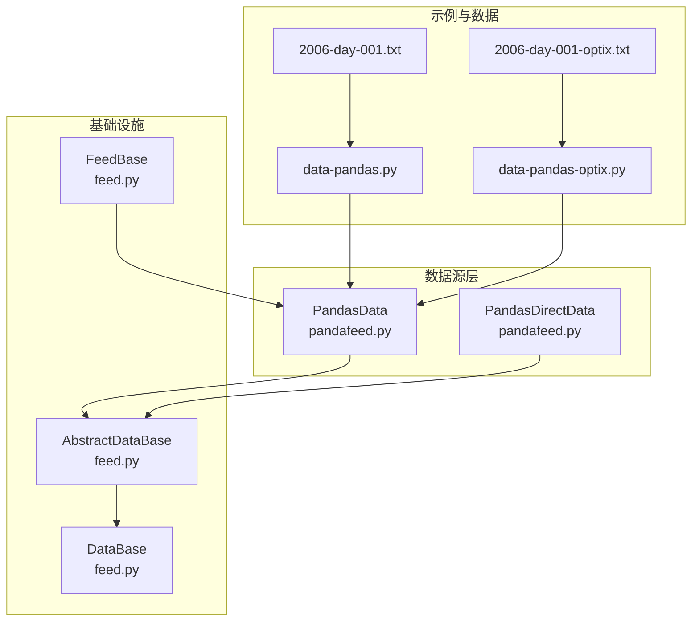
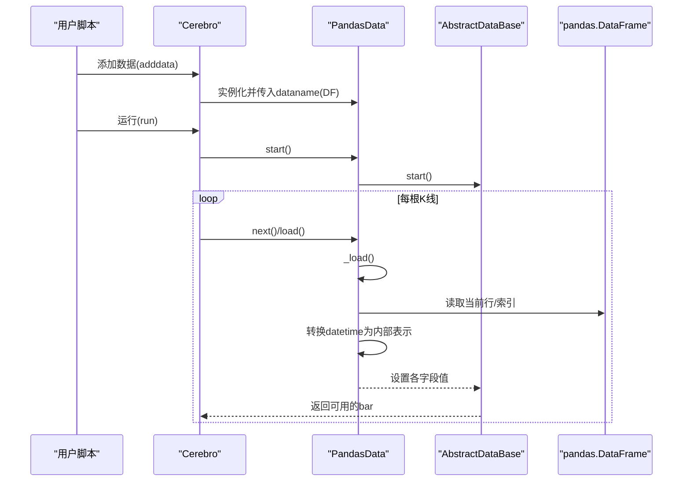
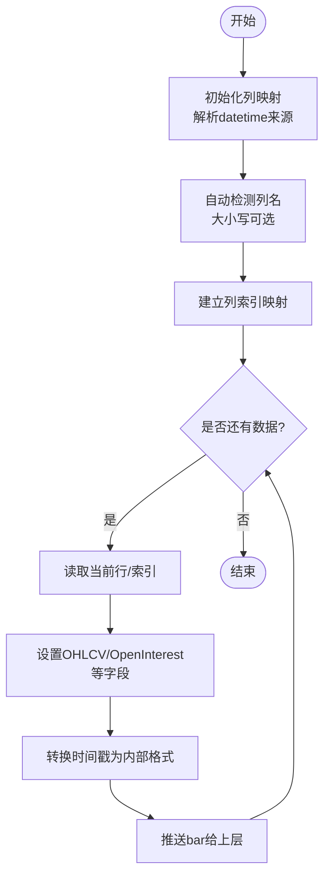
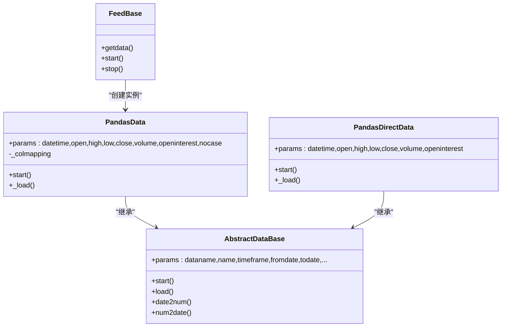

# pandas数据源

<cite>
**本文引用的文件**
- [pandafeed.py](file://backtrader/feeds/pandafeed.py)
- [feed.py](file://backtrader/feed.py)
- [data-pandas.py](file://samples/data-pandas/data-pandas.py)
- [data-pandas-optix.py](file://samples/data-pandas/data-pandas-optix.py)
- [2006-day-001.txt](file://datas/2006-day-001.txt)
- [2006-day-001-optix.txt](file://datas/2006-day-001-optix.txt)
- [memory-savings.py](file://samples/memory-savings/memory-savings.py)
- [ccxtdownload.py](file://tools/ccxtdownload.py)
- [influxdb-import.py](file://contrib/utils/influxdb-import.py)
- [iqfeed-to-influxdb.py](file://contrib/utils/iqfeed-to-influxdb.py)
</cite>

## 目录
1. [简介](#简介)
2. [项目结构](#项目结构)
3. [核心组件](#核心组件)
4. [架构总览](#架构总览)
5. [详细组件分析](#详细组件分析)
6. [依赖关系分析](#依赖关系分析)
7. [性能考虑](#性能考虑)
8. [故障排查指南](#故障排查指南)
9. [结论](#结论)
10. [附录](#附录)

## 简介
本文件系统性阐述 backtrader 中基于 pandas 的数据源，重点围绕 PandasData 类如何直接从 pandas DataFrame 加载数据展开，覆盖以下主题：
- DataFrame 格式要求与列名映射机制
- 时间索引与日期时间字段处理
- OHLCV 列映射与可选扩展列（如自定义 Optix 指标）
- 参数配置：datetime 索引、列自动检测、大小写不敏感匹配、时间频率与时区
- 从不同数据源（CSV、Excel、数据库）获取 pandas DataFrame 的实践路径
- 与 pandas 生态系统的集成最佳实践
- 大数据集的内存管理与性能优化策略
- 常见数据质量问题的处理方法

## 项目结构
与 pandas 数据源相关的核心代码位于 backtrader/feeds/pandafeed.py，基础数据框架在 backtrader/feed.py；示例脚本位于 samples/data-pandas/，示例数据位于 datas/。

图表来源
- [pandafeed.py](file://backtrader/feeds/pandafeed.py#L30-L105)
- [pandafeed.py](file://backtrader/feeds/pandafeed.py#L107-L274)
- [feed.py](file://backtrader/feed.py#L122-L600)
- [data-pandas.py](file://samples/data-pandas/data-pandas.py#L32-L93)
- [data-pandas-optix.py](file://samples/data-pandas/data-pandas-optix.py#L32-L114)
- [2006-day-001.txt](file://datas/2006-day-001.txt#L1-L20)
- [2006-day-001-optix.txt](file://datas/2006-day-001-optix.txt#L1-L20)

章节来源
- [pandafeed.py](file://backtrader/feeds/pandafeed.py#L30-L274)
- [feed.py](file://backtrader/feed.py#L122-L600)
- [data-pandas.py](file://samples/data-pandas/data-pandas.py#L32-L93)
- [data-pandas-optix.py](file://samples/data-pandas/data-pandas-optix.py#L32-L114)
- [2006-day-001.txt](file://datas/2006-day-001.txt#L1-L20)
- [2006-day-001-optix.txt](file://datas/2006-day-001-optix.txt#L1-L20)

## 核心组件
- PandasData：面向 pandas DataFrame 的数据源适配器，支持列名自动检测、大小写不敏感匹配、索引作为时间等特性。
- PandasDirectData：直接迭代 DataFrame.itertuples 的轻量实现，适合列索引为整数或数值列名的场景。
- AbstractDataBase/DataBase/FeedBase：数据源生命周期、时间过滤、会话区间、预加载与缓冲等通用能力由这些基类提供。

章节来源
- [pandafeed.py](file://backtrader/feeds/pandafeed.py#L30-L105)
- [pandafeed.py](file://backtrader/feeds/pandafeed.py#L107-L274)
- [feed.py](file://backtrader/feed.py#L122-L600)

## 架构总览
下图展示 PandasData 如何与 backtrader 数据框架交互，以及数据加载流程。

图表来源
- [pandafeed.py](file://backtrader/feeds/pandafeed.py#L204-L274)
- [feed.py](file://backtrader/feed.py#L471-L536)

## 详细组件分析

### PandasData 类详解
- DataFrame 输入：构造函数接收 pandas.DataFrame，列名可为字符串或数值类型。
- 列映射与自动检测：
  - 支持通过整数索引或列名定位 OHLCV 字段。
  - 当参数为 -1 时启用自动检测，按字段名（大小写可选）匹配列名。
  - 支持大小写不敏感匹配（nocase 参数）。
- 时间字段处理：
  - datetime 可来自 DataFrame 索引（None），或指定列（整数索引或列名）。
  - 自动将 pandas 时间戳转换为 backtrader 内部时间格式。
- 行加载流程：
  - start 阶段建立列映射（将列名转为整数索引）。
  - _load 阶段逐行读取，设置各字段，并转换时间戳。

图表来源
- [pandafeed.py](file://backtrader/feeds/pandafeed.py#L163-L274)

章节来源
- [pandafeed.py](file://backtrader/feeds/pandafeed.py#L107-L274)

### PandasDirectData 类详解
- 使用 DataFrame.itertuples 直接迭代，适合列索引为整数或数值列名的场景。
- 所有字段参数必须使用数值索引（负值表示缺失）。
- 逐条元组读取，设置各字段与时间戳。

章节来源
- [pandafeed.py](file://backtrader/feeds/pandafeed.py#L30-L105)

### 示例：从 CSV 获取 DataFrame 并注入 PandasData
- 示例脚本演示了使用 pandas.read_csv 读取本地 CSV 文件，设置 parse_dates 和 index_col，然后将得到的 DataFrame 传入 PandasData。
- 该模式适用于 Yahoo Finance、CSV 导出等数据源。

章节来源
- [data-pandas.py](file://samples/data-pandas/data-pandas.py#L32-L93)
- [2006-day-001.txt](file://datas/2006-day-001.txt#L1-L20)

### 示例：扩展列（自定义指标列）
- 通过继承 PandasData 并新增 lines 与 params，可扩展非 OHLCV 字段（如 Optix 指标列）。
- 示例展示了如何在 DataFrame 中加入额外列，并在策略中访问。

章节来源
- [data-pandas-optix.py](file://samples/data-pandas/data-pandas-optix.py#L32-L114)
- [2006-day-001-optix.txt](file://datas/2006-day-001-optix.txt#L1-L20)

### 与 pandas 生态集成的最佳实践
- 读取 CSV/Excel：使用 pandas.read_csv/read_excel，合理设置 parse_dates、index_col、dtype 等参数，确保时间列为 datetime 类型。
- 数据库：使用 SQLAlchemy 或连接器读取到 DataFrame，再传入 PandasData。
- 数据清洗：统一排序、去重、填充空值、标准化列名等，保证与 backtrader 期望一致。

章节来源
- [influxdb-import.py](file://contrib/utils/influxdb-import.py#L29-L40)
- [iqfeed-to-influxdb.py](file://contrib/utils/iqfeed-to-influxdb.py#L120-L143)

## 依赖关系分析
- PandasData 继承自 AbstractDataBase，复用其时间过滤、会话区间、预加载与缓冲等通用逻辑。
- FeedBase 提供统一的数据实例化入口，便于在 cerebro 中添加数据。
- PandasData 与 pandas.DataFrame 强耦合，但通过参数化接口保持灵活性。

图表来源
- [feed.py](file://backtrader/feed.py#L122-L600)
- [pandafeed.py](file://backtrader/feeds/pandafeed.py#L30-L105)
- [pandafeed.py](file://backtrader/feeds/pandafeed.py#L107-L274)

章节来源
- [feed.py](file://backtrader/feed.py#L122-L600)
- [pandafeed.py](file://backtrader/feeds/pandafeed.py#L30-L274)

## 性能考虑
- 预加载与缓冲：AbstractDataBase 提供 preload 与 qbuffer 机制，可在 runonce=False 时减少重复 IO。
- 内存占用评估：可通过 memory-savings 示例统计各数据行数组长度，评估整体内存占用。
- 大数据集策略：
  - 分块读取与分批回测（外部控制）。
  - 合理设置 timeframe/compression，避免不必要的细粒度存储。
  - 使用 PandasData 的 fromdate/todate 进行时间窗口裁剪，减少无效数据。

章节来源
- [feed.py](file://backtrader/feed.py#L438-L463)
- [memory-savings.py](file://samples/memory-savings/memory-savings.py#L72-L121)

## 故障排查指南
- 列名不匹配：
  - 使用 nocase=True 启用大小写不敏感匹配。
  - 将列名标准化为小写或统一命名风格。
- 时间字段问题：
  - 若时间在索引中，将 datetime 设为 None。
  - 若时间在列中，提供整数索引或列名。
- 数据质量问题：
  - 去重：根据时间戳去重（参考工具脚本中的 drop_duplicates）。
  - 排序：按时间升序排列。
  - 缺失值：填充或剔除空值。
  - 重复下载与清洗：参考 ccxtdownload 工具对时间戳、列顺序与类型进行规范化。

章节来源
- [pandafeed.py](file://backtrader/feeds/pandafeed.py#L136-L177)
- [ccxtdownload.py](file://tools/ccxtdownload.py#L140-L160)
- [iqfeed-to-influxdb.py](file://contrib/utils/iqfeed-to-influxdb.py#L120-L143)

## 结论
PandasData 为 backtrader 提供了与 pandas 生态无缝对接的数据入口，具备灵活的列映射、自动检测与时间字段处理能力。结合合理的数据清洗与内存管理策略，可在多种数据源（CSV、Excel、数据库）上高效运行回测与实盘策略。

## 附录

### DataFrame 格式要求与参数说明
- 必需字段：OHLCV（开盘、最高、最低、收盘、成交量）。
- 可选字段：持仓量（OpenInterest）。
- 扩展字段：通过继承 PandasData 新增 lines 与 params 即可接入。
- 时间字段：可来自索引或列，支持自动检测与大小写不敏感匹配。

章节来源
- [pandafeed.py](file://backtrader/feeds/pandafeed.py#L136-L177)
- [data-pandas-optix.py](file://samples/data-pandas/data-pandas-optix.py#L32-L43)

### 从不同数据源获取 DataFrame 的实践路径
- CSV：使用 pandas.read_csv，设置 parse_dates、index_col、dtype 等。
- Excel：使用 pandas.read_excel，注意 sheet_name、header、index_col。
- 数据库：使用 SQLAlchemy 或相应驱动读取为 DataFrame。
- 实时/历史数据：参考工具脚本对时间戳、去重、排序与类型转换的处理。

章节来源
- [data-pandas.py](file://samples/data-pandas/data-pandas.py#L48-L55)
- [influxdb-import.py](file://contrib/utils/influxdb-import.py#L29-L40)
- [iqfeed-to-influxdb.py](file://contrib/utils/iqfeed-to-influxdb.py#L120-L143)
- [ccxtdownload.py](file://tools/ccxtdownload.py#L140-L160)