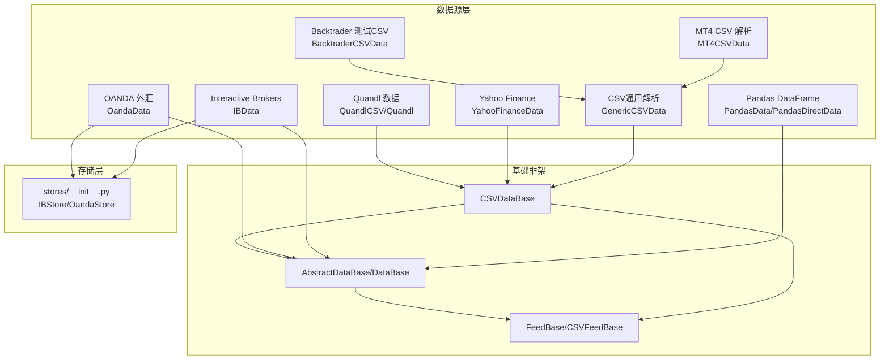
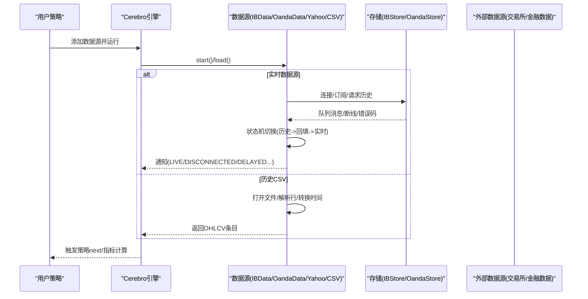
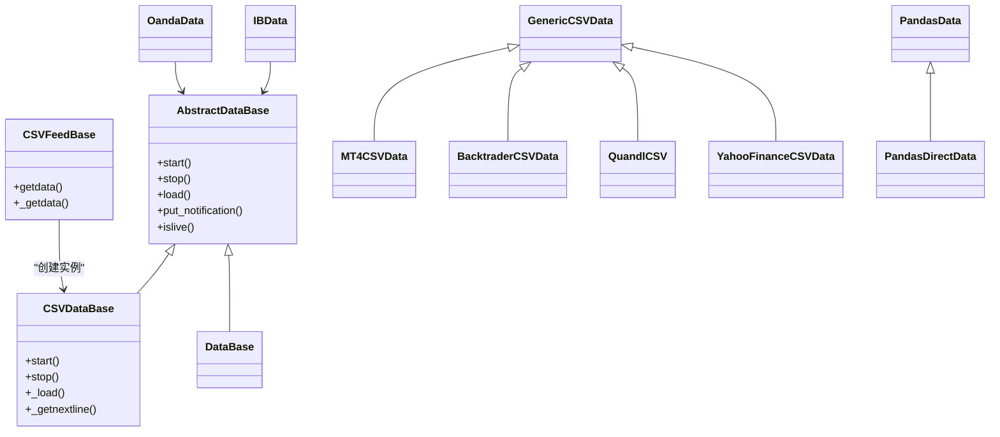
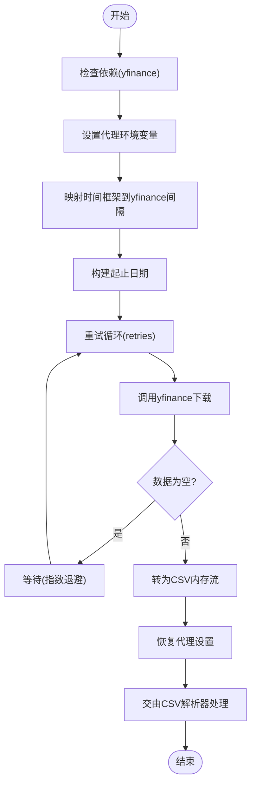

# 内置数据源详解

<cite>
**本文档引用的文件**
- [backtrader/feeds/__init__.py](file://backtrader/feeds/__init__.py)
- [backtrader/feeds/yahoo.py](file://backtrader/feeds/yahoo.py)
- [backtrader/feeds/csvgeneric.py](file://backtrader/feeds/csvgeneric.py)
- [backtrader/feeds/pandafeed.py](file://backtrader/feeds/pandafeed.py)
- [backtrader/feeds/oanda.py](file://backtrader/feeds/oanda.py)
- [backtrader/feeds/ibdata.py](file://backtrader/feeds/ibdata.py)
- [backtrader/feeds/btcsv.py](file://backtrader/feeds/btcsv.py)
- [backtrader/feeds/mt4csv.py](file://backtrader/feeds/mt4csv.py)
- [backtrader/feeds/quandl.py](file://backtrader/feeds/quandl.py)
- [backtrader/feed.py](file://backtrader/feed.py)
- [backtrader/stores/__init__.py](file://backtrader/stores/__init__.py)
- [samples/data-pandas/data-pandas.py](file://samples/data-pandas/data-pandas.py)
- [samples/yahoo-test/yahoo-test.py](file://samples/yahoo-test/yahoo-test.py)
- [samples/ibtest/ibtest.py](file://samples/ibtest/ibtest.py)
- [samples/oandatest/oandatest.py](file://samples/oandatest/oandatest.py)
</cite>

## 目录
1. [简介](#简介)
2. [项目结构](#项目结构)
3. [核心组件](#核心组件)
4. [架构总览](#架构总览)
5. [详细组件分析](#详细组件分析)
6. [依赖关系分析](#依赖关系分析)
7. [性能考虑](#性能考虑)
8. [故障排除指南](#故障排除指南)
9. [结论](#结论)
10. [附录](#附录)

## 简介
本文件系统性梳理 Backtrader 的内置数据源体系，覆盖 CSV 文件、pandas DataFrame、Yahoo Finance、Interactive Brokers、OANDA 外汇等主流数据源。内容包括：各数据源的使用方法与配置项、数据格式要求、数据预处理要点、实时数据源的连接管理与重连策略、性能优化与内存管理建议，以及常见问题与调试方法。

## 项目结构
Backtrader 将数据源按“模块化”组织在 feeds 包中，每个数据源通常对应一个独立模块（如 csvgeneric、yahoo、pandafeed、ibdata、oanda 等），并通过 feeds/__init__.py 统一导出；实时数据源（IB/OANDA）通过 stores 子包提供底层连接能力，并由 feeds 中的对应类封装为可直接使用的数据源。

**图表来源**
- [backtrader/feeds/__init__.py](file://backtrader/feeds/__init__.py#L25-L55)
- [backtrader/feeds/yahoo.py](file://backtrader/feeds/yahoo.py#L37-L382)
- [backtrader/feeds/csvgeneric.py](file://backtrader/feeds/csvgeneric.py#L32-L163)
- [backtrader/feeds/pandafeed.py](file://backtrader/feeds/pandafeed.py#L30-L274)
- [backtrader/feeds/ibdata.py](file://backtrader/feeds/ibdata.py#L45-L705)
- [backtrader/feeds/oanda.py](file://backtrader/feeds/oanda.py#L44-L450)
- [backtrader/feeds/mt4csv.py](file://backtrader/feeds/mt4csv.py#L29-L53)
- [backtrader/feeds/quandl.py](file://backtrader/feeds/quandl.py#L39-L240)
- [backtrader/feed.py](file://backtrader/feed.py#L603-L735)
- [backtrader/stores/__init__.py](file://backtrader/stores/__init__.py#L27-L41)

**章节来源**
- [backtrader/feeds/__init__.py](file://backtrader/feeds/__init__.py#L25-L55)
- [backtrader/feed.py](file://backtrader/feed.py#L603-L735)

## 核心组件
- 抽象基类与通用框架
  - AbstractDataBase/DataBase：定义数据源生命周期、通知机制、时间轴转换、过滤器栈等。
  - CSVFeedBase/CSVDataBase：面向 CSV 的通用读取、分隔符、头行跳过、逐行解析等。
  - FeedBase：统一创建具体数据实例，合并默认参数。
- 实时数据源基类
  - IBData、OandaData：均继承自 DataBase，实现 islive()、状态机（历史/回填/实时）、队列与重连逻辑、通知上报等。

**章节来源**
- [backtrader/feed.py](file://backtrader/feed.py#L122-L598)

## 架构总览
实时数据源（IB/OANDA）通过 stores 提供连接与消息队列，数据源类负责状态机切换、历史回填、实时订阅、断线重连与通知上报；CSV 类型数据源通过文件或内存流进行解析，支持灵活的时间格式与字段映射。

**图表来源**
- [backtrader/feeds/ibdata.py](file://backtrader/feeds/ibdata.py#L438-L705)
- [backtrader/feeds/oanda.py](file://backtrader/feeds/oanda.py#L260-L450)
- [backtrader/feed.py](file://backtrader/feed.py#L471-L537)

## 详细组件分析

### CSV 通用解析：GenericCSVData
- 特点
  - 支持自定义字段索引、日期时间格式、分离的日期/时间字段、空值占位等。
  - 适用于多种 CSV 格式，通过参数映射字段到 OHLCV。
- 关键参数
  - datetime/time/open/high/low/close/volume/openinterest：字段索引或禁用。
  - dtformat/tmformat/nullvalue：日期时间解析与缺失值处理。
- 使用场景
  - 自建 CSV 或第三方导出的标准化 OHLCV 文件。
- 数据格式要求
  - 至少包含日期时间与 OHLC 字段；可选 volume/openinterest。
- 预处理建议
  - 确保 dtformat 与实际 CSV 一致；必要时拆分日期/时间为两列。
  - 对缺失值统一为 NaN 或指定 nullvalue。

**章节来源**
- [backtrader/feeds/csvgeneric.py](file://backtrader/feeds/csvgeneric.py#L32-L163)

### MT4 CSV 解析：MT4CSVData
- 特点
  - 针对 MT4 历史中心导出的 CSV 格式，预设 dtformat/tmformat 与字段索引。
- 参数
  - dtformat='%Y.%m.%d'、tmformat='%H:%M'、datetime/time/open/high/low/close/volume/openinterest。
- 使用场景
  - 直接导入 MT4 导出的历史数据。
- 数据格式要求
  - 严格遵循 MT4 时间格式与字段顺序。

**章节来源**
- [backtrader/feeds/mt4csv.py](file://backtrader/feeds/mt4csv.py#L29-L53)

### Backtrader 测试 CSV：BacktraderCSVData
- 特点
  - 用于测试的内部 CSV 格式，固定日期时间与 OHLCV 字段顺序。
- 使用场景
  - 快速验证策略与数据流。
- 数据格式要求
  - 日期格式为 YYYY-MM-DD；可选时间格式 HH:MM:SS；字段顺序固定。

**章节来源**
- [backtrader/feeds/btcsv.py](file://backtrader/feeds/btcsv.py#L30-L64)

### Quandl 数据：QuandlCSV/Quandl
- 特点
  - 支持本地 CSV 与在线下载；可选择是否反向（最新在前/末尾）。
  - 可调整是否使用复权收盘价并四舍五入。
- 参数
  - reverse/adjclose/round/decimals（本地 CSV）；baseurl/proxies/buffered/reverse/apikey/dataset（在线下载）。
- 使用场景
  - 获取公开金融数据库数据（需 API Key）。
- 数据格式要求
  - 本地 CSV 遵循 Quandl 输出格式；在线下载自动适配。
- 注意事项
  - 在线下载可能受速率限制，建议设置合理的重试与等待策略。

**章节来源**
- [backtrader/feeds/quandl.py](file://backtrader/feeds/quandl.py#L39-L240)

### Yahoo Finance 数据：YahooFinanceData
- 特点
  - 支持本地 CSV 与在线下载（v7 接口，依赖 yfinance）。
  - 支持日线/周线/月线周期；可调整是否使用复权收盘价与成交量缩放。
- 参数
  - proxies/period/reverse/urlhist/urldown/retries（在线下载）；adjclose/adjvolume/round/decimals/roundvolume（本地 CSV）。
- 使用场景
  - 获取 Yahoo Finance 历史行情；适合美股等市场。
- 数据格式要求
  - 本地 CSV 遵循 Yahoo 格式；在线下载自动转换为 CSV 流。
- 预处理建议
  - 若需要复权价格，启用 adjclose 并确保成交量同步调整。
  - 代理网络不稳定时，适当增加 retries 并设置指数退避。

**章节来源**
- [backtrader/feeds/yahoo.py](file://backtrader/feeds/yahoo.py#L37-L382)

### Pandas DataFrame 数据：PandasData/PandasDirectData
- 特点
  - 直接以 DataFrame 作为数据源；支持列名自动匹配与大小写不敏感。
  - PandasDirectData 直接迭代 itertuples，适合高性能场景。
- 参数
  - nocase：列名大小写不敏感匹配。
  - datetime/open/high/low/close/volume/openinterest：None 表示索引即时间；-1 自动检测；>=0 数字索引；字符串列名。
- 使用场景
  - 已有 pandas 处理流程的数据；便于与分析工具链集成。
- 数据格式要求
  - 时间列必须存在；其他字段可自动推断或显式指定。
- 性能建议
  - 使用 PandasDirectData 以减少列查找开销；确保 DataFrame 已排序且无缺失。

**章节来源**
- [backtrader/feeds/pandafeed.py](file://backtrader/feeds/pandafeed.py#L30-L274)

### Interactive Brokers 数据：IBData
- 特点
  - 支持股票、CFD、指数、期货、期权、外汇等多种合约类型。
  - 实时数据优先使用 5 秒实时条（rtbar），否则使用 RTVolume。
  - 支持历史下载、回放/重采样、延迟处理、断线重连与回填。
- 参数
  - sectype/exchange/currency/rtbar/historical/what/useRTH/qcheck/backfill_start/backfill/backfill_from/latethrough/tradename。
- 使用场景
  - 实盘/模拟交易与研究回测结合。
- 连接与重连
  - 状态机：历史请求 -> 回填 -> 实时；断线时根据错误码决定是否重连与回填。
  - 支持订阅/取消订阅、延迟通知、LIVE 通知等。
- 调试建议
  - 开启 debug/notifyall 查看详细消息；检查时区与时间偏移（timeoffset）。

**章节来源**
- [backtrader/feeds/ibdata.py](file://backtrader/feeds/ibdata.py#L45-L705)

### OANDA 外汇数据：OandaData
- 特点
  - 支持 bid/ask 与 midpoint 两种报价模式；支持 ask 选择。
  - 实时流与历史回填结合，断线后自动回填缺口。
- 参数
  - qcheck/historical/backfill_start/backfill/backfill_from/bidask/useask/includeFirst/reconnect/reconnections/reconntimeout。
- 使用场景
  - 外汇市场高频/低频策略。
- 连接与重连
  - 状态机：历史请求 -> 回填 -> 实时；断线时根据错误码重连并触发回填。
- 调试建议
  - 设置合适的 qcheck 与 backfill；检查 bidask/useask 与 includeFirst。

**章节来源**
- [backtrader/feeds/oanda.py](file://backtrader/feeds/oanda.py#L44-L450)

## 依赖关系分析

**图表来源**
- [backtrader/feed.py](file://backtrader/feed.py#L122-L598)
- [backtrader/feeds/csvgeneric.py](file://backtrader/feeds/csvgeneric.py#L32-L163)
- [backtrader/feeds/mt4csv.py](file://backtrader/feeds/mt4csv.py#L29-L53)
- [backtrader/feeds/btcsv.py](file://backtrader/feeds/btcsv.py#L30-L64)
- [backtrader/feeds/quandl.py](file://backtrader/feeds/quandl.py#L39-L240)
- [backtrader/feeds/yahoo.py](file://backtrader/feeds/yahoo.py#L37-L382)
- [backtrader/feeds/pandafeed.py](file://backtrader/feeds/pandafeed.py#L30-L274)
- [backtrader/feeds/ibdata.py](file://backtrader/feeds/ibdata.py#L45-L705)
- [backtrader/feeds/oanda.py](file://backtrader/feeds/oanda.py#L44-L450)

**章节来源**
- [backtrader/feed.py](file://backtrader/feed.py#L603-L735)

## 性能考虑
- 内存管理
  - CSV 数据源在预加载完成后会关闭文件句柄，避免长期占用资源。
  - 使用 qbuffer 与 savemem 控制行缓冲大小，减少内存峰值。
- 解析效率
  - PandasDirectData 直接迭代 itertuples，避免列名查找与类型转换开销。
  - GenericCSVData 支持整数 dtformat（Unix timestamp）以加速解析。
- 实时数据
  - 合理设置 qcheck，避免频繁唤醒；在高吞吐场景下适当增大队列容量。
  - 断线重连采用指数退避策略，降低服务器压力。
- 数据对齐
  - 使用 resample/replay 时注意时间边界与延迟处理（latethrough），避免重复或遗漏。

[本节为通用指导，无需特定文件引用]

## 故障排除指南
- CSV 解析失败
  - 检查 dtformat/tmformat 是否与数据一致；确认分隔符与头行设置。
  - 空值处理：设置 nullvalue 与字段索引，避免缺失导致解析异常。
- Yahoo Finance 下载失败
  - 安装 yfinance；检查 proxies 与网络代理；适当提高 retries。
  - 在线接口返回空数据时，确认时间段与 ticker 正确。
- IB 连接问题
  - 检查主机、端口、clientId 与 TWS 设置；开启 debug 查看错误码。
  - 断线时关注 -1100/-1101/-1102 等错误码，按状态机自动重连。
- OANDA 连接问题
  - 确认 token/account；检查 bidask/useask 与 includeFirst。
  - 断线时根据错误码触发回填，必要时手动延长 backfill 范围。
- Pandas 数据源
  - 列名大小写不敏感可通过 nocase 控制；确保时间列为索引或显式指定。
  - 预期字段缺失时，设置为 -1 或 None 让其跳过。

**章节来源**
- [backtrader/feeds/yahoo.py](file://backtrader/feeds/yahoo.py#L253-L376)
- [backtrader/feeds/ibdata.py](file://backtrader/feeds/ibdata.py#L438-L705)
- [backtrader/feeds/oanda.py](file://backtrader/feeds/oanda.py#L260-L450)
- [backtrader/feeds/pandafeed.py](file://backtrader/feeds/pandafeed.py#L163-L274)

## 结论
Backtrader 的内置数据源覆盖了从 CSV 到实时金融数据的广泛需求。通过统一的抽象框架与灵活的参数配置，用户可以快速接入不同数据源并进行策略回测与实盘交易。建议在生产环境中结合性能优化与完善的错误处理机制，确保稳定运行。

[本节为总结，无需特定文件引用]

## 附录

### 使用示例路径
- Pandas 数据源示例
  - [samples/data-pandas/data-pandas.py](file://samples/data-pandas/data-pandas.py#L32-L93)
- Yahoo Finance 示例
  - [samples/yahoo-test/yahoo-test.py](file://samples/yahoo-test/yahoo-test.py#L33-L106)
- Interactive Brokers 示例
  - [samples/ibtest/ibtest.py](file://samples/ibtest/ibtest.py#L211-L559)
- OANDA 示例
  - [samples/oandatest/oandatest.py](file://samples/oandatest/oandatest.py#L191-L499)

### 关键流程图：Yahoo Finance 在线下载

**图表来源**
- [backtrader/feeds/yahoo.py](file://backtrader/feeds/yahoo.py#L253-L376)