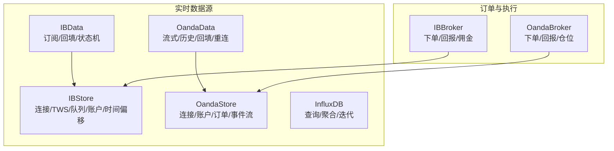
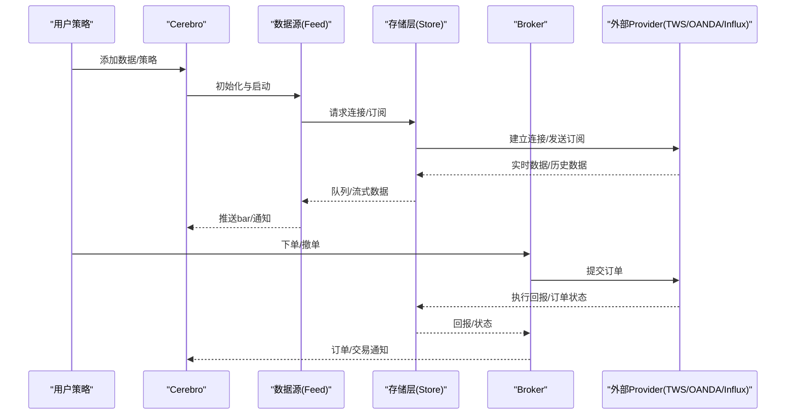
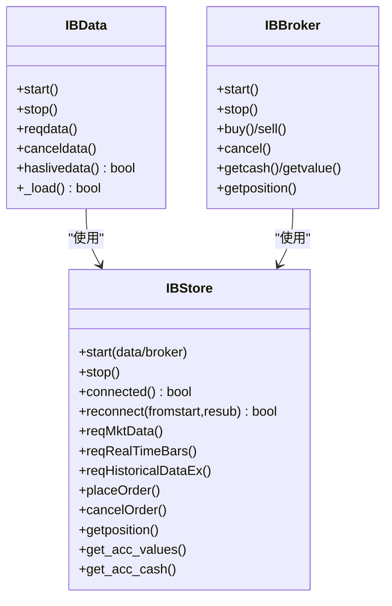
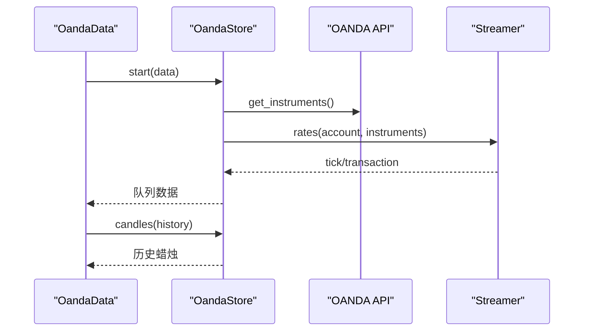
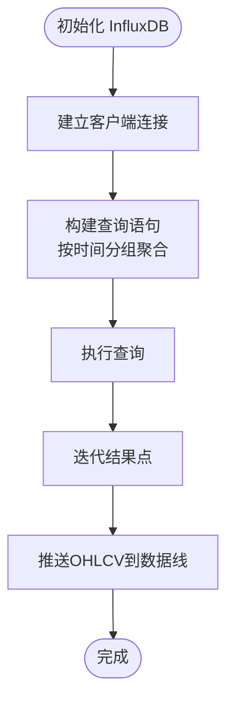
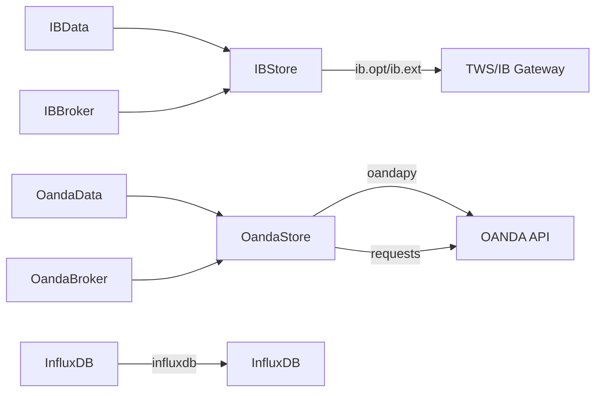

# 实时数据源

<cite>
**本文档引用的文件**
- [ibstore.py](file://backtrader/stores/ibstore.py)
- [ibbroker.py](file://backtrader/brokers/ibbroker.py)
- [ibdata.py](file://backtrader/feeds/ibdata.py)
- [oandastore.py](file://backtrader/stores/oandastore.py)
- [oandabroker.py](file://backtrader/brokers/oandabroker.py)
- [oanda.py](file://backtrader/feeds/oanda.py)
- [influxfeed.py](file://backtrader/feeds/influxfeed.py)
- [ibtest.py](file://samples/ibtest/ibtest.py)
- [oandatest.py](file://samples/oandatest/oandatest.py)
</cite>

## 目录
1. [简介](#简介)
2. [项目结构](#项目结构)
3. [核心组件](#核心组件)
4. [架构总览](#架构总览)
5. [详细组件分析](#详细组件分析)
6. [依赖关系分析](#依赖关系分析)
7. [性能考虑](#性能考虑)
8. [故障排除指南](#故障排除指南)
9. [结论](#结论)
10. [附录](#附录)

## 简介
本文件系统性梳理了实时数据源在该代码库中的实现与使用方式，重点覆盖以下三类数据源：
- Interactive Brokers（IB）：TWS 连接、市场数据订阅、订单路由与执行回报。
- OANDA 外汇：实时报价流与历史蜡烛数据的获取与处理。
- InfluxDB：时间序列数据的读取与实时更新能力。

文档将从架构设计、连接管理、心跳与断线重连、错误处理与异常恢复、数据质量监控与性能优化、延迟处理与数据完整性保障等方面进行深入解析，并提供可操作的配置与使用建议。

## 项目结构
实时数据源相关的核心模块分布于以下路径：
- stores：IB 与 OANDA 的连接与会话管理封装
- feeds：IB 与 OANDA 的数据接入层，负责订阅与回填
- brokers：IB 与 OANDA 的订单与执行回报对接
- samples：示例脚本，展示如何配置与运行实时数据

图表来源
- [ibstore.py](file://backtrader/stores/ibstore.py#L105-L300)
- [oandastore.py](file://backtrader/stores/oandastore.py#L177-L260)
- [ibdata.py](file://backtrader/feeds/ibdata.py#L45-L120)
- [oanda.py](file://backtrader/feeds/oanda.py#L44-L120)
- [influxfeed.py](file://backtrader/feeds/influxfeed.py#L41-L116)

章节来源
- [ibstore.py](file://backtrader/stores/ibstore.py#L105-L300)
- [oandastore.py](file://backtrader/stores/oandastore.py#L177-L260)
- [ibdata.py](file://backtrader/feeds/ibdata.py#L45-L120)
- [oanda.py](file://backtrader/feeds/oanda.py#L44-L120)
- [influxfeed.py](file://backtrader/feeds/influxfeed.py#L41-L116)

## 核心组件
- IBStore：封装 TWS/IB Gateway 连接、消息注册、队列管理、账户与持仓更新、服务器时间偏移同步、历史数据请求与回填、订单路由代理。
- IBData：根据时间框架选择实时条状或 RTVolume，管理状态机（开始/直播/历史回填/结束），处理断线与回填。
- IBBroker：将 IB 订单映射为内部订单模型，处理执行回报、佣金报告、订单状态变更与通知。
- OandaStore：封装 OANDA API 连接、账户信息轮询、订单提交/取消、交易事件流、事务处理与映射。
- OandaData：封装 OANDA 历史蜡烛与价格流，支持 bid/ask 或 midpoint，具备断线重连与回填。
- OandaBroker：将 OANDA 事件映射为内部订单状态，维护仓位与佣金信息。
- InfluxDB：基于 InfluxDB 客户端进行查询，按时间分组聚合 OHLCV 数据，提供迭代器驱动的数据加载。

章节来源
- [ibstore.py](file://backtrader/stores/ibstore.py#L105-L300)
- [ibdata.py](file://backtrader/feeds/ibdata.py#L45-L120)
- [ibbroker.py](file://backtrader/brokers/ibbroker.py#L240-L320)
- [oandastore.py](file://backtrader/stores/oandastore.py#L177-L260)
- [oanda.py](file://backtrader/feeds/oanda.py#L44-L120)
- [oandabroker.py](file://backtrader/brokers/oandabroker.py#L60-L120)
- [influxfeed.py](file://backtrader/feeds/influxfeed.py#L41-L116)

## 架构总览
下图展示了实时数据源的整体交互流程，包括连接建立、数据订阅、断线重连、历史回填与订单执行回报。

图表来源
- [ibdata.py](file://backtrader/feeds/ibdata.py#L342-L423)
- [ibstore.py](file://backtrader/stores/ibstore.py#L300-L420)
- [ibbroker.py](file://backtrader/brokers/ibbroker.py#L327-L340)
- [oanda.py](file://backtrader/feeds/oanda.py#L180-L250)
- [oandastore.py](file://backtrader/stores/oandastore.py#L332-L408)
- [influxfeed.py](file://backtrader/feeds/influxfeed.py#L63-L98)

## 详细组件分析

### Interactive Brokers 数据源
- 连接与会话
  - 使用 ib.opt.ibConnection 建立到 TWS/IB Gateway 的连接，支持随机或指定 clientId。
  - 注册所有消息或仅错误消息，用于调试与通知。
  - 通过装饰器注册回调方法，统一处理错误、账户更新、服务器时间等。
- 队列与订阅
  - 每个订阅分配唯一 tickerId 与队列，支持 RTVolume 与实时条状两种模式。
  - 支持 cash/CFD/IND 等合约类型的特殊处理（如默认使用 BID）。
- 历史数据与回填
  - 自动计算最大允许 duration 与 bar size，必要时拆分多次请求。
  - 断线后自动回填缺失时段，支持 start/backfill/backfill_from 多层回填。
- 订单路由与回报
  - 通过 placeOrder/cancelOrder 与 TWS 对接，接收 openOrder/execDetails/orderStatus/commissionReport 并映射到内部订单状态。
- 时间同步
  - 启动时请求服务器时间，计算时间偏移并定时刷新，用于对齐本地时间戳与服务器时间。

图表来源
- [ibstore.py](file://backtrader/stores/ibstore.py#L105-L300)
- [ibdata.py](file://backtrader/feeds/ibdata.py#L45-L120)
- [ibbroker.py](file://backtrader/brokers/ibbroker.py#L240-L320)

章节来源
- [ibstore.py](file://backtrader/stores/ibstore.py#L105-L300)
- [ibstore.py](file://backtrader/stores/ibstore.py#L800-L980)
- [ibdata.py](file://backtrader/feeds/ibdata.py#L412-L662)
- [ibbroker.py](file://backtrader/brokers/ibbroker.py#L240-L320)

### OANDA 外汇数据源
- 连接与账户
  - 通过 API 类封装请求，支持环境切换（practice/live）、错误转换与超时控制。
  - 账户信息轮询，定期更新可用保证金与总价值。
- 实时流与历史数据
  - Streamer 封装事件流，过滤心跳，将 tick/transaction 推送到队列。
  - 历史蜡烛通过独立线程异步拉取，支持 bid/ask 或 midpoint。
- 订单与回报
  - 订单创建/取消通过队列异步处理，事件流中匹配 orderId 与内部订单，处理填充、取消、过期等状态。
- 断线重连
  - OandaData 支持可配置的重连次数与间隔，断线后自动重建流与回填缺失数据。

图表来源
- [oanda.py](file://backtrader/feeds/oanda.py#L180-L250)
- [oandastore.py](file://backtrader/stores/oandastore.py#L332-L408)
- [oandastore.py](file://backtrader/stores/oandastore.py#L422-L540)

章节来源
- [oandastore.py](file://backtrader/stores/oandastore.py#L177-L260)
- [oanda.py](file://backtrader/feeds/oanda.py#L180-L250)
- [oandabroker.py](file://backtrader/brokers/oandabroker.py#L60-L120)

### InfluxDB 时间序列数据源
- 查询与聚合
  - 基于 InfluxDBClient 进行查询，按时间分组聚合 OHLCV 字段，支持多时间框架映射。
  - 查询字符串动态生成，包含起始时间条件与分组时间粒度。
- 数据加载
  - 将查询结果转为迭代器，逐条推送至数据线，确保时间升序与字段一致性。

图表来源
- [influxfeed.py](file://backtrader/feeds/influxfeed.py#L63-L98)
- [influxfeed.py](file://backtrader/feeds/influxfeed.py#L100-L116)

章节来源
- [influxfeed.py](file://backtrader/feeds/influxfeed.py#L41-L116)

## 依赖关系分析
- 组件耦合
  - Data 与 Store 之间通过队列/流进行松耦合通信；Store 与 Provider 之间通过回调/事件解耦。
  - Broker 与 Store 通过统一的消息接口对接，便于替换不同 Provider。
- 外部依赖
  - IB：ib.opt/ib.ext（TWS/IB Gateway）
  - OANDA：oandapy（REST/Streaming）
  - InfluxDB：influxdb（Python 客户端）

图表来源
- [ibstore.py](file://backtrader/stores/ibstore.py#L254-L270)
- [oandastore.py](file://backtrader/stores/oandastore.py#L30-L36)
- [influxfeed.py](file://backtrader/feeds/influxfeed.py#L42-L45)

章节来源
- [ibstore.py](file://backtrader/stores/ibstore.py#L254-L270)
- [oandastore.py](file://backtrader/stores/oandastore.py#L30-L36)
- [influxfeed.py](file://backtrader/feeds/influxfeed.py#L42-L45)

## 性能考虑
- 队列与锁
  - Store 内部使用多把锁保护队列、账户更新、位置更新等共享资源，避免并发冲突。
- 背压与批量
  - 历史请求按最大允许 duration 拆分，减少单次请求压力；实时流通过队列缓冲，降低主线程阻塞。
- 时间同步
  - 定时刷新服务器时间偏移，避免长时间累积的时间漂移影响对齐与回填。
- 回填策略
  - 断线后优先回填缺失时段，再回到实时流，减少重复数据与空洞。
- InfluxDB 查询
  - 使用 GROUP BY 时间粒度与 fill(none) 减少空洞，提高下游处理效率。

章节来源
- [ibstore.py](file://backtrader/stores/ibstore.py#L200-L250)
- [ibstore.py](file://backtrader/stores/ibstore.py#L556-L568)
- [ibdata.py](file://backtrader/feeds/ibdata.py#L460-L570)
- [influxfeed.py](file://backtrader/feeds/influxfeed.py#L80-L98)

## 故障排除指南
- IB 连接问题
  - 错误码 502/504：无法连接或未连接数据操作，Store 会断开连接并停止订阅。
  - 错误码 1300：TWS 关闭，需重新连接；1100/1101/1102：连接丢失/恢复，触发队列重放或重新订阅。
  - clientId 被占用（326）：不可恢复，Store 设置 dontreconnect 并断开。
- OANDA 连接问题
  - 请求异常/流异常：封装为自定义错误类型并推送到队列，触发重连逻辑。
  - 不支持的时间框架：返回错误响应，Data 层通知不支持。
- InfluxDB 连接问题
  - 客户端错误：捕获异常并打印日志，终止当前查询。
- 通用断线重连
  - IB：reconnect 参数控制尝试次数与间隔；OANDA：可配置重连次数与间隔。
  - 断线后自动回填，避免数据空洞。

章节来源
- [ibstore.py](file://backtrader/stores/ibstore.py#L440-L540)
- [ibstore.py](file://backtrader/stores/ibstore.py#L540-L548)
- [oandastore.py](file://backtrader/stores/oandastore.py#L40-L63)
- [oanda.py](file://backtrader/feeds/oanda.py#L270-L302)
- [influxfeed.py](file://backtrader/feeds/influxfeed.py#L66-L96)

## 结论
该代码库对三大实时数据源提供了完整的一体化实现：连接管理、订阅与回填、订单路由与回报、错误处理与断线重连、时间同步与数据质量保障。通过 Store/Feed/Broker 分层设计，既保证了与外部 Provider 的低耦合，又为上层策略提供了统一的接口与稳定的运行体验。建议在生产环境中结合业务需求合理配置重连参数、回填策略与时间同步，以获得更优的实时性与数据完整性。

## 附录
- 使用示例
  - IB 示例：通过命令行参数配置主机、端口、clientId、重连次数与超时、是否启用时间偏移等，支持历史下载与实时直播。
  - OANDA 示例：配置 token、account、是否使用 live/practice 环境、bid/ask 与 midpoint、回填策略与重连参数。

章节来源
- [ibtest.py](file://samples/ibtest/ibtest.py#L211-L340)
- [oandatest.py](file://samples/oandatest/oandatest.py#L191-L320)