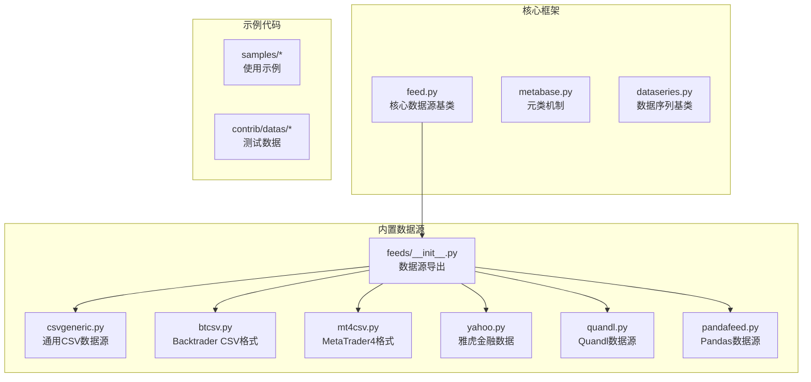
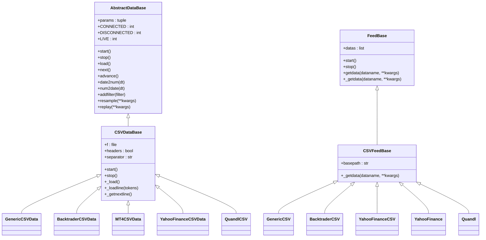
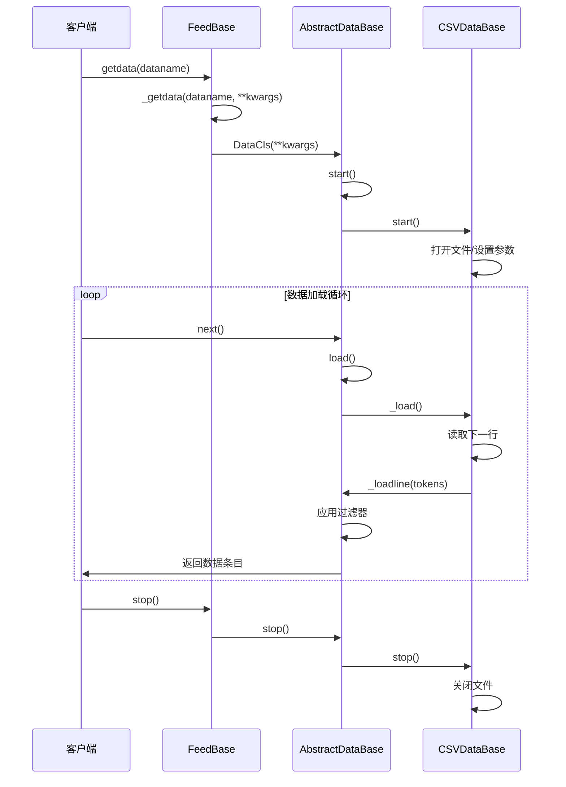
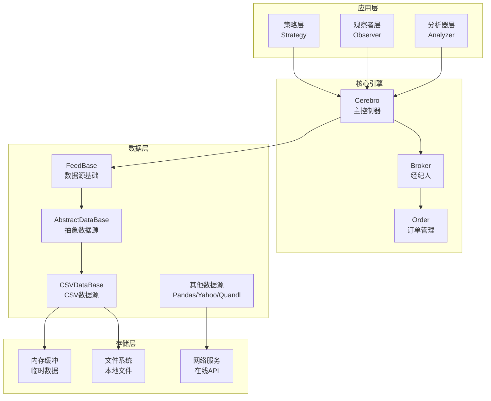
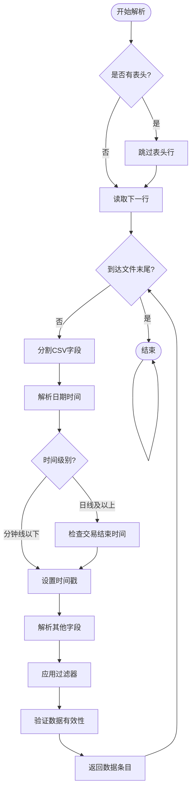
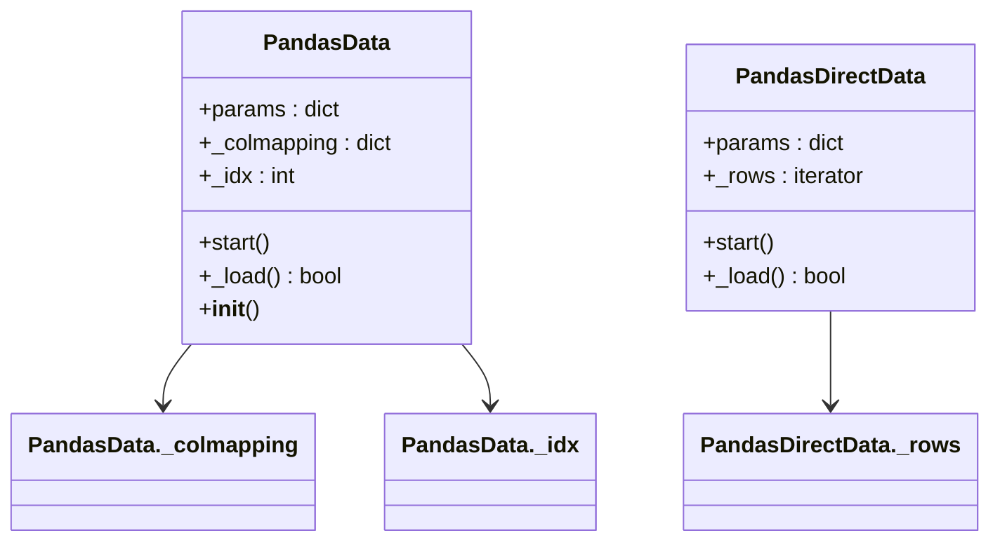
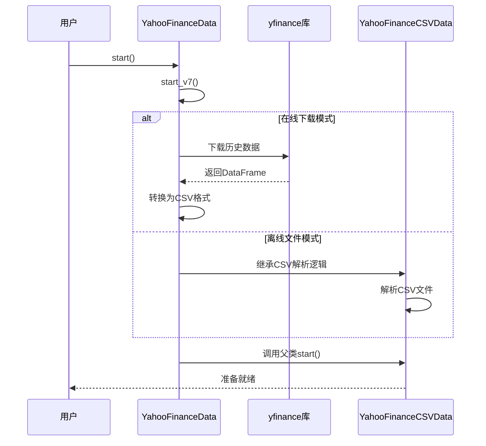
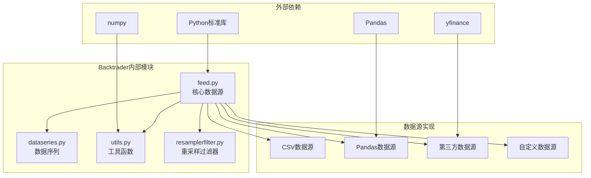
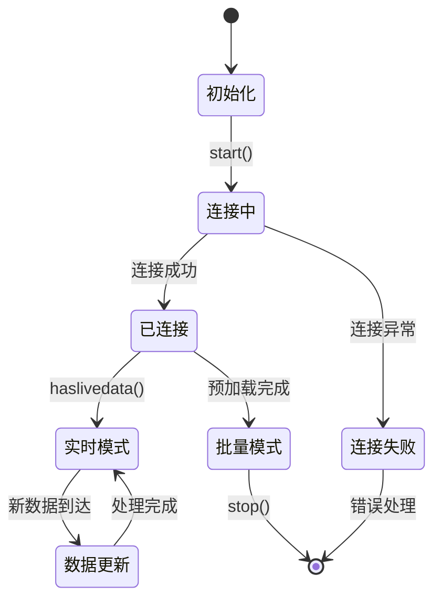

# 自定义数据源开发

<cite>
**本文档引用的文件**
- [feed.py](file://backtrader/feed.py)
- [__init__.py](file://backtrader/feeds/__init__.py)
- [csvgeneric.py](file://backtrader/feeds/csvgeneric.py)
- [btcsv.py](file://backtrader/feeds/btcsv.py)
- [mt4csv.py](file://backtrader/feeds/mt4csv.py)
- [yahoo.py](file://backtrader/feeds/yahoo.py)
- [quandl.py](file://backtrader/feeds/quandl.py)
- [pandafeed.py](file://backtrader/feeds/pandafeed.py)
- [data-pandas.py](file://samples/data-pandas/data-pandas.py)
- [bidask.py](file://samples/data-bid-ask/bidask.py)
- [quickstart.md](file://.claude/quickstart.md)
</cite>

## 目录
1. [简介](#简介)
2. [项目结构](#项目结构)
3. [核心组件](#核心组件)
4. [架构概览](#架构概览)
5. [详细组件分析](#详细组件分析)
6. [依赖关系分析](#依赖关系分析)
7. [性能考虑](#性能考虑)
8. [故障排除指南](#故障排除指南)
9. [结论](#结论)
10. [附录](#附录)

## 简介

Backtrader 是一个功能强大的量化交易回测框架，其数据源系统是整个框架的核心组成部分。本文档深入解析了自定义数据源开发的完整指南，重点介绍了 feed 基类的设计模式和继承关系，包括 FeedBase、CSVFeedBase 等抽象类的功能。

Backtrader 的数据源设计采用了分层架构模式，通过抽象基类定义统一接口，具体的数据源实现类负责处理特定的数据格式和来源。这种设计使得开发者可以轻松扩展新的数据源类型，同时保持代码的可维护性和一致性。

## 项目结构

Backtrader 的数据源相关代码主要分布在以下几个关键位置：

**图表来源**
- [feed.py](file://backtrader/feed.py#L1-L814)
- [__init__.py](file://backtrader/feeds/__init__.py#L1-L55)

**章节来源**
- [feed.py](file://backtrader/feed.py#L1-L814)
- [__init__.py](file://backtrader/feeds/__init__.py#L1-L55)

## 核心组件

### AbstractDataBase 抽象基类

AbstractDataBase 是所有数据源的基础抽象类，定义了数据源的核心行为和接口：

**图表来源**
- [feed.py](file://backtrader/feed.py#L122-L600)

### 数据源生命周期管理

数据源的生命周期包括初始化、启动、运行和停止四个阶段：

**图表来源**
- [feed.py](file://backtrader/feed.py#L400-L536)
- [feed.py](file://backtrader/feed.py#L667-L725)

**章节来源**
- [feed.py](file://backtrader/feed.py#L122-L600)
- [feed.py](file://backtrader/feed.py#L400-L536)

## 架构概览

Backtrader 的数据源架构采用分层设计，从底层的文件读取到上层的应用逻辑：

**图表来源**
- [feed.py](file://backtrader/feed.py#L603-L635)
- [feed.py](file://backtrader/feed.py#L122-L199)

## 详细组件分析

### CSV 数据源实现

CSV 数据源是 Backtrader 中最常用的数据源类型，提供了灵活的字段映射和解析能力。

#### GenericCSVData 分析

GenericCSVData 是最通用的 CSV 数据源实现，支持自定义字段映射和日期时间格式：

**图表来源**
- [csvgeneric.py](file://backtrader/feeds/csvgeneric.py#L103-L158)

#### 字段映射机制

GenericCSVData 提供了灵活的字段映射机制，允许开发者指定 CSV 文件中各字段的位置：

| 参数 | 默认值 | 描述 |
|------|--------|------|
| datetime | 0 | 日期时间字段索引 |
| time | -1 | 时间字段索引（可选） |
| open | 1 | 开盘价字段索引 |
| high | 2 | 最高价字段索引 |
| low | 3 | 最低价字段索引 |
| close | 4 | 收盘价字段索引 |
| volume | 5 | 成交量字段索引 |
| openinterest | 6 | 持仓量字段索引 |

**章节来源**
- [csvgeneric.py](file://backtrader/feeds/csvgeneric.py#L32-L85)
- [csvgeneric.py](file://backtrader/feeds/csvgeneric.py#L103-L158)

### Pandas 数据源实现

Pandas 数据源为使用 Pandas DataFrame 的用户提供了一种高效的数据接入方式：

**图表来源**
- [pandafeed.py](file://backtrader/feeds/pandafeed.py#L107-L274)

#### PandasData 特性

PandasData 支持两种工作模式：

1. **自动检测模式**：自动识别列名并建立映射关系
2. **直接索引模式**：使用数值索引直接访问 DataFrame 列

**章节来源**
- [pandafeed.py](file://backtrader/feeds/pandafeed.py#L107-L274)

### 第三方数据源集成

Backtrader 提供了多种第三方数据源的集成方案：

#### Yahoo Finance 集成

Yahoo Finance 数据源支持离线 CSV 文件和在线数据下载两种模式：

**图表来源**
- [yahoo.py](file://backtrader/feeds/yahoo.py#L253-L376)

**章节来源**
- [yahoo.py](file://backtrader/feeds/yahoo.py#L196-L382)

## 依赖关系分析

Backtrader 数据源系统的依赖关系体现了清晰的分层架构：

**图表来源**
- [feed.py](file://backtrader/feed.py#L30-L38)
- [__init__.py](file://backtrader/feeds/__init__.py#L25-L55)

**章节来源**
- [feed.py](file://backtrader/feed.py#L30-L38)
- [__init__.py](file://backtrader/feeds/__init__.py#L25-L55)

## 性能考虑

### 内存优化策略

Backtrader 在数据源处理中采用了多种内存优化技术：

1. **流式处理**：CSV 数据源采用逐行读取的方式，避免一次性加载整个文件
2. **数据预加载**：支持预加载模式，减少重复 I/O 操作
3. **缓冲区管理**：智能管理内部缓冲区，平衡内存使用和性能

### 并发处理

对于实时数据源，Backtrader 提供了并发处理能力：

**图表来源**
- [feed.py](file://backtrader/feed.py#L258-L273)

## 故障排除指南

### 常见问题诊断

#### 数据格式错误

当遇到数据格式错误时，可以通过以下方式进行诊断：

1. **检查字段映射**：确认 CSV 字段索引是否正确
2. **验证日期格式**：确保日期时间格式与 dtformat 参数匹配
3. **检查空值处理**：确认 nullvalue 参数设置合理

#### 内存不足问题

如果遇到内存不足的问题：

1. **启用预加载**：使用 preload() 方法减少重复 I/O
2. **调整缓冲区大小**：通过 qbuffer 参数控制内存使用
3. **优化数据过滤**：在数据源层面进行过滤减少数据量

**章节来源**
- [feed.py](file://backtrader/feed.py#L297-L301)
- [csvgeneric.py](file://backtrader/feeds/csvgeneric.py#L40-L70)

## 结论

Backtrader 的自定义数据源开发体系具有以下特点：

1. **高度模块化**：通过抽象基类定义统一接口，便于扩展新数据源
2. **灵活配置**：支持多种数据格式和参数配置选项
3. **性能优化**：采用流式处理和智能缓存机制
4. **易于集成**：提供丰富的第三方数据源集成方案

开发者可以根据具体需求选择合适的基类进行扩展，遵循 Backtrader 的设计模式和最佳实践，快速构建符合要求的自定义数据源。

## 附录

### 自定义数据源开发步骤

1. **选择基类**：根据数据格式选择合适的基类（如 CSVDataBase 或 PandasData）
2. **实现核心方法**：至少实现 _loadline() 方法（对于 CSV 数据源）
3. **配置参数**：定义必要的参数和默认值
4. **测试验证**：编写测试用例验证数据源的正确性
5. **性能优化**：根据使用场景进行性能调优

### 示例参考

- [BidAskCSV](file://samples/data-bid-ask/bidask.py#L31-L41)：演示如何创建自定义字段的数据源
- [PandasData 使用示例](file://samples/data-pandas/data-pandas.py#L63-L66)：展示 Pandas DataFrame 的集成方法
- [Quick Start 示例](file://.claude/quickstart.md#L112-L136)：提供基本的 CSV 数据源使用方法