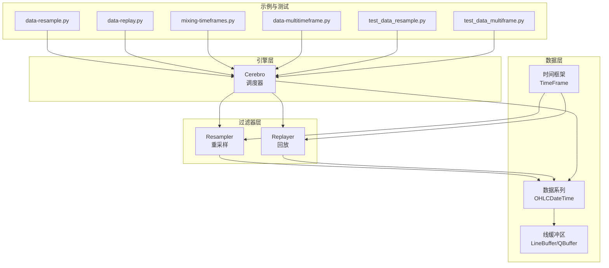
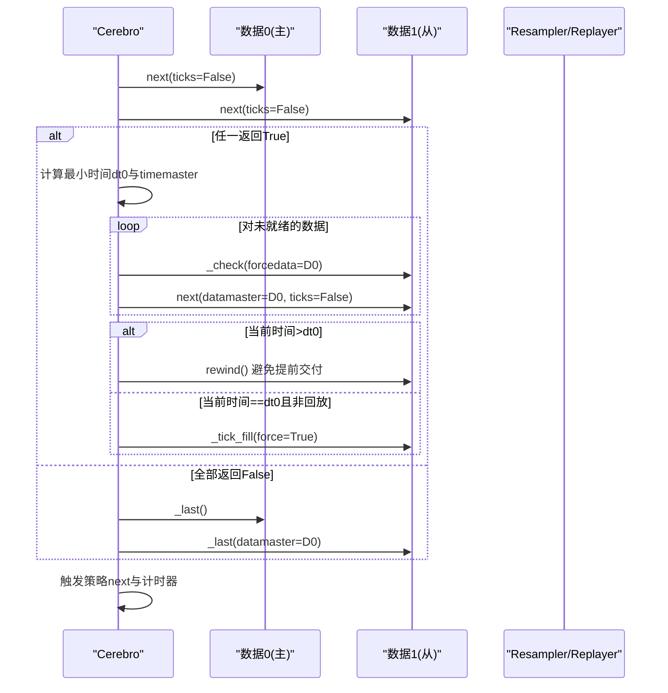
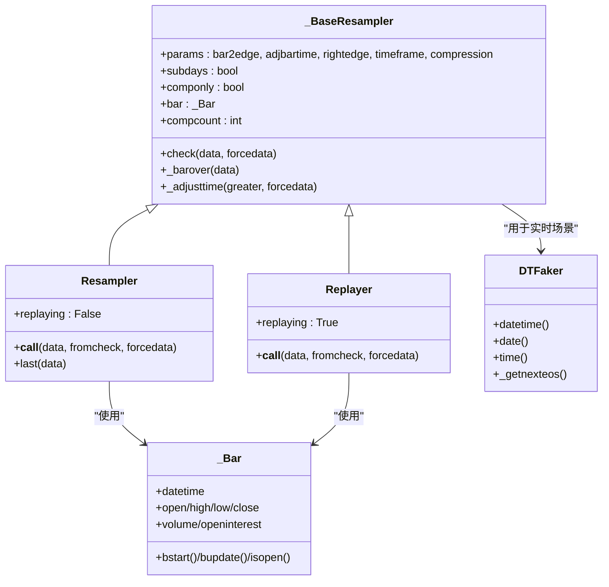
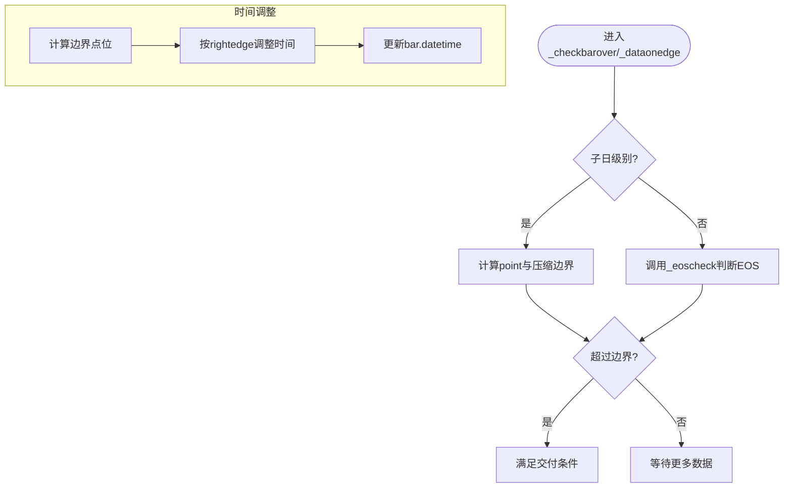
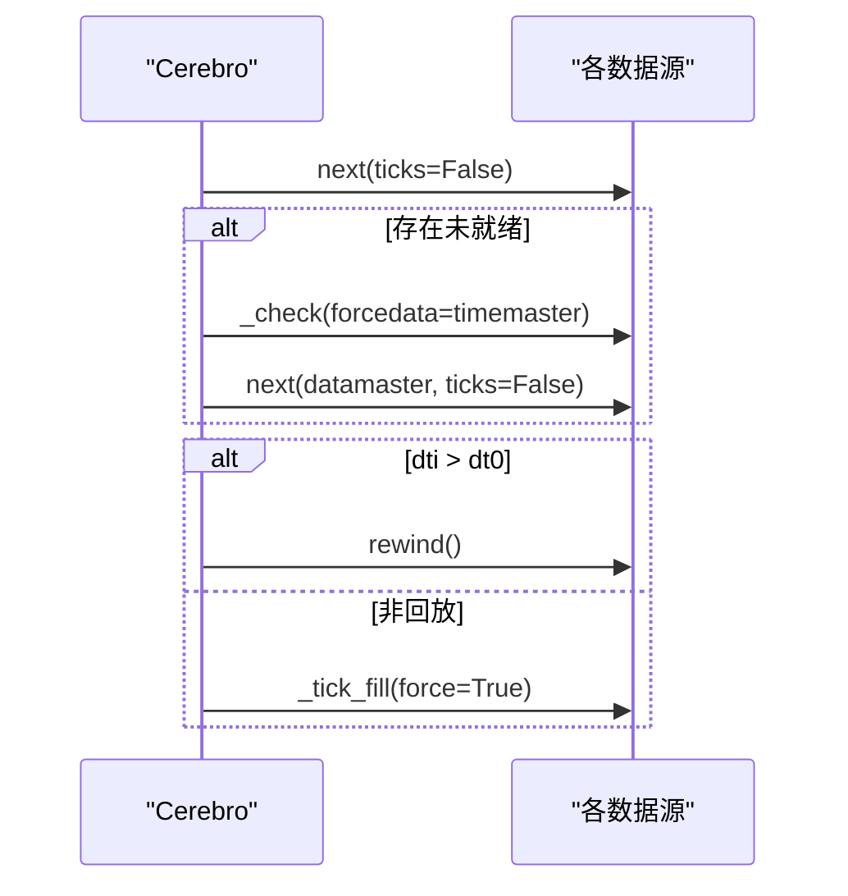
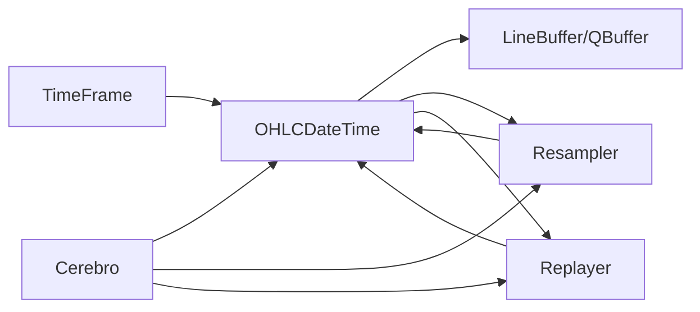

# 多时间框架支持

<cite>
**本文档引用的文件**
- [resamplerfilter.py](file://backtrader/resamplerfilter.py)
- [feed.py](file://backtrader/feed.py)
- [dataseries.py](file://backtrader/dataseries.py)
- [lineseries.py](file://backtrader/lineseries.py)
- [cerebro.py](file://backtrader/cerebro.py)
- [data-resample.py](file://samples/data-resample/data-resample.py)
- [data-replay.py](file://samples/data-replay/data-replay.py)
- [mixing-timeframes.py](file://samples/mixing-timeframes/mixing-timeframes.py)
- [data-multitimeframe.py](file://samples/data-multitimeframe/data-multitimeframe.py)
- [test_data_resample.py](file://tests/test_data_resample.py)
- [test_data_multiframe.py](file://tests/test_data_multiframe.py)
- [ibstore.py](file://backtrader/stores/ibstore.py)
- [vcdata.py](file://backtrader/feeds/vcdata.py)
- [dateintern.py](file://backtrader/utils/dateintern.py)
</cite>

## 目录
1. [引言](#引言)
2. [项目结构](#项目结构)
3. [核心组件](#核心组件)
4. [架构总览](#架构总览)
5. [详细组件分析](#详细组件分析)
6. [依赖关系分析](#依赖关系分析)
7. [性能考虑](#性能考虑)
8. [故障排除指南](#故障排除指南)
9. [结论](#结论)
10. [附录](#附录)

## 引言
本文件系统性阐述 Backtrader 的多时间框架（Multi-Time Frame, MTF）支持，重点覆盖以下方面：
- 多时间框架数据的并行处理机制
- Resampler（重采样）与 Replayer（回放）过滤器的工作原理与使用方法
- 时间框架转换的算法实现：重采样、回放、对齐与边界调整
- 多时间框架下的数据同步与对齐策略
- 多时间框架策略开发的最佳实践与注意事项
- 内存管理与性能优化技巧
- 不同数据源的时间框架兼容性问题
- 实际应用场景与案例分析

## 项目结构
Backtrader 的多时间框架能力由以下模块协同实现：
- 数据层：抽象数据源、数据系列、时间框架枚举与缓冲区
- 过滤器层：Resampler 与 Replayer 过滤器，负责时间框架转换
- 引擎层：Cerebro 调度器，负责多数据源的同步与推进
- 示例与测试：演示多时间框架用法与验证正确性

**图表来源**
- [dataseries.py](file://backtrader/dataseries.py#L33-L84)
- [resamplerfilter.py](file://backtrader/resamplerfilter.py#L96-L131)
- [feed.py](file://backtrader/feed.py#L592-L597)
- [cerebro.py](file://backtrader/cerebro.py#L1500-L1700)

**章节来源**
- [dataseries.py](file://backtrader/dataseries.py#L33-L84)
- [feed.py](file://backtrader/feed.py#L592-L597)
- [cerebro.py](file://backtrader/cerebro.py#L1500-L1700)

## 核心组件
- 时间框架枚举：定义 Ticks、Seconds、Minutes、Days、Weeks、Months、Years 等离散时间粒度，用于统一表示数据频率与压缩倍数。
- 数据系列与缓冲：OHLCDateTime 提供标准 OHLCV 线条；LineBuffer/QBuffer 支持可变长度与固定窗口两种模式，保障多时间框架下数据的高效存储与访问。
- 抽象数据源：AbstractDataBase 提供加载、过滤、通知、时区与会话边界等通用能力；支持通过 addfilter 添加 Resampler/Replayer。
- Resampler/Replayer：基于时间边界与压缩参数，将细粒度数据聚合为粗粒度数据，或在回放模式下逐步构建粗粒度条形。

**章节来源**
- [dataseries.py](file://backtrader/dataseries.py#L33-L84)
- [lineseries.py](file://backtrader/lineseries.py#L100-L300)
- [feed.py](file://backtrader/feed.py#L122-L597)
- [resamplerfilter.py](file://backtrader/resamplerfilter.py#L96-L131)

## 架构总览
Backtrader 在 Cerebro 层面实现多数据源的统一推进与同步。其核心流程如下：
- 数据源按时间框架与压缩倍数排序，确定“时间主数据”（timemaster）
- 对于未就绪的数据，调用 _check 强制检查以触发过滤器输出
- 对于非回放数据，若当前时间早于主数据时间，则回退（rewind）避免提前交付
- 对于回放数据，强制填充 tick 以模拟真实市场逐步构建过程
- 策略在每个时间步接收各数据的最新条目并执行逻辑

**图表来源**
- [cerebro.py](file://backtrader/cerebro.py#L1549-L1598)

**章节来源**
- [cerebro.py](file://backtrader/cerebro.py#L1500-L1700)

## 详细组件分析

### Resampler（重采样）与 Replayer（回放）过滤器
- 共同基类 _BaseResampler 维护内部条形缓存（_Bar）、压缩计数、边界判断与时间对齐逻辑
- Resampler：在到达时间边界或满足压缩条件时，输出已聚合的粗粒度条形；可选择将时间对齐到边界端点
- Replayer：在回放模式下逐步构建粗粒度条形，直到完成才真正推进长度，确保“闭合条形”的语义；可插入边界调整后的 tick

**图表来源**
- [resamplerfilter.py](file://backtrader/resamplerfilter.py#L96-L131)
- [resamplerfilter.py](file://backtrader/resamplerfilter.py#L435-L561)
- [resamplerfilter.py](file://backtrader/resamplerfilter.py#L563-L700)
- [resamplerfilter.py](file://backtrader/resamplerfilter.py#L33-L95)
- [dataseries.py](file://backtrader/dataseries.py#L146-L212)

**章节来源**
- [resamplerfilter.py](file://backtrader/resamplerfilter.py#L96-L753)

### 时间框架转换算法与边界对齐
- 边界计算：根据当前条形时间与目标时间框架，计算“点位”（point），再结合压缩倍数决定是否跨越边界
- 右边界/左边界：rightedge 控制对齐到结束边界还是开始边界
- 时间调整：adjbartime 为真时，将条形时间调整到边界对应时刻，保证对齐一致性
- EOS（End Of Session）：利用交易日历或会话结束时间，处理跨周末/节假日的边界情况

**图表来源**
- [resamplerfilter.py](file://backtrader/resamplerfilter.py#L142-L298)
- [resamplerfilter.py](file://backtrader/resamplerfilter.py#L362-L433)

**章节来源**
- [resamplerfilter.py](file://backtrader/resamplerfilter.py#L142-L433)

### 多时间框架数据同步与对齐策略
- 排序与主数据：按 (timeframe, compression) 排序，选择最小时间作为 timemaster
- 强制检查：对未就绪数据调用 _check，触发过滤器输出
- 回退与填充：当前时间大于主时间则回退；非回放数据在对齐时强制填充 tick
- 兼容旧同步：可通过参数启用旧版“以 data0 为主”的同步行为

**图表来源**
- [cerebro.py](file://backtrader/cerebro.py#L1553-L1598)

**章节来源**
- [cerebro.py](file://backtrader/cerebro.py#L1500-L1700)

### 使用方法与最佳实践
- 重采样：通过 AbstractDataBase.resample 或 cerebro.resampledata 指定 timeframe 与 compression
- 回放：通过 data.replay 或添加 Replayer* 过滤器，模拟市场逐步构建粗粒度条形
- 多数据源：先添加细粒度数据，再添加经重采样/回放的粗粒度数据；或直接添加两个独立数据源
- 策略耦合：使用 LineSeries.__call__ 的 LinesCoupler/LineDelay 将不同时间框架的指标进行对齐

**章节来源**
- [feed.py](file://backtrader/feed.py#L592-L597)
- [data-multitimeframe.py](file://samples/data-multitimeframe/data-multitimeframe.py#L122-L161)
- [mixing-timeframes.py](file://samples/mixing-timeframes/mixing-timeframes.py#L32-L56)

## 依赖关系分析
- 时间框架与数据系列：TimeFrame 定义离散粒度；OHLCDateTime 提供标准线条；LineBuffer/QBuffer 提供缓冲与内存管理
- 过滤器与数据源：AbstractDataBase 通过 addfilter 注入 Resampler/Replayer；过滤器修改数据的 _timeframe/_compression 并通过 _add2stack/_save2stack 输出
- 引擎与过滤器：Cerebro 在每轮推进中调用数据的 next/_check，并根据 timemaster 决策回退与填充

**图表来源**
- [dataseries.py](file://backtrader/dataseries.py#L33-L84)
- [lineseries.py](file://backtrader/lineseries.py#L100-L300)
- [feed.py](file://backtrader/feed.py#L592-L597)
- [resamplerfilter.py](file://backtrader/resamplerfilter.py#L96-L131)
- [cerebro.py](file://backtrader/cerebro.py#L1500-L1700)

**章节来源**
- [dataseries.py](file://backtrader/dataseries.py#L33-L84)
- [feed.py](file://backtrader/feed.py#L592-L597)
- [resamplerfilter.py](file://backtrader/resamplerfilter.py#L96-L131)
- [cerebro.py](file://backtrader/cerebro.py#L1500-L1700)

## 性能考虑
- 缓冲模式：QBuffer 模式在重采样/回放场景下额外预留一个位置，避免因 backwards 导致的历史值丢失
- 预加载与运行模式：runonce 模式按最小时间推进，适合批处理；next-by-next 模式更贴近实时
- 内存节省：qbuffer 与 savemem 参数可减少缓冲占用；注意 extrasize 的设置以平衡性能与正确性
- 时区与会话：本地化与会话边界计算可能带来额外开销，建议在数据源层面尽量提供 UTC 输入

**章节来源**
- [lineseries.py](file://backtrader/lineseries.py#L100-L300)
- [feed.py](file://backtrader/feed.py#L297-L301)
- [cerebro.py](file://backtrader/cerebro.py#L1664-L1684)

## 故障排除指南
- 条形未对齐：检查 rightedge 与 adjbartime 参数；确认压缩倍数与时间边界一致
- 数据提前交付：检查回放模式下的回退逻辑；确保非回放数据在对齐时强制填充 tick
- 实时数据无输出：调用 _check 强制触发过滤器；检查 qcheck 与 live 状态
- 会话边界异常：核对 sessionstart/sessionend 与交易日历配置；确认时区转换

**章节来源**
- [resamplerfilter.py](file://backtrader/resamplerfilter.py#L418-L433)
- [feed.py](file://backtrader/feed.py#L464-L470)
- [cerebro.py](file://backtrader/cerebro.py#L1575-L1598)

## 结论
Backtrader 的多时间框架支持通过“过滤器 + 引擎”的解耦设计实现了灵活而高效的细粗粒度数据转换与同步。Resampler 与 Replayer 分别满足批量重采样与回放仿真需求；Cerebro 的时间主数据机制确保多数据源在不同节奏下保持一致的推进步调。遵循本文的最佳实践与注意事项，可在保证正确性的前提下获得良好的性能表现。

## 附录

### 实际应用场景与案例
- 周期性策略：使用周线/月线进行趋势判断，分钟线进行入场/出场信号细化
- 多周期信号融合：将短周期动量与长周期趋势结合，通过 LinesCoupler 对齐不同时间框架的指标
- 回放测试：在回放模式下验证策略在“逐步构建”粗粒度条形时的行为稳定性

**章节来源**
- [data-resample.py](file://samples/data-resample/data-resample.py#L30-L96)
- [data-replay.py](file://samples/data-replay/data-replay.py#L52-L121)
- [mixing-timeframes.py](file://samples/mixing-timeframes/mixing-timeframes.py#L32-L93)
- [data-multitimeframe.py](file://samples/data-multitimeframe/data-multitimeframe.py#L93-L226)

### 测试与验证
- 单数据源重采样：验证周线 SMA 的周期与输出
- 多数据源混合：验证长周期数据的最小缓冲要求与策略行为

**章节来源**
- [test_data_resample.py](file://tests/test_data_resample.py#L39-L58)
- [test_data_multiframe.py](file://tests/test_data_multiframe.py#L37-L51)

### 数据源兼容性
- IB 时间框架映射：将 IB 的 bar size 映射到 TimeFrame 枚举，支持秒、分、日、周、月
- VChart 时间偏移：针对特定市场的输入时区与服务器时差进行补偿
- 时区解析：Localizer 与 pytz 支持，确保时间转换一致性

**章节来源**
- [ibstore.py](file://backtrader/stores/ibstore.py#L1114-L1174)
- [vcdata.py](file://backtrader/feeds/vcdata.py#L161-L181)
- [dateintern.py](file://backtrader/utils/dateintern.py#L48-L100)