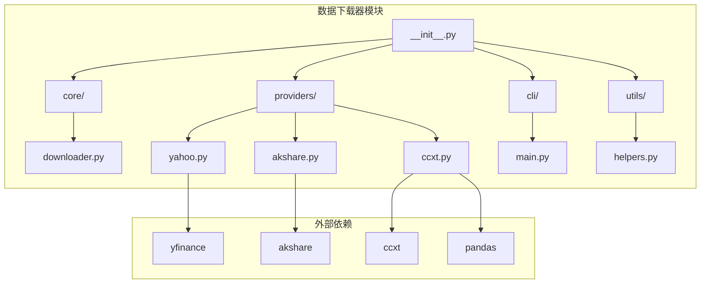
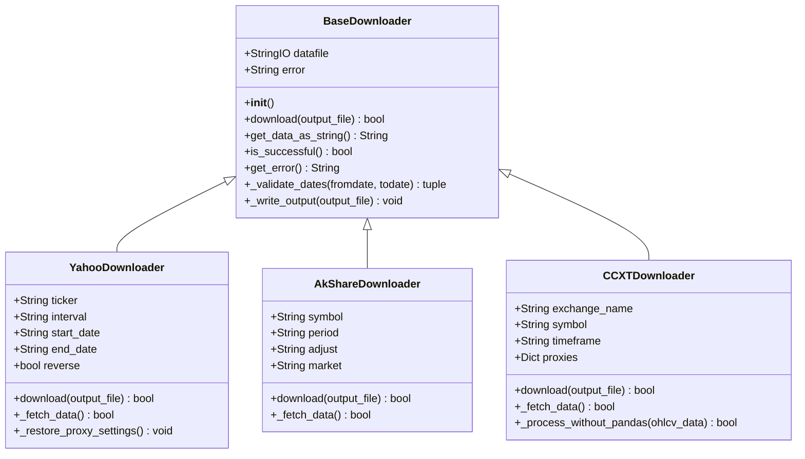
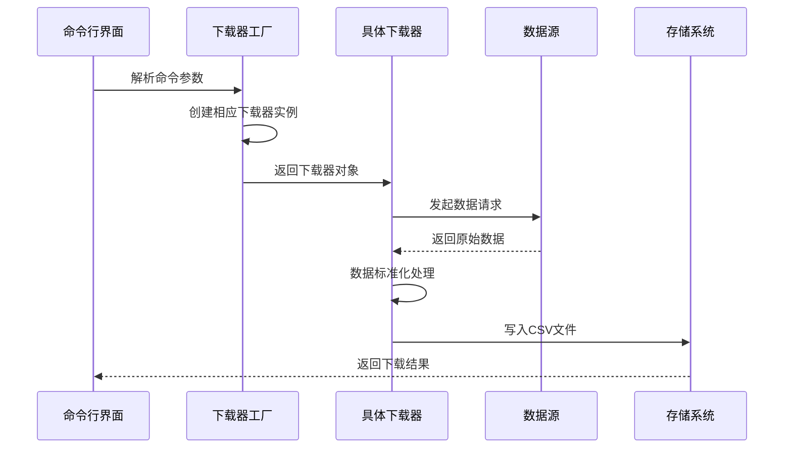
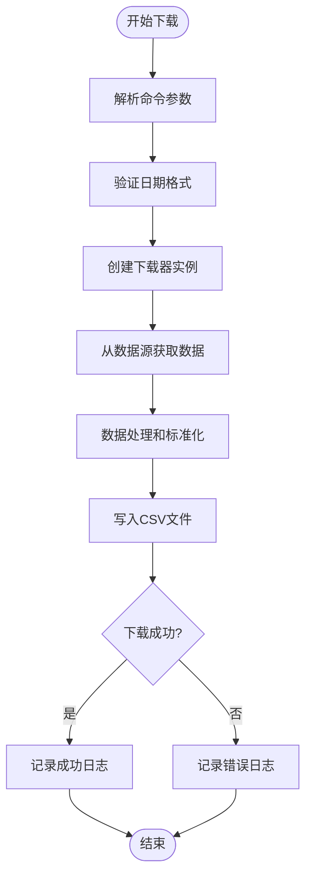
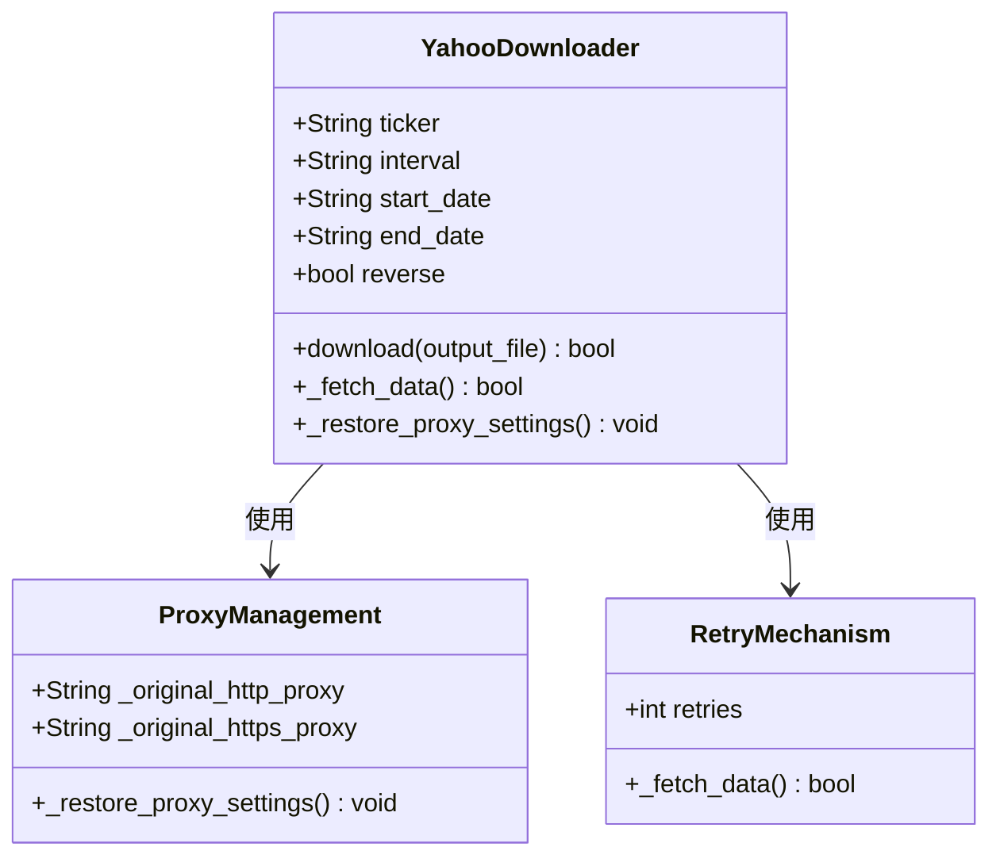
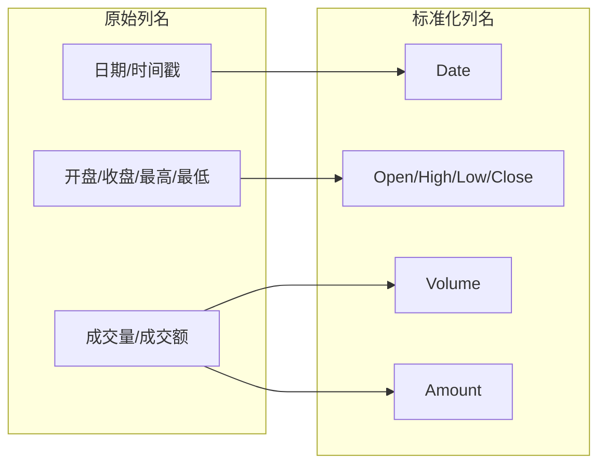
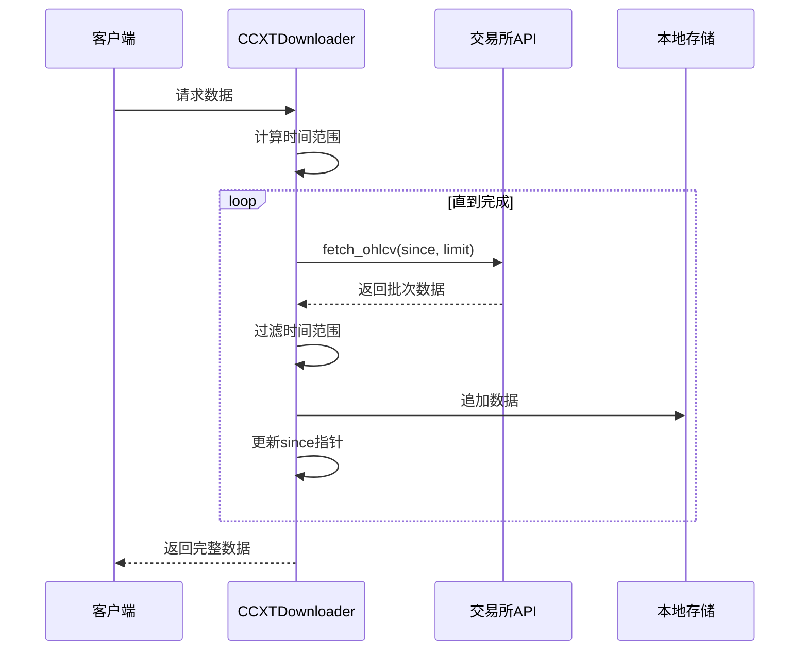
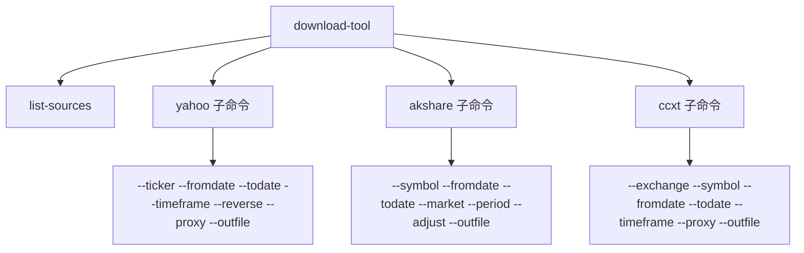
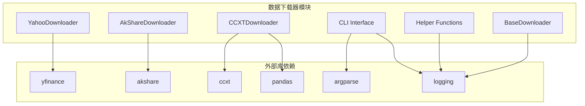
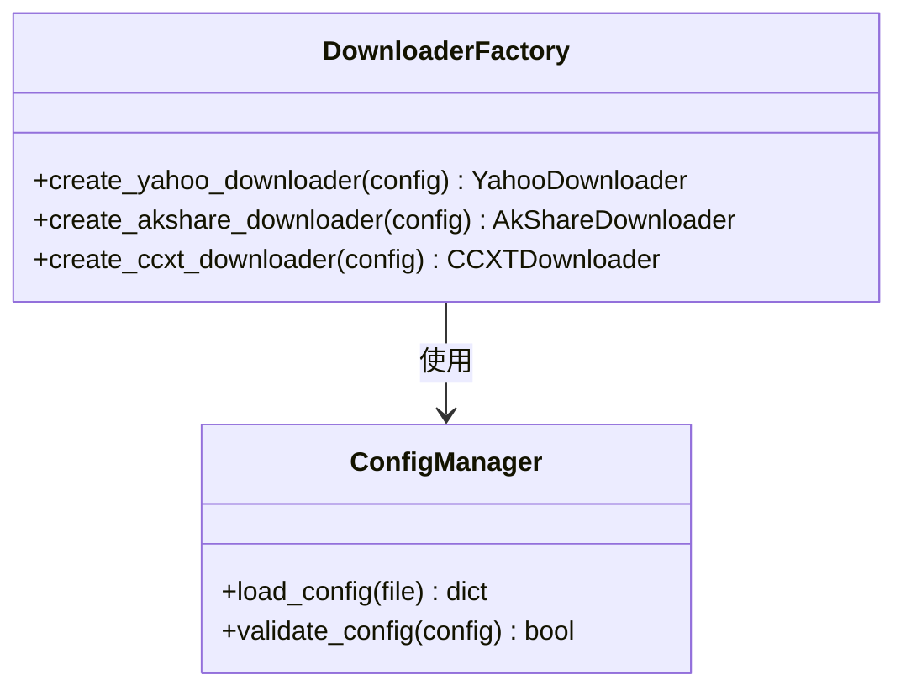

# 数据下载器模块

<cite>
**本文档引用的文件**
- [data_downloader/__init__.py](file://data_downloader/__init__.py)
- [data_downloader/core/downloader.py](file://data_downloader/core/downloader.py)
- [data_downloader/providers/yahoo.py](file://data_downloader/providers/yahoo.py)
- [data_downloader/providers/akshare.py](file://data_downloader/providers/akshare.py)
- [data_downloader/providers/ccxt.py](file://data_downloader/providers/ccxt.py)
- [data_downloader/cli/main.py](file://data_downloader/cli/main.py)
- [data_downloader/utils/helpers.py](file://data_downloader/utils/helpers.py)
- [scripts/download-tool](file://scripts/download-tool)
</cite>

## 目录
1. [简介](#简介)
2. [项目结构](#项目结构)
3. [核心组件](#核心组件)
4. [架构概览](#架构概览)
5. [详细组件分析](#详细组件分析)
6. [依赖关系分析](#依赖关系分析)
7. [性能考虑](#性能考虑)
8. [故障排除指南](#故障排除指南)
9. [结论](#结论)

## 简介

数据下载器模块是 Backtrader 平台的核心组件之一，提供统一的多数据源市场数据获取功能。该模块支持三种主要数据源：Yahoo Finance（全球金融市场）、AkShare（中国A股市场）和 CCXT（200+ 加密货币交易所），为量化交易策略开发提供了灵活、可扩展的数据获取解决方案。

该模块采用面向对象设计，通过抽象基类定义统一接口，具体的数据源实现遵循相同的编程模式，确保了代码的一致性和可维护性。

## 项目结构

数据下载器模块采用清晰的分层架构，每个组件都有明确的职责分工：



**图表来源**
- [data_downloader/__init__.py](file://data_downloader/__init__.py#L1-L43)
- [data_downloader/core/downloader.py](file://data_downloader/core/downloader.py#L1-L124)
- [data_downloader/providers/yahoo.py](file://data_downloader/providers/yahoo.py#L1-L233)
- [data_downloader/providers/akshare.py](file://data_downloader/providers/akshare.py#L1-L222)
- [data_downloader/providers/ccxt.py](file://data_downloader/providers/ccxt.py#L1-L251)

**章节来源**
- [data_downloader/__init__.py](file://data_downloader/__init__.py#L1-L43)
- [data_downloader/core/downloader.py](file://data_downloader/core/downloader.py#L1-L124)

## 核心组件

### 抽象基类 BaseDownloader

BaseDownloader 是所有具体下载器实现的基础抽象类，定义了统一的接口规范和通用功能：



**图表来源**
- [data_downloader/core/downloader.py](file://data_downloader/core/downloader.py#L15-L124)
- [data_downloader/providers/yahoo.py](file://data_downloader/providers/yahoo.py#L18-L233)
- [data_downloader/providers/akshare.py](file://data_downloader/providers/akshare.py#L15-L222)
- [data_downloader/providers/ccxt.py](file://data_downloader/providers/ccxt.py#L17-L251)

### 数据源支持矩阵

| 数据源 | 支持的市场类型 | 主要用途 | 特殊功能 |
|--------|----------------|----------|----------|
| Yahoo Finance | 全球股票、指数、期货、外汇、加密货币 | 传统金融数据 | 代理支持、重试机制 |
| AkShare | 中国A股、指数、基金、期货、国际期货 | 中国市场数据 | 多市场类型支持 |
| CCXT | 200+ 加密货币交易所 | 加密货币数据 | 代理支持、批量下载 |

**章节来源**
- [data_downloader/__init__.py](file://data_downloader/__init__.py#L14-L17)
- [data_downloader/utils/helpers.py](file://data_downloader/utils/helpers.py#L54-L108)

## 架构概览

数据下载器模块采用分层架构设计，确保了良好的可扩展性和可维护性：



**图表来源**
- [data_downloader/cli/main.py](file://data_downloader/cli/main.py#L34-L83)
- [data_downloader/providers/yahoo.py](file://data_downloader/providers/yahoo.py#L83-L110)
- [data_downloader/providers/akshare.py](file://data_downloader/providers/akshare.py#L64-L87)
- [data_downloader/providers/ccxt.py](file://data_downloader/providers/ccxt.py#L81-L104)

### 数据流处理流程



**图表来源**
- [data_downloader/core/downloader.py](file://data_downloader/core/downloader.py#L35-L66)
- [data_downloader/providers/yahoo.py](file://data_downloader/providers/yahoo.py#L111-L183)
- [data_downloader/providers/akshare.py](file://data_downloader/providers/akshare.py#L89-L186)
- [data_downloader/providers/ccxt.py](file://data_downloader/providers/ccxt.py#L106-L184)

## 详细组件分析

### Yahoo Finance 下载器

YahooDownloader 专门用于获取 Yahoo Finance 的全球金融市场数据，支持股票、指数、期货、外汇和加密货币：

#### 核心特性
- **代理支持**：支持 HTTP/HTTPS 代理配置
- **重试机制**：自动重试失败的请求
- **数据标准化**：统一输出格式
- **时间周期控制**：支持日线、周线、月线数据

#### 实现细节



**图表来源**
- [data_downloader/providers/yahoo.py](file://data_downloader/providers/yahoo.py#L18-L82)
- [data_downloader/providers/yahoo.py](file://data_downloader/providers/yahoo.py#L185-L197)

#### 重试策略

YahooDownloader 实现了指数退避重试机制，提高了数据获取的可靠性：

| 重试次数 | 等待时间 | 描述 |
|----------|----------|------|
| 第1次 | 5秒 | 初始等待时间 |
| 第2次 | 7秒 | 5 + 2^1 |
| 第3次 | 9秒 | 5 + 2^2 |

**章节来源**
- [data_downloader/providers/yahoo.py](file://data_downloader/providers/yahoo.py#L114-L153)

### AkShare 下载器

AkShareDownloader 专注于中国市场数据，支持 A 股、指数、基金、期货等多种市场类型：

#### 市场类型支持

| 市场类型 | 对应方法 | 功能描述 |
|----------|----------|----------|
| stock | stock_zh_a_hist | A股日线数据 |
| index | index_zh_a_hist 或 index_us_stock_sina | 指数数据（国内/国际） |
| fund | fund_open_fund_info_em | 基金净值数据 |
| futures | futures_zh_daily_sina | 国内期货数据 |
| foreign_futures | futures_foreign_hist | 国际期货数据 |

#### 数据标准化

AkShare 下载器实现了统一的数据列名映射，确保与 Backtrader 兼容：



**图表来源**
- [data_downloader/providers/akshare.py](file://data_downloader/providers/akshare.py#L142-L169)

**章节来源**
- [data_downloader/providers/akshare.py](file://data_downloader/providers/akshare.py#L89-L186)

### CCXT 下载器

CCXTDownloader 提供了对 200+ 加密货币交易所的支持，是模块中最复杂的实现：

#### 交易所支持

| 交易所 | 类型 | 特点 |
|--------|------|------|
| binance | 主流交易所 | 交易量最大 |
| okx | 合规交易所 | 美国合规运营 |
| huobi | 传统交易所 | 中国领先平台 |
| coinbase | 美国合规 | 监管最严格 |
| kraken | 老牌交易所 | 欧洲老牌平台 |
| bybit | 衍生品 | 专业衍生品平台 |
| kucoin | 新兴平台 | 多元化发展 |

#### 批量数据获取

CCXT 下载器实现了智能的批量数据获取机制：



**图表来源**
- [data_downloader/providers/ccxt.py](file://data_downloader/providers/ccxt.py#L118-L141)

**章节来源**
- [data_downloader/providers/ccxt.py](file://data_downloader/providers/ccxt.py#L106-L184)

### 命令行接口

CLI 模块提供了统一的命令行界面，支持所有数据源的操作：

#### 命令结构



**图表来源**
- [data_downloader/cli/main.py](file://data_downloader/cli/main.py#L125-L190)

**章节来源**
- [data_downloader/cli/main.py](file://data_downloader/cli/main.py#L97-L202)

## 依赖关系分析

数据下载器模块的依赖关系相对简单，主要依赖于各个数据源的专用库：



**图表来源**
- [data_downloader/providers/yahoo.py](file://data_downloader/providers/yahoo.py#L47-L53)
- [data_downloader/providers/akshare.py](file://data_downloader/providers/akshare.py#L44-L50)
- [data_downloader/providers/ccxt.py](file://data_downloader/providers/ccxt.py#L46-L52)
- [data_downloader/cli/main.py](file://data_downloader/cli/main.py#L9-L23)

### 依赖注入模式

模块采用了依赖注入的设计模式，允许在运行时动态选择和配置不同的数据源：



**图表来源**
- [data_downloader/cli/main.py](file://data_downloader/cli/main.py#L34-L70)

**章节来源**
- [data_downloader/cli/main.py](file://data_downloader/cli/main.py#L34-L83)

## 性能考虑

### 数据获取优化

1. **批量请求**：CCXT 实现了批量数据获取，减少 API 调用次数
2. **缓存机制**：建议在应用层面实现文件级缓存
3. **并发处理**：可以考虑实现多线程下载多个数据源
4. **内存管理**：使用 StringIO 流式处理大数据集

### 网络优化

1. **代理支持**：所有下载器都支持代理配置
2. **重试机制**：智能重试避免网络波动影响
3. **超时控制**：建议添加连接超时和读取超时设置

## 故障排除指南

### 常见问题及解决方案

#### 1. 依赖库缺失

**问题**：ImportError: No module named 'yfinance'
**解决方案**：
```bash
pip install yfinance
pip install akshare
pip install ccxt
pip install pandas
```

#### 2. 代理配置问题

**问题**：网络访问受限
**解决方案**：
```bash
# 使用代理下载
download-tool yahoo --ticker AAPL --fromdate 2020-01-01 --todate 2024-01-01 --proxy http://127.0.0.1:7890 --outfile data.txt
```

#### 3. 数据格式问题

**问题**：下载的数据格式不符合预期
**解决方案**：
```python
# 检查下载状态
downloader = YahooDownloader(ticker='AAPL', fromdate='2020-01-01', todate='2024-01-01')
success = downloader.download('data.txt')
if not success:
    print(f"下载失败: {downloader.get_error()}")
```

#### 4. 日期格式错误

**问题**：ValueError: Invalid fromdate format
**解决方案**：
```python
# 确保使用正确的日期格式
downloader = YahooDownloader(
    ticker='AAPL',
    fromdate='2020-01-01',  # 必须是 YYYY-MM-DD 格式
    todate='2024-01-01'
)
```

**章节来源**
- [data_downloader/providers/yahoo.py](file://data_downloader/providers/yahoo.py#L49-L53)
- [data_downloader/providers/akshare.py](file://data_downloader/providers/akshare.py#L46-L50)
- [data_downloader/providers/ccxt.py](file://data_downloader/providers/ccxt.py#L49-L52)

## 结论

数据下载器模块是一个设计精良、功能强大的多数据源数据获取系统。其主要优势包括：

1. **统一接口**：所有数据源都遵循相同的编程模式
2. **可扩展性**：易于添加新的数据源支持
3. **健壮性**：完善的错误处理和重试机制
4. **易用性**：简洁的命令行接口和编程接口
5. **灵活性**：支持多种数据格式和输出选项

该模块为 Backtrader 平台提供了坚实的数据基础设施，支持从传统金融到加密货币的全方位市场数据获取需求。通过合理的架构设计和丰富的功能特性，它成为了量化交易策略开发的重要工具。

未来可以考虑的功能增强包括：
- 添加更多数据源支持
- 实现数据缓存机制
- 增加并发下载能力
- 提供更丰富的数据预处理功能