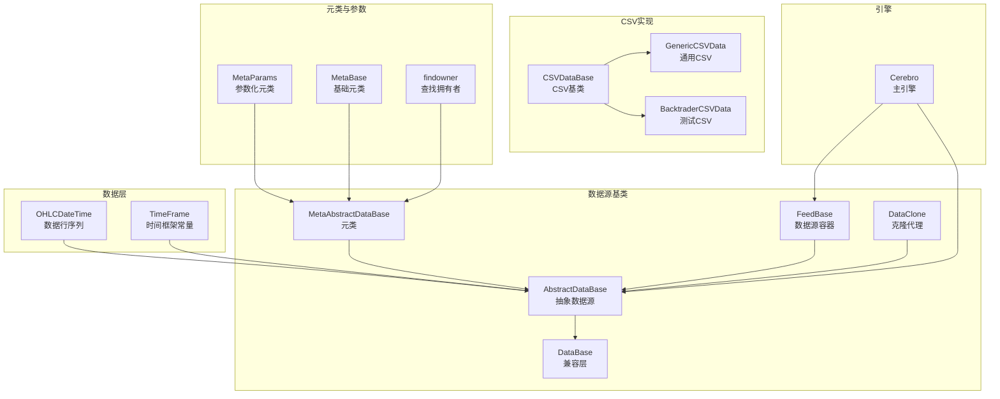
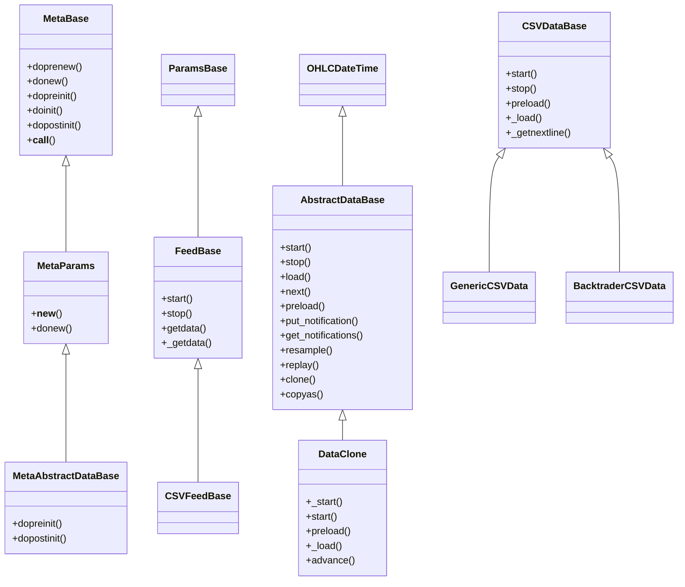
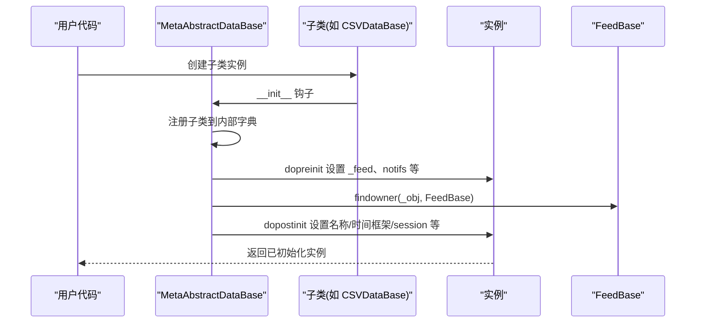
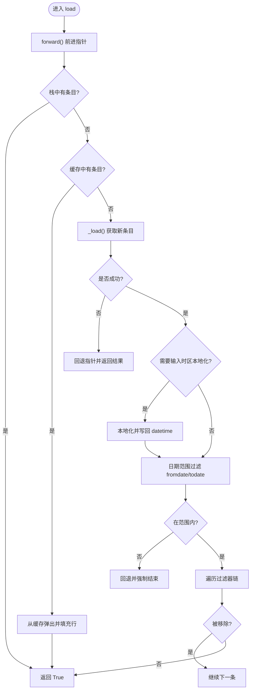
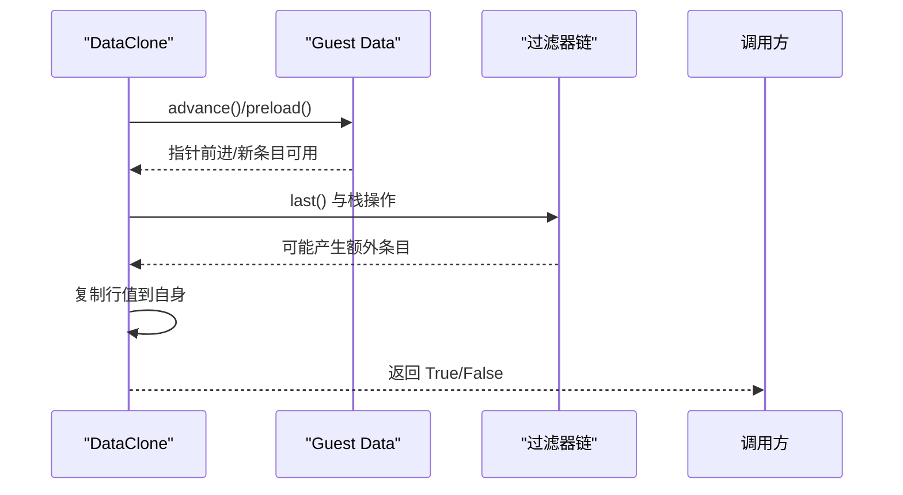
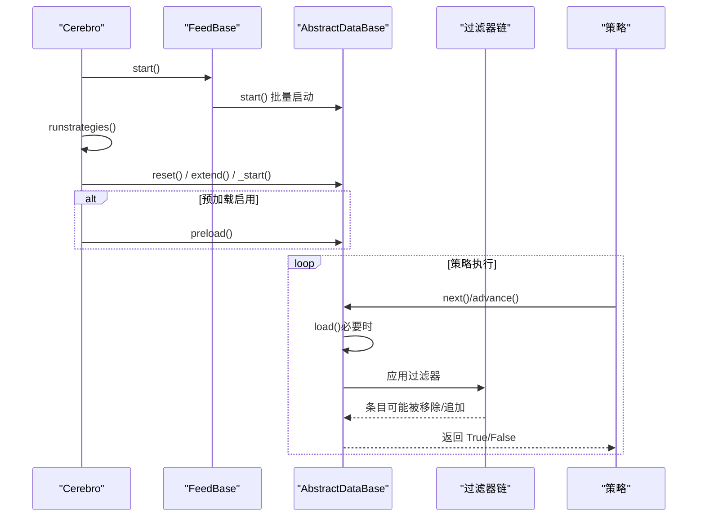
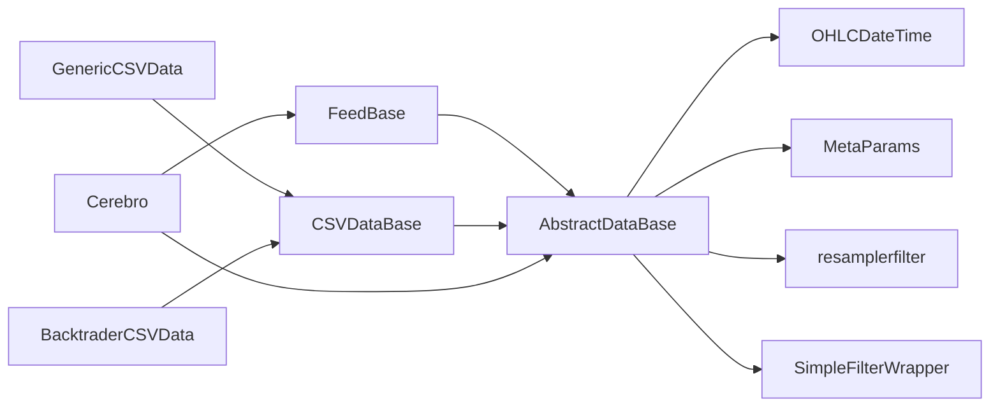

# 数据源基类架构

<cite>
**本文档引用的文件**
- [feed.py](file://backtrader/feed.py)
- [dataseries.py](file://backtrader/dataseries.py)
- [metabase.py](file://backtrader/metabase.py)
- [cerebro.py](file://backtrader/cerebro.py)
- [resamplerfilter.py](file://backtrader/resamplerfilter.py)
- [filters/datafilter.py](file://backtrader/filters/datafilter.py)
- [feeds/csvgeneric.py](file://backtrader/feeds/csvgeneric.py)
- [feeds/btcsv.py](file://backtrader/feeds/btcsv.py)
</cite>

## 目录
1. [引言](#引言)
2. [项目结构](#项目结构)
3. [核心组件](#核心组件)
4. [架构总览](#架构总览)
5. [详细组件分析](#详细组件分析)
6. [依赖关系分析](#依赖关系分析)
7. [性能考虑](#性能考虑)
8. [故障排除指南](#故障排除指南)
9. [结论](#结论)

## 引言
本文件系统性梳理 Backtrader 的数据源基类架构，重点解析 AbstractDataBase 与 FeedBase 的设计理念与实现机制，阐明元类 MetaAbstractDataBase 的作用机理，详解数据源生命周期（start、stop、load）与状态管理（连接状态、通知系统、时区处理），并给出 DataClone 克隆机制的实现原理与继承指南。同时说明数据源与 Cerebro 引擎的交互方式，包括数据预加载、时间推进、过滤器链等。

## 项目结构
Backtrader 的数据源相关代码主要集中在 backtrader/feed.py 中，配合基础数据结构 backtrader/dataseries.py、参数与元类机制 backtrader/metabase.py，以及与引擎交互的 backtrader/cerebro.py。具体文件职责如下：
- backtrader/feed.py：定义 AbstractDataBase、FeedBase、MetaAbstractDataBase、DataClone 等核心类与元类，以及 CSV 数据源基类与通用实现。
- backtrader/dataseries.py：定义 OHLCDateTime、TimeFrame、LineSeries 等基础数据结构与行序列容器。
- backtrader/metabase.py：提供参数化元类 MetaParams、基类 ParamsBase，以及 findowner 工具函数用于在初始化链中定位父级容器对象。
- backtrader/cerebro.py：Cerebro 引擎负责启动数据源、控制预加载与运行模式、驱动策略执行。
- backtrader/resamplerfilter.py：提供重采样与回放过滤器，支持按更高时间框架聚合或回放历史。
- backtrader/filters/datafilter.py：通用数据过滤器包装器，基于回调函数筛选条目。
- backtrader/feeds/csvgeneric.py、backtrader/feeds/btcsv.py：CSV 数据源的具体实现示例。

**图表来源**
- [feed.py](file://backtrader/feed.py#L41-L120)
- [dataseries.py](file://backtrader/dataseries.py#L33-L113)
- [metabase.py](file://backtrader/metabase.py#L66-L91)
- [cerebro.py](file://backtrader/cerebro.py#L60-L320)

**章节来源**
- [feed.py](file://backtrader/feed.py#L41-L120)
- [dataseries.py](file://backtrader/dataseries.py#L33-L113)
- [metabase.py](file://backtrader/metabase.py#L66-L91)
- [cerebro.py](file://backtrader/cerebro.py#L60-L320)

## 核心组件
本节聚焦 AbstractDataBase、FeedBase、MetaAbstractDataBase 及其派生类，解释它们在数据流中的角色与协作方式。

- AbstractDataBase：所有数据源的抽象基类，提供生命周期管理、状态管理、通知系统、过滤器链、重采样/回放、克隆接口等通用能力。
- FeedBase：数据源容器，统一管理多个数据源实例，负责批量启动/停止与工厂式创建数据源。
- MetaAbstractDataBase：为 AbstractDataBase 及其子类注册、设置默认名称、绑定 FeedBase、初始化通知队列、构建过滤器链等。
- DataClone：克隆代理，复制另一个数据源的时间框架、会话边界、时区与日期范围，实现“影子”数据源以避免重复加载。

**章节来源**
- [feed.py](file://backtrader/feed.py#L122-L598)
- [feed.py](file://backtrader/feed.py#L603-L635)
- [feed.py](file://backtrader/feed.py#L41-L120)
- [feed.py](file://backtrader/feed.py#L736-L814)

## 架构总览
Backtrader 的数据源架构采用“元类 + 参数化 + 过滤器链”的设计，将数据加载、时间转换、会话边界、重采样/回放、通知与克隆等横切关注点集中于基类，子类仅需实现最小化的加载逻辑（如 CSV 解析）。Cerebro 负责调度数据源的生命周期与运行模式。

**图表来源**
- [feed.py](file://backtrader/feed.py#L41-L120)
- [feed.py](file://backtrader/feed.py#L122-L598)
- [feed.py](file://backtrader/feed.py#L603-L635)
- [feed.py](file://backtrader/feed.py#L649-L726)
- [feed.py](file://backtrader/feed.py#L736-L814)
- [dataseries.py](file://backtrader/dataseries.py#L107-L113)

**章节来源**
- [feed.py](file://backtrader/feed.py#L41-L120)
- [feed.py](file://backtrader/feed.py#L122-L598)
- [feed.py](file://backtrader/feed.py#L603-L726)
- [dataseries.py](file://backtrader/dataseries.py#L107-L113)

## 详细组件分析

### 元类 MetaAbstractDataBase 的作用机制
- 注册子类：在类创建完成后，将非别名且非内部类名的子类登记到内部字典，便于后续发现与使用。
- 初始化前钩子：在实例初始化前，通过工具函数在调用栈中向上查找并绑定 FeedBase 容器；同时初始化通知队列与基础属性。
- 初始化后钩子：确定数据源名称、时间框架与压缩倍数；标准化 sessionstart/sessionend；将 fromdate/todate 转换为数值；建立过滤器链（普通过滤器与“last”型过滤器）。

**图表来源**
- [feed.py](file://backtrader/feed.py#L41-L120)
- [metabase.py](file://backtrader/metabase.py#L42-L63)

**章节来源**
- [feed.py](file://backtrader/feed.py#L41-L120)
- [metabase.py](file://backtrader/metabase.py#L42-L63)

### AbstractDataBase 生命周期管理
- start/stop：初始化内部状态（如条形栈、上次状态、过滤器链），释放资源。
- preload：循环调用 load 直到无新数据，然后将指针归位至末尾。
- load：前进指针，尝试从栈/缓存获取条目；若无则调用 _load 获取新条目；进行时间本地化与日期范围过滤；依次通过过滤器链；返回 True 表示可用条目。
- next/advance：在未预加载场景下触发 load；在有主数据源对齐时检查时间戳；支持 tick 填充以支持实时/回放场景。
- 时间与会话：_start_finish 在启动后计算输出时区、输入时区本地化器、fromdate/todate 数值化、日历对象；_getnexteos 计算下一交易日结束时间。
- 通知系统：put_notification 将状态变更入队；get_notifications 提供后台线程安全的批量出队。
- 克隆接口：clone/copyas 返回 DataClone 实例，实现“影子”数据源。

**图表来源**
- [feed.py](file://backtrader/feed.py#L471-L536)

**章节来源**
- [feed.py](file://backtrader/feed.py#L202-L598)

### 状态管理与通知系统
- 连接状态：定义了 CONNECTED、DISCONNECTED、CONNBROKEN、DELAYED、LIVE、NOTSUBSCRIBED、NOTSUPPORTED_TIMEFRAME、UNKNOWN 等状态码与名称映射。
- 通知系统：put_notification 将状态与参数入队；get_notifications 使用哨兵 None 分隔批次，保证后台线程与主线程间的安全传递。
- 时区处理：_gettz/_gettzinput 支持从参数解析时区；date2num/num2date 在存在输出时区时进行本地化；输入时区本地化器用于将输入时间转换为 UTC。

**章节来源**
- [feed.py](file://backtrader/feed.py#L141-L164)
- [feed.py](file://backtrader/feed.py#L274-L292)
- [feed.py](file://backtrader/feed.py#L241-L256)

### DataClone 克隆机制
DataClone 是一个“影子”数据源，它不直接加载数据，而是复制另一个数据源（guest data）的当前条目。其关键行为：
- 复制时间框架、压缩倍数、会话边界、日期范围、时区与日历。
- 在预加载阶段，跟随 guest data 前进并复制行值。
- 在非预加载阶段，检测 guest data 是否推进到新条目，若是则复制。

**图表来源**
- [feed.py](file://backtrader/feed.py#L736-L814)

**章节来源**
- [feed.py](file://backtrader/feed.py#L736-L814)

### 继承指南：如何正确实现自定义数据源
- 若为 CSV 数据源，建议继承 CSVDataBase 并实现 _loadline(linetokens)：解析单行并填充 OHLC 等行。
- 若为其他格式，可直接继承 AbstractDataBase 并实现 _load()：每次调用返回 True 表示成功加载一条新条目。
- 关键要点：
  - 在 start() 中打开/准备数据源（如文件句柄）。
  - 在 stop() 中释放资源。
  - 在 _load() 中推进内部指针并填充行值。
  - 如需过滤，使用 addfilter 或 addfilter_simple 注册过滤器。
  - 如需重采样/回放，调用 resample()/replay() 并传入相应参数。
  - 如需通知外部（如连接状态变化），使用 put_notification(status, ...)。

参考实现：
- CSV 通用实现：GenericCSVData
- 测试 CSV 实现：BacktraderCSVData

**章节来源**
- [feed.py](file://backtrader/feed.py#L649-L726)
- [feeds/csvgeneric.py](file://backtrader/feeds/csvgeneric.py#L32-L162)
- [feeds/btcsv.py](file://backtrader/feeds/btcsv.py#L30-L63)

### 数据源与 Cerebro 引擎的交互
- 启动阶段：Cerebro.run() 会根据配置决定是否启用预加载与向量化运行；逐个启动 Store、FeedBase、Broker，再启动每个数据源。
- 预加载：当启用预加载时，Cerebro 调用 data.preload() 将数据拉入内存，随后将指针归位至末尾。
- 时间推进：Cerebro 驱动策略执行，策略通过 data.next()/advance() 获取下一时刻数据；对于实时/回放场景，next() 会触发 load()。
- 过滤器链：AbstractDataBase 内部维护 _filters 与 _ffilters，在 load() 中依次应用，支持“最后一批”过滤器在数据耗尽时触发。
- 重采样/回放：通过 resample()/replay() 添加过滤器，底层由 resamplerfilter.py 提供实现。

**图表来源**
- [cerebro.py](file://backtrader/cerebro.py#L1029-L1228)
- [feed.py](file://backtrader/feed.py#L400-L462)
- [resamplerfilter.py](file://backtrader/resamplerfilter.py#L96-L200)

**章节来源**
- [cerebro.py](file://backtrader/cerebro.py#L1029-L1228)
- [feed.py](file://backtrader/feed.py#L400-L462)
- [resamplerfilter.py](file://backtrader/resamplerfilter.py#L96-L200)

## 依赖关系分析
- AbstractDataBase 依赖：
  - dataseries.OHLCDateTime：提供行序列与 OHLC 结构。
  - metabase.MetaParams：参数化机制，确保参数在 __init__ 前设置。
  - utils.date：时间转换与本地化工具。
  - resamplerfilter：重采样/回放过滤器。
  - filters.SimpleFilterWrapper：简单过滤器包装。
- FeedBase 依赖：
  - metabase.MetaParams：参数化容器。
  - AbstractDataBase：作为数据源基类。
- CSV 数据源依赖：
  - feed.CSVDataBase：通用 CSV 基类。
  - utils.date：时间解析与转换。
- Cerebro 依赖：
  - AbstractDataBase：驱动数据源生命周期。
  - Strategy：策略执行主体。
  - Broker：订单与资金管理。

**图表来源**
- [feed.py](file://backtrader/feed.py#L122-L598)
- [dataseries.py](file://backtrader/dataseries.py#L107-L113)
- [resamplerfilter.py](file://backtrader/resamplerfilter.py#L96-L200)
- [cerebro.py](file://backtrader/cerebro.py#L60-L320)

**章节来源**
- [feed.py](file://backtrader/feed.py#L122-L598)
- [dataseries.py](file://backtrader/dataseries.py#L107-L113)
- [resamplerfilter.py](file://backtrader/resamplerfilter.py#L96-L200)
- [cerebro.py](file://backtrader/cerebro.py#L60-L320)

## 性能考虑
- 预加载与 runonce：Cerebro.run() 会根据 exactbars/live 等参数调整是否启用预加载与向量化运行，以平衡内存占用与执行效率。
- 过滤器链：过滤器在每条新数据上顺序执行，应尽量保持轻量；“last”型过滤器在数据耗尽时触发，避免额外扫描。
- 重采样/回放：会引入额外的时间边界判断与条目聚合，注意压缩倍数与时间边界对性能的影响。
- 通知系统：后台线程频繁入队通知时，建议合理设置 qcheck 以减少忙等。

[本节为通用指导，无需特定文件分析]

## 故障排除指南
- 数据未加载或提前结束：
  - 检查 _load() 是否正确推进内部指针并返回布尔值。
  - 确认 load() 中的日期范围过滤是否过于严格。
- 时区异常：
  - 确认 _gettz/_gettzinput 返回值与输入数据一致；确保 date2num/num2date 的时区链路正确。
- 通知未到达：
  - 确保 put_notification 在状态变更时调用；get_notifications 使用哨兵分隔批次。
- 克隆数据不同步：
  - DataClone 在预加载阶段会跟随 guest data 前进；非预加载阶段需确认 guest data 是否推进。

**章节来源**
- [feed.py](file://backtrader/feed.py#L471-L536)
- [feed.py](file://backtrader/feed.py#L241-L256)
- [feed.py](file://backtrader/feed.py#L274-L292)
- [feed.py](file://backtrader/feed.py#L784-L814)

## 结论
Backtrader 的数据源基类架构通过元类与参数化机制实现了高度可扩展的数据接入模型。AbstractDataBase 将数据加载、时间处理、过滤器链、通知与克隆等通用能力内聚，子类只需专注于数据解析或网络拉取。FeedBase 提供统一的容器与工厂能力，Cerebro 则在运行期协调数据源生命周期与执行模式。遵循本文的继承指南与最佳实践，可以快速实现稳定、高性能的自定义数据源。