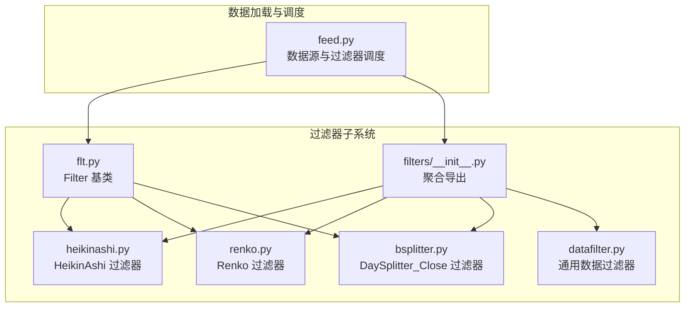
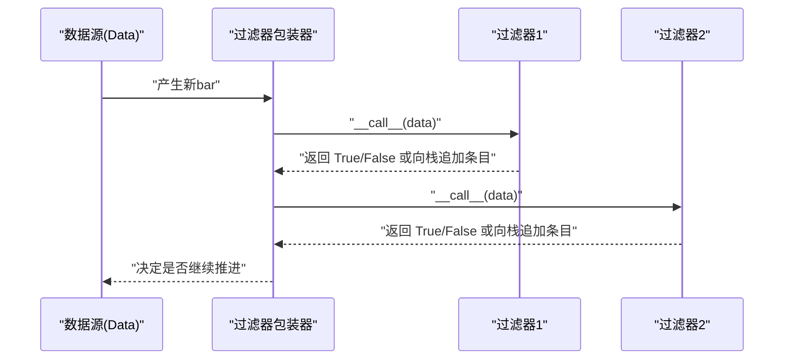
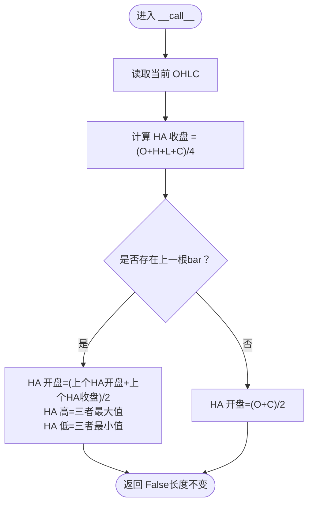
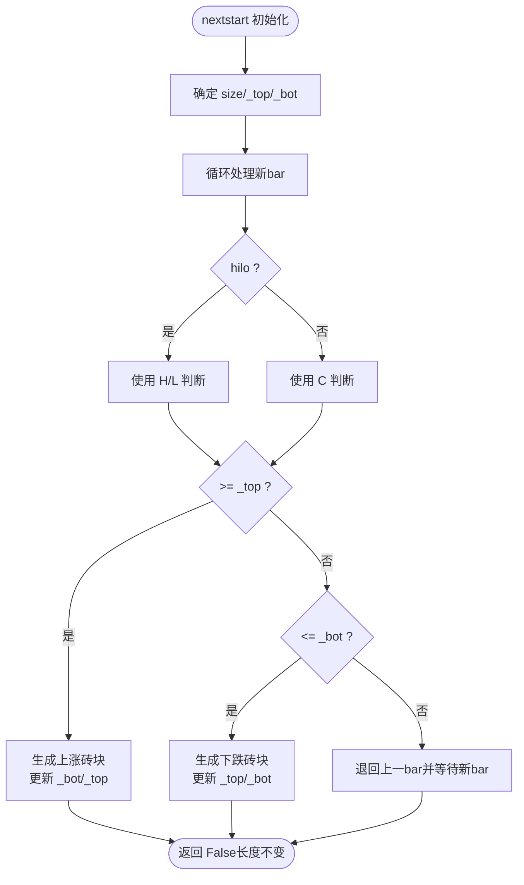
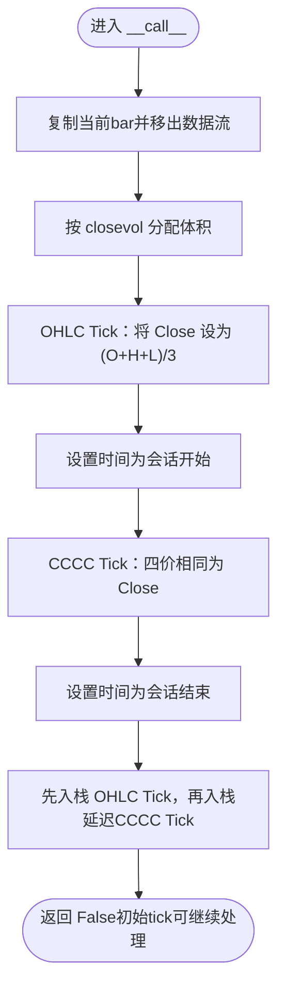
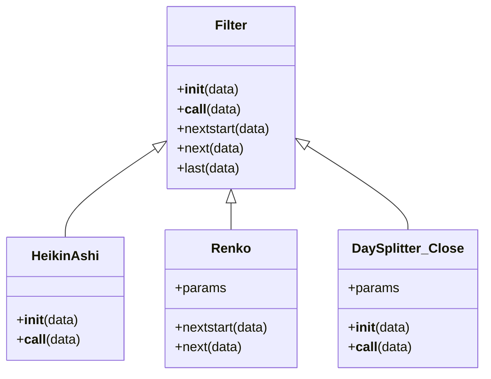

# 技术分析过滤器

<cite>
**本文引用的文件**
- [backtrader/filters/heikinashi.py](file://backtrader/filters/heikinashi.py)
- [backtrader/filters/renko.py](file://backtrader/filters/renko.py)
- [backtrader/filters/bsplitter.py](file://backtrader/filters/bsplitter.py)
- [backtrader/filters/__init__.py](file://backtrader/filters/__init__.py)
- [backtrader/filters/datafilter.py](file://backtrader/filters/datafilter.py)
- [backtrader/flt.py](file://backtrader/flt.py)
- [backtrader/feed.py](file://backtrader/feed.py)
- [samples/renko/renko.py](file://samples/renko/renko.py)
- [tests/test_ind_heikinashi.py](file://tests/test_ind_heikinashi.py)
- [samples/data-multitimeframe/data-multitimeframe.py](file://samples/data-multitimeframe/data-multitimeframe.py)
</cite>

## 目录
1. [引言](#引言)
2. [项目结构](#项目结构)
3. [核心组件](#核心组件)
4. [架构总览](#架构总览)
5. [详细组件分析](#详细组件分析)
6. [依赖关系分析](#依赖关系分析)
7. [性能考量](#性能考量)
8. [故障排查指南](#故障排查指南)
9. [结论](#结论)
10. [附录](#附录)

## 引言
本文件系统化梳理 Backtrader 中“技术分析过滤器”的实现与应用，重点覆盖三类过滤器：Heikin Ashi（平均蜡烛）过滤器、Renko（方块图）过滤器、以及 Bar Splitter（K线拆分）过滤器。文档从架构设计、数据流、处理逻辑、参数配置、使用示例到性能与实战应用进行逐层展开，帮助读者在不同市场环境下正确选择与调优这些过滤器。

## 项目结构
Backtrader 的过滤器位于 filters 子包中，采用“模块化 + 基类统一调度”的方式组织。每个过滤器模块导出一个或多个可被数据源直接添加的过滤器类；过滤器基类负责生命周期管理（初始化、首次启动、每次新bar处理、收尾等），并维护内部状态以实现跨bar的连续计算。

图表来源
- [backtrader/filters/__init__.py](file://backtrader/filters/__init__.py#L25-L35)
- [backtrader/filters/heikinashi.py](file://backtrader/filters/heikinashi.py#L28-L55)
- [backtrader/filters/renko.py](file://backtrader/filters/renko.py#L31-L140)
- [backtrader/filters/bsplitter.py](file://backtrader/filters/bsplitter.py#L29-L112)
- [backtrader/filters/datafilter.py](file://backtrader/filters/datafilter.py#L27-L74)
- [backtrader/flt.py](file://backtrader/flt.py#L36-L54)
- [backtrader/feed.py](file://backtrader/feed.py#L326-L596)

章节来源
- [backtrader/filters/__init__.py](file://backtrader/filters/__init__.py#L25-L35)
- [backtrader/flt.py](file://backtrader/flt.py#L32-L54)
- [backtrader/feed.py](file://backtrader/feed.py#L326-L596)

## 核心组件
- HeikinAshi 过滤器：将 OHLC 转换为 Heikin Ashi 平均蜡烛，平滑价格波动、突出趋势方向。
- Renko 过滤器：按固定或自适应“砖块”大小生成方块图，强调突破与趋势延续，抑制噪音。
- DaySplitter_Close 过滤器：将日线拆分为两个Tick，模拟开盘与收盘两个阶段，用于回放与多周期分析。

章节来源
- [backtrader/filters/heikinashi.py](file://backtrader/filters/heikinashi.py#L28-L55)
- [backtrader/filters/renko.py](file://backtrader/filters/renko.py#L31-L140)
- [backtrader/filters/bsplitter.py](file://backtrader/filters/bsplitter.py#L29-L112)

## 架构总览
过滤器通过数据源的 addfilter/addfilter_simple 接口注册，运行时由数据源在每次产生新bar后依次调用各过滤器。过滤器可直接修改当前bar，也可向数据栈追加/延迟产出新的条目，从而实现“重采样/回放/拆分”等复杂变换。

图表来源
- [backtrader/feed.py](file://backtrader/feed.py#L516-L533)
- [backtrader/flt.py](file://backtrader/flt.py#L40-L54)

## 详细组件分析

### HeikinAshi 过滤器
- 实现原理
  - 将当前 OHLC 计算为 HA 的收盘价；
  - 若存在上一根 HA 条，则 HA 开盘取上一根 HA 的 (开盘+收盘)/2，HA 高/低取该根 HA 的开盘/收盘与原高/低的最大/最小；
  - 首根bar使用 OHLC 的特定组合计算 HA 开盘，避免无前值。
- 数据流与复杂度
  - 每次新bar仅 O(1) 计算，不改变数据流长度，适合实时/回测的低开销趋势识别。
- 参数与行为
  - 无外部参数，内部状态仅依赖历史数据长度。
- 适用场景
  - 股票、外汇、商品等连续报价市场，用于平滑噪音、识别多空趋势转折。

图表来源
- [backtrader/filters/heikinashi.py](file://backtrader/filters/heikinashi.py#L41-L55)

章节来源
- [backtrader/filters/heikinashi.py](file://backtrader/filters/heikinashi.py#L28-L55)
- [tests/test_ind_heikinashi.py](file://tests/test_ind_heikinashi.py#L28-L54)

### Renko 过滤器
- 工作机制
  - 初始化：根据对齐因子 align 对起始价对齐，确定初始砖块尺寸 size 或基于 autosize 自动计算；
  - 处理流程：比较当前 bar 的最高价或最低价（取决于 hilo 选项）与上下边界 _top/_bot；
  - 突破规则：向上突破生成上涨砖块，向下突破生成下跌砖块；若启用动态尺寸且 size 未指定，则在新砖生成时重新计算 size 并对齐；
  - 输出：生成标准 OHLC 的砖块，成交量与持仓置零，保持数据流长度不变但输出新条目。
- 关键参数
  - hilo：使用最高/最低还是收盘价判断是否需要新砖；
  - size：固定砖块大小；
  - autosize：当 size 为空时，按当前价格除以该系数自动计算；
  - dynamic：开启后每次新砖生成时重新计算 size；
  - align：对价格边界的对齐因子；
  - roundstart：是否将起始价四舍五入为整数。
- 适用性
  - 商品期货、外汇等波动较大市场，强调趋势突破与通道确认；
  - 可通过 align/autosize 控制噪音敏感度，通过 dynamic 提升对波动变化的适应性。

图表来源
- [backtrader/filters/renko.py](file://backtrader/filters/renko.py#L75-L140)

章节来源
- [backtrader/filters/renko.py](file://backtrader/filters/renko.py#L31-L140)
- [samples/renko/renko.py](file://samples/renko/renko.py#L42-L89)

### Bar Splitter（K线拆分）过滤器
- 功能特性
  - 将日线bar拆分为两个Tick：第一个Tick为 OHLX（收盘替换为 (O+H+L)/3），第二个Tick为 CCCC（四个价格相同）；
  - 时间分别对应会话开始与结束时间；
  - 体积按比例分配（默认收盘Tick占比 0.5），持仓清零；
  - 通过内部栈延迟第二个Tick的处理，确保两段有序产出。
- 参数
  - closevol：收盘Tick的体积占比（0~1，默认 0.5）。
- 应用场景
  - 与回放（replay）配合，模拟日内开盘与收盘的两个阶段，提升多周期分析精度；
  - 在日线数据上引入更精细的时间片段，便于捕捉关键时点信号。

图表来源
- [backtrader/filters/bsplitter.py](file://backtrader/filters/bsplitter.py#L64-L112)

章节来源
- [backtrader/filters/bsplitter.py](file://backtrader/filters/bsplitter.py#L29-L112)

## 依赖关系分析
- 过滤器基类
  - Filter 基类定义了统一的生命周期：构造、首次启动 nextstart、每次新bar的 next、以及可选的 last（收尾）；
  - 数据源在 load 循环中遍历过滤器链，允许过滤器向栈追加条目或延迟产出。
- 数据源调度
  - addfilter/addfilter_simple 将过滤器加入数据源的过滤器列表；
  - load 时按顺序调用过滤器，若返回 True 表示当前bar被移除，需重新取新bar；
  - _add2stack/_fromstack 提供过滤器间的数据传递与延迟产出能力。

图表来源
- [backtrader/flt.py](file://backtrader/flt.py#L36-L54)
- [backtrader/filters/heikinashi.py](file://backtrader/filters/heikinashi.py#L28-L55)
- [backtrader/filters/renko.py](file://backtrader/filters/renko.py#L31-L73)
- [backtrader/filters/bsplitter.py](file://backtrader/filters/bsplitter.py#L29-L60)

章节来源
- [backtrader/flt.py](file://backtrader/flt.py#L32-L54)
- [backtrader/feed.py](file://backtrader/feed.py#L516-L596)

## 性能考量
- HeikinAshi
  - 计算量极小，O(1)，适合高频与长回测周期；
  - 不改变数据长度，内存占用稳定。
- Renko
  - 生成新砖时才输出，通常远少于原始bar数量，显著降低数据规模；
  - autosize/dynamic 会增加少量计算与潜在的价格对齐开销；
  - align 可减少边界抖动，提高稳定性。
- DaySplitter_Close
  - 每个bar拆分为两条记录，数据量翻倍，但仅在日线级别使用时影响可控；
  - closevol 可调节回放细节与计算负载。

[本节为通用性能讨论，无需列出具体文件来源]

## 故障排查指南
- Renko 未生成砖块
  - 检查 hilo 与 size/autosize 设置是否合理；
  - 确认 align 是否导致边界对齐过度；
  - 若使用 dynamic，注意尺寸变化可能带来的边界跳变。
- HeikinAshi 结果异常
  - 确认数据源 OHLC 含义与顺序一致；
  - 首根bar的开盘计算依赖 O 与 C 的组合，确保两者有效。
- DaySplitter_Close 导致回放错位
  - 检查 sessionstart/sessionend 与 closevol 的设置；
  - 确保与回放（replay）的时间框架匹配。

章节来源
- [backtrader/filters/renko.py](file://backtrader/filters/renko.py#L66-L73)
- [backtrader/filters/heikinashi.py](file://backtrader/filters/heikinashi.py#L41-L55)
- [backtrader/filters/bsplitter.py](file://backtrader/filters/bsplitter.py#L58-L60)

## 结论
- HeikinAshi 适合趋势识别与噪音平滑；
- Renko 适合突破驱动的系统，尤其在高波动市场；
- DaySplitter_Close 适合需要日内关键时点建模的多周期分析。
三者均可与回放/重采样结合，形成灵活的数据预处理流水线。

[本节为总结性内容，无需列出具体文件来源]

## 附录

### 使用示例与配置要点
- Renko 示例
  - 在数据源上添加 Renko 过滤器，并通过命令行参数传入 size/autosize/align 等；
  - 支持对同一数据克隆后叠加过滤器，实现双时间框架对比。
- 多时间框架与回放
  - 使用 replay/resample 将分钟级数据转换为更高时间框架；
  - DaySplitter_Close 可与 replay 配合，模拟开盘/收盘两个阶段。
- 测试与验证
  - 使用测试脚本验证 HeikinAshi 指标输出；
  - 使用 Renko 示例脚本快速验证过滤器行为。

章节来源
- [samples/renko/renko.py](file://samples/renko/renko.py#L42-L89)
- [samples/data-multitimeframe/data-multitimeframe.py](file://samples/data-multitimeframe/data-multitimeframe.py#L140-L161)
- [tests/test_ind_heikinashi.py](file://tests/test_ind_heikinashi.py#L28-L54)