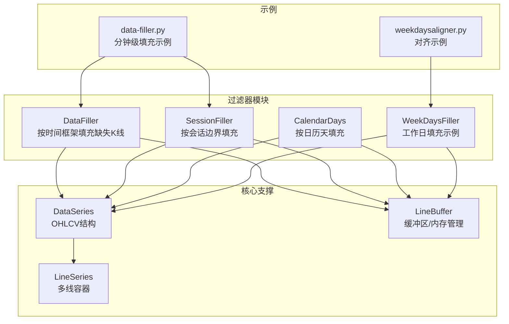
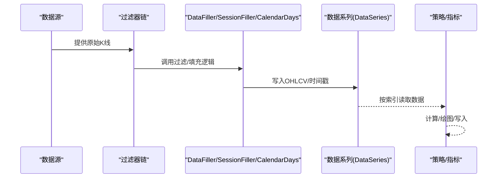
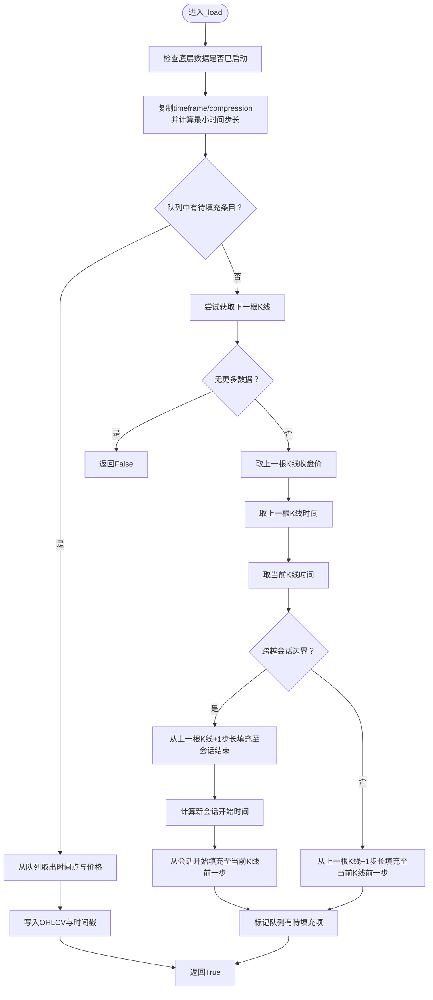
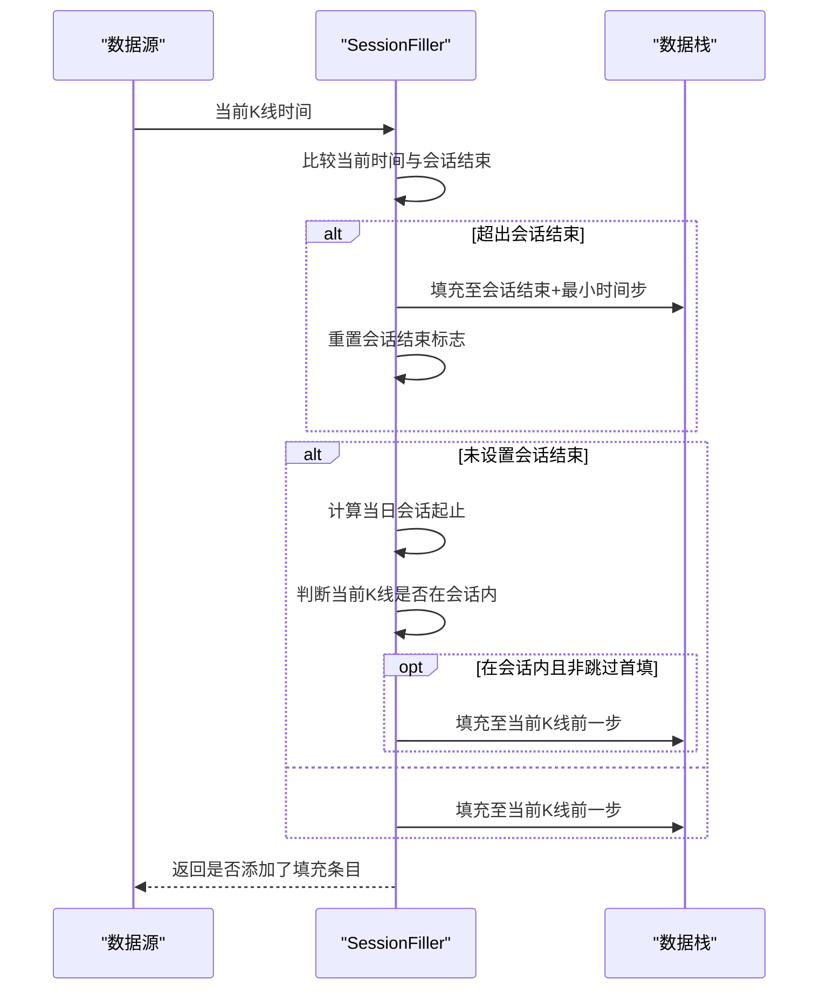
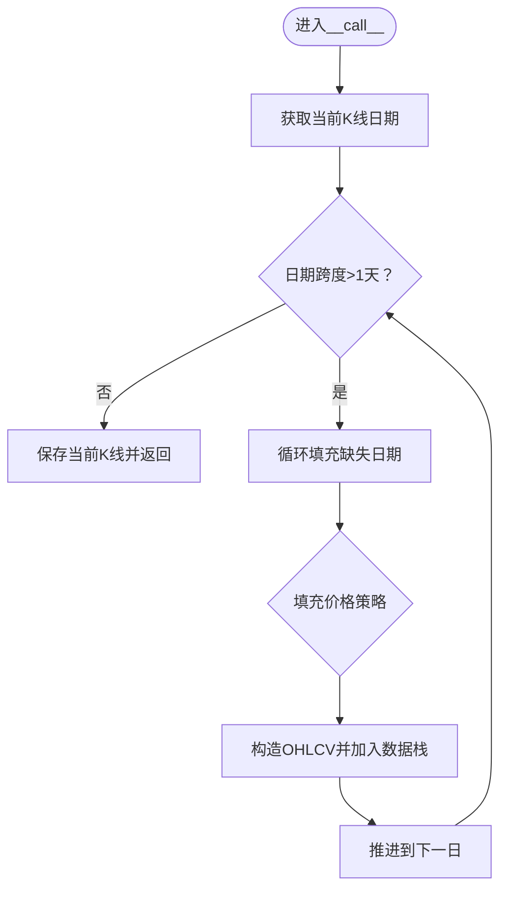
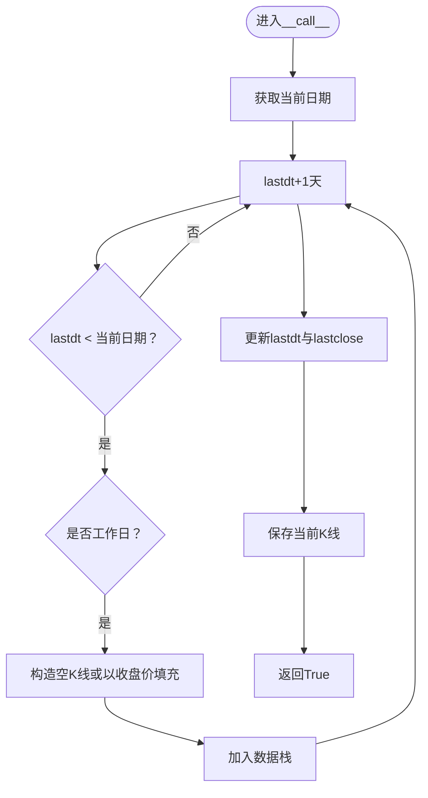
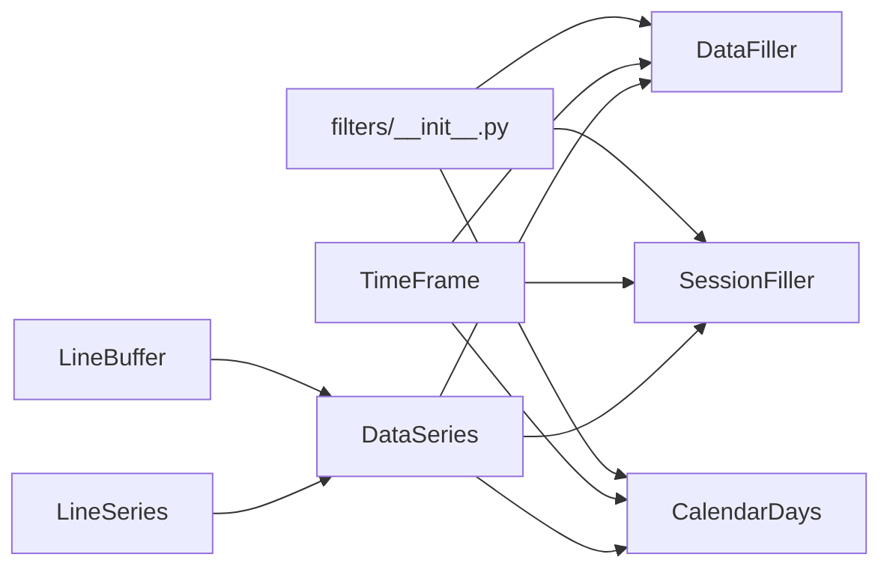

# 数据填充器

<cite>
**本文引用的文件**
- [backtrader/filters/datafiller.py](file://backtrader/filters/datafiller.py)
- [backtrader/filters/session.py](file://backtrader/filters/session.py)
- [backtrader/filters/calendardays.py](file://backtrader/filters/calendardays.py)
- [backtrader/filters/__init__.py](file://backtrader/filters/__init__.py)
- [samples/data-filler/data-filler.py](file://samples/data-filler/data-filler.py)
- [samples/weekdays-filler/weekdaysfiller.py](file://samples/weekdays-filler/weekdaysfiller.py)
- [samples/weekdays-filler/weekdaysaligner.py](file://samples/weekdays-filler/weekdaysaligner.py)
- [backtrader/dataseries.py](file://backtrader/dataseries.py)
- [backtrader/linebuffer.py](file://backtrader/linebuffer.py)
- [backtrader/lineseries.py](file://backtrader/lineseries.py)
</cite>

## 目录
1. [简介](#简介)
2. [项目结构](#项目结构)
3. [核心组件](#核心组件)
4. [架构总览](#架构总览)
5. [详细组件分析](#详细组件分析)
6. [依赖关系分析](#依赖关系分析)
7. [性能考量](#性能考量)
8. [故障排查指南](#故障排查指南)
9. [结论](#结论)
10. [附录](#附录)

## 简介
本文件系统化梳理 BackTrader 中的数据填充器体系，围绕缺失数据检测、填充策略选择与数据完整性保障进行深入解析。重点覆盖以下能力：
- 缺失数据检测：按时间框架与会话边界识别断层
- 填充策略：前向填充（使用上一根K线收盘价）、常量填充（NaN/指定数值）、日历天填充（跨周末/节假日）
- 数据完整性：确保时间序列对齐、避免越界访问、维持OHLCV一致性
- 配置参数与使用场景：分钟级对齐、日线补全、异常值处理
- 性能优化与内存管理：缓冲区模式、最小缓冲长度、队列复用
- 数据质量检查与验证：边界条件、会话切换、连续性校验

## 项目结构
数据填充器位于 filters 子模块，配合示例在 samples 中演示典型用法；底层数据结构由 dataseries 与 linebuffer 提供支撑。

**图表来源**
- [backtrader/filters/datafiller.py](file://backtrader/filters/datafiller.py#L30-L177)
- [backtrader/filters/session.py](file://backtrader/filters/session.py#L31-L245)
- [backtrader/filters/calendardays.py](file://backtrader/filters/calendardays.py#L31-L121)
- [samples/data-filler/data-filler.py](file://samples/data-filler/data-filler.py#L37-L89)
- [samples/weekdays-filler/weekdaysfiller.py](file://samples/weekdays-filler/weekdaysfiller.py#L27-L67)
- [backtrader/dataseries.py](file://backtrader/dataseries.py#L60-L113)
- [backtrader/linebuffer.py](file://backtrader/linebuffer.py#L100-L182)

**章节来源**
- [backtrader/filters/__init__.py](file://backtrader/filters/__init__.py#L25-L35)

## 核心组件
- DataFiller：基于时间框架与压缩倍数，按最小时间步长在会话内填充缺失K线，默认使用上一根K线的收盘价作为OHLC填充值，支持自定义填充价格、成交量与未平仓量。
- SessionFiller：在会话开始/结束范围内按时间步长填充缺失K线，支持跳过首个会话的首根K线前填充。
- CalendarDays：检测日级别断层（大于1天），按日填充缺失交易日，支持使用上一根K线收盘价或中点价填充。
- WeekDaysFiller（示例）：按工作日规则填充缺失交易日，可选以最近收盘价填充。

这些组件均通过数据源的 sessionstart/sessionend、timeframe/compression 等元信息驱动，确保填充行为与业务会话一致。

**章节来源**
- [backtrader/filters/datafiller.py](file://backtrader/filters/datafiller.py#L30-L177)
- [backtrader/filters/session.py](file://backtrader/filters/session.py#L31-L245)
- [backtrader/filters/calendardays.py](file://backtrader/filters/calendardays.py#L31-L121)
- [samples/weekdays-filler/weekdaysfiller.py](file://samples/weekdays-filler/weekdaysfiller.py#L27-L67)

## 架构总览
数据填充器在数据流上的位置如下：数据源产生原始K线，经由过滤器链（如会话过滤、填充器）输出到策略与指标，最终写入/绘图。

**图表来源**
- [backtrader/filters/datafiller.py](file://backtrader/filters/datafiller.py#L110-L177)
- [backtrader/filters/session.py](file://backtrader/filters/session.py#L81-L140)
- [backtrader/filters/calendardays.py](file://backtrader/filters/calendardays.py#L61-L121)
- [backtrader/dataseries.py](file://backtrader/dataseries.py#L60-L113)

## 详细组件分析

### DataFiller 组件分析
DataFiller 的核心职责是“按时间框架与压缩倍数在会话内填充缺失K线”。其关键流程：
- 初始化与预加载：复制底层数据的时间框架与压缩倍数，计算最小时间步长
- 缺失检测：比较当前K线与上一根K线的时间戳，若跨越会话边界或存在时间间隔缺口，则记录待填充队列
- 填充执行：从队列弹出待填充时间点，使用上一根K线收盘价或自定义价格生成OHLCV，写入当前行
- 边界处理：会话开始/结束时分别处理缺口，避免跨会话填充

**图表来源**
- [backtrader/filters/datafiller.py](file://backtrader/filters/datafiller.py#L110-L177)

**章节来源**
- [backtrader/filters/datafiller.py](file://backtrader/filters/datafiller.py#L30-L177)

### SessionFiller 组件分析
SessionFiller 在会话范围内按时间步长填充缺失K线，支持跳过首个会话的首根K线前填充。其关键流程：
- 计算最小时间步长（秒/分/微秒）
- 判断当前K线是否超过会话结束时间：若是则填充至会话结束并重置会话结束标志
- 若尚未设置会话结束标志：重新计算当日会话起止，并判断当前K线是否在会话内
- 否则：直接填充至当前K线前一步

**图表来源**
- [backtrader/filters/session.py](file://backtrader/filters/session.py#L81-L140)

**章节来源**
- [backtrader/filters/session.py](file://backtrader/filters/session.py#L31-L245)

### CalendarDays 组件分析
CalendarDays 用于检测日级别断层（日期差大于1天），按日填充缺失交易日。其关键流程：
- 比较当前K线日期与上次日期，若跨度大于1天则循环填充
- 填充价格策略：可使用上一根K线收盘价、中点价或固定数值
- 将构造的K线加入数据栈并保存当前K线

**图表来源**
- [backtrader/filters/calendardays.py](file://backtrader/filters/calendardays.py#L61-L121)

**章节来源**
- [backtrader/filters/calendardays.py](file://backtrader/filters/calendardays.py#L31-L121)

### WeekDaysFiller 示例分析
该示例展示如何按工作日规则填充缺失交易日，支持以 NaN 或最近收盘价填充，并在数据栈中暂存/恢复。

**图表来源**
- [samples/weekdays-filler/weekdaysfiller.py](file://samples/weekdays-filler/weekdaysfiller.py#L37-L67)

**章节来源**
- [samples/weekdays-filler/weekdaysfiller.py](file://samples/weekdays-filler/weekdaysfiller.py#L27-L67)

## 依赖关系分析
- 过滤器注册：filters/__init__.py 导出 DataFiller、SessionFiller、CalendarDays 等，便于外部按需引入
- 时间框架：TimeFrame 定义分钟/秒/微秒等基础粒度，填充器据此计算最小时间步长
- 数据结构：DataSeries 定义OHLCV字段顺序，LineBuffer/LineSeries 提供缓冲与多线容器支撑

**图表来源**
- [backtrader/filters/__init__.py](file://backtrader/filters/__init__.py#L25-L35)
- [backtrader/dataseries.py](file://backtrader/dataseries.py#L33-L58)
- [backtrader/linebuffer.py](file://backtrader/linebuffer.py#L100-L182)
- [backtrader/lineseries.py](file://backtrader/lineseries.py#L38-L42)

**章节来源**
- [backtrader/filters/__init__.py](file://backtrader/filters/__init__.py#L25-L35)
- [backtrader/dataseries.py](file://backtrader/dataseries.py#L33-L58)

## 性能考量
- 缓冲区模式与最小缓冲长度
  - 使用双端队列存储待填充条目，避免频繁分配与拷贝
  - LineBuffer.qbuffer 支持队列模式，结合 extrasize 保障回放/重采样场景下的安全访问
  - LineBuffer.minbuffer 可根据指标周期动态调整缓冲上限，减少内存占用
- 时间步长计算
  - 依据 TimeFrame 与 compression 计算最小时间步长，避免不必要的细粒度过滤
- 内存管理
  - 填充器仅在必要时构造临时数组并写入数据栈，结束后由数据系列统一管理生命周期
  - 队列与数组尽量复用，减少垃圾回收压力

**章节来源**
- [backtrader/linebuffer.py](file://backtrader/linebuffer.py#L100-L182)
- [backtrader/filters/datafiller.py](file://backtrader/filters/datafiller.py#L104-L123)

## 故障排查指南
- 缺失数据仍出现断层
  - 检查 sessionstart/sessionend 是否正确传入数据源
  - 确认 timeframe/compression 与数据源一致，避免时间步长不匹配
- 填充价格不符合预期
  - DataFiller/SessionFiller 支持 fill_price=None（默认使用上一根K线收盘价）、NaN（时间占位但数值无效）
  - CalendarDays 支持使用收盘价或中点价填充
- 会话边界异常
  - SessionFiller 的 skip_first_fill 参数可控制首个会话前是否填充
- 数据连续性校验
  - 对比相邻K线时间戳差值是否等于最小时间步长乘以压缩倍数
  - 使用示例脚本运行对比填充前后数据长度与时间序列连续性

**章节来源**
- [backtrader/filters/datafiller.py](file://backtrader/filters/datafiller.py#L44-L59)
- [backtrader/filters/session.py](file://backtrader/filters/session.py#L38-L62)
- [backtrader/filters/calendardays.py](file://backtrader/filters/calendardays.py#L35-L50)
- [samples/data-filler/data-filler.py](file://samples/data-filler/data-filler.py#L95-L148)

## 结论
BackTrader 的数据填充器体系以“时间框架+会话边界”为核心，提供灵活的缺失数据修复能力。通过 DataFiller、SessionFiller、CalendarDays 等组件，可在分钟级对齐、日线补全、异常值处理等场景中实现高可靠的数据完整性保障。配合缓冲区与最小缓冲长度策略，可在保证正确性的前提下获得良好的性能表现。

## 附录
- 使用建议
  - 分钟级对齐：优先使用 DataFiller，确保 sessionstart/sessionend 正确
  - 日线补全：使用 CalendarDays，必要时结合会话过滤
  - 工作日填充：参考 WeekDaysFiller 示例，按需以 NaN 或收盘价填充
- 验证方法
  - 对比填充前后时间戳序列与长度
  - 指标层面观察是否存在因缺失导致的异常波动
  - 使用示例脚本快速验证配置效果