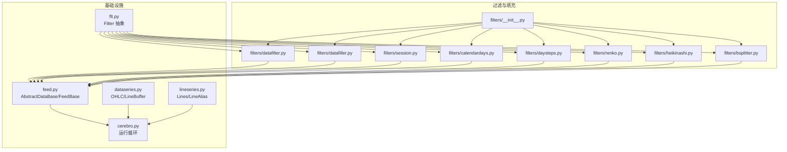
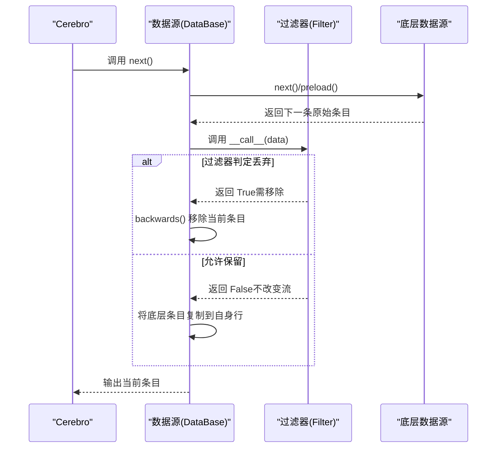
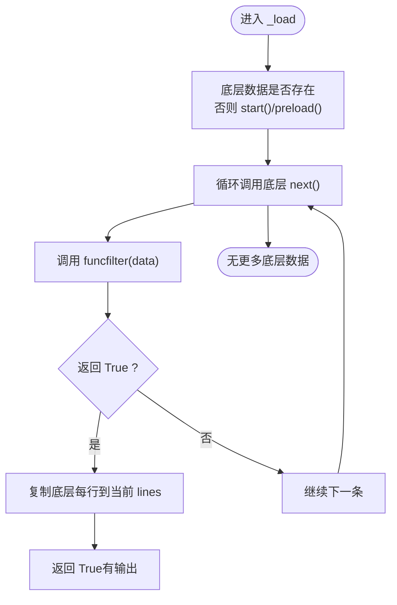
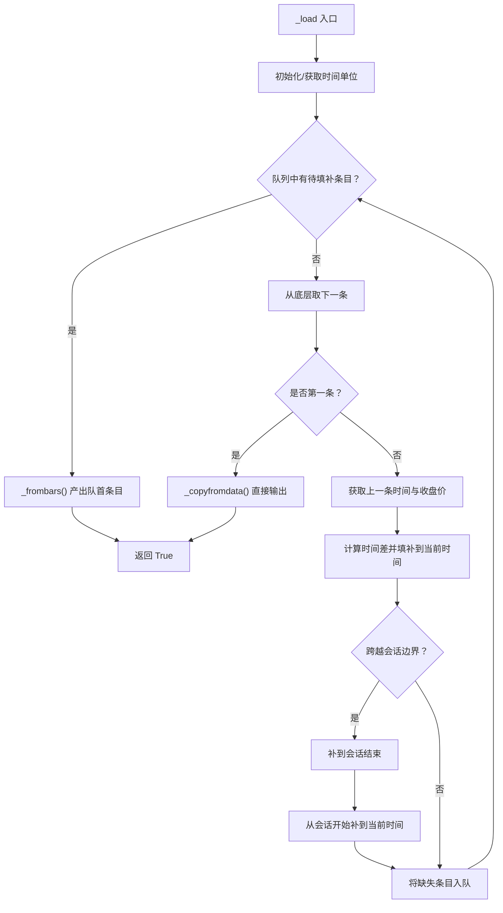
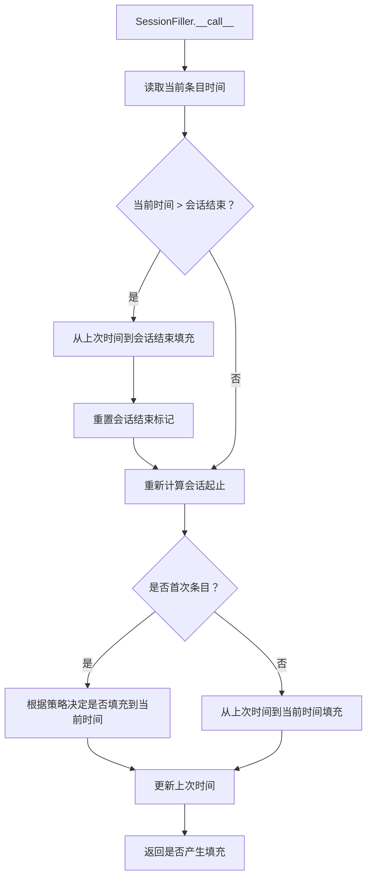
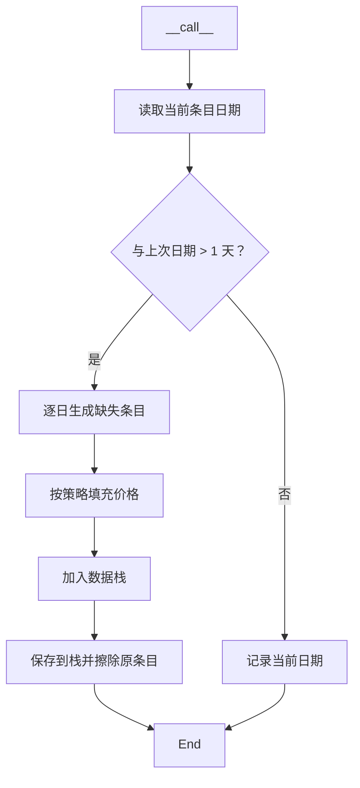
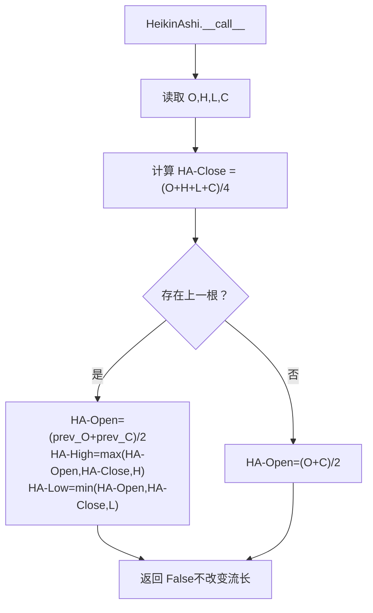
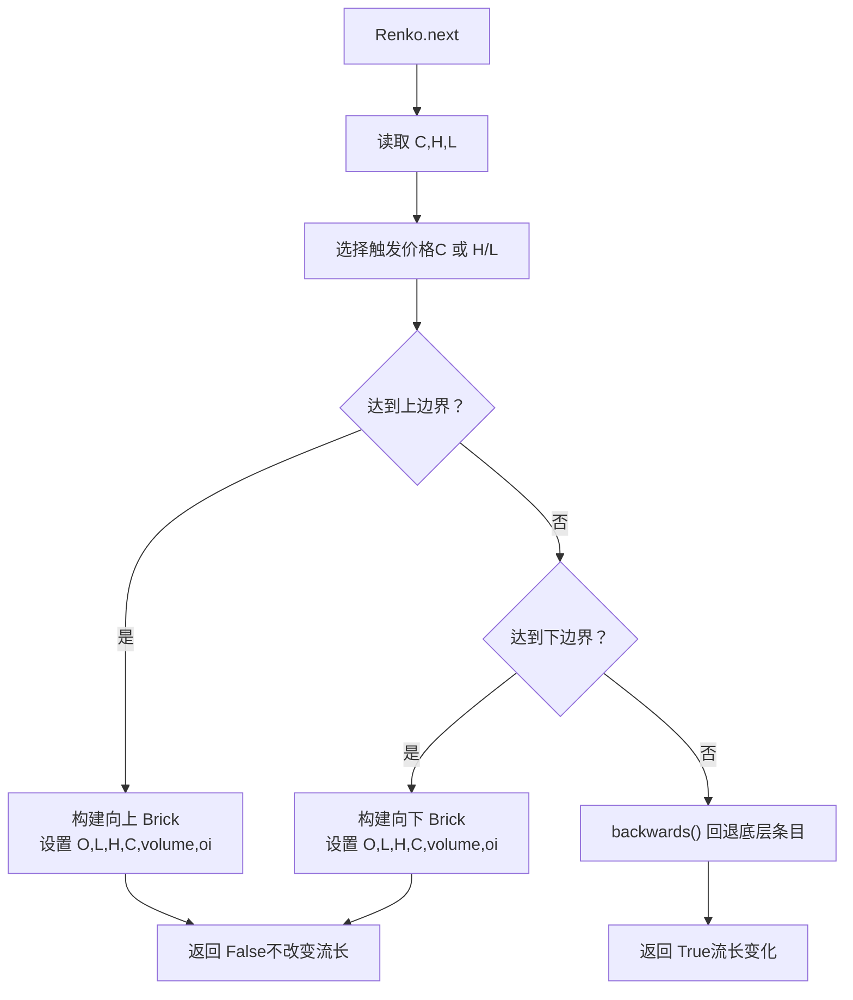
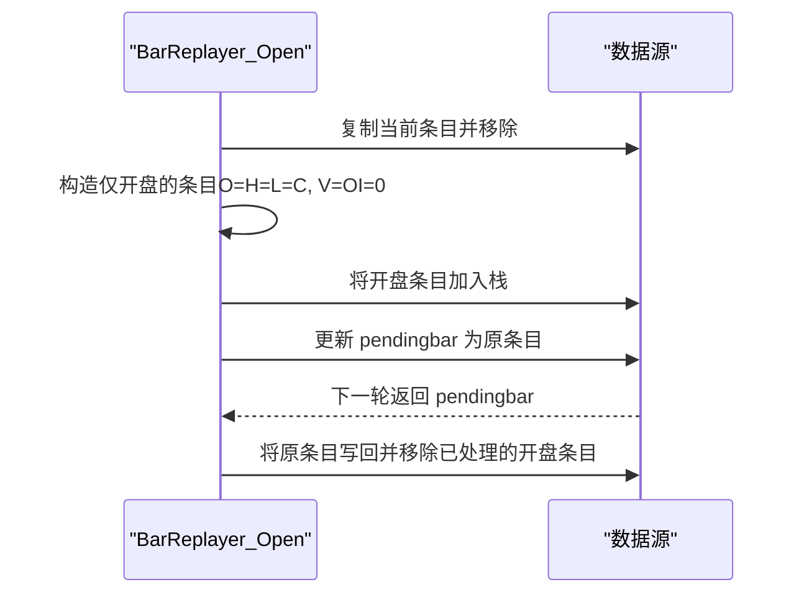
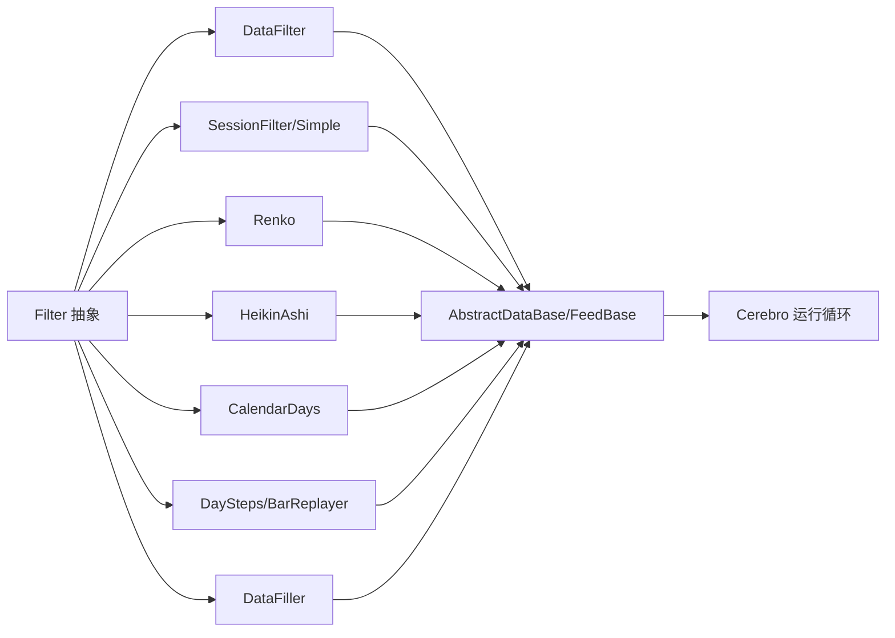

# 数据过滤与处理

<cite>
**本文引用的文件**
- [filters/__init__.py](file://backtrader/filters/__init__.py)
- [filters/datafilter.py](file://backtrader/filters/datafilter.py)
- [filters/datafiller.py](file://backtrader/filters/datafiller.py)
- [filters/session.py](file://backtrader/filters/session.py)
- [filters/calendardays.py](file://backtrader/filters/calendardays.py)
- [filters/daysteps.py](file://backtrader/filters/daysteps.py)
- [filters/renko.py](file://backtrader/filters/renko.py)
- [filters/heikinashi.py](file://backtrader/filters/heikinashi.py)
- [filters/bsplitter.py](file://backtrader/filters/bsplitter.py)
- [flt.py](file://backtrader/flt.py)
- [dataseries.py](file://backtrader/dataseries.py)
- [feed.py](file://backtrader/feed.py)
- [cerebro.py](file://backtrader/cerebro.py)
- [samples/data-filler/data-filler.py](file://samples/data-filler/data-filler.py)
- [samples/renko/renko.py](file://samples/renko/renko.py)
- [samples/calendar-days/calendar-days.py](file://samples/calendar-days/calendar-days.py)
- [linebuffer.py](file://backtrader/linebuffer.py)
- [lineseries.py](file://backtrader/lineseries.py)
- [mathsupport.py](file://backtrader/mathsupport.py)
- [indicators/deviation.py](file://backtrader/indicators/deviation.py)
</cite>

## 目录
1. [简介](#简介)
2. [项目结构](#项目结构)
3. [核心组件](#核心组件)
4. [架构总览](#架构总览)
5. [详细组件分析](#详细组件分析)
6. [依赖关系分析](#依赖关系分析)
7. [性能考量](#性能考量)
8. [故障排查指南](#故障排查指南)
9. [结论](#结论)
10. [附录](#附录)

## 简介
本文件系统化梳理 Backtrader 的数据过滤与处理体系，覆盖内置过滤器（会话过滤、日历天填充、Heikin Ashi、Renko、分步/重播拆分等）、数据填充器（按会话边界与时间单位填充缺失条目）、以及数据质量检查与标准化思路。文档以代码为依据，结合序列图与类图，帮助读者快速理解实现原理、使用方式与最佳实践。

## 项目结构
Backtrader 将过滤与填充能力集中在 filters 子包中，并通过统一的 Filter 抽象与数据流接口接入到数据源与回测引擎。核心入口与集成点如下：
- filters 包导出所有内置过滤器与填充器
- flt.py 定义通用 Filter 抽象基类
- feed.py/AbstractDataBase 提供数据源与过滤器挂载接口
- cerebro.py 驱动数据流与过滤器执行
- dataseries.py/lineseries.py 定义 OHLC 结构与行缓冲区
- samples 提供使用示例（如会话过滤+填充、Renko、日历天）

图表来源
- [filters/__init__.py](file://backtrader/filters/__init__.py#L25-L35)
- [flt.py](file://backtrader/flt.py#L36-L54)
- [feed.py](file://backtrader/feed.py#L595-L646)
- [dataseries.py](file://backtrader/dataseries.py#L107-L123)
- [lineseries.py](file://backtrader/lineseries.py#L84-L200)
- [cerebro.py](file://backtrader/cerebro.py#L1375-L1547)

章节来源
- [filters/__init__.py](file://backtrader/filters/__init__.py#L25-L35)
- [feed.py](file://backtrader/feed.py#L595-L646)
- [cerebro.py](file://backtrader/cerebro.py#L1375-L1547)

## 核心组件
- Filter 抽象基类：定义过滤器生命周期（首次初始化 nextstart 与后续 next），并以可调用对象形式参与数据流。
- DataFilter：基于用户提供的函数过滤器对底层数据进行“允许/丢弃”判定，逐条复制行数据。
- DataFiller：在时间维度上按会话边界与时间单位填补缺失条目，支持价格、成交量、未平仓量填充策略。
- 会话过滤与填充：SessionFilter/SessionFilterSimple 用于剔除非交易时段条目；SessionFiller 在会话内按时间单位填充缺失条目。
- 日历天填充：CalendarDays 在跨日缺口处插入缺失交易日条目，支持多种填充价格策略。
- Heikin Ashi：将 OHLC 重算为 Heikin Ashi 形态，不改变数据流长度。
- Renko：按 Brick 大小与对齐规则生成 Renko 条目，支持动态 Brick 大小与高低价触发。
- 分步/重播拆分：DaySteps/BarReplayer 将日线拆分为开盘与收盘两段，模拟逐tick回放。
- 行缓冲与 OHLC 结构：LineBuffer/LineAlias/LineMultiple 提供高效索引与写入接口，支撑过滤器对行数据的读取与更新。

章节来源
- [flt.py](file://backtrader/flt.py#L36-L54)
- [filters/datafilter.py](file://backtrader/filters/datafilter.py#L27-L74)
- [filters/datafiller.py](file://backtrader/filters/datafiller.py#L30-L177)
- [filters/session.py](file://backtrader/filters/session.py#L31-L245)
- [filters/calendardays.py](file://backtrader/filters/calendardays.py#L31-L121)
- [filters/heikinashi.py](file://backtrader/filters/heikinashi.py#L28-L55)
- [filters/renko.py](file://backtrader/filters/renko.py#L31-L140)
- [filters/daysteps.py](file://backtrader/filters/daysteps.py#L25-L85)
- [dataseries.py](file://backtrader/dataseries.py#L107-L123)
- [linebuffer.py](file://backtrader/linebuffer.py#L50-L200)
- [lineseries.py](file://backtrader/lineseries.py#L84-L200)

## 架构总览
过滤器与填充器通过统一的 Filter 接口接入数据源，由 Cerebro 驱动在每个数据到达时依次调用。会话过滤与日历天填充通常作为“简单过滤器”或“非简单过滤器”两类挂载方式，分别由包装器在合适时机管理数据栈。

图表来源
- [cerebro.py](file://backtrader/cerebro.py#L1375-L1547)
- [feed.py](file://backtrader/feed.py#L595-L646)
- [flt.py](file://backtrader/flt.py#L36-L54)
- [filters/datafilter.py](file://backtrader/filters/datafilter.py#L57-L74)

## 详细组件分析

### DataFilter：通用函数过滤器
- 功能：对底层数据源逐条调用用户提供的可调用对象，返回 True 则保留，False 则丢弃。
- 关键点：在 preload 中同步底层数据的 timeframe/compression；在 _load 中循环从底层 next 并按 funcfilter 决策复制行。
- 使用场景：按任意业务规则筛选条目（例如基于技术指标条件）。

图表来源
- [filters/datafilter.py](file://backtrader/filters/datafilter.py#L44-L74)

章节来源
- [filters/datafilter.py](file://backtrader/filters/datafilter.py#L27-L74)

### DataFiller：按时间单位填补缺失条目
- 功能：在时间维度上填补缺失条目，考虑会话边界与时间单位（秒/分钟/微秒）。
- 策略：计算上一条与当前条之间的时间差，按时间单位增量生成缺失条目；若跨越会话边界则先补到会话结束，再从会话开始补。
- 参数：fill_price/fill_vol/fill_oi 控制缺失条目的价格、成交量与未平仓量。

图表来源
- [filters/datafiller.py](file://backtrader/filters/datafiller.py#L110-L177)

章节来源
- [filters/datafiller.py](file://backtrader/filters/datafiller.py#L30-L177)

### 会话过滤与填充：SessionFilter / SessionFiller / SessionFilterSimple
- SessionFilterSimple：返回布尔值指示是否过滤当前条目（不在会话内则过滤），不直接管理数据栈，交由包装器处理。
- SessionFilter：在会话外的条目直接移除（backwards），并返回 True 标记数据被修改。
- SessionFiller：在会话内按时间单位填充缺失条目，支持填充价格、成交量、未平仓量，且可跳过首个会话前填充。

图表来源
- [filters/session.py](file://backtrader/filters/session.py#L81-L140)

章节来源
- [filters/session.py](file://backtrader/filters/session.py#L31-L245)

### 日历天填充：CalendarDays
- 功能：当相邻条目日期差距超过一天时，在中间逐日插入缺失交易日条目。
- 填充策略：fill_price 支持使用上一个收盘价、固定值或 OHLC 平均价；成交量与未平仓量可单独指定。

图表来源
- [filters/calendardays.py](file://backtrader/filters/calendardays.py#L61-L121)

章节来源
- [filters/calendardays.py](file://backtrader/filters/calendardays.py#L31-L121)

### Heikin Ashi：OHLC 重算
- 功能：将 OHLC 重算为 Heikin Ashi 形态，不改变数据流长度。
- 实现要点：使用前一开收均值作为当前开，最高/最低与当前收盘比较得到高/低；第一根使用开盘收盘均值。

图表来源
- [filters/heikinashi.py](file://backtrader/filters/heikinashi.py#L41-L55)

章节来源
- [filters/heikinashi.py](file://backtrader/filters/heikinashi.py#L28-L55)

### Renko：方块图过滤
- 功能：按 Brick 大小与对齐规则生成 Renko 条目，支持高低价触发与动态 Brick 大小。
- 关键参数：hilo/size/autosize/dynamic/align/roundstart。
- 流程：根据当前价格与上下边界判断是否需要新 Brick；若需要则设置 OHLC 为 Brick 边界，volume/openinterest 置零；否则回退底层条目并返回 True 以触发上游重新取数。

图表来源
- [filters/renko.py](file://backtrader/filters/renko.py#L85-L140)

章节来源
- [filters/renko.py](file://backtrader/filters/renko.py#L31-L140)

### 分步/重播拆分：DaySteps / BarReplayer / DaySplitter_Close
- DaySteps/BarReplayer_Open：将日线拆分为“开盘仅 O=H=L=C 的条目”与“原完整 OHLC 条目”，并控制成交量与未平仓量。
- DaySplitter_Close：将日线拆分为两个 tick（开盘 OHLX 与收盘 CCCC），并按比例分配成交量。

图表来源
- [filters/daysteps.py](file://backtrader/filters/daysteps.py#L44-L81)

章节来源
- [filters/daysteps.py](file://backtrader/filters/daysteps.py#L25-L85)
- [filters/bsplitter.py](file://backtrader/filters/bsplitter.py#L29-L112)

### 自定义过滤器开发与最佳实践
- 继承 Filter 或使用 DataFilter 的函数过滤器模式。
- 在 __call__ 中：
  - 对于“简单过滤器”：返回布尔值指示是否过滤当前条目，不直接操作数据栈。
  - 对于“非简单过滤器”：自行调用 backwards() 移除条目并返回 True。
- 注意：
  - 首次调用会触发 nextstart(data)，随后每次调用触发 next(data)。
  - 若需重算 OHLC，请参考 HeikinAshi 的做法，避免改变流长。
  - 若需生成新条目，请使用数据源的 _add2stack/_save2stack 等接口。

章节来源
- [flt.py](file://backtrader/flt.py#L36-L54)
- [filters/heikinashi.py](file://backtrader/filters/heikinashi.py#L41-L55)
- [filters/session.py](file://backtrader/filters/session.py#L216-L245)

## 依赖关系分析
- 过滤器与数据源解耦：通过 Filter 抽象与数据源接口对接，无需关心具体数据源类型。
- 运行时驱动：Cerebro 在每次数据到达时调用数据源的 next，数据源内部再调用过滤器链。
- 行缓冲与索引：LineBuffer/LineAlias 提供稳定的索引访问与写入绑定，保证过滤器对行数据的读写安全。

图表来源
- [flt.py](file://backtrader/flt.py#L36-L54)
- [filters/datafilter.py](file://backtrader/filters/datafilter.py#L27-L74)
- [filters/session.py](file://backtrader/filters/session.py#L31-L245)
- [filters/renko.py](file://backtrader/filters/renko.py#L31-L140)
- [filters/heikinashi.py](file://backtrader/filters/heikinashi.py#L28-L55)
- [filters/calendardays.py](file://backtrader/filters/calendardays.py#L31-L121)
- [filters/daysteps.py](file://backtrader/filters/daysteps.py#L25-L85)
- [filters/datafiller.py](file://backtrader/filters/datafiller.py#L30-L177)
- [feed.py](file://backtrader/feed.py#L595-L646)
- [cerebro.py](file://backtrader/cerebro.py#L1375-L1547)

章节来源
- [feed.py](file://backtrader/feed.py#L595-L646)
- [cerebro.py](file://backtrader/cerebro.py#L1375-L1547)

## 性能考量
- 时间单位与会话边界：DataFiller/SessionFiller 使用最小时间单位（秒/分钟/微秒）与压缩倍数，避免不必要的重复计算。
- 队列与栈：DataFiller 使用双端队列暂存待填补条目，减少多次遍历；SessionFiller/CalendarDays 在必要时批量加入数据栈。
- 流长不变的重算：HeikinAshi/Renko 不改变流长，有利于保持指标与策略的连续性。
- 会话过滤的代价：SessionFilterSimple 仅做布尔判定，开销较低；SessionFilter 需要频繁调用 backwards，应避免在高频数据上过度使用。

章节来源
- [filters/datafiller.py](file://backtrader/filters/datafiller.py#L104-L124)
- [filters/session.py](file://backtrader/filters/session.py#L67-L80)
- [filters/heikinashi.py](file://backtrader/filters/heikinashi.py#L41-L55)
- [filters/renko.py](file://backtrader/filters/renko.py#L96-L139)

## 故障排查指南
- 会话过滤后无数据输出
  - 检查 sessionstart/sessionend 是否正确传入数据源。
  - 使用 SessionFilterSimple 验证过滤逻辑是否生效。
- 缺失条目过多导致回测偏差
  - 使用 DataFiller 或 SessionFiller 填充缺失条目；合理设置 fill_price/fill_vol/fill_oi。
- 日历天缺口未补齐
  - 确认数据日期字段连续性；启用 CalendarDays 并设置 fill_price 策略。
- Renko 条目稀少或不稳定
  - 调整 size/autosize/align/dynamic 参数；确认 hilo 触发策略是否符合预期。
- Heikin Ashi 显示异常
  - 确保数据顺序正确；检查首根条目的开收均值计算。

章节来源
- [samples/data-filler/data-filler.py](file://samples/data-filler/data-filler.py#L37-L93)
- [samples/renko/renko.py](file://samples/renko/renko.py#L42-L89)
- [samples/calendar-days/calendar-days.py](file://samples/calendar-days/calendar-days.py#L33-L77)

## 结论
Backtrader 的数据过滤与处理体系以 Filter 抽象为核心，提供了灵活而高效的条目级处理能力。通过会话过滤、日历天填充、Heikin Ashi、Renko 与分步/重播拆分等内置工具，用户可在不改变策略逻辑的前提下，高质量地清洗与转换输入数据。配合 DataFiller 的时间维度填补与行缓冲的高效写入，可满足从分钟到日线的多时间框架回测需求。

## 附录

### 数据质量检查与验证（方法论）
- 缺失检测
  - 时间序列完整性：利用 CalendarDays/DataFiller 的填补行为观察缺失区间。
  - 会话边界：使用 SessionFiller 的填充输出验证会话内连续性。
- 异常值识别
  - 基于统计：使用标准差/均值等统计量识别极端波动（可参考数学支持模块与偏差指标）。
  - 基于范围：设定价格/成交量上下限阈值，发现明显错误。
- 标准化与归一化
  - 标准化：减去均值并除以标准差，适合消除量纲影响。
  - 归一化：映射到固定区间（如 0-1），适合特征尺度一致化。
- 数据预处理工作流建议
  - 步骤：清洗 → 缺失填补 → 会话过滤 → 特征工程 → 标准化/归一化 → 指标计算 → 回测执行。
  - 性能优化：优先使用向量化与批量操作；减少不必要的数据复制；合理设置缓存与队列大小。

章节来源
- [mathsupport.py](file://backtrader/mathsupport.py#L41-L65)
- [indicators/deviation.py](file://backtrader/indicators/deviation.py#L27-L33)