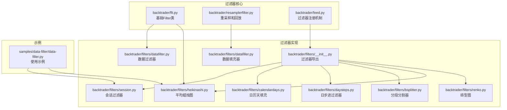
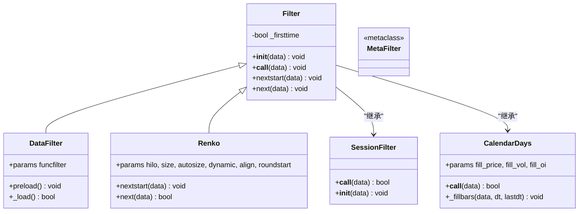
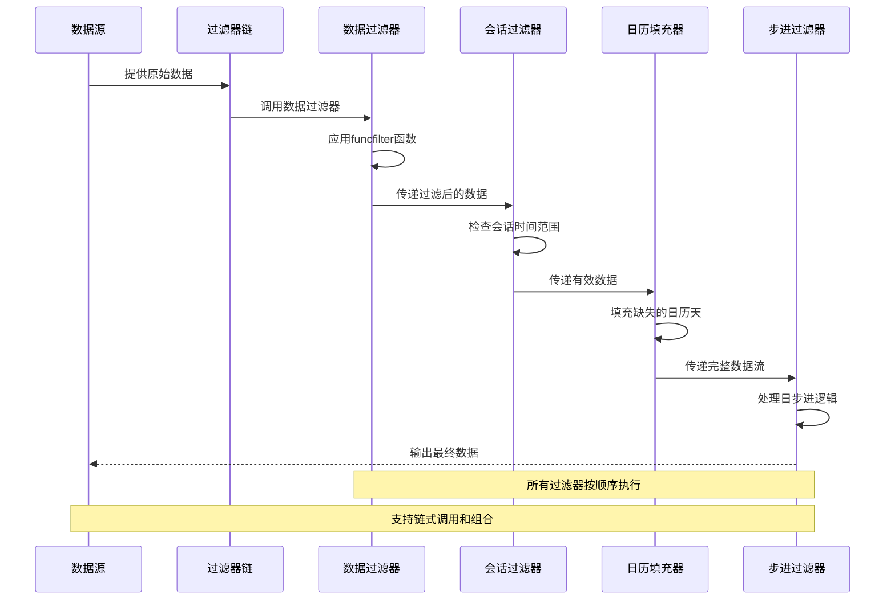
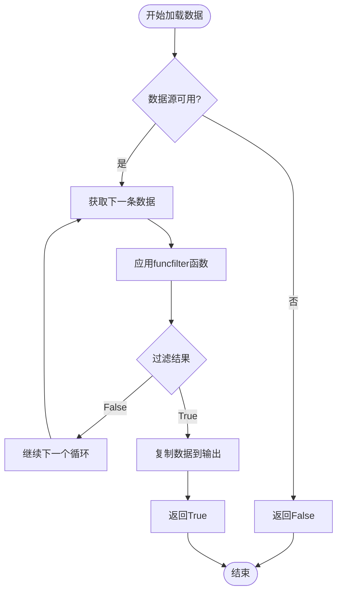
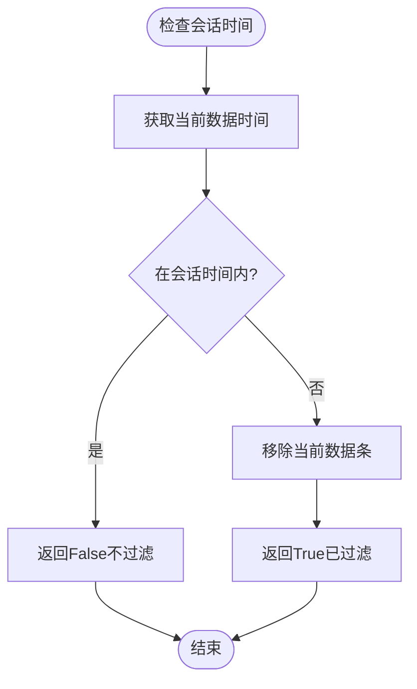
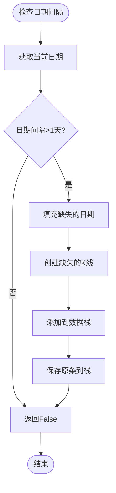
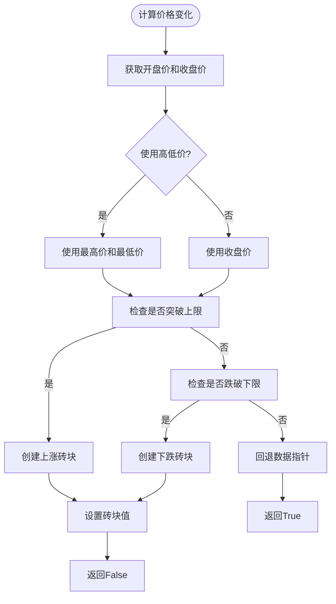
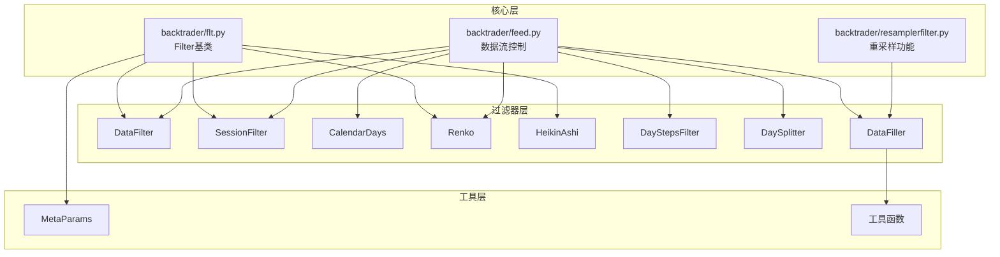

# 数据过滤器基础

<cite>
**本文档引用的文件**
- [backtrader/filters/__init__.py](file://backtrader/filters/__init__.py)
- [backtrader/flt.py](file://backtrader/flt.py)
- [backtrader/filters/datafilter.py](file://backtrader/filters/datafilter.py)
- [backtrader/filters/session.py](file://backtrader/filters/session.py)
- [backtrader/filters/calendardays.py](file://backtrader/filters/calendardays.py)
- [backtrader/filters/daysteps.py](file://backtrader/filters/daysteps.py)
- [backtrader/filters/bsplitter.py](file://backtrader/filters/bsplitter.py)
- [backtrader/filters/heikinashi.py](file://backtrader/filters/heikinashi.py)
- [backtrader/filters/renko.py](file://backtrader/filters/renko.py)
- [backtrader/filters/datafiller.py](file://backtrader/filters/datafiller.py)
- [backtrader/resamplerfilter.py](file://backtrader/resamplerfilter.py)
- [backtrader/feed.py](file://backtrader/feed.py)
- [samples/data-filler/data-filler.py](file://samples/data-filler/data-filler.py)
</cite>

## 目录
1. [简介](#简介)
2. [项目结构](#项目结构)
3. [核心组件](#核心组件)
4. [架构概览](#架构概览)
5. [详细组件分析](#详细组件分析)
6. [依赖关系分析](#依赖关系分析)
7. [性能考虑](#性能考虑)
8. [故障排除指南](#故障排除指南)
9. [结论](#结论)
10. [附录](#附录)

## 简介

BackTrader的数据过滤器基础架构是一个高度模块化和可扩展的系统，用于在数据流中进行各种形式的过滤、转换和增强。该架构的核心设计理念是提供统一的过滤器接口，支持多种过滤器类型，包括会话过滤、数据填充、技术分析转换等。

过滤器系统采用"过滤器链"模式，允许用户将多个过滤器按顺序组合使用，每个过滤器可以独立处理数据流并与其他过滤器协作。这种设计提供了极大的灵活性，使得复杂的交易数据预处理管道成为可能。

## 项目结构

BackTrader的过滤器系统主要分布在以下目录中：



**图表来源**
- [backtrader/flt.py](file://backtrader/flt.py#L36-L54)
- [backtrader/filters/__init__.py](file://backtrader/filters/__init__.py#L25-L35)
- [backtrader/feed.py](file://backtrader/feed.py#L326-L340)

**章节来源**
- [backtrader/filters/__init__.py](file://backtrader/filters/__init__.py#L25-L35)
- [backtrader/flt.py](file://backtrader/flt.py#L36-L54)

## 核心组件

### Filter基类设计

Filter基类是整个过滤器系统的核心，它定义了所有过滤器必须实现的基本接口和生命周期管理机制。



**图表来源**
- [backtrader/flt.py](file://backtrader/flt.py#L36-L54)
- [backtrader/filters/datafilter.py](file://backtrader/filters/datafilter.py#L27-L74)
- [backtrader/filters/session.py](file://backtrader/filters/session.py#L216-L245)
- [backtrader/filters/calendardays.py](file://backtrader/filters/calendardays.py#L31-L121)
- [backtrader/filters/renko.py](file://backtrader/filters/renko.py#L31-L140)

### 过滤器生命周期

过滤器的生命周期由三个关键阶段组成：

1. **初始化阶段**：`__init__`方法接收数据源并进行必要的初始化
2. **启动阶段**：首次调用时触发`nextstart`方法，进行一次性设置
3. **运行阶段**：后续每次数据到达时调用`next`方法进行处理

**章节来源**
- [backtrader/flt.py](file://backtrader/flt.py#L40-L54)

## 架构概览

过滤器系统采用"数据流管道"架构，数据从数据源进入，经过一系列过滤器处理，最终输出到策略或指标。



**图表来源**
- [backtrader/feed.py](file://backtrader/feed.py#L515-L536)
- [backtrader/filters/datafilter.py](file://backtrader/filters/datafilter.py#L57-L73)
- [backtrader/filters/session.py](file://backtrader/filters/session.py#L216-L245)
- [backtrader/filters/calendardays.py](file://backtrader/filters/calendardays.py#L61-L78)

## 详细组件分析

### 数据过滤器 (DataFilter)

DataFilter是最通用的过滤器类型，它接受一个可调用的过滤函数作为参数，根据返回值决定是否保留当前数据条。



**图表来源**
- [backtrader/filters/datafilter.py](file://backtrader/filters/datafilter.py#L57-L73)

**章节来源**
- [backtrader/filters/datafilter.py](file://backtrader/filters/datafilter.py#L27-L74)

### 会话过滤器 (SessionFilter)

会话过滤器负责过滤掉不在正常交易时间内的数据，确保只处理有效的市场数据。



**图表来源**
- [backtrader/filters/session.py](file://backtrader/filters/session.py#L230-L244)

**章节来源**
- [backtrader/filters/session.py](file://backtrader/filters/session.py#L187-L245)

### 日历天填充器 (CalendarDays)

CalendarDays过滤器用于填补日历天之间的空白，确保数据的时间连续性。



**图表来源**
- [backtrader/filters/calendardays.py](file://backtrader/filters/calendardays.py#L80-L121)

**章节来源**
- [backtrader/filters/calendardays.py](file://backtrader/filters/calendardays.py#L31-L121)

### 砖型图过滤器 (Renko)

Renko过滤器将标准K线转换为砖型图，专注于价格变化而忽略时间因素。



**图表来源**
- [backtrader/filters/renko.py](file://backtrader/filters/renko.py#L85-L139)

**章节来源**
- [backtrader/filters/renko.py](file://backtrader/filters/renko.py#L31-L140)

### 平均蜡烛图过滤器 (HeikinAshi)

HeikinAshi过滤器重新计算开盘价、最高价、最低价和收盘价，生成更平滑的价格序列。

**章节来源**
- [backtrader/filters/heikinashi.py](file://backtrader/filters/heikinashi.py#L28-L55)

### 分段分割器 (DaySplitter)

DaySplitter将日线分割为两个部分，模拟回放过程以更好地显示价格行为。

**章节来源**
- [backtrader/filters/bsplitter.py](file://backtrader/filters/bsplitter.py#L29-L112)

### 日步进过滤器 (DayStepsFilter)

DayStepsFilter将单个日线分割为开盘价和完整OHLC两部分，用于更精细的回放控制。

**章节来源**
- [backtrader/filters/daysteps.py](file://backtrader/filters/daysteps.py#L25-L85)

## 依赖关系分析

过滤器系统的依赖关系呈现清晰的层次结构：



**图表来源**
- [backtrader/flt.py](file://backtrader/flt.py#L32-L33)
- [backtrader/feed.py](file://backtrader/feed.py#L326-L340)
- [backtrader/resamplerfilter.py](file://backtrader/resamplerfilter.py#L96-L132)

**章节来源**
- [backtrader/feed.py](file://backtrader/feed.py#L326-L340)
- [backtrader/resamplerfilter.py](file://backtrader/resamplerfilter.py#L96-L132)

## 性能考虑

### 内存管理

过滤器系统采用了高效的内存管理策略：

1. **数据栈机制**：使用双端队列存储待处理的数据条
2. **延迟处理**：通过`_save2stack`和`_add2stack`方法实现延迟数据处理
3. **缓冲区复用**：避免频繁的内存分配和释放

### 计算优化

1. **早期退出**：在不需要处理的情况下立即返回
2. **批量处理**：对连续的数据进行批量处理
3. **缓存机制**：缓存计算结果避免重复计算

### 并发处理

过滤器系统支持实时数据流处理，具有良好的并发性能：

1. **非阻塞设计**：过滤器调用不会阻塞数据流
2. **异步处理**：支持异步数据源和过滤器
3. **资源池**：复用计算资源减少开销

## 故障排除指南

### 常见问题及解决方案

#### 过滤器未生效
- **原因**：过滤器未正确注册到数据源
- **解决**：检查`addfilter`调用是否正确执行

#### 数据丢失
- **原因**：过滤器返回值错误
- **解决**：检查过滤器的返回值逻辑，确保正确的布尔值

#### 性能问题
- **原因**：过滤器链过长或计算复杂度高
- **解决**：优化过滤器算法或减少过滤器数量

#### 时间同步问题
- **原因**：会话过滤器与数据源时间配置不匹配
- **解决**：检查`sessionstart`和`sessionend`参数设置

**章节来源**
- [backtrader/feed.py](file://backtrader/feed.py#L515-L536)

## 结论

BackTrader的数据过滤器基础架构提供了一个强大而灵活的框架，支持多种类型的过滤器和复杂的组合使用。其设计特点包括：

1. **模块化设计**：每个过滤器都是独立的功能模块
2. **链式调用**：支持多个过滤器的顺序组合
3. **统一接口**：所有过滤器遵循相同的生命周期和接口规范
4. **高性能**：优化的内存管理和计算策略
5. **易扩展**：简单的方法扩展机制支持自定义过滤器开发

这个架构为量化交易系统提供了坚实的基础，能够满足从简单的数据清理到复杂的技术分析的各种需求。

## 附录

### 过滤器开发最佳实践

#### 继承Filter基类
```python
# 推荐的继承方式
class MyCustomFilter(Filter):
    def nextstart(self, data):
        # 初始化逻辑
        pass
    
    def next(self, data):
        # 处理逻辑
        return False  # 返回True表示过滤掉当前数据
```

#### 错误处理机制
- 始终检查数据有效性
- 处理边界情况和异常数据
- 提供适当的默认值

#### 性能优化建议
- 避免不必要的数据复制
- 使用就地修改而不是创建新对象
- 缓存计算结果

### 自定义过滤器开发示例

要创建自定义过滤器，需要：

1. **继承Filter基类**：实现必需的方法
2. **定义参数**：使用`params`元组定义配置参数
3. **实现处理逻辑**：在`next`方法中实现过滤逻辑
4. **处理生命周期**：在`nextstart`中进行初始化

**章节来源**
- [backtrader/flt.py](file://backtrader/flt.py#L36-L54)
- [samples/data-filler/data-filler.py](file://samples/data-filler/data-filler.py#L63-L68)