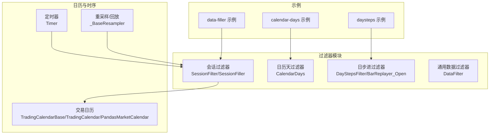
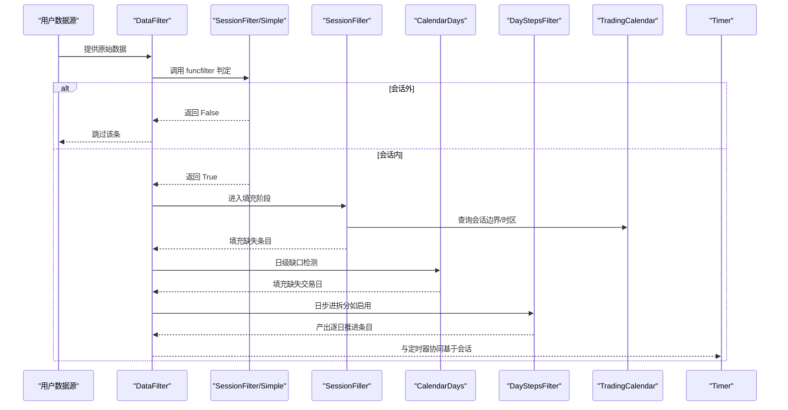
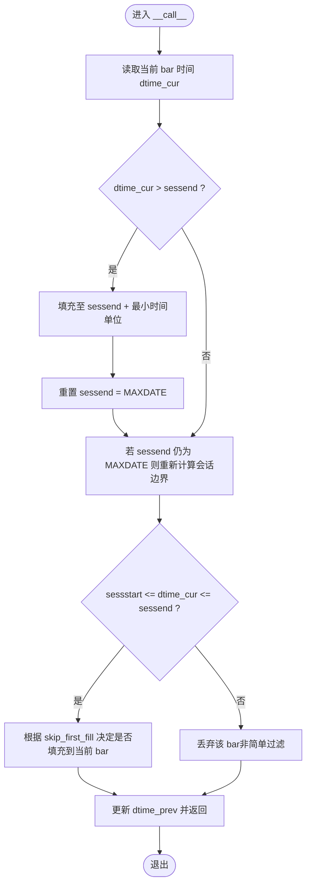
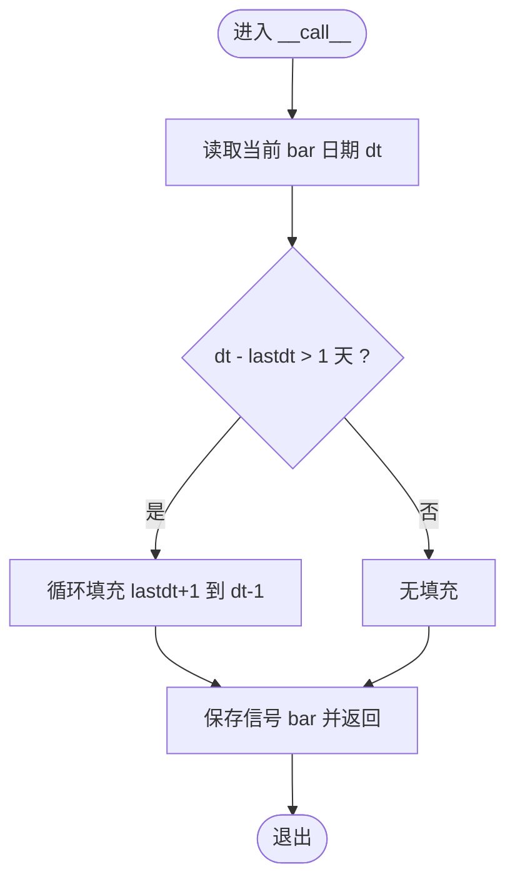
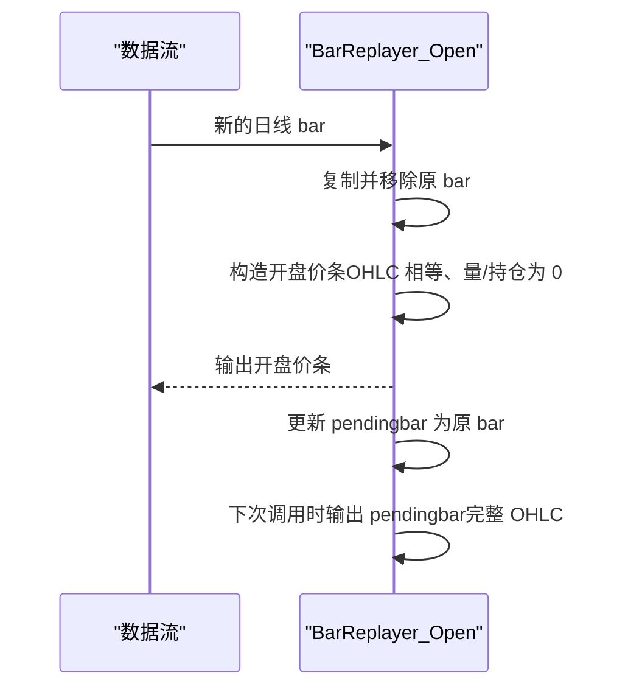
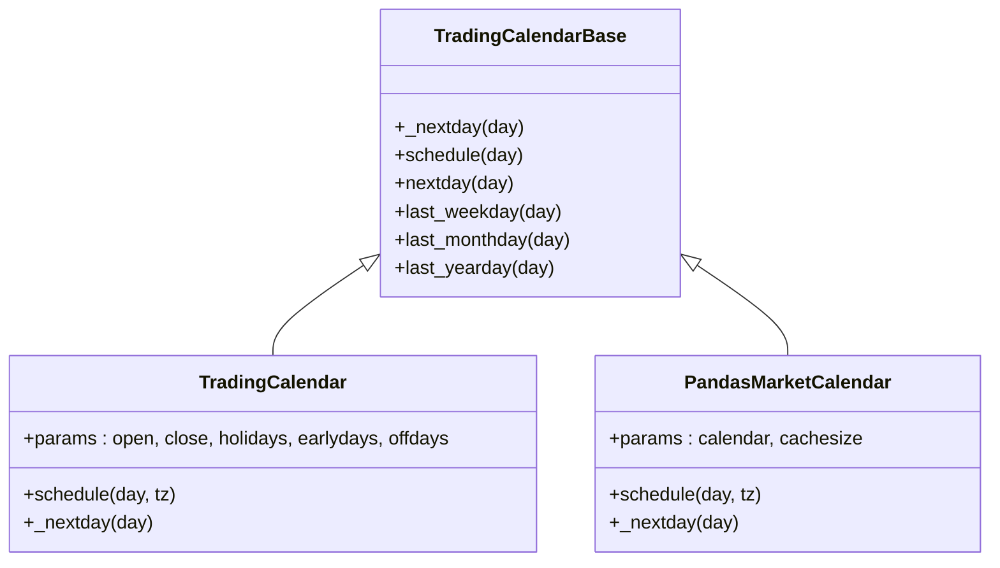
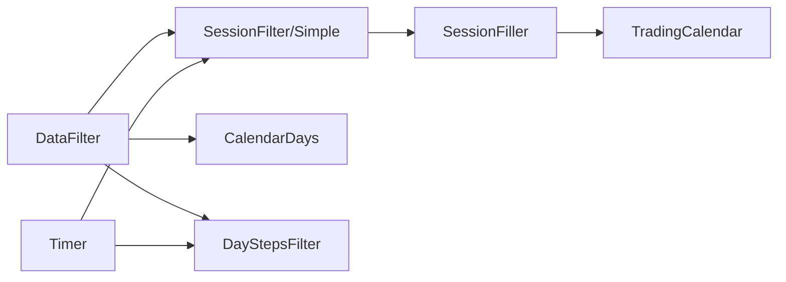

# 时间相关过滤器

<cite>
**本文引用的文件**
- [backtrader/filters/session.py](file://backtrader/filters/session.py)
- [backtrader/filters/calendardays.py](file://backtrader/filters/calendardays.py)
- [backtrader/filters/daysteps.py](file://backtrader/filters/daysteps.py)
- [backtrader/filters/datafilter.py](file://backtrader/filters/datafilter.py)
- [backtrader/tradingcal.py](file://backtrader/tradingcal.py)
- [samples/data-filler/data-filler.py](file://samples/data-filler/data-filler.py)
- [samples/calendar-days/calendar-days.py](file://samples/calendar-days/calendar-days.py)
- [samples/daysteps/daysteps.py](file://samples/daysteps/daysteps.py)
- [backtrader/resamplerfilter.py](file://backtrader/resamplerfilter.py)
- [backtrader/timer.py](file://backtrader/timer.py)
- [backtrader/utils.py](file://backtrader/utils.py)
</cite>

## 目录
1. [简介](#简介)
2. [项目结构](#项目结构)
3. [核心组件](#核心组件)
4. [架构总览](#架构总览)
5. [详细组件分析](#详细组件分析)
6. [依赖关系分析](#依赖关系分析)
7. [性能考量](#性能考量)
8. [故障排查指南](#故障排查指南)
9. [结论](#结论)
10. [附录](#附录)

## 简介
本文件系统性梳理 Backtrader 中与“时间相关过滤器”相关的实现，重点覆盖以下主题：
- 会话过滤器：交易时段定义、会话切换逻辑、跨时区处理策略
- 日历天过滤器：节假日处理、周末过滤、特殊日期标记
- 日步进过滤器：时间步进机制、日历对齐、时间窗口选择、多时间框架协调
- 配置选项、性能优化技巧、与数据源的集成方法
- 实际应用中的最佳实践与常见问题解决方案

## 项目结构
围绕时间过滤器的关键模块分布如下：
- filters：会话过滤器、日历天填充器、日步进（开仓模拟）等
- tradingcal：交易日历抽象与实现，支持节假日、早收市、周末等
- timer：基于会话起止的定时器机制
- resamplerfilter：重采样/回放过程中的时间边界与对齐
- samples：示例脚本展示如何在数据流上添加过滤器

**图表来源**
- [backtrader/filters/session.py](file://backtrader/filters/session.py#L31-L245)
- [backtrader/filters/calendardays.py](file://backtrader/filters/calendardays.py#L31-L121)
- [backtrader/filters/daysteps.py](file://backtrader/filters/daysteps.py#L25-L85)
- [backtrader/tradingcal.py](file://backtrader/tradingcal.py#L47-L281)
- [backtrader/timer.py](file://backtrader/timer.py#L42-L200)
- [backtrader/resamplerfilter.py](file://backtrader/resamplerfilter.py#L96-L382)
- [samples/data-filler/data-filler.py](file://samples/data-filler/data-filler.py#L37-L93)
- [samples/calendar-days/calendar-days.py](file://samples/calendar-days/calendar-days.py#L33-L77)
- [samples/daysteps/daysteps.py](file://samples/daysteps/daysteps.py#L74-L89)

**章节来源**
- [backtrader/filters/session.py](file://backtrader/filters/session.py#L31-L245)
- [backtrader/filters/calendardays.py](file://backtrader/filters/calendardays.py#L31-L121)
- [backtrader/filters/daysteps.py](file://backtrader/filters/daysteps.py#L25-L85)
- [backtrader/tradingcal.py](file://backtrader/tradingcal.py#L47-L281)
- [backtrader/timer.py](file://backtrader/timer.py#L42-L200)
- [backtrader/resamplerfilter.py](file://backtrader/resamplerfilter.py#L96-L382)
- [samples/data-filler/data-filler.py](file://samples/data-filler/data-filler.py#L37-L93)
- [samples/calendar-days/calendar-days.py](file://samples/calendar-days/calendar-days.py#L33-L77)
- [samples/daysteps/daysteps.py](file://samples/daysteps/daysteps.py#L74-L89)

## 核心组件
- 会话过滤器族
  - SessionFilterSimple：简单过滤，仅判定是否在会话内，不直接管理数据栈
  - SessionFilter：非简单过滤，直接从数据栈移除会话外的条目
  - SessionFiller：在会话内按时间步长填充缺失的条目，支持价格/成交量/持仓的填充策略
- 日历天过滤器 CalendarDays：检测日级数据中的“日缺口”，按日填充缺失的交易日条目
- 日步进过滤器 DayStepsFilter（别名 BarReplayer_Open）：将日线条拆分为“开盘价条+完整OHLC条”，用于模拟逐日推进
- 通用数据过滤器 DataFilter：以可调用函数作为过滤条件，包装任意数据源
- 交易日历 tradingcal：提供节假日、周末、早收市等规则，支持时区转换
- 定时器 timer：支持基于会话起止的定时触发，含偏移与重复机制
- 重采样/回放 resamplerfilter：控制时间边界、对齐与压缩，影响多时间框架下的时间窗口选择

**章节来源**
- [backtrader/filters/session.py](file://backtrader/filters/session.py#L31-L245)
- [backtrader/filters/calendardays.py](file://backtrader/filters/calendardays.py#L31-L121)
- [backtrader/filters/daysteps.py](file://backtrader/filters/daysteps.py#L25-L85)
- [backtrader/filters/datafilter.py](file://backtrader/filters/datafilter.py#L27-L74)
- [backtrader/tradingcal.py](file://backtrader/tradingcal.py#L47-L281)
- [backtrader/timer.py](file://backtrader/timer.py#L42-L200)
- [backtrader/resamplerfilter.py](file://backtrader/resamplerfilter.py#L96-L382)

## 架构总览
时间相关过滤器在数据流中的位置与交互如下：

**图表来源**
- [backtrader/filters/datafilter.py](file://backtrader/filters/datafilter.py#L57-L74)
- [backtrader/filters/session.py](file://backtrader/filters/session.py#L187-L245)
- [backtrader/filters/calendardays.py](file://backtrader/filters/calendardays.py#L61-L121)
- [backtrader/filters/daysteps.py](file://backtrader/filters/daysteps.py#L25-L85)
- [backtrader/tradingcal.py](file://backtrader/tradingcal.py#L164-L195)
- [backtrader/timer.py](file://backtrader/timer.py#L61-L95)

## 详细组件分析

### 会话过滤器（SessionFilter/SessionFiller）
- 交易时段定义
  - 通过数据源参数 sessionstart/sessionend 指定当日会话起止时间（仅取时间部分）
  - 会话边界计算：以当前 bar 的日期与 sessionstart/sessionend 组合为 datetime
- 会话切换逻辑
  - 使用 sessend 控制标志位，首次遇到 bar 超过 sessend 时，先填充到会话结束，再重新计算新会话边界
  - 若 bar 在新会话内，则填充到该 bar；若 bar 跨越多个会话，循环填充直至当前 bar
- 跨时区处理策略
  - 交易日历类支持时区转换：schedule 方法在需要时将本地时间转换为 UTC 再返回
  - 会话过滤器本身以“当日时间”比较，不直接参与时区转换，但可与日历类配合使用
- 填充策略
  - SessionFiller 支持填充价格（使用前一 bar 收盘或指定值）、成交量、持仓
  - 时间步长由数据源的 timeframe/compression 决定，按最小时间单位递增

**图表来源**
- [backtrader/filters/session.py](file://backtrader/filters/session.py#L81-L140)

**章节来源**
- [backtrader/filters/session.py](file://backtrader/filters/session.py#L31-L245)
- [backtrader/tradingcal.py](file://backtrader/tradingcal.py#L164-L195)

### 日历天过滤器（CalendarDays）
- 工作原理
  - 比较相邻 bar 的日期差是否大于 1 天，若是则逐日填充缺失的 bar
  - 填充时复用前一 bar 的 OHLC 作为填充值，时间部分保持一致
- 节假日与周末处理
  - 该过滤器仅基于“日级日期差”判断，不直接解析节假日列表
  - 如需考虑节假日/周末，建议结合 TradingCalendar 或在上游数据层处理
- 特殊日期标记
  - 可通过填充价格策略（使用前一 bar 收盘、或中间价）区分“正常交易日”与“补缺日”

**图表来源**
- [backtrader/filters/calendardays.py](file://backtrader/filters/calendardays.py#L61-L121)

**章节来源**
- [backtrader/filters/calendardays.py](file://backtrader/filters/calendardays.py#L31-L121)

### 日步进过滤器（DayStepsFilter/BarReplayer_Open）
- 时间步进机制
  - 将一个日线 bar 拆分为两部分：开盘价条（OHLC 相等、成交量/持仓为 0）与完整 OHLC 条
  - 通过内部 pendingbar 缓存，确保在下一根 bar 到来时输出完整 OHLC
- 日历对齐与多时间框架协调
  - 该过滤器常与回放/重采样配合，使策略在“日”维度上逐条推进，便于观察逐日状态变化
  - 与重采样器的边界对齐、压缩参数共同决定时间窗口的选择与边界

**图表来源**
- [backtrader/filters/daysteps.py](file://backtrader/filters/daysteps.py#L25-L85)

**章节来源**
- [backtrader/filters/daysteps.py](file://backtrader/filters/daysteps.py#L25-L85)
- [backtrader/resamplerfilter.py](file://backtrader/resamplerfilter.py#L96-L382)

### 通用数据过滤器（DataFilter）
- 作用
  - 包装任意数据源，以 funcfilter 作为判定函数
  - 返回 True 保留当前 bar，False 跳过
- 适用场景
  - 自定义复杂过滤逻辑（如基于指标、多数据源联动）

**章节来源**
- [backtrader/filters/datafilter.py](file://backtrader/filters/datafilter.py#L27-L74)

### 交易日历（TradingCalendarBase/TradingCalendar/PandasMarketCalendar）
- 节假日处理
  - holidays 参数传入非交易日列表
  - earlydays 参数传入“特殊日期及早收市时间”
- 周末过滤
  - offdays 默认为 ISO 周末（周六、周日）
- 时区处理
  - schedule 支持传入 tz 参数，将本地时间转换为 UTC 再返回
- 性能优化
  - PandasMarketCalendar 提供缓存机制（dcache/idcache），减少重复查询

**图表来源**
- [backtrader/tradingcal.py](file://backtrader/tradingcal.py#L47-L281)

**章节来源**
- [backtrader/tradingcal.py](file://backtrader/tradingcal.py#L106-L281)

### 定时器（Timer）与会话
- 会话相关触发
  - when 可设为 SESSION_START/SESSION_END，自动映射到数据源的 sessionstart/sessionend
  - 支持 offset 与 repeat，在会话内按固定间隔重复触发
- 与过滤器的协同
  - 会话过滤器与定时器均依赖会话边界，二者配合可实现“在会话内按时间点触发”的策略

**章节来源**
- [backtrader/timer.py](file://backtrader/timer.py#L42-L200)

## 依赖关系分析
- 低耦合设计
  - 各过滤器以“函数式接口”（__call__）接入数据流，彼此独立
  - 会话过滤器与日历模块松耦合，可通过 TradingCalendar 扩展
- 关键依赖链
  - DataFilter → SessionFilter/Simple → SessionFiller → TradingCalendar
  - CalendarDays → 数据源日期序列
  - DayStepsFilter → 回放/重采样上下文
  - Timer → 数据源会话边界

**图表来源**
- [backtrader/filters/datafilter.py](file://backtrader/filters/datafilter.py#L57-L74)
- [backtrader/filters/session.py](file://backtrader/filters/session.py#L187-L245)
- [backtrader/filters/calendardays.py](file://backtrader/filters/calendardays.py#L61-L121)
- [backtrader/filters/daysteps.py](file://backtrader/filters/daysteps.py#L25-L85)
- [backtrader/tradingcal.py](file://backtrader/tradingcal.py#L164-L195)
- [backtrader/timer.py](file://backtrader/timer.py#L61-L95)

**章节来源**
- [backtrader/filters/session.py](file://backtrader/filters/session.py#L31-L245)
- [backtrader/filters/calendardays.py](file://backtrader/filters/calendardays.py#L31-L121)
- [backtrader/filters/daysteps.py](file://backtrader/filters/daysteps.py#L25-L85)
- [backtrader/filters/datafilter.py](file://backtrader/filters/datafilter.py#L27-L74)
- [backtrader/tradingcal.py](file://backtrader/tradingcal.py#L47-L281)
- [backtrader/timer.py](file://backtrader/timer.py#L42-L200)

## 性能考量
- 会话填充
  - 填充频率与 timeframe/compression 成正比，建议在高频数据上谨慎开启填充
  - 使用 skip_first_fill 可避免首根 bar 前的“预热”填充
- 日历天填充
  - 仅在出现“日缺口”时触发，通常成本较低
  - 对于长跨度历史数据，建议在上游数据层进行去重与对齐
- 日步进
  - 会增加 bar 数量（每根日线拆成两根），注意内存与绘图开销
  - 与回放/重采样配合时，合理设置压缩参数以平衡精度与性能
- 交易日历
  - PandasMarketCalendar 的缓存机制显著降低查询成本
  - holidays/earlydays 列表越大，初始化与查找成本越高，建议精简

[本节为通用指导，无需具体文件分析]

## 故障排查指南
- 会话过滤后出现“空窗期”
  - 检查 sessionstart/sessionend 是否正确传入（仅取时间部分）
  - 确认 skip_first_fill 设置是否符合预期
- 填充价格异常
  - fill_price 设为负数时使用“中间价”策略，确认是否与预期一致
  - 检查上游数据是否存在 NaN 导致填充失败
- 日步进导致策略过拟合
  - 开盘价条可能引发“同日多次触发”，建议在策略中显式去重
- 定时器未触发
  - 确认 when 是否设置为 SESSION_START/SESSION_END
  - 检查 offset/weekdays/monthdays 等过滤条件是否阻止了执行

**章节来源**
- [backtrader/filters/session.py](file://backtrader/filters/session.py#L31-L245)
- [backtrader/filters/calendardays.py](file://backtrader/filters/calendardays.py#L31-L121)
- [backtrader/filters/daysteps.py](file://backtrader/filters/daysteps.py#L25-L85)
- [backtrader/timer.py](file://backtrader/timer.py#L61-L95)

## 结论
- 会话过滤器提供了灵活的“会话内外”筛选与填充能力，适合构建严格遵循交易时段的策略
- 日历天过滤器专注于补齐日级缺口，建议与上游数据质量控制结合
- 日步进过滤器为策略提供“逐日推进”的可视化与调试体验
- 交易日历模块是节假日/周末/早收市等规则的统一入口，支持时区转换
- 定时器与会话过滤器协同，可实现“在会话内按时间点触发”的精确控制

[本节为总结，无需具体文件分析]

## 附录

### 配置选项速查
- 会话过滤器
  - SessionFilterSimple：无参数
  - SessionFilter：无参数
  - SessionFiller：fill_price、fill_vol、fill_oi、skip_first_fill
- 日历天过滤器
  - CalendarDays：fill_price、fill_vol、fill_oi
- 通用数据过滤器
  - DataFilter：funcfilter
- 交易日历
  - TradingCalendar：open、close、holidays、earlydays、offdays
  - PandasMarketCalendar：calendar、cachesize

**章节来源**
- [backtrader/filters/session.py](file://backtrader/filters/session.py#L31-L80)
- [backtrader/filters/calendardays.py](file://backtrader/filters/calendardays.py#L31-L54)
- [backtrader/filters/datafilter.py](file://backtrader/filters/datafilter.py#L27-L43)
- [backtrader/tradingcal.py](file://backtrader/tradingcal.py#L106-L144)

### 示例脚本路径
- 会话过滤与填充：[samples/data-filler/data-filler.py](file://samples/data-filler/data-filler.py#L37-L93)
- 日历天填充：[samples/calendar-days/calendar-days.py](file://samples/calendar-days/calendar-days.py#L33-L77)
- 日步进演示：[samples/daysteps/daysteps.py](file://samples/daysteps/daysteps.py#L74-L89)

**章节来源**
- [samples/data-filler/data-filler.py](file://samples/data-filler/data-filler.py#L37-L93)
- [samples/calendar-days/calendar-days.py](file://samples/calendar-days/calendar-days.py#L33-L77)
- [samples/daysteps/daysteps.py](file://samples/daysteps/daysteps.py#L74-L89)