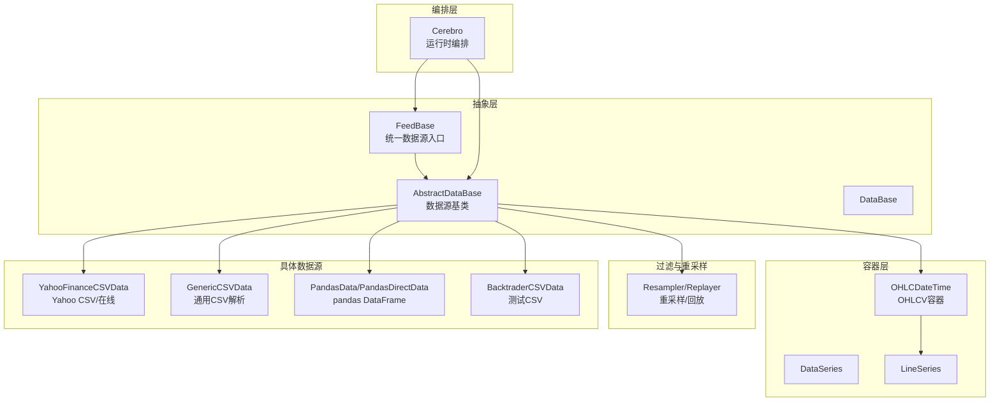
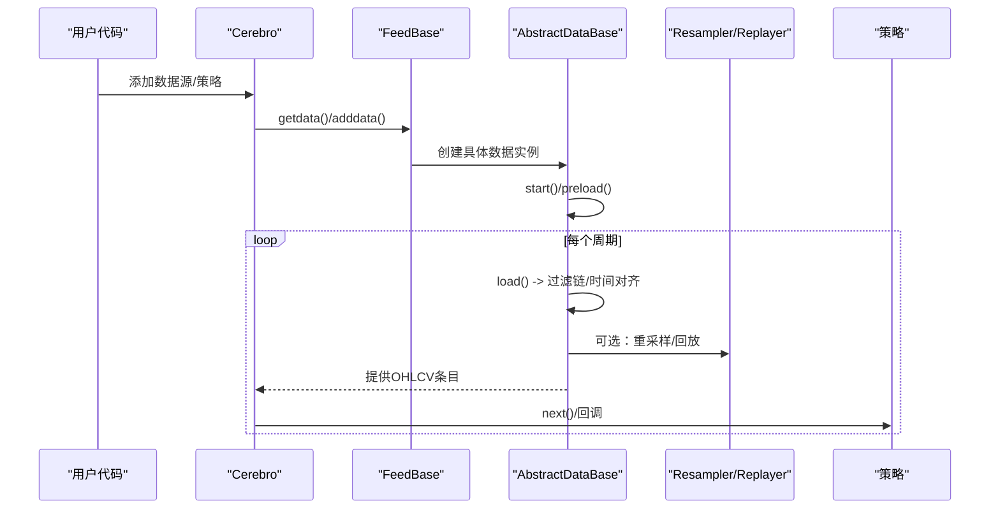
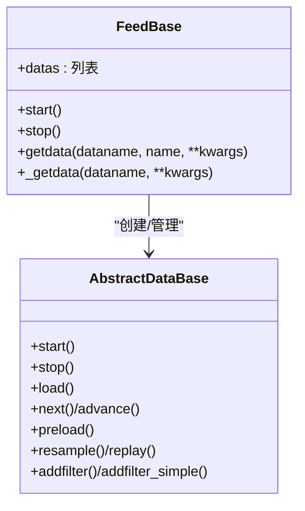
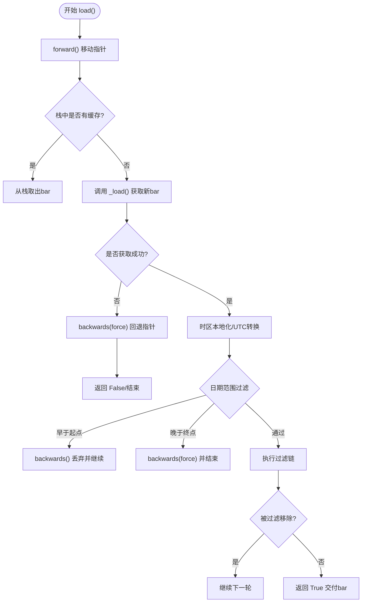
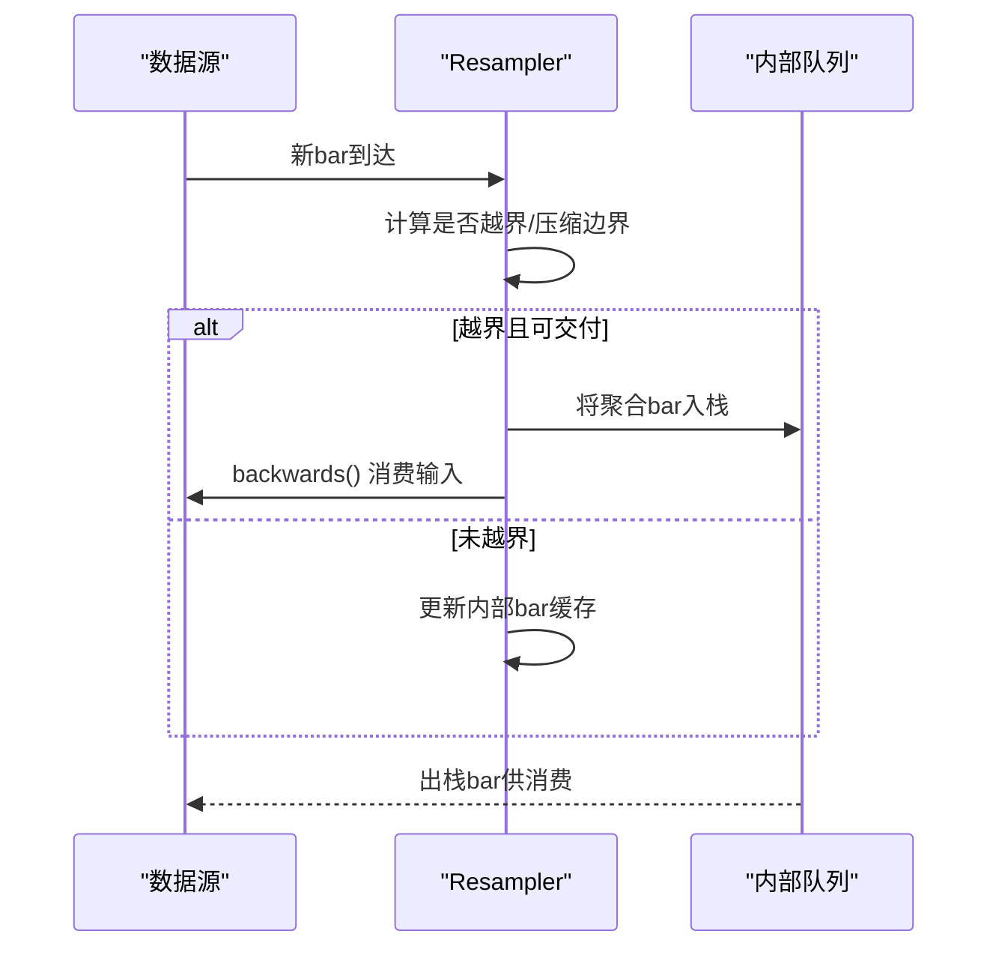
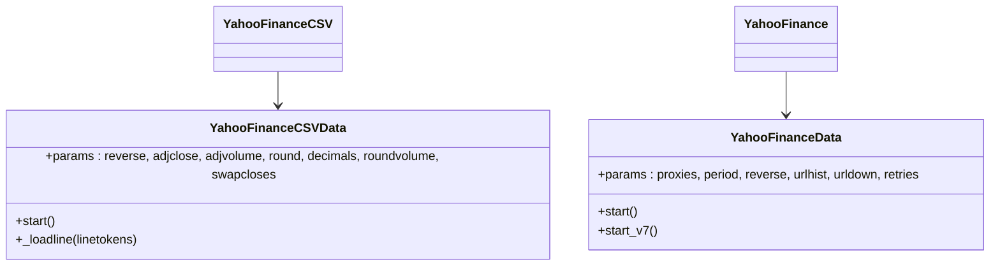
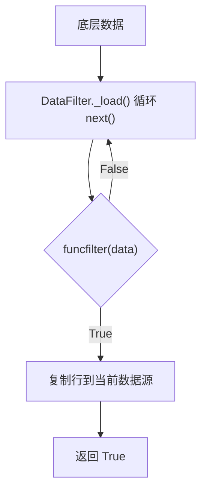
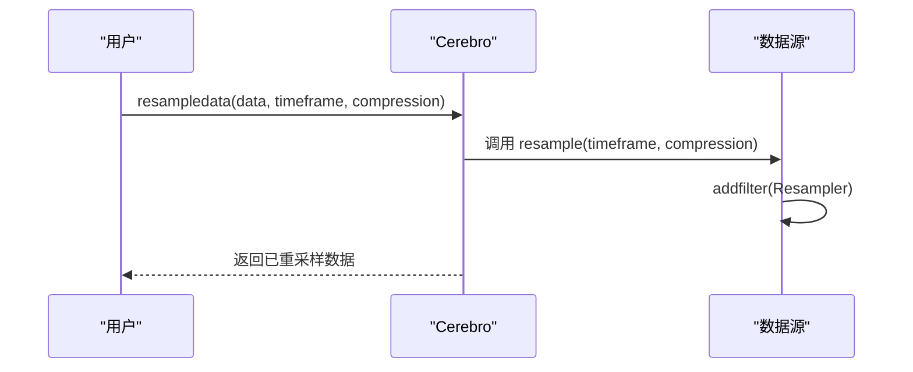
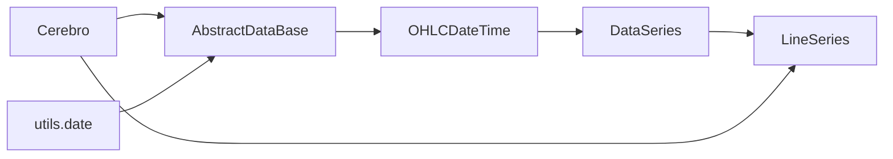

# 数据集成

<cite>
**本文引用的文件**
- [feed.py](file://backtrader/feed.py)
- [dataseries.py](file://backtrader/dataseries.py)
- [lineseries.py](file://backtrader/lineseries.py)
- [resamplerfilter.py](file://backtrader/resamplerfilter.py)
- [datafilter.py](file://backtrader/filters/datafilter.py)
- [yahoo.py](file://backtrader/feeds/yahoo.py)
- [csvgeneric.py](file://backtrader/feeds/csvgeneric.py)
- [pandafeed.py](file://backtrader/feeds/pandafeed.py)
- [btcsv.py](file://backtrader/feeds/btcsv.py)
- [cerebro.py](file://backtrader/cerebro.py)
- [date.py](file://backtrader/utils/date.py)
- [data-resample.py](file://samples/data-resample/data-resample.py)
- [data-replay.py](file://samples/data-replay/data-replay.py)
- [data-pandas.py](file://samples/data-pandas/data-pandas.py)
- [mult-values.py](file://samples/multi-example/mult-values.py)
</cite>

## 目录
1. [简介](#简介)
2. [项目结构](#项目结构)
3. [核心组件](#核心组件)
4. [架构总览](#架构总览)
5. [详细组件分析](#详细组件分析)
6. [依赖关系分析](#依赖关系分析)
7. [性能考量](#性能考量)
8. [故障排查指南](#故障排查指南)
9. [结论](#结论)
10. [附录](#附录)

## 简介
本文件系统性梳理 Backtrader 的数据集成体系，围绕数据源接口设计、FeedBase 基类与数据流处理机制展开，覆盖多数据源（CSV、Yahoo Finance、pandas DataFrame、实时数据）接入方式，多时间框架与重采样/回放实现原理，数据过滤与预处理能力，以及数据质量校验与常见问题的解决方案。同时给出自定义数据源开发指南与与外部数据服务的集成思路。

## 项目结构
Backtrader 的数据层由“数据源抽象”“数据系列容器”“过滤与重采样”“具体数据源实现”“运行时编排器”五部分组成：
- 抽象层：FeedBase、AbstractDataBase、DataBase 定义统一的数据源接口与生命周期
- 容器层：OHLCDateTime、DataSeries、LineSeries 提供标准化的 OHLCV 行情容器与索引访问
- 过滤与重采样：Resampler/Replayer 实现多时间框架与重采样/回放
- 具体数据源：Yahoo、CSV、pandas、Backtrader 自有 CSV 等
- 编排层：Cerebro 负责数据装载、策略执行、内存与运行模式控制

图示来源
- [feed.py](file://backtrader/feed.py#L603-L635)
- [dataseries.py](file://backtrader/dataseries.py#L107-L113)
- [lineseries.py](file://backtrader/lineseries.py#L444-L478)
- [resamplerfilter.py](file://backtrader/resamplerfilter.py#L435-L561)
- [yahoo.py](file://backtrader/feeds/yahoo.py#L37-L179)
- [csvgeneric.py](file://backtrader/feeds/csvgeneric.py#L32-L159)
- [pandafeed.py](file://backtrader/feeds/pandafeed.py#L30-L105)
- [btcsv.py](file://backtrader/feeds/btcsv.py#L30-L60)
- [cerebro.py](file://backtrader/cerebro.py#L60-L200)

章节来源
- [feed.py](file://backtrader/feed.py#L603-L635)
- [dataseries.py](file://backtrader/dataseries.py#L107-L113)
- [lineseries.py](file://backtrader/lineseries.py#L444-L478)
- [resamplerfilter.py](file://backtrader/resamplerfilter.py#L435-L561)
- [yahoo.py](file://backtrader/feeds/yahoo.py#L37-L179)
- [csvgeneric.py](file://backtrader/feeds/csvgeneric.py#L32-L159)
- [pandafeed.py](file://backtrader/feeds/pandafeed.py#L30-L105)
- [btcsv.py](file://backtrader/feeds/btcsv.py#L30-L60)
- [cerebro.py](file://backtrader/cerebro.py#L60-L200)

## 核心组件
- FeedBase：统一的数据源工厂与生命周期管理，负责创建具体数据对象、启动/停止数据源、聚合多个数据源
- AbstractDataBase/DataBase：抽象数据源，定义时间框架、压缩倍数、会话起止、通知队列、过滤链、重采样/回放、预加载与前进后退等核心行为
- OHLCDateTime/DataSeries/LineSeries：标准化行情容器，提供 OHLCV 字段、行索引访问、绘图信息、缓冲区管理
- Resampler/Replayer：多时间框架支持与重采样/回放实现，按边界对齐与压缩策略生成目标周期数据
- 具体数据源：YahooFinanceCSVData/YahooFinanceData、GenericCSVData、PandasData/PandasDirectData、BacktraderCSVData

章节来源
- [feed.py](file://backtrader/feed.py#L603-L635)
- [feed.py](file://backtrader/feed.py#L122-L597)
- [dataseries.py](file://backtrader/dataseries.py#L107-L113)
- [lineseries.py](file://backtrader/lineseries.py#L444-L478)
- [resamplerfilter.py](file://backtrader/resamplerfilter.py#L435-L561)

## 架构总览
Backtrader 的数据流从 FeedBase 出发，通过具体数据源读取原始数据，经由过滤链与重采样/回放模块，最终以标准化 OHLCV 形式进入策略执行循环；Cerebro 统一调度数据预加载、运行模式与内存策略。

图示来源
- [feed.py](file://backtrader/feed.py#L617-L635)
- [feed.py](file://backtrader/feed.py#L471-L537)
- [resamplerfilter.py](file://backtrader/resamplerfilter.py#L495-L561)
- [cerebro.py](file://backtrader/cerebro.py#L60-L200)

## 详细组件分析

### FeedBase 设计与数据流
- 统一入口：getdata() 聚合 FeedBase 参数到具体数据类构造函数，支持批量添加多个数据源
- 生命周期：start()/stop() 遍历所有数据实例进行启动/停止
- 数据克隆：clone()/copyas() 支持派生数据视图，共享底层数据源

图示来源
- [feed.py](file://backtrader/feed.py#L603-L635)
- [feed.py](file://backtrader/feed.py#L122-L597)

章节来源
- [feed.py](file://backtrader/feed.py#L603-L635)
- [feed.py](file://backtrader/feed.py#L401-L463)

### AbstractDataBase 数据流处理机制
- 时间对齐与会话边界：_getnexteos() 结合交易日历或默认日界，确保 bar 边界与会话结束一致
- 时区处理：_gettz/_gettzinput/date2num/num2date 支持输入/输出时区转换
- 过滤链：_filters/_ffilters 存储过滤器，load() 中顺序执行，支持移除当前 bar 或延迟交付
- 预加载与指针移动：preload()/advance()/next() 控制数据推进与 tick 填充
- 通知与状态：put_notification()/get_notifications() 用于与后台线程交互

图示来源
- [feed.py](file://backtrader/feed.py#L471-L537)
- [feed.py](file://backtrader/feed.py#L211-L236)

章节来源
- [feed.py](file://backtrader/feed.py#L211-L236)
- [feed.py](file://backtrader/feed.py#L471-L537)

### 多时间框架与重采样/回放
- Resampler：将细粒度数据按时间边界与压缩倍数合并为粗粒度 bar，支持右边界对齐与时间调整
- Replayer：模拟市场回放，逐步构建目标周期 bar，必要时插入调整后的 tick
- 辅助工具：DTFake 在实时场景下提供虚拟时间参考，配合通知队列触发检查

图示来源
- [resamplerfilter.py](file://backtrader/resamplerfilter.py#L495-L561)
- [resamplerfilter.py](file://backtrader/resamplerfilter.py#L563-L701)

章节来源
- [resamplerfilter.py](file://backtrader/resamplerfilter.py#L435-L561)
- [resamplerfilter.py](file://backtrader/resamplerfilter.py#L563-L701)

### 内置数据源使用方法

#### Yahoo Finance 数据源
- YahooFinanceCSVData：解析预下载 CSV，支持反向、复权、成交量调整、舍入等参数
- YahooFinanceData：直接通过 yfinance 下载指定时间范围与周期的历史数据，自动处理代理与重试
- YahooFinance/YahooFinanceCSV：Feed 工厂类，统一入口

图示来源
- [yahoo.py](file://backtrader/feeds/yahoo.py#L37-L179)
- [yahoo.py](file://backtrader/feeds/yahoo.py#L196-L382)

章节来源
- [yahoo.py](file://backtrader/feeds/yahoo.py#L37-L179)
- [yahoo.py](file://backtrader/feeds/yahoo.py#L196-L382)

#### 通用 CSV 数据源
- GenericCSVData：通过参数映射字段索引，支持字符串/整数/可调用的日期解析格式
- GenericCSV：Feed 工厂类

章节来源
- [csvgeneric.py](file://backtrader/feeds/csvgeneric.py#L32-L159)

#### pandas DataFrame 数据源
- PandasData：基于列名或索引映射，自动检测大小写不敏感匹配
- PandasDirectData：直接迭代 DataFrame.itertuples，按列索引写入标准字段

章节来源
- [pandafeed.py](file://backtrader/feeds/pandafeed.py#L107-L274)

#### Backtrader 测试 CSV 数据源
- BacktraderCSVData：解析自定义格式的测试 CSV，支持日期/时间字段组合

章节来源
- [btcsv.py](file://backtrader/feeds/btcsv.py#L30-L60)

### 数据过滤与预处理
- DataFilter：包装任意数据源，通过 funcfilter 对底层数据进行筛选
- SimpleFilterWrapper：将简单过滤器包装为可插入的过滤链节点
- 数据清洗与缺失值处理：在 _loadline 或过滤器中进行空值替换、异常值标记与剔除

图示来源
- [datafilter.py](file://backtrader/filters/datafilter.py#L57-L74)

章节来源
- [datafilter.py](file://backtrader/filters/datafilter.py#L27-L74)

### 多数据源与多时间框架实战
- 多数据源：通过 FeedBase.getdata()/Cerebro.adddata() 添加多个数据源，并设置 plotmaster 关联主图
- 多时间框架：使用 Cerebro.resampledata()/replay() 或数据源的 resample()/replay() 方法

图示来源
- [cerebro.py](file://backtrader/cerebro.py#L60-L200)
- [feed.py](file://backtrader/feed.py#L592-L597)

章节来源
- [data-resample.py](file://samples/data-resample/data-resample.py#L30-L96)
- [data-replay.py](file://samples/data-replay/data-replay.py#L52-L121)
- [mult-values.py](file://samples/multi-example/mult-values.py#L130-L220)

## 依赖关系分析
- 抽象层与容器层：AbstractDataBase 继承自 OHLCDateTime，后者继承自 DataSeries，再由 LineSeries 承载行缓冲与索引
- 时间与日期：utils.date 提供 date2num/num2date/tzparse 等基础转换与本地化工具
- 运行时：Cerebro 统一调度数据源、策略与观察者，控制 preload/runonce/live 等模式

图示来源
- [dataseries.py](file://backtrader/dataseries.py#L107-L113)
- [lineseries.py](file://backtrader/lineseries.py#L444-L478)
- [feed.py](file://backtrader/feed.py#L122-L597)
- [date.py](file://backtrader/utils/date.py#L25-L30)
- [cerebro.py](file://backtrader/cerebro.py#L60-L200)

章节来源
- [dataseries.py](file://backtrader/dataseries.py#L107-L113)
- [lineseries.py](file://backtrader/lineseries.py#L444-L478)
- [feed.py](file://backtrader/feed.py#L122-L597)
- [date.py](file://backtrader/utils/date.py#L25-L30)
- [cerebro.py](file://backtrader/cerebro.py#L60-L200)

## 性能考量
- 预加载与运行模式：preload/runonce/livemode 的组合影响内存占用与计算效率
- 内存节省：exactbars 等选项可显著降低内存占用，但会禁用绘图或改变预加载行为
- 重采样/回放：在高频数据上进行重采样/回放会引入额外开销，需根据需求选择 rightedge/adjbartime 等参数
- I/O 优化：CSV/pandas 数据源尽量避免重复解析，优先使用 pandas 直接迭代或预处理

## 故障排查指南
- 时间戳与会话边界：若出现跨日/跨周边界错位，检查 sessionstart/sessionend 与交易日历配置
- 时区问题：确认输入时区与输出时区设置，使用 _gettzinput/_gettz 与 date2num/num2date 转换
- 数据对齐：多数据源不同步时，使用 plotmaster 或在策略中以主数据为基准推进
- 内存与性能：启用 exactbars 或减少 runonce/preload，避免在大数据集上启用绘图
- 重采样异常：检查 compression 与 bar2edge/rightedge 设置，确保边界对齐符合预期

## 结论
Backtrader 的数据集成体系以 FeedBase 为核心，结合 AbstractDataBase 的标准化数据流与 OHLCDateTime 容器，提供了强大的多数据源接入、多时间框架支持与灵活的过滤/重采样能力。通过合理的参数配置与运行模式选择，可在保证精度的同时兼顾性能与可维护性。

## 附录

### 自定义数据源开发指南
- 继承关系：建议继承 CSVDataBase（文本解析）或直接继承 DataBase（二进制/网络），实现 _loadline/_load
- 参数与元类：利用 MetaCSVDataBase/MetaAbstractDataBase 的初始化钩子完成名称推断、过滤器注册、会话边界设置
- 生命周期：正确实现 start()/stop()、preload()、next()/advance()，确保与 Cerebro 的运行模式兼容
- 通知与状态：通过 put_notification()/get_notifications() 与后台线程通信，报告连接状态与错误

章节来源
- [feed.py](file://backtrader/feed.py#L637-L647)
- [feed.py](file://backtrader/feed.py#L667-L726)
- [feed.py](file://backtrader/feed.py#L784-L800)

### 数据质量检查与验证
- 缺失值处理：在 _loadline 中对空字段使用 nullvalue 替代，或在过滤器中剔除
- 异常值检测：通过 DataFilter 的 funcfilter 对极端波动/零量价等异常进行过滤
- 时间一致性：使用 _getnexteos 与交易日历确保 bar 边界与会话结束一致
- 输出校验：通过 DataSeries.getwriterheaders/getwritervalues 导出样本行进行人工核对

章节来源
- [csvgeneric.py](file://backtrader/feeds/csvgeneric.py#L103-L159)
- [datafilter.py](file://backtrader/filters/datafilter.py#L57-L74)
- [dataseries.py](file://backtrader/dataseries.py#L60-L105)

### 与外部数据服务的集成方案
- HTTP/REST：参考 YahooFinanceData 的 start_v7，封装认证、重试与代理设置，将结果转为内存 CSV 流
- WebSocket/Tick：在数据源中实现 islive()/haslivedata()，结合 qbuffer 与通知队列处理实时事件
- 文件系统：优先使用 pandas 直接读取，或实现 CSV 解析器以适配特定格式

章节来源
- [yahoo.py](file://backtrader/feeds/yahoo.py#L253-L382)
- [feed.py](file://backtrader/feed.py#L258-L273)
- [pandafeed.py](file://backtrader/feeds/pandafeed.py#L61-L105)