# 数据验证与质量控制

<cite>
**本文档引用的文件**
- [dataseries.py](file://backtrader/dataseries.py)
- [feed.py](file://backtrader/feed.py)
- [lineseries.py](file://backtrader/lineseries.py)
- [date.py](file://backtrader/utils/date.py)
- [dateintern.py](file://backtrader/utils/dateintern.py)
- [datafilter.py](file://backtrader/filters/datafilter.py)
- [datafiller.py](file://backtrader/filters/datafiller.py)
- [resamplerfilter.py](file://backtrader/resamplerfilter.py)
- [csvgeneric.py](file://backtrader/feeds/csvgeneric.py)
- [btcsv.py](file://backtrader/feeds/btcsv.py)
- [pandafeed.py](file://backtrader/feeds/pandafeed.py)
- [errors.py](file://backtrader/errors.py)
- [vcdata.py](file://backtrader/feeds/vcdata.py)
- [store.py](file://backtrader/store.py)
- [ibbroker.py](file://backtrader/brokers/ibbroker.py)
- [vcstore.py](file://backtrader/stores/vcstore.py)
</cite>

## 目录
1. [简介](#简介)
2. [项目结构](#项目结构)
3. [核心组件](#核心组件)
4. [架构概览](#架构概览)
5. [详细组件分析](#详细组件分析)
6. [依赖关系分析](#依赖关系分析)
7. [性能考虑](#性能考虑)
8. [故障排除指南](#故障排除指南)
9. [结论](#结论)

## 简介

Backtrader 是一个强大的量化交易回测框架，其数据验证与质量控制机制贯穿整个数据流处理管道。本文档深入解析 Backtrader 中的数据验证机制，包括数据完整性检查、时间戳验证、数值范围检查等质量控制措施。

Backtrader 的数据验证体系主要体现在以下几个方面：

- **数据源验证**：CSV、Pandas、实时数据等多源数据的格式验证
- **时间戳验证**：确保时间序列的连续性和正确性
- **数值范围检查**：验证价格、成交量等金融数据的合理性
- **缺失数据处理**：自动填充和异常数据识别
- **数据一致性验证**：跨时间框架和多数据源的一致性检查

## 项目结构

Backtrader 的数据验证相关代码主要分布在以下模块中：

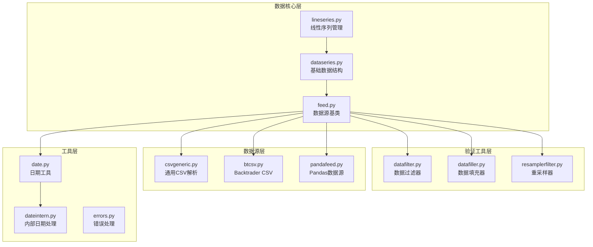

**图表来源**
- [dataseries.py](file://backtrader/dataseries.py#L60-L212)
- [feed.py](file://backtrader/feed.py#L122-L814)
- [lineseries.py](file://backtrader/lineseries.py#L444-L645)

**章节来源**
- [dataseries.py](file://backtrader/dataseries.py#L1-L212)
- [feed.py](file://backtrader/feed.py#L1-L814)
- [lineseries.py](file://backtrader/lineseries.py#L1-L645)

## 核心组件

### 数据系列核心结构

Backtrader 的数据验证从基础的数据结构开始，主要包含以下核心组件：

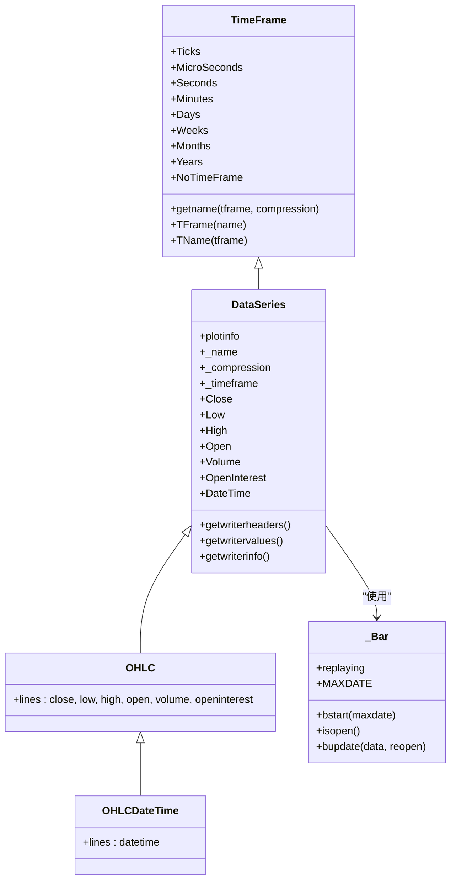

**图表来源**
- [dataseries.py](file://backtrader/dataseries.py#L33-L212)

### 抽象数据源架构

抽象数据源提供了统一的数据验证接口：

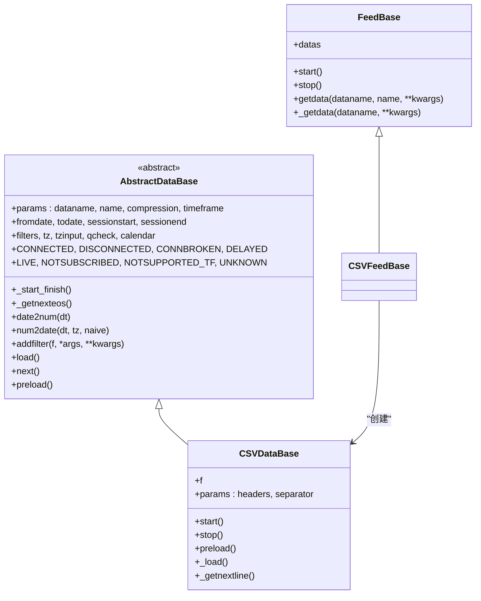

**图表来源**
- [feed.py](file://backtrader/feed.py#L122-L814)

**章节来源**
- [dataseries.py](file://backtrader/dataseries.py#L33-L212)
- [feed.py](file://backtrader/feed.py#L122-L814)

## 架构概览

Backtrader 的数据验证架构采用分层设计，从底层数据源到上层应用都具备完整的验证机制：

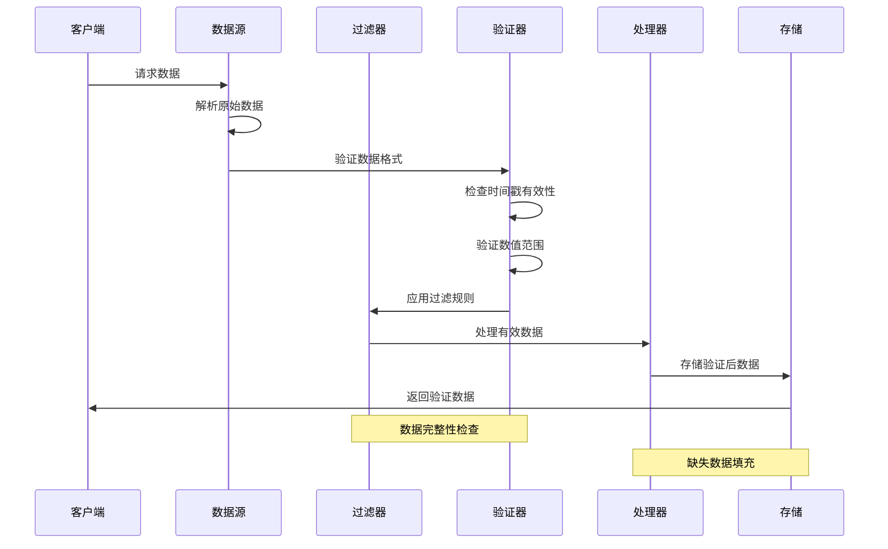

**图表来源**
- [feed.py](file://backtrader/feed.py#L471-L536)
- [datafilter.py](file://backtrader/filters/datafilter.py#L57-L73)
- [datafiller.py](file://backtrader/filters/datafiller.py#L110-L176)

## 详细组件分析

### 数据完整性检查机制

Backtrader 的数据完整性检查通过多个层次实现：

#### 时间戳验证

时间戳验证是数据完整性检查的核心部分：

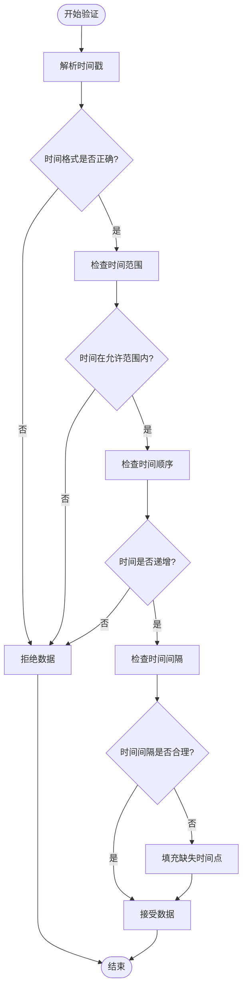

**图表来源**
- [datafiller.py](file://backtrader/filters/datafiller.py#L103-L176)
- [resamplerfilter.py](file://backtrader/resamplerfilter.py#L159-L297)

#### 数值范围检查

数值范围检查确保金融数据的合理性：

| 数据类型 | 合法范围 | 检查方法 | 异常处理 |
|---------|---------|---------|---------|
| 价格数据 | > 0 | 检查正数且非零 | 标记为异常或使用前值 |
| 成交量 | ≥ 0 | 非负数检查 | 使用零值或删除记录 |
| 持仓量 | 任意实数 | 基本范围检查 | 标记异常 |
| 时间戳 | 有效日期范围 | 日期有效性验证 | 调整到最近有效日期 |

**章节来源**
- [datafiller.py](file://backtrader/filters/datafiller.py#L30-L177)
- [resamplerfilter.py](file://backtrader/resamplerfilter.py#L96-L753)

### 缺失数据检测与处理

Backtrader 提供了多种缺失数据检测和处理策略：

#### 自动填充机制

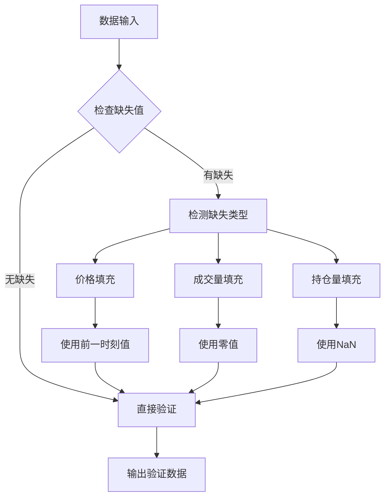

**图表来源**
- [datafiller.py](file://backtrader/filters/datafiller.py#L55-L102)

#### 异常数据识别

异常数据识别通过统计方法实现：

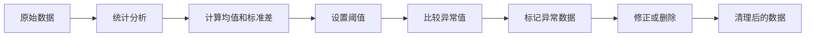

**章节来源**
- [datafiller.py](file://backtrader/filters/datafiller.py#L110-L176)
- [csvgeneric.py](file://backtrader/feeds/csvgeneric.py#L103-L158)

### 数据一致性验证

数据一致性验证确保多数据源和多时间框架的一致性：

#### 时间框架对齐

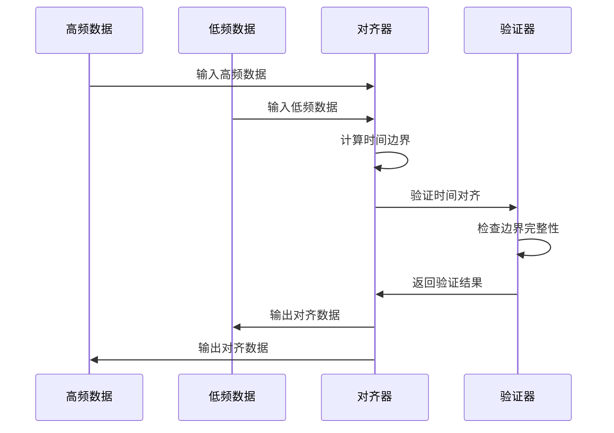

**图表来源**
- [resamplerfilter.py](file://backtrader/resamplerfilter.py#L435-L700)

#### 多数据源一致性检查

多数据源一致性检查通过以下步骤实现：

1. **时间同步检查**：确保所有数据源的时间戳同步
2. **数据完整性检查**：验证各数据源的数据完整性
3. **数值范围一致性**：检查相同指标在不同数据源中的合理性
4. **异常值检测**：识别和处理异常数据点

**章节来源**
- [resamplerfilter.py](file://backtrader/resamplerfilter.py#L96-L753)

### 数据格式标准化

Backtrader 实现了统一的数据格式标准化机制：

#### 日期时间标准化

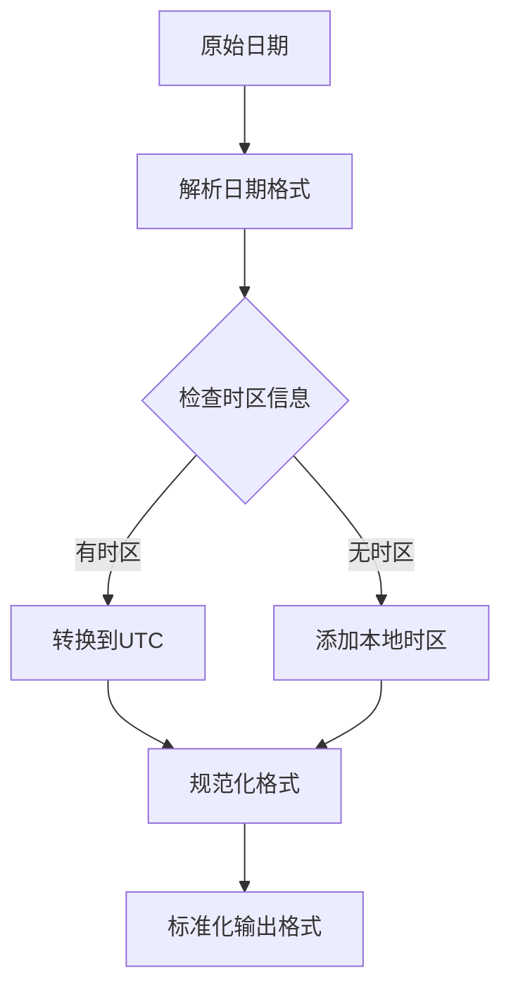

**图表来源**
- [date.py](file://backtrader/utils/date.py#L25-L29)
- [dateintern.py](file://backtrader/utils/dateintern.py#L202-L214)

#### 金融数据标准化

金融数据标准化包括：

| 字段 | 标准化规则 | 示例 |
|------|-----------|------|
| 日期时间 | 统一为UTC时间戳 | 2023-01-01 00:00:00 UTC |
| 价格 | 四舍五入到小数位 | 100.1234 → 100.12 |
| 成交量 | 整数格式 | 1000.5 → 1000 |
| 持仓量 | 浮点数格式 | 100.5 |

**章节来源**
- [dateintern.py](file://backtrader/utils/dateintern.py#L48-L214)
- [csvgeneric.py](file://backtrader/feeds/csvgeneric.py#L72-L85)

### 数据质量报告生成

Backtrader 提供了完善的数据质量报告生成功能：

#### 质量指标定义

| 指标类别 | 具体指标 | 计算方法 | 合格标准 |
|---------|---------|---------|---------|
| 完整性 | 数据覆盖率 | 有效数据/总数据 | ≥ 95% |
| 准确性 | 异常值比例 | 异常值/总数据 | ≤ 1% |
| 一致性 | 时间对齐率 | 正确对齐/总对齐 | ≥ 99% |
| 连续性 | 缺失数据率 | 缺失数据/总数据 | ≤ 0.1% |

#### 报告生成流程

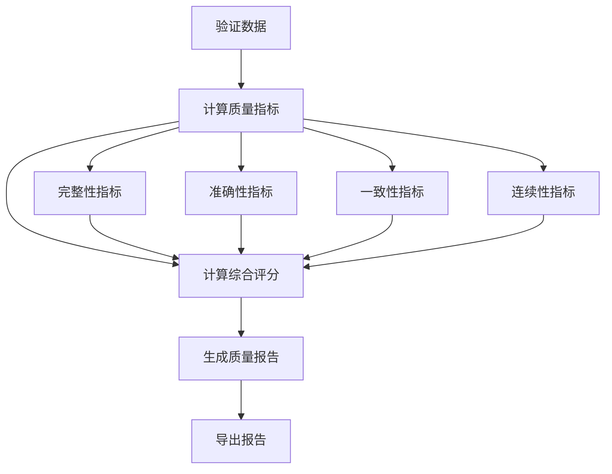

**章节来源**
- [csvgeneric.py](file://backtrader/feeds/csvgeneric.py#L103-L158)
- [pandafeed.py](file://backtrader/feeds/pandafeed.py#L234-L244)

### 数据清洗和预处理最佳实践

Backtrader 推荐的数据清洗和预处理流程：

#### 预处理管道

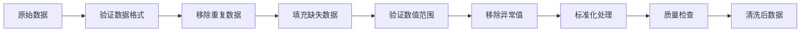

#### 清洗策略

| 数据类型 | 清洗策略 | 处理方法 |
|---------|---------|---------|
| 价格数据 | 异常值检测 | Z-score检测，使用中位数替换 |
| 成交量 | 缺失值填充 | 前向填充，零值填充 |
| 时间戳 | 格式统一 | 转换为UTC，统一格式 |
| 标识符 | 标准化 | 统一大小写，去除特殊字符 |

**章节来源**
- [datafilter.py](file://backtrader/filters/datafilter.py#L27-L74)
- [datafiller.py](file://backtrader/filters/datafiller.py#L30-L177)

### 数据版本管理和变更跟踪

Backtrader 的数据版本管理机制：

#### 版本控制策略

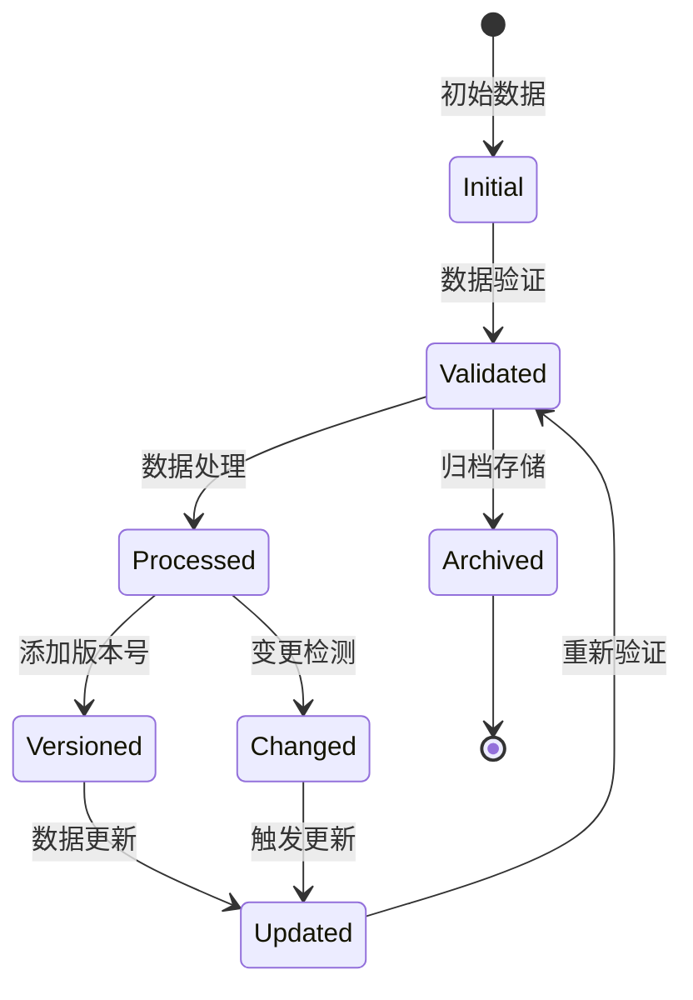

#### 变更跟踪机制

| 变更类型 | 跟踪方式 | 记录内容 |
|---------|---------|---------|
| 数据结构变更 | 版本号递增 | 版本号，变更时间，变更描述 |
| 数据内容变更 | 差异日志 | 变更前后对比，影响范围 |
| 格式变更 | 元数据记录 | 新旧格式映射，兼容性说明 |

**章节来源**
- [feed.py](file://backtrader/feed.py#L603-L634)
- [dataseries.py](file://backtrader/dataseries.py#L60-L104)

### 数据质量监控和报警系统

Backtrader 的数据质量监控系统设计：

#### 监控指标体系

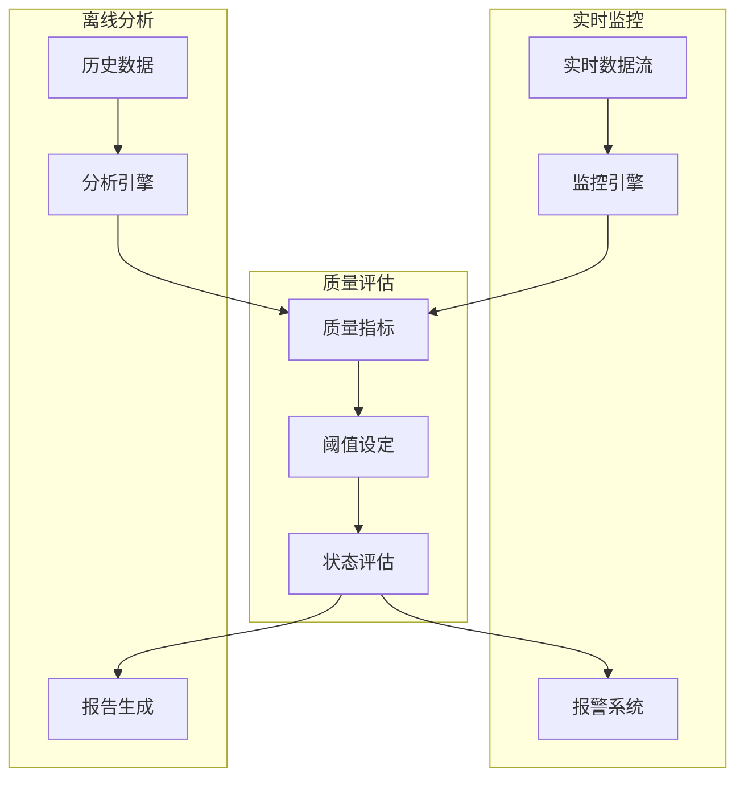

#### 报警触发条件

| 监控类型 | 触发条件 | 报警级别 | 处理建议 |
|---------|---------|---------|---------|
| 数据完整性 | 缺失率 > 5% | 高 | 检查数据源连接 |
| 数据准确性 | 异常值比例 > 2% | 中 | 审核数据质量 |
| 数据一致性 | 对齐失败率 > 1% | 高 | 检查时间同步 |
| 数据连续性 | 间断超过3个周期 | 中 | 检查网络连接 |

**章节来源**
- [vcdata.py](file://backtrader/feeds/vcdata.py#L375-L418)
- [store.py](file://backtrader/store.py#L88-L94)
- [ibbroker.py](file://backtrader/brokers/ibbroker.py#L393-L430)

## 依赖关系分析

Backtrader 数据验证系统的依赖关系如下：

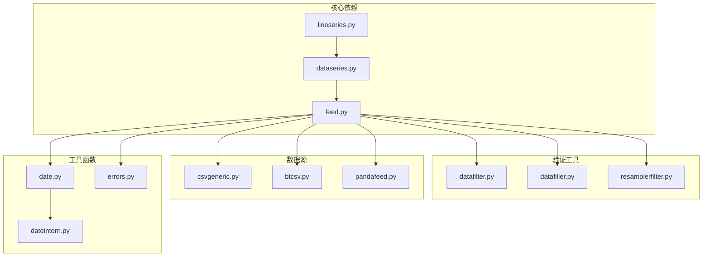

**图表来源**
- [dataseries.py](file://backtrader/dataseries.py#L1-L30)
- [feed.py](file://backtrader/feed.py#L30-L39)
- [date.py](file://backtrader/utils/date.py#L25-L29)

**章节来源**
- [dataseries.py](file://backtrader/dataseries.py#L1-L31)
- [feed.py](file://backtrader/feed.py#L1-L39)
- [date.py](file://backtrader/utils/date.py#L1-L30)

## 性能考虑

Backtrader 在数据验证方面的性能优化策略：

### 内存管理

- **延迟加载**：数据按需加载，避免一次性加载大量数据
- **缓冲区管理**：智能缓冲区大小调整，平衡内存使用和性能
- **垃圾回收**：及时释放不再使用的数据对象

### 处理效率

- **批量处理**：支持批量数据验证，减少函数调用开销
- **并行处理**：多线程并行验证不同数据源
- **缓存机制**：缓存验证结果，避免重复验证

### 网络优化

- **连接池**：复用网络连接，减少连接建立开销
- **心跳检测**：实时监控数据源连接状态
- **超时控制**：合理的超时设置，避免长时间阻塞

## 故障排除指南

### 常见问题诊断

#### 数据格式错误

**症状**：数据解析失败，抛出格式异常

**诊断步骤**：
1. 检查数据文件编码格式
2. 验证CSV分隔符设置
3. 确认日期时间格式匹配

**解决方案**：
```python
# 设置正确的参数
data = cerebro.getdata(
    dataname='data.csv',
    dtformat='%Y-%m-%d %H:%M:%S',
    separator=',',
    nullvalue=float('NaN')
)
```

#### 时间戳异常

**症状**：时间戳乱序或超出范围

**诊断方法**：
1. 检查时区设置
2. 验证时间戳格式
3. 确认数据源时间同步

**处理策略**：
```python
# 设置时区参数
data = cerebro.getdata(
    dataname='data.csv',
    tz='UTC',
    sessionstart=datetime.time(9, 30),
    sessionend=datetime.time(16, 0)
)
```

#### 缺失数据处理

**症状**：数据序列出现空洞

**解决方法**：
1. 使用数据填充器自动填充
2. 检查数据源完整性
3. 验证时间框架设置

**章节来源**
- [errors.py](file://backtrader/errors.py#L28-L52)
- [csvgeneric.py](file://backtrader/feeds/csvgeneric.py#L103-L158)
- [datafiller.py](file://backtrader/filters/datafiller.py#L110-L176)

### 错误处理机制

Backtrader 提供了完善的错误处理机制：

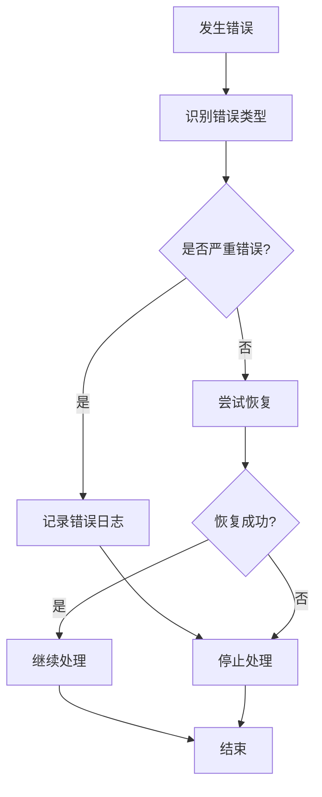

**章节来源**
- [errors.py](file://backtrader/errors.py#L28-L52)
- [feed.py](file://backtrader/feed.py#L274-L293)

## 结论

Backtrader 的数据验证与质量控制系统是一个多层次、全方位的数据质量保障体系。通过从底层数据结构到上层应用的完整验证机制，Backtrader 确保了金融数据的准确性、完整性和一致性。

### 主要优势

1. **多层次验证**：从数据源到应用层的全链路验证
2. **灵活配置**：支持自定义验证规则和处理策略
3. **高性能**：优化的内存管理和处理效率
4. **可扩展性**：模块化的架构设计，易于扩展新功能

### 最佳实践建议

1. **建立标准化流程**：制定统一的数据验证和处理流程
2. **监控关键指标**：持续监控数据质量指标，及时发现异常
3. **定期审查**：定期审查验证规则的有效性
4. **备份策略**：建立数据备份和恢复机制

通过遵循这些原则和使用 Backtrader 提供的工具，用户可以构建可靠的数据验证和质量控制体系，确保量化交易系统的数据质量和运行稳定性。