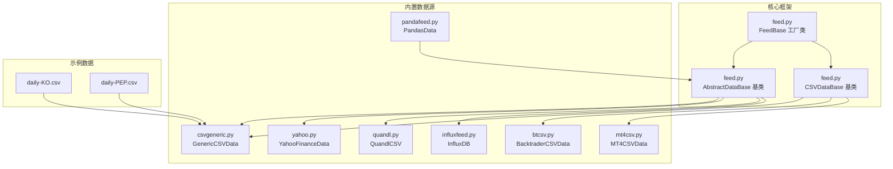
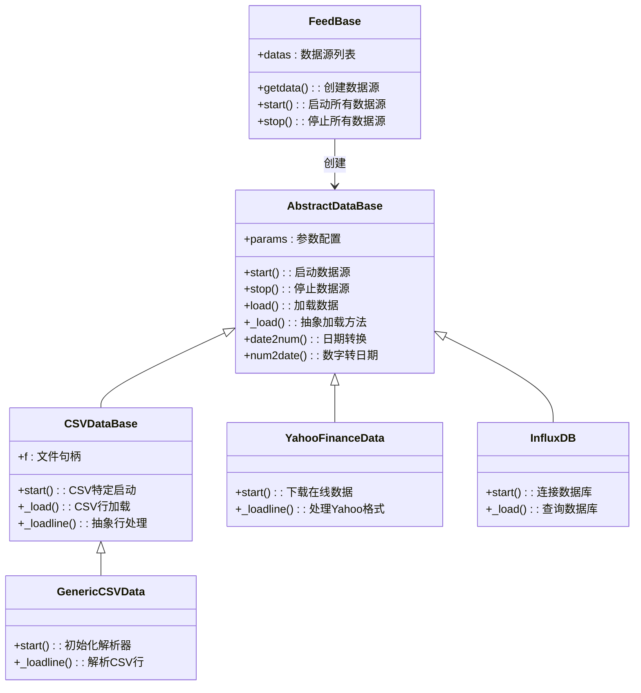
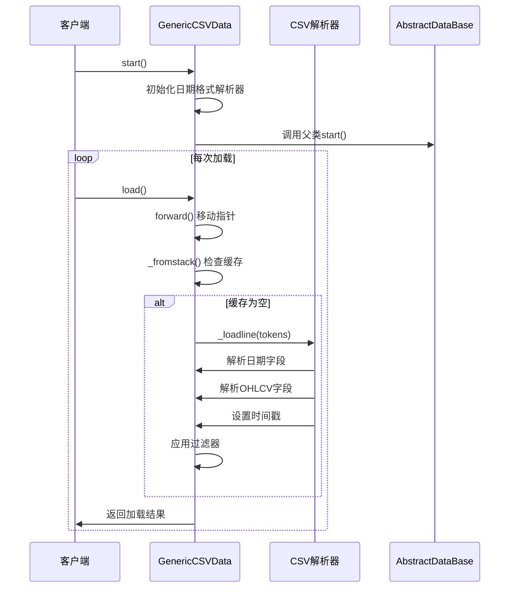
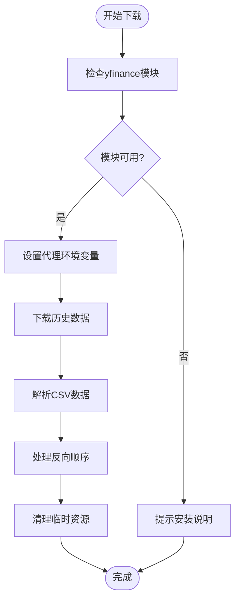
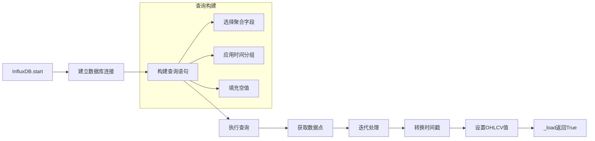
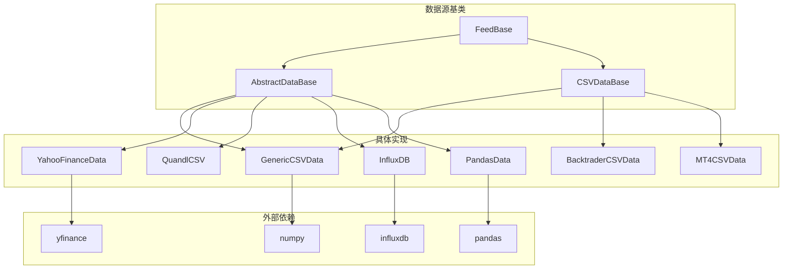

# 自定义数据源开发

<cite>
**本文档引用的文件**
- [feed.py](file://backtrader/feed.py)
- [csvgeneric.py](file://backtrader/feeds/csvgeneric.py)
- [btcsv.py](file://backtrader/feeds/btcsv.py)
- [mt4csv.py](file://backtrader/feeds/mt4csv.py)
- [yahoo.py](file://backtrader/feeds/yahoo.py)
- [quandl.py](file://backtrader/feeds/quandl.py)
- [influxfeed.py](file://backtrader/feeds/influxfeed.py)
- [pandafeed.py](file://backtrader/feeds/pandafeed.py)
- [feeds/__init__.py](file://backtrader/feeds/__init__.py)
- [data-pandas.py](file://samples/data-pandas/data-pandas.py)
- [daily-KO.csv](file://contrib/datas/daily-KO.csv)
- [daily-PEP.csv](file://contrib/datas/daily-PEP.csv)
- [README.rst](file://README.rst)
</cite>

## 目录
1. [简介](#简介)
2. [项目结构](#项目结构)
3. [核心组件](#核心组件)
4. [架构概览](#架构概览)
5. [详细组件分析](#详细组件分析)
6. [依赖关系分析](#依赖关系分析)
7. [性能考虑](#性能考虑)
8. [故障排除指南](#故障排除指南)
9. [结论](#结论)
10. [附录](#附录)

## 简介

BackTrader 是一个功能强大的量化交易回测和实盘交易平台，支持多种数据源类型。本文档专注于自定义数据源的开发，详细介绍如何继承 AbstractDataBase 或 CSVDataBase 基类来实现自定义数据源。

BackTrader 的数据源架构基于以下核心概念：
- **AbstractDataBase**: 所有数据源的基础抽象类
- **CSVDataBase**: CSV 格式数据源的基类
- **FeedBase**: 数据源工厂类，负责创建和管理数据源实例
- **具体数据源实现**: 如 YahooFinance、Quandl、InfluxDB 等

## 项目结构

BackTrader 的数据源相关文件组织如下：

**图表来源**
- [feed.py](file://backtrader/feed.py#L122-L600)
- [csvgeneric.py](file://backtrader/feeds/csvgeneric.py#L32-L163)
- [yahoo.py](file://backtrader/feeds/yahoo.py#L37-L382)
- [pandafeed.py](file://backtrader/feeds/pandafeed.py#L30-L274)

**章节来源**
- [feed.py](file://backtrader/feed.py#L1-L814)
- [feeds/__init__.py](file://backtrader/feeds/__init__.py#L1-L55)

## 核心组件

### AbstractDataBase 基类

AbstractDataBase 是所有数据源的基础抽象类，提供了以下核心功能：

#### 主要参数
- **dataname**: 数据源名称或标识符
- **name**: 数据源显示名称
- **compression**: 时间框架压缩因子
- **timeframe**: 时间框架（秒、分钟、日等）
- **fromdate/todate**: 数据范围限制
- **sessionstart/sessionend**: 交易会话时间范围
- **filters**: 数据过滤器列表
- **tz/tzinput**: 时区设置

#### 关键方法
- **_load()**: 核心数据加载方法，必须由子类实现
- **start()/stop()**: 生命周期管理
- **load()**: 高层加载接口，调用 _load() 并处理过滤
- **next()/advance()**: 数据指针移动和索引管理

### CSVDataBase 基类

CSVDataBase 继承自 AbstractDataBase，专门处理 CSV 格式数据：

#### 特殊参数
- **headers**: 是否包含表头行
- **separator**: 字段分隔符，默认逗号

#### 核心流程
1. 文件打开和读取
2. 行解析和令牌化
3. 调用 _loadline() 处理单行数据
4. 数据格式转换和存储

**章节来源**
- [feed.py](file://backtrader/feed.py#L122-L598)
- [feed.py](file://backtrader/feed.py#L649-L727)

## 架构概览

BackTrader 的数据源架构采用多层设计模式：

**图表来源**
- [feed.py](file://backtrader/feed.py#L122-L598)
- [csvgeneric.py](file://backtrader/feeds/csvgeneric.py#L32-L163)
- [yahoo.py](file://backtrader/feeds/yahoo.py#L196-L382)
- [influxfeed.py](file://backtrader/feeds/influxfeed.py#L41-L116)

## 详细组件分析

### CSV 数据源实现

#### GenericCSVData 分析

GenericCSVData 提供了最通用的 CSV 数据解析功能：

**图表来源**
- [feed.py](file://backtrader/feed.py#L471-L536)
- [csvgeneric.py](file://backtrader/feeds/csvgeneric.py#L103-L158)

#### 关键实现要点

1. **日期格式处理**:
   - 支持字符串格式化 (`%Y-%m-%d`)
   - 支持 Unix 时间戳 (整数/浮点)
   - 支持自定义解析函数

2. **字段映射**:
   - 使用参数配置字段位置
   - 支持缺失字段的默认值处理
   - 自动类型转换为浮点数

3. **时间戳转换**:
   - 使用 `date2num()` 将 datetime 转换为内部数值格式
   - 处理时区本地化
   - 日内数据和日线数据的不同处理逻辑

**章节来源**
- [csvgeneric.py](file://backtrader/feeds/csvgeneric.py#L32-L163)

### 在线数据源集成

#### YahooFinanceData 实现

YahooFinanceData 展示了如何集成外部 API：

**图表来源**
- [yahoo.py](file://backtrader/feeds/yahoo.py#L253-L376)

#### 实现特点

1. **模块依赖管理**:
   - 动态导入外部库 (yfinance)
   - 错误处理和用户友好提示

2. **网络请求处理**:
   - 代理支持配置
   - 重试机制实现
   - 错误状态码处理

3. **数据转换**:
   - 将在线数据转换为内部格式
   - 支持调整后的收盘价处理

**章节来源**
- [yahoo.py](file://backtrader/feeds/yahoo.py#L196-L382)

### 数据库连接实现

#### InfluxDB 数据源

InfluxDB 数据源展示了如何连接时序数据库：

**图表来源**
- [influxfeed.py](file://backtrader/feeds/influxfeed.py#L63-L116)

**章节来源**
- [influxfeed.py](file://backtrader/feeds/influxfeed.py#L41-L116)

### Pandas 数据源集成

#### PandasDirectData 和 PandasData

Pandas 数据源提供了两种不同的集成方式：

1. **PandasDirectData**: 直接使用 DataFrame.itertuples()
2. **PandasData**: 使用列名映射的灵活方式

**章节来源**
- [pandafeed.py](file://backtrader/feeds/pandafeed.py#L30-L274)

## 依赖关系分析

**图表来源**
- [feed.py](file://backtrader/feed.py#L122-L600)
- [yahoo.py](file://backtrader/feeds/yahoo.py#L253-L261)
- [influxfeed.py](file://backtrader/feeds/influxfeed.py#L42-L45)
- [pandafeed.py](file://backtrader/feeds/pandafeed.py#L24-L27)

**章节来源**
- [feeds/__init__.py](file://backtrader/feeds/__init__.py#L25-L55)

## 性能考虑

### 内存管理

1. **预加载优化**:
   - CSV 数据源在预加载后会关闭文件句柄
   - 避免长时间持有大文件句柄

2. **缓冲区管理**:
   - 使用 collections.deque 管理数据栈
   - 支持增量处理避免内存峰值

### 网络请求优化

1. **重试机制**:
   - Yahoo Finance 实现了指数退避重试
   - 最大重试次数控制

2. **代理支持**:
   - 动态设置 HTTP/HTTPS 代理
   - 自动恢复原始代理配置

### 数据处理优化

1. **批量处理**:
   - InfluxDB 使用聚合查询减少网络往返
   - 支持时间分组和数据填充

2. **类型转换优化**:
   - 避免重复的字符串到数字转换
   - 使用生成器模式处理大数据集

## 故障排除指南

### 常见问题及解决方案

#### 数据格式问题
- **症状**: 解析错误或数据不完整
- **原因**: CSV 格式不匹配或字段缺失
- **解决**: 检查参数配置和数据源格式

#### 网络连接问题
- **症状**: 下载超时或连接失败
- **原因**: 网络不稳定或 API 限制
- **解决**: 实现重试机制和代理配置

#### 内存溢出问题
- **症状**: 处理大数据集时内存不足
- **原因**: 一次性加载所有数据
- **解决**: 使用流式处理和分批加载

**章节来源**
- [yahoo.py](file://backtrader/feeds/yahoo.py#L292-L320)
- [feed.py](file://backtrader/feed.py#L688-L697)

## 结论

BackTrader 的自定义数据源开发提供了高度灵活的架构，支持从简单的 CSV 文件到复杂的在线 API 和数据库连接。通过理解 AbstractDataBase 和 CSVDataBase 的设计模式，开发者可以快速实现各种数据源需求。

关键成功因素包括：
- 正确实现 `_load()` 方法
- 合理处理数据格式转换
- 有效的错误处理和重试机制
- 适当的性能优化策略

## 附录

### 开发流程指南

#### 第一步：需求分析
1. 确定数据源类型（文件、API、数据库）
2. 分析数据格式和字段映射
3. 评估性能和扩展性需求

#### 第二步：基类选择
- 继承 AbstractDataBase：完全自定义实现
- 继承 CSVDataBase：处理 CSV 格式数据
- 继承现有具体类：基于已有功能扩展

#### 第三步：核心方法实现
1. 实现 `_load()` 或 `_loadline()`
2. 处理数据格式转换
3. 设置时间戳和 OHLCV 值

#### 第四步：测试和验证
1. 单元测试数据加载
2. 边界条件测试
3. 性能基准测试

#### 第五步：部署和监控
1. 生产环境配置
2. 错误日志记录
3. 性能监控指标

### 实际开发案例

#### 案例1：自定义 CSV 数据源
基于 GenericCSVData 的实现模式，可以轻松创建自定义 CSV 解析器：

1. 继承 CSVDataBase
2. 实现 `_loadline()` 方法
3. 配置字段映射参数
4. 处理特殊数据格式

#### 案例2：API 数据源集成
参考 YahooFinanceData 的实现，可以创建自定义 API 数据源：

1. 设计 API 请求参数
2. 实现网络请求和响应解析
3. 添加错误处理和重试逻辑
4. 集成到 BackTrader 数据流

#### 案例3：数据库数据源
基于 InfluxDB 的实现，可以连接其他时序数据库：

1. 选择合适的数据库驱动
2. 实现查询构建和结果解析
3. 处理时区和精度转换
4. 优化查询性能

**章节来源**
- [README.rst](file://README.rst#L66-L102)
- [data-pandas.py](file://samples/data-pandas/data-pandas.py#L32-L93)