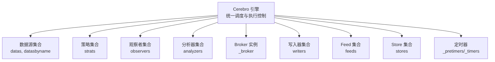
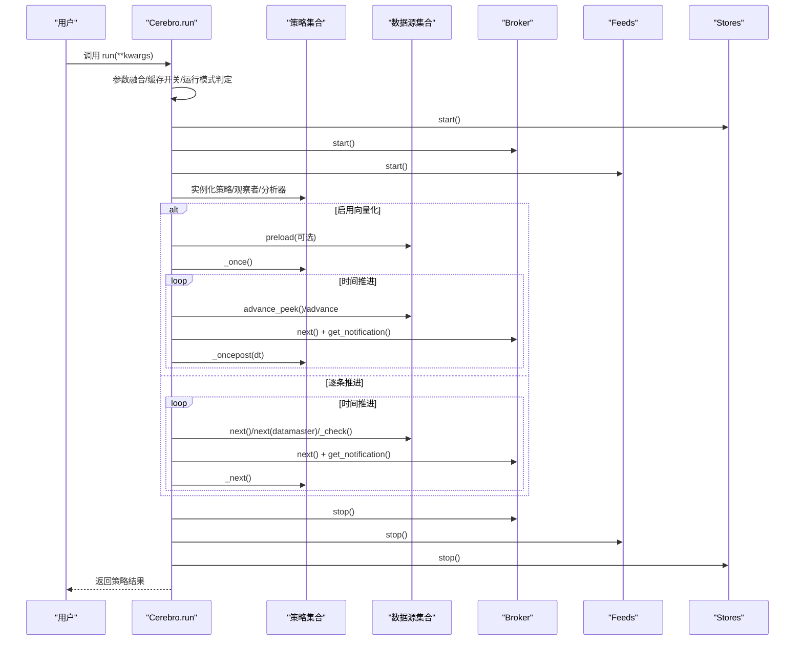
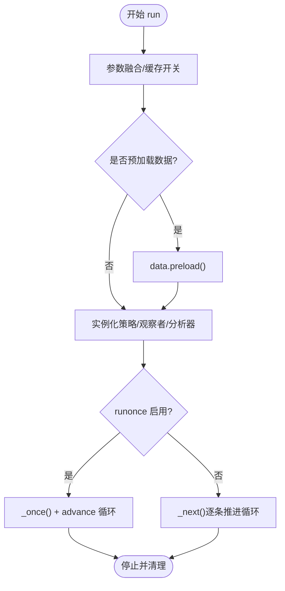
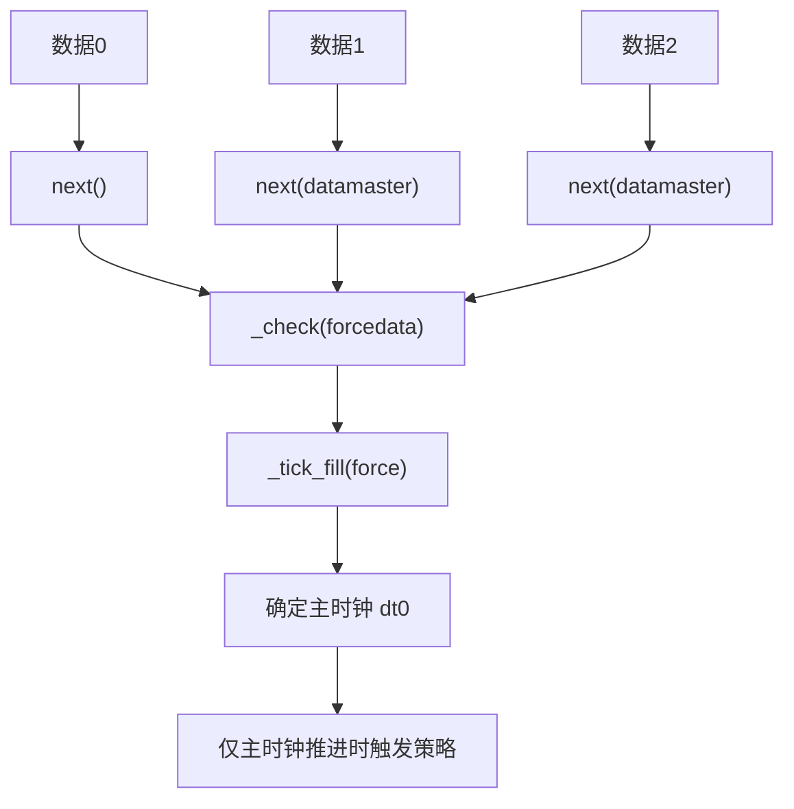
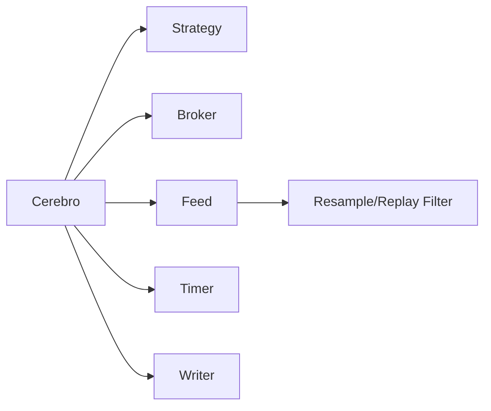

# Cerebro引擎架构

<cite>
**本文引用的文件**
- [backtrader/cerebro.py](file://backtrader/cerebro.py)
- [backtrader/strategy.py](file://backtrader/strategy.py)
- [backtrader/broker.py](file://backtrader/broker.py)
- [backtrader/feed.py](file://backtrader/feed.py)
- [backtrader/resamplerfilter.py](file://backtrader/resamplerfilter.py)
- [samples/multidata-strategy/multidata-strategy.py](file://samples/multidata-strategy/multidata-strategy.py)
- [samples/memory-savings/memory-savings.py](file://samples/memory-savings/memory-savings.py)
- [samples/data-resample/data-resample.py](file://samples/data-resample/data-resample.py)
</cite>

## 目录
1. [引言](#引言)
2. [项目结构](#项目结构)
3. [核心组件](#核心组件)
4. [架构总览](#架构总览)
5. [详细组件分析](#详细组件分析)
6. [依赖关系分析](#依赖关系分析)
7. [性能考量](#性能考量)
8. [故障排查指南](#故障排查指南)
9. [结论](#结论)
10. [附录：使用示例与最佳实践](#附录使用示例与最佳实践)

## 引言
本文件面向Backtrader的Cerebro引擎，系统化梳理其作为量化交易系统中央协调器的设计理念与实现机制。重点覆盖以下主题：
- 核心参数配置：preload、runonce、live、exactbars等对执行模式与内存占用的影响
- 策略生命周期管理：从策略添加、初始化到执行的完整流程
- 多数据源管理：数据对齐、时间同步与重采样/回放的数据链处理
- 内存管理策略：exactbars参数对内存使用的控制
- 事件驱动机制：时间推进、数据更新与策略回调的触发顺序
- 回测与实盘差异：在不同运行模式下的行为对比
- 实战示例：通过仓库中的示例脚本展示典型用法

## 项目结构
Cerebro位于backtrader包中，是整个系统的中枢，负责：
- 统一调度数据源、策略、观察者、分析器、写入器与Broker
- 控制执行模式（next逐条推进 vs runonce向量化）
- 管理内存节省策略（exactbars）
- 协调定时器、通知与绘图

图表来源
- [backtrader/cerebro.py](file://backtrader/cerebro.py#L296-L328)

章节来源
- [backtrader/cerebro.py](file://backtrader/cerebro.py#L296-L328)

## 核心组件
- Cerebro：引擎主体，负责参数解析、预加载、运行模式选择、策略实例化与生命周期管理、事件循环与通知分发、绘图与写入输出。
- Strategy：策略基类，定义策略生命周期方法（start/next/once/stop）、指标/观察者/分析器注册、订单/交易管理接口。
- Broker：抽象经纪商接口，定义下单、撤单、成交回报、资金与头寸查询等。
- Data Feed：数据源抽象，支持CSV/PANDAS/IB等接入，提供next/load/预加载等能力。
- Resample/Replay Filter：重采样与回放过滤器，用于将高频数据聚合到低频或模拟实时推送。
- Timer：定时器系统，支持会话开始/结束、按周/月日触发等。

章节来源
- [backtrader/cerebro.py](file://backtrader/cerebro.py#L60-L294)
- [backtrader/strategy.py](file://backtrader/strategy.py#L107-L120)
- [backtrader/broker.py](file://backtrader/broker.py#L49-L168)
- [backtrader/feed.py](file://backtrader/feed.py#L431-L477)
- [backtrader/resamplerfilter.py](file://backtrader/resamplerfilter.py#L47-L93)

## 架构总览
Cerebro在run阶段完成参数融合、对象缓存开关、运行模式判定，并依次启动各子系统（Store/Feed/Broker），实例化策略、观察者、分析器与默认观察者，然后进入事件循环。事件循环根据是否启用runonce决定采用“next逐条推进”还是“向量化一次性推进”，并在每个周期内处理数据推进、通知、定时器与写入。

图表来源
- [backtrader/cerebro.py](file://backtrader/cerebro.py#L1030-L1338)
- [backtrader/cerebro.py](file://backtrader/cerebro.py#L1498-L1717)
- [backtrader/cerebro.py](file://backtrader/cerebro.py#L1649-L1704)

章节来源
- [backtrader/cerebro.py](file://backtrader/cerebro.py#L1030-L1338)

## 详细组件分析

### 核心参数与运行模式
- preload（默认True）：是否在run前对数据进行预加载以提升性能；与replay模式不兼容。
- runonce（默认True）：启用向量化模式，先一次性计算所有指标，再按时间推进触发策略；与旧同步模式配合时有特殊路径。
- live（默认False）：强制以逐条推进模式运行，关闭preload/runonce；适用于实时流场景。
- exactbars（默认False）：内存节省级别
  - True/1：严格最小缓冲，禁用preload/runonce，且禁用绘图
  - -1：保留数据源与策略级指标全量内存，允许绘图与预加载，但禁用runonce
  - -2：在-1基础上，仅对未绘制的指标启用内存节省
- 其他关键参数：stdstats、oldsync、tz、cheat_on_open、broker_coo、quicknotify、writer、tradehistory、optdatas、optreturn、objcache、maxcpus等

章节来源
- [backtrader/cerebro.py](file://backtrader/cerebro.py#L61-L272)
- [backtrader/cerebro.py](file://backtrader/cerebro.py#L1062-L1080)

### 策略生命周期管理
- 添加策略：addstrategy/optstrategy，支持单次运行与优化两种模式
- 实例化与装配：runstrategies中为策略注入默认观察者、指标、分析器、计数器、时区等
- 生命周期钩子：start → 运行期（next/once）→ stop
- 计划任务：add_timer/addstorecb/adddatacb等扩展点

图表来源
- [backtrader/cerebro.py](file://backtrader/cerebro.py#L1171-L1338)
- [backtrader/cerebro.py](file://backtrader/cerebro.py#L1498-L1717)

章节来源
- [backtrader/cerebro.py](file://backtrader/cerebro.py#L1171-L1338)
- [backtrader/strategy.py](file://backtrader/strategy.py#L107-L120)

### 多数据源管理与时间同步
- 数据对齐与时间主时钟：新同步模式下按各数据下一个可用时间的最小值作为主时钟，确保只在主时钟时间推进时才触发非主时钟数据的填充与tick填充
- 强制输出：当某数据未产生新bar时，通过_check与datamaster强制产出，保证多时间框架一致性
- 重采样/回放：resampledata/replaydata会为数据附加过滤器，改变数据推进与可见性，replay模式下禁止预加载
- 旧同步模式：以data0为主时钟，其他数据跟随推进

图表来源
- [backtrader/cerebro.py](file://backtrader/cerebro.py#L1503-L1647)
- [backtrader/feed.py](file://backtrader/feed.py#L431-L477)

章节来源
- [backtrader/cerebro.py](file://backtrader/cerebro.py#L1503-L1647)
- [backtrader/feed.py](file://backtrader/feed.py#L431-L477)

### 内存管理策略（exactbars）
- exactbars=1：严格最小缓冲，禁用preload/runonce，禁用绘图
- exactbars=-1：保留数据源与策略级指标全量内存，允许绘图与预加载，禁用runonce
- exactbars=-2：在-1基础上，对未绘制指标启用内存节省
- 策略侧qbuffer：对数据、指标、观察者、分析器等按层级递归应用节省策略

章节来源
- [backtrader/cerebro.py](file://backtrader/cerebro.py#L121-L177)
- [backtrader/cerebro.py](file://backtrader/cerebro.py#L1275-L1277)
- [backtrader/strategy.py](file://backtrader/strategy.py#L120-L154)

### 事件驱动机制
- Broker通知：每周期调用_brokernotify，从Broker队列取出通知并分发给对应策略
- Store/Data通知：通过回调与notify_*方法向策略广播状态变化
- 定时器：在推进前后检查定时器，支持cheat模式（开盘前）与普通模式
- 写入器：在每次推进时收集数据与策略值，按需输出CSV

章节来源
- [backtrader/cerebro.py](file://backtrader/cerebro.py#L1360-L1376)
- [backtrader/cerebro.py](file://backtrader/cerebro.py#L410-L543)
- [backtrader/cerebro.py](file://backtrader/cerebro.py#L1706-L1717)
- [backtrader/cerebro.py](file://backtrader/cerebro.py#L1475-L1493)

### 回测与实盘差异
- live模式：强制逐条推进，关闭preload/runonce，适合实时流场景
- 预加载限制：replay模式下禁止预加载，因为全周期K线是在实时构建
- 快速通知：quicknotify在实盘中可提前投递通知，避免延迟

章节来源
- [backtrader/cerebro.py](file://backtrader/cerebro.py#L1076-L1080)
- [backtrader/cerebro.py](file://backtrader/cerebro.py#L1070-L1074)

## 依赖关系分析
Cerebro与各模块的耦合关系如下：
- 与Strategy：实例化、生命周期管理、回调分发
- 与Broker：订单提交/取消、成交回报、资金/头寸查询
- 与Data Feed：数据推进、预加载、重采样/回放过滤器
- 与Timer：定时触发策略/引擎回调
- 与Writer：CSV输出与汇总信息

图表来源
- [backtrader/cerebro.py](file://backtrader/cerebro.py#L1171-L1338)
- [backtrader/resamplerfilter.py](file://backtrader/resamplerfilter.py#L47-L93)

章节来源
- [backtrader/cerebro.py](file://backtrader/cerebro.py#L1171-L1338)
- [backtrader/resamplerfilter.py](file://backtrader/resamplerfilter.py#L47-L93)

## 性能考量
- 向量化runonce：在可向量化场景下显著加速，但需要谨慎使用某些依赖逐条推进的指标
- 预加载preload：减少重复IO与计算，但在大数据集上会增加内存占用
- exactbars：通过严格最小缓冲降低内存峰值，但牺牲绘图与runonce能力
- 多进程优化：optdatas/optreturn结合maxcpus可加速优化过程
- 通知与写入：CSV写入可能成为瓶颈，建议按需开启

## 故障排查指南
- 策略未被实例化：确认已至少添加一个策略或启用信号策略
- 数据未推进：检查是否启用了replay而误用preload；确认数据源是否正确添加
- 内存异常：尝试设置exactbars=-1/-2；评估指标数量与绘图需求
- 定时器未触发：核对定时器时区与会话边界；确认cheat标志与推进模式匹配
- 实盘延迟：启用quicknotify；检查Broker实现的通知机制

章节来源
- [backtrader/cerebro.py](file://backtrader/cerebro.py#L1098-L1122)
- [backtrader/cerebro.py](file://backtrader/cerebro.py#L1070-L1080)
- [backtrader/cerebro.py](file://backtrader/cerebro.py#L1706-L1717)

## 结论
Cerebro通过清晰的参数体系与事件驱动模型，实现了回测与实盘的一致体验。合理配置preload/runonce/live/exactbars等参数，可在性能、内存与功能之间取得平衡。多数据源的时间同步与重采样/回放机制，使得复杂交易场景的建模与验证成为可能。

## 附录：使用示例与最佳实践
- 多数据源策略：演示双数据对齐、信号生成与下单
  - 示例路径：[samples/multidata-strategy/multidata-strategy.py](file://samples/multidata-strategy/multidata-strategy.py#L117-L164)
- 内存节省：通过exactbars与指标选择控制内存占用
  - 示例路径：[samples/memory-savings/memory-savings.py](file://samples/memory-savings/memory-savings.py#L123-L135)
- 重采样：将高维数据降采样到日线/周线等
  - 示例路径：[samples/data-resample/data-resample.py](file://samples/data-resample/data-resample.py#L30-L71)

章节来源
- [samples/multidata-strategy/multidata-strategy.py](file://samples/multidata-strategy/multidata-strategy.py#L117-L164)
- [samples/memory-savings/memory-savings.py](file://samples/memory-savings/memory-savings.py#L123-L135)
- [samples/data-resample/data-resample.py](file://samples/data-resample/data-resample.py#L30-L71)