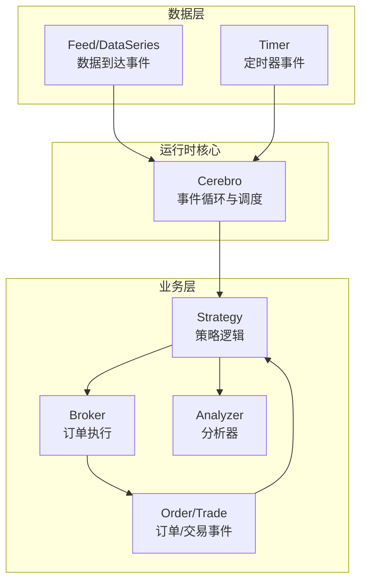
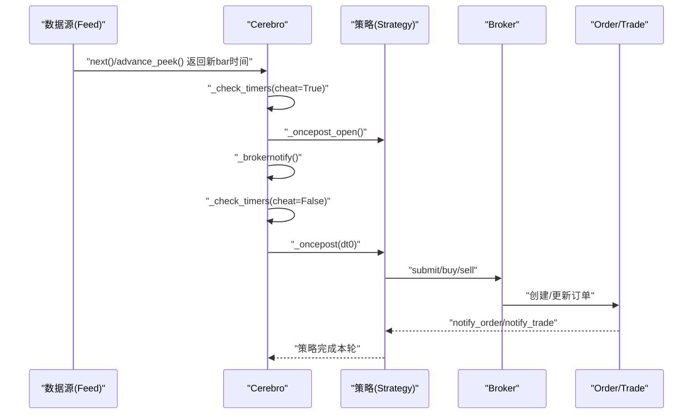
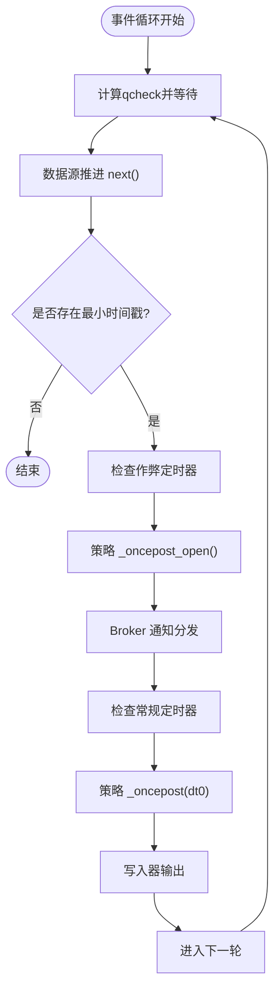
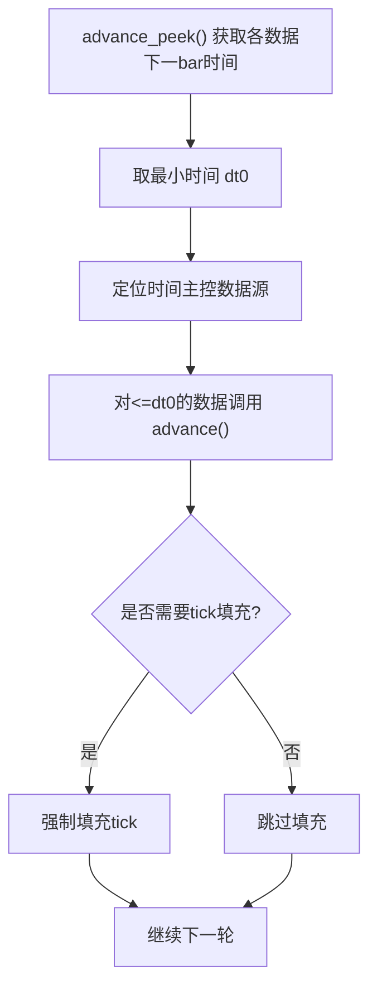
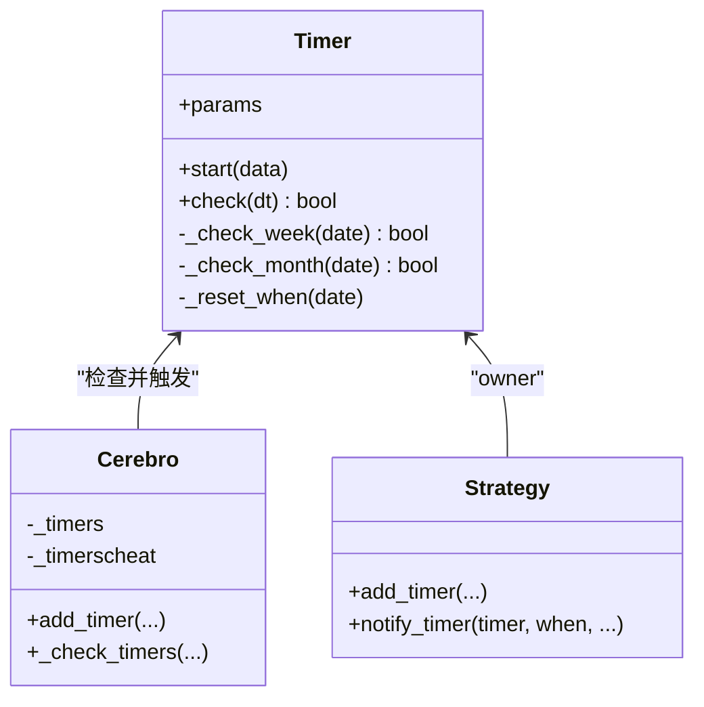
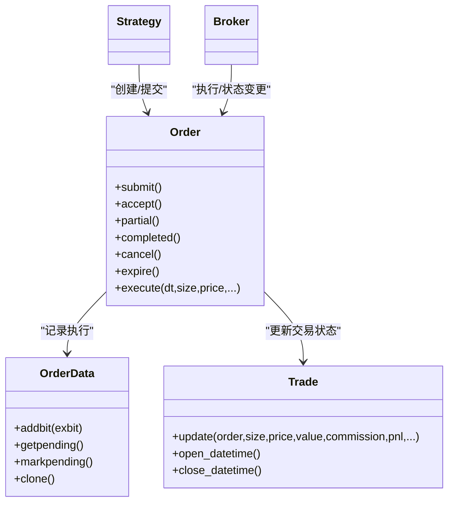
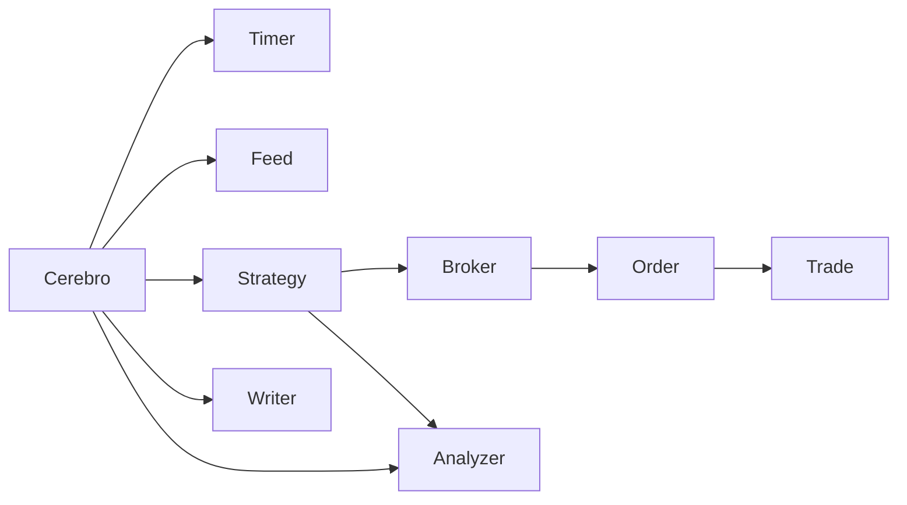

# 事件驱动架构

<cite>
**本文档引用的文件**
- [backtrader/__init__.py](file://backtrader/__init__.py)
- [backtrader/cerebro.py](file://backtrader/cerebro.py)
- [backtrader/timer.py](file://backtrader/timer.py)
- [backtrader/order.py](file://backtrader/order.py)
- [backtrader/feed.py](file://backtrader/feed.py)
- [backtrader/strategy.py](file://backtrader/strategy.py)
- [backtrader/broker.py](file://backtrader/broker.py)
- [backtrader/trade.py](file://backtrader/trade.py)
- [backtrader/dataseries.py](file://backtrader/dataseries.py)
- [backtrader/analyzer.py](file://backtrader/analyzer.py)
- [samples/timers/scheduled.py](file://samples/timers/scheduled.py)
- [samples/timers/scheduled-min.py](file://samples/timers/scheduled-min.py)
</cite>

## 目录
1. [引言](#引言)
2. [项目结构](#项目结构)
3. [核心组件](#核心组件)
4. [架构总览](#架构总览)
5. [详细组件分析](#详细组件分析)
6. [依赖关系分析](#依赖关系分析)
7. [性能考虑](#性能考虑)
8. [故障排除指南](#故障排除指南)
9. [结论](#结论)
10. [附录](#附录)

## 引言
本文件系统化梳理 Backtrader 的事件驱动架构，重点阐释以下主题：
- 事件驱动模式在量化交易中的应用原理与优势
- 时间序列数据流的处理机制（数据到达、定时器、订单执行等事件）
- 事件队列管理与调度（优先级与处理顺序）
- 时间推进算法（离散时间步长上的连续模拟）
- 定时器系统（会话定时器、周期性定时器、一次性定时器）
- 事件处理最佳实践与性能优化建议
- 具体代码示例路径（以源码路径代替直接代码）

## 项目结构
Backtrader 将事件驱动贯穿于运行时核心（Cerebro）、数据流（Feed/DataSeries）、策略（Strategy）、订单与交易（Order/Trade）、以及定时器（Timer）等模块之间，形成“数据驱动 + 订单驱动 + 定时器驱动”的统一事件循环。

**图表来源**
- [backtrader/cerebro.py](file://backtrader/cerebro.py#L1498-L1717)
- [backtrader/feed.py](file://backtrader/feed.py#L122-L536)
- [backtrader/timer.py](file://backtrader/timer.py#L42-L226)
- [backtrader/strategy.py](file://backtrader/strategy.py#L107-L800)
- [backtrader/order.py](file://backtrader/order.py#L222-L642)
- [backtrader/trade.py](file://backtrader/trade.py#L94-L312)
- [backtrader/analyzer.py](file://backtrader/analyzer.py#L329-L372)

**章节来源**
- [backtrader/__init__.py](file://backtrader/__init__.py#L24-L91)

## 核心组件
- 运行时引擎（Cerebro）：负责事件循环、数据推进、定时器检查、通知分发与写入器输出。
- 数据层（Feed/DataSeries）：封装时间序列数据，支持预加载、重采样、回放、过滤器与通知队列。
- 策略（Strategy）：定义交易逻辑，接收数据、定时器、订单与交易通知，并提交订单。
- 订单与交易（Order/Trade）：抽象订单生命周期与交易状态，记录执行细节与历史。
- 定时器（Timer）：按会话、日历、周/月规则触发回调，支持作弊模式（开盘前）。
- 分析器（Analyzer）：基于时间窗口或日期键进行周期性计算与输出。

**章节来源**
- [backtrader/cerebro.py](file://backtrader/cerebro.py#L60-L500)
- [backtrader/feed.py](file://backtrader/feed.py#L122-L320)
- [backtrader/strategy.py](file://backtrader/strategy.py#L107-L200)
- [backtrader/order.py](file://backtrader/order.py#L222-L350)
- [backtrader/trade.py](file://backtrader/trade.py#L94-L160)
- [backtrader/timer.py](file://backtrader/timer.py#L42-L120)
- [backtrader/analyzer.py](file://backtrader/analyzer.py#L329-L372)

## 架构总览
Backtrader 的事件驱动核心由 Cerebro 的主循环驱动，按时间步推进各数据源，检查定时器，分发订单与交易通知，再调用策略与观察器/分析器的相应生命周期方法。

**图表来源**
- [backtrader/cerebro.py](file://backtrader/cerebro.py#L1620-L1717)
- [backtrader/strategy.py](file://backtrader/strategy.py#L577-L614)
- [backtrader/broker.py](file://backtrader/broker.py#L145-L167)
- [backtrader/order.py](file://backtrader/order.py#L502-L525)

## 详细组件分析

### 事件类型与触发条件
- 数据到达事件：当任一数据源推进到新的 bar 或 tick，Cerebro 检测最小时间戳并推进对应数据，随后触发策略的 next/_oncepost 等生命周期。
- 定时器事件：根据 Timer 的 when/offset/repeat/weekdays/monthdays/allow/tzdata 等参数，在会话开始/结束或指定时刻触发回调。
- 订单执行事件：Broker 在撮合后产生订单状态变化与成交细节，通过策略的 notify_order/notify_trade 传递。
- 数据状态事件：数据源通过 put_notification 上报连接、延迟、直播等状态变更，Cerebro 统一分发至策略与存储。

**章节来源**
- [backtrader/cerebro.py](file://backtrader/cerebro.py#L1553-L1640)
- [backtrader/timer.py](file://backtrader/timer.py#L150-L226)
- [backtrader/order.py](file://backtrader/order.py#L502-L525)
- [backtrader/feed.py](file://backtrader/feed.py#L274-L293)

### 事件队列与调度机制
- 数据队列：各数据源维护内部队列（如实时队列），Cerebro 在每轮循环中调用 do_qcheck 控制等待时间，避免忙轮询。
- 定时器队列：Cerebro 内部维护 _timers 与 _timerscheat 两套定时器列表，分别在“作弊”（开盘前）与“常规”阶段检查。
- 通知队列：数据源与存储通过队列保存通知，Cerebro 在每轮开始/中间/结束时集中取出并分发给策略与观察器。

**图表来源**
- [backtrader/cerebro.py](file://backtrader/cerebro.py#L1540-L1717)
- [backtrader/feed.py](file://backtrader/feed.py#L261-L267)

**章节来源**
- [backtrader/cerebro.py](file://backtrader/cerebro.py#L1520-L1717)
- [backtrader/feed.py](file://backtrader/feed.py#L261-L267)

### 时间推进算法
- 多时间框架同步：按时间框架与压缩级别排序数据源，使用 advance_peek 取最小时间戳作为“时间主控”，仅允许到达该时间点的数据前进。
- Tick 填充：对于非回放且未到时间点的数据，强制填充 tick 以保持连续性；回放场景则强制填充。
- 最终推进：确保只有与时间主控一致的数据真正 advance，其余回退以避免提前交付。

**图表来源**
- [backtrader/cerebro.py](file://backtrader/cerebro.py#L1667-L1600)

**章节来源**
- [backtrader/cerebro.py](file://backtrader/cerebro.py#L1667-L1600)

### 定时器系统实现
- 会话定时器：when=SESSION_START/SESSION_END，可结合 offset 实现“开市后15分钟”等场景。
- 周期性定时器：repeat 设置重复间隔，若超过会话结束则重置。
- 一次性定时器：不设置 repeat 即为一次性。
- 过滤规则：weekdays/weekcarry、monthdays/monthcarry、allow 回调用于日期过滤。
- 作弊模式：cheat=True 时在 Broker 评估前触发，适合“利用开盘价下单”。

**图表来源**
- [backtrader/timer.py](file://backtrader/timer.py#L42-L226)
- [backtrader/cerebro.py](file://backtrader/cerebro.py#L446-L544)
- [backtrader/strategy.py](file://backtrader/strategy.py#L615-L725)

**章节来源**
- [backtrader/timer.py](file://backtrader/timer.py#L42-L226)
- [backtrader/cerebro.py](file://backtrader/cerebro.py#L446-L544)
- [backtrader/strategy.py](file://backtrader/strategy.py#L615-L725)

### 订单与交易事件处理
- 订单生命周期：创建、提交、接受、部分/完全成交、取消、过期、拒绝、保证金不足等。
- 执行细节：OrderData/OrderExecutionBit 记录每次执行的数量、价格、手续费、盈亏与头寸变化。
- 交易聚合：Trade 聚合订单执行，维护开仓/平仓时间、价值、累计手续费与净盈亏。

**图表来源**
- [backtrader/order.py](file://backtrader/order.py#L222-L642)
- [backtrader/trade.py](file://backtrader/trade.py#L94-L312)
- [backtrader/strategy.py](file://backtrader/strategy.py#L770-L800)

**章节来源**
- [backtrader/order.py](file://backtrader/order.py#L222-L642)
- [backtrader/trade.py](file://backtrader/trade.py#L94-L312)
- [backtrader/strategy.py](file://backtrader/strategy.py#L770-L800)

### 数据到达事件与通知
- 数据源通过 put_notification 上报状态（连接、延迟、直播等），Cerebro 在每轮循环集中取出并分发给策略与存储。
- 预加载与实时：预加载数据源直接推进，实时数据源通过队列与 qcheck 控制等待。

**章节来源**
- [backtrader/feed.py](file://backtrader/feed.py#L274-L293)
- [backtrader/cerebro.py](file://backtrader/cerebro.py#L1531-L1547)

### 分析器与时间窗口
- Analyzer 基于策略的 datetime 与时间框架，按年/月等周期比较 dtcmp/dtkey，决定是否触发 on_dt_over 与 nextstart。

**章节来源**
- [backtrader/analyzer.py](file://backtrader/analyzer.py#L329-L372)

## 依赖关系分析
- Cerebro 依赖 Timer、Feed、Strategy、Broker、Analyzer、Writer 等模块协同工作。
- Strategy 通过 Broker 提交订单，订单状态变化通过 Broker 通知回传给 Strategy。
- Timer 由 Cerebro 统一调度，既可通知 Timer 的 owner（通常为策略），也可选择同时通知所有策略。

**图表来源**
- [backtrader/cerebro.py](file://backtrader/cerebro.py#L1706-L1717)
- [backtrader/strategy.py](file://backtrader/strategy.py#L615-L725)
- [backtrader/order.py](file://backtrader/order.py#L502-L525)

**章节来源**
- [backtrader/cerebro.py](file://backtrader/cerebro.py#L1706-L1717)
- [backtrader/strategy.py](file://backtrader/strategy.py#L615-L725)

## 性能考虑
- 预加载与向量化：在可预加载且不需要实时的情况下启用 preload/runonce，显著提升性能。
- 内存节省：通过 qbuffer 与 exactbars 等参数减少内存占用，但可能牺牲绘图与某些优化能力。
- 定时器数量控制：过多定时器会增加每轮检查成本，建议合并或使用更粗粒度的时间间隔。
- 实时数据等待：合理设置 qcheck，避免过度轮询导致 CPU 占用过高。
- 订单批处理：批量提交与合并订单可减少 Broker 通知频率，降低策略侧处理压力。

[本节为通用指导，无需特定文件引用]

## 故障排除指南
- 订单未成交或状态异常：检查订单类型、有效期、价格限制与市场状态；确认 Broker 的 commission 与资金充足。
- 定时器未触发：核对 when/offset/repeat/weekdays/monthdays/allow/tzdata 参数；确认作弊模式与会话时间配置。
- 数据未推进：检查数据源 islive 与 qcheck 设置；确认多时间框架对齐与 advance_peek 结果。
- 通知缺失：确认 put_notification 是否被正确调用，Cerebro 的 _datanotify/_storenotify 是否在循环中执行。

**章节来源**
- [backtrader/order.py](file://backtrader/order.py#L519-L525)
- [backtrader/timer.py](file://backtrader/timer.py#L150-L226)
- [backtrader/feed.py](file://backtrader/feed.py#L261-L267)
- [backtrader/cerebro.py](file://backtrader/cerebro.py#L1531-L1547)

## 结论
Backtrader 的事件驱动架构以 Cerebro 为核心，围绕数据、定时器、订单与交易构建了清晰的事件流：数据到达推动策略执行，策略提交订单，Broker 更新订单与交易状态，定时器在会话与日历约束下触发回调。通过合理的参数配置与优化策略，可在保证精度的同时获得良好的性能表现。

[本节为总结性内容，无需特定文件引用]

## 附录

### 事件监听与处理示例（代码路径）
- 定时器示例（会话开始/结束）：  
  [scheduled.py](file://samples/timers/scheduled.py#L30-L84)
- 定时器示例（分钟级会话）：  
  [scheduled-min.py](file://samples/timers/scheduled-min.py#L30-L97)
- 策略侧添加定时器与回调：  
  [backtrader/strategy.py](file://backtrader/strategy.py#L615-L725)
- 定时器检查与回调分发：  
  [backtrader/cerebro.py](file://backtrader/cerebro.py#L1706-L1717)
- 订单通知与交易更新：  
  [backtrader/strategy.py](file://backtrader/strategy.py#L577-L614)  
  [backtrader/order.py](file://backtrader/order.py#L502-L525)  
  [backtrader/trade.py](file://backtrader/trade.py#L220-L312)