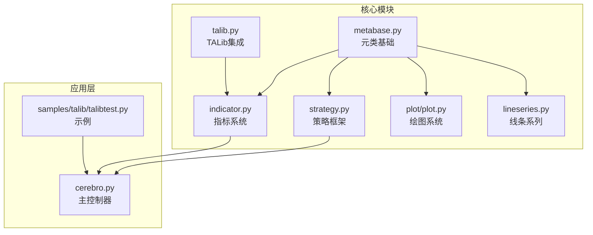
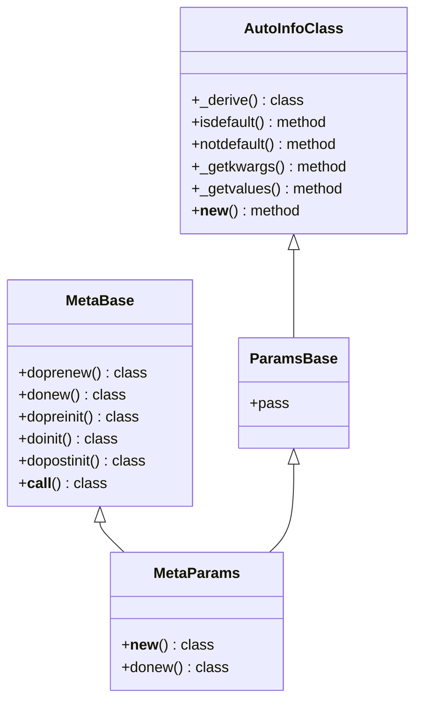
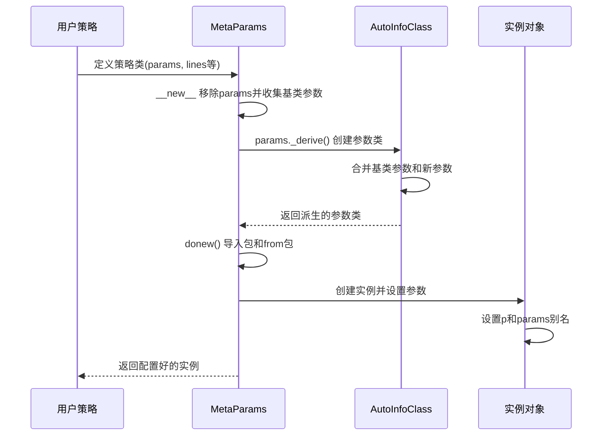
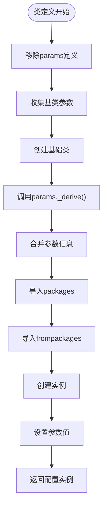
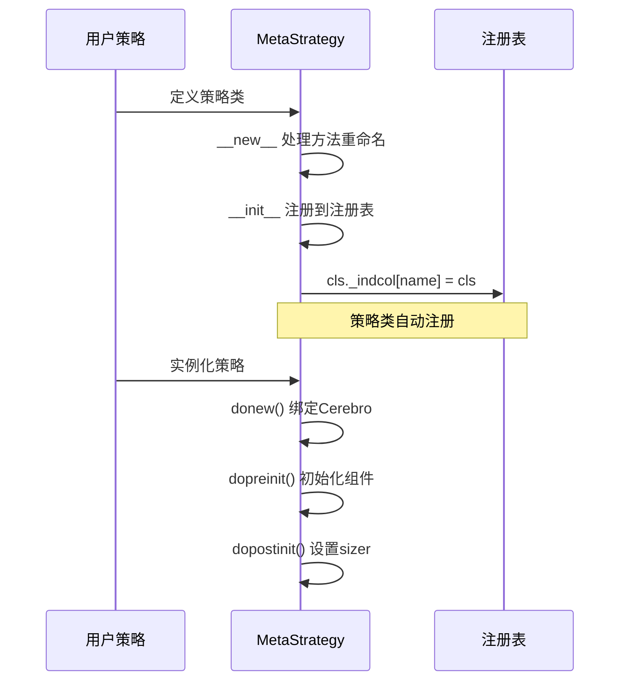
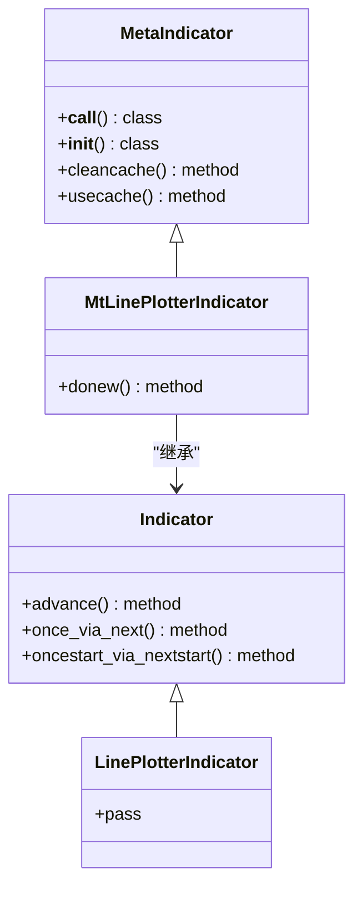
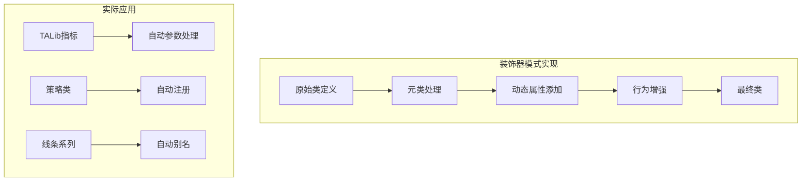
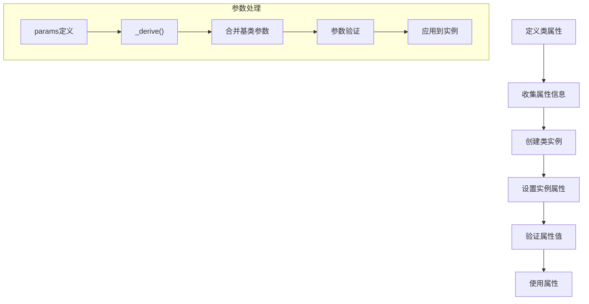
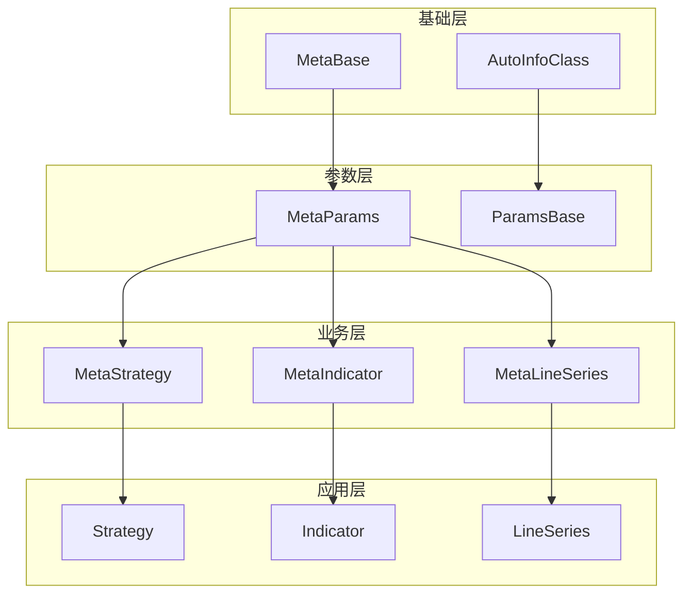

# 元编程与动态类创建

<cite>
**本文档引用的文件**
- [metabase.py](file://backtrader/metabase.py)
- [strategy.py](file://backtrader/strategy.py)
- [indicator.py](file://backtrader/indicator.py)
- [talib.py](file://backtrader/talib.py)
- [plot.py](file://backtrader/plot/plot.py)
- [lineseries.py](file://backtrader/lineseries.py)
- [cerebro.py](file://backtrader/cerebro.py)
- [talibtest.py](file://samples/talib/talibtest.py)
</cite>

## 目录
1. [引言](#引言)
2. [项目结构](#项目结构)
3. [核心组件](#核心组件)
4. [架构概览](#架构概览)
5. [详细组件分析](#详细组件分析)
6. [依赖关系分析](#依赖关系分析)
7. [性能考虑](#性能考虑)
8. [故障排除指南](#故障排除指南)
9. [结论](#结论)

## 引言

Backtrader是一个基于Python的量化交易回测框架，其核心特色在于强大的元编程和动态类创建能力。本文档深入分析了Backtrader中元类设计、装饰器模式应用以及动态类创建机制，重点涵盖：

- MetaParams元类的设计与实现
- 策略注册和实例化的动态过程
- 指标系统中参数的自动处理和验证
- 装饰器模式在策略开发中的应用
- 类属性和实例属性的管理机制
- 元编程对代码可维护性和扩展性的提升

## 项目结构

Backtrader采用模块化设计，核心功能分布在多个子模块中：

**图表来源**
- [metabase.py](file://backtrader/metabase.py#L66-L91)
- [strategy.py](file://backtrader/strategy.py#L43-L105)
- [indicator.py](file://backtrader/indicator.py#L32-L90)

**章节来源**
- [metabase.py](file://backtrader/metabase.py#L1-L332)
- [strategy.py](file://backtrader/strategy.py#L1-L800)

## 核心组件

### 元类基础架构

Backtrader的元编程核心建立在三个关键类之上：

1. **MetaBase**: 基础元类，定义了对象生命周期的标准化流程
2. **AutoInfoClass**: 自动参数处理类，提供参数的动态派生和验证
3. **MetaParams**: 参数化元类，实现参数的自动处理和类创建

**图表来源**
- [metabase.py](file://backtrader/metabase.py#L66-L91)
- [metabase.py](file://backtrader/metabase.py#L93-L201)
- [metabase.py](file://backtrader/metabase.py#L203-L294)

**章节来源**
- [metabase.py](file://backtrader/metabase.py#L66-L294)

## 架构概览

Backtrader的元编程架构通过以下层次实现：

**图表来源**
- [metabase.py](file://backtrader/metabase.py#L203-L294)

## 详细组件分析

### MetaParams元类设计

MetaParams是Backtrader元编程的核心，实现了参数化的类创建和继承机制：

#### 参数处理流程

**图表来源**
- [metabase.py](file://backtrader/metabase.py#L203-L294)

#### AutoInfoClass参数派生机制

AutoInfoClass提供了强大的参数派生能力：

1. **参数合并**: 支持从多个基类合并参数定义
2. **递归处理**: 支持嵌套参数类的递归派生
3. **唯一性保证**: 防止类名冲突，确保pickle兼容性

**章节来源**
- [metabase.py](file://backtrader/metabase.py#L93-L201)

### 策略注册和实例化

策略系统通过MetaStrategy实现动态注册和实例化：

#### 策略注册机制

**图表来源**
- [strategy.py](file://backtrader/strategy.py#L43-L105)

#### 策略实例化流程

策略实例化过程中，MetaStrategy负责：
- 自动绑定Cerebro环境
- 初始化交易组件（订单、交易、观察者等）
- 设置资金管理器

**章节来源**
- [strategy.py](file://backtrader/strategy.py#L43-L105)

### 指标系统中的元编程应用

指标系统广泛使用元编程来实现参数的自动处理和验证：

#### 指标参数处理

**图表来源**
- [indicator.py](file://backtrader/indicator.py#L32-L90)
- [indicator.py](file://backtrader/indicator.py#L139-L165)

#### TALib集成的动态类创建

TALib模块展示了元编程的高级应用：

**图表来源**
- [talib.py](file://backtrader/talib.py#L96-L185)

**章节来源**
- [indicator.py](file://backtrader/indicator.py#L32-L165)
- [talib.py](file://backtrader/talib.py#L65-L239)

### 装饰器模式的应用

虽然Backtrader主要使用元类而非传统装饰器，但其设计理念体现了装饰器模式的核心思想：

#### 动态属性装饰

**图表来源**
- [lineseries.py](file://backtrader/lineseries.py#L326-L404)

**章节来源**
- [lineseries.py](file://backtrader/lineseries.py#L305-L433)

### 类属性和实例属性管理

Backtrader通过AutoInfoClass实现了灵活的属性管理系统：

#### 属性管理机制

**图表来源**
- [metabase.py](file://backtrader/metabase.py#L98-L152)

**章节来源**
- [metabase.py](file://backtrader/metabase.py#L93-L201)

## 依赖关系分析

Backtrader的元编程架构形成了清晰的依赖层次：

**图表来源**
- [metabase.py](file://backtrader/metabase.py#L66-L91)
- [strategy.py](file://backtrader/strategy.py#L43-L105)
- [indicator.py](file://backtrader/indicator.py#L32-L90)
- [lineseries.py](file://backtrader/lineseries.py#L305-L404)

**章节来源**
- [metabase.py](file://backtrader/metabase.py#L66-L294)
- [strategy.py](file://backtrader/strategy.py#L43-L105)
- [indicator.py](file://backtrader/indicator.py#L32-L165)
- [lineseries.py](file://backtrader/lineseries.py#L305-L433)

## 性能考虑

Backtrader的元编程设计在性能方面有以下考量：

### 缓存机制
- 指标对象缓存：通过`MetaIndicator.usecache()`控制对象复用
- 参数派生缓存：避免重复的类创建开销

### 内存优化
- 条件内存保存：根据绘图需求调整内存使用
- 对象池化：减少频繁的对象创建销毁

### 执行效率
- 批量处理：支持向量化执行以提高性能
- 智能调度：根据数据可用性智能推进计算

## 故障排除指南

### 常见问题及解决方案

#### 参数冲突问题
**症状**: 参数继承导致的冲突或覆盖
**解决**: 使用AutoInfoClass的参数合并机制，确保正确处理基类参数

#### 类名冲突问题
**症状**: 动态创建类时的名称冲突
**解决**: AutoInfoClass的唯一性检查和自动重命名机制

#### 元类初始化顺序问题
**症状**: 对象生命周期中属性访问异常
**解决**: 确保遵循MetaBase定义的标准初始化流程

#### TALib集成问题
**症状**: TALib函数无法识别或参数不匹配
**解决**: 检查参数映射和输出标志的正确性

**章节来源**
- [metabase.py](file://backtrader/metabase.py#L98-L152)
- [talib.py](file://backtrader/talib.py#L71-L91)

## 结论

Backtrader的元编程和动态类创建机制展现了现代Python框架的强大能力：

### 主要优势
1. **高度可扩展性**: 通过元类实现的动态类创建允许轻松扩展新功能
2. **参数管理**: AutoInfoClass提供了强大的参数处理和验证机制
3. **自动注册**: 策略和指标的自动注册简化了用户开发流程
4. **灵活性**: 元编程允许在运行时动态修改类行为

### 设计亮点
- 清晰的分层架构，从基础元类到具体业务类
- 强大的参数处理机制，支持复杂的继承关系
- 智能的缓存和内存管理策略
- 完善的错误处理和调试支持

### 应用价值
Backtrader的元编程设计为量化交易开发提供了：
- 更简洁的API设计
- 更强的扩展能力
- 更好的代码组织结构
- 更高的开发效率

这种元编程实践为其他复杂系统的开发提供了宝贵的参考经验，特别是在需要高度动态性和可扩展性的领域中。