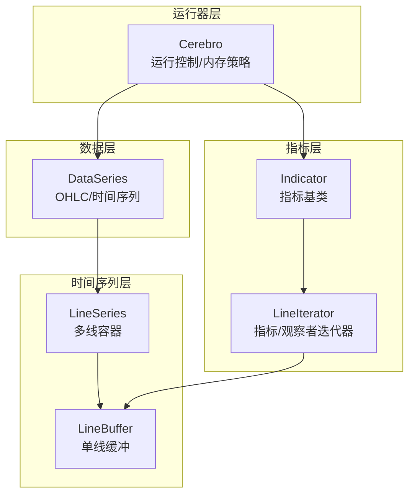
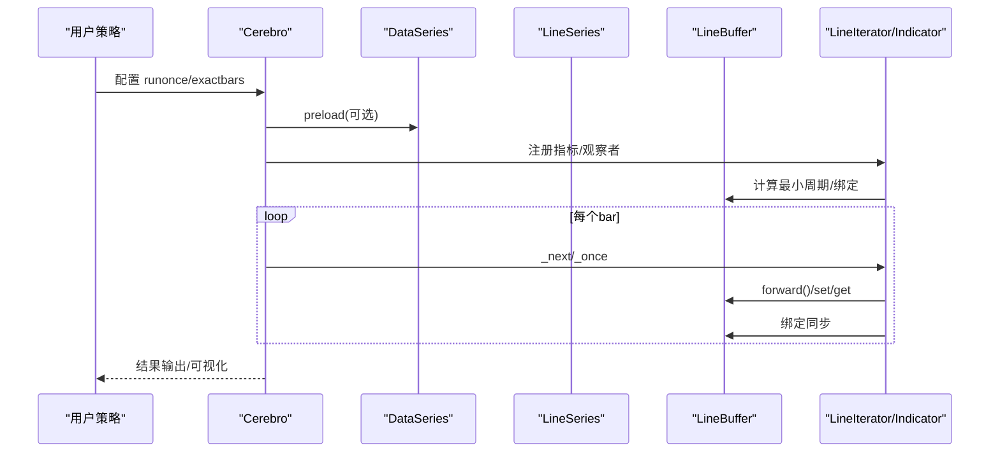
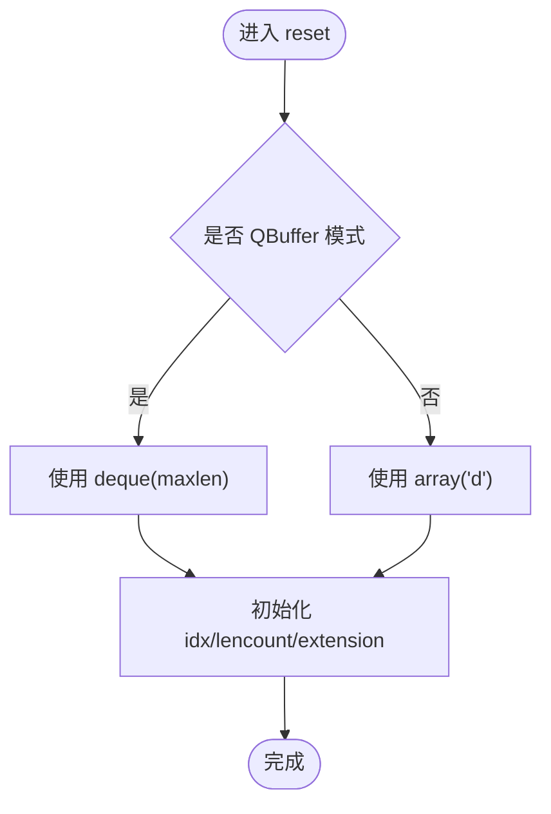
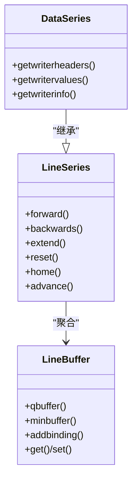
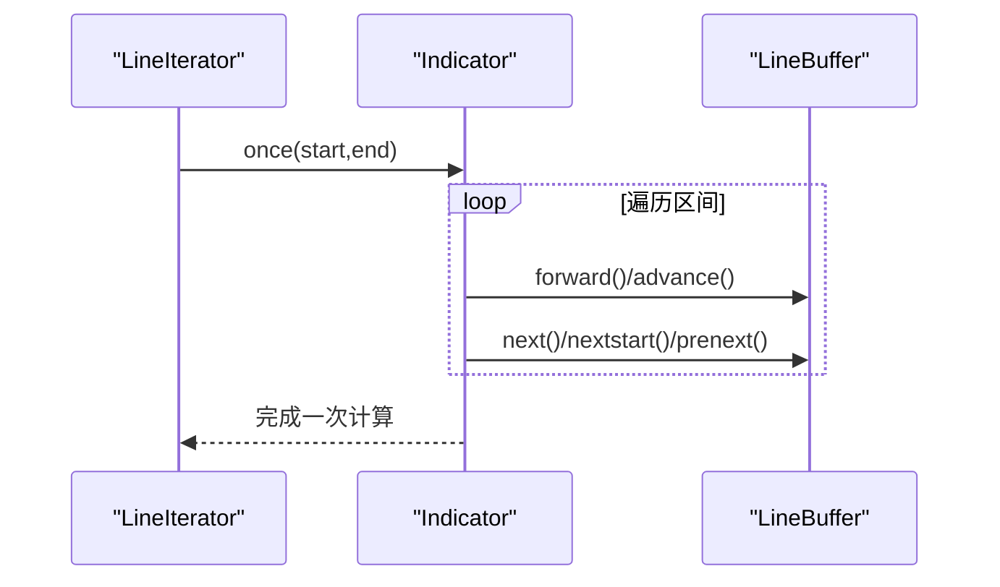
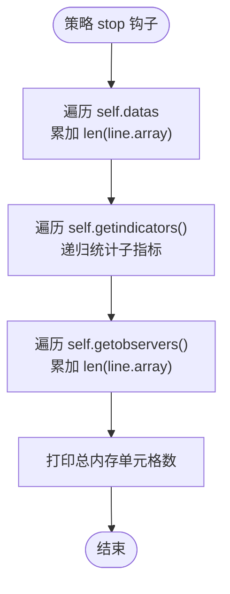
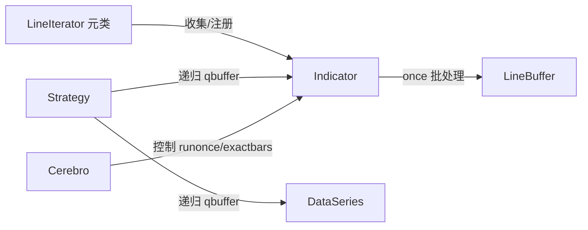

# 内存管理策略

<cite>
**本文档引用的文件**
- [backtrader/linebuffer.py](file://backtrader/linebuffer.py)
- [backtrader/lineseries.py](file://backtrader/lineseries.py)
- [backtrader/dataseries.py](file://backtrader/dataseries.py)
- [backtrader/cerebro.py](file://backtrader/cerebro.py)
- [backtrader/indicator.py](file://backtrader/indicator.py)
- [backtrader/strategy.py](file://backtrader/strategy.py)
- [backtrader/lineiterator.py](file://backtrader/lineiterator.py)
- [samples/memory-savings/memory-savings.py](file://samples/memory-savings/memory-savings.py)
- [backtrader/indicators/__init__.py](file://backtrader/indicators/__init__.py)
</cite>

## 目录
1. [简介](#简介)
2. [项目结构](#项目结构)
3. [核心组件](#核心组件)
4. [架构总览](#架构总览)
5. [详细组件分析](#详细组件分析)
6. [依赖关系分析](#依赖关系分析)
7. [性能考量](#性能考量)
8. [故障排除指南](#故障排除指南)
9. [结论](#结论)
10. [附录](#附录)

## 简介
本文件面向Backtrader在处理大规模历史数据时的内存管理策略，系统性阐述以下主题：
- exactbars 参数的多种模式及其适用场景
- LineBuffer 与 LineSeries 的内存管理机制（数组缓冲、指针移动、最小周期保障）
- 向量化计算与批处理对内存的影响
- 内存回收与垃圾收集策略（在长时间回测中防止内存泄漏）
- 大数据集处理的最佳实践（数据分块、延迟加载、缓存策略）
- 内存使用监控与诊断方法
- 不同数据类型与指标对内存消耗的影响
- 具体内存使用示例与性能对比思路

## 项目结构
Backtrader 的内存管理由多层协作实现：
- 数据层：DataSeries 提供 OHLC 等标准线集合
- 时间序列层：LineSeries 将多个 LineBuffer 组织为多线容器
- 指标层：Indicator 基于 LineIterator 进行事件驱动或一次性向量化计算
- 运行器层：Cerebro 控制运行模式（runonce、preload）与内存节省策略（exactbars）

图表来源
- [backtrader/dataseries.py](file://backtrader/dataseries.py#L60-L113)
- [backtrader/lineseries.py](file://backtrader/lineseries.py#L444-L574)
- [backtrader/linebuffer.py](file://backtrader/linebuffer.py#L50-L120)
- [backtrader/lineiterator.py](file://backtrader/lineiterator.py#L148-L200)
- [backtrader/indicator.py](file://backtrader/indicator.py#L90-L137)
- [backtrader/cerebro.py](file://backtrader/cerebro.py#L60-L294)

章节来源
- [backtrader/dataseries.py](file://backtrader/dataseries.py#L60-L113)
- [backtrader/lineseries.py](file://backtrader/lineseries.py#L444-L574)
- [backtrader/linebuffer.py](file://backtrader/linebuffer.py#L50-L120)
- [backtrader/lineiterator.py](file://backtrader/lineiterator.py#L148-L200)
- [backtrader/indicator.py](file://backtrader/indicator.py#L90-L137)
- [backtrader/cerebro.py](file://backtrader/cerebro.py#L60-L294)

## 核心组件
- LineBuffer：单线时间序列缓冲区，支持前移/后退/扩展/绑定；通过 QBuffer 模式限制最大长度以节省内存
- LineSeries：多线容器，代理前进/后退等操作到内部各 LineBuffer
- DataSeries：继承 LineSeries，定义 OHLC 等标准线顺序与写入接口
- Indicator/LineIterator：基于事件驱动或一次性遍历的指标框架，支持 runonce 向量化
- Cerebro：运行器，提供 exactbars 等内存节省开关与运行模式控制

章节来源
- [backtrader/linebuffer.py](file://backtrader/linebuffer.py#L50-L120)
- [backtrader/lineseries.py](file://backtrader/lineseries.py#L444-L574)
- [backtrader/dataseries.py](file://backtrader/dataseries.py#L60-L113)
- [backtrader/indicator.py](file://backtrader/indicator.py#L90-L137)
- [backtrader/lineiterator.py](file://backtrader/lineiterator.py#L148-L200)
- [backtrader/cerebro.py](file://backtrader/cerebro.py#L60-L294)

## 架构总览
Backtrader 在内存管理上的关键路径：
- 数据预加载与运行模式：Cerebro 控制 preload/runonce/exactbars
- 指标与观察者的最小周期：LineIterator 计算并传播最小周期
- 缓冲区模式切换：LineBuffer.qbuffer 切换 QBuffer 模式，限制 maxlen
- 批处理与向量化：Indicator.once 一次性遍历，减少循环开销
- 绑定与共享：LineBuffer.bindings 实现多线同步更新，避免重复存储

图表来源
- [backtrader/cerebro.py](file://backtrader/cerebro.py#L60-L294)
- [backtrader/lineiterator.py](file://backtrader/lineiterator.py#L148-L200)
- [backtrader/linebuffer.py](file://backtrader/linebuffer.py#L247-L356)

## 详细组件分析

### LineBuffer：最小周期与QBuffer模式
- 指针模型：idx 指向当前索引，正负索引分别访问过去/未来值
- QBuffer 模式：通过 maxlen 限制缓冲区大小，结合 extrasize 支持重采样/回放
- 最小缓冲保障：minbuffer 可动态扩大 maxlen，确保指标稳定运行
- 绑定机制：addbinding 将写入同步到其他 LineBuffer，避免重复存储
- 批处理访问：get/getzero 使用 islice 或切片，减少 Python 层开销

图表来源
- [backtrader/linebuffer.py](file://backtrader/linebuffer.py#L102-L126)

章节来源
- [backtrader/linebuffer.py](file://backtrader/linebuffer.py#L50-L120)
- [backtrader/linebuffer.py](file://backtrader/linebuffer.py#L121-L147)
- [backtrader/linebuffer.py](file://backtrader/linebuffer.py#L300-L356)

### LineSeries 与 DataSeries：多线容器与标准OHLC
- LineSeries：将多个 LineBuffer 聚合为 lines，统一前进/后退/扩展等操作
- DataSeries：定义标准线顺序（时间、开盘、最高、最低、收盘、成交量、持仓），提供写入接口
- 行别名与访问：通过 LineAlias 与派生类元类，支持按名称/索引访问行

图表来源
- [backtrader/lineseries.py](file://backtrader/lineseries.py#L444-L574)
- [backtrader/dataseries.py](file://backtrader/dataseries.py#L60-L113)
- [backtrader/linebuffer.py](file://backtrader/linebuffer.py#L50-L120)

章节来源
- [backtrader/lineseries.py](file://backtrader/lineseries.py#L84-L303)
- [backtrader/dataseries.py](file://backtrader/dataseries.py#L60-L113)

### 指标与向量化：runonce 与一次性遍历
- 事件驱动 next：逐条推进，适合实时/低内存占用
- 一次性遍历 once：Indicator.once_via_next/oncestart/preonce_via_prenext，批量处理提高吞吐
- 最小周期传播：LineIterator 元类扫描参数中的 LineRoot，计算并设置 _minperiod

图表来源
- [backtrader/lineiterator.py](file://backtrader/lineiterator.py#L148-L200)
- [backtrader/indicator.py](file://backtrader/indicator.py#L101-L137)

章节来源
- [backtrader/indicator.py](file://backtrader/indicator.py#L90-L137)
- [backtrader/lineiterator.py](file://backtrader/lineiterator.py#L148-L200)

### exactbars 参数详解与适用场景
- exactbars=True/1：所有 lines 对象仅保留自动计算的最小周期，强制禁用预加载与 runonce，禁用绘图
- exactbars=-1：数据与策略级指标/观察者保持全量，允许绘图与预加载，但禁用 runonce
- exactbars=-2：策略属性中声明的临时变量不保存全量，允许绘图与预加载，禁用 runonce
- 选择建议：
  - 大数据集+内存紧张：优先考虑 exactbars=1/-2
  - 需要绘图与快速回测：exactbars=-1
  - 需要完整历史可视化：exactbars=False

章节来源
- [backtrader/cerebro.py](file://backtrader/cerebro.py#L121-L162)

### 内存回收与垃圾收集策略
- QBuffer 模式：deque(maxlen) 自动丢弃超出长度的历史，降低峰值内存
- 绑定写入：通过 bindings 同步更新，避免复制多份相同数据
- runonce 关闭：在 exactbars 模式下关闭，减少中间对象创建
- 对象缓存：objcache/指标缓存可减少重复对象，但需谨慎使用以避免最小周期污染

章节来源
- [backtrader/linebuffer.py](file://backtrader/linebuffer.py#L105-L126)
- [backtrader/linebuffer.py](file://backtrader/linebuffer.py#L300-L356)
- [backtrader/cerebro.py](file://backtrader/cerebro.py#L163-L176)

### 大数据集处理最佳实践
- 数据分块：使用 DataSeries 的时间窗口化读取，避免一次性加载全部
- 延迟加载：启用 preload=False 并按需推进
- 缓存策略：合理使用指标缓存与对象缓存，避免重复计算
- 指标裁剪：将不需要绘图的指标设置 plotinfo.plot=False，配合 -2 模式进一步节省内存

章节来源
- [backtrader/cerebro.py](file://backtrader/cerebro.py#L63-L80)
- [backtrader/strategy.py](file://backtrader/strategy.py#L120-L154)

### 内存使用监控与诊断
- 样例脚本：memory-savings.py 展示如何统计每个数据/指标/观察者的单元格数量
- 统计方法：在 stop 中遍历 self.datas/self.getindicators()/self.getobservers()，累加 len(line.array)
- 输出格式：打印每项总单元格数与每行单元格数，便于对比不同配置下的内存占用

图表来源
- [samples/memory-savings/memory-savings.py](file://samples/memory-savings/memory-savings.py#L69-L121)

章节来源
- [samples/memory-savings/memory-savings.py](file://samples/memory-savings/memory-savings.py#L69-L121)

### 不同数据类型与指标对内存的影响
- 数据类型：OHLC/时间戳/成交量等标准线越多，每条 bar 占用单元格越多
- 指标复杂度：移动平均、MACD、RSI 等需要额外缓冲，内存与计算开销随周期增大而增加
- 指标组合：子指标（如 RSI 内部 UpDay）会叠加内存占用，应尽量复用或裁剪

章节来源
- [backtrader/dataseries.py](file://backtrader/dataseries.py#L67-L69)
- [backtrader/indicators/__init__.py](file://backtrader/indicators/__init__.py#L30-L91)

## 依赖关系分析
- LineIterator 元类负责收集数据源、计算最小周期并注册到所有者
- Indicator 基类在 once 模式下批量推进，减少循环次数
- Strategy.qbuffer 递归调用 qbuffer，使数据与指标按策略粒度节省内存

图表来源
- [backtrader/lineiterator.py](file://backtrader/lineiterator.py#L38-L146)
- [backtrader/indicator.py](file://backtrader/indicator.py#L90-L137)
- [backtrader/strategy.py](file://backtrader/strategy.py#L120-L154)
- [backtrader/cerebro.py](file://backtrader/cerebro.py#L60-L294)

章节来源
- [backtrader/lineiterator.py](file://backtrader/lineiterator.py#L38-L146)
- [backtrader/indicator.py](file://backtrader/indicator.py#L90-L137)
- [backtrader/strategy.py](file://backtrader/strategy.py#L120-L154)
- [backtrader/cerebro.py](file://backtrader/cerebro.py#L60-L294)

## 性能考量
- 向量化优势：runonce=True 时，Indicator.once 批量遍历，显著减少 Python 循环开销
- 内存节省：QBuffer 模式与 exactbars 设置可将峰值内存降至最小必要水平
- I/O 与解析：preload=True 可减少多次磁盘/网络访问，但会增加峰值内存
- 绘图成本：绘图开启会保留全量数据，exactbars=-1/-2 仍可保留部分全量以满足绘图需求

## 故障排除指南
- 内存泄漏排查：确认是否启用了 QBuffer 模式；检查是否存在未释放的自定义大对象
- 绘图异常：若启用绘图却出现内存不足，尝试 exactbars=-1 或关闭部分指标绘图
- 指标报错“缓冲不足”：调用 minbuffer(size) 或增大 _minperiod，确保指标稳定运行
- runonce 导致结果差异：在需要严格事件驱动的场景下，关闭 runonce 并使用 exactbars=1

章节来源
- [backtrader/linebuffer.py](file://backtrader/linebuffer.py#L131-L147)
- [backtrader/cerebro.py](file://backtrader/cerebro.py#L121-L162)

## 结论
Backtrader 的内存管理通过“最小周期保障 + QBuffer 模式 + runonce 向量化 + 绑定同步”的组合，在保证计算正确性的前提下，最大化降低内存峰值与提升吞吐。exactbars 参数提供了灵活的内存-功能平衡点，配合数据分块、延迟加载与缓存策略，可在超大规模历史数据场景下实现稳定高效的回测。

## 附录
- 示例与对比思路：使用 memory-savings.py 的统计方法，对比不同 exactbars 模式下的总内存单元格数，评估不同指标组合的内存开销
- 参数建议清单：
  - 内存极度紧张：exactbars=1
  - 需要绘图：exactbars=-1
  - 需要完整历史可视化：exactbars=False
  - 指标过多：将 plotinfo.plot=False 的指标配合 -2 模式裁剪