# 核心架构

<cite>
**本文档引用的文件**
- [backtrader/__init__.py](file://backtrader/__init__.py)
- [backtrader/cerebro.py](file://backtrader/cerebro.py)
- [backtrader/strategy.py](file://backtrader/strategy.py)
- [backtrader/metabase.py](file://backtrader/metabase.py)
- [backtrader/feed.py](file://backtrader/feed.py)
- [backtrader/indicator.py](file://backtrader/indicator.py)
- [backtrader/analyzer.py](file://backtrader/analyzer.py)
- [backtrader/broker.py](file://backtrader/broker.py)
- [backtrader/observer.py](file://backtrader/observer.py)
- [backtrader/sizer.py](file://backtrader/sizer.py)
- [backtrader/timer.py](file://backtrader/timer.py)
- [backtrader/lineiterator.py](file://backtrader/lineiterator.py)
- [backtrader/lineseries.py](file://backtrader/lineseries.py)
</cite>

## 目录
1. [引言](#引言)
2. [项目结构](#项目结构)
3. [核心组件](#核心组件)
4. [架构总览](#架构总览)
5. [详细组件分析](#详细组件分析)
6. [依赖关系分析](#依赖关系分析)
7. [性能考虑](#性能考虑)
8. [故障排除指南](#故障排除指南)
9. [结论](#结论)

## 引言
本文件面向Backtrader核心架构，系统性解析事件驱动交易回测框架的设计与实现。重点涵盖：
- 事件驱动架构：时间序列数据流、策略执行、订单处理的完整链路
- Cerebro引擎：作为中央协调器，管理策略、数据、指标、分析器、观察者等组件的交互
- 元类设计模式：动态类创建与策略注册机制
- 数据流与控制流：从数据加载到策略执行再到结果输出的端到端流程
- 组件间依赖与接口设计：Strategy、Indicator、Broker、Analyzer等协作方式
- 架构图表与关系图，帮助开发者快速理解系统整体结构

## 项目结构
Backtrader采用模块化分层设计，围绕“数据-指标-策略-观察者-分析器-经纪人”的流水线展开。核心入口通过`backtrader/__init__.py`统一导出，Cerebro作为顶层协调器贯穿整个生命周期。

**图表来源**
- [backtrader/__init__.py](file://backtrader/__init__.py#L24-L91)
- [backtrader/cerebro.py](file://backtrader/cerebro.py#L60-L320)
- [backtrader/feed.py](file://backtrader/feed.py#L122-L200)
- [backtrader/strategy.py](file://backtrader/strategy.py#L107-L120)
- [backtrader/indicator.py](file://backtrader/indicator.py#L90-L100)
- [backtrader/analyzer.py](file://backtrader/analyzer.py#L89-L140)
- [backtrader/observer.py](file://backtrader/observer.py#L46-L69)
- [backtrader/broker.py](file://backtrader/broker.py#L49-L68)
- [backtrader/sizer.py](file://backtrader/sizer.py#L29-L50)
- [backtrader/timer.py](file://backtrader/timer.py#L42-L60)
- [backtrader/lineiterator.py](file://backtrader/lineiterator.py#L148-L170)
- [backtrader/lineseries.py](file://backtrader/lineseries.py#L444-L450)
- [backtrader/metabase.py](file://backtrader/metabase.py#L66-L91)

**章节来源**
- [backtrader/__init__.py](file://backtrader/__init__.py#L24-L91)

## 核心组件
- Cerebro引擎：全局协调器，负责数据加载、策略执行、指标计算、观察者与分析器推进、订单提交与通知、定时器调度、内存优化等。
- Strategy（策略）：用户扩展点，定义交易逻辑；通过元类自动注入环境、默认观察者/分析器集合、定时器注册等。
- Indicator（指标）：基于LineIterator的可复用技术指标，支持向量化与事件驱动两种模式。
- Analyzer（分析器）：在策略生命周期内收集统计信息，支持父子树形结构与通知转发。
- Observer（观察者）：可视化与状态监控，可绑定子分析器。
- Broker（经纪人）：抽象订单提交、成交执行、资金与头寸管理。
- Sizer（规模器）：根据策略与经纪人上下文决定下单数量。
- Timer（定时器）：跨数据源的会话级定时触发。
- LineIterator/LineSeries：行迭代器与行系列，提供最小周期计算、行绑定、缓冲区管理等基础设施。
- MetaBase/MetaParams：元类与参数系统，支持动态类创建、参数派生与导入。

**章节来源**
- [backtrader/cerebro.py](file://backtrader/cerebro.py#L60-L320)
- [backtrader/strategy.py](file://backtrader/strategy.py#L107-L120)
- [backtrader/indicator.py](file://backtrader/indicator.py#L90-L100)
- [backtrader/analyzer.py](file://backtrader/analyzer.py#L89-L140)
- [backtrader/observer.py](file://backtrader/observer.py#L46-L69)
- [backtrader/broker.py](file://backtrader/broker.py#L49-L68)
- [backtrader/sizer.py](file://backtrader/sizer.py#L29-L50)
- [backtrader/timer.py](file://backtrader/timer.py#L42-L60)
- [backtrader/lineiterator.py](file://backtrader/lineiterator.py#L148-L170)
- [backtrader/lineseries.py](file://backtrader/lineseries.py#L444-L450)
- [backtrader/metabase.py](file://backtrader/metabase.py#L66-L91)

## 架构总览
Backtrader采用事件驱动与向量化混合架构：
- 事件驱动：策略、指标、观察者、分析器按最小周期推进，遵循“先预计算再主循环”的模式。
- 向量化加速：在允许的情况下，指标一次性批量计算，提升性能。
- 时间同步：多数据源不同步时，以主数据源为时钟，其他数据源进行对齐或延迟填充。
- 订单执行：策略通过Broker提交订单，Broker与外部市场/模拟器交互，产生通知回传给策略与分析器。

**图表来源**
- [backtrader/cerebro.py](file://backtrader/cerebro.py#L296-L320)
- [backtrader/feed.py](file://backtrader/feed.py#L400-L437)
- [backtrader/strategy.py](file://backtrader/strategy.py#L346-L354)
- [backtrader/analyzer.py](file://backtrader/analyzer.py#L148-L201)
- [backtrader/observer.py](file://backtrader/observer.py#L61-L69)
- [backtrader/broker.py](file://backtrader/broker.py#L145-L163)

## 详细组件分析

### Cerebro引擎：中央协调器
- 职责：管理数据源、策略、指标、观察者、分析器、定时器、内存优化、通知回调等。
- 关键能力：
  - 数据管理：add_data、chaindata、rolloverdata、预加载与回放/重采样。
  - 策略管理：add_strategy、默认观察者(stdstats)、定时器注册。
  - 指标/观察者/分析器注册：add_indicator、add_observer、add_analyzer。
  - 内存优化：exactbars、runonce、objcache、qbuffer。
  - 通知系统：store/data回调、定时器通知。
- 参数体系：preload、runonce、live、maxcpus、stdstats、oldbuysell、oldtrades、exactbars、optdatas/optreturn、tz、cheat_on_open、broker_coo、quicknotify等。

**图表来源**
- [backtrader/cerebro.py](file://backtrader/cerebro.py#L60-L320)
- [backtrader/feed.py](file://backtrader/feed.py#L122-L200)
- [backtrader/strategy.py](file://backtrader/strategy.py#L393-L418)
- [backtrader/indicator.py](file://backtrader/indicator.py#L90-L100)
- [backtrader/observer.py](file://backtrader/observer.py#L46-L69)
- [backtrader/analyzer.py](file://backtrader/analyzer.py#L89-L140)
- [backtrader/broker.py](file://backtrader/broker.py#L49-L68)

**章节来源**
- [backtrader/cerebro.py](file://backtrader/cerebro.py#L60-L320)

### 策略系统：事件驱动与生命周期
- 生命周期：start → (prenext)* → nextstart → (next)+ → stop
- 最小周期：_periodset根据数据与指标的最小周期确定策略的“就绪”状态。
- 通知：notify_order、notify_trade、notify_cashvalue、notify_fund、notify_store、notify_data。
- 定时器：add_timer支持会话开始/结束、周/月日过滤、偏移与重复。
- 订单：buy/sell/cancel，结合Sizer与Broker完成下单与成交。

**图表来源**
- [backtrader/strategy.py](file://backtrader/strategy.py#L155-L216)
- [backtrader/strategy.py](file://backtrader/strategy.py#L292-L320)
- [backtrader/strategy.py](file://backtrader/strategy.py#L346-L354)

**章节来源**
- [backtrader/strategy.py](file://backtrader/strategy.py#L155-L216)
- [backtrader/strategy.py](file://backtrader/strategy.py#L292-L354)

### 指标系统：最小周期与行迭代
- 行迭代器：LineIterator负责最小周期计算、时钟同步、事件推进。
- 指标基类：Indicator继承LineIterator，提供advance、once_via_next等通用实现。
- 行系列与别名：Lines提供动态派生行、别名访问、plotinfo/plotlines配置。
- 元类：MetaIndicator支持对象缓存、方法覆盖检测与once仿真。

**图表来源**
- [backtrader/lineiterator.py](file://backtrader/lineiterator.py#L148-L170)
- [backtrader/indicator.py](file://backtrader/indicator.py#L90-L100)
- [backtrader/lineseries.py](file://backtrader/lineseries.py#L84-L180)
- [backtrader/metabase.py](file://backtrader/metabase.py#L32-L44)

**章节来源**
- [backtrader/lineiterator.py](file://backtrader/lineiterator.py#L148-L170)
- [backtrader/indicator.py](file://backtrader/indicator.py#L90-L100)
- [backtrader/lineseries.py](file://backtrader/lineseries.py#L84-L180)
- [backtrader/metabase.py](file://backtrader/metabase.py#L32-L44)

### 分析器系统：通知转发与时间窗口
- 通知转发：Analyzer通过_prenext/_next/_start/_stop等方法将通知传递给子分析器。
- 时间窗口：TimeFrameAnalyzerBase按年/月/周/日/分钟/秒等粒度触发on_dt_over。
- 结果输出：get_analysis返回字典式结果，支持print/pprint输出。

**图表来源**
- [backtrader/analyzer.py](file://backtrader/analyzer.py#L148-L201)
- [backtrader/analyzer.py](file://backtrader/analyzer.py#L307-L344)

**章节来源**
- [backtrader/analyzer.py](file://backtrader/analyzer.py#L148-L201)
- [backtrader/analyzer.py](file://backtrader/analyzer.py#L307-L344)

### 观察者系统：可视化与状态监控
- 观察者基类：Observer继承LineIterator，支持策略级时钟与子分析器注册。
- 默认行为：prenext默认调用next，确保持续监控。
- 与分析器协作：通过_register_analyzer将子分析器挂接到观察者树。

**章节来源**
- [backtrader/observer.py](file://backtrader/observer.py#L46-L69)

### 经纪人与订单处理
- 抽象接口：BrokerBase定义getcash/getvalue/getposition/submit/cancel等。
- 委托模型：支持佣金方案、资金模式、头寸管理。
- 订单历史：支持添加历史订单与资金序列，用于性能评估。

**章节来源**
- [backtrader/broker.py](file://backtrader/broker.py#L49-L68)

### 尺度器与头寸管理
- Sizer基类：getsizing根据comminfo、cash、data与isbuy计算下单数量。
- 与策略/经纪人集成：set(strategy, broker)注入上下文。

**章节来源**
- [backtrader/sizer.py](file://backtrader/sizer.py#L29-L50)

### 定时器系统：跨数据源调度
- Timer：支持会话开始/结束、周/月日过滤、偏移与重复、时区转换。
- 与Cerebro/策略：Cerebro._add_timer与Strategy.add_timer统一调度。

**章节来源**
- [backtrader/timer.py](file://backtrader/timer.py#L42-L60)
- [backtrader/timer.py](file://backtrader/timer.py#L150-L226)

### 数据流与控制流：从加载到输出
- 数据加载：AbstractDataBase.load/next/preload，支持过滤器栈与时间本地化。
- 多数据源同步：LineIterator._clk_update与advance_peek确保不同步数据对齐。
- 控制流：Cerebro推进策略与指标，触发通知与绘图。

```mermaid
flowchart TD
Load["数据加载(load)"] --> Filter["过滤器栈处理"]
Filter --> Align["多数据源对齐(advance_peek/advance)"]
Align --> Push["推进策略与指标(_next/_once)"]
Push --> Notify["通知(订单/交易/现金)"]
Notify --> Plot["观察者绘制"]
Plot --> Output["分析器统计与输出"]
```

**图表来源**
- [backtrader/feed.py](file://backtrader/feed.py#L471-L536)
- [backtrader/lineiterator.py](file://backtrader/lineiterator.py#L286-L292)
- [backtrader/analyzer.py](file://backtrader/analyzer.py#L255-L268)

**章节来源**
- [backtrader/feed.py](file://backtrader/feed.py#L471-L536)
- [backtrader/lineiterator.py](file://backtrader/lineiterator.py#L286-L292)
- [backtrader/analyzer.py](file://backtrader/analyzer.py#L255-L268)

## 依赖关系分析
- 组件耦合：
  - Cerebro与Strategy/Indicator/Observer/Analyzer强耦合，负责生命周期推进与通知转发。
  - Strategy与Broker/Sizer紧密耦合，通过策略接口提交订单。
  - Indicator与LineIterator/LineSeries高度耦合，依赖行别名与最小周期。
  - DataFeed与Filter链耦合，支持Resampler/Replayer等重采样/回放。
- 元类与参数系统：
  - MetaParams/MetaBase提供参数派生、包导入、实例化钩子，支撑动态类创建与策略注册。
  - MetaStrategy/MetaIndicator/MetaObserver/MetaAnalyzer分别在策略、指标、观察者、分析器层面注入环境与生命周期钩子。

**图表来源**
- [backtrader/metabase.py](file://backtrader/metabase.py#L66-L91)
- [backtrader/metabase.py](file://backtrader/metabase.py#L203-L242)
- [backtrader/strategy.py](file://backtrader/strategy.py#L43-L76)
- [backtrader/indicator.py](file://backtrader/indicator.py#L32-L78)
- [backtrader/observer.py](file://backtrader/observer.py#L29-L44)
- [backtrader/analyzer.py](file://backtrader/analyzer.py#L34-L87)
- [backtrader/cerebro.py](file://backtrader/cerebro.py#L60-L320)

**章节来源**
- [backtrader/metabase.py](file://backtrader/metabase.py#L66-L91)
- [backtrader/metabase.py](file://backtrader/metabase.py#L203-L242)
- [backtrader/strategy.py](file://backtrader/strategy.py#L43-L76)
- [backtrader/indicator.py](file://backtrader/indicator.py#L32-L78)
- [backtrader/observer.py](file://backtrader/observer.py#L29-L44)
- [backtrader/analyzer.py](file://backtrader/analyzer.py#L34-L87)
- [backtrader/cerebro.py](file://backtrader/cerebro.py#L60-L320)

## 性能考虑
- 向量化加速：runonce=True时，指标一次性批量计算，显著降低循环开销。
- 内存优化：exactbars、qbuffer、objcache等选项在精度与性能之间权衡。
- 预加载：preload=True减少I/O等待，但占用更多内存。
- 多核优化：maxcpus控制并行优化任务数。
- 通知延迟：quicknotify影响通知传递时机，Live场景下可减少延迟。

[本节为通用指导，无需特定文件引用]

## 故障排除指南
- 数据未就绪：检查策略最小周期计算与数据预加载，确认所有依赖指标已满足最小周期。
- 订单未成交：检查Broker实现、佣金设置、资金与头寸限制。
- 通知缺失：确认Cerebro._notify_data/_notify_store回调是否正确注册。
- 多数据源不同步：使用advance_peek/advance对齐，或调整时区与会话时间。
- 定时器不触发：检查when/offset/weekdays/monthdays/allow/tzdata配置。

**章节来源**
- [backtrader/strategy.py](file://backtrader/strategy.py#L503-L614)
- [backtrader/cerebro.py](file://backtrader/cerebro.py#L702-L750)
- [backtrader/feed.py](file://backtrader/feed.py#L375-L437)
- [backtrader/timer.py](file://backtrader/timer.py#L150-L226)

## 结论
Backtrader通过Cerebro这一中央协调器，将数据、策略、指标、观察者、分析器与经纪人有机整合，形成清晰的事件驱动与向量化混合架构。元类与参数系统提供了强大的动态扩展能力，使策略注册、参数派生与类创建变得简洁而灵活。该架构在保证可扩展性的同时，兼顾了性能与易用性，适合构建复杂且高性能的量化交易回测系统。