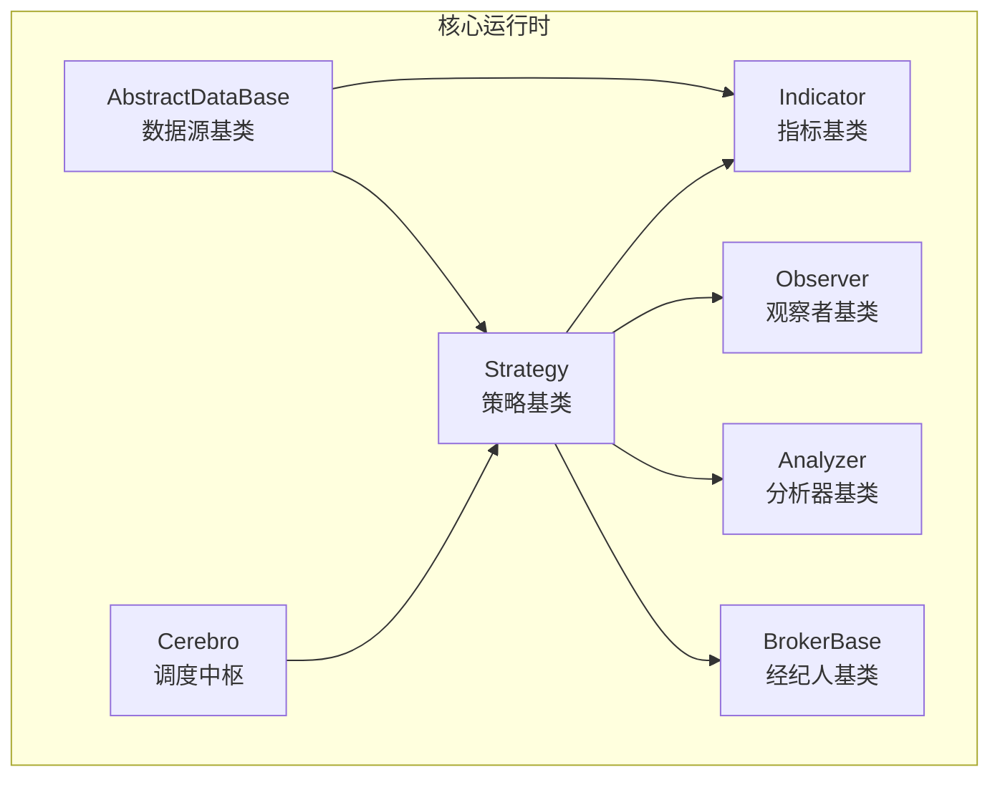
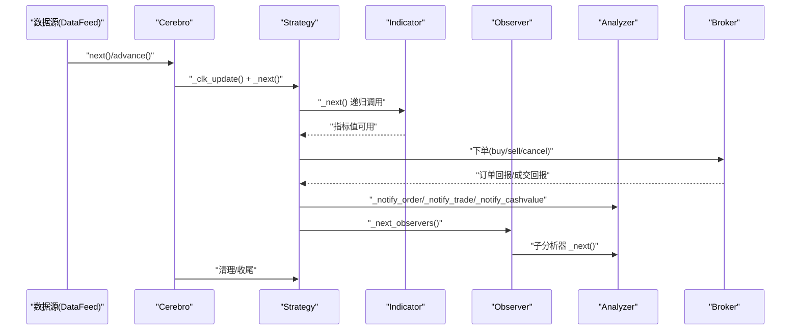
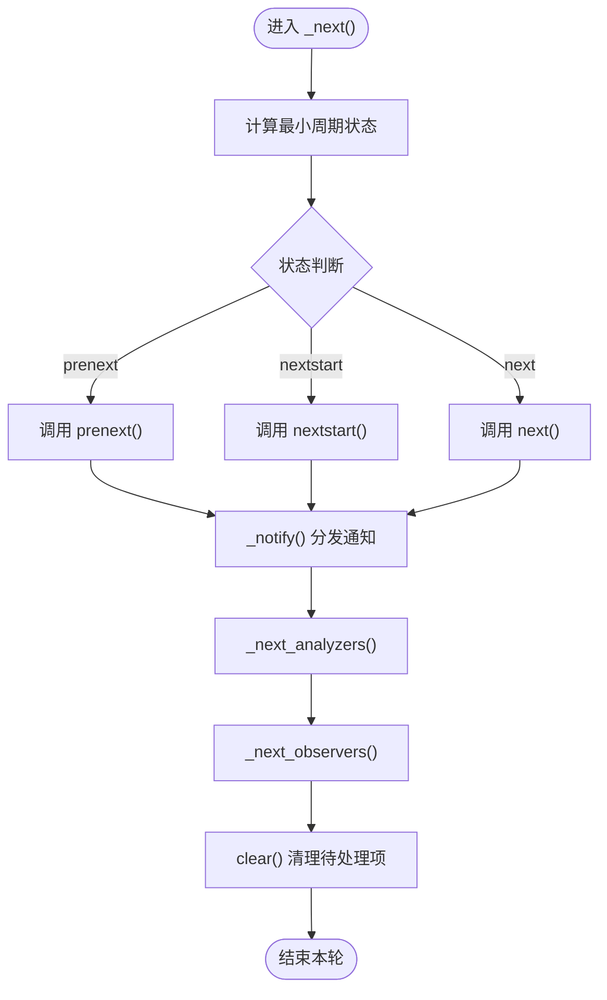
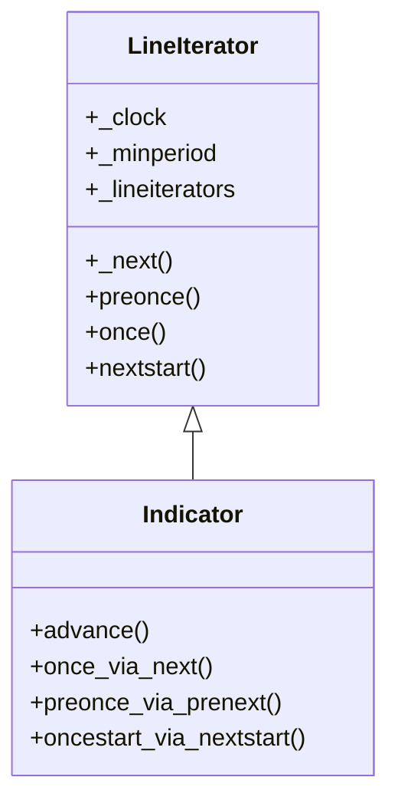
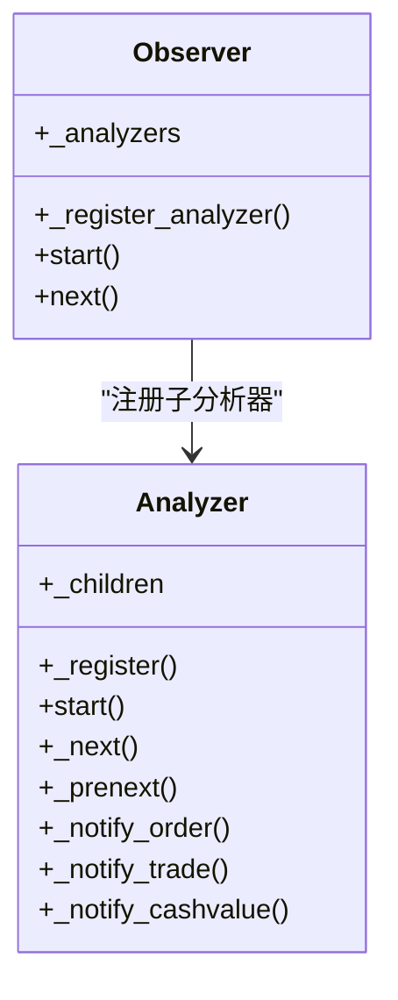
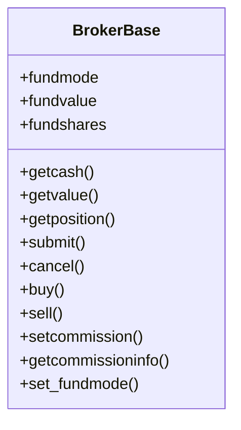
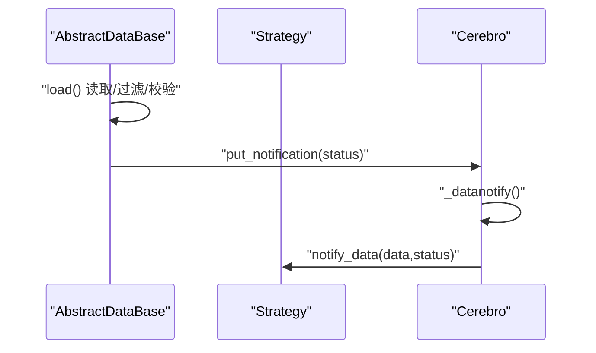
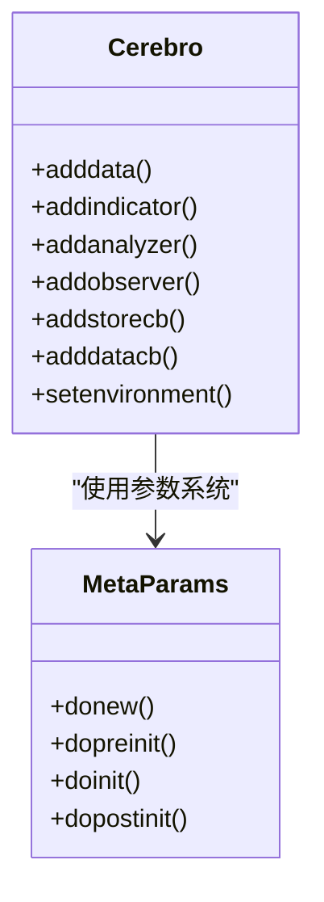
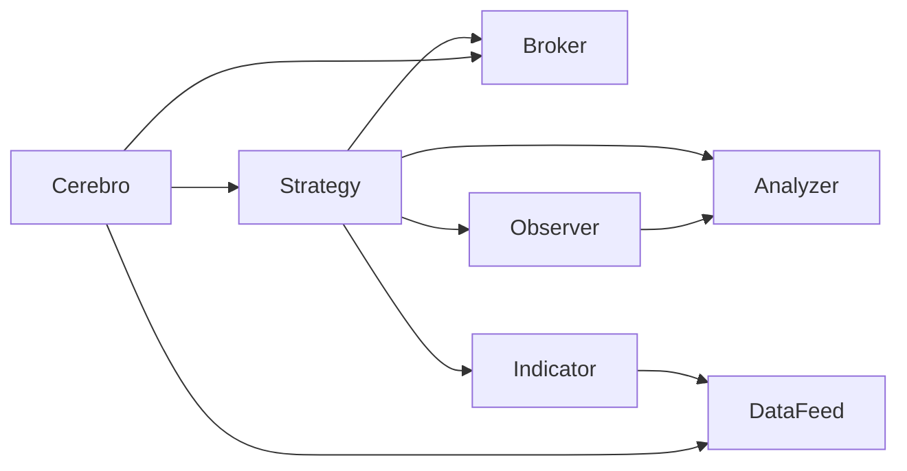

# 组件交互机制

<cite>
**本文档引用的文件**
- [backtrader/__init__.py](file://backtrader/__init__.py)
- [backtrader/cerebro.py](file://backtrader/cerebro.py)
- [backtrader/strategy.py](file://backtrader/strategy.py)
- [backtrader/indicator.py](file://backtrader/indicator.py)
- [backtrader/broker.py](file://backtrader/broker.py)
- [backtrader/analyzer.py](file://backtrader/analyzer.py)
- [backtrader/observer.py](file://backtrader/observer.py)
- [backtrader/feed.py](file://backtrader/feed.py)
- [backtrader/lineiterator.py](file://backtrader/lineiterator.py)
- [backtrader/metabase.py](file://backtrader/metabase.py)
- [backtrader/strategies/sma_crossover.py](file://backtrader/strategies/sma_crossover.py)
- [backtrader/analyzers/__init__.py](file://backtrader/analyzers/__init__.py)
- [backtrader/observers/__init__.py](file://backtrader/observers/__init__.py)
- [backtrader/feeds/__init__.py](file://backtrader/feeds/__init__.py)
</cite>

## 目录
1. [引言](#引言)
2. [项目结构](#项目结构)
3. [核心组件](#核心组件)
4. [架构总览](#架构总览)
5. [详细组件分析](#详细组件分析)
6. [依赖关系分析](#依赖关系分析)
7. [性能考虑](#性能考虑)
8. [故障排除指南](#故障排除指南)
9. [结论](#结论)

## 引言
本文件系统性梳理 Backtrader 的组件交互机制，重点阐释 Strategy、Indicator、Broker、Analyzer、Observer 等核心组件的协作关系与接口设计，说明如何通过统一接口实现松耦合通信；描述从数据源到策略再到分析器的数据流路径；分析组件生命周期（初始化、注册、执行、清理）；讨论同步与异步处理策略；并提供 UML 序列图与组件关系图，辅以具体代码示例路径帮助读者快速定位实现细节。

## 项目结构
Backtrader 采用模块化分层组织：顶层 cerebro 作为调度中枢，策略 Strategy 作为业务入口，Indicator 提供技术指标计算，Observer 负责可视化与统计观察，Analyzer 执行分析任务，Broker 管理订单与资金，Feed 提供数据源接入。各模块通过元类与统一基类实现松耦合扩展。

**图表来源**
- [backtrader/cerebro.py](file://backtrader/cerebro.py#L60-L320)
- [backtrader/strategy.py](file://backtrader/strategy.py#L107-L120)
- [backtrader/indicator.py](file://backtrader/indicator.py#L90-L100)
- [backtrader/observer.py](file://backtrader/observer.py#L46-L69)
- [backtrader/analyzer.py](file://backtrader/analyzer.py#L89-L138)
- [backtrader/broker.py](file://backtrader/broker.py#L49-L67)
- [backtrader/feed.py](file://backtrader/feed.py#L122-L140)

**章节来源**
- [backtrader/__init__.py](file://backtrader/__init__.py#L24-L82)
- [backtrader/cerebro.py](file://backtrader/cerebro.py#L296-L320)

## 核心组件
- Cerebro：全局调度器，负责注册数据源、策略、指标、观察者、分析器、写入器、定时器等，协调运行模式（预加载、向量化运行等），并驱动主循环。
- Strategy：策略基类，定义 next/prenext/nextstart 生命周期方法，持有 broker、sizer、analyzers、observers 等集合，负责下单与通知分发。
- Indicator：指标基类，支持向量化一次性计算（once）与事件驱动逐条推进（next），自动维护最小周期与多数据时钟同步。
- Observer：观察者基类，用于记录与展示（如交易、现金价值、买卖信号等），可挂载子 Analyzer 并在合适时机接收通知。
- Analyzer：分析器基类，按策略生命周期回调（prenext/nextstart/next/start/stop），可嵌套子分析器，支持时间窗粒度分析。
- BrokerBase：经纪人基类，抽象订单提交、取消、成交回报、资金查询等接口，支持佣金配置与资金模式。
- AbstractDataBase：数据源基类，封装数据加载、过滤、重采样/回放、通知队列等，支持多时区与会话控制。

**章节来源**
- [backtrader/cerebro.py](file://backtrader/cerebro.py#L274-L294)
- [backtrader/strategy.py](file://backtrader/strategy.py#L107-L120)
- [backtrader/indicator.py](file://backtrader/indicator.py#L90-L100)
- [backtrader/observer.py](file://backtrader/observer.py#L46-L69)
- [backtrader/analyzer.py](file://backtrader/analyzer.py#L89-L138)
- [backtrader/broker.py](file://backtrader/broker.py#L49-L67)
- [backtrader/feed.py](file://backtrader/feed.py#L122-L140)

## 架构总览
Backtrader 的运行时由 Cerebro 驱动，数据源（Feed）产生 bar，策略根据指标信号下单，经纪人执行订单并返回回报，观察者与分析器分别进行可视化与统计分析，最终写入器输出结果。

**图表来源**
- [backtrader/cerebro.py](file://backtrader/cerebro.py#L320-L420)
- [backtrader/strategy.py](file://backtrader/strategy.py#L346-L354)
- [backtrader/indicator.py](file://backtrader/indicator.py#L95-L100)
- [backtrader/analyzer.py](file://backtrader/analyzer.py#L148-L177)
- [backtrader/observer.py](file://backtrader/observer.py#L61-L62)

## 详细组件分析

### Strategy 生命周期与通知机制
- 初始化：元类 MetaStrategy 在实例化后绑定 cerebro、broker、默认 sizer，并建立 analyzers/observers 容器。
- 启动：_start() 计算最小周期，启动内置分析器与观察者，进入 start()。
- 运行：_next() 基于最小周期状态（prenext/nextstart/next）驱动策略逻辑；_notify() 分发订单、交易、现金/资产通知给所有分析器。
- 清理：_stop() 调用 stop() 并停止分析器与观察者。

**图表来源**
- [backtrader/strategy.py](file://backtrader/strategy.py#L346-L354)
- [backtrader/strategy.py](file://backtrader/strategy.py#L381-L389)
- [backtrader/strategy.py](file://backtrader/strategy.py#L355-L380)

**章节来源**
- [backtrader/strategy.py](file://backtrader/strategy.py#L77-L104)
- [backtrader/strategy.py](file://backtrader/strategy.py#L393-L414)
- [backtrader/strategy.py](file://backtrader/strategy.py#L482-L493)
- [backtrader/strategy.py](file://backtrader/strategy.py#L577-L614)

### Indicator 计算模型与同步
- 向量化一次性计算：once(start,end) 支持全量批处理，适合大数据集加速。
- 事件驱动推进：next()/prenext()/nextstart() 与数据时钟对齐，保证最小周期约束。
- 多数据/多时钟同步：advance() 检查 _clock 长度，避免不同长度数据导致的越界。

**图表来源**
- [backtrader/lineiterator.py](file://backtrader/lineiterator.py#L148-L292)
- [backtrader/indicator.py](file://backtrader/indicator.py#L90-L137)

**章节来源**
- [backtrader/indicator.py](file://backtrader/indicator.py#L95-L100)
- [backtrader/lineiterator.py](file://backtrader/lineiterator.py#L259-L285)

### Observer 与 Analyzer 的父子关系
- Observer 可注册子 Analyzer，形成树状结构；在每次 next/prenext 时，先通知子 Analyzer，再执行自身逻辑。
- Analyzer 支持嵌套子分析器，统一在 start/stop 与生命周期回调中传播。

**图表来源**
- [backtrader/observer.py](file://backtrader/observer.py#L61-L62)
- [backtrader/analyzer.py](file://backtrader/analyzer.py#L145-L201)

**章节来源**
- [backtrader/analyzer.py](file://backtrader/analyzer.py#L148-L201)
- [backtrader/observer.py](file://backtrader/observer.py#L61-L62)

### Broker 接口与订单执行
- 抽象接口：getcash()/getvalue()/getposition()/submit()/cancel()/buy()/sell() 等。
- 委员会配置：setcommission()/addcommissioninfo() 支持按资产或默认设置。
- 资金模式：set_fundmode()/fundmode/fundvalue/fundshares 支持基金模式。

**图表来源**
- [backtrader/broker.py](file://backtrader/broker.py#L112-L163)

**章节来源**
- [backtrader/broker.py](file://backtrader/broker.py#L77-L111)
- [backtrader/broker.py](file://backtrader/broker.py#L129-L140)

### 数据源与通知分发
- 数据加载：load() 循环前进，应用过滤器，校验日期范围，本地化时区，产出 bar。
- 通知队列：put_notification()/get_notifications() 将状态变更推送到 cerebro 与策略。
- 克隆与补偿：DataClone 支持克隆数据，compensate() 用于跨资产头寸对冲。

**图表来源**
- [backtrader/feed.py](file://backtrader/feed.py#L274-L292)
- [backtrader/cerebro.py](file://backtrader/cerebro.py#L726-L750)

**章节来源**
- [backtrader/feed.py](file://backtrader/feed.py#L471-L536)
- [backtrader/feed.py](file://backtrader/feed.py#L274-L292)
- [backtrader/cerebro.py](file://backtrader/cerebro.py#L726-L750)

### 组件注册与装配
- Cerebro.addindicator()/addanalyzer()/addobserver()/addstorecb()/adddata() 等方法统一注册。
- 元参数系统：MetaParams 自动派生 params 类，支持包导入与参数注入。
- 环境绑定：setenvironment()/getenvironment() 为数据与策略提供共享上下文。

**图表来源**
- [backtrader/cerebro.py](file://backtrader/cerebro.py#L636-L667)
- [backtrader/metabase.py](file://backtrader/metabase.py#L203-L293)

**章节来源**
- [backtrader/cerebro.py](file://backtrader/cerebro.py#L612-L667)
- [backtrader/metabase.py](file://backtrader/metabase.py#L203-L293)

### 实战示例：简单策略与指标组合
以下示例展示了策略如何创建指标并基于信号下单：

- 示例路径：[MA_CrossOver 策略](file://backtrader/strategies/sma_crossover.py#L29-L75)
- 指标创建：SMA 快线与慢线，交叉信号生成买入/卖出信号。
- 下单逻辑：有仓且死叉则平仓，无仓且金叉则开仓。

**章节来源**
- [backtrader/strategies/sma_crossover.py](file://backtrader/strategies/sma_crossover.py#L62-L75)

## 依赖关系分析
- 组件内聚：各组件通过统一的 LineIterator/LineSeries 体系实现数据与生命周期管理，降低耦合。
- 组件耦合：Strategy 对 Broker/Analyzer/Observer 存在直接依赖；Indicator 依赖数据时钟；Observer/Analyzer 依赖 Strategy 生命周期。
- 外部依赖：Cerebro 依赖 Broker 实现订单执行；Feed 依赖外部存储/交易所接口（通过 Store/StoreBase）。

**图表来源**
- [backtrader/strategy.py](file://backtrader/strategy.py#L80-L88)
- [backtrader/observer.py](file://backtrader/observer.py#L61-L62)
- [backtrader/analyzer.py](file://backtrader/analyzer.py#L44-L52)
- [backtrader/cerebro.py](file://backtrader/cerebro.py#L320-L321)

**章节来源**
- [backtrader/strategy.py](file://backtrader/strategy.py#L80-L88)
- [backtrader/observer.py](file://backtrader/observer.py#L61-L62)
- [backtrader/analyzer.py](file://backtrader/analyzer.py#L44-L52)
- [backtrader/cerebro.py](file://backtrader/cerebro.py#L320-L321)

## 性能考虑
- 向量化运行：runonce=True 时，Indicator 使用 once() 批量计算，显著提升速度；但需确保数据已预加载（preload）。
- 内存优化：exactbars 与 qbuffer 策略减少内存占用，但可能影响绘图与某些指标的完整性。
- 多核优化：maxcpus 控制优化并行度；optdatas/optreturn 减少重复数据加载与对象创建。
- 实时数据：live 模式下禁用 preload/runonce，broker 的 quicknotify 可提前投递通知。

**章节来源**
- [backtrader/cerebro.py](file://backtrader/cerebro.py#L70-L83)
- [backtrader/cerebro.py](file://backtrader/cerebro.py#L180-L215)
- [backtrader/strategy.py](file://backtrader/strategy.py#L120-L154)

## 故障排除指南
- 订单未成交：检查 broker.setcommission()/getcommissioninfo() 设置是否正确；确认资金/持仓充足。
- 数据未更新：确认 feed.islive()/preload 设置；检查 qcheck 与 get_notifications 是否被正确轮询。
- 指标越界：确保 Indicator 的最小周期计算（_minperiod）与数据长度匹配；必要时使用 advance() 对齐。
- 观察/分析异常：确认 Observer/Analyzer 的 start()/stop() 生命周期与 Strategy 同步；检查 _notify_* 回调链路。

**章节来源**
- [backtrader/broker.py](file://backtrader/broker.py#L77-L111)
- [backtrader/feed.py](file://backtrader/feed.py#L268-L272)
- [backtrader/indicator.py](file://backtrader/indicator.py#L95-L100)
- [backtrader/analyzer.py](file://backtrader/analyzer.py#L190-L201)

## 结论
Backtrader 通过统一的基类体系与元类参数系统，实现了 Strategy、Indicator、Observer、Analyzer、Broker、Feed 等组件的松耦合协作。Cerebro 作为调度中枢，结合数据源、指标计算、订单执行与分析输出，构建了完整的回测/实盘流水线。合理利用 runonce、qbuffer、exactbars 等参数，可在性能与功能间取得平衡；通过统一的通知与生命周期接口，组件间的消息传递清晰可靠。